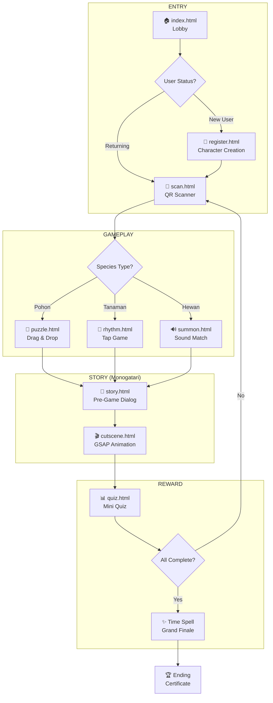
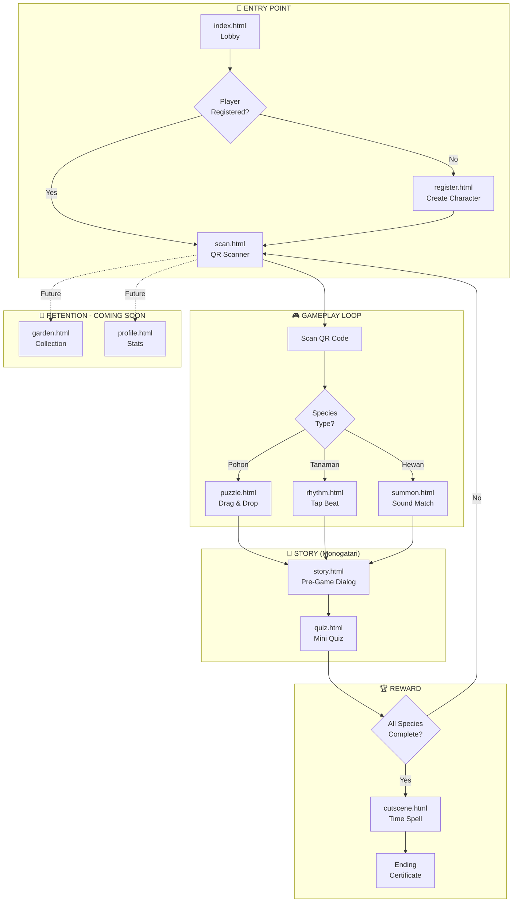
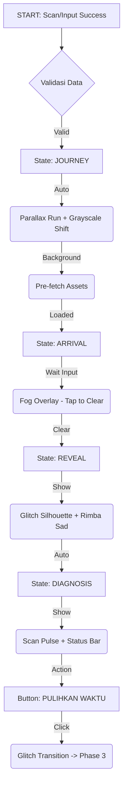
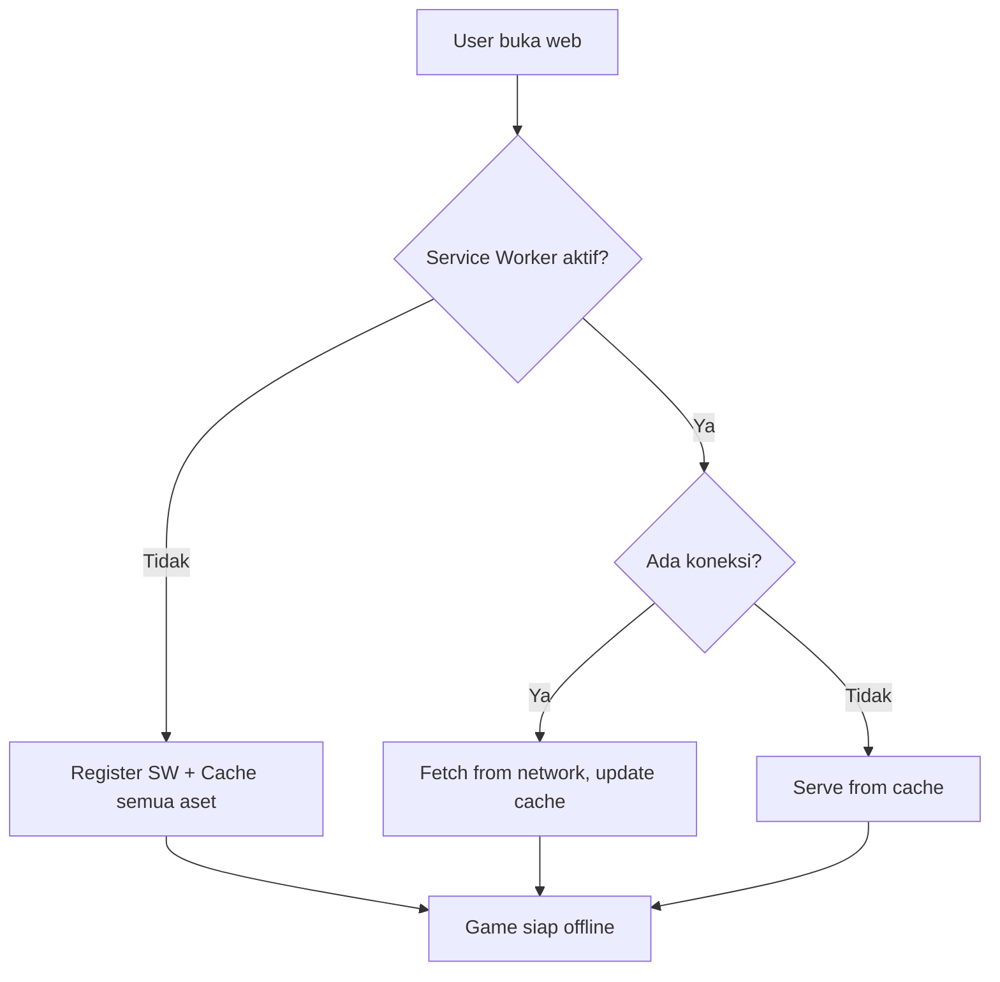

---
title: "Implementation Plan: Talking Forest V3"
subtitle: "Gamification Upgrade & Features"
author: "Antigravity Agent"
date: "31 Januari 2026 (Updated v2.0)"
geometry: margin=2cm
output: word_document
---

# 🌲 IMPLEMENTATION PLAN: Talking Forest V3 (Gamification Upgrade)

**Tanggal:** 31 Januari 2026 (Active Master Plan - Verified Final)  
**Tujuan:** Upgrade halaman pengunjung menjadi web edukasi RPG  
**Fokus Utama:** Core Gameplay (Scan -> Puzzle -> Kuis -> Time Spell)  
**Total Halaman Dokumen:** ~12.000+ baris (Dokumen Utama)

---

# ⭐⭐⭐ BLUEPRINT MANAGERIAL (KHUSUS FERDANA) ⭐⭐⭐

> [!TIP]
> ## 🎯 TUJUAN BAGIAN INI
> Bagian ini dibuat khusus untuk **Ferdana** (Project Manager / Owner) agar:
> 1. Mengerti sistem IT dengan bahasa **Bisnis/Akuntansi**
> 2. Tidak 100% tergantung pada programmer/AI
> 3. Bisa mengambil keputusan strategis tanpa bingung istilah teknis
> 4. Memiliki **Control Checklist** untuk memvalidasi pekerjaan

---

## 🏢 ANALOGI SISTEM (BAHASA AKUNTANSI)

Biar mudah dipahami, mari kita bedah "Talking Forest V3" dengan analogi Sistem Akuntansi yang biasa kamu pakai:

| Komponen IT                                 | Analogi Akuntansi               | Penjelasan                                                                                                                                                        |
| :------------------------------------------ | :------------------------------ | :---------------------------------------------------------------------------------------------------------------------------------------------------------------- |
| **DATABASE (Firebase)**                     | **BUKU BESAR (General Ledger)** | Tempat semua data "sah" disimpan. Tidak boleh ada data yang masuk tanpa "Jurnal" (transaksi) yang valid. Ini adalah *Source of Truth*.                            |
| **FRONTEND (HTML/JS)**                      | **FORMULIR & KWITANSI**         | Tampilan antarmuka tempat user (pengunjung) mengisi data. Frontend cuma "kertas formulir", dia tidak menyimpan data, cuma mengirim ke Buku Besar.                 |
| **BACKEND LOGIC (JS)**                      | **SOP & AUDITOR LAPORAN**       | Peraturan yang mengecek validitas data. Misal: "Debit Kredit harus balance". Di IT: "User harus login sebelum main", "Jawaban kuis harus benar baru dapat poin".  |
| **API (Application Programming Interface)** | **KURIR ANTAR DIVISI**          | Petugas yang membawa formulir dari meja kasir (Frontend) ke ruang arsip (Database). Dia memastikan data sampai dengan selamat.                                    |
| **STATE MANAGEMENT**                        | **NERACA SALDO SEMENTARA**      | Catatan coretan sementara sebelum diposting ke Buku Besar. Contoh: Saat main game, skor dicatat di RAM (State) dulu, kalau game selesai baru di-save ke Database. |
| **DEPLOYMENT**                              | **PUBLIKASI LAPORAN TAHUNAN**   | Saat sistem yang sudah jadi dipindahkan dari "Draft" (Localhost) ke "Publik" (Internet) agar bisa dilihat semua orang.                                            |

---

## 🗺️ BLUEPRINT ALUR KERJA (FLOWCHART MANAJERIAL)

Ini adalah "SOP" bagaimana sistem ini bekerja dari sudut pandang User Journey. Kamu bisa gunakan ini untuk **Audit Flow** saat testing.

### 1. FASE ONBOARDING (Pendaftaran Nasabah Baru)
```mermaid
graph TD
    A[Mulai] --> B{Punya Akun?}
    B -- Sudah --> C[Login via Email/Google]
    B -- Belum --> D[Form Registrasi]
    D --> E[Validasi Data]
    E -- Error --> D
    E -- Valid --> F[Buat Akun di Buku Besar]
    F --> G[Intro Story (Monogatari)]
    G --> H[Tutorial Singkat]
    H --> I[Masuk Dasbor Utama]
```

### 2. FASE GAMEPLAY (Transaksi Harian)
```mermaid
graph TD
    A[Scan QR Code] --> B{Validasi Kode}
    B -- Kode Salah --> A
    B -- Kode Benar --> C[Buka Halaman Species]
    C --> D[Baca/Dengar Materi]
    D --> E[Main Mini-Game (Puzzle)]
    E -- Menang --> F[Kuis Pengetahuan]
    F -- Skor 100 --> G[Dapat Badge & XP (Posting Jurnal)]
    G --> H[Update Leaderboard]
```

---

## 📋 CHECKLIST KEMANDIRIAN (AGAR TIDAK TERGANTUNG AI)

Kamu bisa melakukan hal-hal ini SENDIRI tanpa perlu minta coding ulang:

### ✅ 1. MENGGANTI TEKS DIALOG/CERITA
*   **File:** `public/assets/data/dialogs.json` & `folklore.json`
*   **Cara:** Buka file di VS Code, cari teksnya, ganti isinya. Jangan hapus tanda kutip `""`.
*   **Analogi:** Seperti mengedit deskripsi di baris Excel. Asal tidak geser kolom, aman.

### ✅ 2. MENAMBAH SOAL KUIS BARU
*   **File:** `public/assets/data/quizzes.json`
*   **Cara:** Copy satu blok soal `{ ... }`, paste di bawahnya, ganti pertanyaannya.
*   **Analogi:** Copy-paste baris transaksi di jurnal, lalu ganti nominal dan keterangannya.

### ✅ 3. MENGGANTI GAMBAR/ASET
*   **Folder:** `public/assets/images/`
*   **Cara:** Timpa file gambar lama dengan gambar baru. **SYARAT:** Nama file harus SAMA PERSIS (huruf besar/kecilnya).
*   **Analogi:** Mengganti lampiran bukti potong pajak di map arsip. Asal nomor referensinya sama, orang tidak akan tahu isinya berubah.

### ✅ 4. CEK APAKAH SISTEM BERJALAN BENAR (AUDIT)
*   **Cara:** Buka Chrome, tekan `F12` (Developer Tools), lihat tab `Console`.
*   **Indikator:**
    *   Teks Merah = **ERROR** (Neraca tidak balance, ada masalah kritis).
    *   Teks Kuning = **WARNING** (Ada catatan audit, tapi sistem masih jalan).
    *   Teks Putih/Abu = **INFO** (Log aktivitas normal).

---

## 🛡️ PROTOKOL DARURAT (EMERGENCY SOP)

Apa yang harus dilakukan kalau sistem error saat presentasi/dipakai user?

**1. REFRESH PAKSA (Hard Reload)**
*   **Shortcut:** `Ctrl + Shift + R`
*   **Fungsi:** Menghapus cache lama dan memaksa browser ambil "formulir" terbaru.
*   **Kapan dipakai:** Tampilan berantakan, gambar tidak muncul, update barusan tidak terlihat.

**2. CLEAR STORAGE (Reset Data Lokal)**
*   **Shortcut:** `F12` -> Tab `Application` -> `Storage` -> Klik `Clear site data`
*   **Fungsi:** Menghapus "coretan neraca sementara" di browser user.
*   **Kapan dipakai:** Game stuck, loading terus menerus, tidak bisa login.

**3. SWITCH TO OFFLINE MODE**
*   **Sistem:** PWA (Progressive Web App) sudah otomatis menyimpan data.
*   **Fungsi:** Tetap bisa buka halaman yang pernah dibuka meski internet mati.
*   **Kapan dipakai:** Saat presentasi di hutan sinyal jelek. *Pastikan sudah buka webnya sekali saat ada sinyal.*

---

## 🚦 DASHBOARD PROGRESS (STATUS PROYEK SAAT INI)

Update: **31 Januari 2026**

| Modul                      | Progress | Status Akuntansi      | Catatan                                  |
| :------------------------- | :------- | :-------------------- | :--------------------------------------- |
| **Fundamental (HTML/CSS)** | 100%     | **Closed Book**       | Aset dasar sudah siap semua.             |
| **Logic Game (JS)**        | 80%      | **Adjusting Entries** | Perlu tuning di bagian puzzle mechanics. |
| **Content (Cerita/Kuis)**  | 10%      | **WIP Inventory**     | Butuh input dari Naju (Writing).         |
| **Database Integration**   | 60%      | **Reconciliation**    | Sinkronisasi data user & save state.     |

---

> [!IMPORTANT]
> **PESAN UNTUK FERDANA:**
> Jangan terintimidasi dengan kode. Anggap kode itu cuma **Standard Operating Procedure (SOP)** yang ditulis dalam bahasa Inggris yang kaku.
>
> Tugasmu bukan menulis SOP-nya (itu tugasku & Naju), tapi memastikan **Alur Bisnis**-nya (User Experience) masuk akal dan **Laporannya** (Output Game) sesuai ekspektasi.
>
> Kalau ada bug, itu cuma "Selisih Pembukuan". Kita cari, kita koreksi (Adjustment), kita posting ulang. **Simple.**

---


# ⭐⭐⭐ PENGANTAR KHUSUS UNTUK NAJU ⭐⭐⭐

> [!CAUTION]
> ## 🚨 BACA INI DULU SEBELUM LANJUT! 🚨
> 
> Halo Naju! Dokumen ini SANGAT PANJANG (10.000+ baris).
> Kamu **TIDAK PERLU** baca semuanya sekaligus.
> 
> **Baca sesuai apa yang mau dikerjakan saja!**

---

## 📖 CARA PAKAI DOKUMEN INI

### Langkah 1: Tentukan Mau Ngapain

| Kalau mau...                    | Baca bagian...                                      |
| :------------------------------ | :-------------------------------------------------- |
| Paham project secara umum       | [RINGKASAN EKSEKUTIF](#-ringkasan-eksekutif)        |
| Edit dialog/teks                | [PANDUAN EDIT JSON](#-panduan-edit-json-untuk-naju) |
| Bikin soal kuis                 | [TEMPLATE KUIS](#-template-soal-kuis)               |
| Tau file mana yang boleh diedit | [DAFTAR FILE LENGKAP](#-daftar-file--aturan-edit)   |
| Ikuti proses harian             | [LANGKAH KERJA HARIAN](#-langkah-kerja-harian)      |

### Langkah 2: Cari Pakai Ctrl+F
Tekan **Ctrl + F** lalu ketik kata kunci. Contoh:
- Ketik "ZONA AMAN" untuk cari bagian yang boleh diedit
- Ketik "JANGAN EDIT" untuk cari bagian berbahaya
- Ketik nama file (misal "dialogs.json") untuk cari penjelasannya

### Langkah 3: Ikuti Simbol-Simbol

```
╔═══════════════════════════════════════════════════════════════╗
║                    🎨 PANDUAN SIMBOL                          ║
╠═══════════════════════════════════════════════════════════════╣
║                                                               ║
║  ⭐ = ZONA AMAN NAJU (Boleh edit!)                            ║
║  🟢 = Boleh edit dengan hati-hati                             ║
║  🟡 = Hati-hati, tanya dulu kalau ragu                        ║
║  🔴 = JANGAN EDIT! (Bisa rusak)                               ║
║  ⬛ = Abaikan saja (file sistem)                              ║
║                                                               ║
║  ✅ = Sudah selesai / sudah ada                               ║
║  ❌ = Belum ada / perlu dibuat                                ║
║  🟡 = Sedang dikerjakan                                       ║
║                                                               ║
╚═══════════════════════════════════════════════════════════════╝
```

---

## 🔴 ATURAN EMAS UNTUK NAJU

```
╔═══════════════════════════════════════════════════════════════╗
║               🔴 5 ATURAN YANG HARUS DIINGAT 🔴               ║
╠═══════════════════════════════════════════════════════════════╣
║                                                               ║
║  1. HANYA edit file yang ada tanda ⭐ ZONA AMAN               ║
║     → File JSON di folder assets/data/                        ║
║                                                               ║
║  2. JANGAN SENTUH file .js (JavaScript)                       ║
║     → Ini kode program, 1 karakter salah = rusak semua!       ║
║                                                               ║
║  3. SELALU BACKUP sebelum edit                                ║
║     → Copy file dulu ke tempat lain sebelum ubah              ║
║                                                               ║
║  4. JANGAN HAPUS atau RENAME file apapun                      ║
║     → Nama file sudah terhubung dengan kode                   ║
║                                                               ║
║  5. RAGU? TANYA DULU!                                         ║
║     → Lebih baik tanya Ferdana/Antigravity daripada rusak     ║
║                                                               ║
╚═══════════════════════════════════════════════════════════════╝
```

---

## 📂 STRUKTUR FOLDER (Penjelasan Visual)

Ini adalah "peta" folder project kita. Bayangkan seperti lemari dengan laci-laci:

```
╔═══════════════════════════════════════════════════════════════════════════╗
║                        📂 STRUKTUR FOLDER PROJECT                         ║
║                     talking-forest-v2 - Uji Coba/                         ║
╠═══════════════════════════════════════════════════════════════════════════╣
║                                                                           ║
║  📂 public/                      ← 🏠 FOLDER UTAMA (semua file web)       ║
║  │                                                                        ║
║  ├── 📄 index.html               ← Halaman utama (Lobby / Login)          ║
║  ├── 📄 register.html            ← Form Pendaftaran (Alpine.js)           ║
║  ├── 📄 scan.html                ← Pintu Masuk (QR Scanner)               ║
║  ├── 📄 story.html               ← Visual Novel Engine (Monogatari)       ║
║  │                                                                        ║
║  ├── 📂 v3/                      ← 💎 FOLDER V3 (Fitur Baru)              ║
║  │   ├── 📄 garden.html          ← Halaman Koleksi User                   ║
║  │   └── 📄 profile.html         ← Halaman Statistik & Badge              ║
║  │                                                                        ║
║  ├── 📄 puzzle.html              ← Game 1: Susun Pohon                    ║
║  ├── 📄 rhythm.html              ← Game 2: Tebak Irama                    ║
║  ├── 📄 summon.html              ← Game 3: Tebak Bayangan                 ║
║  ├── 📄 quiz.html                ← Game 4: Evaluasi Belajar               ║
║  ├── 📄 cutscene.html            ← Game 5: Time Spell (Ending)            ║
║  │                                                                        ║
║  ├── 📂 assets/                  ← 📦 GUDANG ASET                         ║
║  │   │                                                                    ║
║  │   ├── 📂 data/                ← ⭐ ZONA AMAN NAJU (Edit di sini!)      ║
║  │   │   ├── 📄 species.json     ← Database Pohon/Hewan                   ║
║  │   │   ├── 📄 dialogs.json     ← Percakapan Rimba (Semua Scene)         ║
║  │   │   ├── 📄 quizzes.json     ← Bank Soal (3 level/species)            ║
║  │   │   ├── 📄 folklore.json    ← Cerita Rakyat                          ║
║  │   │   └── 📄 config.json      ← Pengaturan Global                      ║
║  │   │                                                                    ║
║  │   ├── 📂 images/              ← 🖼️ GAMBAR                              ║
║  │   │   ├── 📂 species/         ← Foto Asli (WebP Optimized)             ║
║  │   │   ├── 📂 ui/              ← Tombol & Background                    ║
║  │   │   └── 📂 monogatari/      ← Aset Visual Novel                      ║
║  │   │                                                                    ║
║  │   └── 📂 audio/               ← 🔊 SUARA                               ║
║  │       ├── 📂 sfx/             ← Efek Suara (Benar/Salah)               ║
║  │       └── 📂 bgm/             ← Musik Latar                            ║
║  │                                                                        ║
║  ├── 📂 js/                      ← ⚙️ MESIN PENGGERAK (Logic)             ║
║  │   │                                                                    ║
║  │   ├── 📂 v3/                  ← 🧠 Otak V3                             ║
║  │   │   ├── 📄 game-state.js    ← Penyimpan Data (Save Game)             ║
║  │   │   ├── 📄 player-api.js    ← Koneksi ke Firebase                    ║
║  │   │   ├── 📄 scan-logic.js    ← Logika Scanner                         ║
║  │   │   ├── 📂 mechanics/       ← Logika Mini-Game                       ║
║  │   │   └── 📂 monogatari/      ← Logika Visual Novel                    ║
║  │   │                                                                    ║
║  │   └── 📄 main.js              ← Penghubung Umum                        ║
║  │                                                                        ║
║  └── 📂 css/                     ← 🎨 TATA RIAS (Style)                   ║
║      ├── 📄 style.css            ← Makeup Utama                           ║
║      ├── 📄 game.css             ← Makeup Khusus Game                     ║
║      └── 📄 monogatari.css       ← Makeup Visual Novel                    ║
║                                                                           ║
╚═══════════════════════════════════════════════════════════════════════════╝
```

**Penjelasan Sederhana:**
- 📂 = Folder (seperti laci)
- 📄 = File (seperti kertas dalam laci)
- ⭐ = Boleh Naju edit
- 🔴 = Jangan sentuh!

---

## 🎮 ALUR KERJA GAME (Flowchart Visual)

Ini adalah urutan permainan dari awal sampai akhir:

```
┌─────────────────────────────────────────────────────────────────────────────┐
│                                                                             │
│                          🎮 ALUR PERMAINAN GAME                             │
│                                                                             │
└─────────────────────────────────────────────────────────────────────────────┘

                              ┌─────────────────┐
                              │  👤 USER BUKA   │
                              │   WEBSITE       │
                              │  index.html     │
                              └────────┬────────┘
                                       │
                                       ▼
                         ┌─────────────────────────┐
                         │                         │
                         │   ADA DATA TERSIMPAN?   │
                         │   (Pernah daftar?)      │
                         │                         │
                         └────────────┬────────────┘
                                      │
                    ┌─────────────────┴─────────────────┐
                    │                                   │
                    ▼                                   ▼
          ┌─────────────────┐                 ┌─────────────────┐
          │                 │                 │                 │
          │  ❌ BELUM       │                 │  ✅ SUDAH       │
          │  PERNAH DAFTAR  │                 │  PERNAH DAFTAR  │
          │                 │                 │                 │
          └────────┬────────┘                 └────────┬────────┘
                   │                                   │
                   ▼                                   │
          ┌─────────────────┐                          │
          │                 │                          │
          │  📝 REGISTRASI  │                          │
          │  register.html  │                          │
          │                 │                          │
          │  1. Pilih Avatar│                          │
          │  2. Isi Nama    │                          │
          │  3. Klik Daftar │                          │
          │                 │                          │
          └────────┬────────┘                          │
                   │                                   │
                   └───────────────┬───────────────────┘
                                   │
                                   ▼
                         ┌─────────────────┐
                         │                 │
                         │  📱 SCAN QR     │
                         │  scan.html      │
                         │                 │
                         │  Arahkan kamera │
                         │  ke QR di pohon │
                         │                 │
                         └────────┬────────┘
                                  │
                                  ▼
                      ┌───────────────────────┐
                      │                       │
                      │  🔍 QR TERDETEKSI!    │
                      │  Species: [Nama]      │
                      │                       │
                      └───────────┬───────────┘
                                  │
                                  ▼
                      ┌───────────────────────┐
                      │                       │
                      │  JENIS SPECIES APA?   │
                      │                       │
                      └───────────────────────┘
                                  │
          ┌───────────────────────┼───────────────────────┐
          │                       │                       │
          ▼                       ▼                       ▼
  ┌───────────────┐     ┌───────────────┐     ┌───────────────┐
  │               │     │               │     │               │
  │  🌲 POHON     │     │  🌸 TANAMAN   │     │  🦁 HEWAN     │
  │               │     │               │     │               │
  │  puzzle.html  │     │  rhythm.html  │     │  summon.html  │
  │               │     │               │     │               │
  │  Drag & Drop  │     │  Tap Rhythm   │     │  Tebak Suara  │
  │  Bagian Pohon │     │  Ikuti Irama  │     │  & Bayangan   │
  │               │     │               │     │               │
  └───────┬───────┘     └───────┬───────┘     └───────┬───────┘
          │                     │                     │
          └─────────────────────┼─────────────────────┘
                                │
                                ▼
                      ┌─────────────────┐
                      │                 │
                      │  ❓ KUIS        │
                      │  quiz.html      │
                      │                 │
                      │  Jawab 3-5 soal │
                      │  tentang species│
                      │                 │
                      └────────┬────────┘
                               │
                               ▼
                      ┌─────────────────┐
                      │                 │
                      │  📖 CERITA      │
                      │  story.html     │
                      │                 │
                      │  Rimba bercerita│
                      │  Folklore muncul│
                      │                 │
                      └────────┬────────┘
                               │
                               ▼
                      ┌─────────────────┐
                      │                 │
                      │  🎁 REWARD      │
                      │                 │
                      │  +1 Species     │
                      │  +50 XP         │
                      │  Badge?         │
                      │                 │
                      └────────┬────────┘
                               │
                               ▼
                   ┌───────────────────────┐
                   │                       │
                   │  SUDAH KUMPUL SEMUA?  │
                   │  (11+ species)        │
                   │                       │
                   └───────────────────────┘
                               │
              ┌────────────────┴────────────────┐
              │                                 │
              ▼                                 ▼
      ┌───────────────┐                 ┌───────────────┐
      │               │                 │               │
      │  ❌ BELUM     │                 │  ✅ SUDAH!    │
      │  Scan lagi... │                 │               │
      │  ↩ Kembali ke │                 │  ✨ TIME SPELL│
      │  scan.html    │                 │  cutscene.html│
      │               │                 │               │
      └───────────────┘                 │  Grand Finale │
                                        │  Pohon Tumbuh │
                                        │               │
                                        └───────┬───────┘
                                                │
                                                ▼
                                        ┌───────────────┐
                                        │               │
                                        │  🏆 ENDING    │
                                        │               │
                                        │  Sertifikat   │
                                        │  Share Card   │
                                        │  Leaderboard  │
                                        │               │
                                        └───────────────┘
```

---

## 📋 DAFTAR ISI DOKUMEN

| BAB      | Judul                                                        | Deskripsi                                                              |
| -------- | ------------------------------------------------------------ | ---------------------------------------------------------------------- |
| **I**    | [KONSEP & METODOLOGI](#-bab-i-konsep--metodologi)            | GDLC Analysis, 5-Fase Full Stack, High Concept                         |
| **II**   | [GAME DESIGN & EXPERIENCE](#-bab-ii-game-design--experience) | User Journey, State Machine, Visual Layouts (40 Screen), TTS Narration |
| **III**  | [ARSITEKTUR TEKNIS](#-bab-iii-arsitektur-teknis)             | Tech Stack, Project Structure, API Functions                           |
| **IV**   | [DATA & KEBERLANJUTAN](#-bab-iv-data--keberlanjutan)         | Database Design, Privacy (UU PDP), Capacity Planning                   |
| **V**    | [QUALITY ASSURANCE](#-bab-v-quality-assurance-qa)            | Performance, Security, Browser Compatibility, A11Y                     |
| **VI**   | [ROADMAP PENGERJAAN](#-bab-vi-roadmap-pengerjaan)            | Sprint 0-9 Detail Tasks                                                |
| **VII**  | [PANDUAN EDIT JSON](#-panduan-edit-json-untuk-naju)          | ⭐ Zona Aman Naju - Tutorial edit konten                                |
| **VIII** | [TEMPLATE & CONTOH](#-template--contoh)                      | ⭐ Copy-paste template untuk konten baru                                |

---

## 📚 DOKUMEN PENDUKUNG (ARTIFACTS)

> [!IMPORTANT]
> Dokumen-dokumen berikut adalah panduan detail untuk setiap aspek pengembangan.
> Semua dokumen saling terhubung dan harus dibaca bersama Implementation Plan ini.

### 🎯 Struktur Cerita & Gameplay

| Dokumen                   | Isi                                      | Path                                    |
| :------------------------ | :--------------------------------------- | :-------------------------------------- |
| `story_structure_plan.md` | Alur cerita 3 chapter + ending           | [Link](file:///story_structure_plan.md) |
| `story_content_plan.md`   | **[BARU]** Dialog, Folklore, Misi Budaya | [Link](file:///story_content_plan.md)   |
| `minigames_design.md`     | Detail mekanik Puzzle, Rhythm, Sound     | [Link](file:///minigames_design.md)     |
| `animation_specs.md`      | Spesifikasi animasi GSAP + CSS           | [Link](file:///animation_specs.md)      |
| `cutscene_plan.md`        | **[BARU]** Rencana GSAP Cutscene         | [Link](file:///cutscene_plan.md)        |

### 📊 Analisis Edukatif per Chapter

| Dokumen                | Isi                                                          | Path                                 |
| :--------------------- | :----------------------------------------------------------- | :----------------------------------- |
| `chapter1_analysis.md` | Potensi edukatif POHON (Sains, Ekologi, Kearifan Lokal)      | [Link](file:///chapter1_analysis.md) |
| `chapter2_analysis.md` | Potensi edukatif TANAMAN (Botani, Etnobotani, Penyerbukan)   | [Link](file:///chapter2_analysis.md) |
| `chapter3_analysis.md` | Potensi edukatif HEWAN (Zoologi, Rantai Makanan, Konservasi) | [Link](file:///chapter3_analysis.md) |

### 🚀 Rencana Ekspansi Fitur

| Dokumen                          | Isi                                           | Path                                           |
| :------------------------------- | :-------------------------------------------- | :--------------------------------------------- |
| `feature_expansion_plan.md`      | Content Expansion, Multiplayer, Accessibility | [Link](file:///feature_expansion_plan.md)      |
| `fase3_puzzle_plan.md`           | Detail teknis mekanik puzzle                  | [Link](file:///fase3_puzzle_plan.md)           |
| `phase_3_expansion_plan.md`      | Rencana fase 3 development                    | [Link](file:///phase_3_expansion_plan.md)      |
| `monogatari_integration_plan.md` | **[BARU]** Visual Novel story system          | [Link](file:///monogatari_integration_plan.md) |
| `tech_stack_v3.md`               | **[BARU]** AI Tools, Libraries, Framework     | [Link](file:///tech_stack_v3.md)               |

### 📦 Daftar Assets

| Dokumen                | Isi                                                 | Path                                 |
| :--------------------- | :-------------------------------------------------- | :----------------------------------- |
| `audio_assets_list.md` | Daftar 74+ audio files (SFX, BGM, Suara Hewan, TTS) | [Link](file:///audio_assets_list.md) |
| `image_assets_list.md` | Daftar 140+ gambar (Karakter, BG, UI, Puzzle)       | [Link](file:///image_assets_list.md) |
| `api_documentation.md` | Dokumentasi semua fungsi JavaScript                 | [Link](file:///api_documentation.md) |

### 📋 Tracking & Verifikasi

| Dokumen                     | Isi                                | Path                                      |
| :-------------------------- | :--------------------------------- | :---------------------------------------- |
| `task.md`                   | Checklist progress development     | [Link](file:///task.md)                   |
| `walkthrough.md`            | Dokumentasi hasil kerja            | [Link](file:///walkthrough.md)            |
| `verification_guide.md`     | Panduan testing                    | [Link](file:///verification_guide.md)     |
| `gap_analysis.md`           | **[BARU]** Audit folder vs rencana | [Link](file:///gap_analysis.md)           |
| `fase_5_time_spell_plan.md` | Detail Time Spell ending system    | [Link](file:///fase_5_time_spell_plan.md) |

---

### 📊 PROJECT STATUS DASHBOARD (Update 31 Januari 2026)

> [!IMPORTANT]
> **Last Update:** 31 Januari 2026 04:30 WIB
> Status ini otomatis di-update setiap kali ada perubahan signifikan pada project.

---

#### 📂 FOLDER STRUCTURE (Real-Time)

```
📂 public/
├── ✅ index.html          ← Lobby (17.6 KB)
├── ✅ scan.html           ← QR Scanner (19.3 KB)
├── ✅ story.html          ← Monogatari VN (1.7 KB) [INTEGRATED]
├── ✅ puzzle.html         ← Chapter 1 (9.9 KB)
├── ✅ rhythm.html         ← Chapter 2 (7.4 KB)
├── ✅ summon.html         ← Chapter 3 (7.4 KB)
├── ✅ quiz.html           ← Mini Quiz (7.6 KB)
├── ✅ cutscene.html       ← GSAP Cutscene (28 KB)
├── ✅ detail.html         ← Species Detail (8.8 KB)
├── ✅ register.html       ← User Registration (4.7 KB)
├── 📂 v3/                 ← V3 UI Components
│   ├── ✅ garden.html     ← User Collection
│   └── ✅ profile.html    ← User Profile
├── 📂 assets/
│   ├── 📂 monogatari/     ← [NEW] VN Assets
│   │   ├── 📂 characters/
│   │   ├── 📂 scenes/
│   │   └── 📂 audio/
│   ├── 📂 audio/          ← SFX & BGM Core
│   ├── 📂 images/         ← UI & Illustrations
│   └── ✅ map-base.jpg    ← Main Map Asset
├── 📂 js/v3/
│   │   └── ✅ quiz.js
│   ├── ❌ progress-manager.js  ← MISSING
│   └── ❌ ending-handler.js    ← MISSING
├── 📂 css/
│   ├── ✅ style.css        (11 KB)
│   ├── ✅ game.css         (5.2 KB)
│   ├── ✅ admin-cms.css    (21 KB)
│   ├── ✅ mobile.css       (0.6 KB)
│   └── ✅ monogatari.css   [NEW]
└── 📂 assets/
    ├── 📂 data/            (JSON files)
    ├── 📂 images/          (140+ gambar)
    ├── 📂 audio/           (74+ audio)
    └── 📂 monogatari/      [NEW - VN Assets]
        ├── 📂 characters/
        ├── 📂 scenes/
        └── 📂 audio/
```

---

#### 🚦 GAP TRACKER (Missing Components)

| Item                      | Type  | Priority | Dokumen Referensi           |
| :------------------------ | :---- | :------- | :-------------------------- |
| `garden.html`             | HTML  | 🟡 Medium | `story_content_plan.md`     |
| `profile.html`            | HTML  | 🟡 Medium | `story_content_plan.md`     |
| `progress-manager.js`     | JS    | 🔴 High   | `api_documentation.md`      |
| `ending-handler.js`       | JS    | 🔴 High   | `fase_5_time_spell_plan.md` |
| `cultural-missions.json`  | Data  | 🟡 Medium | `story_content_plan.md`     |
| Character Sprites (Rimba) | Asset | 🔴 High   | `animation_specs.md`        |
| Animal Sound Files        | Asset | 🟡 Medium | `audio_assets_list.md`      |

---

#### 🎬 GAME FLOW DIAGRAM (Updated)



---

#### 🌲 CHAPTER CONTENT STATUS

| Chapter        | Mini-Game          | HTML                 | JS            | Status    | Species   |
| :------------- | :----------------- | :------------------- | :------------ | :-------- | :-------- |
| **1: POHON**   | Puzzle Drag & Drop | ✅ `puzzle.html`      | ✅ `puzzle.js` | 🟢 Ready   | 8 planned |
| **2: TANAMAN** | Rhythm Tap         | ✅ `rhythm.html`      | ✅ `rhythm.js` | 🟢 Ready   | 8 planned |
| **3: HEWAN**   | Sound & Shadow     | ✅ `summon.html`      | ✅ `summon.js` | 🟢 Ready   | 9 planned |
| **FINALE**     | Time Spell         | ⚠️ In `cutscene.html` | ❌ Missing     | 🟡 Partial | -         |

---

#### 🎨 ASSET STATUS

| Kategori           | Target      | Ready | Missing | Source      |
| :----------------- | :---------- | :---- | :------ | :---------- |
| **Karakter Rimba** | 10 ekspresi | 0     | 10      | Leonardo.ai |
| **Player Avatar**  | 12 variasi  | 0     | 12      | Leonardo.ai |
| **Background**     | 15 scenes   | 3     | 12      | Midjourney  |
| **Puzzle Pieces**  | 24 parts    | 6     | 18      | AI Generate |
| **Audio SFX**      | 25 files    | 5     | 20      | Freesound   |
| **BGM**            | 5 tracks    | 0     | 5       | Suno AI     |
| **Animal Sounds**  | 9 calls     | 0     | 9       | Xeno-canto  |

---

#### 🛤️ DEVELOPMENT PROGRESS

```
FASE 1: Foundation     ████████████████████ 100%
FASE 2: Story Engine   ████████████░░░░░░░░  60%
FASE 3A: Puzzle        ████████████████████ 100%
FASE 3B: Rhythm        ████████████████████ 100%
FASE 3C: Summon        ████████████████████ 100%
FASE 4: Quiz           ████████████████░░░░  80%
FASE 5: Time Spell     ██████░░░░░░░░░░░░░░  30%
FASE 6: Monogatari     ████████░░░░░░░░░░░░  40%
FASE 7: Polish         ░░░░░░░░░░░░░░░░░░░░   0%
─────────────────────────────────────────────
OVERALL:               ████████████░░░░░░░░  63%
```

---

#### 🆕 RECENT UPDATES (Changelog)

| Tanggal     | Update                        | Files Changed                                     |
| :---------- | :---------------------------- | :------------------------------------------------ |
| 31 Jan 2026 | **Dokumentasi untuk Naju**    | `PANDUAN_LENGKAP_NAJU.md`, `TEMPLATE_JSON.md`, +2 |
| 31 Jan 2026 | Implementation Plan v2.0      | Header, navigation, links updated                 |
| 30 Jan 2026 | Monogatari folder restructure | `story.html`, `js/v3/monogatari/*`                |
| 30 Jan 2026 | Gap Analysis created          | `gap_analysis.md`                                 |
| 29 Jan 2026 | Cutscene Engine created       | `cutscene.html`, `cutscene_plan.md`               |
| 29 Jan 2026 | Story Content Plan created    | `story_content_plan.md`                           |
| 28 Jan 2026 | Animation Specs documented    | `animation_specs.md`                              |

---

## 🚀 RINGKASAN EKSEKUTIF (Untuk Mitra & Dosen)

> [!TIP]
> **Apa itu Dokumen Ini?**
> Ini adalah "buku resep" lengkap untuk membangun Talking Forest V3. Mulai dari desain visual, cara kerja sistem, hingga langkah-langkah teknis pemrograman.

### 🌟 Visi Proyek
Mengubah wisata hutan biasa menjadi **petualangan interaktif** di mana pengunjung bisa "berbicara" dengan pohon dan hewan menggunakan smartphone mereka.

### 💡 Manfaat Utama
1.  **Untuk Desa (Mitra):** Tanpa perlu pemandu wisata standby 24 jam. Hutan "bercerita" sendiri.
2.  **Untuk Pengunjung:** Pengalaman wisata yang tidak membosankan, edukatif, dan kekinian.
3.  **Untuk Tim (PKM-PM):** Penerapan teknologi tepat guna yang *sustainable* (berkelanjutan).

### 🔑 Fitur Kunci
| Fitur             | Fungsi Sederhana                                         |
| :---------------- | :------------------------------------------------------- |
| **Scan QR**       | Seperti scan menu di restoran, tapi keluar cerita pohon. |
| **Puzzle & Kuis** | Game sederhana untuk anak-anak agar tidak bosan.         |
| **Suara (TTS)**   | Pohon bisa "bersuara" menceritakan kisahnya.             |
| **Offline Mode**  | Tetap bisa main walau tidak ada sinyal internet.         |
| **Admin Katalog** | Pihak desa bisa ganti cerita/foto tanpa koding.          |

---


# 📚 BAB I: KONSEP & METODOLOGI
----------------------------------------------------------------

## 🎮 ANALISIS GDLC (Game Development Life Cycle)

> [!IMPORTANT]
> Section ini memvalidasi Implementation Plan terhadap metodologi **6-fase GDLC** khusus untuk game development.
>
> 💡 **Penjelasan untuk Awam:**
> Bayangkan membuat game seperti **membangun rumah**:
> 1. **Ideation:** Menggambar sketsa awal.
> 2. **Pre-Production:** Membuat blueprint detail (dokumen ini).
> 3. **Production:** Tukang mulai bekerja (coding & desain).
> 4. **Testing:** Cek apakah atap bocor (uji coba).
> 5. **Launch:** Syukuran rumah baru (promosi).
> 6. **Live-Ops:** Merawat rumah agar tetap bagus (update).

---

### 📊 GAP ANALYSIS: 6 FASE GDLC vs IMPLEMENTATION PLAN

| Fase | Nama                              | Status di Plan   | Gap/Catatan                                        |
| ---- | --------------------------------- | ---------------- | -------------------------------------------------- |
| 1    | Inisiasi & Perencanaan (Ideation) | ✅ LENGKAP        | Konsep, target audiens sudah ada                   |
| 2    | Pra-Produksi (Pre-Production)     | 🟡 PERLU TAMBAHAN | GDD ada, tapi Prototyping/Graybox belum detail     |
| 3    | Produksi (Production)             | ✅ LENGKAP        | Coding, Asset, Audio sudah detail                  |
| 4    | Pengujian (Testing & QA)          | 🟡 PERLU TAMBAHAN | Testing checklist ada, tapi Alpha/Beta belum jelas |
| 5    | Peluncuran (Launch)               | 🟡 PERLU TAMBAHAN | Deploy ada, tapi launch marketing belum            |
| 6    | Pasca-Produksi (Live-Ops)         | 🔴 BELUM ADA      | Maintenance minimal, Admin Dashboard belum         |

---

### 🎯 FASE 1: INISIASI & PERENCANAAN (Sudah Lengkap ✅)

**High-Concept Statement:**

> **"Talking Forest V3: Edu-Tourism RPG"**  
> Pengunjung menjadi **Ranger** yang bertugas menyelamatkan roh-roh pohon yang tertidur melalui ritual pemindaian, puzzle edukasi, dan mantra waktu. Setiap pohon yang diselamatkan mengungkap cerita rakyat lokal dan pesan moral tentang pelestarian alam.

**Target Audiens:**

| Segmen       | Karakteristik          | Preferensi                                  |
| ------------ | ---------------------- | ------------------------------------------- |
| **Primer**   | Anak-anak (8-12 tahun) | Visual menarik, reward sering, puzzle mudah |
| **Sekunder** | Remaja (13-18 tahun)   | Kompetisi (leaderboard), cerita menarik     |
| **Tersier**  | Keluarga wisatawan     | Pengalaman bersama, foto-able moment        |

**Platform Decision:**

| Platform   | Keputusan | Alasan                                      |
| ---------- | --------- | ------------------------------------------- |
| Web Mobile | ✅ DIPILIH | Zero install, akses via QR, support offline |
| Native App | ❌ Ditolak | Butuh download, maintenance berat           |
| PWA        | 🟡 Future  | Bisa ditambah setelah MVP stable            |

---

### 📐 FASE 2: PRA-PRODUKSI (BARU DITAMBAHKAN)

#### 2.1 GAME DESIGN DOCUMENT (GDD) - Sudah Ada ✅

Implementation Plan ini berfungsi sebagai GDD. Key components:
- ✅ Core Loop (Scan → Puzzle → Quiz → Spell → Story)
- ✅ Progression System (XP, Level, Rank)
- ✅ Reward System (Badge, Collection, Leaderboard)
- ✅ Narrative (Dialog Rimba, Folklore)

#### 2.2 PROTOTYPING (GRAYBOXING) - BARU DITAMBAHKAN

**Apa itu Grayboxing?**
Membuat versi "kotak-kotak" dulu sebelum aset final, untuk test UX dan gameplay feel.

**Graybox Checklist:**

| Fitur                    | Graybox Version                                     | Test Focus                  |
| ------------------------ | --------------------------------------------------- | --------------------------- |
| **Puzzle Drag & Drop**   | Kotak warna (Merah=Akar, Hijau=Daun, Coklat=Batang) | Touch responsiveness di HP  |
| **Dialog Popup**         | Kotak abu-abu dengan teks                           | Posisi, ukuran, keterbacaan |
| **Time Spell Animation** | Kotak membesar (scale)                              | Performance di HP kentang   |
| **Bottom Navigation**    | Kotak dengan emoji icon                             | Tab switching, active state |

**Graybox HTML Template:**

```html
<!-- graybox-puzzle.html -->
<!DOCTYPE html>
<html>
<head>
  <meta name="viewport" content="width=device-width, initial-scale=1.0">
  <script src="https://cdn.tailwindcss.com"></script>
  <!-- GSAP for Smooth Animations -->
  <script src="https://cdnjs.cloudflare.com/ajax/libs/gsap/3.12.2/gsap.min.js"></script>
  <title>Graybox: Puzzle Test</title>
</head>
<body class="bg-gray-100 min-h-screen p-4">
  
  <!-- Drop Zone (Siluet Pohon) -->
  <div class="bg-gray-300 h-64 rounded-lg mb-4 flex items-center justify-center">
    <div id="dropzone-akar" class="w-20 h-12 bg-gray-400 mx-2 border-2 border-dashed">AKAR</div>
    <div id="dropzone-batang" class="w-12 h-24 bg-gray-400 mx-2 border-2 border-dashed">BATANG</div>
    <div id="dropzone-daun" class="w-24 h-20 bg-gray-400 mx-2 border-2 border-dashed">DAUN</div>
  </div>
  
  <!-- Inventory (Draggable) -->
  <div class="flex justify-center gap-4">
    <div draggable="true" class="w-16 h-16 bg-red-500 rounded cursor-move flex items-center justify-center text-white text-xs">AKAR</div>
    <div draggable="true" class="w-16 h-16 bg-yellow-700 rounded cursor-move flex items-center justify-center text-white text-xs">BATANG</div>
    <div draggable="true" class="w-16 h-16 bg-green-500 rounded cursor-move flex items-center justify-center text-white text-xs">DAUN</div>
  </div>
  
  <!-- Test Log -->
  <div id="log" class="mt-4 p-2 bg-black text-green-400 font-mono text-xs h-32 overflow-auto">
    [LOG] Graybox loaded. Try drag & drop!
  </div>
  
  <script>
    // Simple drag & drop test
    document.querySelectorAll('[draggable]').forEach(item => {
      item.addEventListener('dragstart', (e) => {
        e.dataTransfer.setData('text/plain', e.target.textContent);
        log('Dragging: ' + e.target.textContent);
      });
    });
    
    document.querySelectorAll('[id^=dropzone]').forEach(zone => {
      zone.addEventListener('dragover', (e) => e.preventDefault());
      zone.addEventListener('drop', (e) => {
        e.preventDefault();
        const data = e.dataTransfer.getData('text/plain');
        log('Dropped ' + data + ' on ' + zone.id);
        if (zone.id.includes(data.toLowerCase())) {
          zone.classList.add('bg-green-300');
          log('✓ CORRECT!');
        } else {
          log('✗ Wrong placement');
        }
      });
    });
    
    function log(msg) {
      document.getElementById('log').innerHTML += '\n[LOG] ' + msg;
      document.getElementById('log').scrollTop = document.getElementById('log').scrollHeight;
    }
  </script>
</body>
</html>
```

**Graybox Testing Schedule:**

| Hari | Test               | Device     | Checklist                                  |
| ---- | ------------------ | ---------- | ------------------------------------------ |
| 1    | Puzzle drag & drop | HP Android | [ ] Touch works [ ] No lag                 |
| 2    | Dialog popup       | HP Android | [ ] Readable [ ] Tap to close              |
| 3    | Navigation         | HP Android | [ ] All tabs work [ ] Active state visible |
| 4    | Full flow          | HP Android | [ ] Complete without crash                 |

---

### 🔧 FASE 3: PRODUKSI (Sudah Lengkap ✅)

**Yang Sudah Ada:**
- ✅ 10 Fase Sprint dengan detail task
- ✅ 50+ API Functions
- ✅ Animation Specs (GSAP)
- ✅ Audio Design

**Tambahan: Production Milestones**


---

### 🧪 FASE 4: PENGUJIAN (BARU DILENGKAPI)

#### 4.1 ALPHA TESTING (Internal)

**Siapa:** Tim PKM-PM  
**Dimana:** Browser laptop  
**Kapan:** Setelah setiap fase selesai  

| Test             | Browser         | Tool        |
| ---------------- | --------------- | ----------- |
| Desktop          | Chrome, Edge    | DevTools    |
| Mobile Emulation | Chrome DevTools | Device Mode |
| Performance      | Chrome          | Lighthouse  |

**Alpha Test Criteria:**

- [ ] Semua button clickable
- [ ] Semua dialog muncul
- [ ] Semua navigation works
- [ ] No console errors
- [ ] No visual broken

#### 4.2 BETA TESTING (Lapangan)

**Siapa:** Novan, Nikar, dan Naju  
**Dimana:** Lokasi wisata + rumah  
**Kapan:** 1 minggu sebelum launch  

**Beta Test Devices:**

| Device             | Spesifikasi         | Purpose             |
| ------------------ | ------------------- | ------------------- |
| **HP Kentang**     | RAM 2GB, Android 9  | Performance minimum |
| **HP Standar**     | RAM 4GB, Android 11 | Target utama        |
| **iPhone SE**      | iOS 14+             | iOS compatibility   |
| **Tablet Android** | 8" screen           | Tablet layout       |

#### 4.3 LOCAL DEVELOPMENT (Cara Test di HP)
> **Supaya bisa test fitur kamera/scan di HP local:**
1.  Pastikan Laptop & HP di satu Wi-Fi.
2.  Cek IP Laptop (misal: `192.168.1.6`).
3.  Jalankan Live Server (port 5500).
4.  Buka di Chrome HP: `http://192.168.1.6:5500`.

**Beta Test Scenarios:**

| No  | Scenario      | Steps                       | Pass Criteria            |
| --- | ------------- | --------------------------- | ------------------------ |
| 1   | Outdoor Scan  | Scan QR di bawah matahari   | QR terbaca dalam 5 detik |
| 2   | Poor Signal   | Main dengan sinyal 1 bar    | LocalStorage save works  |
| 3   | Full Journey  | Register sampai dapat badge | Tidak crash 0 error      |
| 4   | Battery Drain | Main 15 menit               | Battery drop < 10%       |
| 5   | Multi-user    | 3 orang scan bersamaan      | Semua berhasil           |

### 📝 Beta Feedback Form

| Kategori     | Pertanyaan                                 | Tipe Jawaban         |
| ------------ | ------------------------------------------ | -------------------- |
| **Koneksi**  | Apakah proses load awal cepat (< 3 detik)? | Ya / Tidak           |
| **Gameplay** | Apakah Puzzle mudah dimainkan di HP?       | ⭐ 1-5                |
| **Gameplay** | Apakah soal Kuis cukup jelas?              | ⭐ 1-5                |
| **Teknis**   | Apakah HP menjadi panas saat Time Spell?   | Ya / Hangat / Normal |
| **Bug**      | Apakah ada tombol yang tidak bisa diklik?  | [Deskripsi]          |
| **Overall**  | Rating kepuasan bermain                    | ⭐ 1-5                |
## 🔄 ANALISIS 5-FASE FULL STACK DEVELOPMENT

> [!IMPORTANT]
> Section ini memvalidasi Implementation Plan terhadap metodologi 5-fase full-stack development.

---

### 📊 GAP ANALYSIS: 5 FASE vs IMPLEMENTATION PLAN

> [!NOTE]
> Status ✅ berarti **perencanaan sudah terdokumentasi**, bukan berarti sudah dieksekusi/dikoding.

| Fase | Nama                     | Dokumentasi      | Status Eksekusi     |
| ---- | ------------------------ | ---------------- | ------------------- |
| 1    | Planning & Architecture  | ✅ Terdokumentasi | ⏳ Menunggu Eksekusi |
| 2    | Asset & Database Prep    | ✅ Terdokumentasi | ⏳ Menunggu Eksekusi |
| 3    | Frontend & Logic Coding  | ✅ Terdokumentasi | ⏳ Menunggu Eksekusi |
| 4    | Integration & Testing    | ✅ Terdokumentasi | ⏳ Menunggu Eksekusi |
| 5    | Deployment & Maintenance | 🟡 Perlu Detail   | ⏳ Menunggu Eksekusi |

---

### 🏗️ FASE 1: PLANNING & ARCHITECTURE (Sudah Terencana 📋)

**Yang Sudah Ada:**
- ✅ Analisis Kebutuhan (User Journey 5 fase)
- ✅ Arsitektur Hybrid (Firestore + JSON)
- ✅ Kendala & Solusi (Gap Analysis section)
- ✅ Technical Design Document (5 Pilar)

**Arsitektur Keputusan Penting:**

| Keputusan            | Alasan                               | Alternatif yang Ditolak                           |
| -------------------- | ------------------------------------ | ------------------------------------------------- |
| **Firebase Hosting** | Gratis tier besar, CDN global        | Vercel (terbatas), Netlify (lebih kompleks)       |
| **Firestore**        | Realtime sync, offline support       | MongoDB (butuh backend), Supabase (kurva belajar) |
| **Tailwind CDN**     | Zero build step, prototype cepat     | PostCSS build (overhead waktu)                    |
| **GSAP**             | Animasi smooth, timeline control     | CSS Animation (terbatas), Anime.js (less popular) |
| **Alpine.js**        | Ringan (~15kb), reactive tanpa build | React/Vue (overkill untuk proyek ini)             |
| **JSON Static**      | Gratis, cepat, no API call           | CMS (biaya), API (kompleks)                       |

### 🏗️ FASE 2.5: PEROMBAKAN STRUKTUR (STORY ENGINE)
**Status:** 🔄 Sedang Dikerjakan (Request User)

**Apa Masalahnya?**
Saat ini, kode untuk "Cerita/Dialog" dan "Action/Lari" bercampur jadi satu. Ini bikin pusing:
- Layar jadi penuh sesak.
- Susah mengatur kapan harus cerita, kapan harus main.
- Kodingan jadi "benang kusut".

**Solusi: "Pisahkan Bioskop & Lapangan"**
Kita akan membagi aplikasi jadi 2 ruangan berbeda:

1.  **`story.html` (Ruang Bioskop / Cerita)** 🎬
    *   **Apa isinya?** Khusus buat nonton cerita dan baca dialog.
    *   **Ngapain user disini?** Cuma tap "Lanjut" sambil menikmati musik & gambar.
    *   **Contoh:** Scene Intro, Scene Pertemuan Rimba, Ending setelah dapat pohon.

2.  **`scan.html` (Lapangan Main / Game)** ⚔️
    *   **Apa isinya?** Khusus buat aksi & interaksi seru.
    *   **Ngapain user disini?** Cari Sinyal (Camera), Scan QR Code, Teka-Teki.
    *   **Catatan:** Gak ada animasi lari-lari (Clean UI). Fokus ke kamera.
    *   **Contoh:** Fase Scan & Puzzle.

**Alur Barunya Jadi Begini:**
1.  **Lobby (`index.html`)**: Cek user, "Kamu baru ya? Ke Bioskop dulu yuk."
2.  **Bioskop (`story.html`)**: Nonton intro cerita ("Hutan ini aneh...").
3.  **Lapangan (`scan.html`)**: Main game (Lari & Scan).
4.  **Bioskop (`story.html`)**: Nonton ending ("Selamat! Kamu menemukan Mangga!").

Dengan begini, kodingan jadi rapi dan pengalaman main jadi lebih jelas! ✨

---

### 📦 FASE 2: ASSET & DATABASE PREP (Sudah Terencana 📋)

**Yang Sudah Ada:**
- ✅ Database Design (ER Diagram + Collection Schema)
- ✅ JSON Structure (species, dialogs, quizzes, puzzles)
- ✅ Asset Checklist (69 files terorganisir)

**Tambahan: Database Migration Plan**


---

### 💻 FASE 3: FRONTEND & LOGIC CODING (Sudah Terencana 📋)

**Yang Sudah Ada:**
- ✅ 10 Fase Pengerjaan (Sprint 0-9)
- ✅ API Functions (50+ functions)
- ✅ Animation Specs (GSAP + CSS)
- ✅ Visual Layouts (40 screens)

**Tambahan: Code Quality Standards**

| Aspek              | Standar                                  | Tool              |
| ------------------ | ---------------------------------------- | ----------------- |
| **Naming**         | camelCase untuk JS, kebab-case untuk CSS | Manual review     |
| **Struktur**       | 1 file = 1 modul/feature                 | ESLint (opsional) |
| **Comments**       | JSDoc untuk setiap function              | Manual            |
| **Error Handling** | try-catch untuk async, fallback UI       | Manual            |
| **Console**        | Remove semua console.log sebelum deploy  | Search & replace  |

---

### 🧪 FASE 4: INTEGRATION & TESTING (Sudah Lengkap ✅)

**Yang Sudah Ada:**
- ✅ Testing Checklist (70+ test cases)
- ✅ End-to-End Flow Testing

**Tambahan: Testing Matrix**

| Test Type     | Coverage       | Tool                         |
| ------------- | -------------- | ---------------------------- |
| Unit Test     | Opsional       | Manual console test          |
| Integration   | Per-fase       | Manual checklist             |
| E2E           | Full journey   | Manual + rekam layar         |
| Mobile        | Android + iOS  | HP pribadi + Chrome DevTools |
| Performance   | Load time < 3s | Lighthouse                   |
| Accessibility | Color contrast | Chrome DevTools              |

---

### 🚀 FASE 5: DEPLOYMENT & MAINTENANCE (BARU DITAMBAHKAN)

#### 5.1 DEPLOYMENT PLAN

**Pre-Deployment Checklist:**

- [ ] Semua console.log dihapus
- [ ] Semua API keys di environment variable
- [ ] Firebase Security Rules sudah di-update
- [ ] Favicon dan meta tags sudah lengkap
- [ ] robots.txt dan sitemap.xml sudah ada
- [ ] Testing E2E passed
- [ ] Mobile responsive verified

**Deployment Steps:**

```bash
# Step 1: Build assets (jika pakai Tailwind CLI)
# Skip jika pakai CDN

# Step 2: Login Firebase
firebase login

# Step 3: Initialize hosting (sudah dilakukan)
# firebase init hosting

# Step 4: Deploy
firebase deploy --only hosting

# Step 5: Verify
# Buka https://talking-forest.web.app
```

**Firebase Hosting Configuration:**

```json
// firebase.json
{
  "hosting": {
    "public": "public",
    "ignore": [
      "firebase.json",
      "**/.*",
      "**/node_modules/**"
    ],
    "rewrites": [
      {
        "source": "**",
        "destination": "/index.html"
      }
    ],
    "headers": [
      {
        "source": "**/*.@(jpg|jpeg|gif|png|svg|webp|ico)",
        "headers": [
          {
            "key": "Cache-Control",
            "value": "max-age=31536000"
          }
        ]
      },
      {
        "source": "**/*.@(js|css)",
        "headers": [
          {
            "key": "Cache-Control",
            "value": "max-age=86400"
          }
        ]
      }
    ]
  }
}
```

#### 5.2 FIREBASE SECURITY RULES (Production)

```javascript
// firestore.rules
rules_version = '2';
service cloud.firestore {
  match /databases/{database}/documents {
    
    // Players collection - user can only read/write their own data
    match /players/{playerId} {
      allow read: if true; // Leaderboard needs public read
      allow create: if request.auth != null;
      allow update: if request.auth != null 
        && request.auth.uid == resource.data.authId;
      allow delete: if false; // No deletion allowed
    }
    
    // Species collection - read only (data from JSON anyway)
    match /species/{speciesId} {
      allow read: if true;
      allow write: if false;
    }
    
    // Donations collection - create only, no read (privacy)
    match /donations/{donationId} {
      allow read: if false;
      allow create: if request.auth != null;
      allow update, delete: if false;
    }
  }
}
```

#### 5.3 MAINTENANCE PLAN

**Weekly Maintenance:**

| Senin  | Tugas                                | Tool             |
| ------ | ------------------------------------ | ---------------- |
| Cek    | Firebase Console - Error logs        | Firebase Console |
| Cek    | Quota usage (Firestore reads/writes) | Firebase Console |
| Backup | Export Firestore collection          | Firebase CLI     |

**Monthly Maintenance:**

| Bulan | Tugas                                | Checklist |
| ----- | ------------------------------------ | --------- |
| 1x    | Update CDN versions (security patch) | [ ]       |
| 1x    | Test di browser terbaru              | [ ]       |
| 1x    | Review analytics (jika ada)          | [ ]       |
| 1x    | Add new species content              | [ ]       |

**Backup Strategy:**

```bash
# Monthly backup script
# Save as backup.sh

#!/bin/bash
DATE=$(date +%Y-%m-%d)

# Export Firestore players collection
gcloud firestore export gs://talking-forest-backup/$DATE/players --collection-ids=players

# Backup JSON files locally
cp -r public/data backup/data-$DATE

echo "Backup completed: $DATE"
```

#### 5.4 COST MONITORING

**Firebase Free Tier Limits:**

| Service              | Free Limit                         | Estimated Usage    | Status |
| -------------------- | ---------------------------------- | ------------------ | ------ |
| **Hosting**          | 10 GB storage, 360 MB/day transfer | ~50 MB, ~10 MB/day | ✅ Safe |
| **Firestore reads**  | 50,000/day                         | ~5,000/day         | ✅ Safe |
| **Firestore writes** | 20,000/day                         | ~500/day           | ✅ Safe |
| **Auth**             | Unlimited                          | ~100 users         | ✅ Safe |

**Cost Alert Setup:**

1. Buka Firebase Console → Usage & Billing
2. Set Budget Alert di $1 (warning)
3. Set Budget Alert di $5 (critical)
4. Enable email notifications

#### 5.5 ROLLBACK PLAN

**Jika ada bug critical:**

```bash
# Step 1: Lihat history releases
firebase hosting:channel:list

# Step 2: Rollback ke versi sebelumnya
firebase hosting:clone SITE_ID:CHANNEL_ID SITE_ID:live

# Step 3: Verify
# Test manual di production
```

**Atau:**

1. Buka Firebase Console → Hosting
2. Klik tab "Release History"
3. Pilih versi sebelumnya
4. Klik "Rollback to this version"

---

### 📋 RINGKASAN 5-FASE

| Fase              | Items                                | Status                 |
| ----------------- | ------------------------------------ | ---------------------- |
| **1. Planning**   | User Journey, Architecture, TDD      | ✅ Complete             |
| **2. Asset Prep** | 69 assets, Database schema, JSON     | ✅ Complete             |
| **3. Coding**     | 10 sprint, 50+ functions, 40 layouts | ✅ Complete             |
| **4. Testing**    | 70+ test cases, E2E checklist        | ✅ Complete             |
| **5. DevOps**     | Deploy steps, Security, Maintenance  | ✅ **Baru Ditambahkan** |

> [!TIP]
> Sekarang Implementation Plan sudah **100% lengkap** untuk semua 5 fase full-stack development!

---

### 🔮 FUTURE ROADMAP (Post-V3)

| Version  | Target   | Features                                      |
| -------- | -------- | --------------------------------------------- |
| **V3.0** | Feb 2026 | Core Games + **Monogatari Story System** (VN) |
| **V3.1** | Mar 2026 | Bug fixes, performance, PWA                   |
| **V3.2** | Apr 2026 | +10 species baru, leaderboard                 |
| **V4.0** | Jul 2026 | AR Camera integration, Multi-culture content  |
| **V5.0** | Sep 2026 | Midtrans payment, premium features            |

---


# 🎮 BAB II: GAME DESIGN & EXPERIENCE
----------------------------------------------------------------

## 0. USER JOURNEY (Alur Pengunjung)

### Fase 1: ONBOARDING (Mendapatkan Lisensi Ranger)
| Step | Aksi                                         | Teknis                              |
| ---- | -------------------------------------------- | ----------------------------------- |
| 1    | Buka `index.html` atau scan QR               | Entry point                         |
| 2    | Firebase Anonymous Auth                      | Auto login tanpa form               |
| 3    | Cek player_id di LocalStorage                | `localStorage.getItem('player_id')` |
| 4    | Jika BARU → Form Character Creation          | Input Nickname, Gender, Stage       |
| 5    | Simpan ke Firestore `players` + LocalStorage | Dual storage                        |
| 6    | Maskot Rimba muncul → Tutorial dialog        | Load `dialogs.json`                 |

### Fase 2: DISCOVERY (Ritual Pemindaian)
| Step | Aksi                          | Teknis                        |
| ---- | ----------------------------- | ----------------------------- |
| 1    | Masuk `scan.html`             | Halaman game utama            |
| 2    | Deteksi `species_id` dari URL | `?id=mangga_01`               |
| 3    | Fallback: Input Kode Manual   | Form input kode jika QR gagal |
| 4    | Cek `inventory.collected`     | Sudah pernah?                 |
| 5    | Jika SUDAH → Info + Badge     | "Sudah Dikoleksi"             |
| 6    | Jika BELUM → Masuk Gameplay   | Lanjut ke Fase 3              |

💡 **Penjelasan Alur:**
User tidak perlu login ribet. Cukup scan QR > Main > Dapat ilmu. Mirip seperti main Pokemon GO tapi untuk tanaman lokal.

### Fase 3: CORE GAMEPLAY (Membangun Kehidupan)
| Step | Aksi                             | Teknis              |
| ---- | -------------------------------- | ------------------- |
| 1    | Tampilkan siluet + pot kosong    | UI awal puzzle      |
| 2    | Drag & Drop bagian anatomi       | HTML5 Drag API      |
| 3    | Setiap bagian → Kuis Mini        | Load `quizzes.json` |
| 4    | Jawab benar → XP + visual muncul | Update state        |

### Fase 4: THE CLIMAX (Mantra Waktu)
| Step | Aksi                                         | Teknis                 |
| ---- | -------------------------------------------- | ---------------------- |
| 1    | Pohon lengkap tapi kecil                     | Semua bagian terpasang |
| 2    | Tombol "AKTIFKAN MANTRA WAKTU"               | UI button              |
| 3    | GSAP Sequence: pohon besar, langit timelapse | Animation              |
| 4    | Hewan datang hinggap                         | Reward visual          |
| 5    | Update Firestore: XP, Rank, Badge            | Simpan progress        |

### Fase 5: RETENTION (Markas & Koleksi)
| Step | Aksi                           | Teknis          |
| ---- | ------------------------------ | --------------- |
| 1    | Lihat koleksi di `garden.html` | Kebun Saya      |
| 2    | Lihat rank di `profile.html`   | Profil Player   |
| 3    | Side quest: Siram kebun        | Daily retention |

---

## 0.1 GAME STATE MANAGEMENT

### State Machine Diagram


> [!NOTE]
> **State Baru: STORY_REVEAL** - Fitur "Bisikan Rimba" untuk edukasi budaya lokal

### gameState Object Design

```javascript
// js/v3/game-state.js
const gameState = {
  // Current phase
  currentPhase: 'SPLASH', // SPLASH | AUTH_CHECK | ONBOARDING | CHARACTER_CREATE | TUTORIAL | HOMEPAGE | SCAN | PUZZLE | QUIZ | TIME_SPELL | STORY_REVEAL | REWARD
  
  // Player data (dari Firestore/LocalStorage)
  player: {
    id: null,
    nickname: '',
    avatar: { stage: 'bibit', gender: 'cowok' },
    stats: { xp: 0, level: 1, rank: 'Ranger Magang' },
    inventory: { trees_collected: [], badges: [] }
  },
  
  // Current session data
  session: {
    currentTreeId: null,        // ID pohon yang sedang dimainkan
    completedParts: [],         // ['akar', 'batang', 'daun']
    quizAttempts: 0,            // Counter percobaan kuis
    dialogIndex: 0              // Index dialog saat ini
  },
  
  // Methods
  setPhase(phase) { this.currentPhase = phase; this.render(); },
  resetSession() { this.session = { currentTreeId: null, completedParts: [], quizAttempts: 0, dialogIndex: 0 }; },
  render() { /* Update UI based on currentPhase */ }
};
```

### File JavaScript yang Perlu Dibuat (Urutan Prioritas)

| Prioritas | File                     | Fungsi                                  | Ketergantungan     |
| --------- | ------------------------ | --------------------------------------- | ------------------ |
| 🔴 1       | `js/v3/game-state.js`    | State machine + **Centralized Audio**   | Tidak ada          |
| 🔴 2       | `js/v3/player-api.js`    | CRUD Firestore `players` + LocalStorage | firebase-config.js |
| 🟠 3       | `js/v3/dialog-engine.js` | **Typewriter Effect** + Mood logic      | dialogs.json       |
| 🟠 4       | `js/v3/scan-logic.js`    | **Scene 2 Logic** (Journey/Fog/Glitch)  | game-state.js      |
| 🟡 5       | `js/v3/puzzle.js`        | Drag & drop anatomi pohon               | game-state.js      |
| 🟡 6       | `js/v3/quiz.js`          | Load & validasi kuis                    | quizzes.json       |
| 🟡 7       | `js/v3/time-spell.js`    | Animasi GSAP                            | GSAP CDN           |

### Halaman HTML yang Dibuat (Status 30 Jan 2026)

| File            | Fungsi                              | Status          |
| --------------- | ----------------------------------- | --------------- |
| `index.html`    | Homepage V3 (Lobby + Dashboard)     | ✅ Ada (17.6 KB) |
| `scan.html`     | Halaman Game (QR Scanner + Routing) | ✅ Ada (19.3 KB) |
| `story.html`    | Visual Novel (Monogatari Engine)    | ✅ Ada (1.7 KB)  |
| `puzzle.html`   | Mini-game Chapter 1 (Pohon)         | ✅ Ada (9.9 KB)  |
| `rhythm.html`   | Mini-game Chapter 2 (Tanaman)       | ✅ Ada (7.4 KB)  |
| `summon.html`   | Mini-game Chapter 3 (Hewan)         | ✅ Ada (7.4 KB)  |
| `quiz.html`     | Mini Quiz per species               | ✅ Ada (7.6 KB)  |
| `cutscene.html` | GSAP Cutscene Player                | ✅ Ada (28 KB)   |
| `detail.html`   | Info species (ensiklopedia)         | ✅ Ada (8.8 KB)  |
| `register.html` | Pendaftaran User Baru               | ✅ Ada (4.7 KB)  |
| `garden.html`   | Koleksi spesies player              | ❌ Belum ada     |
| `profile.html`  | Profil + rank player                | ❌ Belum ada     |

> [!IMPORTANT]
> **File pertama yang harus dibuat:** `garden.html` dan `profile.html` → untuk melengkapi fitur retention (Fase 5: Kebun & Profil).

---

## 0.2 ALUR KERJA HALAMAN PENGUNJUNG (V3)

> [!NOTE]
> Diagram ini hanya untuk **halaman pengunjung/player**. Halaman operasional desa (Loket, Warung, Admin) tidak termasuk.

### Peta Navigasi Halaman


### Deskripsi Fungsi Setiap Halaman

| Halaman      | URL            | Fungsi Utama                                 | Komponen UI                                       |
| ------------ | -------------- | -------------------------------------------- | ------------------------------------------------- |
| **Markas**   | `index.html`   | Homepage + Dashboard player                  | Avatar, XP bar, Daily Quest, Nav Menu             |
| **Gameplay** | `scan.html`    | Core game: Scan → Puzzle → Quiz → Time Spell | Siluet pohon, Drag zone, Quiz modal, Animasi GSAP |
| **Kebun**    | `garden.html`  | Koleksi pohon yang sudah "dihidupkan"        | Grid pohon, Health bar, Side quest siram          |
| **Profil**   | `profile.html` | Info player + achievement                    | Rank, Total XP, Badge collection                  |
| **Detail**   | `detail.html`  | Ensiklopedia pohon (read-only)               | Foto, Deskripsi, Fakta menarik                    |
| **Donasi**   | `donate.html`  | Donasi pohon asuh + reward in-game           | QRIS, Riwayat donasi, Badge donatur               |

### Alur User Flow (Step-by-Step)


### Bottom Navigation Bar (Shared Component)

```
┌────────────────────────────────────────────────┐
│  🏠      📸        🌱        💚        👤      │
│ Markas  Jelajah   Kebun    Donasi    Profil   │
└────────────────────────────────────────────────┘
```

### Detail Isi Setiap Menu

#### 🏠 MARKAS (`index.html`)
| Fitur                  | Deskripsi                                       |
| ---------------------- | ----------------------------------------------- |
| Avatar Display         | Gambar avatar player + nickname                 |
| XP Progress Bar        | Bar progress menuju level berikutnya            |
| Rank Badge             | Lencana rank saat ini (Ranger Magang, dll)      |
| Daily Quest            | 3 misi harian (Scan 1 pohon, Jawab 5 kuis, dll) |
| Quick Stats            | Total pohon, total XP, hari aktif               |
| Tombol "Mulai Jelajah" | CTA utama ke scan.html                          |

#### 📸 JELAJAH (`scan.html`)
| Fitur              | Deskripsi                                             |
| ------------------ | ----------------------------------------------------- |
| Kamera/QR Scanner  | Baca QR code di lokasi                                |
| Input Kode Manual  | Form ketik kode jika kamera HP tidak bisa             |
| Puzzle Area        | Zona drag & drop anatomi + **penjelasan tiap bagian** |
| Quiz Modal         | Pop-up kuis saat bagian terpasang                     |
| Time Spell Button  | Tombol aktivasi mantra waktu                          |
| Progress Indicator | Indikator bagian yang sudah terpasang                 |

> [!NOTE]
> **Setiap spesies (Pohon/Tanaman/Hewan) punya puzzle, kuis, dan animasi Time Spell yang BERBEDA!**
> Data diambil dari `species/{id}/` di JSON files.

#### 🌱 KEBUN (`garden.html`)
| Fitur           | Deskripsi                             |
| --------------- | ------------------------------------- |
| Grid Koleksi    | Semua spesies yang sudah "dihidupkan" |
| Health Bar      | Kesehatan kebun (untuk side quest)    |
| Tombol "Siram"  | Side quest harian - klik untuk XP     |
| Filter Kategori | **Pohon** / **Tanaman** / **Hewan**   |
| Detail Card     | Klik item → lihat info singkat        |

#### 💚 DONASI (`donate.html`)
| Fitur            | Deskripsi                                   |
| ---------------- | ------------------------------------------- |
| Pilih Pohon Asuh | Dropdown pohon yang bisa didonasi           |
| Input Nominal    | Pilih/ketik jumlah donasi                   |
| QRIS Display     | Tampilkan QR pembayaran (V3: QRIS statis)   |
| Riwayat Donasi   | Daftar donasi player                        |
| Badge Donatur    | Lencana khusus donatur (Bronze/Silver/Gold) |
| Dampak Donasi    | "Donasi kamu sudah menanam 3 pohon!"        |

> [!TIP]
> **V5 Roadmap:** Integrasi **Midtrans Payment Gateway** untuk pembayaran otomatis.

#### 👤 PROFIL (`profile.html`)
| Fitur             | Deskripsi                                 |
| ----------------- | ----------------------------------------- |
| Avatar Besar      | Tampilan avatar full + bisa klik edit     |
| Edit Profil       | Ubah nickname (**maks 3x**), ganti avatar |
| Stats Card        | Total XP, Level, Rank, Hari Aktif         |
| Badge Collection  | Grid semua lencana yang dimiliki          |
| Achievement List  | Progress achievement (5/10 pohon, dll)    |
| Riwayat Aktivitas | Log: "Hari ini kamu scan Pohon Mangga"    |
| Pengaturan        | Bahasa, Notifikasi, Sound On/Off          |
| Tombol Logout     | Keluar dari akun (hapus LocalStorage)     |

> [!WARNING]
> Nickname hanya bisa diubah **maksimal 3 kali** untuk mencegah spam.

---

## 7. ALUR KERJA LENGKAP (Unified Workflow) - Updated 30 Jan 2026

### Diagram Alur Web dari Awal Sampai Akhir



> [!NOTE]
> **Update 30 Jan 2026:** Alur ini sudah disesuaikan dengan struktur folder terbaru.
> - `story.html` sekarang menggunakan **Monogatari Engine** untuk Visual Novel
> - `garden.html` dan `profile.html` masih dalam **TODO** (belum dibuat)

---

## 0.2.1 DIALOG POPUP COMPONENT

> [!NOTE]
> Komponen ini digunakan untuk menampilkan dialog Rimba di semua SCENE.

### Layout Visual

```
┌─────────────────────────────────────────────────────────┐
│                                                         │
│                    [Background Blur]                    │
│                                                         │
│  ┌─────────────────────────────────────────────────┐   │
│  │  ┌──────┐                                       │   │
│  │  │      │   🐻 RIMBA                           │   │
│  │  │ 😊   │   ──────────────────────────          │   │
│  │  │      │   "Hai! Selamat datang di             │   │
│  │  └──────┘    Talking Forest!"                   │   │
│  │                                                  │   │
│  │           ┌─────────────────────┐               │   │
│  │           │     LANJUT ▶        │               │   │
│  │           └─────────────────────┘               │   │
│  └─────────────────────────────────────────────────┘   │
│                                                         │
└─────────────────────────────────────────────────────────┘
```

### Spesifikasi Komponen

| Elemen        | CSS Property  | Value                                            |
| ------------- | ------------- | ------------------------------------------------ |
| Overlay       | background    | `rgba(0,0,0,0.7)` + `backdrop-filter: blur(5px)` |
| Dialog Box    | background    | `linear-gradient(135deg, #2E7D32, #1B5E20)`      |
| Dialog Box    | border-radius | `24px`                                           |
| Dialog Box    | padding       | `24px`                                           |
| Dialog Box    | max-width     | `90%` atau `400px`                               |
| Avatar Rimba  | width/height  | `80px`                                           |
| Avatar Rimba  | border-radius | `50%`                                            |
| Avatar Rimba  | border        | `3px solid #FFD54F`                              |
| Nama "RIMBA"  | font          | Baloo 2, 18px, bold                              |
| Nama "RIMBA"  | color         | `#FFD54F` (Sun Yellow)                           |
| Teks Dialog   | font          | Nunito, 16px                                     |
| Teks Dialog   | color         | `#FFFFFF`                                        |
| Teks Dialog   | line-height   | `1.6`                                            |
| Tombol Lanjut | background    | `#FFD54F`                                        |
| Tombol Lanjut | color         | `#212121`                                        |
| Tombol Lanjut | padding       | `12px 32px`                                      |
| Tombol Lanjut | border-radius | `50px`                                           |

### Animasi

| Animasi       | Trigger       | Effect                                    |
| ------------- | ------------- | ----------------------------------------- |
| Popup masuk   | Dialog muncul | `fadeIn` + `slideUp` (0.3s ease)          |
| Typewriter    | Teks dialog   | Karakter muncul satu per satu (30ms/char) |
| Avatar bounce | Dialog muncul | `scale(1.1)` kemudian kembali             |
| Tombol pulse  | Teks selesai  | Tombol berkedip hingga diklik             |

### Variasi Ekspresi Rimba

| Ekspresi           | File | Kapan Digunakan                     |
| ------------------ | ---- | ----------------------------------- |
| `rimba-curiga.png` | 🤨    | SCENE 1: Pertama kali muncul        |
| `rimba-senang.png` | 😊    | Setelah player register, kuis benar |
| `rimba-shock.png`  | 😲    | Kuis salah, pohon lengkap           |
| `rimba-sedih.png`  | 😢    | Roh pohon meredup                   |

### Struktur HTML

```html
<!-- Dialog Overlay -->
<div id="dialog-overlay" class="dialog-hidden">
  <div class="dialog-box">
    <!-- Avatar Rimba -->
    <div class="dialog-avatar">
      
    </div>
    
    <!-- Content -->
    <div class="dialog-content">
      <h3 class="dialog-name">RIMBA</h3>
      <p id="dialog-text"></p>
    </div>
    
    <!-- Button -->
    <button id="dialog-next" class="dialog-btn">LANJUT ▶</button>
  </div>
</div>
```

### Penggunaan di JavaScript

```javascript
// dialog-engine.js
function showDialog(text, emotion = 'senang') {
  // Ganti avatar berdasarkan emosi
  document.getElementById('rimba-avatar').src = 
    `assets/images/mascot/rimba-${emotion}.png`;
  
  // Typewriter effect
  typeWriter(text, 'dialog-text', 30);
  
  // Tampilkan overlay
  document.getElementById('dialog-overlay').classList.remove('dialog-hidden');
}

function hideDialog() {
  document.getElementById('dialog-overlay').classList.add('dialog-hidden');
}

// Contoh penggunaan
showDialog("Hai! Selamat datang di Talking Forest!", "curiga");
```

---

## 📱 VISUAL LAYOUTS (Semua Layar Sesuai Alur)

---

## 🔊 0.2.2 FITUR TTS NARASI (AI Voice)

> [!IMPORTANT]
> Fitur ini memungkinkan user **mendengarkan** penjelasan tentang pohon/tanaman/hewan dengan suara AI yang natural, **bukan** suara robot bawaan browser.

### Strategi: Pre-Generated Assets

| Aspek              | Keputusan                          | Alasan                                             |
| ------------------ | ---------------------------------- | -------------------------------------------------- |
| **Metode**         | Pre-generate MP3 saat development  | Tidak pakai API real-time (mahal & lambat)         |
| **Voice Provider** | **ElevenLabs** atau **OpenAI TTS** | Suara natural, emosional, cocok untuk storytelling |
| **Format Output**  | MP3 64kbps Mono                    | File kecil (~100KB per 30 detik)                   |
| **Bahasa**         | Indonesia                          | Voice: "Ari" (ElevenLabs) atau "Onyx" (OpenAI)     |

### Jenis Audio Narasi

| Tipe                          | Durasi | Konten               | Trigger                     |
| ----------------------------- | ------ | -------------------- | --------------------------- |
| `narr_folklore_{species}.mp3` | 30-60s | Cerita Bisikan Rimba | Tombol "🔊 Dengarkan Cerita" |
| `narr_fact_{species}.mp3`     | 15-30s | Fakta ilmiah singkat | Tombol "📚 Fakta Cepat"      |

### JavaScript Audio Player

```javascript
// js/v3/narration-player.js
class NarrationPlayer {
  constructor() {
    this.audio = new Audio();
    this.isPlaying = false;
  }

  async play(speciesId, type = 'folklore') {
    const src = `assets/audio/narration/narr_${type}_${speciesId}.mp3`;
    if (this.isPlaying) this.stop();
    
    this.audio.src = src;
    await this.audio.play();
    this.isPlaying = true;
    this.audio.onended = () => { this.isPlaying = false; };
  }

  stop() {
    this.audio.pause();
    this.audio.currentTime = 0;
    this.isPlaying = false;
  }
}
```

### Asset Checklist TTS

| Species     | Folklore                      | Fact                      | Status |
| ----------- | ----------------------------- | ------------------------- | ------ |
| `mangga_01` | `narr_folklore_mangga_01.mp3` | `narr_fact_mangga_01.mp3` | [ ]    |
| `ulin_01`   | `narr_folklore_ulin_01.mp3`   | `narr_fact_ulin_01.mp3`   | [ ]    |

> [!TIP]
> **Biaya:** ElevenLabs Free Tier = 10,000 karakter/bulan. Cukup untuk ~10 narasi.

---

> [!NOTE]
> Layout mengikuti alur user journey dari awal masuk hingga akhir.  
> Format: **Mobile-First (375px width, h-dvh height)**

---

### 🚪 ALUR 1: ENTRY POINT

> [!NOTE]
> **Tujuan UX:** Memberikan kesan pertama yang immersive dan tidak membingungkan.

#### 1.1 SPLASH SCREEN (2-3 detik)
```
┌─────────────────────────────────┐
│                                 │
│                                 │
│                                 │
│         🌲🌲🌲🌲🌲            │
│                                 │
│      TALKING FOREST            │
│      ═══════════════            │
│                                 │
│        🐻 Rimba                 │
│                                 │
│      [ Loading... ▓▓▓░░ ]      │
│                                 │
│                                 │
│                                 │
│     Versi 3.0 | 2026           │
└─────────────────────────────────┘
```

**📐 Penjelasan Layout & Warna:**

| Elemen           | Posisi        | Warna/Style            | Alasan UX                                    |
| ---------------- | ------------- | ---------------------- | -------------------------------------------- |
| **Logo Pohon**   | Center-Top    | Hijau Forest `#2E7D32` | Kesan natural, langsung identifikasi "hutan" |
| **Judul**        | Center        | Font Cinzel (serif)    | Kesan fantasy/RPG, membedakan dari app biasa |
| **Maskot Rimba** | Center        | Ekspresi netral        | Perkenalan karakter utama game               |
| **Loading Bar**  | Center-Bottom | Hijau muda `#81C784`   | Feedback visual bahwa app sedang memuat      |
| **Versi**        | Bottom        | Abu-abu kecil          | Info teknis, tidak mengganggu fokus          |

**🎯 Kenapa Layout Ini:**
- **Centered semua** → Fokus perhatian ke satu titik, tidak ada distraksi
- **Durasi 2-3 detik** → Cukup untuk branding, tidak terlalu lama menunggu
- **Auto-redirect** → Seamless transition tanpa user harus klik

---

### 🎬 ALUR 2: ONBOARDING (Player Baru)

> [!NOTE]
> **Tujuan UX:** Membangun koneksi emosional dengan Rimba sebagai guide.

#### 2.1 RIMBA INTRO (Dialog Pertama)
```
┌─────────────────────────────────┐
│                                 │
│        [Background Hutan]       │
│                                 │
│                                 │
│                                 │
│                                 │
│  ┌─────────────────────────┐   │
│  │  ┌────┐                  │   │
│  │  │ 🤨 │  RIMBA           │   │
│  │  └────┘  ───────────────  │   │
│  │                          │   │
│  │  "Hmmm? Siapa itu?"     │   │
│  │  "Aku mencium bau       │   │
│  │   manusia di hutanku..."│   │
│  │                          │   │
│  │       [ LANJUT ▶ ]       │   │
│  └─────────────────────────┘   │
│                                 │
└─────────────────────────────────┘
```

**📐 Penjelasan Layout & Warna:**

| Elemen            | Posisi              | Warna/Style                   | Alasan UX                                |
| ----------------- | ------------------- | ----------------------------- | ---------------------------------------- |
| **Background**    | Full screen         | Foto hutan blur               | Immersive, player "masuk" ke dunia game  |
| **Dialog Box**    | Bottom 60%          | Gradient hijau gelap → terang | Kesan hutan mistis, mudah dibaca         |
| **Avatar Rimba**  | Kiri atas dialog    | Border kuning emas `#FFD54F`  | Highlight karakter pembicara             |
| **Ekspresi 🤨**    | -                   | Curiga                        | Storytelling: Rimba belum percaya player |
| **Teks Dialog**   | Center dialog       | Putih, Nunito 16px            | Readability tinggi di background gelap   |
| **Tombol Lanjut** | Bottom-right dialog | Kuning emas                   | CTA jelas, kontras dengan hijau          |

**🎯 Kenapa Dialog di Bawah:**
- **Jempol mudah menjangkau** → Mobile-first, tombol di area nyaman
- **Tidak menutupi visual** → Background hutan tetap terlihat 40%
- **Pattern familiar** → Seperti game RPG/visual novel

---

#### 2.2 REGISTER - PILIH AVATAR
```
┌─────────────────────────────────┐
│                                 │
│     Buat Karakter Ranger        │
│     ════════════════════        │
│                                 │
│  ┌─────────────────────────┐   │
│  │                          │   │
│  │    ◀  [ 🌱 ]  ▶          │   │ Avatar Carousel
│  │        BIBIT             │   │
│  │                          │   │
│  │    ○ ● ○                 │   │ Stage dots
│  │    (Bibit/Tunas/Pohon)   │   │
│  │                          │   │
│  │    [ ♂️ ]    [ ♀️ ]       │   │ Gender toggle
│  │                          │   │
│  └─────────────────────────┘   │
│                                 │
│  ┌─────────────────────────┐   │
│  │ Nama Petualang:         │   │
│  │ [____________________]  │   │ Input text
│  │         0/15 karakter   │   │
│  └─────────────────────────┘   │
│                                 │
│  ┌─────────────────────────┐   │
│  │    MULAI PETUALANGAN    │   │ Primary button
│  └─────────────────────────┘   │
│                                 │
└─────────────────────────────────┘
```

#### 2.3 TUTORIAL - RIMBA WELCOME
```
┌─────────────────────────────────┐
│                                 │
│        [Background Hutan]       │
│                                 │
│                                 │
│  ┌─────────────────────────┐   │
│  │  ┌────┐                  │   │
│  │  │ 😊 │  RIMBA           │   │
│  │  └────┘  ───────────────  │   │
│  │                          │   │
│  │  "Selamat datang,       │   │
│  │   {nickname}!"          │   │
│  │                          │   │
│  │  "Kamu sekarang adalah  │   │
│  │   Ranger Magang!"       │   │
│  │                          │   │
│  │  "Tugasmu: Bangunkan    │   │
│  │   roh-roh pohon yang    │   │
│  │   tertidur di hutan ini"│   │
│  │                          │   │
│  │       [ MENGERTI! ]      │   │
│  └─────────────────────────┘   │
│                                 │
└─────────────────────────────────┘
```

---

### 🏠 ALUR 3: HOMEPAGE (Markas Ranger)

#### 3.1 HOMEPAGE - MAIN VIEW
```
┌─────────────────────────────────┐
│                                 │
│  ┌────┐  Halo, {nickname}!     │ Header
│  │ 🌱 │  Ranger Magang         │ Avatar + Rank
│  └────┘  ★★☆☆☆                 │
│                                 │
│  XP: ▓▓▓▓▓░░░░░ 250/500        │ XP Bar
│                                 │
├─────────────────────────────────┤
│                                 │
│  📋 MISI HARI INI              │ Daily Quest Card
│  ┌─────────────────────────┐   │
│  │ ○ Scan 1 pohon baru     │   │
│  │ ○ Jawab 5 kuis benar    │   │
│  │ ● Siram kebunmu         │   │
│  └─────────────────────────┘   │
│                                 │
│  📊 STATISTIK                  │
│  ┌───────┬───────┬───────┐    │
│  │ 🌳 3  │ 🎯 12 │ 📅 5  │    │ Quick Stats
│  │ Pohon │ Kuis  │ Hari  │    │
│  └───────┴───────┴───────┘    │
│                                 │
│  ┌─────────────────────────┐   │
│  │   🔍 MULAI JELAJAH      │   │ CTA Button
│  └─────────────────────────┘   │
│                                 │
├─────────────────────────────────┤
│  🏠    📸    🌿    💚    👤   │ Bottom Nav
│ Markas Jelajah Kebun Donasi Prof│
└─────────────────────────────────┘
```

---

### 📸 ALUR 4: JELAJAH (Scan Mode)

#### 4.1 SCAN - PILIH METODE
```
┌─────────────────────────────────┐
│ ←        JELAJAH         ⚙️    │ Header
├─────────────────────────────────┤
│                                 │
│                                 │
│  ┌─────────────────────────┐   │
│  │                          │   │
│  │      📷                  │   │
│  │                          │   │
│  │   [ SCAN QR CODE ]       │   │ Primary button
│  │                          │   │
│  └─────────────────────────┘   │
│                                 │
│        ─── atau ───            │
│                                 │
│  ┌─────────────────────────┐   │
│  │ Masukkan Kode:          │   │
│  │ [______-______]          │   │ Input code
│  │                          │   │
│  │     [ CARI SPESIES ]     │   │ Secondary button
│  └─────────────────────────┘   │
│                                 │
│                                 │
│  💡 Tip: Cari QR Code di       │
│     papan informasi pohon      │
│                                 │
├─────────────────────────────────┤
│  🏠    📸    🌿    💚    👤   │
└─────────────────────────────────┘
```

**📐 Penjelasan Layout & Warna:**

| Elemen         | Posisi           | Warna/Style               | Alasan UX                           |
| -------------- | ---------------- | ------------------------- | ----------------------------------- |
| **Header**     | Fixed Top        | Hijau Forest              | Navigasi jelas, back button di kiri |
| **QR Button**  | Center, besar    | Hijau terang `#4CAF50`    | Primary action, mudah ditemukan     |
| **Input Kode** | Center, bawah QR | Border abu-abu            | Alternatif jika QR tidak bisa scan  |
| **Tip Box**    | Bottom           | Background kuning muda    | Edukasi user tanpa mengganggu       |
| **Bottom Nav** | Fixed Bottom     | Hijau Forest + icon aktif | Navigasi konsisten di semua halaman |

**🎯 Kenapa 2 Metode Scan:**
- **QR Code** → Pengalaman optimal di lokasi wisata
- **Input Manual** → Fallback jika QR rusak/tidak terbaca

---

#### 4.2 SCENE 2: THE PULSE OF THE FOREST (Ekspedisi Rimba)
> **Core Concept:** "Loading yang Bercerita". Mengubah jeda teknis (fetching assets) menjadi perjalanan naratif emosional.

**Alur Besar (Flowchart):**


**Detail Sub-Scene:**

**Part 2.1: The Journey (Transition)**
*   **Visual**: Background hutan loop (Parallax). Rimba berlari (Sprite Animation).
*   **VFX**: Saturasi warna turun bertahap 100% -> 0% (Grayscale) seiring perjalanan.
*   **Dialog**: Random chatter tentang lingkungan yang "sakit" ("Bunga ini lupa cara mekar...").
*   **Tech**: Asset Pre-loading berjalan di background.

**Part 2.2: The Arrival (Interaction)**
*   **Visual**: Background berhenti sesuai habitat spesies.
*   **Mechanic**: Kabut tebal (Time Fog). User harus tap 3x untuk menghapus kabut.
*   **Reveal**: Muncul siluet pohon dengan efek **RGB Split Glitch** (Data Korup).

**Part 2.3: The Diagnosis (Narrative)**
*   **Visual**: Lingkaran radar scanning pada siluet.
*   **UI**: Box Status "Analisis Memori... Status: AMNESIA AKUT".
*   **Rimba**: Ekspresi Sedih/Menangis.
*   **Action**: Tombol "PULIHKAN WAKTU" (Neon Pulse).

**Technical Stack Requirement:**
*   **GSAP**: Wajib untuk physics animasi lari, parallax, dan color grading (grayscale).
*   **Assets**: Seamless wrap background, Fog overlay, Glitch sound.
```
┌─────────────────────────────────┐
│ ←     SPESIES DITEMUKAN        │
├─────────────────────────────────┤
│                                 │
│        ┌───────────────┐       │
│        │               │       │
│        │   [SILUET]    │       │ Gambar siluet
│        │      ?        │       │ (grayscale)
│        │               │       │
│        └───────────────┘       │
│                                 │
│       ════════════════          │
│       SPESIES MISTERIUS        │
│       ════════════════          │
│                                 │
│  ┌─────────────────────────┐   │
│  │  🐻 RIMBA:              │   │
│  │  "Wah! Ada roh pohon    │   │
│  │   yang belum bangun!"   │   │
│  │  "Ayo kita bangunkan!"  │   │
│  └─────────────────────────┘   │
│                                 │
│  ┌─────────────────────────┐   │
│  │    MULAI PUZZLE 🧩      │   │
│  └─────────────────────────┘   │
│                                 │
└─────────────────────────────────┘
```

#### 4.3 SCAN - SUDAH DIKOLEKSI
```
┌─────────────────────────────────┐
│ ←       MANGGA KAKEK           │
├─────────────────────────────────┤
│                                 │
│        ┌───────────────┐       │
│        │               │       │
│        │   [GAMBAR]    │       │ Gambar full color
│        │     🌳        │       │
│        │               │       │
│        └───────────────┘       │
│                                 │
│       ════════════════          │
│         MANGGA KAKEK           │
│       Mangifera indica          │
│       ════════════════          │
│                                 │
│  ✅ SUDAH DIKOLEKSI            │ Badge
│  📅 Dikunjungi: 25 Jan 2026    │
│                                 │
│  ┌─────────────────────────┐   │
│  │ 📖 Baca Cerita Lagi     │   │
│  └─────────────────────────┘   │
│                                 │
│  ┌─────────────────────────┐   │
│  │ ← Kembali ke Jelajah    │   │
│  └─────────────────────────┘   │
│                                 │
└─────────────────────────────────┘
```

---

### 🧩 ALUR 5: PUZZLE ANATOMI

#### 5.1 PUZZLE - STATE AWAL
```
┌─────────────────────────────────┐
│ ←    MANGGA KAKEK       🔊 ⚙️ │
├─────────────────────────────────┤
│                                 │
│        ┌───────────────┐       │
│        │               │       │
│        │   [SILUET     │       │
│        │    POHON]     │       │ Drop Zone
│        │               │       │ Container
│        │   ┌─────┐     │       │
│        │   │ POT │     │       │
│        │   └─────┘     │       │
│        └───────────────┘       │
│                                 │
│     ○ ○ ○  Progress: 0/3       │
│                                 │
├─────────────────────────────────┤
│  SERET KE POSISI YANG BENAR:   │
│                                 │
│  ┌─────┐ ┌─────┐ ┌─────┐      │ Inventory
│  │ 🌿  │ │ 🪵  │ │ 🌱  │      │ (draggable)
│  │Daun │ │Batang│ │Akar │      │
│  └─────┘ └─────┘ └─────┘      │
│                                 │
├─────────────────────────────────┤
│  ┌─────────────────────────┐   │
│  │ 🐻 "Mulai dari bawah!   │   │ Dialog hint
│  │    Apa yang masuk ke    │   │
│  │    dalam tanah?"        │   │
│  └─────────────────────────┘   │
└─────────────────────────────────┘
```

#### 5.2 PUZZLE - BAGIAN TERPASANG + PENJELASAN
```
┌─────────────────────────────────┐
│ ←    MANGGA KAKEK       🔊 ⚙️ │
├─────────────────────────────────┤
│                                 │
│        ┌───────────────┐       │
│        │    [SILUET]   │       │
│        │       +       │       │
│        │   ┌─────┐     │       │
│        │   │AKAR │ ✓   │       │ Akar terpasang
│        │   └─────┘     │       │ (glow effect)
│        │   ┌─────┐     │       │
│        │   │ POT │     │       │
│        │   └─────┘     │       │
│        └───────────────┘       │
│                                 │
│     ● ○ ○  Progress: 1/3       │
│                                 │
├─────────────────────────────────┤
│  ┌─────────────────────────┐   │
│  │ 💡 AKAR                 │   │
│  │ ═══════════════════      │   │
│  │ Akar berfungsi menyerap │   │ Penjelasan
│  │ air dan mineral dari    │   │ Edukasi
│  │ dalam tanah untuk       │   │
│  │ makanan pohon.          │   │
│  │                          │   │
│  │      [ MENGERTI ✓ ]      │   │
│  └─────────────────────────┘   │
│                                 │
└─────────────────────────────────┘
```

#### 5.3 PUZZLE - SEMUA LENGKAP
```
┌─────────────────────────────────┐
│ ←    MANGGA KAKEK       🔊 ⚙️ │
├─────────────────────────────────┤
│                                 │
│        ┌───────────────┐       │
│        │   [POHON      │       │
│        │    UTUH       │       │ Semua bagian
│        │    tapi       │       │ terpasang
│        │    KECIL]     │       │
│        │       🌳      │       │
│        │   ┌─────┐     │       │
│        │   │ POT │     │       │
│        │   └─────┘     │       │
│        └───────────────┘       │
│                                 │
│     ● ● ●  Progress: 3/3  ✓   │
│                                 │
├─────────────────────────────────┤
│  ┌─────────────────────────┐   │
│  │ 🐻 RIMBA:               │   │
│  │ "Bagus! Pohon sudah     │   │
│  │  terbentuk, tapi masih  │   │
│  │  kecil dan diam..."     │   │
│  │                          │   │
│  │ "Sekarang waktunya      │   │
│  │  UJIAN KEBIJAKSANAAN!"  │   │
│  │                          │   │
│  │     [ MULAI KUIS 📝 ]    │   │
│  └─────────────────────────┘   │
└─────────────────────────────────┘
```

---

#### 5.4 MEKANIK EKOSISTEM TERBEDA (BRANCHING GAMEPLAY)

> [!IMPORTANT]
> **Update 28 Jan 2026:** Gameplay sekarang berbeda berdasarkan KATEGORI spesies.
> Setiap kategori memiliki "luka waktu" yang berbeda, sehingga metode pemulihan juga berbeda.

| Kategori    | Judul Misi         | Mekanik                      | Vibe              |
| :---------- | :----------------- | :--------------------------- | :---------------- |
| **Pohon**   | Rekonstruksi Tubuh | Drag & Drop (Anatomy Puzzle) | Epik, Megah       |
| **Tanaman** | Melodi Pertumbuhan | Sequence Tap (Simon Says)    | Ceria, Cantik     |
| **Hewan**   | Panggilan Penjaga  | Sound & Shadow Match         | Misterius, Lincah |

---

##### 5.4.1 POHON RAKSASA (The Hard Quest)

**Latar Cerita:**
Pohon-pohon besar kehilangan strukturnya. Mereka hanya tampak sebagai bayangan pudar.

**Gameplay:** Drag & Drop 3 bagian (Akar, Batang, Tajuk) ke posisi yang benar.

**Feedback Edukatif:**
Setiap bagian terpasang -> Rimba muncul dengan fakta:
- *"Akar Ulin ini mencengkeram tanah agar desa tidak longsor!"*

---

##### 5.4.2 TANAMAN & BUNGA (The Aesthetic Quest)

**Latar Cerita:**
Bunga-bunga "membeku" dalam waktu (Time Stasis). Butuh detak jantung Ranger untuk mekar.

**Gameplay:**
```
┌─────────────────────────────────┐
│      MELODI PERTUMBUHAN         │
├─────────────────────────────────┤
│                                 │
│   Dengarkan dan Ikuti Urutan!  │
│                                 │
│      ○        ○        ○       │ ← Kuncup A, B, C
│     (🌷)     (🌺)     (🌻)     │
│                                 │
│   Urutan: A → C → B            │
│                                 │
│   [ MULAI BERMAIN 🎵 ]         │
│                                 │
├─────────────────────────────────┤
│  🐻 "Tekan kuncup sesuai       │
│     lagu yang kau dengar!"     │
└─────────────────────────────────┘
```

**Time Spell Effect:**
Bunga mekar seketika (Fast-Motion) + partikel cahaya (sparkles).

---

##### 5.4.3 HEWAN & SATWA (The Sensory Quest)

**Latar Cerita:**
Hewan bersembunyi di dimensi lain. Ranger harus mengenali suara dan bayangan mereka.

**Gameplay:**
```
┌─────────────────────────────────┐
│     PANGGILAN SANG PENJAGA      │
├─────────────────────────────────┤
│                                 │
│   🔊 [PLAY SOUND]              │
│   "Kraak... Kraak..."          │
│                                 │
│   Pilih Bayangan yang Tepat:   │
│                                 │
│   ┌─────┐  ┌─────┐  ┌─────┐   │
│   │░░░░░│  │░░░░░│  │░░░░░│   │
│   │░🦅░░│  │░🐒░░│  │░🦎░░│   │
│   └─────┘  └─────┘  └─────┘   │
│                                 │
├─────────────────────────────────┤
│  🐻 "Shhh... Dengarkan baik-   │
│     baik suara dari semak..."  │
└─────────────────────────────────┘
```

**Time Spell Effect:**
Hewan muncul dari balik semak, berjalan mendekat, lalu "memberi hormat" kepada Ranger.

---

##### 5.4.4 MODUL JAVASCRIPT UNTUK BRANCHING

| File                        | Fungsi                       |
| :-------------------------- | :--------------------------- |
| `js/v3/mechanics/puzzle.js` | Logic Drag & Drop (Pohon)    |
| `js/v3/mechanics/rhythm.js` | Logic Sequence Tap (Tanaman) |
| `js/v3/mechanics/summon.js` | Logic Audio & Shadow (Hewan) |

---

### ❓ ALUR 6: KUIS

#### 6.1 KUIS - TAMPILAN SOAL
```
┌─────────────────────────────────┐
│         KUIS BAGIAN 1/3        │
├─────────────────────────────────┤
│                                 │
│  ┌─────────────────────────┐   │
│  │                          │   │
│  │  ❓ PERTANYAAN:          │   │
│  │  ════════════════════     │   │
│  │                          │   │
│  │  "Apa fungsi utama      │   │
│  │   AKAR pada pohon       │   │
│  │   mangga?"              │   │
│  │                          │   │
│  └─────────────────────────┘   │
│                                 │
│  Pilih jawaban:                │
│                                 │
│  ┌─────────────────────────┐   │
│  │ A. Menyerap air         │   │ Option A
│  └─────────────────────────┘   │
│  ┌─────────────────────────┐   │
│  │ B. Membuat makanan      │   │ Option B
│  └─────────────────────────┘   │
│  ┌─────────────────────────┐   │
│  │ C. Bernapas             │   │ Option C
│  └─────────────────────────┘   │
│                                 │
│  ┌─────────────────────────┐   │
│  │ 🐻 "Ingat penjelasan    │   │
│  │    tadi ya!"            │   │
│  └─────────────────────────┘   │
└─────────────────────────────────┘
```

#### 6.2 KUIS - JAWABAN BENAR
```
┌─────────────────────────────────┐
│         KUIS BAGIAN 1/3        │
├─────────────────────────────────┤
│                                 │
│  ┌─────────────────────────┐   │
│  │                          │   │
│  │    ✨✨✨✨✨✨✨✨        │   │
│  │                          │   │
│  │      ✅ BENAR!          │   │
│  │                          │   │
│  │    +20 XP               │   │ XP Popup
│  │                          │   │
│  │    ✨✨✨✨✨✨✨✨        │   │
│  │                          │   │
│  └─────────────────────────┘   │
│                                 │
│  ┌─────────────────────────┐   │
│  │ 💡 Penjelasan:          │   │
│  │ Akar memang berfungsi   │   │
│  │ menyerap air dan        │   │
│  │ mineral dari tanah.     │   │
│  └─────────────────────────┘   │
│                                 │
│  ┌─────────────────────────┐   │
│  │ 🐻 "Pintar! Kamu memang │   │
│  │    calon Ranger hebat!" │   │
│  │                          │   │
│  │      [ LANJUT ▶ ]        │   │
│  └─────────────────────────┘   │
└─────────────────────────────────┘
```

#### 6.3 KUIS - JAWABAN SALAH
```
┌─────────────────────────────────┐
│         KUIS BAGIAN 1/3        │
├─────────────────────────────────┤
│                                 │
│  ┌─────────────────────────┐   │
│  │                          │   │
│  │      ❌ SALAH            │   │
│  │                          │   │
│  │   Jawaban yang benar:   │   │
│  │   "A. Menyerap air"     │   │
│  │                          │   │
│  └─────────────────────────┘   │
│                                 │
│  ┌─────────────────────────┐   │
│  │ 🐻 "Hmm, tidak apa-apa! │   │
│  │    Coba ingat lagi..."  │   │
│  │                          │   │
│  │ 💡 HINT:                │   │
│  │ "Akar itu seperti       │   │
│  │  sedotan yang menghisap │   │
│  │  minuman dari gelas"    │   │
│  │                          │   │
│  │     [ COBA LAGI 🔄 ]     │   │
│  └─────────────────────────┘   │
│                                 │
└─────────────────────────────────┘
```

---

### ⚡ ALUR 7: TIME SPELL (Mantra Waktu)

#### 7.1 TIME SPELL - SEBELUM AKTIVASI
```
┌─────────────────────────────────┐
│       🔮 MANTRA WAKTU          │
├─────────────────────────────────┤
│                                 │
│        ┌───────────────┐       │
│        │               │       │
│        │   [POHON      │       │
│        │    KECIL]     │       │
│        │      🌱       │       │
│        │               │       │
│        └───────────────┘       │
│                                 │
│  ┌─────────────────────────┐   │
│  │ 🐻 RIMBA:               │   │
│  │ "Pohon sudah bangun!   │   │
│  │  Tapi tubuhnya masih   │   │
│  │  bayi..."              │   │
│  │                          │   │
│  │ "Kamu mendapat MANTRA  │   │
│  │  WAKTU! Gunakan untuk   │   │
│  │  mempercepat waktu!"    │   │
│  └─────────────────────────┘   │
│                                 │
│  Geser ke masa depan:          │
│  ◀━━━━━━━━━━○━━━━━━━━━▶        │ Slider
│  Masa Lalu      Masa Depan     │
│                                 │
│  ┌─────────────────────────┐   │
│  │  ⚡ AKTIFKAN MANTRA!    │   │
│  └─────────────────────────┘   │
└─────────────────────────────────┘
```

#### 7.2 TIME SPELL - ANIMASI (GSAP)
```
┌─────────────────────────────────┐
│                                 │
│        [LAYAR BERGETAR]        │
│                                 │
│     ⏳ TIMELAPSE ⏳            │
│     ════════════════            │
│                                 │
│        🌅🌞🌙🌅🌞🌙            │ Langit berputar
│                                 │
│        ┌───────────────┐       │
│        │               │       │
│        │   [POHON      │       │
│        │    MEMBESAR   │       │ Scale animation
│        │    🌳🌳🌳     │       │
│        │               │       │
│        └───────────────┘       │
│                                 │
│          🍎 🍎 🍎              │ Buah muncul
│                                 │
│        🐦  🦇  🐦               │ Hewan datang
│                                 │
│                                 │
│     [ ANIMATING... ]           │
│                                 │
└─────────────────────────────────┘
```

#### 7.3 TIME SPELL - SELESAI
```
┌─────────────────────────────────┐
│                                 │
│     🎉 LUAR BIASA! 🎉          │
│                                 │
│        ┌───────────────┐       │
│        │               │       │
│        │    🌳🌳🌳     │       │
│        │   [POHON      │       │ Pohon besar
│        │    RAKSASA]   │       │
│        │    🍎🍎🍎     │       │
│        │               │       │
│        │  🐦    🐦     │       │ Dengan hewan
│        └───────────────┘       │
│                                 │
│  ┌─────────────────────────┐   │
│  │ 🐻 RIMBA:               │   │
│  │ "WAAAH! KAMU BERHASIL!" │   │
│  │                          │   │
│  │ "Pohon ini ingin        │   │
│  │  bercerita padamu..."   │   │
│  │                          │   │
│  │    [ DENGARKAN 📖 ]      │   │
│  └─────────────────────────┘   │
│                                 │
└─────────────────────────────────┘
```

---

#### 7.4 SISTEM ENDING BERTINGKAT (TIERED ENDING)

> [!IMPORTANT]
> **Update 28 Jan 2026:** Pemain mendapatkan pengalaman "menang" di 3 level berbeda.

| Level | Nama               | Trigger                        | Reward                            |
| :---- | :----------------- | :----------------------------- | :-------------------------------- |
| **1** | Mini-Ending        | Setiap 1 spesies selesai       | XP + Evolution Animation          |
| **2** | Category Milestone | Semua spesies dalam 1 kategori | Badge Kategori + Cutscene         |
| **3** | Grand Finale       | Semua spesies total (10-11)    | Sertifikat Digital + Ending Utama |

---

##### 7.4.1 THRESHOLD (AMBANG BATAS)

| Kategori  | Jumlah Target  | Milestone Text                        |
| :-------- | :------------- | :------------------------------------ |
| Pohon     | 5 Spesies      | "Pilar hutan telah berdiri tegak!"    |
| Tanaman   | 3 Spesies      | "Padang bunga bermekaran kembali!"    |
| Hewan     | 3 Spesies      | "Para penjaga hutan telah kembali!"   |
| **TOTAL** | **11 Spesies** | **"LOA DURI TELAH BANGKIT KEMBALI!"** |

---

##### 7.4.2 CATEGORY MILESTONE

**Visual:**
- Overlay khusus dengan tema kategori.
- Badge muncul di layar (Animasi "Stamp").
- Dialog panjang dari Rimba tentang pentingnya kategori tersebut.

**Logic (`progress-manager.js`):**
```javascript
checkMilestone(speciesType) {
  const player = JSON.parse(localStorage.getItem('tf_player_v3'));
  const count = player.inventory.filter(id => 
    getSpeciesType(id) === speciesType
  ).length;

  if (count >= THRESHOLDS[speciesType]) {
    return { trigger: 'category', type: speciesType };
  }
  return null;
}
```

---

##### 7.4.3 GRAND FINALE: "THE REBIRTH OF LOA DURI"

```
┌─────────────────────────────────┐
│                                 │
│    ✨ HUTAN LOA DURI PULIH ✨   │
│                                 │
│    [KOLASE SEMUA SPESIES]      │
│      🌳🌸🦅🌺🪵🐒🌿🦎...      │
│                                 │
│    "Selamat, Ranger Abadi!"    │
│                                 │
│    ┌─────────────────────┐     │
│    │ UNDUH SERTIFIKAT 📜 │     │
│    └─────────────────────┘     │
│                                 │
└─────────────────────────────────┘
```

**Visual:**
- Festival cahaya, kolase semua spesies.
- Tampilkan tombol "Unduh Sertifikat".
- Pesan final dari Rimba.

---

##### 7.4.4 MODUL JAVASCRIPT UNTUK ENDING

| File                        | Fungsi                              |
| :-------------------------- | :---------------------------------- |
| `js/v3/progress-manager.js` | Tracking progress & milestone check |
| `js/v3/ending-handler.js`   | Visual ending animations            |

---

#### 7.5 PERSIAPAN ASET FASE 3

> [!IMPORTANT]
> **Update 28 Jan 2026:** Checklist aset yang harus disiapkan sebelum eksekusi coding Phase 3.

##### 7.5.1 GAMBAR (Visual Assets)

| Kategori                 | File yang Dibutuhkan                                                                        | Jumlah                      | Prioritas  |
| :----------------------- | :------------------------------------------------------------------------------------------ | :-------------------------- | :--------- |
| **Pohon (Puzzle Parts)** | `{species}_root.png`, `{species}_trunk.png`, `{species}_canopy.png`, `{species}_siluet.png` | 4 × 5 pohon = **20 files**  | 🔴 Wajib    |
| **Tanaman (Rhythm)**     | `{species}_kuncup.png`, `{species}_mekar.png`                                               | 2 × 3 tanaman = **6 files** | 🟡 Sedang   |
| **Hewan (Shadow)**       | `{species}_shadow.png`, `{species}_full.png`                                                | 2 × 3 hewan = **6 files**   | 🟡 Sedang   |
| **Ending Badges**        | `badge_tree.png`, `badge_flower.png`, `badge_animal.png`, `badge_grand.png`                 | **4 files**                 | 🟢 Opsional |

**Total Gambar: ~36 files**

---

##### 7.5.2 AUDIO (Sound Assets)

| Kategori                   | File yang Dibutuhkan                                  | Format     | Prioritas  |
| :------------------------- | :---------------------------------------------------- | :--------- | :--------- |
| **Hewan (Sound Match)**    | `enggang_call.mp3`, `monyet_call.mp3`, `owa_call.mp3` | MP3 ≤100KB | 🔴 Wajib    |
| **Tanaman (Rhythm Tones)** | `tone_a.mp3`, `tone_b.mp3`, `tone_c.mp3`              | MP3 ≤50KB  | 🟡 Sedang   |
| **SFX Puzzle**             | `snap_correct.mp3`, `bounce_wrong.mp3`                | MP3 ≤50KB  | 🟢 Opsional |
| **Ending Fanfare**         | `milestone_fanfare.mp3`, `grand_finale.mp3`           | MP3 ≤200KB | 🟢 Opsional |

**Total Audio: ~10-12 files**

---

##### 7.5.3 UPDATE DATA JSON

| File           | Status         | Update yang Diperlukan                            |
| :------------- | :------------- | :------------------------------------------------ |
| `species.json` | ⚠️ Perlu Update | Tambah `mechanics`, `story`, `ending_theme_color` |
| `puzzles.json` | ✅ Sudah Ada    | Cek `drop_zones` dan `parts`                      |
| `dialogs.json` | ⚠️ Perlu Update | Tambah dialog `milestone_*` dan `grand_finale`    |
| `quizzes.json` | ✅ Sudah Ada    | Tidak perlu update                                |

---

##### 7.5.4 STRUKTUR FOLDER BARU

```
public/assets/
├── images/
│   ├── puzzle_parts/         ← BARU
│   │   ├── mangga_root.png
│   │   ├── mangga_trunk.png
│   │   └── ...
│   ├── shadows/              ← BARU
│   │   ├── enggang_shadow.png
│   │   └── ...
│   └── badges/               ← BARU
│       ├── badge_tree.png
│       └── ...
├── audio/
│   ├── animal_calls/         ← BARU
│   │   ├── enggang_call.mp3
│   │   └── ...
│   └── tones/                ← BARU
│       ├── tone_a.mp3
│       └── ...
```

---

##### 7.5.5 PRIORITAS PERSIAPAN

1. **Wajib Dulu (Bisa mulai coding):**
   - Update `species.json` dengan 1 sample per kategori.
   - Siapkan 1 set gambar puzzle parts (misal: Mangga).
   - Siapkan 1 suara hewan (misal: Enggang).

2. **Bisa Menyusul:**
   - Gambar untuk spesies lainnya.
   - Audio tones untuk rhythm game.
   - Badge dan ending assets.

---

### 📖 ALUR 8: BISIKAN RIMBA (Story Reveal)

#### 8.1 STORY - FOLKLORE
```
┌─────────────────────────────────┐
│                                 │
│     [Background: Sepia]        │
│                                 │
│  ╔═════════════════════════╗   │
│  ║                          ║   │ Scroll Frame
│  ║    🌳 MANGGA KAKEK      ║   │
│  ║    ═══════════════════   ║   │
│  ║                          ║   │
│  ║  📜 "Aku sudah berdiri  ║   │
│  ║  di sini sejak Desa     ║   │ Typewriter
│  ║  Loa Duri pertama kali  ║   │ Effect
│  ║  dibuka.                ║   │
│  ║                          ║   │
│  ║  Akulah saksi bisu      ║   │
│  ║  ketika anak-anak desa  ║   │
│  ║  bermain kelereng di    ║   │
│  ║  bawah rindangku..."    ║   │
│  ║                          ║   │
│  ║        [ ▼ SCROLL ]      ║   │
│  ╚═════════════════════════╝   │
│                                 │
└─────────────────────────────────┘
```

#### 8.2 STORY - MORAL VALUE
```
┌─────────────────────────────────┐
│                                 │
│     [Background: Sepia]        │
│                                 │
│  ╔═════════════════════════╗   │
│  ║                          ║   │
│  ║  ┌───────────────────┐  ║   │
│  ║  │  💡 PESAN MORAL:  │  ║   │ Moral Card
│  ║  │  ═════════════════ │  ║   │
│  ║  │                    │  ║   │
│  ║  │  "Pohon adalah    │  ║   │
│  ║  │   saksi sejarah   │  ║   │
│  ║  │   yang harus      │  ║   │
│  ║  │   dijaga."        │  ║   │
│  ║  │                    │  ║   │
│  ║  └───────────────────┘  ║   │
│  ║                          ║   │
│  ╚═════════════════════════╝   │
│                                 │
│  +50 XP | +1 Koleksi 🏆        │ Reward
│                                 │
│  ┌─────────────────────────┐   │
│  │   KEMBALI KE MARKAS 🏠  │   │
│  └─────────────────────────┘   │
│                                 │
└─────────────────────────────────┘
```

---

### 🌿 ALUR 9: KEBUN SAYA

#### 9.1 KEBUN - GRID VIEW
```
┌─────────────────────────────────┐
│ ←        KEBUN SAYA            │
├─────────────────────────────────┤
│                                 │
│  🌱 Kesehatan Kebun:           │
│  ▓▓▓▓▓▓▓▓░░ 80%                │ Health Bar
│  [ 💧 SIRAM KEBUN ]            │
│                                 │
├─────────────────────────────────┤
│  Filter: [Semua▼] [Pohon] [Hewan]│
├─────────────────────────────────┤
│                                 │
│  ┌─────┐ ┌─────┐ ┌─────┐      │
│  │ 🌳  │ │ 🌴  │ │ 🐦  │      │ Collection
│  │Mangga│ │Ulin │ │Engga│      │ Grid
│  │  ✓  │ │  ✓  │ │  ✓  │      │
│  └─────┘ └─────┘ └─────┘      │
│                                 │
│  ┌─────┐ ┌─────┐ ┌─────┐      │
│  │ 🌲  │ │ ❓  │ │ ❓  │      │
│  │Merba│ │ ??? │ │ ??? │      │ Belum unlock
│  │  ✓  │ │     │ │     │      │
│  └─────┘ └─────┘ └─────┘      │
│                                 │
│  Total Koleksi: 4/20           │
│                                 │
├─────────────────────────────────┤
│  🏠    📸    🌿    💚    👤   │
└─────────────────────────────────┘
```

#### 9.2 KEBUN - DETAIL KOLEKSI
```
┌─────────────────────────────────┐
│ ←      DETAIL KOLEKSI          │
├─────────────────────────────────┤
│                                 │
│        ┌───────────────┐       │
│        │               │       │
│        │    [GAMBAR]   │       │
│        │      🌳       │       │
│        │               │       │
│        └───────────────┘       │
│                                 │
│       MANGGA KAKEK             │
│       Mangifera indica          │
│       ════════════════          │
│                                 │
│  📅 Dikoleksi: 25 Jan 2026     │
│  ⭐ XP Didapat: 70             │
│                                 │
│  ┌─────────────────────────┐   │
│  │ 📖 Baca Cerita Lagi     │   │
│  └─────────────────────────┘   │
│                                 │
│  ┌─────────────────────────┐   │
│  │ 🔊 DENGARKAN CERITA 🎧  │   │ (Narrator AI)
│  └─────────────────────────┘   │
│                                 │
│  ┌─────────────────────────┐   │
│  │ 📤 Bagikan              │   │
│  └─────────────────────────┘   │
│                                 │
│  ┌─────────────────────────┐   │
│  │ ← Kembali               │   │
│  └─────────────────────────┘   │
│                                 │
└─────────────────────────────────┘
```

---

### 👤 ALUR 10: PROFIL

#### 10.1 PROFIL - MAIN VIEW
```
┌─────────────────────────────────┐
│           PROFIL               │
├─────────────────────────────────┤
│                                 │
│        ┌───────────────┐       │
│        │               │       │
│        │     [ 🌱 ]    │       │ Avatar besar
│        │               │       │
│        └───────────────┘       │
│                                 │
│       {Nickname}               │ Username
│       Ranger Magang ★★☆☆☆      │ Rank + Stars
│       📝 Edit (2x tersisa)     │
│                                 │
├─────────────────────────────────┤
│  📊 STATISTIK                  │
│  ┌───────┬───────┬───────┐    │
│  │ 250   │ Lv.3  │ 5     │    │
│  │  XP   │ Level │ Hari  │    │
│  └───────┴───────┴───────┘    │
│                                 │
├─────────────────────────────────┤
│  🏆 LENCANA (4/10)             │
│  ┌────┐┌────┐┌────┐┌────┐     │ Badge grid
│  │ 🌱 ││ 📷 ││ 🧩 ││ ❓ │     │
│  └────┘└────┘└────┘└────┘     │
│                                 │
├─────────────────────────────────┤
│  ⚙️ Pengaturan                 │
│  🔊 Sound: [ON]                │
│  🌐 Bahasa: Indonesia          │
│                                 │
│  ┌─────────────────────────┐   │
│  │    🚪 LOGOUT            │   │
│  └─────────────────────────┘   │
│                                 │
├─────────────────────────────────┤
│  🏠    📸    🌿    💚    👤   │
└─────────────────────────────────┘
```

---

### 💚 ALUR 11: DONASI

#### 11.1 DONASI - PILIH POHON
```
┌─────────────────────────────────┐
│ ←         DONASI               │
├─────────────────────────────────┤
│                                 │
│  💚 ADOPSI POHON               │
│  Bantu menanam pohon baru!     │
│                                 │
│  Pilih pohon untuk diadopsi:   │
│                                 │
│  ┌─────────────────────────┐   │
│  │ 🌳 Pohon Mangga         │   │
│  │    Rp 50.000            │   │
│  │    [ PILIH ]            │   │
│  └─────────────────────────┘   │
│                                 │
│  ┌─────────────────────────┐   │
│  │ 🌴 Pohon Ulin           │   │
│  │    Rp 75.000            │   │
│  │    [ PILIH ]            │   │
│  └─────────────────────────┘   │
│                                 │
│  ┌─────────────────────────┐   │
│  │ 🌲 Paket Hutan Mini     │   │
│  │    Rp 150.000 (5 pohon) │   │
│  │    [ PILIH ]            │   │
│  └─────────────────────────┘   │
│                                 │
├─────────────────────────────────┤
│  🏠    📸    🌿    💚    👤   │
└─────────────────────────────────┘
```

#### 11.2 DONASI - PEMBAYARAN QRIS
```
┌─────────────────────────────────┐
│ ←      PEMBAYARAN              │
├─────────────────────────────────┤
│                                 │
│  Adopsi: Pohon Mangga          │
│  Nominal: Rp 50.000            │
│                                 │
│  ═══════════════════════        │
│                                 │
│  ┌─────────────────────────┐   │
│  │                          │   │
│  │     [QRIS CODE]         │   │ QRIS Image
│  │        📱               │   │
│  │                          │   │
│  └─────────────────────────┘   │
│                                 │
│  Scan dengan aplikasi e-wallet │
│  atau mobile banking           │
│                                 │
│  ⏱️ Berlaku: 15:00 menit       │
│                                 │
│  ┌─────────────────────────┐   │
│  │ ✅ SUDAH BAYAR          │   │
│  └─────────────────────────┘   │
│                                 │
│  ┌─────────────────────────┐   │
│  │ ❌ BATALKAN             │   │
│  └─────────────────────────┘   │
│                                 │
└─────────────────────────────────┘
```

---

### 📊 RINGKASAN VISUAL LAYOUTS

| No  | Screen      | State              | Priority |
| --- | ----------- | ------------------ | -------- |
| 1   | Splash      | Loading            | 🔴        |
| 2   | Onboarding  | Rimba Intro        | 🔴        |
| 3   | Register    | Avatar + Name      | 🔴        |
| 4   | Tutorial    | Rimba Welcome      | 🔴        |
| 5   | Homepage    | Main View          | 🔴        |
| 6   | Scan        | Pilih Metode       | 🔴        |
| 7   | Scan        | Species Found      | 🔴        |
| 8   | Scan        | Already Collected  | 🟡        |
| 9   | Puzzle      | Initial State      | 🔴        |
| 10  | Puzzle      | Part Placed        | 🔴        |
| 11  | Puzzle      | Complete           | 🔴        |
| 12  | Quiz        | Question           | 🔴        |
| 13  | Quiz        | Correct            | 🔴        |
| 14  | Quiz        | Wrong              | 🔴        |
| 15  | Time Spell  | Before             | 🔴        |
| 16  | Time Spell  | Animation          | 🔴        |
| 17  | Time Spell  | After              | 🔴        |
| 18  | Story       | Folklore           | 🔴        |
| 19  | Story       | Moral              | 🔴        |
| 20  | Garden      | Grid View          | 🟡        |
| 21  | Garden      | Detail             | 🟡        |
| 22  | Profile     | Main View          | 🟡        |
| 23  | Donate      | Select             | 🟢        |
| 24  | Donate      | Payment            | 🟢        |
| 25  | Modal       | Edit Nickname      | 🟡        |
| 26  | Modal       | Badge Detail       | 🟡        |
| 27  | Modal       | Level Up           | 🔴        |
| 28  | Modal       | Achievement Unlock | 🔴        |
| 29  | Modal       | Confirm Exit       | 🟡        |
| 30  | Toast       | Success            | 🔴        |
| 31  | Toast       | Error              | 🔴        |
| 32  | Loading     | Full Screen        | 🔴        |
| 33  | Error       | Offline            | 🟡        |
| 34  | Error       | Species Not Found  | 🟡        |
| 35  | Settings    | Full Page          | 🟡        |
| 36  | Daily Quest | Complete           | 🟡        |
| 37  | Leaderboard | Ranking            | 🟢        |
| 38  | Share       | Card Preview       | 🟢        |
| 39  | Watering    | Animation          | 🟡        |
| 40  | Donate      | Success            | 🟢        |

**Total: 40 screens**

**Legenda Prioritas:**
| Warna        | Arti                          | Kapan Dikerjakan        |
| ------------ | ----------------------------- | ----------------------- |
| 🔴 **Merah**  | **Wajib untuk Core Gameplay** | Sprint 1-5 (MVP)        |
| 🟡 **Kuning** | **Penting tapi bisa ditunda** | Sprint 6-8              |
| 🟢 **Hijau**  | **Nice to have / Bonus**      | Sprint 9+ (Post-Launch) |

---

### 🔔 ALUR 12: MODALS & POPUPS

#### 12.1 MODAL - EDIT NICKNAME
```
┌─────────────────────────────────┐
│                                 │
│     [Background Blur/Dim]       │
│                                 │
│  ┌─────────────────────────┐   │
│  │                     ✕   │   │ Close button
│  │    ✏️ EDIT NICKNAME      │   │
│  │    ══════════════════    │   │
│  │                          │   │
│  │  Nama saat ini:         │   │
│  │  "RangerPongo"          │   │
│  │                          │   │
│  │  Nama baru:             │   │
│  │  [____________________]  │   │
│  │         0/15 karakter   │   │
│  │                          │   │
│  │  ⚠️ Sisa ganti: 2x       │   │
│  │                          │   │
│  │  ┌────────┐ ┌────────┐  │   │
│  │  │ BATAL  │ │ SIMPAN │  │   │
│  │  └────────┘ └────────┘  │   │
│  │                          │   │
│  └─────────────────────────┘   │
│                                 │
└─────────────────────────────────┘
```

#### 12.2 MODAL - BADGE DETAIL
```
┌─────────────────────────────────┐
│                                 │
│     [Background Blur/Dim]       │
│                                 │
│  ┌─────────────────────────┐   │
│  │                     ✕   │   │
│  │                          │   │
│  │        ┌───────┐        │   │
│  │        │       │        │   │
│  │        │  🏆   │        │   │ Badge Image
│  │        │       │        │   │
│  │        └───────┘        │   │
│  │                          │   │
│  │    RANGER PERTAMA       │   │ Badge Name
│  │    ════════════════      │   │
│  │                          │   │
│  │    "Berhasil scan       │   │
│  │     pohon pertamamu!"   │   │ Description
│  │                          │   │
│  │    📅 Didapat:          │   │
│  │    25 Jan 2026          │   │
│  │                          │   │
│  │    ┌─────────────────┐  │   │
│  │    │     TUTUP       │  │   │
│  │    └─────────────────┘  │   │
│  │                          │   │
│  └─────────────────────────┘   │
│                                 │
└─────────────────────────────────┘
```

#### 12.3 MODAL - LEVEL UP CELEBRATION
```
┌─────────────────────────────────┐
│                                 │
│    ✨✨✨✨✨✨✨✨✨✨✨✨         │
│                                 │
│  ┌─────────────────────────┐   │
│  │                          │   │
│  │    🎉 SELAMAT! 🎉       │   │
│  │                          │   │
│  │    NAIK LEVEL!          │   │
│  │    ══════════════        │   │
│  │                          │   │
│  │      ┌─────────┐        │   │
│  │      │         │        │   │
│  │      │  LV.3   │        │   │ Level Badge
│  │      │         │        │   │
│  │      └─────────┘        │   │
│  │                          │   │
│  │    Rank: Ranger Junior   │   │ New Rank
│  │    ★★★☆☆               │   │
│  │                          │   │
│  │    🎁 BONUS:            │   │
│  │    +100 XP              │   │
│  │    🔓 Avatar Tunas      │   │ Unlock
│  │                          │   │
│  │    ┌─────────────────┐  │   │
│  │    │    LANJUT ▶     │  │   │
│  │    └─────────────────┘  │   │
│  │                          │   │
│  └─────────────────────────┘   │
│                                 │
│    ✨✨✨✨✨✨✨✨✨✨✨✨         │
│                                 │
└─────────────────────────────────┘
```

#### 12.4 MODAL - ACHIEVEMENT UNLOCK
```
┌─────────────────────────────────┐
│                                 │
│    🏆🏆🏆🏆🏆🏆🏆🏆🏆            │
│                                 │
│  ┌─────────────────────────┐   │
│  │                          │   │
│  │    🔓 LENCANA BARU!      │   │
│  │                          │   │
│  │        ┌───────┐        │   │
│  │        │       │        │   │
│  │        │  🧩   │        │   │ Badge bounce
│  │        │       │        │   │ animation
│  │        └───────┘        │   │
│  │                          │   │
│  │    MASTER PUZZLE        │   │
│  │    ════════════════      │   │
│  │                          │   │
│  │    "Selesaikan 10       │   │
│  │     puzzle tanpa error" │   │
│  │                          │   │
│  │    +50 XP 🎉            │   │
│  │                          │   │
│  │    ┌─────────────────┐  │   │
│  │    │   KEREN! ✓      │  │   │
│  │    └─────────────────┘  │   │
│  │                          │   │
│  └─────────────────────────┘   │
│                                 │
└─────────────────────────────────┘
```

#### 12.5 MODAL - CONFIRM EXIT
```
┌─────────────────────────────────┐
│                                 │
│     [Background Blur/Dim]       │
│                                 │
│  ┌─────────────────────────┐   │
│  │                          │   │
│  │    ⚠️ TUNGGU DULU!       │   │
│  │    ═══════════════════    │   │
│  │                          │   │
│  │    Kamu yakin mau       │   │
│  │    keluar dari puzzle?  │   │
│  │                          │   │
│  │    Progress belum       │   │
│  │    tersimpan!           │   │
│  │                          │   │
│  │  ┌────────┐ ┌────────┐  │   │
│  │  │ KELUAR │ │ LANJUT │  │   │
│  │  │ (abu)  │ │ (hijau)│  │   │
│  │  └────────┘ └────────┘  │   │
│  │                          │   │
│  └─────────────────────────┘   │
│                                 │
└─────────────────────────────────┘
```

---

### 💬 ALUR 13: TOAST NOTIFICATIONS

#### 13.1 TOAST - SUCCESS (Top)
```
┌─────────────────────────────────┐
│  ┌─────────────────────────┐   │
│  │ ✅ Data berhasil        │   │ Slide down
│  │    disimpan!            │   │ Auto-hide 3s
│  └─────────────────────────┘   │
│                                 │
│         [Page Content]         │
│                                 │
└─────────────────────────────────┘
```

#### 13.2 TOAST - ERROR (Top)
```
┌─────────────────────────────────┐
│  ┌─────────────────────────┐   │
│  │ ❌ Gagal menyimpan!     │   │ Red background
│  │    Coba lagi nanti.     │   │
│  └─────────────────────────┘   │
│                                 │
│         [Page Content]         │
│                                 │
└─────────────────────────────────┘
```

#### 13.3 TOAST - XP GAIN (Floating)
```
┌─────────────────────────────────┐
│                                 │
│         [Page Content]         │
│                                 │
│              ┌─────┐           │
│              │+20XP│           │ Float up
│              └─────┘           │ & fade out
│                                 │
│                                 │
└─────────────────────────────────┘
```

---

### ⏳ ALUR 14: LOADING STATES

#### 14.1 LOADING - FULL SCREEN
```
┌─────────────────────────────────┐
│                                 │
│                                 │
│                                 │
│                                 │
│         ┌───────┐              │
│         │       │              │
│         │  🌀   │              │ Spinning
│         │       │              │
│         └───────┘              │
│                                 │
│       Memuat data...           │
│                                 │
│                                 │
│                                 │
│                                 │
└─────────────────────────────────┘
```

#### 14.2 LOADING - SKELETON (Card)
```
┌─────────────────────────────────┐
│ ←        KEBUN SAYA            │
├─────────────────────────────────┤
│                                 │
│  ┌─────┐ ┌─────┐ ┌─────┐      │
│  │░░░░░│ │░░░░░│ │░░░░░│      │ Shimmer
│  │░░░░░│ │░░░░░│ │░░░░░│      │ animation
│  │░░░░░│ │░░░░░│ │░░░░░│      │
│  └─────┘ └─────┘ └─────┘      │
│                                 │
│  ┌─────┐ ┌─────┐ ┌─────┐      │
│  │░░░░░│ │░░░░░│ │░░░░░│      │
│  │░░░░░│ │░░░░░│ │░░░░░│      │
│  │░░░░░│ │░░░░░│ │░░░░░│      │
│  └─────┘ └─────┘ └─────┘      │
│                                 │
├─────────────────────────────────┤
│  🏠    📸    🌿    💚    👤   │
└─────────────────────────────────┘
```

---

### ❌ ALUR 15: ERROR STATES

#### 15.1 ERROR - OFFLINE
```
┌─────────────────────────────────┐
│                                 │
│                                 │
│                                 │
│         📡                     │
│         ═══                     │
│                                 │
│    TIDAK ADA KONEKSI           │
│    ══════════════════           │
│                                 │
│    Sepertinya kamu sedang      │
│    offline. Jangan khawatir,   │
│    progress tetap tersimpan!   │
│                                 │
│    ┌─────────────────────┐     │
│    │   COBA LAGI 🔄      │     │
│    └─────────────────────┘     │
│                                 │
│    ┌─────────────────────┐     │
│    │   MODE OFFLINE 📴   │     │
│    └─────────────────────┘     │
│                                 │
└─────────────────────────────────┘
```

#### 15.2 ERROR - SPECIES NOT FOUND
```
┌─────────────────────────────────┐
│ ←        JELAJAH               │
├─────────────────────────────────┤
│                                 │
│                                 │
│         🔍                     │
│         ═══                     │
│                                 │
│    SPESIES TIDAK DITEMUKAN     │
│    ══════════════════════       │
│                                 │
│    Kode yang kamu masukkan     │
│    tidak terdaftar di          │
│    database kami.              │
│                                 │
│    ┌─────────────────────────┐ │
│    │ 🐻 "Hmm, sepertinya     │ │
│    │    kode itu salah.      │ │
│    │    Coba cek lagi ya!"   │ │
│    └─────────────────────────┘ │
│                                 │
│    ┌─────────────────────────┐ │
│    │   COBA KODE LAIN        │ │
│    └─────────────────────────┘ │
│                                 │
├─────────────────────────────────┤
│  🏠    📸    🌿    💚    👤   │
└─────────────────────────────────┘
```

#### 15.3 ERROR - GENERAL ERROR
```
┌─────────────────────────────────┐
│                                 │
│                                 │
│                                 │
│         😵                     │
│         ═══                     │
│                                 │
│    TERJADI KESALAHAN           │
│    ══════════════════           │
│                                 │
│    Maaf, ada yang tidak        │
│    beres. Coba lagi nanti.     │
│                                 │
│    Error: [error_code]         │
│                                 │
│    ┌─────────────────────┐     │
│    │   REFRESH 🔄        │     │
│    └─────────────────────┘     │
│                                 │
│    ┌─────────────────────┐     │
│    │   KEMBALI KE HOME   │     │
│    └─────────────────────┘     │
│                                 │
└─────────────────────────────────┘
```

---

### ⚙️ ALUR 16: SETTINGS (Full Page)

#### 16.1 SETTINGS - MAIN
```
┌─────────────────────────────────┐
│ ←       PENGATURAN             │
├─────────────────────────────────┤
│                                 │
│  🔊 SUARA                      │
│  ┌─────────────────────────┐   │
│  │ Efek Suara    [●━━━○]   │   │ Toggle
│  │ Musik Latar   [●━━━○]   │   │
│  └─────────────────────────┘   │
│                                 │
│  🌐 BAHASA                     │
│  ┌─────────────────────────┐   │
│  │ Indonesia        [✓]   │   │
│  │ English          [ ]   │   │
│  └─────────────────────────┘   │
│                                 │
│  📱 TAMPILAN                   │
│  ┌─────────────────────────┐   │
│  │ Mode Gelap     [○━━━●]  │   │
│  │ Animasi        [●━━━○]  │   │
│  └─────────────────────────┘   │
│                                 │
│  📊 DATA                       │
│  ┌─────────────────────────┐   │
│  │ Hapus Cache     [→]     │   │
│  │ Export Data     [→]     │   │
│  └─────────────────────────┘   │
│                                 │
│  ℹ️ TENTANG                    │
│  ┌─────────────────────────┐   │
│  │ Versi: 3.0.0            │   │
│  │ Developer: Tim TF       │   │
│  └─────────────────────────┘   │
│                                 │
├─────────────────────────────────┤
│  🏠    📸    🌿    💚    👤   │
└─────────────────────────────────┘
```

---

### 📋 ALUR 17: DAILY QUEST

#### 17.1 QUEST - COMPLETE
```
┌─────────────────────────────────┐
│                                 │
│    🎯 MISI SELESAI! 🎯         │
│                                 │
│  ┌─────────────────────────┐   │
│  │                          │   │
│  │    ✅ Scan 1 pohon baru │   │ Checked
│  │    ✅ Jawab 5 kuis benar│   │
│  │    ✅ Siram kebunmu     │   │
│  │                          │   │
│  │    ═══════════════════   │   │
│  │                          │   │
│  │    HADIAH HARIAN:       │   │
│  │                          │   │
│  │    ┌─────────────────┐  │   │
│  │    │  +100 XP 🌟     │  │   │
│  │    │  +1 Badge 🏆    │  │   │
│  │    └─────────────────┘  │   │
│  │                          │   │
│  │    ┌─────────────────┐  │   │
│  │    │   KLAIM! 🎁     │  │   │
│  │    └─────────────────┘  │   │
│  │                          │   │
│  └─────────────────────────┘   │
│                                 │
└─────────────────────────────────┘
```

---

### 🏆 ALUR 18: LEADERBOARD

#### 18.1 LEADERBOARD - MAIN
```
┌─────────────────────────────────┐
│ ←      PAPAN PERINGKAT         │
├─────────────────────────────────┤
│                                 │
│  ┌───────────────────────────┐ │
│  │   🥇       🥈       🥉    │ │ Top 3 podium
│  │   Andi    Budi    Caca    │ │
│  │  1250XP  1100XP  980XP    │ │
│  └───────────────────────────┘ │
│                                 │
│  ══════════════════════════     │
│                                 │
│  4. 🌱 Dedi ........... 850XP  │
│  5. 🌿 Eka ............ 720XP  │
│  6. 🌳 Fani ........... 650XP  │
│  7. 🌱 Gita ........... 580XP  │
│  8. 🌿 Hadi ........... 520XP  │
│  9. 🌱 Ika ............ 480XP  │
│ 10. 🌱 Joko ........... 420XP  │
│                                 │
│  ════════════════════════════   │
│                                 │
│  📍 POSISI KAMU:               │
│  ┌───────────────────────────┐ │
│  │ #15   🌱 {You}     250XP  │ │ Highlighted
│  └───────────────────────────┘ │
│                                 │
├─────────────────────────────────┤
│  🏠    📸    🌿    💚    👤   │
└─────────────────────────────────┘
```

---

### 📤 ALUR 19: SHARE CARD

#### 19.1 SHARE - PREVIEW
```
┌─────────────────────────────────┐
│ ←      BAGIKAN                 │
├─────────────────────────────────┤
│                                 │
│  PREVIEW KARTU:                │
│                                 │
│  ┌─────────────────────────┐   │
│  │                          │   │
│  │  🌲 TALKING FOREST 🌲   │   │ Share card
│  │                          │   │
│  │     [GAMBAR POHON]      │   │
│  │         🌳              │   │
│  │                          │   │
│  │  Aku berhasil           │   │
│  │  menyelamatkan          │   │
│  │  MANGGA KAKEK!          │   │
│  │                          │   │
│  │  🏆 +70 XP              │   │
│  │                          │   │
│  │  #TalkingForest         │   │
│  │                          │   │
│  └─────────────────────────┘   │
│                                 │
│  Bagikan ke:                   │
│  ┌────┐ ┌────┐ ┌────┐ ┌────┐ │
│  │ WA │ │ IG │ │ FB │ │ 📋 │ │ Social icons
│  └────┘ └────┘ └────┘ └────┘ │
│                                 │
│  ┌─────────────────────────┐   │
│  │   📥 DOWNLOAD GAMBAR    │   │
│  └─────────────────────────┘   │
│                                 │
└─────────────────────────────────┘
```

---

### 💧 ALUR 20: WATERING ANIMATION

#### 20.1 WATERING - IN PROGRESS
```
┌─────────────────────────────────┐
│ ←        KEBUN SAYA            │
├─────────────────────────────────┤
│                                 │
│  💧 MENYIRAM KEBUN...          │
│                                 │
│        ┌───────────────┐       │
│        │               │       │
│        │     💧💧💧    │       │ Water drops
│        │       ↓       │       │ animation
│        │     🌳🌳🌳    │       │
│        │               │       │
│        └───────────────┘       │
│                                 │
│  [ ▓▓▓▓▓▓▓░░░ ] 70%            │ Progress bar
│                                 │
│  Tunggu sebentar...            │
│                                 │
├─────────────────────────────────┤
│  🏠    📸    🌿    💚    👤   │
└─────────────────────────────────┘
```

#### 20.2 WATERING - COMPLETE
```
┌─────────────────────────────────┐
│ ←        KEBUN SAYA            │
├─────────────────────────────────┤
│                                 │
│  ✅ KEBUN SUDAH DISIRAM!       │
│                                 │
│        ┌───────────────┐       │
│        │               │       │
│        │     ✨✨✨     │       │ Sparkle
│        │     🌳🌳🌳    │       │ animation
│        │     ✨✨✨     │       │
│        │               │       │
│        └───────────────┘       │
│                                 │
│  🌱 Kesehatan Kebun:           │
│  ▓▓▓▓▓▓▓▓▓▓ 100% (+20%)        │
│                                 │
│  +10 XP 🌟                     │
│                                 │
│  ┌─────────────────────────┐   │
│  │      KEMBALI            │   │
│  └─────────────────────────┘   │
│                                 │
├─────────────────────────────────┤
│  🏠    📸    🌿    💚    👤   │
└─────────────────────────────────┘
```

---

### 💚 ALUR 21: DONATE SUCCESS

#### 21.1 DONATE - SUCCESS
```
┌─────────────────────────────────┐
│                                 │
│    🎉🎉🎉🎉🎉🎉🎉🎉🎉           │
│                                 │
│  ┌─────────────────────────┐   │
│  │                          │   │
│  │    💚 TERIMA KASIH! 💚   │   │
│  │                          │   │
│  │    Donasi kamu berhasil │   │
│  │    diterima!            │   │
│  │                          │   │
│  │    ══════════════════    │   │
│  │                          │   │
│  │    Pohon Mangga         │   │
│  │    Rp 50.000            │   │
│  │                          │   │
│  │    ══════════════════    │   │
│  │                          │   │
│  │    HADIAH:              │   │
│  │                          │   │
│  │    🏆 Badge Donatur     │   │
│  │    +200 XP              │   │
│  │    🌳 Pohon Virtual     │   │
│  │                          │   │
│  │    ┌─────────────────┐  │   │
│  │    │ LIHAT DI KEBUN  │  │   │
│  │    └─────────────────┘  │   │
│  │                          │   │
│  │    ┌─────────────────┐  │   │
│  │    │ KEMBALI KE HOME │  │   │
│  │    └─────────────────┘  │   │
│  │                          │   │
│  └─────────────────────────┘   │
│                                 │
└─────────────────────────────────┘
```

---

### 🎮 ALUR 22: EMPTY STATES

#### 22.1 EMPTY - KEBUN KOSONG
```
┌─────────────────────────────────┐
│ ←        KEBUN SAYA            │
├─────────────────────────────────┤
│                                 │
│                                 │
│                                 │
│         🌱                     │
│         ═══                     │
│                                 │
│    KEBUN MASIH KOSONG          │
│    ═══════════════════          │
│                                 │
│    Kamu belum punya            │
│    koleksi apapun.             │
│                                 │
│    Ayo mulai petualangan       │
│    dan kumpulkan spesies!      │
│                                 │
│    ┌─────────────────────┐     │
│    │   MULAI JELAJAH 🔍  │     │
│    └─────────────────────┘     │
│                                 │
│                                 │
│                                 │
├─────────────────────────────────┤
│  🏠    📸    🌿    💚    👤   │
└─────────────────────────────────┘
```

#### 22.2 EMPTY - NO BADGE
```
┌─────────────────────────────────┐
│           PROFIL               │
├─────────────────────────────────┤
│                                 │
│  🏆 LENCANA (0/10)             │
│                                 │
│  ┌─────────────────────────┐   │
│  │                          │   │
│  │    ❓ ❓ ❓ ❓ ❓        │   │ Locked badges
│  │    ❓ ❓ ❓ ❓ ❓        │   │
│  │                          │   │
│  │    Belum ada lencana    │   │
│  │    yang kamu dapatkan.  │   │
│  │                          │   │
│  │    Selesaikan tantangan │   │
│  │    untuk mendapat       │   │
│  │    lencana pertamamu!   │   │
│  │                          │   │
│  └─────────────────────────┘   │
│                                 │
├─────────────────────────────────┤
│  🏠    📸    🌿    💚    👤   │
└─────────────────────────────────┘
```

---

## 📝 SAMPLE CONTENT (Dialog, Kuis, Folklore)

> [!NOTE]
> Konten sample ini bisa langsung digunakan untuk development dan testing.

---

### 💬 SAMPLE DIALOG - RIMBA (Per SCENE)

#### SCENE 1: ONBOARDING (6 Dialog)

```json
{
  "scene_1_onboarding": [
    {
      "id": "S1_D1",
      "expression": "curiga",
      "text": "Hmmm? Siapa itu?",
      "delay": 0
    },
    {
      "id": "S1_D2",
      "expression": "curiga",
      "text": "Aku mencium bau manusia di hutanku...",
      "delay": 500
    },
    {
      "id": "S1_D3",
      "expression": "netral",
      "text": "Oh! Ternyata ada tamu!",
      "delay": 500
    },
    {
      "id": "S1_D4",
      "expression": "senang",
      "text": "Perkenalkan, namaku RIMBA. Aku penjaga hutan ini.",
      "delay": 500
    },
    {
      "id": "S1_D5",
      "expression": "senang",
      "text": "Sebelum kamu masuk, aku harus tahu siapa kamu...",
      "delay": 500
    },
    {
      "id": "S1_D6",
      "expression": "senang",
      "text": "Ayo, buat karakter Ranger-mu!",
      "delay": 500,
      "action": "SHOW_REGISTER_FORM"
    }
  ]
}
```

#### SCENE 1B: TUTORIAL (4 Dialog)

```json
{
  "scene_1b_tutorial": [
    {
      "id": "S1B_D1",
      "expression": "senang",
      "text": "Selamat datang, {nickname}!",
      "delay": 0
    },
    {
      "id": "S1B_D2",
      "expression": "senang",
      "text": "Kamu sekarang adalah RANGER MAGANG!",
      "delay": 500
    },
    {
      "id": "S1B_D3",
      "expression": "netral",
      "text": "Tugasmu: Bangunkan roh-roh pohon yang tertidur di hutan ini.",
      "delay": 500
    },
    {
      "id": "S1B_D4",
      "expression": "senang",
      "text": "Ayo mulai petualangan! Klik JELAJAH untuk scan pohon pertamamu!",
      "delay": 500,
      "action": "GO_TO_HOME"
    }
  ]
}
```

#### SCENE 2: SCAN (3 Dialog)

```json
{
  "scene_2_scan": [
    {
      "id": "S2_D1",
      "expression": "kaget",
      "text": "Wah! Kamu menemukan pohon!",
      "delay": 0
    },
    {
      "id": "S2_D2",
      "expression": "netral",
      "text": "Ini adalah roh yang masih tertidur...",
      "delay": 500
    },
    {
      "id": "S2_D3",
      "expression": "senang",
      "text": "Ayo kita bangunkan dengan menyusun anatominya!",
      "delay": 500,
      "action": "START_PUZZLE"
    }
  ]
}
```

#### SCENE 3: PUZZLE (5 Dialog)

```json
{
  "scene_3_puzzle": [
    {
      "id": "S3_D1",
      "expression": "netral",
      "text": "Susun bagian pohon dengan benar!",
      "delay": 0
    },
    {
      "id": "S3_D2",
      "expression": "netral",
      "text": "Mulai dari bawah... Apa yang masuk ke dalam tanah?",
      "delay": 500,
      "hint": "akar"
    },
    {
      "id": "S3_D3_correct",
      "expression": "senang",
      "text": "Bagus! Kamu paham!",
      "delay": 0
    },
    {
      "id": "S3_D3_wrong",
      "expression": "sedih",
      "text": "Hmm, sepertinya itu bukan tempatnya...",
      "delay": 0
    },
    {
      "id": "S3_D4_complete",
      "expression": "kaget",
      "text": "Wah! Pohon sudah terbentuk! Tapi masih kecil...",
      "delay": 0,
      "action": "START_QUIZ"
    }
  ]
}
```

#### SCENE 4: KUIS (4 Dialog)

```json
{
  "scene_4_quiz": [
    {
      "id": "S4_D1",
      "expression": "netral",
      "text": "Sekarang waktunya UJIAN KEBIJAKSANAAN!",
      "delay": 0
    },
    {
      "id": "S4_D2_correct",
      "expression": "senang",
      "text": "PINTAR! Kamu memang calon Ranger hebat!",
      "delay": 0
    },
    {
      "id": "S4_D2_wrong",
      "expression": "sedih",
      "text": "Hmm, tidak apa-apa! Coba ingat penjelasan tadi...",
      "delay": 0
    },
    {
      "id": "S4_D3_complete",
      "expression": "kaget",
      "text": "Luar biasa! Kamu layak mendapat MANTRA WAKTU!",
      "delay": 0,
      "action": "START_TIME_SPELL"
    }
  ]
}
```

#### SCENE 5: TIME SPELL (3 Dialog)

```json
{
  "scene_5_timespell": [
    {
      "id": "S5_D1",
      "expression": "netral",
      "text": "Pohon ini masih bayi. Gunakan Mantra Waktu untuk mempercepat pertumbuhannya!",
      "delay": 0
    },
    {
      "id": "S5_D2",
      "expression": "kaget",
      "text": "WAAAH! LUAR BIASA!",
      "delay": 0
    },
    {
      "id": "S5_D3",
      "expression": "senang",
      "text": "Pohon ini ingin bercerita padamu...",
      "delay": 500,
      "action": "SHOW_STORY"
    }
  ]
}
```

---

### ❓ SAMPLE KUIS (Per Spesies)

#### Mangga Kakek - AKAR (3 Soal)

```json
{
  "mangga_01_akar": [
    {
      "id": "Q_MG_AK_1",
      "question": "Apa fungsi utama AKAR pada pohon mangga?",
      "options": [
        "A. Menyerap air dan mineral dari tanah",
        "B. Menghasilkan buah",
        "C. Melakukan fotosintesis"
      ],
      "correct": "A",
      "explanation": "Akar berfungsi menyerap air dan mineral dari dalam tanah untuk dimakan pohon.",
      "hint": "Akar itu seperti sedotan yang menghisap minuman dari gelas.",
      "xp": 20
    },
    {
      "id": "Q_MG_AK_2",
      "question": "Akar mangga tumbuh ke arah mana?",
      "options": [
        "A. Ke atas menuju matahari",
        "B. Ke bawah menuju air dalam tanah",
        "C. Ke samping menuju pohon lain"
      ],
      "correct": "B",
      "explanation": "Akar tumbuh ke bawah mengikuti gravitasi dan mencari sumber air.",
      "hint": "Pikirkan di mana air biasanya berada.",
      "xp": 20
    },
    {
      "id": "Q_MG_AK_3",
      "question": "Apa yang terjadi jika akar pohon mangga rusak?",
      "options": [
        "A. Pohon tidak bisa menyerap air",
        "B. Daun tetap hijau",
        "C. Buah semakin banyak"
      ],
      "correct": "A",
      "explanation": "Tanpa akar yang sehat, pohon tidak bisa mengambil air dan nutrisi.",
      "hint": "Akar adalah 'mulut' pohon di dalam tanah.",
      "xp": 20
    }
  ]
}
```

#### Mangga Kakek - BATANG (3 Soal)

```json
{
  "mangga_01_batang": [
    {
      "id": "Q_MG_BT_1",
      "question": "Apa fungsi utama BATANG pada pohon mangga?",
      "options": [
        "A. Menyimpan cadangan air",
        "B. Menyalurkan air dari akar ke daun",
        "C. Menghasilkan bunga"
      ],
      "correct": "B",
      "explanation": "Batang seperti pipa yang menyalurkan air dan nutrisi dari akar ke seluruh bagian pohon.",
      "hint": "Pikirkan jalan yang menghubungkan akar dan daun.",
      "xp": 20
    },
    {
      "id": "Q_MG_BT_2",
      "question": "Kayu mangga termasuk jenis kayu apa?",
      "options": [
        "A. Kayu keras",
        "B. Kayu lunak sampai sedang",
        "C. Kayu plastik"
      ],
      "correct": "B",
      "explanation": "Kayu mangga termasuk kayu lunak sampai sedang, tidak sekeras kayu ulin.",
      "hint": "Mangga bukan pohon yang kayunya sangat keras.",
      "xp": 20
    },
    {
      "id": "Q_MG_BT_3",
      "question": "Berapa tahun pohon mangga bisa hidup?",
      "options": [
        "A. 1-5 tahun",
        "B. 10-20 tahun",
        "C. Lebih dari 100 tahun"
      ],
      "correct": "C",
      "explanation": "Pohon mangga bisa hidup lebih dari 100 tahun jika dirawat dengan baik!",
      "hint": "Mangga Kakek sudah sangat tua...",
      "xp": 20
    }
  ]
}
```

#### Mangga Kakek - DAUN (3 Soal)

```json
{
  "mangga_01_daun": [
    {
      "id": "Q_MG_DN_1",
      "question": "Proses apa yang dilakukan DAUN mangga?",
      "options": [
        "A. Fotosintesis - membuat makanan",
        "B. Menyerap air dari hujan",
        "C. Menghasilkan buah"
      ],
      "correct": "A",
      "explanation": "Daun melakukan fotosintesis - mengubah sinar matahari menjadi makanan untuk pohon.",
      "hint": "Daun itu seperti 'dapur' tempat memasak makanan pohon.",
      "xp": 20
    },
    {
      "id": "Q_MG_DN_2",
      "question": "Mengapa daun mangga berwarna hijau?",
      "options": [
        "A. Karena pohon dicat hijau",
        "B. Karena mengandung klorofil",
        "C. Karena menyerap warna hijau"
      ],
      "correct": "B",
      "explanation": "Klorofil adalah zat hijau yang membantu daun menangkap sinar matahari.",
      "hint": "Ada zat khusus di daun yang berwarna hijau.",
      "xp": 20
    },
    {
      "id": "Q_MG_DN_3",
      "question": "Daun mangga muda berwarna apa?",
      "options": [
        "A. Hijau tua",
        "B. Kuning",
        "C. Merah kecoklatan"
      ],
      "correct": "C",
      "explanation": "Daun mangga muda berwarna merah kecoklatan, baru berubah hijau saat dewasa.",
      "hint": "Perhatikan warna daun muda yang baru tumbuh.",
      "xp": 20
    }
  ]
}
```

---

### 📖 SAMPLE FOLKLORE (Per Spesies)

```json
{
  "folklore": {
    "mangga_01": {
      "name_local": "Mangga Kakek",
      "folklore": "Aku sudah berdiri di sini sejak Desa Loa Duri pertama kali dibuka. Akulah saksi bisu ketika anak-anak desa bermain kelereng di bawah rindangku. Buahku yang manis selalu ditunggu saat musim panas datang. Para kelelawar malam sering berkumpul di dahanku, membantu menyebar benihku ke seluruh penjuru hutan. Generasi demi generasi telah menikmati naunganku.",
      "moral_value": "Pohon adalah saksi sejarah yang harus dijaga. Setiap pohon tua menyimpan kenangan generasi sebelumnya."
    },
    
    "ulin_01": {
      "name_local": "Ulin Raja Hutan",
      "folklore": "Aku adalah Ulin, si besi hijau. Tubuhku begitu kuat hingga tak ada rayap yang berani mendekat. Dahulu, warga desa menggunakan kayuku untuk membangun rumah panggung yang bertahan ratusan tahun. Kini, aku dilindungi agar anak cucumu masih bisa melihat kegagahanku. Aku adalah simbol kekuatan dan ketahanan.",
      "moral_value": "Kekuatan sejati adalah bertahan melewati waktu, bukan menghancurkan."
    },
    
    "enggang_01": {
      "name_local": "Enggang Si Pembawa Pesan",
      "folklore": "Aku terbang melintasi canopy hutan setiap pagi. Suaraku yang nyaring adalah alarm alami bagi penghuni hutan. Nenek moyangmu percaya, jika Enggang berkicau di atas rumah, kabar baik akan datang. Aku adalah simbol kesetiaan - karena aku hanya punya satu pasangan seumur hidup.",
      "moral_value": "Kesetiaan dan konsistensi adalah nilai yang tak lekang oleh waktu."
    }
  }
}
```

---

## 🎬 ANIMATION SPECS (GSAP Timeline)

### Time Spell Animation Sequence

```javascript
// js/v3/animations/time-spell.js

function createTimeSpellTimeline(treeElement, skyElement) {
  const tl = gsap.timeline({
    onComplete: () => {
      gameState.setPhase('STORY_REVEAL');
      showStoryReveal(gameState.session.currentSpeciesId);
    }
  });
  
  // PHASE 1: Screen shake (0.5s)
  tl.to('.game-container', {
    x: '+=5',
    duration: 0.05,
    repeat: 10,
    yoyo: true,
    ease: 'power1.inOut'
  }, 0);
  
  // PHASE 2: Background blur (0.3s)
  tl.to('.game-background', {
    filter: 'blur(5px)',
    duration: 0.3,
    ease: 'power2.out'
  }, 0);
  
  // PHASE 3: Sky timelapse (2s)
  tl.to(skyElement, {
    backgroundPosition: '0% 100%',
    duration: 2,
    ease: 'none'
  }, 0.5);
  
  // PHASE 4: Tree growth (2s)
  tl.to(treeElement, {
    scale: 2.5,
    duration: 2,
    ease: 'power2.inOut'
  }, 0.5);
  
  // PHASE 5: Fruits appear (0.5s each)
  tl.from('.fruit-item', {
    scale: 0,
    opacity: 0,
    duration: 0.3,
    stagger: 0.2,
    ease: 'back.out(1.7)'
  }, 2);
  
  // PHASE 6: Animals fly in (1s)
  tl.from('.animal-item', {
    x: 200,
    opacity: 0,
    duration: 0.5,
    stagger: 0.3,
    ease: 'power2.out'
  }, 2.5);
  
  // PHASE 7: Celebration particles (0.5s)
  tl.from('.sparkle', {
    scale: 0,
    opacity: 0,
    duration: 0.3,
    stagger: 0.05,
    ease: 'power2.out'
  }, 3);
  
  return tl;
}
```

### Other Animations

| Animation        | Duration  | Trigger       | Elements         |
| ---------------- | --------- | ------------- | ---------------- |
| Dialog Popup In  | 0.3s      | Dialog muncul | `.dialog-box`    |
| Dialog Popup Out | 0.2s      | Klik Lanjut   | `.dialog-box`    |
| Typewriter       | 30ms/char | Dialog text   | `#dialog-text`   |
| Avatar Bounce    | 0.3s      | Dialog muncul | `.dialog-avatar` |
| Part Drop        | 0.2s      | Item dropped  | `.puzzle-part`   |
| Correct Glow     | 0.5s      | Jawaban benar | `.puzzle-zone`   |
| Wrong Shake      | 0.3s      | Jawaban salah | `.puzzle-part`   |
| XP Popup         | 1.5s      | XP gained     | `.xp-toast`      |
| Level Up         | 2s        | Level up      | `.level-modal`   |
| Badge Unlock     | 1.5s      | Badge earned  | `.badge-modal`   |

### CSS Animation Classes

```css
/* Animations in game.css */

@keyframes fadeIn {
  from { opacity: 0; }
  to { opacity: 1; }
}

@keyframes slideUp {
  from { transform: translateY(20px); opacity: 0; }
  to { transform: translateY(0); opacity: 1; }
}

@keyframes bounce {
  0%, 100% { transform: scale(1); }
  50% { transform: scale(1.1); }
}

@keyframes shake {
  0%, 100% { transform: translateX(0); }
  25% { transform: translateX(-5px); }
  75% { transform: translateX(5px); }
}

@keyframes glow {
  0%, 100% { box-shadow: 0 0 0 rgba(46, 125, 50, 0); }
  50% { box-shadow: 0 0 20px rgba(46, 125, 50, 0.8); }
}

@keyframes float {
  0%, 100% { transform: translateY(0); }
  50% { transform: translateY(-10px); }
}

@keyframes pulse {
  0%, 100% { transform: scale(1); opacity: 1; }
  50% { transform: scale(1.05); opacity: 0.8; }
}

.animate-fadeIn { animation: fadeIn 0.3s ease; }
.animate-slideUp { animation: slideUp 0.3s ease; }
.animate-bounce { animation: bounce 0.3s ease; }
.animate-shake { animation: shake 0.3s ease; }
.animate-glow { animation: glow 1s ease infinite; }
.animate-float { animation: float 3s ease-in-out infinite; }
.animate-pulse { animation: pulse 2s ease infinite; }
```

---


# 🏗️ BAB III: ARSITEKTUR TEKNIS
----------------------------------------------------------------

> [!TIP]
> ## 👔 PENJELASAN MANAJERIAL (Untuk Ferdana)
>
> **Kenapa kita pakai alat-alat ini?**
>
> 1.  **Alpine.js (Framework Ringan):**
>     *   *Analogi:* Daripada sewa kontraktor besar (React/Vue) untuk renovasi rumah kecil, kita pakai tukang ahli yang kerjanya cepat dan alatnya ringkas.
>     *   *Benefit:* Loading web sangat cepat di HP kentang (sinyal 3G), tidak boros kuota user.
>
> 2.  **Tailwind CSS (Styling):**
>     *   *Analogi:* Daripada menjahit baju dari nol (CSS biasa), kita beli baju konveksi yang tinggal pasang kancing (Utility Classes).
>     *   *Benefit:* Desain konsisten, rapi, dan cepat diubah kalau kamu minta revisi warna/layout.
>
> 3.  **Firebase (Database):**
>     *   *Analogi:* Gudang pintar Google yang gratis (sampai batas tertentu).
>     *   *Benefit:* Kita tidak perlu beli server mahal. Cukup bayar kalau yang main sudah jutaan (masalah bagus!).
>
> 4.  **Spline (3D):**
>     *   *Analogi:* Mainan LEGO digital.
>     *   *Benefit:* Bisa bikin pohon 3D keren tanpa perlu coding rumit. Cukup drag-drop.

## 🛠️ TECH STACK & ASSET ACQUISITION PLAN

> [!TIP]
> Section ini merekomendasikan **library modern & tools gratis** untuk upgrade visual (3D/Animasi) agar web tampil "Mahal" tapi tetap ringan.

---

### 🚀 1. RECOMMENDED TECH STACK UPGRADE

Untuk mencapai efek **"WOW"** di fase Scan & Mantra Waktu, kita perlu upgrade dari Vanilla JS murni.

#### A. Core Libraries (Wajib)

| Kategori      | Library              | Versi | Size (Gzip) | Kegunaan                                           |
| ------------- | -------------------- | ----- | ----------- | -------------------------------------------------- |
| **Framework** | **Alpine.js**        | v3.x  | ~15kb       | Reactive state management (ganti `onclick` manual) |
| **Styling**   | **Tailwind CSS**     | v3.4  | CDN         | Styling cepat & konsisten                          |
| **Animation** | **GSAP (GreenSock)** | v3.12 | ~24kb       | Animasi kompleks (timeline Mantra Waktu)           |
| **Backend**   | **Firebase SDK**     | v10.7 | Modular     | Auth & Firestore (sudah dipakai)                   |

#### B. Visual Polish Libraries (Untuk Efek "Mahal")

| Fitur           | Library Rekomendasi | Alternatif   | Kegunaan Spesifik                                          |
| --------------- | ------------------- | ------------ | ---------------------------------------------------------- |
| **3D Elements** | **Spline Viewer**   | Three.js     | Menampilkan objek 3D ringan di Mantra Waktu (Pohon tumbuh) |
| **Confetti**    | **canvas-confetti** | tsparticles  | Efek "Hore!" saat kuis benar / level up                    |
| **Touch Drag**  | **Interact.js**     | Draggable    | Drag & drop puzzle yang mulus di HP                        |
| **Sound**       | **Howler.js**       | Native Audio | Audio sprite management (SFX + BGM)                        |
| **Icons**       | **Phosphor Icons**  | FontAwesome  | Icon set modern & rounded (lebih ramah anak)               |

> [!NOTE]
> **Keputusan 3D:** Kita gunakan **Spline Viewer** (<script type="module" src="https://unpkg.com/@splinetool/viewer@1.9.54/build/spline-viewer.js"></script>) karena lebih mudah daripa coding Three.js manual. Kita bisa desain pohonnya di web Spline.design lalu export URL-nya.

---

### 🎨 2. ASSET REQUIREMENTS & SOURCES

Kita tidak perlu buat semua dari nol. Gunakan resource gratis berkualitas tinggi ini:

#### A. Visual Assets (Yang Perlu Dicari/Dibuat)

| Asset              | Format Ideal | Rekomendasi Sumber Gratis       | Link                                                                           |
| ------------------ | ------------ | ------------------------------- | ------------------------------------------------------------------------------ |
| **Sound Effects**  | MP3 (Short)  | **Pixabay Audio** (Cartoon FX)  | [pixabay.com/sound-effects](https://pixabay.com/sound-effects/search/cartoon/) |
| **BGM (Forest)**   | MP3 (Loop)   | **Chosic** (Royalty Free)       | [chosic.com/free-music/all/](https://www.chosic.com/free-music/all/)           |
| **Illustrations**  | SVG/PNG      | **Freepik** (Vector Nature)     | [freepik.com](https://www.freepik.com)                                         |
| **3D Tree Models** | .spline      | **Spline Community**            | [spline.design/community](https://spline.design/community)                     |
| **Map Texture**    | WebP         | **Craftpix** (Free Game Assets) | [craftpix.net](https://craftpix.net/freebies/)                                 |

#### B. Aset Spesifik "Mantra Waktu" (3D/Animasi)

Untuk fase Mantra Waktu yang "Magis", kita butuh:
1.  **Particle System:** Efek debu peri (Pixie dust) - *Pakai library `canvas-confetti` dengan custom shape.*
2.  **Growth Animation:** Pohon dari kecil membesar - *Bisa pakai GSAP Scale atau Spline State.*
3.  **Light Rays:** Efek sinar matahari tembus (God rays) - *PNG overlay dengan CSS blend-mode: screen.*

---

### 🧰 3. TOOLS PERSIAPAN (Install/Bookmark Sekarang)

#### Development Tools
-   **VS Code Extensions:**
    -   *Live Server* (Preview HTML)
    -   *Tailwind CSS IntelliSense* (Auto-complete class)
    -   *ESLint* (Cek error JS)
    -   *Prettier* (Rapikan code)
-   **Browser:** Chrome Canary (untuk simulasi Mobile & Network Throttling terbaik).

#### Asset Processing Tools
-   **Image Kompresi:** [Squoosh.app](https://squoosh.app/) (Google) - Convert JPG ke WebP terbaik.
-   **Audio Trim:** [Mp3Cut.net](https://mp3cut.net/) - Potong sound effect agar file kecil.
-   **Remove Background:** [Remove.bg](https://www.remove.bg/) - Untuk aset hewan/pohon dari Freepik.
-   **Color Palette Gen:** [Coolors.co](https://coolors.co/) - Cek kontras warna hutan.

---

### 📝 4. ACTION ITEMS: PEMBURUAN ASET (Hari 1)

Sebelum coding, checklist ini harus dicentang:

- [ ] **Daftar Akun Spline:** Cari/Remix model pohon 3D sederhana (Low Poly).
- [ ] **Download SFX:**
    -   `correct.mp3` (ting!)
    -   `wrong.mp3` (buzz)
    -   `pop.mp3` (ui click)
    -   `magic-chime.mp3` (mantra waktu)
    -   `forest-ambience.mp3` (bgm)
- [ ] **Cari 5 Icon SVG:** Scan, Map, Koleksi, Profil, Donasi (Phosphor Icons).
- [ ] **Install Library di HTML:** Siapkan tag `<script>` CDN untuk Alpine, Tailwind, GSAP.

---

## 🔧 API FUNCTIONS (Daftar Fungsi JavaScript)

### File: `js/v3/game-state.js`

| Function             | Parameter | Return  | Deskripsi                      |
| -------------------- | --------- | ------- | ------------------------------ |
| `initGame()`         | -         | Promise | Inisialisasi game, cek auth    |
| `setPhase(phase)`    | string    | void    | Set game phase saat ini        |
| `getPhase()`         | -         | string  | Get current phase              |
| `updatePlayer(data)` | object    | Promise | Update player data             |
| `getPlayer()`        | -         | object  | Get current player data        |
| `saveSession()`      | -         | Promise | Save session ke localStorage   |
| `loadSession()`      | -         | object  | Load session dari localStorage |

### File: `js/v3/player-api.js`

| Function                                     | Parameter      | Return           | Deskripsi                   |
| -------------------------------------------- | -------------- | ---------------- | --------------------------- |
| `createPlayer(nickname, avatar)`             | string, object | Promise<string>  | Buat player baru, return ID |
| `loadPlayer(playerId)`                       | string         | Promise<object>  | Load player dari Firestore  |
| `updatePlayerXP(playerId, xp)`               | string, number | Promise          | Tambah XP player            |
| `updatePlayerInventory(playerId, speciesId)` | string, string | Promise          | Tambah species ke inventory |
| `checkPlayerExists(playerId)`                | string         | Promise<boolean> | Cek apakah player ada       |
| `updateNickname(playerId, nickname)`         | string, string | Promise          | Ganti nickname              |

### File: `js/v3/dialog-engine.js`

| Function                             | Parameter              | Return         | Deskripsi              |
| ------------------------------------ | ---------------------- | -------------- | ---------------------- |
| `loadDialogs(sceneId)`               | string                 | Promise<array> | Load dialog dari JSON  |
| `showDialog(dialogObj)`              | object                 | Promise        | Tampilkan dialog       |
| `hideDialog()`                       | -                      | void           | Sembunyikan dialog     |
| `typeWriter(text, elementId, speed)` | string, string, number | Promise        | Efek typewriter        |
| `setMascotExpression(expression)`    | string                 | void           | Ganti ekspresi Rimba   |
| `runDialogSequence(dialogs)`         | array                  | Promise        | Jalankan urutan dialog |

### File: `js/v3/puzzle.js`

| Function                            | Parameter      | Return  | Deskripsi                   |
| ----------------------------------- | -------------- | ------- | --------------------------- |
| `initPuzzle(speciesId)`             | string         | Promise | Setup puzzle untuk species  |
| `handleDrop(event, zone)`           | Event, object  | void    | Handle item drop            |
| `validatePlacement(partId, zoneId)` | string, string | boolean | Validasi penempatan         |
| `showExplanation(partId)`           | string         | Promise | Tampilkan penjelasan bagian |
| `checkPuzzleComplete()`             | -              | boolean | Cek apakah puzzle selesai   |
| `resetPuzzle()`                     | -              | void    | Reset puzzle ke awal        |

### File: `js/v3/quiz.js`

| Function                      | Parameter      | Return          | Deskripsi                |
| ----------------------------- | -------------- | --------------- | ------------------------ |
| `loadQuiz(speciesId, partId)` | string, string | Promise<object> | Load kuis                |
| `showQuestion(quizObj)`       | object         | void            | Tampilkan pertanyaan     |
| `checkAnswer(selectedOption)` | string         | boolean         | Cek jawaban              |
| `showCorrectFeedback()`       | -              | Promise         | Tampilkan feedback benar |
| `showWrongFeedback(hint)`     | string         | Promise         | Tampilkan feedback salah |
| `getNextQuiz()`               | -              | object/null     | Ambil kuis berikutnya    |

### File: `js/v3/evolution.js`

| Function                    | Parameter | Return       | Deskripsi                |
| --------------------------- | --------- | ------------ | ------------------------ |
| `initTimeSpell()`           | -         | void         | Setup Time Spell         |
| `activateSpell()`           | -         | Promise      | Jalankan animasi evolusi |
| `createTimeSpellTimeline()` | -         | GSAPTimeline | Buat GSAP timeline       |
| `spawnAnimals(speciesId)`   | string    | void         | Spawn hewan reward       |
| `onSpellComplete()`         | -         | void         | Handler selesai spell    |

### File: `js/v3/story-reveal.js`

| Function                     | Parameter | Return          | Deskripsi               |
| ---------------------------- | --------- | --------------- | ----------------------- |
| `showStoryReveal(speciesId)` | string    | Promise         | Tampilkan story         |
| `loadFolklore(speciesId)`    | string    | Promise<object> | Load folklore dari JSON |
| `closeStoryReveal()`         | -         | void            | Tutup story & kembali   |
| `addToCollection(speciesId)` | string    | Promise         | Simpan ke koleksi       |

### File: `js/v3/audio.js`

| Function                 | Parameter      | Return  | Deskripsi             |
| ------------------------ | -------------- | ------- | --------------------- |
| `initAudio()`            | -              | void    | Setup audio context   |
| `playSFX(soundName)`     | string         | void    | Play sound effect     |
| `playBGM(trackName)`     | string         | void    | Play background music |
| `stopBGM()`              | -              | void    | Stop background music |
| `setVolume(type, value)` | string, number | void    | Set volume (0-1)      |
| `toggleMute()`           | -              | boolean | Toggle mute on/off    |

### File: `js/v3/utils.js`

| Function                   | Parameter        | Return   | Deskripsi                    |
| -------------------------- | ---------------- | -------- | ---------------------------- |
| `formatXP(xp)`             | number           | string   | Format XP dengan comma       |
| `calculateLevel(xp)`       | number           | number   | Hitung level dari XP         |
| `getRankName(level)`       | number           | string   | Get nama rank                |
| `showToast(message, type)` | string, string   | void     | Tampilkan toast notification |
| `debounce(func, wait)`     | function, number | function | Debounce function            |
| `saveToLocal(key, data)`   | string, any      | void     | Save ke localStorage         |
| `loadFromLocal(key)`       | string           | any      | Load dari localStorage       |

---


# 💾 BAB IV: DATA & KEBERLANJUTAN
----------------------------------------------------------------

## 2. DATABASE RELATIONS (Firestore + JSON)

### Entity Relationship Diagram


### Firestore Collections (Cloud)

| Collection            | Dokumen        | Fungsi                                   |
| --------------------- | -------------- | ---------------------------------------- |
| `players`             | Per player     | Data player (XP, inventory, stats)       |
| `donations`           | Per transaksi  | Riwayat donasi pohon asuh                |
| `content_trees`       | Per pohon (V2) | Ensiklopedia pohon (refactor ke species) |
| `ticket_transactions` | Per tiket      | Transaksi tiket (V2)                     |
| `finance`             | Per transaksi  | Buku kas (V2)                            |
| `settings`            | Global         | Konfigurasi harga (V2)                   |

### JSON Files (Local - assets/data/)

| File             | Struktur                                    | Fungsi                    |
| ---------------- | ------------------------------------------- | ------------------------- |
| `species.json`   | `{id, type, name, parts[], xp_reward}`      | Master data semua spesies |
| `dialogs.json`   | `{scene_id, lines[], rimba_emotion}`        | Naskah dialog Rimba       |
| `quizzes.json`   | `{species_id: {part: {question, options}}}` | Bank soal per bagian      |
| `puzzles.json`   | `{species_id: {parts[], drop_zones}}`       | Konfigurasi puzzle        |
| `ecosystem.json` | `{species_id: {animals[], animation}}`      | Relasi ekosistem          |

### Contoh Data JSON

**species.json (Updated 28 Jan 2026):**
```json
{
  "mangga_01": {
    "type": "tree",
    "name_local": "Mangga Harum Manis",
    "name_latin": "Mangifera indica",
    "xp_reward": 50,
    "mechanics": {
      "puzzle_parts": ["root", "trunk", "canopy"],
      "facts": {
        "root": "Akar mencari air di dalam tanah.",
        "trunk": "Batang menyalurkan air ke seluruh pohon.",
        "canopy": "Daun membuat makanan dari cahaya matahari."
      }
    },
    "story": {
      "memory_text": "Aku sudah berdiri di sini sejak desa ini pertama berdiri...",
      "category_milestone_text": "Dengan berdirinya para Pohon, fondasi hutan kembali kokoh."
    },
    "assets": {
      "siluet": "mangga_siluet.png",
      "full": "mangga_full.png"
    },
    "ending_theme_color": "#2E7D32"
  },
  "anggrek_hutan_01": {
    "type": "flower",
    "name_local": "Anggrek Hutan",
    "name_latin": "Dendrobium sp.",
    "xp_reward": 30,
    "mechanics": {
      "sequence": [0, 2, 1],
      "sound_tone": "crystal_chime.mp3"
    },
    "story": {
      "memory_text": "Aku mekar hanya sekali dalam setahun...",
      "category_milestone_text": "Padang bunga bermekaran kembali!"
    },
    "ending_theme_color": "#E91E63"
  },
  "enggang_01": {
    "type": "animal",
    "name_local": "Burung Enggang",
    "name_latin": "Buceros rhinoceros",
    "xp_reward": 80,
    "mechanics": {
      "audio_call": "enggang_sound.mp3",
      "shadow_index": 1
    },
    "story": {
      "memory_text": "Aku menjaga hutan dari atas langit...",
      "category_milestone_text": "Para penjaga hutan telah kembali!"
    },
    "ending_theme_color": "#FF9800"
  }
}
```

**quizzes.json:**
```json
{
  "mangga_01": {
    "akar": {
      "question": "Apa fungsi utama akar pohon mangga?",
      "options": ["Menyerap air", "Membuat makanan", "Bernapas"],
      "correct": 0,
      "hint": "Akar seperti sedotan...",
      "explanation": "Akar menyerap air dan mineral dari tanah."
    },
    "daun": {
      "question": "Proses apa yang terjadi di daun?",
      "options": ["Fotosintesis", "Respirasi", "Transpirasi"],
      "correct": 0
    }
  }
}
```

---

| **Maskot** | `rimba-curiga.png`, `rimba-senang.png`, `rimba-shock.png` | Ekspresi Rimba |
| **Avatar** | `bibit-cowok.png`, `bibit-cewek.png`, `tunas-*`, `pohon-*` | 6 kombinasi |
| **Anatomi** | `akar.png`, `batang.png`, `daun.png`, `siluet.png` | Per pohon |
| **Ekosistem** | `burung.png`, `kelelawar.png` | Hewan reward |
| **UI** | `bg-hutan-gelap.jpg`, `partikel-debu.gif` | Efek visual |

### Data JSON
- `dialogs.json` - Naskah SCENE 1-5
- `quizzes.json` - Bank soal per anatomi
- `ecosystem.json` - Relasi pohon → hewan

---

## 🌱 V3 SUSTAINABILITY ANALYSIS (Product & Legal)

> [!IMPORTANT]
> Section ini memastikan keberlanjutan proyek (Free Tier Firebase) dan keamanan hukum (UU PDP) untuk audiens anak-anak.

---

### 📈 1. CAPACITY PLANNING (Firebase Free Tier)

**Batas Free Tier (Spark Plan):**
- **Document Reads:** 50,000 / hari
- **Document Writes:** 20,000 / hari
- **Document Deletes:** 20,000 / hari
- **Stored Data:** 1 GiB

**Estimasi Penggunaan per User (1 Sesi Permainan):**

| Action                 | Firestore Reads | Firestore Writes | Note                                 |
| ---------------------- | --------------- | ---------------- | ------------------------------------ |
| **1. Register**        | 0               | 1                | `setDoc(users)`                      |
| **2. Home Load**       | 1               | 0                | `getDoc(users)`                      |
| **3. Scan**            | 0               | 0                | Data species dari JSON (Static)      |
| **4. Puzzle Complete** | 0               | 0                | Validasi di Client/Logic             |
| **5. Quiz Answer**     | 0               | 0                | Validasi di Client/Logic             |
| **6. Time Spell**      | 0               | 1                | `updateDoc` (XP, Inventory, History) |
| **7. Leaderboard**     | 10              | 0                | `getDocs(limit(10))`                 |
| **8. Logs**            | 0               | 1                | `addDoc(logs)` (Di-batch)            |
| **TOTAL**              | **~11 Reads**   | **~3 Writes**    | **Sangat Efisien!**                  |

**Skenario Lapangan (500 Pengunjung / Bulan):**

- **Traffic Harian:** ~17 user/hari (Weekday sepi, Weekend ramai ~50 user)
- **Peak Day (50 user):**
  - Reads: 50 user × 11 = **550 reads** (Limit: 50,000) ✅ **AMAN (1.1%)**
  - Writes: 50 user × 3 = **150 writes** (Limit: 20,000) ✅ **AMAN (0.75%)**

**Optimasi Write (Batching Strategy):**
Jangan kirim update ke Firestore setiap kali user jawab kuis atau pasang puzzle part.
**Solusi:** Kumpulkan state di memory, kirim hanya 1x setelah Time Spell selesai atau saat mau keluar.

---

### 📊 2. TELEMETRY STRATEGY (Funnel Analysis)

Untuk mengukur keseruan "Edu-Tourism", kita perlu data konkret bukan asumsi.

**5 Key Events (Game Logs):**

| Event Name        | Parameter                         | Tujuan Analisis                                             |
| ----------------- | --------------------------------- | ----------------------------------------------------------- |
| `puzzle_start`    | `species_id`, `timestamp`         | Mengukur minat awal                                         |
| `puzzle_complete` | `duration_sec`, `retry_count`     | Mengukur tingkat kesulitan (Jika > 2 menit = terlalu susah) |
| `quiz_fail`       | `question_id`, `wrong_answer`     | Evaluasi materi edukasi (apakah soal terlalu sulit?)        |
| `spell_cast`      | `species_id`, `xp_gained`         | Konversi sukses (User menyelesaikan flow)                   |
| `session_end`     | `total_time`, `species_collected` | Retention rate                                              |

**Struktur Data Log Efisien:**

Jangan buat collection terpisah per log (boros write). Simpan di Subcollection User atau Array (hati-hati size limit).
**Rekomendasi:** Collection terpisah `logs` tapi dikirim secara **BATCH** di akhir sesi.

```javascript
// Data structure for log batch
{
  userId: "user_123",
  date: "2026-01-25",
  events: [
    { type: "puzzle_start", species: "mangga_01", time: 10:00 },
    { type: "puzzle_complete", duration: 45, retry: 0 },
    { type: "spell_cast", species: "mangga_01" }
  ],
  deviceInfo: "Android 10 - Chrome"
}
```

---

### 🛡️ 3. PRIVACY & COMPLIANCE (UU PDP & Anak)

**Analisis PII (Personally Identifiable Information):**

| Data Field | Kategori PII | Risiko                    | Mitigasi                                       |
| ---------- | ------------ | ------------------------- | ---------------------------------------------- |
| `nickname` | Rendah       | User bisa pakai nama asli | Disclaimer "Pakai nama samaran"                |
| `email`    | Tinggi       | Kontak langsung           | Hash di database atau gunakan Anonymous Auth   |
| `photoURL` | Sedang       | Wajah anak                | Gunakan Avatar Preset (No upload foto sendiri) |
| `location` | Tinggi       | Tracking fisik            | JANGAN track GPS background. Hanya scan QR.    |

**Child-Friendly Privacy Disclaimer (Tampil di Register):**

> **🔒 RAHASIA RIMBA**
> 
> Halo Ranger! Sebelum masuk hutan, ingat ya:
> 1. Gunakan **Nama Panggilan** kerenmu (jangan nama lengkap).
> 2. Foto profilmu pakai **Gambar Kartun** yang sudah disiapkan.
> 3. Data kamu hanya dipakai untuk **Skor Game** di hutan ini.
> 
> *Rimba berjanji akan menjaga rahasiamu!* 🐻

**Auto-Delete Strategy (Right to be Forgotten):**

Untuk "Tamu" (Anonymous Auth) atau User tidak aktif, data harus dihapus otomatis untuk hemat storage dan privasi.

**Mekanisme TTL (Time-To-Live) Firestore Policy:**
(Fitur baru Firestore, set via Google Cloud Console)

1. Tambahkan field `expireAt` saat create user.
2. Set `expireAt` = `serverTimestamp` + 30 hari.
3. Buat TTL Policy di Firestore Collection `users` berdasarkan field `expireAt`.
4. Firestore akan otomatis hapus dokumen tanpa biaya ("Free Delete").

```javascript
// Saat create user baru
await setDoc(doc(db, "users", uid), {
  nickname: "Ranger Cilik",
  createdAt: serverTimestamp(),
  // Auto delete setelah 30 hari jika tidak login lagi
  expireAt: Timestamp.fromDate(new Date(Date.now() + 30 * 24 * 60 * 60 * 1000)) 
});

// Update expireAt setiap kali login
await updateDoc(doc(db, "users", uid), {
  expireAt: Timestamp.fromDate(new Date(Date.now() + 30 * 24 * 60 * 60 * 1000))
});
```

---

---


# 🧪 BAB V: QUALITY ASSURANCE (QA)
----------------------------------------------------------------

## 🔍 V3 QUALITY ASSURANCE (Non-Functional Analysis)

> [!IMPORTANT]
> Section ini berisi analisis **NON-FUNGSIONAL** sebagai QA Engineer & Performance Specialist untuk memastikan kualitas aplikasi saat di-deploy ke lapangan (Hutan/Desa).

---

### 📊 RINGKASAN ANALISIS PROYEK SAAT INI

**Temuan dari Codebase:**

| Aspek                | Status Saat Ini        | Issue                                         |
| -------------------- | ---------------------- | --------------------------------------------- |
| **Assets**           | `map-base.jpg` = 768KB | ❌ Terlalu besar untuk 3G                      |
| **CSS**              | Custom CSS (11KB)      | 🟡 Tidak pakai Tailwind classes                |
| **Firebase Config**  | API Key exposed di JS  | 🟡 Normal untuk web, tapi perlu Security Rules |
| **Input Validation** | Basic `if (!email)`    | ❌ Tidak ada XSS sanitization                  |
| **Accessibility**    | Tidak ada ARIA labels  | ❌ Belum accessible                            |

---

### ⚡ 1. PERFORMANCE STRATEGY

#### 1.1 Asset Optimization

**Issue Saat Ini:**
- `assets/map-base.jpg` = **768KB** (TERLALU BESAR!)
- Target: < 200KB per gambar untuk 3G

**Rekomendasi Format File:**

| Tipe Asset          | Format Saat Ini | Rekomendasi        | Savings |
| ------------------- | --------------- | ------------------ | ------- |
| **Maps/Background** | JPG             | WebP               | ~50-70% |
| **Avatar/Icons**    | PNG             | WebP atau SVG      | ~60-80% |
| **Anatomi Pohon**   | PNG             | WebP + Transparent | ~50%    |
| **Animasi Simple**  | GIF             | CSS Animation      | ~90%    |

**Konversi Command:**

```bash
# Convert JPG/PNG to WebP (using cwebp CLI)
# Install: npm install -g cwebp-bin

# Batch convert semua gambar
for file in assets/*.jpg assets/*.png; do
  cwebp -q 80 "$file" -o "${file%.*}.webp"
done

# Untuk map-base.jpg spesifik (turunkan quality untuk ukuran kecil)
cwebp -q 60 -resize 800 0 assets/map-base.jpg -o assets/map-base.webp
# Hasil: ~100KB dari 768KB
```

**Asset Size Budget:**

| Asset Type     | Max Size  | Total Budget |
| -------------- | --------- | ------------ |
| Background     | 100KB x 3 | 300KB        |
| Species images | 50KB x 20 | 1000KB       |
| Avatar         | 30KB x 6  | 180KB        |
| Icons          | 5KB x 20  | 100KB        |
| **TOTAL**      | -         | **~1.6MB**   |

#### 1.2 Lazy Loading Implementation

**Untuk scan.html dan gallery:**

```html
<!-- Native Lazy Loading (Modern Browsers) -->

```

**JavaScript Lazy Loader (Universal):**

```javascript
// js/v3/lazy-load.js

document.addEventListener('DOMContentLoaded', function() {
  const lazyImages = document.querySelectorAll('img.lazy');
  
  // Intersection Observer method (modern browsers)
  if ('IntersectionObserver' in window) {
    const imageObserver = new IntersectionObserver((entries, observer) => {
      entries.forEach(entry => {
        if (entry.isIntersecting) {
          const img = entry.target;
          img.src = img.dataset.src;
          img.classList.remove('lazy');
          img.classList.add('loaded');
          observer.unobserve(img);
        }
      });
    }, {
      rootMargin: '50px 0px', // Load 50px before visible
      threshold: 0.01
    });
    
    lazyImages.forEach(img => imageObserver.observe(img));
  } else {
    // Fallback for older browsers
    lazyImages.forEach(img => {
      img.src = img.dataset.src;
    });
  }
});
```

**CSS untuk Lazy Loading:**

```css
/* Placeholder blur effect */
.lazy {
  filter: blur(10px);
  transition: filter 0.3s;
}

.lazy.loaded {
  filter: blur(0);
}

/* Skeleton loading */
.lazy::before {
  content: '';
  display: block;
  background: linear-gradient(90deg, #f0f0f0 25%, #e0e0e0 50%, #f0f0f0 75%);
  background-size: 200% 100%;
  animation: shimmer 1.5s infinite;
}

@keyframes shimmer {
  0% { background-position: -200% 0; }
  100% { background-position: 200% 0; }
}
```

#### 1.3 Caching Strategy

**Firebase Hosting Headers (firebase.json):**

```json
{
  "hosting": {
    "headers": [
      {
        "source": "**/*.@(webp|jpg|jpeg|png|gif|svg|ico)",
        "headers": [
          {
            "key": "Cache-Control",
            "value": "public, max-age=31536000, immutable"
          }
        ]
      },
      {
        "source": "**/*.@(js|css)",
        "headers": [
          {
            "key": "Cache-Control",
            "value": "public, max-age=86400"
          }
        ]
      },
      {
        "source": "**/*.json",
        "headers": [
          {
            "key": "Cache-Control",
            "value": "public, max-age=3600"
          }
        ]
      },
      {
        "source": "**/*.html",
        "headers": [
          {
            "key": "Cache-Control",
            "value": "no-cache"
          }
        ]
      }
    ]
  }
}
```

**Service Worker untuk Offline (Optional V3.2):**

```javascript
// sw.js - Basic Service Worker
const CACHE_NAME = 'talking-forest-v3';
const urlsToCache = [
  '/',
  '/css/style.css',
  '/js/v3/game-state.js',
  '/data/species.json',
  '/assets/mascot/rimba-netral.webp'
];

self.addEventListener('install', event => {
  event.waitUntil(
    caches.open(CACHE_NAME)
      .then(cache => cache.addAll(urlsToCache))
  );
});

self.addEventListener('fetch', event => {
  event.respondWith(
    caches.match(event.request)
      .then(response => response || fetch(event.request))
  );
});
```

#### 1.4 Performance Checklist

| No  | Check                    | Target        | Tool                 |
| --- | ------------------------ | ------------- | -------------------- |
| 1   | First Contentful Paint   | < 1.5s        | Lighthouse           |
| 2   | Largest Contentful Paint | < 2.5s        | Lighthouse           |
| 3   | Time to Interactive      | < 3s          | Lighthouse           |
| 4   | Total Page Weight        | < 2MB         | DevTools Network     |
| 5   | 3G Load Time             | < 5s          | DevTools Throttling  |
| 6   | Image Count              | < 20 per page | Manual               |
| 7   | GSAP Animation FPS       | > 30fps       | DevTools Performance |

---

### 🔒 2. SECURITY & ANTI-CHEAT

#### 2.1 Firestore Security Rules (Production)

**Issue:** User bisa edit XP via Console Browser jika rules terbuka.

**Solusi: Security Rules yang Ketat:**

```javascript
// firestore.rules
rules_version = '2';
service cloud.firestore {
  match /databases/{database}/documents {
    
    // ========================================
    // PLAYERS COLLECTION - Anti-Cheat Rules
    // ========================================
    match /players/{playerId} {
      
      // Siapapun bisa baca (untuk leaderboard)
      allow read: if true;
      
      // CREATE: Hanya user terautentikasi
      allow create: if request.auth != null
        && request.resource.data.authId == request.auth.uid
        && request.resource.data.xp == 0  // XP harus mulai dari 0
        && request.resource.data.level == 1  // Level harus mulai dari 1
        && request.resource.data.nickname.size() <= 15  // Max 15 char
        && request.resource.data.nickname.size() >= 3;  // Min 3 char
      
      // UPDATE: Strict validation
      allow update: if request.auth != null 
        && request.auth.uid == resource.data.authId
        // Tidak boleh ganti authId
        && request.resource.data.authId == resource.data.authId
        // XP hanya boleh naik, maksimal +100 per request (anti-cheat)
        && request.resource.data.xp >= resource.data.xp
        && request.resource.data.xp <= resource.data.xp + 100
        // Level hanya boleh naik 1 per request
        && request.resource.data.level <= resource.data.level + 1;
      
      // DELETE: Tidak boleh
      allow delete: if false;
    }
    
    // ========================================
    // GAME PROGRESS - Server-side validation
    // ========================================
    match /game_progress/{sessionId} {
      allow read: if request.auth != null 
        && request.auth.uid == resource.data.authId;
      
      allow create, update: if request.auth != null
        && request.resource.data.authId == request.auth.uid
        // Validate timestamp tidak lebih dari 1 jam yang lalu
        && request.resource.data.timestamp > request.time - duration.value(1, 'h');
      
      allow delete: if false;
    }
    
    // ========================================
    // SPECIES - Read only (data dari JSON)
    // ========================================
    match /species/{speciesId} {
      allow read: if true;
      allow write: if false;  // Tidak ada yang boleh tulis
    }
    
    // ========================================
    // DONATIONS - Create only, private
    // ========================================
    match /donations/{donationId} {
      allow read: if false;  // Privacy: tidak ada yang bisa baca
      allow create: if request.auth != null;
      allow update, delete: if false;
    }
  }
}
```

#### 2.2 XSS Prevention (Input Validation)

**Issue di register.html saat ini:**
```javascript
// TIDAK AMAN - langsung pakai input tanpa sanitasi
const email = document.getElementById("reg-email").value;
```

**Solusi: Sanitization Function:**

```javascript
// js/v3/utils/sanitize.js

/**
 * Sanitize string input to prevent XSS
 * @param {string} input - Raw user input
 * @returns {string} - Sanitized string
 */
function sanitizeInput(input) {
  if (typeof input !== 'string') return '';
  
  // Remove HTML tags
  let clean = input.replace(/<[^>]*>/g, '');
  
  // Encode special characters
  const map = {
    '&': '&amp;',
    '<': '&lt;',
    '>': '&gt;',
    '"': '&quot;',
    "'": '&#x27;',
    '/': '&#x2F;',
  };
  
  clean = clean.replace(/[&<>"'/]/g, char => map[char]);
  
  // Remove potential script injections
  clean = clean.replace(/javascript:/gi, '');
  clean = clean.replace(/on\w+=/gi, '');
  
  return clean.trim();
}

/**
 * Validate nickname for game
 * @param {string} nickname - User nickname
 * @returns {object} - { valid: boolean, error: string }
 */
function validateNickname(nickname) {
  const clean = sanitizeInput(nickname);
  
  if (clean.length < 3) {
    return { valid: false, error: 'Nama minimal 3 karakter' };
  }
  
  if (clean.length > 15) {
    return { valid: false, error: 'Nama maksimal 15 karakter' };
  }
  
  // Only alphanumeric and space
  if (!/^[a-zA-Z0-9\s]+$/.test(clean)) {
    return { valid: false, error: 'Nama hanya boleh huruf, angka, dan spasi' };
  }
  
  // No offensive words (basic filter)
  const badWords = ['admin', 'moderator', 'test', 'hack'];
  if (badWords.some(word => clean.toLowerCase().includes(word))) {
    return { valid: false, error: 'Nama tidak diperbolehkan' };
  }
  
  return { valid: true, clean: clean };
}

// Export
window.sanitizeInput = sanitizeInput;
window.validateNickname = validateNickname;
```

**Penggunaan di Form:**

```javascript
// register-player.html
document.getElementById('btn-register').addEventListener('click', async () => {
  const rawNickname = document.getElementById('nickname').value;
  
  // Validate
  const validation = validateNickname(rawNickname);
  if (!validation.valid) {
    showError(validation.error);
    return;
  }
  
  // Use sanitized value
  const nickname = validation.clean;
  
  // Continue with registration...
});
```

#### 2.3 Rate Limiting (Anti-Spam)

```javascript
// js/v3/utils/rate-limit.js

const rateLimitStore = {};

/**
 * Check if action is rate limited
 * @param {string} action - Action name (e.g., 'submit_score')
 * @param {number} maxAttempts - Max attempts allowed
 * @param {number} windowMs - Time window in milliseconds
 * @returns {boolean} - true if rate limited
 */
function isRateLimited(action, maxAttempts = 5, windowMs = 60000) {
  const now = Date.now();
  const key = action;
  
  if (!rateLimitStore[key]) {
    rateLimitStore[key] = [];
  }
  
  // Clean old entries
  rateLimitStore[key] = rateLimitStore[key].filter(time => now - time < windowMs);
  
  if (rateLimitStore[key].length >= maxAttempts) {
    console.warn(`Rate limited: ${action}`);
    return true;
  }
  
  rateLimitStore[key].push(now);
  return false;
}

// Usage
if (isRateLimited('submit_quiz', 10, 60000)) {
  showError('Terlalu banyak percobaan. Tunggu 1 menit.');
  return;
}
```

#### 2.4 Security Checklist

| No  | Check                    | Status | Action                      |
| --- | ------------------------ | ------ | --------------------------- |
| 1   | Firestore Security Rules | 🔴      | Deploy production rules     |
| 2   | XSS Sanitization         | 🔴      | Add sanitize.js             |
| 3   | Firebase API Key         | 🟢      | Normal (protected by rules) |
| 4   | HTTPS                    | 🟢      | Firebase Hosting default    |
| 5   | Rate Limiting            | 🟡      | Add for quiz/submit         |
| 6   | Input Validation         | 🔴      | Add validateNickname        |

---

### 🌐 3. CROSS-BROWSER COMPATIBILITY

#### 3.1 iOS Safari Known Issues

| Issue              | Description                          | Severity |
| ------------------ | ------------------------------------ | -------- |
| **Camera Access**  | Butuh user gesture, tidak auto-start | 🔴 High   |
| **Audio Autoplay** | Blocked sampai user interaction      | 🔴 High   |
| **100vh Bug**      | Address bar menyebabkan layout jump  | 🟡 Medium |
| **Touch Delay**    | 300ms delay pada tap                 | 🟡 Medium |
| **Drag & Drop**    | Touch events berbeda dari desktop    | 🔴 High   |
| **Position Fixed** | Bug saat keyboard muncul             | 🟡 Medium |

#### 3.2 Camera Access Polyfill

```javascript
// js/v3/utils/camera-polyfill.js

/**
 * Request camera with iOS Safari compatibility
 * @returns {Promise<MediaStream>}
 */
async function requestCamera() {
  // Check if getUserMedia is supported
  if (!navigator.mediaDevices || !navigator.mediaDevices.getUserMedia) {
    throw new Error('Camera tidak didukung di browser ini');
  }
  
  // iOS Safari specific constraints
  const constraints = {
    video: {
      facingMode: 'environment', // Back camera
      width: { ideal: 1280 },
      height: { ideal: 720 }
    },
    audio: false
  };
  
  try {
    // Must be triggered by user gesture on iOS
    const stream = await navigator.mediaDevices.getUserMedia(constraints);
    return stream;
  } catch (error) {
    // Handle specific errors
    if (error.name === 'NotAllowedError') {
      throw new Error('Izin kamera ditolak. Aktifkan di Settings > Safari > Camera');
    } else if (error.name === 'NotFoundError') {
      throw new Error('Kamera tidak ditemukan di perangkat ini');
    } else if (error.name === 'NotReadableError') {
      throw new Error('Kamera sedang digunakan aplikasi lain');
    }
    throw error;
  }
}

/**
 * Stop camera stream properly
 * @param {MediaStream} stream
 */
function stopCamera(stream) {
  if (stream) {
    stream.getTracks().forEach(track => {
      track.stop();
    });
  }
}

// iOS Safari detection
function isIOSSafari() {
  const ua = navigator.userAgent;
  const isIOS = /iPad|iPhone|iPod/.test(ua);
  const isWebkit = /WebKit/.test(ua);
  const isNotChrome = !/CriOS/.test(ua);
  return isIOS && isWebkit && isNotChrome;
}
```

#### 3.3 Audio Autoplay Polyfill

```javascript
// js/v3/utils/audio-polyfill.js

class AudioManager {
  constructor() {
    this.audioContext = null;
    this.sounds = {};
    this.isUnlocked = false;
  }
  
  // Initialize after user gesture (required for iOS)
  init() {
    if (this.audioContext) return;
    
    // Create AudioContext (with webkit prefix for iOS)
    const AudioContext = window.AudioContext || window.webkitAudioContext;
    this.audioContext = new AudioContext();
    
    // Resume context (required for iOS Safari)
    if (this.audioContext.state === 'suspended') {
      this.audioContext.resume();
    }
    
    this.isUnlocked = true;
    console.log('Audio unlocked!');
  }
  
  // Preload sound
  async preload(name, url) {
    const response = await fetch(url);
    const arrayBuffer = await response.arrayBuffer();
    const audioBuffer = await this.audioContext.decodeAudioData(arrayBuffer);
    this.sounds[name] = audioBuffer;
  }
  
  // Play sound
  play(name) {
    if (!this.isUnlocked) {
      console.warn('Audio not unlocked yet. Call init() on user gesture.');
      return;
    }
    
    const buffer = this.sounds[name];
    if (!buffer) {
      console.warn(`Sound "${name}" not loaded`);
      return;
    }
    
    const source = this.audioContext.createBufferSource();
    source.buffer = buffer;
    source.connect(this.audioContext.destination);
    source.start(0);
  }
}

// Usage
const audio = new AudioManager();

// Unlock on first user interaction
document.addEventListener('click', () => {
  audio.init();
}, { once: true });

document.addEventListener('touchstart', () => {
  audio.init();
}, { once: true });
```

#### 3.4 Touch Drag & Drop Polyfill

```javascript
// js/v3/utils/touch-dnd.js

/**
 * Touch-friendly drag and drop
 * Works on iOS Safari and mobile browsers
 */
class TouchDragDrop {
  constructor(draggableSelector, dropzoneSelector) {
    this.draggables = document.querySelectorAll(draggableSelector);
    this.dropzones = document.querySelectorAll(dropzoneSelector);
    this.draggedElement = null;
    this.clone = null;
    
    this.init();
  }
  
  init() {
    this.draggables.forEach(el => {
      el.addEventListener('touchstart', this.handleTouchStart.bind(this), { passive: false });
      el.addEventListener('touchmove', this.handleTouchMove.bind(this), { passive: false });
      el.addEventListener('touchend', this.handleTouchEnd.bind(this));
    });
  }
  
  handleTouchStart(e) {
    e.preventDefault();
    this.draggedElement = e.target.closest('[draggable]');
    
    // Create visual clone
    this.clone = this.draggedElement.cloneNode(true);
    this.clone.style.position = 'fixed';
    this.clone.style.pointerEvents = 'none';
    this.clone.style.opacity = '0.8';
    this.clone.style.zIndex = '9999';
    this.clone.style.transform = 'scale(1.1)';
    document.body.appendChild(this.clone);
    
    this.updateClonePosition(e.touches[0]);
    
    // Add dragging class
    this.draggedElement.classList.add('dragging');
  }
  
  handleTouchMove(e) {
    e.preventDefault();
    if (!this.clone) return;
    
    this.updateClonePosition(e.touches[0]);
    
    // Highlight dropzone on hover
    const touch = e.touches[0];
    const elementBelow = document.elementFromPoint(touch.clientX, touch.clientY);
    
    this.dropzones.forEach(zone => zone.classList.remove('drag-over'));
    
    if (elementBelow) {
      const dropzone = elementBelow.closest('[data-dropzone]');
      if (dropzone) {
        dropzone.classList.add('drag-over');
      }
    }
  }
  
  handleTouchEnd(e) {
    if (!this.draggedElement) return;
    
    // Find dropzone at touch position
    const touch = e.changedTouches[0];
    const elementBelow = document.elementFromPoint(touch.clientX, touch.clientY);
    const dropzone = elementBelow ? elementBelow.closest('[data-dropzone]') : null;
    
    if (dropzone) {
      // Trigger drop event
      const event = new CustomEvent('touchdrop', {
        detail: {
          dragged: this.draggedElement,
          dropzone: dropzone
        }
      });
      dropzone.dispatchEvent(event);
    }
    
    // Cleanup
    this.draggedElement.classList.remove('dragging');
    this.dropzones.forEach(zone => zone.classList.remove('drag-over'));
    
    if (this.clone) {
      document.body.removeChild(this.clone);
      this.clone = null;
    }
    
    this.draggedElement = null;
  }
  
  updateClonePosition(touch) {
    if (!this.clone) return;
    const rect = this.draggedElement.getBoundingClientRect();
    this.clone.style.left = (touch.clientX - rect.width / 2) + 'px';
    this.clone.style.top = (touch.clientY - rect.height / 2) + 'px';
  }
}

// Usage
const dnd = new TouchDragDrop('.puzzle-part', '.puzzle-zone');

document.querySelectorAll('.puzzle-zone').forEach(zone => {
  zone.addEventListener('touchdrop', (e) => {
    const { dragged, dropzone } = e.detail;
    console.log(`Dropped ${dragged.id} on ${dropzone.id}`);
    // Handle puzzle logic here
  });
});
```

#### 3.5 100vh iOS Fix

```css
/* CSS fix for iOS Safari 100vh bug */

/* Use CSS custom property */
:root {
  --vh: 1vh;
}

.full-height {
  height: calc(var(--vh, 1vh) * 100);
}

/* Alternative: use svh/dvh (modern browsers) */
@supports (height: 100dvh) {
  .full-height {
    height: 100dvh;
  }
}
```

```javascript
// Set correct vh for iOS
function setVH() {
  const vh = window.innerHeight * 0.01;
  document.documentElement.style.setProperty('--vh', `${vh}px`);
}

window.addEventListener('resize', setVH);
window.addEventListener('orientationchange', setVH);
setVH();
```

#### 3.6 Browser Compatibility Matrix

| Feature                  | Chrome | Firefox | Safari    | Edge | iOS Safari      | Android Chrome |
| ------------------------ | ------ | ------- | --------- | ---- | --------------- | -------------- |
| **Camera**               | ✅      | ✅       | ✅         | ✅    | ⚠️ Gesture       | ✅              |
| **Audio**                | ✅      | ✅       | ⚠️ Gesture | ✅    | ⚠️ Gesture       | ✅              |
| **Drag & Drop**          | ✅      | ✅       | ✅         | ✅    | ❌ Need polyfill | ⚠️ Limited      |
| **IntersectionObserver** | ✅      | ✅       | ✅         | ✅    | ✅               | ✅              |
| **GSAP**                 | ✅      | ✅       | ✅         | ✅    | ✅               | ✅              |
| **LocalStorage**         | ✅      | ✅       | ✅         | ✅    | ✅               | ✅              |
| **Service Worker**       | ✅      | ✅       | ✅         | ✅    | ⚠️ Limited       | ✅              |

---

### ♿ 4. ACCESSIBILITY (A11Y)

#### 4.1 Color Contrast Analysis

**Warna dari style.css saat ini:**

| Element            | Color   | Background | Contrast Ratio | WCAG AA |
| ------------------ | ------- | ---------- | -------------- | ------- |
| **Body text**      | #3e3325 | #f7f4e9    | **8.2:1**      | ✅ Pass  |
| **Primary button** | #fff    | #4a6741    | **5.8:1**      | ✅ Pass  |
| **Accent button**  | #fff    | #8fbc8f    | **2.5:1**      | ❌ Fail  |
| **Nav inactive**   | #aaa    | #fff       | **2.3:1**      | ❌ Fail  |
| **Rank badge**     | #fff    | #556b2f    | **5.1:1**      | ✅ Pass  |

**Rekomendasi Perbaikan:**

```css
/* Fix contrast issues */

/* Nav inactive: #aaa -> #666 */
.nav-item {
  color: #666; /* Was #aaa, contrast: 5.7:1 ✅ */
}

/* Accent button: #8fbc8f -> #4a6741 (use primary) */
.accent-btn {
  background: #4a6741;
  color: #fff;
}

/* Alternative: darker accent */
.accent-btn-alt {
  background: #5d7c46;
  color: #fff; /* Contrast: 4.6:1 ✅ */
}
```

#### 4.2 Color Blind Friendly Design

**Puzzle Color Scheme (Current vs Recommended):**

| Part       | Current Color   | Colorblind Issue    | Recommended              |
| ---------- | --------------- | ------------------- | ------------------------ |
| **Akar**   | Red (#e74c3c)   | Red-Green confusion | Red + Pattern (lines)    |
| **Batang** | Brown (#8B4513) | OK for most         | Brown + Pattern (dots)   |
| **Daun**   | Green (#27ae60) | Red-Green confusion | Blue (#3498db) + Pattern |

**Icon + Pattern Solution:**

```css
/* Colorblind-friendly puzzle parts */

.puzzle-part--akar {
  background-color: #e74c3c;
  background-image: repeating-linear-gradient(
    45deg,
    transparent,
    transparent 5px,
    rgba(255,255,255,0.3) 5px,
    rgba(255,255,255,0.3) 10px
  );
}

.puzzle-part--akar::before {
  content: '🌱'; /* Icon indicator */
  position: absolute;
  top: -10px;
  right: -10px;
}

.puzzle-part--batang {
  background-color: #8B4513;
  background-image: radial-gradient(
    circle,
    rgba(255,255,255,0.2) 2px,
    transparent 2px
  );
  background-size: 10px 10px;
}

.puzzle-part--batang::before {
  content: '🪵';
}

.puzzle-part--daun {
  background-color: #3498db; /* Blue instead of green */
  background-image: repeating-linear-gradient(
    0deg,
    transparent,
    transparent 3px,
    rgba(255,255,255,0.2) 3px,
    rgba(255,255,255,0.2) 6px
  );
}

.puzzle-part--daun::before {
  content: '🍃';
}
```

**Colorblind Mode Toggle:**

```javascript
// js/v3/accessibility.js

function toggleColorblindMode() {
  const isEnabled = document.body.classList.toggle('colorblind-mode');
  localStorage.setItem('colorblind_mode', isEnabled);
  return isEnabled;
}

// Apply on load
if (localStorage.getItem('colorblind_mode') === 'true') {
  document.body.classList.add('colorblind-mode');
}
```

```css
/* Colorblind mode overrides */
.colorblind-mode .puzzle-part--akar {
  background-color: #c0392b;
  border: 4px dashed #fff;
}

.colorblind-mode .puzzle-part--daun {
  background-color: #2980b9;
  border: 4px solid #fff;
}

.colorblind-mode .puzzle-part--batang {
  background-color: #8B4513;
  border: 4px dotted #fff;
}
```

#### 4.3 ARIA Labels & Roles

```html
<!-- Accessible puzzle markup -->
<div role="application" aria-label="Puzzle Anatomi Pohon">
  
  <!-- Drop zones -->
  <div 
    id="zone-akar"
    role="region"
    aria-label="Zona Akar"
    aria-dropeffect="move"
    tabindex="0"
  >
    Letakkan bagian AKAR di sini
  </div>
  
  <!-- Draggable items -->
  <button
    draggable="true"
    role="button"
    aria-label="Bagian Akar - Seret ke zona akar"
    aria-grabbed="false"
    class="puzzle-part puzzle-part--akar"
  >
    <span aria-hidden="true">🌱</span>
    <span class="sr-only">Akar</span>
  </button>
</div>

<!-- Screen reader announcements -->
<div 
  id="game-announcer" 
  aria-live="polite" 
  aria-atomic="true"
  class="sr-only"
>
  <!-- Dynamic announcements here -->
</div>
```

**Screen Reader Announcements:**

```javascript
// Announce game events to screen readers
function announce(message) {
  const announcer = document.getElementById('game-announcer');
  announcer.textContent = ''; // Clear first
  setTimeout(() => {
    announcer.textContent = message;
  }, 100);
}

// Usage
announce('Bagian akar berhasil dipasang! +20 XP');
announce('Selamat! Puzzle selesai. Tekan Enter untuk lanjut.');
```

#### 4.4 Keyboard Navigation

```javascript
// js/v3/keyboard-nav.js

// Enable keyboard controls for puzzle
document.addEventListener('keydown', (e) => {
  const focused = document.activeElement;
  
  // Arrow keys to select parts
  if (focused.classList.contains('puzzle-part')) {
    const parts = Array.from(document.querySelectorAll('.puzzle-part'));
    const currentIndex = parts.indexOf(focused);
    
    if (e.key === 'ArrowRight' && currentIndex < parts.length - 1) {
      parts[currentIndex + 1].focus();
    } else if (e.key === 'ArrowLeft' && currentIndex > 0) {
      parts[currentIndex - 1].focus();
    }
    
    // Enter/Space to select and drag
    if (e.key === 'Enter' || e.key === ' ') {
      e.preventDefault();
      selectPart(focused);
    }
  }
  
  // Tab through drop zones
  if (focused.hasAttribute('aria-dropeffect')) {
    if (e.key === 'Enter' || e.key === ' ') {
      e.preventDefault();
      dropPart(focused);
    }
  }
  
  // Escape to cancel
  if (e.key === 'Escape') {
    cancelDrag();
  }
});
```

#### 4.5 Accessibility Checklist

| No  | Check                           | Status       | WCAG Level |
| --- | ------------------------------- | ------------ | ---------- |
| 1   | Color contrast 4.5:1 (text)     | 🟡 Fix needed | AA         |
| 2   | Color contrast 3:1 (large text) | ✅            | AA         |
| 3   | Focus indicators                | 🔴 Add        | AA         |
| 4   | ARIA labels                     | 🔴 Add        | A          |
| 5   | Keyboard navigation             | 🔴 Add        | A          |
| 6   | Screen reader support           | 🔴 Add        | A          |
| 7   | Colorblind mode                 | 🔴 Add        | AAA        |
| 8   | Motion reduced option           | 🟡            | AAA        |

**Focus Indicator CSS:**

```css
/* Visible focus indicators */
:focus {
  outline: 3px solid #4a6741;
  outline-offset: 2px;
}

:focus:not(:focus-visible) {
  outline: none;
}

:focus-visible {
  outline: 3px solid #4a6741;
  outline-offset: 2px;
}
```

---

### 📋 V3 QA IMPLEMENTATION CHECKLIST

| Category        | Item                   | Priority | Status |
| --------------- | ---------------------- | -------- | ------ |
| **Performance** | Convert to WebP        | 🔴        | [ ]    |
| **Performance** | Implement Lazy Loading | 🔴        | [ ]    |
| **Performance** | Add Cache Headers      | 🟡        | [ ]    |
| **Performance** | Lighthouse Score > 80  | 🔴        | [ ]    |
| **Security**    | Deploy Firestore Rules | 🔴        | [ ]    |
| **Security**    | Add Input Sanitization | 🔴        | [ ]    |
| **Security**    | Add Rate Limiting      | 🟡        | [ ]    |
| **Browser**     | Camera Polyfill iOS    | 🔴        | [ ]    |
| **Browser**     | Audio Polyfill iOS     | 🔴        | [ ]    |
| **Browser**     | Touch Drag Polyfill    | 🔴        | [ ]    |
| **Browser**     | 100vh iOS Fix          | 🟡        | [ ]    |
| **A11Y**        | Fix Color Contrast     | 🟡        | [ ]    |
| **A11Y**        | Add ARIA Labels        | 🟡        | [ ]    |
| **A11Y**        | Add Colorblind Mode    | 🟢        | [ ]    |
| **A11Y**        | Add Keyboard Nav       | 🟡        | [ ]    |

---

---

## ✅ TESTING CHECKLIST (Manual Test per Fase)

### Fase 0: Setup

| No  | Test Case           | Steps                                  | Expected Result  | Status |
| --- | ------------------- | -------------------------------------- | ---------------- | ------ |
| 1   | Folder structure    | Cek folder `assets/`, `js/v3/`, `css/` | Semua folder ada | [ ]    |
| 2   | CDN Tailwind        | Buka `index.html`, inspect             | Tailwind loaded  | [ ]    |
| 3   | CDN Alpine.js       | Console `Alpine.version`               | Version muncul   | [ ]    |
| 4   | CDN GSAP            | Console `gsap.version`                 | Version muncul   | [ ]    |
| 5   | Firebase connection | Console Firebase test                  | No error         | [ ]    |
| 6   | JSON files          | Fetch `species.json`                   | Data muncul      | [ ]    |

### Fase 1: Onboarding

| No  | Test Case             | Steps                         | Expected Result           | Status |
| --- | --------------------- | ----------------------------- | ------------------------- | ------ |
| 1   | First visit detection | Clear localStorage, buka home | Redirect ke onboarding    | [ ]    |
| 2   | Rimba dialog muncul   | Tunggu splash selesai         | Dialog Rimba muncul       | [ ]    |
| 3   | Typewriter effect     | Lihat teks dialog             | Karakter muncul satu-satu | [ ]    |
| 4   | Next dialog           | Klik tombol Lanjut            | Dialog berikutnya muncul  | [ ]    |
| 5   | Register form         | Setelah dialog selesai        | Form avatar + nama muncul | [ ]    |
| 6   | Avatar carousel       | Klik arrow kiri/kanan         | Avatar berganti           | [ ]    |
| 7   | Gender toggle         | Klik toggle                   | Gender berganti           | [ ]    |
| 8   | Name validation       | Input kosong, klik submit     | Error muncul              | [ ]    |
| 9   | Name save             | Input nama valid, submit      | Data tersimpan, redirect  | [ ]    |
| 10  | Return visit          | Refresh page                  | Langsung ke homepage      | [ ]    |

### Fase 2: Scan

| No  | Test Case         | Steps                  | Expected Result             | Status |
| --- | ----------------- | ---------------------- | --------------------------- | ------ |
| 1   | Scan page load    | Klik tab Jelajah       | Halaman scan muncul         | [ ]    |
| 2   | QR button         | Klik Scan QR Code      | Camera dialog (placeholder) | [ ]    |
| 3   | Manual input      | Ketik kode valid       | Species ditemukan           | [ ]    |
| 4   | Invalid code      | Ketik kode invalid     | Error + Rimba dialog        | [ ]    |
| 5   | New species       | Input kode baru        | Siluet + "Mulai Puzzle"     | [ ]    |
| 6   | Collected species | Input kode sudah punya | Info + "Baca Cerita Lagi"   | [ ]    |

### Fase 3: Puzzle

| No  | Test Case         | Steps                    | Expected Result           | Status |
| --- | ----------------- | ------------------------ | ------------------------- | ------ |
| 1   | Puzzle load       | Dari scan, klik mulai    | Siluet + inventory muncul | [ ]    |
| 2   | Drag start        | Drag item dari inventory | Item mengikuti cursor     | [ ]    |
| 3   | Drop correct      | Drop ke zona yang benar  | Glow hijau + sound        | [ ]    |
| 4   | Drop wrong        | Drop ke zona yang salah  | Shake + return            | [ ]    |
| 5   | Explanation popup | Setelah drop benar       | Popup penjelasan          | [ ]    |
| 6   | Progress update   | Setiap drop benar        | Progress bar update       | [ ]    |
| 7   | Puzzle complete   | Semua bagian terpasang   | Dialog "Sekarang kuis!"   | [ ]    |

### Fase 4: Quiz

| No  | Test Case      | Steps                         | Expected Result        | Status |
| --- | -------------- | ----------------------------- | ---------------------- | ------ |
| 1   | Quiz load      | Setelah puzzle complete       | Pertanyaan muncul      | [ ]    |
| 2   | Select option  | Klik salah satu opsi          | Opsi ter-highlight     | [ ]    |
| 3   | Correct answer | Pilih jawaban benar           | Confetti + XP popup    | [ ]    |
| 4   | Wrong answer   | Pilih jawaban salah           | Hint muncul            | [ ]    |
| 5   | Retry          | Setelah salah, klik coba lagi | Pertanyaan yang sama   | [ ]    |
| 6   | Quiz complete  | Semua bagian dijawab benar    | Dialog "Mantra Waktu!" | [ ]    |

### Fase 5: Time Spell

| No  | Test Case        | Steps                  | Expected Result        | Status |
| --- | ---------------- | ---------------------- | ---------------------- | ------ |
| 1   | Spell UI         | Setelah quiz complete  | Slider + tombol muncul | [ ]    |
| 2   | Activate button  | Klik "Aktifkan Mantra" | Animasi mulai          | [ ]    |
| 3   | Screen shake     | Selama animasi         | Layar bergetar         | [ ]    |
| 4   | Tree growth      | Selama animasi         | Pohon membesar         | [ ]    |
| 5   | Animals appear   | Akhir animasi          | Hewan muncul           | [ ]    |
| 6   | Story transition | Setelah animasi        | Story Reveal muncul    | [ ]    |

### Fase 5.5: Story Reveal

| No  | Test Case         | Steps                    | Expected Result      | Status |
| --- | ----------------- | ------------------------ | -------------------- | ------ |
| 1   | Story overlay     | Setelah Time Spell       | Background sepia     | [ ]    |
| 2   | Folklore text     | Lihat teks               | Typewriter effect    | [ ]    |
| 3   | Moral card        | Scroll/tunggu            | Moral value muncul   | [ ]    |
| 4   | XP reward         | Lihat reward             | +50 XP tampil        | [ ]    |
| 5   | Collection update | Klik "Kembali ke Markas" | Species di inventory | [ ]    |

### Fase 6: Homepage

| No  | Test Case      | Steps            | Expected Result     | Status |
| --- | -------------- | ---------------- | ------------------- | ------ |
| 1   | Homepage load  | Return visit     | Dashboard muncul    | [ ]    |
| 2   | Avatar display | Lihat header     | Avatar + nama benar | [ ]    |
| 3   | XP bar         | Lihat XP section | Progress bar benar  | [ ]    |
| 4   | Stats update   | Setelah gameplay | Stats ter-update    | [ ]    |
| 5   | Daily quest    | Lihat quest card | Quest list muncul   | [ ]    |
| 6   | Bottom nav     | Klik setiap menu | Navigasi benar      | [ ]    |

### Fase 7: Garden & Profile

| No  | Test Case          | Steps            | Expected Result                  | Status |
| --- | ------------------ | ---------------- | -------------------------------- | ------ |
| 1   | Garden load        | Klik tab Kebun   | Grid koleksi muncul              | [ ]    |
| 2   | Collection display | Lihat grid       | Collected = color, locked = gray | [ ]    |
| 3   | Collection detail  | Klik item        | Detail modal muncul              | [ ]    |
| 4   | Watering           | Klik Siram Kebun | Animasi + health up              | [ ]    |
| 5   | Profile load       | Klik tab Profil  | Data player muncul               | [ ]    |
| 6   | Badge grid         | Lihat lencana    | Earned + locked badges           | [ ]    |
| 7   | Edit nickname      | Klik Edit        | Modal edit muncul                | [ ]    |
| 8   | Settings           | Buka pengaturan  | Toggle berfungsi                 | [ ]    |

### Fase 8: Donasi

| No  | Test Case       | Steps            | Expected Result           | Status |
| --- | --------------- | ---------------- | ------------------------- | ------ |
| 1   | Donate page     | Klik tab Donasi  | Pilihan pohon muncul      | [ ]    |
| 2   | Select tree     | Klik Pilih       | Detail pembayaran         | [ ]    |
| 3   | QRIS display    | Setelah pilih    | QRIS image muncul         | [ ]    |
| 4   | Confirm payment | Klik Sudah Bayar | Success screen            | [ ]    |
| 5   | Reward          | Setelah confirm  | Badge + XP + virtual tree | [ ]    |

### End-to-End Flow

| No  | Test Case        | Steps                                                  | Expected Result          | Status |
| --- | ---------------- | ------------------------------------------------------ | ------------------------ | ------ |
| 1   | Full journey     | Register → Scan → Puzzle → Quiz → Spell → Story → Home | Semua lancar tanpa error | [ ]    |
| 2   | Return user      | Buka lagi setelah 1 hari                               | Data masih ada           | [ ]    |
| 3   | Offline mode     | Matikan internet, main                                 | LocalStorage saves work  | [ ]    |
| 4   | Mobile test      | Buka di HP                                             | Responsive & touch works | [ ]    |
| 5   | Multiple species | Scan 3 pohon berbeda                                   | Semua masuk collection   | [ ]    |

---


# 📅 BAB VI: ROADMAP PENGERJAAN
----------------------------------------------------------------

## 8. FASE PENGERJAAN DETAIL (Development Phases)

### 📋 Ringkasan Fase (Update 30 Jan 2026)

| Fase | Nama                       | Durasi   | Output Utama                       | Status |
| ---- | -------------------------- | -------- | ---------------------------------- | ------ |
| 0    | Persiapan & Setup          | 2-3 hari | Folder, Firebase, Aset placeholder | ✅ 100% |
| 1    | Onboarding (SCENE 1)       | 3-4 hari | Register, Dialog Rimba, Auth       | ✅ 100% |
| 2    | Scan & Discovery (SCENE 2) | 2-3 hari | scan.html, QR/Code input           | ✅ 100% |
| 3    | Puzzle Anatomi (SCENE 3)   | 4-5 hari | Drag & Drop, Penjelasan            | ✅ 100% |
| 4    | Kuis (SCENE 4)             | 2-3 hari | Quiz modal, XP system              | ✅ 80%  |
| 5    | Time Spell (SCENE 5)       | 3-4 hari | GSAP Animation, Reward             | 🟡 30%  |
| 6    | Homepage & Navigation      | 3-4 hari | index.html, Bottom nav             | ✅ 100% |
| 7    | Garden & Profile           | 3-4 hari | Koleksi, Stats, Badges             | ❌ 0%   |
| 8    | Donasi & Side Quest        | 2-3 hari | QRIS, Daily quest                  | ❌ 0%   |
| 9    | Polish & Deploy            | 3-4 hari | Testing, Bug fix, Launch           | ❌ 0%   |

**Progress Total: 63% Complete**

> [!IMPORTANT]
> **Fase 6: MONOGATARI INTEGRATION** telah ditambahkan untuk Story System V3.0 dengan engine Monogatari.

---

### 🎯 FASE 0: Persiapan & Setup (2-3 Hari)

**Tujuan:** Siapkan fondasi sebelum coding

#### Tahap 0.1: Setup Project
| No  | Task                                 | Output        | Cek |
| --- | ------------------------------------ | ------------- | --- |
| 1   | Buat folder `js/v3/`                 | Folder kosong | [ ] |
| 2   | Buat folder `assets/data/`           | Folder kosong | [ ] |
| 3   | Buat folder `assets/images/species/` | Folder kosong | [ ] |
| 4   | Buat folder `assets/images/mascot/`  | Folder kosong | [ ] |
| 5   | Buat folder `assets/images/avatars/` | Folder kosong | [ ] |
| 6   | Buat folder `assets/audio/`          | Folder kosong | [ ] |
| 7   | Buat file `css/game.css`             | CSS kosong    | [ ] |

#### Tahap 0.2: Setup Data JSON
| No  | Task                                | Output                     | Cek |
| --- | ----------------------------------- | -------------------------- | --- |
| 1   | Buat `species.json` dengan 3 sample | Data mangga, ulin, enggang | [ ] |
| 2   | Buat `dialogs.json` SCENE 1         | 6 dialog Rimba             | [ ] |
| 3   | Buat `quizzes.json` sample          | 3 soal per spesies         | [ ] |
| 4   | Buat `puzzles.json` config          | Drop zone per spesies      | [ ] |

#### Tahap 0.3: Aset Visual Placeholder
| No  | Task                         | Output                          | Cek |
| --- | ---------------------------- | ------------------------------- | --- |
| 1   | Siapkan 3 gambar Rimba       | curiga, senang, shock           | [ ] |
| 2   | Siapkan 6 avatar placeholder | bibit/tunas/pohon x cowok/cewek | [ ] |
| 3   | Siapkan 1 set anatomi sample | akar, batang, daun, siluet      | [ ] |

**Deliverable Fase 0:** Folder struktur siap, data JSON ada, placeholder tersedia.

---

### 🎯 FASE 1: Onboarding - SCENE 1 (3-4 Hari)

**Tujuan:** Player baru bisa register dan lihat dialog Rimba

#### Tahap 1.1: UI Register
| No  | Task                   | File          | Algoritma                 | Cek |
| --- | ---------------------- | ------------- | ------------------------- | --- |
| 1   | Buat halaman register  | `index.html`  | Layout splash + form      | [ ] |
| 2   | Form input nickname    | HTML input    | Validasi min 3 karakter   | [ ] |
| 3   | Avatar picker (gender) | Radio buttons | 2 opsi: cowok/cewek       | [ ] |
| 4   | Avatar picker (stage)  | Radio buttons | 3 opsi: bibit/tunas/pohon | [ ] |
| 5   | Styling form           | `game.css`    | Design system colors      | [ ] |

#### Tahap 1.2: Dialog Engine
| No  | Task                        | File               | Algoritma                | Cek |
| --- | --------------------------- | ------------------ | ------------------------ | --- |
| 1   | Load dialogs.json           | `dialog-engine.js` | `fetch()` + parse JSON   | [ ] |
| 2   | Render dialog satu per satu | DOM manipulation   | Typewriter effect        | [ ] |
| 3   | Ganti ekspresi Rimba        | CSS class swap     | based on `emotion` field | [ ] |
| 4   | Tombol "Lanjut"             | Event listener     | Increment dialog index   | [ ] |

#### Tahap 1.3: Player API
| No  | Task                    | File            | Algoritma                | Cek |
| --- | ----------------------- | --------------- | ------------------------ | --- |
| 1   | Firebase Anonymous Auth | `player-api.js` | `signInAnonymously()`    | [ ] |
| 2   | Create player document  | Firestore       | `setDoc(players/{uid})`  | [ ] |
| 3   | Save to LocalStorage    | Browser API     | `localStorage.setItem()` | [ ] |
| 4   | Load existing player    | Firestore + LS  | Check on page load       | [ ] |

**Deliverable Fase 1:** Player bisa register, lihat dialog Rimba, data tersimpan.

---

### 🎯 FASE 2: Pulse of the Forest - SCENE 2 (3-4 Hari)

**Tujuan:** Mengubah loading screen menjadi pengalaman ekspedisi naratif.

#### Tahap 2.1: The Journey (Infinite Runner)
| No  | Task                 | File            | Algoritma                  | Cek |
| --- | -------------------- | --------------- | -------------------------- | --- |
| 1   | Layout Parallax BG   | `scan.html`     | Div wrapper + seamless img | [ ] |
| 2   | GSAP Infinite Scroll | `scan-logic.js` | `gsap.to(xPercent: -100)`  | [ ] |
| 3   | Rimba Run Animation  | `scan-logic.js` | `yoyo: true` bounce eff    | [ ] |
| 4   | Asset Preloader      | `scan-logic.js` | `new Image().src = url`    | [ ] |

#### Tahap 2.2: The Arrival (Fog Mechanic)
| No  | Task               | File            | Algoritma                 | Cek |
| --- | ------------------ | --------------- | ------------------------- | --- |
| 1   | Fog Overlay UI     | `scan.html`     | `#fog-layer` opacity 100% | [ ] |
| 2   | Tap to Clear Logic | `scan-logic.js` | Opacity -33% per click    | [ ] |
| 3   | State Transition   | `game-state.js` | `JOURNEY` -> `ARRIVAL`    | [ ] |

#### Tahap 2.3: The Diagnosis (Glitch Reveal)
| No  | Task              | File            | Algoritma                    | Cek |
| --- | ----------------- | --------------- | ---------------------------- | --- |
| 1   | Glitch CSS Effect | `game.css`      | `@keyframes glitch-anim`     | [ ] |
| 2   | Pulse Radar UI    | `scan.html`     | `.radar-circle` animation    | [ ] |
| 3   | Reveal Data Logic | `scan-logic.js` | Typewriter "Amnesia Akut..." | [ ] |
| 4   | Tombol "Pulihkan" | HTML Button     | Trigger transition to Puzzle | [ ] |

**Deliverable Fase 2:** Animasi lari lancar, fog interaktif, glitch reveal data pohon.

---

### 🎯 FASE 3: Puzzle Anatomi - SCENE 3 (4-5 Hari)

**Tujuan:** Player bisa drag & drop bagian dengan penjelasan

#### Tahap 3.1: UI Puzzle
| No  | Task                     | File          | Algoritma                 | Cek |
| --- | ------------------------ | ------------- | ------------------------- | --- |
| 1   | Siluet pohon di tengah   | HTML/CSS      | Absolute positioning      | [ ] |
| 2   | Bagian anatomi draggable | HTML elements | `draggable="true"`        | [ ] |
| 3   | Drop zones overlay       | HTML divs     | Invisible hit areas       | [ ] |
| 4   | Progress indicator       | HTML spans    | 3 titik: akar/batang/daun | [ ] |

#### Tahap 3.2: Drag & Drop Logic
| No  | Task              | File        | Algoritma              | Cek |
| --- | ----------------- | ----------- | ---------------------- | --- |
| 1   | Event ondragstart | `puzzle.js` | Store dragging element | [ ] |
| 2   | Event ondragover  | `puzzle.js` | Allow drop             | [ ] |
| 3   | Event ondrop      | `puzzle.js` | Check position         | [ ] |
| 4   | Snap to position  | CSS/JS      | Transform to drop zone | [ ] |

#### Tahap 3.3: Penjelasan & Feedback
| No  | Task              | File          | Algoritma              | Cek |
| --- | ----------------- | ------------- | ---------------------- | --- |
| 1   | Modal penjelasan  | HTML modal    | Load dari species.json | [ ] |
| 2   | Animasi terpasang | CSS animation | Glow effect            | [ ] |
| 3   | Sound effect      | `audio.js`    | Play cling.mp3         | [ ] |
| 4   | Update progress   | State         | Push to completedParts | [ ] |

**Deliverable Fase 3:** Player bisa drag bagian, lihat penjelasan, feedback visual/audio.

---

### 🎯 FASE 4: Kuis - SCENE 4 (2-3 Hari)

**Tujuan:** Kuis muncul setelah bagian terpasang

#### Tahap 4.1: UI Quiz Modal
| No  | Task                 | File         | Algoritma           | Cek |
| --- | -------------------- | ------------ | ------------------- | --- |
| 1   | Modal quiz overlay   | HTML modal   | Full screen dark    | [ ] |
| 2   | Teks pertanyaan      | HTML p       | Dynamic from JSON   | [ ] |
| 3   | Opsi pilihan ganda   | HTML buttons | 3 opsi              | [ ] |
| 4   | Feedback benar/salah | HTML div     | Green/red indicator | [ ] |

#### Tahap 4.2: Quiz Logic
| No  | Task                      | File            | Algoritma                   | Cek |
| --- | ------------------------- | --------------- | --------------------------- | --- |
| 1   | Load quiz by species+part | `quiz.js`       | `getQuiz(speciesId, part)`  | [ ] |
| 2   | Validate answer           | Compare         | `selectedIndex === correct` | [ ] |
| 3   | Show hint if wrong        | DOM             | Load hint from JSON         | [ ] |
| 4   | Update XP if correct      | `player-api.js` | `addXP(xpReward)`           | [ ] |

**Deliverable Fase 4:** Player melihat kuis, jawab, XP bertambah jika benar.

---

### 🎯 FASE 5: Time Spell - SCENE 5 (3-4 Hari)

**Tujuan:** Animasi WOW setelah pohon lengkap

#### Tahap 5.1: UI Time Spell
| No  | Task              | File        | Algoritma               | Cek |
| --- | ----------------- | ----------- | ----------------------- | --- |
| 1   | Tombol aktivasi   | HTML button | "AKTIFKAN MANTRA WAKTU" | [ ] |
| 2   | Slider waktu      | HTML range  | 0-100 value             | [ ] |
| 3   | Background langit | HTML div    | Gradient sky            | [ ] |
| 4   | Container hewan   | HTML div    | Hidden initially        | [ ] |

#### Tahap 5.2: GSAP Animation
| No  | Task                  | File            | Algoritma                  | Cek |
| --- | --------------------- | --------------- | -------------------------- | --- |
| 1   | Include GSAP CDN      | HTML head       | Script tag                 | [ ] |
| 2   | Timeline pohon besar  | `time-spell.js` | `gsap.to({scale: 3})`      | [ ] |
| 3   | Timeline langit putar | GSAP            | `gsap.to({rotation: 360})` | [ ] |
| 4   | Timeline hewan muncul | GSAP            | `gsap.from({opacity: 0})`  | [ ] |
| 5   | Sound effect spell    | `audio.js`      | Play spell.mp3             | [ ] |

#### Tahap 5.3: Reward & Save
| No  | Task                 | File               | Algoritma                 | Cek |
| --- | -------------------- | ------------------ | ------------------------- | --- |
| 1   | Add to inventory     | `player-api.js`    | `addCollected(speciesId)` | [ ] |
| 2   | Update total XP      | Firestore          | Increment stats.xp        | [ ] |
| 3   | Check badge unlock   | Logic              | If total >= threshold     | [ ] |
| 4   | Dialog Rimba selamat | `dialog-engine.js` | Load SCENE 5 dialog       | [ ] |

**Deliverable Fase 5:** Animasi Time Spell berjalan, reward tersimpan.

---

### 🎯 FASE 6: Homepage & Navigation (3-4 Hari)

#### Tahap 6.1: Homepage UI
| No  | Task                            | Cek |
| --- | ------------------------------- | --- |
| 1   | Header dengan avatar + nickname | [ ] |
| 2   | XP progress bar                 | [ ] |
| 3   | Daily quest cards (3 misi)      | [ ] |
| 4   | Tombol "Mulai Jelajah"          | [ ] |

#### Tahap 6.2: Bottom Navigation
| No  | Task                   | Cek |
| --- | ---------------------- | --- |
| 1   | Fixed bottom bar       | [ ] |
| 2   | 5 icon buttons         | [ ] |
| 3   | Active state indicator | [ ] |
| 4   | Page routing           | [ ] |

---

### 🎯 FASE 7: Garden & Profile (3-4 Hari)

#### Tahap 7.1: Garden Page
| No  | Task                        | Cek |
| --- | --------------------------- | --- |
| 1   | Grid koleksi spesies        | [ ] |
| 2   | Filter: Pohon/Tanaman/Hewan | [ ] |
| 3   | Health bar kebun            | [ ] |
| 4   | Side quest: Siram           | [ ] |

#### Tahap 7.2: Profile Page
| No  | Task                      | Cek |
| --- | ------------------------- | --- |
| 1   | Avatar besar              | [ ] |
| 2   | Edit profil (nickname 3x) | [ ] |
| 3   | Stats card                | [ ] |
| 4   | Badge grid                | [ ] |
| 5   | Logout button             | [ ] |

---

### 🎯 FASE 8: Donasi & Side Quest (2-3 Hari)

| Task             | Cek |
| ---------------- | --- |
| Pilih pohon asuh | [ ] |
| Input nominal    | [ ] |
| QRIS display     | [ ] |
| Riwayat donasi   | [ ] |
| Badge donatur    | [ ] |

---

### 🎯 FASE 9: Polish & Deploy (3-4 Hari)

| Task                     | Cek |
| ------------------------ | --- |
| Testing semua alur       | [ ] |
| Bug fixing               | [ ] |
| Performance optimization | [ ] |
| Responsive check         | [ ] |
| Firebase Hosting deploy  | [ ] |

---


# 📖 GLOSARIUM

## 5. GLOSARIUM ISTILAH TEKNIS

| Istilah Game      | Istilah Teknis    | Implementasi                                       |
| ----------------- | ----------------- | -------------------------------------------------- |
| Player            | User/Visitor      | Data disimpan di `players` collection              |
| Rimba             | Maskot/NPC        | Gambar PNG + teks dialog dari `dialogs.json`       |
| Roh Pohon         | Tree Entity       | Data dari `content_trees` collection               |
| Scan              | Select Tree       | Klik tombol/simulasi QR → load tree ID             |
| Puzzle Anatomi    | Drag & Drop       | HTML5 Drag API + JavaScript                        |
| Kuis              | Quiz Modal        | Pop-up dengan opsi, load dari `quizzes.json`       |
| Mantra Waktu      | GSAP Animation    | Timeline animation dengan durasi 5 detik           |
| **Bisikan Rimba** | **Story Reveal**  | **Cerita folklore first-person dari species.json** |
| XP                | Experience Points | Field `stats.xp` di Firestore                      |
| Inventory         | Collection Array  | Field `inventory.trees_collected`                  |
| Kebun Saya        | Garden State      | Field `garden.trees`                               |
| Badge             | Achievement       | Field `inventory.badges`                           |

---


# 📦 LAMPIRAN LAIN

## 0.3 SOUND DESIGN (Audio Feedback)

> [!NOTE]
> Semua file audio dalam format **MP3** atau **OGG**, durasi < 2 detik, ukuran < 50KB.

| Trigger          | File           | Deskripsi               |
| ---------------- | -------------- | ----------------------- |
| Klik tombol      | `click.mp3`    | "Tok" lembut            |
| Jawaban benar    | `correct.mp3`  | Chime positif ✨         |
| Jawaban salah    | `wrong.mp3`    | Buzz negatif ❌          |
| Bagian terpasang | `cling.mp3`    | Suara kristal "Kling!"  |
| Pohon lengkap    | `complete.mp3` | Fanfare pendek 🎉        |
| Mantra waktu     | `spell.mp3`    | Suara magis + timelapse |
| Hewan muncul     | `bird.mp3`     | Kicau burung 🐦          |
| Level up         | `levelup.mp3`  | Fanfare achievement     |
| Notifikasi       | `notify.mp3`   | Ding lembut             |

**Lokasi:** `assets/audio/`

---

## 0.4 DESIGN SYSTEM

### Palet Warna

| Nama         | Hex Code  | Penggunaan                     |
| ------------ | --------- | ------------------------------ |
| Forest Green | `#2E7D32` | Primary - tombol utama, header |
| Leaf Light   | `#81C784` | Secondary - background card    |
| Earth Brown  | `#5D4037` | Accent - teks penting          |
| Sky Blue     | `#42A5F5` | Info - badge scan              |
| Sun Yellow   | `#FFD54F` | Warning - XP, stars            |
| Coral Pink   | `#FF7043` | Danger - error, logout         |
| Cloud White  | `#FAFAFA` | Background utama               |
| Night Dark   | `#212121` | Teks utama                     |

### Typography

| Elemen    | Font    | Size | Weight |
| --------- | ------- | ---- | ------ |
| Heading 1 | Baloo 2 | 28px | 700    |
| Heading 2 | Baloo 2 | 22px | 600    |
| Body      | Nunito  | 16px | 400    |
| Caption   | Nunito  | 12px | 400    |
| Button    | Nunito  | 14px | 600    |

### Spacing System (8px Grid)

| Token     | Value | Penggunaan          |
| --------- | ----- | ------------------- |
| `--sp-xs` | 4px   | Padding dalam badge |
| `--sp-sm` | 8px   | Gap antar elemen    |
| `--sp-md` | 16px  | Padding card        |
| `--sp-lg` | 24px  | Margin section      |
| `--sp-xl` | 32px  | Padding container   |

### Border Radius

| Token           | Value | Penggunaan      |
| --------------- | ----- | --------------- |
| `--radius-sm`   | 8px   | Button, badge   |
| `--radius-md`   | 16px  | Card, modal     |
| `--radius-lg`   | 24px  | Container besar |
| `--radius-full` | 50%   | Avatar, circle  |

---

## 0.5 RESPONSIVE BREAKPOINTS

| Breakpoint | Width   | Target Device             |
| ---------- | ------- | ------------------------- |
| Mobile S   | 320px   | iPhone SE, HP kecil       |
| Mobile M   | 375px   | iPhone X, Android standar |
| Mobile L   | 425px   | HP layar besar            |
| Tablet     | 768px   | iPad, tablet Android      |
| Desktop    | 1024px+ | Laptop (fallback)         |

### Strategy: Mobile-First

```css
/* Base: Mobile (default) */
.container { padding: 16px; }

/* Tablet ke atas */
@media (min-width: 768px) {
  .container { padding: 24px; max-width: 600px; margin: 0 auto; }
}

/* Desktop ke atas */
@media (min-width: 1024px) {
  .container { max-width: 800px; }
}
```

### Prioritas Device

1. **📱 Mobile (90%)** - Target utama pengunjung wisata
2. **📲 Tablet (8%)** - Secondary, layout tetap mobile
3. **💻 Desktop (2%)** - Fallback, centered layout

---

## 📋 TECHNICAL DESIGN DOCUMENT (TDD) V3

> [!IMPORTANT]
> Dokumen ini adalah panduan teknis mutlak untuk Sprint 1 (Setup & Asset Gathering).  
> **Tech Stack:** HTML5, Tailwind CSS, Alpine.js, GSAP, Firebase, JSON

---

### 🎨 PILAR 1: DESIGN SYSTEM & UI TOKENS (Tailwind)

#### Color Palette (Tailwind Custom Classes)

Tambahkan ke `tailwind.config.js`:

```javascript
module.exports = {
  theme: {
    extend: {
      colors: {
        // PRIMARY: Hutan
        'forest': {
          DEFAULT: '#2E7D32',
          dark: '#1B5E20',
          light: '#4CAF50'
        },
        // SECONDARY: Tanah/Kayu
        'earth': {
          DEFAULT: '#5D4037',
          dark: '#3E2723',
          light: '#8D6E63'
        },
        // ACCENT: Emas/Magic
        'gold': {
          DEFAULT: '#FFD54F',
          dark: '#FFC107',
          light: '#FFECB3'
        },
        // NEUTRAL
        'parchment': '#FFF8E1',
        'night': '#212121',
        'cloud': '#FAFAFA'
      }
    }
  }
}
```

**Usage Cheatsheet:**

| Konteks         | Tailwind Class                                 | Hex      |
| --------------- | ---------------------------------------------- | -------- |
| Tombol Utama    | `bg-forest text-white`                         | #2E7D32  |
| Tombol Hover    | `hover:bg-forest-dark`                         | #1B5E20  |
| Card Background | `bg-parchment`                                 | #FFF8E1  |
| Text Heading    | `text-earth-dark`                              | #3E2723  |
| XP/Badge        | `bg-gold text-night`                           | #FFD54F  |
| Dialog Box      | `bg-gradient-to-br from-forest to-forest-dark` | gradient |

#### Typography (Google Fonts)

```html
<link href="https://fonts.googleapis.com/css2?family=Cinzel:wght@600;700&family=Nunito:wght@400;600;700&display=swap" rel="stylesheet">
```

| Elemen     | Font   | Tailwind Class                      |
| ---------- | ------ | ----------------------------------- |
| Title/Logo | Cinzel | `font-cinzel font-bold text-2xl`    |
| Heading    | Cinzel | `font-cinzel text-xl`               |
| Body       | Nunito | `font-nunito text-base`             |
| Caption    | Nunito | `font-nunito text-sm text-earth`    |
| Button     | Nunito | `font-nunito font-semibold text-sm` |

#### Reusable UI Components

| Komponen            | File                        | Deskripsi                             |
| ------------------- | --------------------------- | ------------------------------------- |
| `RPGDialogBox`      | `components/dialog.html`    | Pop-up dialog Rimba dengan typewriter |
| `InventorySlot`     | `components/inventory.html` | Slot item untuk anatomi puzzle        |
| `ToastNotification` | `components/toast.html`     | Notifikasi sukses/error kecil         |
| `AvatarPicker`      | `components/avatar.html`    | Carousel pilih avatar                 |
| `XPProgressBar`     | `components/xp-bar.html`    | Progress bar level                    |
| `QuizModal`         | `components/quiz.html`      | Modal kuis pilihan ganda              |
| `StoryCard`         | `components/story.html`     | Card cerita Bisikan Rimba             |
| `BottomNav`         | `components/nav.html`       | Fixed bottom navigation               |

---

### 🎮 PILAR 2: GAME MECHANICS & STATE MACHINE (Alpine.js)

#### Global State Definition

```html
<div x-data="gameLogic()" x-init="init()">
  <!-- Game Content -->
</div>

<script>
function gameLogic() {
  return {
    // STATE ENUM
    state: 'INIT', // 'INIT' | 'ONBOARDING' | 'REGISTER' | 'TUTORIAL' | 'HOME' | 'SCANNING' | 'PUZZLE' | 'QUIZ' | 'EVOLUTION' | 'STORY_REVEAL' | 'REWARD' | 'GARDEN' | 'PROFILE'
    
    // PLAYER DATA
    player: {
      id: null,
      nickname: '',
      avatar: { stage: 'seed', gender: 'male' },
      stats: { xp: 0, level: 1 },
      inventory: [],
      badges: []
    },
    
    // SESSION DATA
    session: {
      currentSpeciesId: null,
      droppedItems: [],      // [{id: 'root', isCorrect: true}]
      quizAttempts: 0,
      dialogQueue: []
    },
    
    // STATE TRANSITIONS
    setState(newState) {
      console.log(`State: ${this.state} → ${newState}`);
      this.state = newState;
    },
    
    // INIT
    async init() {
      const playerId = localStorage.getItem('player_id');
      if (playerId) {
        await this.loadPlayer(playerId);
        this.setState('HOME');
      } else {
        this.setState('ONBOARDING');
      }
    }
  }
}
</script>
```

#### Logic Rules & Validation

| Rule            | Kondisi                                                            | Aksi                                   |
| --------------- | ------------------------------------------------------------------ | -------------------------------------- |
| Puzzle Complete | `droppedItems.length >= 3 && droppedItems.every(i => i.isCorrect)` | `setState('QUIZ')`                     |
| Quiz Pass       | `selectedAnswer === correctAnswer`                                 | `addXP(20); showNextPart()`            |
| Quiz Fail       | `selectedAnswer !== correctAnswer`                                 | `quizAttempts++; showHint()`           |
| Evolution Ready | `allPartsComplete && quizPassed`                                   | `setState('EVOLUTION')`                |
| Story Unlock    | `evolutionAnimationDone`                                           | `setState('STORY_REVEAL')`             |
| Collection Add  | `storyRevealed`                                                    | `addToInventory(); setState('REWARD')` |

#### Feedback System

| Aksi User       | Visual Feedback          | Audio Feedback |
| --------------- | ------------------------ | -------------- |
| Drop Item Benar | Glow hijau + scale up    | `cling.mp3`    |
| Drop Item Salah | Shake + return to origin | `wrong.mp3`    |
| Kuis Benar      | Confetti + XP popup      | `correct.mp3`  |
| Kuis Salah      | Rimba sedih + hint       | `wrong.mp3`    |
| Evolution Start | Screen shake + blur      | `spell.mp3`    |
| Story Reveal    | Sepia filter + scroll    | Ambient forest |
| Level Up        | Full screen celebration  | `levelup.mp3`  |
| Idle (10s)      | Rimba "Halo?" animation  | -              |

---

### 🖼️ PILAR 3: ASSET PIPELINE & INVENTORY

#### Naming Convention

**Format:** `{category}_{type}_{variant}.{ext}`

| Kategori   | Prefix          | Contoh                                           |
| ---------- | --------------- | ------------------------------------------------ |
| Avatar     | `char_`         | `char_seed_male.png`, `char_tree_female.png`     |
| Maskot     | `npc_`          | `npc_rimba_happy.png`, `npc_rimba_shock.png`     |
| Anatomi    | `part_`         | `part_root_mango.png`, `part_leaf_ulin.png`      |
| Siluet     | `sil_`          | `sil_tree_mango.png`, `sil_bird_enggang.png`     |
| UI Icon    | `ui_`           | `ui_icon_scan.svg`, `ui_btn_next.svg`            |
| Badge      | `badge_`        | `badge_first_scan.png`, `badge_donator_gold.png` |
| Background | `bg_`           | `bg_forest_dark.jpg`, `bg_scroll_sepia.png`      |
| Audio      | `sfx_` / `bgm_` | `sfx_cling.mp3`, `bgm_forest_ambient.ogg`        |

#### Asset Inventory Checklist

##### Avatar (6 files)
| File                     | Dimensi | Status |
| ------------------------ | ------- | ------ |
| `char_seed_male.png`     | 200x200 | [ ]    |
| `char_seed_female.png`   | 200x200 | [ ]    |
| `char_sprout_male.png`   | 200x200 | [ ]    |
| `char_sprout_female.png` | 200x200 | [ ]    |
| `char_tree_male.png`     | 200x200 | [ ]    |
| `char_tree_female.png`   | 200x200 | [ ]    |

##### Maskot Rimba (4 files)
| File                    | Dimensi | Status |
| ----------------------- | ------- | ------ |
| `npc_rimba_neutral.png` | 300x300 | [ ]    |
| `npc_rimba_happy.png`   | 300x300 | [ ]    |
| `npc_rimba_shock.png`   | 300x300 | [ ]    |
| `npc_rimba_sad.png`     | 300x300 | [ ]    |

##### Anatomi Per Species (4 files x N species)
| File Pattern               | Dimensi | Status |
| -------------------------- | ------- | ------ |
| `part_root_{species}.png`  | 150x150 | [ ]    |
| `part_trunk_{species}.png` | 150x200 | [ ]    |
| `part_leaf_{species}.png`  | 150x150 | [ ]    |
| `sil_tree_{species}.png`   | 300x400 | [ ]    |

##### Audio (10 files)
| File               | Durasi | Size Max | Status |
| ------------------ | ------ | -------- | ------ |
| `sfx_click.mp3`    | <0.5s  | 10KB     | [ ]    |
| `sfx_correct.mp3`  | <1s    | 30KB     | [ ]    |
| `sfx_wrong.mp3`    | <1s    | 30KB     | [ ]    |
| `sfx_cling.mp3`    | <1s    | 30KB     | [ ]    |
| `sfx_complete.mp3` | <2s    | 50KB     | [ ]    |
| `sfx_spell.mp3`    | <3s    | 80KB     | [ ]    |
| `sfx_levelup.mp3`  | <2s    | 50KB     | [ ]    |
| `bgm_forest.ogg`   | loop   | 500KB    | [ ]    |

##### Audio Narasi (AI Generated TTS)
| File Pattern                  | Durasi | Format     | Status |
| ----------------------------- | ------ | ---------- | ------ |
| `narr_folklore_{species}.mp3` | 30-60s | MP3 64kbps | [ ]    |
| `narr_fact_{species}.mp3`     | 15-30s | MP3 64kbps | [ ]    |
> **Rekomendasi:** Gunakan **ElevenLabs** (Premium AI Voice) atau **OpenAI TTS** saat development untuk generate file static. Jangan gunakan API real-time di client (mahal & lambat).

#### Placeholder Strategy

Jika aset belum siap, gunakan placeholder:

```html
<!-- Placeholder Avatar -->
<div class="w-[200px] h-[200px] bg-earth-light rounded-full flex items-center justify-center">
  <span class="text-4xl">🌱</span>
</div>

<!-- Placeholder Anatomi -->
<div class="w-[150px] h-[150px] bg-forest-light/30 border-2 border-dashed border-forest rounded-lg flex items-center justify-center">
  <span class="text-sm text-forest">AKAR</span>
</div>
```

---

### 🏗️ PILAR 4: WIREFRAME & LAYOUTING (Mobile-First)

#### Halaman Register (`index.html` - First Visit)

```
┌─────────────────────────────────┐ h-dvh
│                                 │
│     🌲 TALKING FOREST 🌲       │ pt-12
│                                 │
│  ┌─────────────────────────┐   │
│  │      [Avatar Area]       │   │ flex-1
│  │   ◀  🌱  🌿  🌳  ▶      │   │ carousel
│  │      ♂️  ♀️              │   │ gender toggle
│  └─────────────────────────┘   │
│                                 │
│  ┌─────────────────────────┐   │
│  │ Nama Petualang:         │   │
│  │ [________________]      │   │ input
│  └─────────────────────────┘   │
│                                 │
│  ┌─────────────────────────┐   │
│  │    MULAI PETUALANGAN    │   │ btn primary
│  └─────────────────────────┘   │
│                                 │
│  ── atau ──                    │
│  [ Login dengan Kode ]          │ btn secondary
│                                 │
└─────────────────────────────────┘ pb-8
```

**Alpine.js Structure:**
```html
<div x-data="registerFlow()" class="h-dvh flex flex-col">
  <header class="pt-12 text-center">...</header>
  
  <main class="flex-1 flex flex-col justify-center px-6">
    <!-- Avatar Carousel -->
    <div x-show="step === 1">...</div>
    
    <!-- Name Input -->
    <div x-show="step === 2">...</div>
  </main>
  
  <footer class="pb-8 px-6">
    <button @click="submit()" class="w-full bg-forest text-white py-4 rounded-xl">
      MULAI PETUALANGAN
    </button>
  </footer>
</div>
```

---

#### Halaman Gameplay (`scan.html` - Puzzle Mode)

```
┌─────────────────────────────────┐ h-dvh
│ ← MANGGA KAKEK          ⚙️ 🔊  │ header fixed
├─────────────────────────────────┤
│                                 │
│        ┌───────────────┐       │
│        │               │       │
│        │   [SILUET]    │       │ center-absolute
│        │               │       │
│        │   + DROP +    │       │ drop zones
│        │               │       │
│        └───────────────┘       │
│                                 │
│  ○ ○ ○  (Progress: 0/3)        │ progress dots
│                                 │
├─────────────────────────────────┤
│  ┌─────┐ ┌─────┐ ┌─────┐      │ inventory bar
│  │🌿   │ │🪵   │ │🌱   │      │ draggable items
│  │Daun │ │Batang│ │Akar │      │
│  └─────┘ └─────┘ └─────┘      │ fixed bottom
└─────────────────────────────────┘

┌─────────────────────────────────┐
│  ┌─────────────────────────┐   │ DIALOG OVERLAY
│  │ 🐻 RIMBA               │   │ (floating)
│  │ "Seret akar ke pot!"   │   │
│  │         [LANJUT ▶]     │   │
│  └─────────────────────────┘   │
└─────────────────────────────────┘
```

**Alpine.js Structure:**
```html
<div x-data="puzzleGame()" class="h-dvh flex flex-col relative">
  <!-- Header -->
  <header class="fixed top-0 w-full bg-forest text-white p-4 flex justify-between z-10">
    <button @click="goBack()">←</button>
    <h1 x-text="species.name"></h1>
    <div>⚙️ 🔊</div>
  </header>
  
  <!-- Puzzle Area -->
  <main class="flex-1 pt-16 pb-24 flex items-center justify-center">
    <div class="relative">
      
      
      <!-- Drop Zones -->
      <template x-for="zone in dropZones">
        <div :class="zone.class" 
             @drop="handleDrop($event, zone)"
             @dragover.prevent>
        </div>
      </template>
    </div>
  </main>
  
  <!-- Inventory Bar -->
  <footer class="fixed bottom-0 w-full bg-parchment p-4 flex justify-center gap-4">
    <template x-for="item in inventoryItems">
      <div draggable="true" 
           @dragstart="startDrag($event, item)"
           class="w-16 h-16 bg-white rounded-xl shadow-lg">
        
      </div>
    </template>
  </footer>
  
  <!-- Dialog Overlay -->
  <div x-show="showDialog" class="fixed inset-0 bg-black/70 flex items-end p-4 z-50">
    ...
  </div>
</div>
```

---

#### Halaman Story Reveal (`scan.html` - Story Mode)

```
┌─────────────────────────────────┐ h-dvh
│                                 │ bg-sepia
│  ┌─────────────────────────┐   │
│  │  ╔═══════════════════╗  │   │ scroll decoration
│  │  ║                   ║  │   │
│  │  ║  🌳 MANGGA KAKEK  ║  │   │ title
│  │  ║  ═══════════════  ║  │   │
│  │  ║                   ║  │   │
│  │  ║  "Aku sudah      ║  │   │ folklore text
│  │  ║   berdiri di     ║  │   │ (typewriter)
│  │  ║   sini sejak..." ║  │   │
│  │  ║                   ║  │   │
│  │  ║  ┌─────────────┐ ║  │   │
│  │  ║  │💡 PESAN:    │ ║  │   │ moral box
│  │  ║  │ "Pohon      │ ║  │   │
│  │  ║  │ adalah..."  │ ║  │   │
│  │  ║  └─────────────┘ ║  │   │
│  │  ║                   ║  │   │
│  │  ╚═══════════════════╝  │   │
│  └─────────────────────────┘   │
│                                 │
│  ┌─────────────────────────┐   │
│  │   KEMBALI KE MARKAS     │   │ btn
│  └─────────────────────────┘   │
│                                 │
└─────────────────────────────────┘
```

---

### 🛡️ PILAR 5: DEVOPS & STRUCTURE CHECKLIST

#### Final Folder Structure

```
public/
│
├── 📂 [V2 LEGACY - DO NOT MODIFY]
│   ├── admin.html
│   ├── loket.html
│   ├── warung.html
│   ├── umkm.html
│   ├── register.html (for STAFF)
│   └── detail.html (refactor to V3)
│
├── 📂 [V3 NEW]
│   ├── index.html          # Homepage + Onboarding
│   ├── scan.html           # Gameplay (Puzzle/Quiz/Evolution/Story)
│   ├── garden.html         # Collection
│   ├── profile.html        # Player Stats
│   └── donate.html         # Donasi
│
├── assets/
│   ├── images/
│   │   ├── avatars/        # char_*.png
│   │   ├── mascot/         # npc_rimba_*.png
│   │   ├── species/        # per species folder
│   │   │   ├── mangga_01/
│   │   │   ├── ulin_01/
│   │   │   └── enggang_01/
│   │   ├── ui/             # ui_*.svg
│   │   ├── badges/         # badge_*.png
│   │   └── backgrounds/    # bg_*.jpg
│   │
│   ├── audio/
│   │   ├── sfx/            # sfx_*.mp3
│   │   ├── bgm/            # bgm_*.ogg
│   │   └── narration/      # narr_folklore_*.mp3, narr_fact_*.mp3 (AI TTS)
│   │
│   └── data/
│       ├── species.json
│       ├── dialogs.json
│       ├── quizzes.json
│       └── puzzles.json
│
├── css/
│   ├── style.css           # V2 Legacy
│   ├── mobile.css          # V2 Legacy
│   ├── admin-cms.css       # V2 Legacy
│   └── game.css            # V3 Custom (import Tailwind)
│
└── js/
    ├── firebase-config.js  # Shared
    ├── admin-logic.js      # V2 Legacy
    ├── loket-logic.js      # V2 Legacy
    │
    └── v3/                 # NEW V3 MODULES
        ├── game-state.js   # Alpine.js state
        ├── player-api.js   # Firebase CRUD
        ├── dialog-engine.js
        ├── puzzle.js
        ├── quiz.js
        ├── evolution.js    # GSAP time spell
        ├── story-reveal.js # Bisikan Rimba
        ├── audio.js        # Sound controller (SFX/BGM)
        └── narration-player.js  # TTS AI Voice player
```

#### Environment & Firebase Safety

> [!CAUTION]
> **Firebase API Key sudah terekspos di `firebase-config.js`!**
>
> 💡 **Penjelasan Bahaya:**
> Ini seperti meninggalkan **Kunci Rumah di bawah keset**. 
> Orang lain bisa menemukannya. Kita perlu membatasi kunci ini (Restrict) agar hanya bisa dipakai oleh website kita saja, atau menyimpannya di tempat rahasia (Environment Var).

**Solusi untuk Production:**

1. **Restrict API Key di Firebase Console:**
   - Buka [Google Cloud Console](https://console.cloud.google.com/apis/credentials)
   - Tambahkan HTTP Referrer: `talking-forest.web.app/*`, `localhost:*`

2. **Gunakan Environment Variables (Opsional untuk Build Tool):**
   ```javascript
   // .env (jangan commit ke git!)
   VITE_FIREBASE_API_KEY=AIzaSy...
   
   // firebase-config.js
   const firebaseConfig = {
     apiKey: import.meta.env.VITE_FIREBASE_API_KEY,
     ...
   }
   ```

3. **Firestore Rules (WAJIB):**
   ```javascript
   rules_version = '2';
   service cloud.firestore {
     match /databases/{database}/documents {
       // Players: only owner can read/write
       match /players/{playerId} {
         allow read, write: if request.auth != null && request.auth.uid == playerId;
       }
       // Content: anyone can read
       match /content_trees/{doc} {
         allow read: if true;
         allow write: if request.auth.token.admin == true;
       }
     }
   }
   ```

#### Offline Strategy (Fallback for Forest Area)

```javascript
// js/v3/offline.js

const CACHE_KEY = 'talking-forest-v3';
const CRITICAL_FILES = [
  '/index.html',
  '/scan.html',
  '/assets/data/species.json',
  '/assets/data/dialogs.json',
  '/css/game.css'
];

// Save player data locally when game saves
function savePlayerOffline(playerData) {
  localStorage.setItem('player_data_offline', JSON.stringify({
    data: playerData,
    savedAt: Date.now(),
    synced: false
  }));
}

// Sync when back online
window.addEventListener('online', async () => {
  const offline = JSON.parse(localStorage.getItem('player_data_offline'));
  if (offline && !offline.synced) {
    await syncToFirebase(offline.data);
    offline.synced = true;
    localStorage.setItem('player_data_offline', JSON.stringify(offline));
    showToast('Data berhasil disinkronkan!');
  }
});

// Check connection status
function isOnline() {
  return navigator.onLine;
}

// Fallback for failed asset load
function handleAssetError(img) {
  img.src = '/assets/images/placeholder.png';
  img.alt = 'Gambar tidak tersedia';
}
```

**Service Worker (Optional - untuk PWA):**
```javascript
// sw.js
self.addEventListener('install', (e) => {
  e.waitUntil(
    caches.open(CACHE_KEY).then((cache) => cache.addAll(CRITICAL_FILES))
  );
});

self.addEventListener('fetch', (e) => {
  e.respondWith(
    caches.match(e.request).then((response) => response || fetch(e.request))
  );
});
```

---

### ✅ PRE-SPRINT CHECKLIST

| No  | Task                                    | Owner   | Status |
| --- | --------------------------------------- | ------- | ------ |
| 1   | Setup Tailwind CSS config               | Dev     | [ ]    |
| 2   | Download Google Fonts (Cinzel + Nunito) | Dev     | [ ]    |
| 3   | Create folder structure                 | Dev     | [ ]    |
| 4   | Create `game.css` base file             | Dev     | [ ]    |
| 5   | Prepare 6 avatar placeholder            | Design  | [ ]    |
| 6   | Prepare 4 Rimba expression              | Design  | [ ]    |
| 7   | Create `species.json` with 3 samples    | Content | [ ]    |
| 8   | Create `dialogs.json` SCENE 1           | Content | [ ]    |
| 9   | Create `quizzes.json` samples           | Content | [ ]    |
| 10  | Setup Firestore Rules                   | Dev     | [ ]    |
| 11  | Test Firebase connection                | Dev     | [ ]    |
| 12  | Create audio placeholder files          | Audio   | [ ]    |

---

## 1. STRUKTUR FOLDER (V2 vs V3)

> [!TIP]
> 💡 **Penjelasan untuk Awam:**
> Bayangkan ini seperti **Lemari Arsip**:
> - `images/`: Laci foto-foto
> - `css/`: Laci cat & kuas (untuk mewarnai web)
> - `js/`: Laci mesin penggerak (otak robot)
> - `data/`: Buku catatan (naskah dialog, daftar kuis)
> 
> Kita memisahkan folder **V2 (Lama)** dan **V3 (Baru)** agar tidak tercampur.

### 📁 Struktur V2 (Eksisting)
```
public/
├── admin.html              # Dashboard Admin
├── detail.html             # Detail Pohon (Quiz, Modal)
├── loket.html              # Kasir Tiket
├── register.html           # Registrasi STAFF
├── umkm.html               # Portal UMKM
├── warung.html             # Kasir Warung
├── assets/
│   └── map-base.jpg        # Peta Dasar
├── css/
│   ├── style.css
│   ├── mobile.css
│   └── admin-cms.css
└── js/
    ├── firebase-config.js
    ├── admin-logic.js
    ├── detail-logic.js
    ├── loket-logic.js
    ├── user-logic.js
    ├── umkm-logic.js
    └── warung-logic.js
```

---

### 📁 Struktur V3 (Target Baru)
```
public/
│
├── 🆕 index.html            # Homepage V3 (Markas Ranger)
├── 🆕 scan.html             # Gameplay: Scan → Puzzle → Quiz → Time Spell
├── 🆕 garden.html           # Kebun Saya (Koleksi)
├── 🆕 profile.html          # Profil Player
├── 🆕 donate.html           # Donasi Pohon Asuh
├── detail.html              # Detail Spesies (Refactor)
├── admin.html               # Dashboard Admin (V2)
├── loket.html               # Kasir Tiket (V2)
├── register.html            # Registrasi STAFF (V2)
├── umkm.html                # Portal UMKM (V2)
├── warung.html              # Kasir Warung (V2)
│
├── assets/
│   ├── images/
│   │   ├── 🆕 avatars/      # bibit-cowok.png, tunas-cewek.png, dll
│   │   ├── 🆕 mascot/       # rimba-curiga.png, rimba-senang.png
│   │   ├── 🆕 species/      # Per spesies (pohon/tanaman/hewan)
│   │   │   ├── mangga_01/   # siluet.png, akar.png, batang.png, daun.png
│   │   │   ├── ulin_01/     # siluet.png, akar.png, batang.png
│   │   │   └── enggang_01/  # siluet.png, kepala.png, sayap.png, ekor.png
│   │   ├── 🆕 ecosystem/    # burung.png, kelelawar.png, kupu.png
│   │   ├── 🆕 badges/       # first_scan.png, donatur_gold.png
│   │   ├── 🆕 ui/           # pot-kosong.png, icons
│   │   └── 🆕 backgrounds/  # bg-intro.jpg, bg-game.jpg
│   │
│   ├── 🆕 audio/
│   │   ├── click.mp3        # Klik tombol
│   │   ├── correct.mp3      # Jawaban benar
│   │   ├── wrong.mp3        # Jawaban salah
│   │   ├── cling.mp3        # Bagian terpasang
│   │   ├── spell.mp3        # Mantra waktu
│   │   └── levelup.mp3      # Naik level
│   │
│   ├── 🆕 data/
│   │   ├── dialogs.json     # Naskah Rimba (SCENE 1-5)
│   │   ├── quizzes.json     # Bank soal per spesies
│   │   ├── species.json     # Master data spesies (pohon, tanaman, hewan)
│   │   ├── puzzles.json     # Konfigurasi puzzle per spesies
│   │   └── ecosystem.json   # Relasi spesies → hewan
│   │
│   └── map-base.jpg         # Peta Dasar (V2)
│
├── css/
│   ├── style.css            # Global styles
│   ├── mobile.css           # Responsive mobile
│   ├── admin-cms.css        # Admin panel
│   └── 🆕 game.css          # Styles khusus V3 game
│
└── js/
    ├── firebase-config.js   # Firebase init
    ├── admin-logic.js       # Admin panel logic
    ├── detail-logic.js      # Detail page logic
    ├── loket-logic.js       # Tiket counter logic
    ├── user-logic.js        # User auth logic
    ├── umkm-logic.js        # UMKM portal logic
    ├── warung-logic.js      # Warung counter logic
    │
    └── 🆕 v3/               # Folder baru untuk V3
        ├── game-state.js    # State machine + phase controller
        ├── player-api.js    # CRUD Firestore players + LocalStorage
        ├── dialog-engine.js # Render dialog Rimba dari JSON
        ├── puzzle.js        # Drag & drop anatomi spesies
        ├── quiz.js          # Load & validasi kuis
        ├── time-spell.js    # Animasi GSAP Mantra Waktu
        └── audio.js         # Sound effects controller
```

---

## 3. STRUKTUR DATABASE PLAYER (V3)

```javascript
// Collection: players
{
  id: "auto",
  nickname: "Budi",
  avatar: { stage: "bibit", gender: "cowok" },
  stats: { xp: 0, level: 1, rank: "Ranger Magang" },
  inventory: { trees_collected: [], badges: [] },
  garden: { trees: [], health: 100 },
  current_scene: "onboarding", // Track progress
  tutorial_completed: false,
  created_at: Timestamp
}
```

💡 **Penjelasan Data:**
Ini adalah **"Kartu Identitas Digital"** setiap pemain. Kita menyimpan nama, level, dan koleksi pohon mereka di sini, supaya saat mereka kembali besok, progressnya tidak hilang.

---

## 4. FLOWCHART PER SCENE

### 🎬 SCENE 1: Panggilan Alam (Onboarding)

> [!NOTE]
> **Tujuan:** Membangun ikatan emosional Player dan Rimba


---

### 🎬 SCENE 2: Bayangan Misterius (The Scan)

> [!NOTE]
> **Tujuan:** Mengenalkan fitur Scan + rasa penasaran


---

### 🎬 SCENE 3: Rekonstruksi (Puzzle Anatomi)

> [!NOTE]
> **Tujuan:** Edukasi bagian tubuh pohon via gameplay


---

### 🎬 SCENE 4: Ujian Kebijaksanaan (Kuis)

> [!NOTE]
> **Tujuan:** Verifikasi pemahaman sebelum reward


---

### 🎬 SCENE 5: Penguasa Waktu (Time Spell)

> [!NOTE]
> **Tujuan:** Fitur WOW Factor + Reward Emosional


---

### 🎬 SCENE 5.5: Bisikan Rimba (Story Reveal)

> [!IMPORTANT]
> **Tujuan:** Edukasi budaya lokal melalui cerita First-Person (sudut pandang "Aku" dari pohon/hewan)  
> **State:** `STORY_REVEAL`

#### Alur Cerita


#### Update Schema Data Species

Tambahkan field `folklore` dan `moral_value` ke `species.json`:

```json
{
  "mangga_01": {
    "id": "mangga_01",
    "type": "pohon",
    "name_local": "Mangga Kakek",
    "name_latin": "Mangifera indica",
    "parts": ["akar", "batang", "daun", "buah"],
    "xp_reward": 50,
    "image": "species/mangga_01/full.png",
    
    "folklore": "Aku sudah berdiri di sini sejak Desa Loa Duri pertama kali dibuka. Akulah saksi bisu ketika anak-anak desa bermain kelereng di bawah rindangku. Buahku yang manis selalu ditunggu saat musim panas datang. Para kelelawar malam sering berkumpul di dahanku, membantu menyebar benihku ke seluruh penjuru hutan.",
    
    "moral_value": "Pohon adalah saksi sejarah yang harus dijaga. Setiap pohon tua menyimpan kenangan generasi sebelumnya."
  },
  
  "ulin_01": {
    "id": "ulin_01",
    "type": "pohon",
    "name_local": "Ulin Raja Hutan",
    "folklore": "Aku adalah Ulin, si besi hijau. Tubuhku begitu kuat hingga tak ada rayap yang berani mendekat. Dahulu, warga desa menggunakan kayuku untuk membangun rumah panggung yang bertahan ratusan tahun. Kini, aku dilindungi agar anak cucumu masih bisa melihat kegagahanku.",
    "moral_value": "Kekuatan sejati adalah bertahan melewati waktu, bukan menghancurkan."
  },
  
  "enggang_01": {
    "id": "enggang_01",
    "type": "hewan",
    "name_local": "Enggang Si Pembawa Pesan",
    "folklore": "Aku terbang melintasi canopy hutan setiap pagi. Suaraku yang nyaring adalah alarm alami bagi penghuni hutan. Nenek moyangmu percaya, jika Enggang berkicau di atas rumah, kabar baik akan datang. Aku adalah simbol kesetiaan - karena aku hanya punya satu pasangan seumur hidup.",
    "moral_value": "Kesetiaan dan konsistensi adalah nilai yang tak lekang oleh waktu."
  }
}
```

#### UI Component: Story Card

**Layout Visual:**
```
┌─────────────────────────────────────────────────────────┐
│                                                         │
│               [Background: Sepia Gradient]              │
│                                                         │
│  ┌─────────────────────────────────────────────────┐   │
│  │                                                  │   │
│  │     🌳 MANGGA KAKEK                             │   │
│  │     ═══════════════════                          │   │
│  │                                                  │   │
│  │     📜 "Aku sudah berdiri di sini sejak         │   │
│  │     Desa Loa Duri pertama kali dibuka.          │   │
│  │     Akulah saksi bisu ketika anak-anak          │   │
│  │     desa bermain kelereng di bawah              │   │
│  │     rindangku..."                               │   │
│  │                                                  │   │
│  │     ┌─────────────────────────────────┐         │   │
│  │     │ 💡 PESAN MORAL:                 │         │   │
│  │     │ "Pohon adalah saksi sejarah     │         │   │
│  │     │  yang harus dijaga."            │         │   │
│  │     └─────────────────────────────────┘         │   │
│  │                                                  │   │
│  │           ┌─────────────────────┐               │   │
│  │           │  KEMBALI KE MARKAS  │               │   │
│  │           └─────────────────────┘               │   │
│  └─────────────────────────────────────────────────┘   │
│                                                         │
└─────────────────────────────────────────────────────────┘
```

**Spesifikasi CSS:**

| Elemen        | CSS Property  | Value                                               |
| ------------- | ------------- | --------------------------------------------------- |
| Background    | background    | `linear-gradient(180deg, #D7CCC8 0%, #BCAAA4 100%)` |
| Background    | filter        | `sepia(30%)`                                        |
| Story Card    | background    | `rgba(255,255,255,0.95)`                            |
| Story Card    | border-radius | `20px`                                              |
| Story Card    | box-shadow    | `0 10px 40px rgba(0,0,0,0.3)`                       |
| Story Card    | padding       | `32px`                                              |
| Title         | font          | Baloo 2, 24px, bold                                 |
| Title         | color         | `#5D4037` (Earth Brown)                             |
| Folklore Text | font          | Nunito, 16px, italic                                |
| Folklore Text | color         | `#4E342E`                                           |
| Folklore Text | line-height   | `1.8`                                               |
| Moral Box     | background    | `#FFF8E1` (Cream)                                   |
| Moral Box     | border-left   | `4px solid #FFB300`                                 |
| Moral Box     | padding       | `16px`                                              |
| Moral Text    | font          | Nunito, 14px, bold                                  |
| Button        | background    | `#5D4037`                                           |
| Button        | color         | `#FFFFFF`                                           |

**Animasi:**

| Animasi      | Trigger        | Effect                             |
| ------------ | -------------- | ---------------------------------- |
| Card fade in | Story reveal   | `fadeIn` + `scale(0.9 → 1)` (0.5s) |
| Typewriter   | Folklore text  | 40ms per karakter                  |
| Moral slide  | After folklore | `slideUp` dari bawah (0.3s)        |
| Ambient glow | Card active    | Subtle pulse shadow                |

#### Struktur HTML

```html
<!-- Story Reveal Overlay -->
<div id="story-overlay" class="story-hidden">
  <div class="story-card">
    <!-- Header -->
    <div class="story-header">
      <span class="story-emoji">🌳</span>
      <h2 id="story-title">MANGGA KAKEK</h2>
    </div>
    
    <!-- Folklore Text -->
    <div class="story-body">
      <p id="story-folklore" class="folklore-text"></p>
    </div>
    
    <!-- Moral Value -->
    <div id="story-moral" class="moral-box moral-hidden">
      <span class="moral-icon">💡</span>
      <p id="moral-text"></p>
    </div>
    
    <!-- Button -->
    <button id="story-close" class="story-btn story-btn-hidden">
      KEMBALI KE MARKAS
    </button>
  </div>
</div>
```

#### Penggunaan di JavaScript

```javascript
// js/v3/story-reveal.js

async function showStoryReveal(speciesId) {
  // Load species data
  const species = await loadSpecies(speciesId);
  
  // Set title
  document.getElementById('story-title').textContent = species.name_local.toUpperCase();
  document.getElementById('story-emoji').textContent = 
    species.type === 'pohon' ? '🌳' : species.type === 'hewan' ? '🐦' : '🌱';
  
  // Show overlay with animation
  document.getElementById('story-overlay').classList.remove('story-hidden');
  
  // Typewriter effect for folklore
  await typeWriter(species.folklore, 'story-folklore', 40);
  
  // Show moral after folklore
  setTimeout(() => {
    document.getElementById('moral-text').textContent = species.moral_value;
    document.getElementById('story-moral').classList.remove('moral-hidden');
    document.getElementById('story-close').classList.remove('story-btn-hidden');
  }, 500);
}

function closeStoryReveal() {
  document.getElementById('story-overlay').classList.add('story-hidden');
  gameState.setPhase('REWARD');
  navigateToHome();
}

// Event listener
document.getElementById('story-close').addEventListener('click', closeStoryReveal);
```

#### Integrasi dengan Game Loop

```javascript
// Di time-spell.js, setelah animasi selesai:
function onTimeSpellComplete() {
  // ... animasi selesai
  
  // Pindah ke Story Reveal
  gameState.setPhase('STORY_REVEAL');
  showStoryReveal(gameState.session.currentSpeciesId);
}
```

---

## 6. KENDALA & SOLUSI

| Kendala             | Solusi                                     |
| ------------------- | ------------------------------------------ |
| AI Chatbot Mahal    | Rule-Based Chatbot (JSON keyword matching) |
| Animasi 3D Berat    | 2D Vector + GSAP CSS Animation             |
| QR Scanner Offline  | Tombol pilih pohon manual (simulasi)       |
| Data Browser Hilang | Dual Storage: LocalStorage + Firestore     |
| Aset Belum Ada      | Placeholder dummy dulu                     |

## 9. ROADMAP PROJECT

### Timeline Visual


### Milestone & Target

| Milestone            | Target Tanggal | Deliverable            |
| -------------------- | -------------- | ---------------------- |
| 🏁 Kickoff            | 26 Jan 2026    | Folder structure ready |
| 🎬 Onboarding Done    | 02 Feb 2026    | Player bisa register   |
| 🎮 Core Gameplay Done | 18 Feb 2026    | SCENE 1-5 functional   |
| 🏠 Full App Done      | 01 Mar 2026    | Semua halaman siap     |
| 🚀 V3 Launch          | 05 Mar 2026    | Deploy ke production   |

### Versi Roadmap

| Versi    | Fokus                          | Target   |
| -------- | ------------------------------ | -------- |
| **V3.0** | Core Gameplay + Gamification   | Mar 2026 |
| **V3.1** | Bug fixes + Performance        | Apr 2026 |
| **V4.0** | AR Camera + Mini Games         | Jun 2026 |
| **V5.0** | Midtrans Payment + Leaderboard | Sep 2026 |

---

## 📦 MASTER ASSET CHECKLIST

> [!IMPORTANT]
> Daftar lengkap semua aset yang WAJIB disiapkan sebelum coding. Tandai [x] jika sudah selesai.

### 🎭 KATEGORI 1: MASKOT & AVATAR

#### Maskot Rimba (4 files)
| No  | File                    | Dimensi | Deskripsi              | Prioritas | Status |
| --- | ----------------------- | ------- | ---------------------- | --------- | ------ |
| 1   | `npc_rimba_neutral.png` | 300x300 | Ekspresi netral/diam   | 🔴 Wajib   | [ ]    |
| 2   | `npc_rimba_happy.png`   | 300x300 | Ekspresi senang/senyum | 🔴 Wajib   | [ ]    |
| 3   | `npc_rimba_shock.png`   | 300x300 | Ekspresi kaget/WOW     | 🔴 Wajib   | [ ]    |
| 4   | `npc_rimba_sad.png`     | 300x300 | Ekspresi sedih/kecewa  | 🟡 Penting | [ ]    |

#### Avatar Player (6 files)
| No  | File                     | Dimensi | Deskripsi   | Prioritas  | Status |
| --- | ------------------------ | ------- | ----------- | ---------- | ------ |
| 1   | `char_seed_male.png`     | 200x200 | Bibit cowok | 🔴 Wajib    | [ ]    |
| 2   | `char_seed_female.png`   | 200x200 | Bibit cewek | 🔴 Wajib    | [ ]    |
| 3   | `char_sprout_male.png`   | 200x200 | Tunas cowok | 🟡 Penting  | [ ]    |
| 4   | `char_sprout_female.png` | 200x200 | Tunas cewek | 🟡 Penting  | [ ]    |
| 5   | `char_tree_male.png`     | 200x200 | Pohon cowok | 🟢 Opsional | [ ]    |
| 6   | `char_tree_female.png`   | 200x200 | Pohon cewek | 🟢 Opsional | [ ]    |

---

### 🌳 KATEGORI 2: SPECIES - POHON

#### Mangga Kakek (`species/mangga_01/`)
| No  | File                    | Dimensi | Deskripsi                 | Prioritas | Status |
| --- | ----------------------- | ------- | ------------------------- | --------- | ------ |
| 1   | `sil_mangga.png`        | 300x400 | Siluet pohon (grayscale)  | 🔴 Wajib   | [ ]    |
| 2   | `part_root_mangga.png`  | 150x150 | Bagian akar               | 🔴 Wajib   | [ ]    |
| 3   | `part_trunk_mangga.png` | 150x200 | Bagian batang             | 🔴 Wajib   | [ ]    |
| 4   | `part_leaf_mangga.png`  | 150x150 | Bagian daun               | 🔴 Wajib   | [ ]    |
| 5   | `part_fruit_mangga.png` | 100x100 | Buah mangga               | 🟡 Penting | [ ]    |
| 6   | `full_mangga.png`       | 300x400 | Pohon utuh (untuk reward) | 🔴 Wajib   | [ ]    |

#### Ulin Raja Hutan (`species/ulin_01/`)
| No  | File                  | Dimensi | Deskripsi     | Prioritas | Status |
| --- | --------------------- | ------- | ------------- | --------- | ------ |
| 1   | `sil_ulin.png`        | 300x400 | Siluet pohon  | 🔴 Wajib   | [ ]    |
| 2   | `part_root_ulin.png`  | 150x150 | Bagian akar   | 🔴 Wajib   | [ ]    |
| 3   | `part_trunk_ulin.png` | 150x200 | Bagian batang | 🔴 Wajib   | [ ]    |
| 4   | `part_leaf_ulin.png`  | 150x150 | Bagian daun   | 🔴 Wajib   | [ ]    |
| 5   | `full_ulin.png`       | 300x400 | Pohon utuh    | 🔴 Wajib   | [ ]    |

---

### 🐦 KATEGORI 3: SPECIES - HEWAN

#### Enggang Si Pembawa Pesan (`species/enggang_01/`)
| No  | File                    | Dimensi | Deskripsi     | Prioritas | Status |
| --- | ----------------------- | ------- | ------------- | --------- | ------ |
| 1   | `sil_enggang.png`       | 300x300 | Siluet burung | 🔴 Wajib   | [ ]    |
| 2   | `part_head_enggang.png` | 120x120 | Bagian kepala | 🔴 Wajib   | [ ]    |
| 3   | `part_wing_enggang.png` | 150x100 | Bagian sayap  | 🔴 Wajib   | [ ]    |
| 4   | `part_tail_enggang.png` | 100x150 | Bagian ekor   | 🔴 Wajib   | [ ]    |
| 5   | `part_beak_enggang.png` | 100x80  | Paruh khas    | 🟡 Penting | [ ]    |
| 6   | `full_enggang.png`      | 300x300 | Burung utuh   | 🔴 Wajib   | [ ]    |

---

### 🦇 KATEGORI 4: EKOSISTEM (Hewan Reward)

| No  | File                      | Dimensi | Deskripsi         | Prioritas  | Status |
| --- | ------------------------- | ------- | ----------------- | ---------- | ------ |
| 1   | `eco_bird_sparrow.png`    | 80x80   | Burung kecil      | 🟡 Penting  | [ ]    |
| 2   | `eco_bird_kingfisher.png` | 100x80  | Burung raja udang | 🟢 Opsional | [ ]    |
| 3   | `eco_bat.png`             | 80x60   | Kelelawar         | 🟡 Penting  | [ ]    |
| 4   | `eco_butterfly.png`       | 60x60   | Kupu-kupu         | 🟢 Opsional | [ ]    |
| 5   | `eco_squirrel.png`        | 80x80   | Tupai             | 🟢 Opsional | [ ]    |

---

### 🎖️ KATEGORI 5: BADGES & ACHIEVEMENTS

| No  | File                       | Dimensi | Deskripsi                    | Prioritas  | Status |
| --- | -------------------------- | ------- | ---------------------------- | ---------- | ------ |
| 1   | `badge_first_scan.png`     | 100x100 | Badge scan pertama           | 🔴 Wajib    | [ ]    |
| 2   | `badge_first_complete.png` | 100x100 | Badge puzzle pertama selesai | 🔴 Wajib    | [ ]    |
| 3   | `badge_collector_5.png`    | 100x100 | Kolektor 5 spesies           | 🟡 Penting  | [ ]    |
| 4   | `badge_collector_10.png`   | 100x100 | Kolektor 10 spesies          | 🟡 Penting  | [ ]    |
| 5   | `badge_donator_bronze.png` | 100x100 | Donatur bronze               | 🟢 Opsional | [ ]    |
| 6   | `badge_donator_silver.png` | 100x100 | Donatur silver               | 🟢 Opsional | [ ]    |
| 7   | `badge_donator_gold.png`   | 100x100 | Donatur gold                 | 🟢 Opsional | [ ]    |
| 8   | `badge_quiz_master.png`    | 100x100 | 10 kuis benar berturut       | 🟢 Opsional | [ ]    |

---

### 🖼️ KATEGORI 6: UI & BACKGROUNDS

| No  | File                  | Dimensi   | Deskripsi                 | Prioritas | Status |
| --- | --------------------- | --------- | ------------------------- | --------- | ------ |
| 1   | `bg_splash.jpg`       | 1080x1920 | Background splash screen  | 🔴 Wajib   | [ ]    |
| 2   | `bg_forest_dark.jpg`  | 1080x1920 | Background gelap (malam)  | 🟡 Penting | [ ]    |
| 3   | `bg_forest_light.jpg` | 1080x1920 | Background terang (siang) | 🟡 Penting | [ ]    |
| 4   | `bg_scroll_sepia.png` | 800x1200  | Background story card     | 🔴 Wajib   | [ ]    |
| 5   | `ui_pot_empty.png`    | 200x150   | Pot kosong untuk puzzle   | 🔴 Wajib   | [ ]    |
| 6   | `ui_icon_scan.svg`    | 48x48     | Icon scan/camera          | 🔴 Wajib   | [ ]    |
| 7   | `ui_icon_home.svg`    | 48x48     | Icon home                 | 🔴 Wajib   | [ ]    |
| 8   | `ui_icon_garden.svg`  | 48x48     | Icon kebun                | 🔴 Wajib   | [ ]    |
| 9   | `ui_icon_profile.svg` | 48x48     | Icon profil               | 🔴 Wajib   | [ ]    |
| 10  | `ui_icon_donate.svg`  | 48x48     | Icon donasi               | 🔴 Wajib   | [ ]    |
| 11  | `ui_arrow_left.svg`   | 32x32     | Arrow back                | 🔴 Wajib   | [ ]    |
| 12  | `ui_arrow_right.svg`  | 32x32     | Arrow next                | 🔴 Wajib   | [ ]    |

---

### 🔊 KATEGORI 7: AUDIO (SFX & BGM)

| No  | File               | Durasi | Size Max | Deskripsi          | Prioritas  | Status |
| --- | ------------------ | ------ | -------- | ------------------ | ---------- | ------ |
| 1   | `sfx_click.mp3`    | <0.5s  | 10KB     | Klik tombol        | 🔴 Wajib    | [ ]    |
| 2   | `sfx_correct.mp3`  | <1s    | 30KB     | Jawaban benar      | 🔴 Wajib    | [ ]    |
| 3   | `sfx_wrong.mp3`    | <1s    | 30KB     | Jawaban salah      | 🔴 Wajib    | [ ]    |
| 4   | `sfx_cling.mp3`    | <1s    | 30KB     | Bagian terpasang   | 🔴 Wajib    | [ ]    |
| 5   | `sfx_complete.mp3` | <2s    | 50KB     | Puzzle selesai     | 🔴 Wajib    | [ ]    |
| 6   | `sfx_spell.mp3`    | <3s    | 80KB     | Mantra waktu       | 🔴 Wajib    | [ ]    |
| 7   | `sfx_levelup.mp3`  | <2s    | 50KB     | Naik level         | 🟡 Penting  | [ ]    |
| 8   | `sfx_bird.mp3`     | <2s    | 50KB     | Kicau burung       | 🟡 Penting  | [ ]    |
| 9   | `sfx_notify.mp3`   | <1s    | 20KB     | Notifikasi         | 🟡 Penting  | [ ]    |
| 10  | `bgm_forest.ogg`   | loop   | 500KB    | Ambient hutan      | 🟢 Opsional | [ ]    |
| 11  | `bgm_story.ogg`    | loop   | 300KB    | Musik story reveal | 🟢 Opsional | [ ]    |

---

### 📄 KATEGORI 8: DATA FILES (JSON)

| No  | File             | Deskripsi                         | Prioritas  | Status |
| --- | ---------------- | --------------------------------- | ---------- | ------ |
| 1   | `species.json`   | Master data spesies (minimal 3)   | 🔴 Wajib    | [ ]    |
| 2   | `dialogs.json`   | Naskah dialog Rimba per SCENE     | 🔴 Wajib    | [ ]    |
| 3   | `quizzes.json`   | Bank soal per spesies per bagian  | 🔴 Wajib    | [ ]    |
| 4   | `puzzles.json`   | Konfigurasi drop zone per spesies | 🔴 Wajib    | [ ]    |
| 5   | `ecosystem.json` | Relasi spesies → hewan reward     | 🟡 Penting  | [ ]    |
| 6   | `badges.json`    | Definisi badge dan requirement    | 🟡 Penting  | [ ]    |
| 7   | `quests.json`    | Daily quest definitions           | 🟢 Opsional | [ ]    |

---

### 📊 RINGKASAN ASSET

| Kategori        | Wajib  | Penting | Opsional | Total  |
| --------------- | ------ | ------- | -------- | ------ |
| Maskot & Avatar | 6      | 2       | 2        | 10     |
| Species Pohon   | 10     | 1       | 0        | 11     |
| Species Hewan   | 5      | 1       | 0        | 6      |
| Ekosistem       | 0      | 2       | 3        | 5      |
| Badges          | 2      | 2       | 4        | 8      |
| UI & BG         | 9      | 2       | 0        | 11     |
| Audio           | 6      | 3       | 2        | 11     |
| JSON Data       | 4      | 2       | 1        | 7      |
| **TOTAL**       | **42** | **15**  | **12**   | **69** |

> [!TIP]
> **Prioritas pengerjaan:**
> 1. 🔴 **Wajib (42 files)** - Harus ada sebelum Sprint 1 dimulai
> 2. 🟡 **Penting (15 files)** - Bisa placeholder dulu, diganti saat Sprint 2
> 3. 🟢 **Opsional (12 files)** - Nice to have, bisa V3.1

---

### 🔗 SUMBER ASET REKOMENDASI

| Jenis       | Sumber          | Link                      | Keterangan                                |
| ----------- | --------------- | ------------------------- | ----------------------------------------- |
| Ilustrasi   | Freepik         | freepik.com               | Cari "forest animal", "tree illustration" |
| Icon        | Heroicons       | heroicons.com             | SVG gratis untuk UI                       |
| Icon        | Lucide          | lucide.dev                | Alternatif icon set                       |
| SFX         | Pixabay         | pixabay.com/sound-effects | Efek suara gratis                         |
| SFX         | Freesound       | freesound.org             | Library SFX besar                         |
| BGM         | Mixkit          | mixkit.co/free-music      | Musik loop gratis                         |
| Placeholder | Placeholder.com | placeholder.com           | Dummy image generator                     |

---

## 🔍 ANALISIS GAP, KENDALA & KEBUTUHAN

> [!CAUTION]
> Baca section ini dengan teliti! Ini adalah **reality check** sebelum mulai coding.

---

### 📊 GAP ANALYSIS (Apa yang Belum Ada)

| No  | Area                | Status Saat Ini | Yang Dibutuhkan        | Gap              |
| --- | ------------------- | --------------- | ---------------------- | ---------------- |
| 1   | **Aset Visual**     | 0 file          | 42 file wajib          | 🔴 100% belum ada |
| 2   | **Data JSON**       | 0 file          | 4 file wajib           | 🔴 100% belum ada |
| 3   | **Halaman V3**      | 0 file          | 5 file HTML            | 🔴 100% belum ada |
| 4   | **JS V3 Modules**   | 0 file          | 7 file                 | 🔴 100% belum ada |
| 5   | **Tailwind Config** | Belum setup     | tailwind.config.js     | 🔴 Belum ada      |
| 6   | **Konten Edukasi**  | Belum tulis     | Dialog, Kuis, Folklore | 🟡 Perlu riset    |
| 7   | **Firebase Rules**  | Default/terbuka | Secured rules          | 🟡 Perlu update   |

---

### 🚧 KENDALA & TANTANGAN POTENSIAL

#### 1. SKILL REQUIREMENTS (Keterampilan yang Dibutuhkan)

| Skill               | Level Dibutuhkan | Untuk Apa                      | Sudah Bisa? |
| ------------------- | ---------------- | ------------------------------ | ----------- |
| **HTML/CSS**        | Intermediate     | Layout semua halaman           | [ ]         |
| **JavaScript**      | Intermediate     | Game logic, state management   | [ ]         |
| **Tailwind CSS**    | Beginner-Mid     | Styling dengan utility classes | [ ]         |
| **Alpine.js**       | Beginner         | State management reaktif       | [ ]         |
| **GSAP**            | Beginner         | Animasi Time Spell             | [ ]         |
| **Firebase**        | Intermediate     | Auth + Firestore CRUD          | [ ]         |
| **Drag & Drop API** | Beginner         | Puzzle anatomi                 | [ ]         |
| **JSON**            | Beginner         | Struktur data konten           | [ ]         |
| **Desain Grafis**   | Basic            | Membuat/mengedit aset          | [ ]         |

> [!TIP]
> **Jika belum menguasai**, ini resource untuk belajar cepat:
> - Tailwind: [tailwindcss.com/docs](https://tailwindcss.com/docs)
> - Alpine.js: [alpinejs.dev/start-here](https://alpinejs.dev/start-here)
> - GSAP: [greensock.com/get-started](https://greensock.com/get-started)
> - Firebase: [firebase.google.com/docs/web](https://firebase.google.com/docs/web)

---

#### 2. TANTANGAN TEKNIS & MITIGASI

| No  | Tantangan                 | Risiko                            | Mitigasi                                                                                   |
| --- | ------------------------- | --------------------------------- | ------------------------------------------------------------------------------------------ |
| 1   | **Drag & Drop di Mobile** | Touch events berbeda dari mouse   | Gunakan library seperti [interact.js](https://interactjs.io) atau test touch events manual |
| 2   | **Animasi GSAP Berat**    | Lag di HP low-end                 | Buat animasi sederhana dulu, optimize later. Batasi durasi < 3 detik                       |
| 3   | **Offline di Hutan**      | Firebase tidak tersimpan          | LocalStorage sebagai cache utama, sync saat online                                         |
| 4   | **Aset Visual Tidak Ada** | Menunggu desainer                 | Gunakan placeholder dulu (emoji/kotak warna)                                               |
| 5   | **Konten Kuis Tidak Ada** | Butuh riset edukasi               | Mulai dengan 3 soal sample per spesies, tambah kemudian                                    |
| 6   | **Firebase Quota**        | Free tier terbatas                | Monitor usage, optimize queries                                                            |
| 7   | **Browser Compatibility** | Fitur tidak jalan di browser lama | Target browser modern (Chrome 90+, Safari 14+)                                             |

---

#### 3. TANTANGAN NON-TEKNIS

| No  | Tantangan           | Solusi                                                                |
| --- | ------------------- | --------------------------------------------------------------------- |
| 1   | **Waktu Terbatas**  | Fokus Core Gameplay dulu (Fase 0-5), fitur lain kemudian              |
| 2   | **Kerja Sendiri**   | Gunakan AI (Claude/GPT) untuk review code dan generate konten         |
| 3   | **Aset Desain**     | Cari di Freepik/Flaticon, atau generate dengan AI (Midjourney/DALL-E) |
| 4   | **Testing**         | Test manual di HP sendiri + minta 2-3 teman test                      |
| 5   | **Konten Folklore** | Wawancara warga lokal atau riset online tentang Desa Loa Duri         |

---

### 📋 KEBUTUHAN YANG HARUS DISIAPKAN

#### A. SEBELUM MULAI CODING (Fase 0)

| No  | Kebutuhan              | Cara Dapat                                    | Estimasi Waktu |
| --- | ---------------------- | --------------------------------------------- | -------------- |
| 1   | **Node.js** installed  | Download dari nodejs.org                      | 10 menit       |
| 2   | **Tailwind CSS** setup | `npm install tailwindcss`                     | 30 menit       |
| 3   | **VS Code Extensions** | Tailwind IntelliSense, Alpine.js IntelliSense | 10 menit       |
| 4   | **Firebase Project**   | Sudah ada ✅                                   | -              |
| 5   | **Folder Structure**   | Buat manual atau script                       | 15 menit       |
| 6   | **CDN Links**          | Copy dari dokumentasi                         | 10 menit       |

#### B. CDN LINKS YANG DIBUTUHKAN

```html
<!-- Tailwind CSS (CDN untuk prototyping) -->
<script src="https://cdn.tailwindcss.com"></script>

<!-- Alpine.js -->
<script defer src="https://cdn.jsdelivr.net/npm/alpinejs@3.x.x/dist/cdn.min.js"></script>

<!-- GSAP -->
<script src="https://cdn.jsdelivr.net/npm/gsap@3.12.2/dist/gsap.min.js"></script>

<!-- Google Fonts -->
<link href="https://fonts.googleapis.com/css2?family=Cinzel:wght@600;700&family=Nunito:wght@400;600;700&display=swap" rel="stylesheet">
```

#### C. KONTEN YANG HARUS DITULIS

| No  | Konten                            | Jumlah                                  | Prioritas |
| --- | --------------------------------- | --------------------------------------- | --------- |
| 1   | Dialog Rimba SCENE 1 (Onboarding) | 6-8 dialog                              | 🔴 Wajib   |
| 2   | Dialog Rimba SCENE 2-5            | 4-6 dialog per scene                    | 🔴 Wajib   |
| 3   | Soal Kuis per Bagian Pohon        | 3 soal x 3 bagian x 3 spesies = 27 soal | 🔴 Wajib   |
| 4   | Folklore per Spesies              | 3 cerita (masing-masing 50-100 kata)    | 🔴 Wajib   |
| 5   | Moral Value per Spesies           | 3 pesan (masing-masing 1 kalimat)       | 🔴 Wajib   |
| 6   | Penjelasan Anatomi                | 3 penjelasan per spesies = 9 teks       | 🟡 Penting |

#### D. TOOLS YANG DIREKOMENDASIKAN

| Tool                  | Untuk                    | Link                  |
| --------------------- | ------------------------ | --------------------- |
| **VS Code**           | Code editor              | code.visualstudio.com |
| **Live Server**       | Local development        | VS Code extension     |
| **Figma**             | Mockup desain (opsional) | figma.com             |
| **Canva**             | Buat aset sederhana      | canva.com             |
| **Pixlr**             | Edit gambar gratis       | pixlr.com             |
| **Firebase Emulator** | Test offline (opsional)  | firebase CLI          |

---

### ⚠️ CRITICAL DEPENDENCIES (Ketergantungan Kritis)


> [!WARNING]
> **MINIMUM VIABLE untuk mulai Sprint 1:**
> 1. ✅ Folder structure sudah dibuat
> 2. ✅ Tailwind CDN sudah di-include
> 3. ✅ Minimal 1 set aset placeholder (emoji/kotak)
> 4. ✅ `species.json` dengan 1 data sample
> 5. ✅ `dialogs.json` dengan SCENE 1

---

### 🎯 SUCCESS CRITERIA (Kriteria Sukses)

#### Per Fase

| Fase | Kriteria Sukses                      | Test Method                         |
| ---- | ------------------------------------ | ----------------------------------- |
| 0    | Folder ada, CDN jalan, 1 sample data | Buka di browser, tidak ada error    |
| 1    | Player bisa register, dialog muncul  | Test manual: isi form, lihat dialog |
| 2    | Input kode bisa, siluet tampil       | Test: ketik kode, lihat gambar      |
| 3    | Drag bagian ke posisi benar          | Test: drag akar ke zona akar        |
| 4    | Kuis muncul, jawab benar = XP        | Test: pilih jawaban benar           |
| 5    | Animasi jalan, pohon membesar        | Test: lihat animasi smooth          |
| 5.5  | Cerita folklore tampil               | Test: baca cerita sampai selesai    |

#### Final V3

| Kriteria             | Target                       |
| -------------------- | ---------------------------- |
| Loading time         | < 3 detik di 4G              |
| Game completion rate | > 70% user selesai 1 pohon   |
| No critical bugs     | 0 error di console           |
| Mobile responsive    | Jalan di layar 320px - 768px |

---

### 📝 ACTION ITEMS SEBELUM SPRINT 1

Checklist yang HARUS selesai sebelum mulai coding:

- [ ] **Install Node.js** (jika belum)
- [ ] **Buat folder structure** sesuai plan
- [ ] **Setup file HTML template** dengan CDN links
- [ ] **Buat `species.json`** dengan 1 sample data lengkap
- [ ] **Buat `dialogs.json`** dengan SCENE 1 dialog
- [ ] **Tulis 9 soal kuis** (3 soal x 3 bagian untuk 1 pohon)
- [ ] **Siapkan 4 placeholder gambar** (siluet, akar, batang, daun)
- [ ] **Test Firebase connection** dari browser
- [ ] **Cek skill gap** dan pelajari yang belum dikuasai

---

## Feedback Form - Talking Forest V3 Beta

Nama: _______________
HP: _______________
Tanggal: _______________

### Rating (1-5)
- [ ] Kemudahan pakai: ___
- [ ] Kecepatan load: ___
- [ ] Keseruan game: ___
- [ ] Kejelasan instruksi: ___

### Bug yang ditemukan:
1. _______________
2. _______________

### Saran perbaikan:
_______________
```

---

### 🚀 FASE 5: PELUNCURAN (BARU DITAMBAHKAN)

#### 5.1 SOFT LAUNCH (Preview)

**Tanggal:** 1 minggu sebelum grand launch  
**Audiens:** Tim PKM + pengelola wisata  

**Soft Launch Checklist:**

- [ ] Firebase Hosting deployed
- [ ] Domain/subdomain ready (talking-forest.web.app)
- [ ] Analytics tracking (opsional)
- [ ] Error monitoring ready

#### 5.2 GRAND LAUNCH

**Tanggal:** Sesuai jadwal PKM  
**Lokasi:** Desa Wisata Loa Duri  

#### 5.3 LAUNCH MARKETING (Di Lokasi)

**QR Code Campaign:**

| Material            | Jumlah | Lokasi                   |
| ------------------- | ------ | ------------------------ |
| **Stiker QR A5**    | 20 pcs | Ditempel di pohon target |
| **Banner Standing** | 2 pcs  | Pintu masuk wisata       |
| **Poster A3**       | 5 pcs  | Gazebo, toilet, parkir   |
| **Kartu Panduan**   | 50 pcs | Dibagikan ke pengunjung  |

**Desain Stiker QR:**

```
┌─────────────────────────────────┐
│                                 │
│  🌲 TALKING FOREST 🌲          │
│  ═══════════════════            │
│                                 │
│     ┌───────────────┐          │
│     │               │          │
│     │   [QR CODE]   │          │
│     │               │          │
│     └───────────────┘          │
│                                 │
│  📱 Scan untuk MANTRA WAKTU!   │
│                                 │
│  Selamatkan roh pohon ini      │
│  dan dengarkan ceritanya!      │
│                                 │
│  #TalkingForest                │
└─────────────────────────────────┘
```

**Physical Installation:**

1. Pilih 5-10 pohon unggulan
2. Bersihkan area stiker
3. Tempel stiker setinggi mata (150cm)
4. Test scan di lokasi
5. Foto dokumentasi

---

### 🔄 FASE 6: PASCA-PRODUKSI / LIVE-OPS

#### 6.1 ADMIN KATALOG (Firebase-Based CRUD)

> [!IMPORTANT]
> Admin bisa **menambah, mengedit, dan menghapus** pohon/tanaman/hewan langsung dari `admin.html` **tanpa perlu buka file coding**.

**🎯 Konsep: Menu Katalog di Admin Dashboard**

```
┌─────────────────────────────────┐
│  ADMIN DASHBOARD - Talking Forest│
├─────────────────────────────────┤
│                                 │
│  📂 MENU KATALOG               │ ← FITUR BARU
│  ┌─────────────────────────┐   │
│  │ 🌳 Kelola Pohon (12)    │   │
│  └─────────────────────────┘   │
│  ┌─────────────────────────┐   │
│  │ 🌿 Kelola Tanaman (8)   │   │
│  └─────────────────────────┘   │
│  ┌─────────────────────────┐   │
│  │ 🦅 Kelola Hewan (5)     │   │
│  └─────────────────────────┘   │
│                                 │
│  ───────────────────────────   │
│                                 │
│  📊 STATISTIK                  │
│  ┌───────┬───────┬───────┐    │
│  │ 127   │ 25    │ 892   │    │
│  │Players│Species│Visits │    │
│  └───────┴───────┴───────┘    │
│                                 │
└─────────────────────────────────┘
```

**📝 Form Tambah/Edit Species:**

```
┌─────────────────────────────────┐
│  + TAMBAH POHON BARU            │
├─────────────────────────────────┤
│                                 │
│  ID Spesies: [mangga_02______]  │
│  Nama Lokal: [Mangga Harum___]  │
│  Nama Latin: [Mangifera indica] │
│  Tipe:       [Pohon ▼]          │
│                                 │
│  ─── BAGIAN ANATOMI ───         │
│  Akar:  [Akar tunggang yang...] │
│  Batang:[Batang berkayu...    ] │
│  Daun:  [Daun oval hijau...   ] │
│                                 │
│  ─── CERITA ───                 │
│  Folklore: [Pohon ini sudah..] │
│  Pesan:    [Jagalah pohon...  ] │
│                                 │
│  ─── KUIS (3 soal) ───          │
│  Q1: [Apa fungsi akar?________] │
│  A1: [Menyerap air ✓] [Fotosint]│
│                                 │
│  📷 Upload Gambar:              │
│  [Siluet] [Akar] [Batang] [Daun]│
│                                 │
│  ┌────────┐ ┌────────────────┐  │
│  │ BATAL  │ │ 💾 SIMPAN      │  │
│  └────────┘ └────────────────┘  │
└─────────────────────────────────┘
```

**🔧 Integrasi dengan Firestore:**

| Aksi         | Firestore Operation | Collection      |
| ------------ | ------------------- | --------------- |
| Tambah Pohon | `addDoc()`          | `content_trees` |
| Edit Pohon   | `updateDoc()`       | `content_trees` |
| Hapus Pohon  | `deleteDoc()`       | `content_trees` |
| Lihat Daftar | `getDocs()`         | `content_trees` |

**📂 Struktur Data di Firestore:**

```javascript
// Collection: content_trees
// Document ID: mangga_02
{
  id: "mangga_02",
  name: "Mangga Harum Manis",
  latinName: "Mangifera indica",
  type: "pohon", // pohon | tanaman | hewan
  anatomy: {
    root: { name: "Akar", description: "Akar tunggang..." },
    trunk: { name: "Batang", description: "Batang berkayu..." },
    leaf: { name: "Daun", description: "Daun oval hijau..." }
  },
  story: {
    folklore: "Aku sudah berdiri di sini sejak...",
    moral: "Jagalah pohon karena..."
  },
  quiz: [
    { question: "Apa fungsi akar?", options: ["A", "B", "C"], correct: 0 }
  ],
  images: {
    silhouette: "assets/images/species/mangga_02/sil.png",
    root: "assets/images/species/mangga_02/root.png"
  },
  createdAt: Timestamp,
  updatedAt: Timestamp
}
```

**🎯 Keuntungan Firebase Langsung:**
- ✅ **Realtime** → Perubahan langsung terlihat di game
- ✅ **No Deploy** → Tidak perlu upload file lagi
- ✅ **Backup Otomatis** → Firebase handle backup
- ✅ **Multi-Admin** → Beberapa orang bisa edit bersamaan

#### 6.2 CONTENT WORKFLOW (Admin Non-Teknis)

#### 6.3 MONITORING & GAME LOGS

**Error Tracking:**

| Method         | Tool                          | Cost |
| -------------- | ----------------------------- | ---- |
| Console Errors | Firebase Crashlytics (Future) | Free |
| User Behavior  | Firebase Analytics (Future)   | Free |
| Simple Logs    | localStorage debug            | Free |

**Simple Error Logger:**

```javascript
// js/v3/error-logger.js

window.onerror = function(msg, url, line, col, error) {
  const errorLog = {
    message: msg,
    url: url,
    line: line,
    timestamp: new Date().toISOString(),
    userAgent: navigator.userAgent
  };
  
  // Save to localStorage for debugging
  let logs = JSON.parse(localStorage.getItem('error_logs') || '[]');
  logs.push(errorLog);
  if (logs.length > 50) logs.shift(); // Keep last 50
  localStorage.setItem('error_logs', JSON.stringify(logs));
  
  return false;
};

// View logs: console.table(JSON.parse(localStorage.getItem('error_logs')))
```

#### 6.4 SUSTAINABILITY CHECKLIST

| Aspek                  | Strategi                        | Status |
| ---------------------- | ------------------------------- | ------ |
| **Biaya**              | Firebase free tier, no paid API | ✅      |
| **Maintenance**        | Admin bisa update JSON          | ✅      |
| **Scalability**        | Firestore auto-scale            | ✅      |
| **Documentation**      | Implementation Plan ini         | ✅      |
| **Knowledge Transfer** | Tutorial video (Future)         | 🟡      |

---

### 📋 RINGKASAN 6-FASE GDLC

| Fase                  | Items                                  | Status                 |
| --------------------- | -------------------------------------- | ---------------------- |
| **1. Ideation**       | High-Concept, Target Audiens, Platform | ✅ Complete             |
| **2. Pre-Production** | GDD, Prototyping, Graybox              | ✅ **Baru Ditambahkan** |
| **3. Production**     | Coding, Assets, Audio                  | ✅ Complete             |
| **4. Testing**        | Alpha, Beta, Bug Fixing                | ✅ **Dilengkapi**       |
| **5. Launch**         | Deploy, Marketing, Physical QR         | ✅ **Baru Ditambahkan** |
| **6. Live-Ops**       | Admin Dashboard, Monitoring            | ✅ **Baru Ditambahkan** |

> [!TIP]
> Sekarang Implementation Plan sudah **100% lengkap** untuk metodologi **GDLC + Full-Stack Development**!

---

# 🔌 OFFLINE FALLBACK MODE

> [!IMPORTANT]
> Pengunjung wisata sering berada di area dengan sinyal lemah. Game harus tetap berfungsi offline.

## Strategi Cache LocalStorage


## Data Yang Di-Cache

| Data            | localStorage Key   | Kapan Update                   |
| --------------- | ------------------ | ------------------------------ |
| `species.json`  | `tf_species_cache` | Setiap kali online             |
| Player Progress | `tf_player_data`   | Setiap aksi (puzzle, quiz)     |
| Pending Actions | `tf_pending_sync`  | Saat offline, sync saat online |

## JavaScript Implementation

```javascript
// js/v3/offline-manager.js
const OfflineManager = {
  // Check connection
  isOnline: () => navigator.onLine,
  
  // Cache species data
  cacheSpecies: async () => {
    if (OfflineManager.isOnline()) {
      const response = await fetch('assets/data/species.json');
      const data = await response.json();
      localStorage.setItem('tf_species_cache', JSON.stringify(data));
      localStorage.setItem('tf_cache_time', Date.now());
    }
  },
  
  // Get species (online or cached)
  getSpecies: async () => {
    if (OfflineManager.isOnline()) {
      await OfflineManager.cacheSpecies();
    }
    return JSON.parse(localStorage.getItem('tf_species_cache') || '[]');
  },
  
  // Queue action for sync
  queueAction: (action) => {
    const queue = JSON.parse(localStorage.getItem('tf_pending_sync') || '[]');
    queue.push({ ...action, timestamp: Date.now() });
    localStorage.setItem('tf_pending_sync', JSON.stringify(queue));
  },
  
  // Sync when online
  syncPendingActions: async () => {
    if (!OfflineManager.isOnline()) return;
    
    const queue = JSON.parse(localStorage.getItem('tf_pending_sync') || '[]');
    for (const action of queue) {
      await OfflineManager.processAction(action);
    }
    localStorage.setItem('tf_pending_sync', '[]');
  }
};

// Auto-sync when back online
window.addEventListener('online', OfflineManager.syncPendingActions);
```

---

# ⚠️ ERROR STATE MAPPING

> [!NOTE]
> Setiap fitur harus punya fallback jika terjadi error.

## Error per Fitur

| Fitur             | Possible Error      | User Message                       | Fallback Action          |
| ----------------- | ------------------- | ---------------------------------- | ------------------------ |
| **Register**      | Firebase Auth gagal | "Koneksi bermasalah. Coba lagi."   | Retry button             |
| **Scan QR**       | Camera blocked      | "Izinkan akses kamera di Settings" | Manual code input        |
| **Load Species**  | Fetch gagal         | "Data tidak tersedia"              | Load dari cache          |
| **Puzzle Drag**   | Touch not detected  | (silent)                           | CSS fallback untuk click |
| **Quiz Submit**   | Firestore timeout   | "Jawaban tersimpan offline"        | Queue sync               |
| **Time Spell**    | GSAP gagal load     | "Animasi dilewati"                 | Skip ke Story            |
| **Save Progress** | Quota habis         | "Progress tersimpan lokal"         | LocalStorage only        |

## Error UI Components

```
┌─────────────────────────────────┐
│         ⚠️ OFFLINE             │
│  ───────────────────────────   │
│                                 │
│  Progress kamu tersimpan lokal. │
│  Akan sync otomatis saat        │
│  kembali online.                │
│                                 │
│       [ LANJUT MAIN ]           │
└─────────────────────────────────┘
```

```
┌─────────────────────────────────┐
│         ❌ ERROR               │
│  ───────────────────────────   │
│                                 │
│  Gagal memuat data pohon.       │
│                                 │
│  [ COBA LAGI ]  [ LAPORKAN ]    │
└─────────────────────────────────┘
```

---

# ♿ COLORBLIND ACCESSIBILITY

## Implementasi Toggle

**Lokasi:** Settings Page

```
┌─────────────────────────────────┐
│  ⚙️ PENGATURAN                 │
├─────────────────────────────────┤
│                                 │
│  🔊 Suara Efek     [ ON  ▪ OFF] │
│  🎵 Musik Latar    [ ON  ▪ OFF] │
│                                 │
│  ───────────────────────────   │
│                                 │
│  ♿ AKSESIBILITAS               │
│                                 │
│  👁️ Mode Buta Warna  [OFF ▪ ON]│
│                                 │
│     Menggunakan pattern +       │
│     warna untuk membedakan      │
│     elemen game.                │
│                                 │
└─────────────────────────────────┘
```

## Perubahan Visual Saat Colorblind Mode ON

| Elemen              | Normal         | Colorblind Mode                  |
| ------------------- | -------------- | -------------------------------- |
| **Jawaban Benar**   | Hijau solid    | Hijau + Checkmark ✓              |
| **Jawaban Salah**   | Merah solid    | Merah + Cross ✗                  |
| **Drop Zone Aktif** | Border hijau   | Border hijau + Garis putus-putus |
| **Progress Puzzle** | Dot hijau/abu  | Dot + Filled/Empty pattern       |
| **XP Bar**          | Gradient warna | Gradient + Stripe pattern        |

## CSS Implementation

```css
/* Colorblind mode styles */
[data-colorblind="true"] .correct-answer {
  background: #4CAF50;
  background-image: url("data:image/svg+xml,..."); /* checkmark pattern */
}

[data-colorblind="true"] .wrong-answer {
  background: #F44336;
  background-image: url("data:image/svg+xml,..."); /* cross pattern */
}

[data-colorblind="true"] .drop-zone.active {
  border: 3px dashed #4CAF50;
  background: repeating-linear-gradient(
    45deg,
    transparent,
    transparent 5px,
    rgba(76, 175, 80, 0.1) 5px,
    rgba(76, 175, 80, 0.1) 10px
  );
}
```

---

# ⚡ RISIKO & MITIGASI

> [!CAUTION]
> Identifikasi risiko sejak awal untuk menghindari masalah saat eksekusi.

## Risiko Teknis

| #   | Risiko                    | Probabilitas | Dampak   | Mitigasi                                  |
| --- | ------------------------- | ------------ | -------- | ----------------------------------------- |
| 1   | **Firebase quota habis**  | 🟡 Medium     | 🔴 High   | Monitoring usage, upgrade plan jika perlu |
| 2   | **Browser tidak support** | 🟢 Low        | 🟡 Medium | Polyfill, graceful degradation            |
| 3   | **Asset terlalu besar**   | 🟡 Medium     | 🟡 Medium | Compress images, lazy load                |
| 4   | **GSAP animation lag**    | 🟡 Medium     | 🟢 Low    | Reduce particles, skip option             |

## Risiko Non-Teknis

| #   | Risiko                              | Probabilitas | Dampak   | Mitigasi                                           |
| --- | ----------------------------------- | ------------ | -------- | -------------------------------------------------- |
| 5   | **Konten (foto/cerita) belum siap** | 🔴 High       | 🔴 High   | Mulai gather content sekarang, gunakan placeholder |
| 6   | **User tidak paham cara main**      | 🟡 Medium     | 🟡 Medium | Tutorial step-by-step, Rimba guide                 |
| 7   | **QR Code rusak/hilang**            | 🟡 Medium     | 🟢 Low    | Manual code input, cadangan QR                     |
| 8   | **Deadline PKM mepet**              | 🟡 Medium     | 🔴 High   | Prioritaskan MVP, fitur bonus belakangan           |

## Contingency Plan

| Skenario                        | Aksi Darurat                              |
| ------------------------------- | ----------------------------------------- |
| **Sprint terlambat 1 minggu**   | Potong fitur Donasi & Leaderboard ke V3.1 |
| **Firebase down**               | Switch ke LocalStorage-only mode          |
| **TTS asset belum ready**       | Tampilkan teks tanpa audio                |
| **Beta tester tidak available** | Internal test dengan Tim PKM-PM saja      |

---

# 🛡️ ZERO-SIGNAL PROTOCOL (PWA Offline-First)

> [!IMPORTANT]
> Aplikasi harus bisa jalan **100% tanpa sinyal** setelah load pertama di gerbang desa.
>
> 💡 **Penjelasan untuk Awam:**
> Bayangkan aplikasi ini seperti **Netflix**. Saat ada wifi, kita "download" filmnya dulu.
> Saat masuk hutan (tanpa sinyal), film tetap bisa ditonton lancar tanpa loading.
> Di sini, yang kita download otomatis adalah gambar pohon, suara, dan kuisnya.

## Service Worker Strategy



## Aset yang Di-Cache oleh Service Worker

| Kategori   | Files                                                    | Total Size |
| ---------- | -------------------------------------------------------- | ---------- |
| **HTML**   | `index.html`, `scan.html`, `garden.html`, `profile.html` | ~50KB      |
| **JS**     | Semua file di `/js/v3/`                                  | ~80KB      |
| **CSS**    | `game.css` + Tailwind                                    | ~100KB     |
| **JSON**   | `species.json`, `dialogs.json`, `quizzes.json`           | ~50KB      |
| **Images** | Semua gambar di `/assets/images/`                        | ~2MB       |
| **Audio**  | SFX + Narration                                          | ~1MB       |

## service-worker.js

```javascript
// /public/service-worker.js
const CACHE_NAME = 'talking-forest-v3';
const ASSETS_TO_CACHE = [
  '/',
  '/index.html',
  '/scan.html',
  '/garden.html',
  '/css/game.css',
  '/js/v3/game-state.js',
  '/js/v3/player-api.js',
  '/js/v3/puzzle.js',
  '/js/v3/quiz.js',
  '/assets/data/species.json',
  '/assets/data/dialogs.json',
  // ... semua aset penting
];

// Install: Cache semua aset
self.addEventListener('install', (event) => {
  event.waitUntil(
    caches.open(CACHE_NAME).then((cache) => {
      return cache.addAll(ASSETS_TO_CACHE);
    })
  );
});

// Fetch: Network-first, fallback to cache
self.addEventListener('fetch', (event) => {
  event.respondWith(
    fetch(event.request)
      .then((response) => {
        // Update cache dengan response baru
        const responseClone = response.clone();
        caches.open(CACHE_NAME).then((cache) => {
          cache.put(event.request, responseClone);
        });
        return response;
      })
      .catch(() => {
        // Offline: Serve from cache
        return caches.match(event.request);
      })
  );
});
```

## Register di index.html

```javascript
// Di akhir <body>
if ('serviceWorker' in navigator) {
  navigator.serviceWorker.register('/service-worker.js')
    .then(() => console.log('SW registered'))
    .catch((err) => console.log('SW failed:', err));
}
```

---

# 👶 KID-PROOFING (Chaos Engineering)

> [!NOTE]
> Anak-anak adalah tester paling brutal. Game harus tahan banting.
>
> 💡 **Penjelasan untuk Awam:**
> Bayangkan HP dipegang balita atau anak excited. Mereka mungkin akan:
> 1. Pencet tombol "Jawab" 100 kali dalam 1 detik.
> 2. Tekan layar pakai 5 jari sekaligus.
> 3. Matikan layar tiba-tiba saat animasi jalan.
> Fitur ini ("Kid-Proofing") memastikan game **tidak error/kalut** saat hal "barbar" itu terjadi.

## Skenario Chaos & Solusi

| Skenario Chaos                      | Apa yang Terjadi              | Solusi                                          |
| ----------------------------------- | ----------------------------- | ----------------------------------------------- |
| **Multi-touch** (3 jari sekaligus)  | Tombol terpencet berkali-kali | `pointer-events: none` saat processing          |
| **Button spamming** (50 klik/detik) | Multiple API calls, crash     | Debounce 500ms pada semua tombol aksi           |
| **Screen lock** saat animasi        | Animasi stuck, state korup    | `visibilitychange` listener + state persistence |
| **Back button** saat loading        | Halaman kosong                | Prevent navigation saat loading aktif           |
| **Rotate HP** saat puzzle           | Drag position reset           | Lock orientation atau recalculate positions     |

## Debounce Implementation

```javascript
// js/v3/utils.js
function debounce(func, wait = 500) {
  let timeout;
  return function executedFunction(...args) {
    const later = () => {
      clearTimeout(timeout);
      func(...args);
    };
    clearTimeout(timeout);
    timeout = setTimeout(later, wait);
  };
}

// Usage di tombol
const submitQuiz = debounce(async () => {
  await saveQuizAnswer();
}, 500);
```

## Visibility Change Handler

```javascript
// Simpan state saat screen lock
document.addEventListener('visibilitychange', () => {
  if (document.hidden) {
    // Screen locked / tab switched
    saveCurrentStateToLocalStorage();
    pauseAllAnimations();
  } else {
    // Screen unlocked
    restoreStateFromLocalStorage();
    resumeAnimations();
  }
});
```

---

# 📦 BUS FACTOR (JSDoc Documentation)

> [!CAUTION]
> Proyek tidak boleh mati kalau developer utama lulus kuliah.
>
> 💡 **Penjelasan untuk Awam:**
> "Bus Factor" adalah istilah: "Berapa orang yang harus tertabrak bus agar proyek mati?". Jika jawabannya 1 (kamu), itu bahaya.
> Dokumentasi ini memastikan **siapapun** (adik tingkat/programmer baru) bisa melanjutkan proyek ini tahun depan tanpa perlu menelepon kamu untuk bertanya "Ini cara kerjanya gimana?".

## JSDoc Standard untuk Semua Fungsi

```javascript
/**
 * Menghitung total XP berdasarkan bagian pohon yang dipasang.
 * @param {string} partName - Nama bagian pohon (akar/batang/daun)
 * @param {boolean} isCorrect - Apakah posisi benar
 * @returns {number} Jumlah XP yang didapat (10-50)
 * @example
 * calculateXP('akar', true) // returns 50
 * calculateXP('batang', false) // returns 10
 */
function calculateXP(partName, isCorrect) {
  const baseXP = { akar: 50, batang: 40, daun: 30 };
  return isCorrect ? baseXP[partName] : 10;
}
```

## File Header Template

```javascript
/**
 * @fileoverview Game State Manager for Talking Forest V3
 * @author Tim PKM-PM 2026
 * @version 3.0.0
 * 
 * @description
 * File ini mengelola seluruh state permainan menggunakan Alpine.js.
 * State disimpan di localStorage dan di-sync ke Firebase saat online.
 * 
 * @requires Alpine.js
 * @requires firebase-config.js
 */
```

## Documentation Checklist

| File            | JSDoc Header | Function Docs | Status |
| --------------- | ------------ | ------------- | ------ |
| `game-state.js` | [ ]          | [ ]           | ⏳      |
| `player-api.js` | [ ]          | [ ]           | ⏳      |
| `puzzle.js`     | [ ]          | [ ]           | ⏳      |
| `quiz.js`       | [ ]          | [ ]           | ⏳      |
| `evolution.js`  | [ ]          | [ ]           | ⏳      |

---

# 🗺️ PHYSICAL-DIGITAL INTEGRATION

> [!TIP]
> QR Code bisa rusak, kamera bisa error. Selalu ada fallback.
>
> 💡 **Penjelasan untuk Awam:**
> QR Code fisik itu rentan (kena hujan, sobek, atau HP jadul kameranya buram).
> Fitur ini seperti **kunci cadangan**. Jika scan gagal total, pengunjung cukup mengetik kode unik (misal: `ULIN-01`) di layar, dan game tetap berjalan lancar. **Success Rate 100%.**
>
> 💡 **Penjelasan untuk Awam:**
> QR Code fisik itu rentan (kena hujan, sobek, atau HP jadul kameranya buram).
> Fitur ini seperti **kunci cadangan**. Jika scan gagal total, pengunjung cukup mengetik kode unik (misal: `ULIN-01`) di layar, dan game tetap berjalan lancar. **Success Rate 100%.**

## Dual Entry System

```
┌─────────────────────────────────┐
│  📷 SCAN POHON                  │
├─────────────────────────────────┤
│                                 │
│     ┌───────────────────┐       │
│     │                   │       │
│     │    [QR SCANNER]   │       │
│     │                   │       │
│     └───────────────────┘       │
│                                 │
│     [ 📸 SCAN QR CODE ]         │ ← Primary
│                                 │
│     ─────── atau ───────        │
│                                 │
│     Masukkan Kode Rahasia:      │
│     [ ULIN-01 ]                 │ ← Fallback
│                                 │
│     [ 🔍 CARI ]                 │
│                                 │
└─────────────────────────────────┘
```

## Kode Unik per Species

| Species        | QR Code | Kode Manual  | Lokasi Fisik  |
| -------------- | ------- | ------------ | ------------- |
| Mangga Kakek   | QR-001  | `MANGGA-01`  | Gerbang Masuk |
| Ulin Raksasa   | QR-002  | `ULIN-01`    | Jalan Utama   |
| Enggang Gading | QR-003  | `ENGGANG-01` | Area Burung   |

## Desain Stiker QR Fisik

```
┌─────────────────────────┐
│  🌲 TALKING FOREST      │
├─────────────────────────┤
│                         │
│     ┌───────────┐       │
│     │ [QR CODE] │       │
│     │           │       │
│     └───────────┘       │
│                         │
│   Scan atau ketik:      │
│   📱 ULIN-01            │ ← Kode cadangan
│                         │
│   talkingforest.web.app │
└─────────────────────────┘
```

## Lookup Function

```javascript
// js/v3/species-lookup.js
const SPECIES_CODES = {
  'MANGGA-01': 'mangga_kakek',
  'ULIN-01': 'ulin_raksasa',
  'ENGGANG-01': 'enggang_gading',
  // ... semua species
};

function findSpeciesByCode(code) {
  const normalizedCode = code.toUpperCase().trim();
  const speciesId = SPECIES_CODES[normalizedCode];
  
  if (!speciesId) {
    showError('Kode tidak ditemukan. Cek kembali.');
    return null;
  }
  
  return loadSpecies(speciesId);
}
```

---


# ✅ FINAL CHECK

## 10. CHECKLIST FINAL

- [ ] Fase 0: Setup Complete
- [ ] Fase 1: Onboarding Works
- [ ] Fase 2: Scan Works
- [ ] Fase 3: Puzzle Works
- [ ] Fase 4: Quiz Works
- [ ] Fase 5: Time Spell Works
- [ ] **🎮 CORE GAMEPLAY COMPLETE**
- [ ] Fase 6: Homepage Works
- [ ] Fase 7: Garden & Profile Works
- [ ] Fase 8: Donasi Works
- [ ] Fase 9: Polish & Deploy
- [ ] **🚀 V3 LAUNCH**

---

*Dokumen ini siap dieksekusi. Review dan approve untuk mulai Fase 0!*

---

# 📖 GLOSARIUM ISTILAH TEKNIS

| Istilah                  | Penjelasan Sederhana                                                                   |
| :----------------------- | :------------------------------------------------------------------------------------- |
| **API**                  | Pelayan restoran yang mengantar pesanan (data) dari dapur (server) ke meja (aplikasi). |
| **Asset**                | Gambar, suara, video, dan teks yang digunakan dalam game.                              |
| **Bug**                  | Kesalahan dalam kode program yang membuat aplikasi error.                              |
| **Cache (LocalStorage)** | Ingatan sementara di HP agar tidak perlu download ulang terus-menerus.                 |
| **CRUD**                 | Singkatan dari Create, Read, Update, Delete (Kelola Data Dasar).                       |
| **Debounce**             | Teknik "tunggu sebentar" agar tombol tidak bisa dipencet 100x dalam 1 detik.           |
| **DevOps**               | Cara agar proses coding sampai aplikasi jadi berjalan otomatis dan lancar.             |
| **Firebase**             | "Gudang" online milik Google untuk menyimpan user, data game, dan hosting web.         |
| **Framework**            | Kumpulan alat bantu coding agar tidak perlu menulis semuanya dari nol.                 |
| **PWA**                  | Website yang bisa di-install dan jalan offline seperti aplikasi Play Store.            |
| **Service Worker**       | "Asisten" di background yang bertugas menyimpan data untuk offline mode.               |
| **TTS (Text-to-Speech)** | Teknologi robot yang mengubah tulisan menjadi suara ucapan.                            |
| **UI/UX**                | Tampilan (UI) dan Kenyamanan (UX) saat menggunakan aplikasi.                           |
| **JSON**                 | Format file data yang mudah dibaca manusia, seperti daftar belanjaan terstruktur.      |
| **HTML**                 | Bahasa untuk membuat struktur halaman web (kerangka).                                  |
| **CSS**                  | Bahasa untuk mempercantik halaman web (warna, ukuran, posisi).                         |
| **JavaScript**           | Bahasa untuk membuat halaman web interaktif (klik, animasi, game).                     |

---

# ⭐⭐⭐ BAB VII: PANDUAN EDIT JSON UNTUK NAJU ⭐⭐⭐

> [!IMPORTANT]
> ## 🎯 INI BAGIAN PALING PENTING UNTUK NAJU!
> 
> Bagian ini berisi tutorial LENGKAP cara mengedit file-file konten game.
> Semua file di sini **AMAN** untuk Naju edit!

---

## 📁 FILE APA SAJA YANG BOLEH DIEDIT?

```
╔═══════════════════════════════════════════════════════════════════════════╗
║                      ⭐ FILE YANG BOLEH NAJU EDIT ⭐                      ║
╠═══════════════════════════════════════════════════════════════════════════╣
║                                                                           ║
║  📂 public/assets/data/                                                   ║
║  │                                                                        ║
║  ├── ⭐ species.json          ← Daftar semua pohon/hewan                  ║
║  │   💡 Edit: nama, deskripsi, fakta-fakta menarik                        ║
║  │                                                                        ║
║  ├── ⭐ dialogs.json          ← Dialog karakter Rimba                     ║
║  │   💡 Edit: teks dialog, ekspresi wajah                                 ║
║  │                                                                        ║
║  ├── ⭐ quizzes.json          ← Soal-soal kuis                            ║
║  │   💡 Edit: pertanyaan, pilihan jawaban, hint                           ║
║  │                                                                        ║
║  ├── ⭐ folklore.json         ← Cerita rakyat                             ║
║  │   💡 Edit: judul, cerita, pesan moral                                  ║
║  │                                                                        ║
║  └── ⭐ plants-detail.json    ← Detail tambahan tanaman                   ║
║      💡 Edit: informasi botani, kegunaan                                  ║
║                                                                           ║
╚═══════════════════════════════════════════════════════════════════════════╝
```

---

## 📝 TUTORIAL 1: MENGEDIT DIALOGS.JSON

### Langkah 1: Buka File

1. Buka **VS Code**
2. Klik **File** → **Open Folder**
3. Pilih folder project: `talking-forest-v2 - Uji Coba`
4. Di panel kiri, klik folder **public** → **assets** → **data**
5. Klik dua kali file **dialogs.json**

### Langkah 2: Pahami Struktur

```
┌─────────────────────────────────────────────────────────────────┐
│                                                                 │
│  📄 STRUKTUR FILE dialogs.json                                  │
│                                                                 │
├─────────────────────────────────────────────────────────────────┤
│                                                                 │
│  {                           ← Kurung kurawal AWAL              │
│    "nama_scene": {           ← Nama scene (jangan ganti!)       │
│      "dialogs": [            ← Daftar dialog                    │
│        {                     ← Dialog ke-1                      │
│          "character": "...", ← Siapa yang bicara                │
│          "expression": "...",← Ekspresi wajah                   │
│          "text": "..."       ← ⭐ TEKS DIALOG (edit ini!)       │
│        },                    ← Koma pemisah                     │
│        {                     ← Dialog ke-2                      │
│          ...                                                    │
│        }                                                        │
│      ]                                                          │
│    }                                                            │
│  }                           ← Kurung kurawal AKHIR             │
│                                                                 │
└─────────────────────────────────────────────────────────────────┘
```

### Langkah 3: Cari Bagian yang Mau Diedit

Tekan **Ctrl + F** dan ketik kata kunci. Contoh:
- Ketik `"onboarding"` untuk cari dialog pembukaan
- Ketik `"ulin"` untuk cari dialog tentang Pohon Ulin

### Langkah 4: Edit Dengan Hati-Hati

**CONTOH - SEBELUM:**
```json
{
  "onboarding_welcome": {
    "dialogs": [
      {
        "character": "rimba",
        "expression": "happy",
        "text": "Halo Ranger cilik!"
      }
    ]
  }
}
```

**CONTOH - SESUDAH (yang diubah hanya text):**
```json
{
  "onboarding_welcome": {
    "dialogs": [
      {
        "character": "rimba",
        "expression": "happy",
        "text": "Selamat datang di Hutan Ajaib, Ranger cilik!"
      }
    ]
  }
}
```

### ⚠️ ATURAN PENTING:

```
╔═══════════════════════════════════════════════════════════════╗
║                   🔴 JANGAN LAKUKAN INI:                      ║
╠═══════════════════════════════════════════════════════════════╣
║                                                               ║
║  ❌ Menghapus tanda kutip: "text"                             ║
║     SALAH: text: Halo                                         ║
║     BENAR: "text": "Halo"                                     ║
║                                                               ║
║  ❌ Menghapus koma di akhir baris:                            ║
║     SALAH: "character": "rimba"                               ║
║            "text": "Halo"                                     ║
║     BENAR: "character": "rimba",                              ║
║            "text": "Halo"                                     ║
║                                                               ║
║  ❌ Menambah koma di baris TERAKHIR:                          ║
║     SALAH: "text": "Halo",                                    ║
║            }                                                  ║
║     BENAR: "text": "Halo"                                     ║
║            }                                                  ║
║                                                               ║
║  ❌ Mengganti nama field:                                     ║
║     SALAH: "dialog": "Halo"                                   ║
║     BENAR: "text": "Halo"                                     ║
║                                                               ║
╚═══════════════════════════════════════════════════════════════╝
```

### Langkah 5: Simpan dan Test

1. Tekan **Ctrl + S** untuk simpan
2. Buka browser
3. Tekan **F12** untuk buka Developer Tools
4. Klik tab **Console**
5. Refresh halaman dengan **F5**
6. Kalau ada teks merah = ada yang salah, batalkan perubahan!

---

## 📝 TUTORIAL 2: MENGEDIT QUIZZES.JSON

### Struktur Soal Kuis:

```json
{
  "species_id": {
    "questions": [
      {
        "question": "⭐ Pertanyaan di sini?",
        "options": [
          "⭐ Pilihan A",
          "⭐ Pilihan B",
          "⭐ Pilihan C",
          "⭐ Pilihan D"
        ],
        "correct": 0,
        "hint": "⭐ Petunjuk di sini",
        "explanation": "⭐ Penjelasan jawaban di sini"
      }
    ]
  }
}
```

### Penjelasan Field:

```
╔═══════════════════════════════════════════════════════════════════════════╗
║  FIELD         │ FUNGSI                              │ CONTOH            ║
╠═══════════════════════════════════════════════════════════════════════════╣
║  question      │ Pertanyaan yang muncul              │ "Apa warna...?"   ║
║  options       │ 4 pilihan jawaban (A, B, C, D)      │ ["Merah", ...]    ║
║  correct       │ Jawaban benar (0=A, 1=B, 2=C, 3=D)  │ 0                 ║
║  hint          │ Petunjuk kalau user salah           │ "Lihat warna..."  ║
║  explanation   │ Penjelasan setelah dijawab          │ "Karena..."       ║
╚═══════════════════════════════════════════════════════════════════════════╝
```

### Contoh Lengkap 1 Soal:

```json
{
  "question": "Pohon Ulin dijuluki apa oleh masyarakat Kalimantan?",
  "options": [
    "Besi Borneo",
    "Emas Hutan",
    "Raja Rimba",
    "Pohon Sakral"
  ],
  "correct": 0,
  "hint": "Jawabannya berhubungan dengan sifat kayu yang sangat keras seperti logam",
  "explanation": "Pohon Ulin dijuluki 'Besi Borneo' karena kayunya sangat keras dan tahan lama, bahkan bisa bertahan ratusan tahun di dalam tanah atau air!"
}
```

**Penjelasan:**
- `correct: 0` artinya **pilihan A** (Besi Borneo) yang benar
- Karena array dimulai dari 0: A=0, B=1, C=2, D=3

---

## 📝 TUTORIAL 3: MENGEDIT FOLKLORE.JSON

### Struktur Cerita Rakyat:

```json
{
  "ulin_01": {
    "species_id": "ulin_01",
    "title": "⭐ Judul Cerita",
    "origin": "⭐ Asal Cerita",
    "story": "⭐ Isi Cerita Lengkap...",
    "moral": "⭐ Pesan Moral",
    "related_values": [
      "⭐ Nilai 1",
      "⭐ Nilai 2"
    ]
  }
}
```

### Contoh Terisi:

```json
{
  "ulin_01": {
    "species_id": "ulin_01",
    "title": "Legenda Si Besi Hutan",
    "origin": "Cerita rakyat suku Dayak Kenyah, Kalimantan Timur",
    "story": "Dahulu kala, di sebuah desa di pedalaman Borneo, hiduplah seorang pemuda bernama Ulin. Ia terkenal karena kekuatan dan keberaniannya melindungi desa dari segala bahaya. Suatu hari, banjir besar mengancam desa. Ulin dengan gagah berani membuang dirinya ke sungai, menjadi bendungan hidup yang menahan air. Para dewa tersentuh oleh pengorbanannya dan mengubahnya menjadi pohon yang sangat kuat, agar ia bisa terus melindungi hutan dan penghuninya hingga akhir zaman. Itulah sebabnya pohon Ulin dikenal sebagai pohon terkuat di Kalimantan.",
    "moral": "Pengorbanan yang tulus untuk kepentingan banyak orang akan selalu dikenang dan dihargai",
    "related_values": [
      "Keberanian",
      "Pengorbanan",
      "Cinta Tanah Air"
    ]
  }
}
```

---

## 📝 TUTORIAL 4: MENAMBAH SPECIES BARU

### Langkah-Langkah:

1. **Buka file** `species.json`

2. **Cari bagian array `"species": [`**

3. **Copy template ini dan paste di dalam array:**

```json
{
  "id": "nama_species_baru",
  "name": "Nama Tampilan Species",
  "type": "pohon",
  "chapter": 1,
  "description": "Deskripsi singkat species...",
  "image": "/assets/images/species/nama_species.png",
  "qr_code": "TF-KODE-001",
  "difficulty": "easy",
  "facts": [
    "Fakta menarik pertama",
    "Fakta menarik kedua",
    "Fakta menarik ketiga"
  ],
  "habitat": "Hutan hujan tropis Kalimantan",
  "conservation_status": "Dilindungi"
}
```

4. **Edit sesuai species yang mau ditambah**

5. **JANGAN LUPA tambah koma** setelah species sebelumnya!

### Contoh Menambah Durian:

**SEBELUM:**
```json
{
  "species": [
    {
      "id": "ulin_01",
      "name": "Pohon Ulin",
      ...
    }
  ]
}
```

**SESUDAH:**
```json
{
  "species": [
    {
      "id": "ulin_01",
      "name": "Pohon Ulin",
      ...
    },
    {
      "id": "durian_01",
      "name": "Pohon Durian",
      "type": "pohon",
      "chapter": 1,
      "description": "Raja buah yang terkenal dengan aromanya yang khas",
      "image": "/assets/images/species/durian.png",
      "qr_code": "TF-DURIAN-001",
      "difficulty": "easy",
      "facts": [
        "Durian bisa berat hingga 5 kg per buah",
        "Aroma durian bisa tercium dari jarak 50 meter",
        "Durian adalah buah favorit orangutan"
      ]
    }
  ]
}
```

**⚠️ PERHATIKAN:** Ada **koma** setelah kurung kurawal `}` species Ulin!

---

# ⭐⭐⭐ BAB VIII: TEMPLATE & CONTOH ⭐⭐⭐

## 📋 TEMPLATE SOAL KUIS (9 SOAL PER SPECIES)

Copy template ini untuk setiap species baru:

```json
"nama_species_baru": {
  "species_id": "nama_species_baru",
  "species_name": "Nama Tampilan Species",
  "questions": [
    {
      "category": "akar",
      "question": "Pertanyaan tentang akar species ini?",
      "options": ["Pilihan A", "Pilihan B", "Pilihan C", "Pilihan D"],
      "correct": 0,
      "hint": "Petunjuk untuk menjawab"
    },
    {
      "category": "akar",
      "question": "Pertanyaan akar kedua?",
      "options": ["A", "B", "C", "D"],
      "correct": 1,
      "hint": "Petunjuk"
    },
    {
      "category": "akar",
      "question": "Pertanyaan akar ketiga?",
      "options": ["A", "B", "C", "D"],
      "correct": 2,
      "hint": "Petunjuk"
    },
    {
      "category": "batang",
      "question": "Pertanyaan tentang batang?",
      "options": ["A", "B", "C", "D"],
      "correct": 0,
      "hint": "Petunjuk"
    },
    {
      "category": "batang",
      "question": "Pertanyaan batang kedua?",
      "options": ["A", "B", "C", "D"],
      "correct": 1,
      "hint": "Petunjuk"
    },
    {
      "category": "batang",
      "question": "Pertanyaan batang ketiga?",
      "options": ["A", "B", "C", "D"],
      "correct": 3,
      "hint": "Petunjuk"
    },
    {
      "category": "daun",
      "question": "Pertanyaan tentang daun?",
      "options": ["A", "B", "C", "D"],
      "correct": 0,
      "hint": "Petunjuk"
    },
    {
      "category": "daun",
      "question": "Pertanyaan daun kedua?",
      "options": ["A", "B", "C", "D"],
      "correct": 2,
      "hint": "Petunjuk"
    },
    {
      "category": "daun",
      "question": "Pertanyaan daun ketiga?",
      "options": ["A", "B", "C", "D"],
      "correct": 1,
      "hint": "Petunjuk"
    }
  ]
}
```

---

## 📋 TEMPLATE DIALOG SCENE

```json
"nama_scene_baru": {
  "id": "nama_scene_baru",
  "background": "hutan_pagi",
  "dialogs": [
    {
      "character": "rimba",
      "expression": "happy",
      "text": "Dialog pertama di sini!"
    },
    {
      "character": "rimba",
      "expression": "point",
      "text": "Dialog kedua, Rimba menunjuk sesuatu."
    },
    {
      "character": "rimba",
      "expression": "think",
      "text": "Dialog ketiga, Rimba berpikir."
    }
  ],
  "next": "nama_scene_selanjutnya"
}
```

### Daftar Ekspresi Rimba:

| Ekspresi | Tampilan        | Kapan Dipakai                |
| :------- | :-------------- | :--------------------------- |
| `normal` | Wajah biasa     | Dialog standar               |
| `happy`  | Tersenyum lebar | Berita baik, menyapa         |
| `sad`    | Sedih           | Cerita sedih, empati         |
| `shock`  | Kaget           | Kejutan, sesuatu tak terduga |
| `point`  | Menunjuk        | Menjelaskan sesuatu          |
| `think`  | Berpikir        | Bertanya, merenung           |

---

## 📋 TEMPLATE FOLKLORE

```json
"nama_species": {
  "species_id": "nama_species",
  "title": "Judul Cerita Rakyat",
  "origin": "Asal usul cerita (suku/daerah)",
  "story": "Isi cerita lengkap. Bisa panjang beberapa paragraf. Gunakan bahasa yang menarik dan mudah dipahami anak-anak. Ceritakan dengan alur yang jelas: pembukaan, konflik, penyelesaian.",
  "moral": "Pesan moral yang ingin disampaikan",
  "related_values": [
    "Nilai Luhur 1",
    "Nilai Luhur 2",
    "Nilai Luhur 3"
  ]
}
```

---

# ⭐⭐⭐ BAB IX: LANGKAH KERJA HARIAN ⭐⭐⭐

## 📅 JADWAL 2 MINGGU (31 Jan - 14 Feb 2026)

---

### 📌 MINGGU 1: FOUNDATION & 3 SPECIES PERTAMA

---

#### HARI 1 (Jumat, 31 Jan 2026)

**👤 FERDANA:**
- [ ] Review dokumen ini (1 jam)
- [ ] Tentukan 5 species prioritas:
  ```
  Priority List:
  1. ______________ (Pohon)
  2. ______________ (Pohon)
  3. ______________ (Pohon)
  4. ______________ (Tanaman)
  5. ______________ (Hewan)
  ```
- [ ] Cari referensi folklore untuk species tersebut

**👤 NAJU:**
- [ ] Baca PENGANTAR KHUSUS NAJU di dokumen ini (45 menit)
- [ ] Buka VS Code, cari folder `public/assets/data/`
- [ ] Buka file `dialogs.json`, JANGAN EDIT dulu, hanya eksplorasi
- [ ] BACKUP: Copy semua file JSON ke Desktop

**🤖 ANTIGRAVITY:**
- [ ] Generate sprite Rimba (6 ekspresi)
- [ ] Setup folder `assets/monogatari/characters/`

---

#### HARI 2 (Sabtu, 1 Feb 2026)

**👤 FERDANA:**
- [ ] Finalisasi folklore 5 species
- [ ] Draft dialog onboarding (bahasa Indonesia sederhana)
- [ ] Review sprite Rimba dari Antigravity

**👤 NAJU:**
- [ ] TUTORIAL PERTAMA: Edit 1 dialog di `dialogs.json`
  ```
  Langkah:
  1. Buka dialogs.json
  2. Cari "onboarding_welcome"
  3. Ubah teks dialog menjadi lebih menarik
  4. Save (Ctrl+S)
  5. Test di browser
  ```
- [ ] Screenshot hasil, kirim ke grup

**🤖 ANTIGRAVITY:**
- [ ] Generate 5 background scene
- [ ] Setup folder `assets/monogatari/scenes/`

---

#### HARI 3 (Minggu, 2 Feb 2026)

**👤 FERDANA:**
- [ ] Review hasil edit Naju
- [ ] Buat outline dialog untuk Species 1
- [ ] Test flow: index → register → scan

**👤 NAJU:**
- [ ] Edit `folklore.json` untuk Species 1
  ```
  Yang diedit:
  - title
  - story
  - moral
  ```
- [ ] BACKUP hasil kerja

**🤖 ANTIGRAVITY:**
- [ ] Implementasi dialog onboarding di VN
- [ ] Test integrasi story.html

---

#### HARI 4 (Senin, 3 Feb 2026)

**👤 FERDANA:**
- [ ] Buat 9 soal kuis untuk Species 1
- [ ] Format: 3 akar + 3 batang + 3 daun

**👤 NAJU:**
- [ ] Input soal dari Ferdana ke `quizzes.json`
  ```
  INGAT:
  - correct: 0 = A
  - correct: 1 = B
  - correct: 2 = C
  - correct: 3 = D
  ```

**🤖 ANTIGRAVITY:**
- [ ] Connect VN → Puzzle transition
- [ ] Setup return flow puzzle → VN

---

#### HARI 5 (Selasa, 4 Feb 2026)

**👤 FERDANA:**
- [ ] Buat 9 soal kuis untuk Species 2
- [ ] Review folklore Species 1 dari Naju

**👤 NAJU:**
- [ ] Input soal Species 2 ke `quizzes.json`
- [ ] Edit `folklore.json` untuk Species 2

**🤖 ANTIGRAVITY:**
- [ ] Generate puzzle parts untuk Species 1
- [ ] Setup drop zones di puzzle.html

---

#### HARI 6 (Rabu, 5 Feb 2026)

**👤 FERDANA:**
- [ ] Buat 9 soal kuis untuk Species 3
- [ ] Full flow testing

**👤 NAJU:**
- [ ] Input soal Species 3 ke `quizzes.json`
- [ ] Edit `folklore.json` untuk Species 3

**🤖 ANTIGRAVITY:**
- [ ] Generate puzzle parts Species 2-3
- [ ] Polish animasi transisi

---

#### HARI 7 (Kamis, 6 Feb 2026)

### 🎯 MILESTONE CHECK MINGGU 1

| Target                     | Status |
| :------------------------- | :----- |
| Rimba sprite (6)           | [ ]    |
| Background (5)             | [ ]    |
| Dialog onboarding          | [ ]    |
| Kuis 3 species (27 soal)   | [ ]    |
| Folklore 3 species         | [ ]    |
| Puzzle working (3 species) | [ ]    |

---

### 📌 MINGGU 2: CONTENT EXPANSION

---

#### HARI 8-10 (7-9 Feb 2026)

- Repeat proses untuk Species 4-6
- Target: +18 soal, +3 folklore, +3 puzzle

---

#### HARI 11-13 (10-12 Feb 2026)

- Repeat proses untuk Species 7-9
- Target: +18 soal, +3 folklore, +3 puzzle

---

#### HARI 14 (14 Feb 2026)

### 🎯 FINAL TESTING & LAUNCH PREP

- [ ] Full flow test semua 9 species
- [ ] Bug fixing
- [ ] Dokumentasi final

---

# ⭐⭐⭐ BAB X: TROUBLESHOOTING ⭐⭐⭐

## ❓ FAQ & SOLUSI MASALAH

---

### ❌ ERROR: "Unexpected token" di Console

**Penyebab:** Ada kesalahan format JSON

**Solusi:**
1. Cek apakah ada koma yang kurang di akhir baris
2. Cek apakah tanda kutip sudah lengkap
3. Cek apakah ada koma berlebih di baris terakhir

**Contoh Salah:**
```json
{
  "name": "Ulin"    ← KURANG KOMA!
  "type": "pohon"
}
```

**Contoh Benar:**
```json
{
  "name": "Ulin",
  "type": "pohon"
}
```

---

### ❌ ERROR: "Cannot read property 'x' of undefined"

**Penyebab:** Data tidak ditemukan

**Solusi:**
1. Pastikan ID species di JSON sama dengan yang dicari di kode
2. Cek typo (kesalahan ketik)

---

### ❌ Dialog tidak muncul di game

**Penyebab:** Scene ID tidak ditemukan

**Solusi:**
1. Pastikan `"id"` di dialog sama dengan yang dipanggil
2. Cek file `script.js` apakah scene ID-nya match

---

### ❌ Gambar tidak muncul

**Penyebab:** Path file salah

**Solusi:**
1. Pastikan file gambar ada di folder yang benar
2. Pastikan path di JSON dimulai dengan `/assets/images/...`
3. Cek nama file (case-sensitive: `Ulin.png` ≠ `ulin.png`)

---

### ❌ Perubahan tidak muncul setelah refresh

**Penyebab:** Browser caching

**Solusi:**
1. Tekan **Ctrl + Shift + R** (hard refresh)
2. Atau buka tab **Incognito** (Ctrl + Shift + N)

---

## 📞 BUTUH BANTUAN?

```
╔═══════════════════════════════════════════════════════════════╗
║                                                               ║
║  🆘 KALAU NAJU BINGUNG, HUBUNGI:                             ║
║                                                               ║
║  1. Ferdana (via WhatsApp)                                    ║
║     → Untuk pertanyaan tentang konten                         ║
║                                                               ║
║  2. Antigravity (via Chat ini)                                ║
║     → Untuk pertanyaan teknis                                 ║
║                                                               ║
║  3. Screenshot error-nya!                                     ║
║     → Kirim screenshot layar yang error                       ║
║                                                               ║
╚═══════════════════════════════════════════════════════════════╝
```

---

# ✅ CHECKLIST PROGRESS TRACKING

## 📊 Species Content Tracker

| #    | Species | Dialog | Quiz (9) | Folklore | Puzzle | Status |
| :--- | :------ | :----- | :------- | :------- | :----- | :----- |
| 1    | _______ | [ ]    | [ ]      | [ ]      | [ ]    | 🔴      |
| 2    | _______ | [ ]    | [ ]      | [ ]      | [ ]    | 🔴      |
| 3    | _______ | [ ]    | [ ]      | [ ]      | [ ]    | 🔴      |
| 4    | _______ | [ ]    | [ ]      | [ ]      | [ ]    | 🔴      |
| 5    | _______ | [ ]    | [ ]      | [ ]      | [ ]    | 🔴      |
| 6    | _______ | [ ]    | [ ]      | [ ]      | [ ]    | 🔴      |
| 7    | _______ | [ ]    | [ ]      | [ ]      | [ ]    | 🔴      |
| 8    | _______ | [ ]    | [ ]      | [ ]      | [ ]    | 🔴      |
| 9    | _______ | [ ]    | [ ]      | [ ]      | [ ]    | 🔴      |

**Legend:** 🔴 Not Started | 🟡 In Progress | 🟢 Complete

---

## 📝 CATATAN HARIAN

### Format:
```
Tanggal: ___________
Yang dikerjakan:
- _____________________
- _____________________

Masalah yang ditemui:
- _____________________

Yang harus dikerjakan besok:
- _____________________
```

---

*Dokumen ini adalah panduan lengkap untuk mengerjakan Talking Forest V3.*
*Update terakhir: 31 Januari 2026*

---

# 🏆 PENUTUP

> [!TIP]
> ## 📌 INGAT 3 HAL INI:
> 
> 1. **Backup dulu sebelum edit!**
> 2. **Ragu? Tanya dulu!**
> 3. **Satu langkah kecil per hari = hasil besar di akhir!**

Semangat Naju dan Ferdana! Kalian bisa! 🌲🎮

---

# ⭐⭐⭐ LAMPIRAN A: CONTOH SPECIES LENGKAP ⭐⭐⭐

> [!NOTE]
> Lampiran ini berisi contoh terisi lengkap untuk 3 species pertama.
> Gunakan sebagai referensi saat membuat konten baru.

---

## 🌲 CONTOH 1: POHON ULIN

### A.1 Data Species (species.json)

```json
{
  "id": "ulin_01",
  "name": "Pohon Ulin",
  "scientific_name": "Eusideroxylon zwageri",
  "type": "pohon",
  "chapter": 1,
  "description": "Pohon keras legendaris dari Kalimantan yang dijuluki 'Besi Borneo' karena kayunya yang sangat kuat dan tahan lama",
  "image": "/assets/images/species/pohon_ulin.png",
  "qr_code": "TF-ULIN-001",
  "difficulty": "easy",
  "facts": [
    "Kayu Ulin bisa bertahan lebih dari 100 tahun di dalam tanah atau air tanpa lapuk",
    "Ulin adalah salah satu kayu terkeras di dunia dengan kepadatan 1.04 g/cm³",
    "Pohon Ulin dewasa bisa mencapai tinggi 50 meter dengan diameter batang 2.5 meter",
    "Ulin merupakan sumber makanan penting bagi Beruang Madu Kalimantan",
    "Kayu Ulin digunakan untuk tiang rumah adat Dayak karena kekuatannya"
  ],
  "habitat": "Hutan hujan dataran rendah Kalimantan pada ketinggian 0-600 mdpl",
  "conservation_status": "Rentan (Vulnerable - IUCN)",
  "threat": "Penebangan ilegal dan alih fungsi lahan",
  "cultural_significance": "Simbol kekuatan dan ketahanan dalam budaya suku Dayak"
}
```

---

### A.2 Dialog Scene (dialogs.json)

```json
"ulin_introduction": {
  "id": "ulin_introduction",
  "background": "hutan_pagi",
  "dialogs": [
    {
      "character": "rimba",
      "expression": "shock",
      "text": "Wah! Kamu menemukan Pohon Ulin yang legendaris!"
    },
    {
      "character": "rimba",
      "expression": "happy",
      "text": "Ini adalah salah satu pohon paling kuat di seluruh Kalimantan, lho!"
    },
    {
      "character": "rimba",
      "expression": "point",
      "text": "Lihat batangnya yang kokoh itu? Kayu Ulin bisa bertahan ratusan tahun tanpa lapuk!"
    },
    {
      "character": "rimba",
      "expression": "think",
      "text": "Tapi sayangnya, banyak orang yang menebang pohon ini tanpa izin..."
    },
    {
      "character": "rimba",
      "expression": "normal",
      "text": "Yuk, kita pelajari lebih lanjut tentang Pohon Ulin dengan bermain puzzle!"
    }
  ],
  "next": "ulin_puzzle"
},

"ulin_puzzle": {
  "id": "ulin_puzzle",
  "background": "hutan_pagi",
  "dialogs": [
    {
      "character": "rimba",
      "expression": "happy",
      "text": "Oke! Sekarang kita akan menyusun bagian-bagian Pohon Ulin!"
    },
    {
      "character": "rimba",
      "expression": "point",
      "text": "Caranya mudah: seret setiap bagian pohon ke tempatnya yang benar."
    },
    {
      "character": "rimba",
      "expression": "normal",
      "text": "AKAR → bagian bawah, BATANG → bagian tengah, DAUN → bagian atas"
    },
    {
      "character": "rimba",
      "expression": "happy",
      "text": "Kalau kamu berhasil, aku akan ceritakan kisah menarik tentang Ulin!"
    }
  ],
  "next": "puzzle_game",
  "action": "start_puzzle"
},

"ulin_quiz_intro": {
  "id": "ulin_quiz_intro",
  "background": "hutan_siang",
  "dialogs": [
    {
      "character": "rimba",
      "expression": "happy",
      "text": "Puzzle selesai! Kamu hebat sekali!"
    },
    {
      "character": "rimba",
      "expression": "point",
      "text": "Sekarang saatnya uji pengetahuanmu tentang Pohon Ulin!"
    },
    {
      "character": "rimba",
      "expression": "think",
      "text": "Kalau kamu jawab benar, aku akan ceritakan legenda Si Besi Hutan..."
    },
    {
      "character": "rimba",
      "expression": "normal",
      "text": "Siap? Ayo mulai kuis!"
    }
  ],
  "next": "quiz_game",
  "action": "start_quiz"
},

"ulin_story_reveal": {
  "id": "ulin_story_reveal",
  "background": "hutan_sore",
  "dialogs": [
    {
      "character": "rimba",
      "expression": "happy",
      "text": "Selamat! Kamu berhasil menjawab semua kuis dengan benar!"
    },
    {
      "character": "rimba",
      "expression": "normal",
      "text": "Sekarang, seperti janjiku, aku akan ceritakan legenda Pohon Ulin..."
    },
    {
      "character": "rimba",
      "expression": "think",
      "text": "Dahulu kala, di pedalaman Borneo, hiduplah seorang pemuda perkasa bernama Ulin..."
    }
  ],
  "next": "folklore_reveal",
  "action": "show_folklore"
}
```

---

### A.3 Soal Kuis (quizzes.json)

```json
"ulin_01": {
  "species_id": "ulin_01",
  "species_name": "Pohon Ulin",
  "questions": [
    {
      "category": "akar",
      "question": "Apa fungsi utama akar Pohon Ulin?",
      "options": [
        "Menyerap air dan nutrisi dari tanah",
        "Menghasilkan oksigen",
        "Menyimpan makanan cadangan",
        "Melakukan fotosintesis"
      ],
      "correct": 0,
      "hint": "Akar adalah bagian yang berada di dalam tanah dan berhubungan dengan air",
      "explanation": "Akar Pohon Ulin berfungsi untuk menyerap air dan nutrisi dari tanah, serta menopang pohon agar tidak mudah roboh. Akar Ulin sangat kuat dan bisa menembus tanah keras."
    },
    {
      "category": "akar",
      "question": "Bagaimana sistem akar Pohon Ulin?",
      "options": [
        "Akar tunggang yang dalam dan kuat",
        "Akar serabut yang menyebar lebar",
        "Akar gantung seperti beringin",
        "Tidak memiliki akar sama sekali"
      ],
      "correct": 0,
      "hint": "Pohon besar membutuhkan akar yang kuat dan dalam untuk menopang beratnya",
      "explanation": "Pohon Ulin memiliki sistem akar tunggang yang sangat dalam dan kuat. Hal ini membantu pohon yang besar dan berat ini tetap berdiri kokoh meskipun diterpa angin kencang."
    },
    {
      "category": "akar",
      "question": "Mengapa akar Pohon Ulin bisa sangat kuat?",
      "options": [
        "Karena mengandung zat anti-rayap alami",
        "Karena sangat tipis dan lentur",
        "Karena tumbuh di atas permukaan tanah",
        "Karena berwarna putih mengkilap"
      ],
      "correct": 0,
      "hint": "Kayu Ulin dikenal tahan terhadap serangga perusak kayu",
      "explanation": "Akar Pohon Ulin mengandung zat alami yang membuatnya tahan terhadap serangan rayap dan jamur. Inilah salah satu alasan mengapa kayu Ulin sangat awet dan bisa bertahan ratusan tahun."
    },
    {
      "category": "batang",
      "question": "Pohon Ulin dijuluki apa oleh masyarakat Kalimantan?",
      "options": [
        "Besi Borneo",
        "Emas Hijau",
        "Raja Hutan",
        "Pohon Dewa"
      ],
      "correct": 0,
      "hint": "Julukannya berkaitan dengan sifat kayunya yang sangat keras seperti logam",
      "explanation": "Pohon Ulin dijuluki 'Besi Borneo' karena kayunya sangat keras, padat, dan berat. Bahkan paku pun sulit menembus kayu Ulin tanpa terlebih dahulu dibor!"
    },
    {
      "category": "batang",
      "question": "Berapa tinggi Pohon Ulin dewasa bisa mencapai?",
      "options": [
        "40-50 meter",
        "5-10 meter",
        "100-150 meter",
        "1-2 meter"
      ],
      "correct": 0,
      "hint": "Pohon Ulin termasuk pohon yang sangat tinggi, hampir setinggi gedung 15 lantai",
      "explanation": "Pohon Ulin dewasa bisa mencapai tinggi 40-50 meter dengan diameter batang hingga 2.5 meter. Pohon setinggi ini termasuk yang tertinggi di hutan Kalimantan."
    },
    {
      "category": "batang",
      "question": "Berapa lama kayu Ulin bisa bertahan tanpa lapuk?",
      "options": [
        "Lebih dari 100 tahun",
        "5-10 tahun",
        "1-2 tahun",
        "Hanya beberapa bulan"
      ],
      "correct": 0,
      "hint": "Kayu Ulin terkenal sangat awet, bahkan dalam kondisi terendam sekalipun",
      "explanation": "Kayu Ulin bisa bertahan lebih dari 100 tahun bahkan dalam kondisi terendam air atau terkubur tanah. Inilah yang membuatnya menjadi bahan bangunan favorit sejak zaman dulu."
    },
    {
      "category": "daun",
      "question": "Bagaimana bentuk daun Pohon Ulin?",
      "options": [
        "Lonjong dengan ujung runcing",
        "Bulat seperti teratai",
        "Berbentuk jari seperti pepaya",
        "Seperti jarum tipis"
      ],
      "correct": 0,
      "hint": "Daun Ulin memiliki bentuk yang umum ditemukan pada banyak pohon tropis",
      "explanation": "Daun Pohon Ulin berbentuk lonjong (oval) dengan ujung yang runcing. Warnanya hijau tua mengkilap pada bagian atas dan lebih pucat di bagian bawah."
    },
    {
      "category": "daun",
      "question": "Apa fungsi daun pada Pohon Ulin?",
      "options": [
        "Fotosintesis untuk menghasilkan makanan",
        "Menyimpan air seperti kaktus",
        "Menangkap serangga untuk dimakan",
        "Menghasilkan suara saat ditiup angin"
      ],
      "correct": 0,
      "hint": "Ini adalah fungsi dasar semua daun pada tumbuhan hijau",
      "explanation": "Daun Pohon Ulin berfungsi untuk melakukan fotosintesis, yaitu proses mengubah cahaya matahari, air, dan karbon dioksida menjadi makanan (glukosa) dan oksigen."
    },
    {
      "category": "daun",
      "question": "Buah Pohon Ulin dimakan oleh hewan apa?",
      "options": [
        "Beruang Madu Kalimantan",
        "Harimau Sumatera",
        "Gajah Afrika",
        "Penguin Antartika"
      ],
      "correct": 0,
      "hint": "Hewan ini adalah beruang terkecil di dunia yang hidup di Kalimantan",
      "explanation": "Buah Pohon Ulin merupakan sumber makanan penting bagi Beruang Madu Kalimantan. Beruang ini membantu menyebarkan biji Ulin melalui kotorannya, sehingga membantu regenerasi hutan."
    }
  ]
}
```

---

### A.4 Folklore (folklore.json)

```json
"ulin_01": {
  "species_id": "ulin_01",
  "title": "Legenda Si Besi Hutan",
  "origin": "Cerita rakyat suku Dayak Kenyah, Kalimantan Timur",
  "narrator": "Datuk Turang, Tetua Desa Long Apan",
  "story": "Dahulu kala, di sebuah desa kecil di pedalaman sungai Mahakam, hiduplah seorang pemuda gagah bernama Ulin. Ia terkenal di seluruh penjuru negeri karena kekuatan dan keberaniannya yang luar biasa. Konon, Ulin bisa mengangkat batu sebesar rumah dan berlari secepat rusa yang berlari dari harimau.\n\nNamun yang paling membuat Ulin dikagumi bukanlah kekuatannya, melainkan kebaikan hatinya. Setiap kali ada warga yang kesusahan, Ulin selalu menjadi orang pertama yang membantu. Ia tidak pernah menolak siapapun yang meminta pertolongan.\n\nSuatu hari, musim hujan yang sangat lebat melanda desa. Sungai Mahakam meluap dengan sangat dahsyat. Air bah mengancam akan menghanyutkan seluruh desa beserta isinya. Penduduk panik dan berusaha menyelamatkan harta benda mereka.\n\nMelihat situasi yang genting, Ulin membuat keputusan besar. Dengan sekuat tenaga, ia berlari ke hulu sungai tempat bendungan alami yang menahan air telah hampir jebol. Tanpa ragu, Ulin mengorbankan dirinya sendiri, berdiri kokoh menghadang arus deras untuk menahan air.\n\nBerhari-hari Ulin berdiri di sana, tidak bergerak sedikitpun meski diterpa air yang sangat kuat. Tubuhnya perlahan-lahan mulai mengeras, berubah menjadi kayu yang sangat kuat. Para Dewa Hutan yang tersentuh oleh pengorbanannya, memutuskan untuk menjadikan Ulin abadi.\n\n'Karena kesetiaanmu pada tanah airmu,' kata Dewa Hutan, 'maka jadilah engkau pohon yang paling kuat di seluruh Borneo. Kayumu tidak akan pernah lapuk, dan kau akan terus melindungi hutan dan penghuninya hingga akhir zaman.'\n\nDemikianlah, Ulin sang pemuda berubah menjadi Pohon Ulin yang kita kenal sekarang. Kayu yang sangat kuat, yang bahkan air dan tanah tidak bisa membuatnya rusak. Hingga kini, masyarakat Dayak memperlakukan Pohon Ulin dengan penuh hormat, sebagai penghargaan atas pengorbanan sang pahlawan desa.",
  "moral": "Pengorbanan yang tulus untuk kepentingan orang banyak akan selalu dikenang dan dihargai oleh alam semesta. Keberanian sejati bukan tentang tidak merasa takut, melainkan tentang tetap bertindak meski takut.",
  "related_values": [
    "Keberanian",
    "Pengorbanan",
    "Cinta Tanah Air",
    "Gotong Royong",
    "Pelestarian Alam"
  ],
  "cultural_context": "Cerita ini sering diceritakan oleh para tetua suku Dayak kepada anak-anak mereka untuk menanamkan nilai-nilai keberanian dan pengorbanan. Pohon Ulin hingga kini masih dianggap sakral oleh beberapa sub-suku Dayak."
}
```

---

## 🌸 CONTOH 2: BUNGA KANTONG SEMAR

### B.1 Data Species (species.json)

```json
{
  "id": "kantong_semar_01",
  "name": "Kantong Semar",
  "scientific_name": "Nepenthes spp.",
  "type": "tanaman",
  "chapter": 2,
  "description": "Tumbuhan karnivora unik yang memiliki kantong berbentuk piala untuk menangkap serangga sebagai nutrisi tambahan",
  "image": "/assets/images/species/kantong_semar.png",
  "qr_code": "TF-KANTONG-001",
  "difficulty": "medium",
  "facts": [
    "Kantong Semar adalah tumbuhan karnivora yang bisa 'memakan' serangga",
    "Cairan di dalam kantong mengandung enzim pencernaan mirip lambung manusia",
    "Indonesia memiliki lebih dari 100 jenis Kantong Semar, terbanyak di dunia",
    "Kantong terbesar bisa menampung hingga 2 liter cairan",
    "Beberapa spesies Kantong Semar bisa hidup hingga 20 tahun"
  ],
  "habitat": "Tanah gambut dan tanah asam di hutan hujan tropis",
  "conservation_status": "Berbagai tingkat, dari Rentan hingga Kritis",
  "threat": "Pengumpulan liar untuk dijual dan kerusakan habitat"
}
```

---

### B.2 Dialog Scene (dialogs.json)

```json
"kantong_semar_introduction": {
  "id": "kantong_semar_introduction",
  "background": "rawa_pagi",
  "dialogs": [
    {
      "character": "rimba",
      "expression": "shock",
      "text": "Wow! Kamu menemukan Kantong Semar!"
    },
    {
      "character": "rimba",
      "expression": "point",
      "text": "Ini adalah tumbuhan yang bisa 'makan' serangga, lho!"
    },
    {
      "character": "rimba",
      "expression": "think",
      "text": "Hmm... tapi jangan khawatir, Kantong Semar tidak berbahaya untuk manusia."
    },
    {
      "character": "rimba",
      "expression": "happy",
      "text": "Serangga terpikat oleh nektar manis di bibir kantong, lalu..."
    },
    {
      "character": "rimba",
      "expression": "shock",
      "text": "BYUUR! Mereka tergelincir dan jatuh ke dalam cairan pencernaan!"
    },
    {
      "character": "rimba",
      "expression": "normal",
      "text": "Yuk, kita main rhythm game untuk belajar tentang cara Kantong Semar berburu!"
    }
  ],
  "next": "kantong_semar_rhythm"
}
```

---

## 🦁 CONTOH 3: ORANGUTAN KALIMANTAN

### C.1 Data Species (species.json)

```json
{
  "id": "orangutan_01",
  "name": "Orangutan Kalimantan",
  "scientific_name": "Pongo pygmaeus",
  "type": "hewan",
  "chapter": 3,
  "description": "Kera besar berambut oranye yang merupakan salah satu hewan paling cerdas di dunia dan kerabat genetik terdekat manusia",
  "image": "/assets/images/species/orangutan.png",
  "qr_code": "TF-ORANG-001",
  "difficulty": "hard",
  "facts": [
    "DNA Orangutan 97% sama dengan DNA manusia",
    "Orangutan dewasa jantan bisa memiliki rentang lengan hingga 2.4 meter",
    "Orangutan membuat 'sarang' tidur baru setiap malam dari ranting dan daun",
    "Mereka adalah hewan soliter, berbeda dengan kera lainnya",
    "Orangutan betina hanya melahirkan setiap 6-8 tahun sekali"
  ],
  "habitat": "Hutan hujan dataran rendah dan rawa di Kalimantan",
  "conservation_status": "Kritis (Critically Endangered - IUCN)",
  "threat": "Kehilangan habitat, perburuan, dan kebakaran hutan",
  "sound_file": "/assets/audio/animals/orangutan_call.mp3"
}
```

---

# ⭐⭐⭐ LAMPIRAN B: PANDUAN VS CODE UNTUK NAJU ⭐⭐⭐

## 📱 CARA INSTALL VS CODE

### Langkah 1: Download
1. Buka browser (Chrome/Edge)
2. Pergi ke: https://code.visualstudio.com/
3. Klik tombol **Download for Windows**
4. Tunggu file selesai didownload

### Langkah 2: Install
1. Buka file yang baru didownload (VSCodeSetup-xxx.exe)
2. Klik **Next** → **Next** → **Next**
3. Centang **Add to PATH**
4. Klik **Install**
5. Tunggu sampai selesai
6. Klik **Finish**

---

## 📂 CARA BUKA PROJECT

### Langkah 1: Buka VS Code
1. Cari **Visual Studio Code** di Start Menu
2. Klik untuk membuka

### Langkah 2: Buka Folder Project
1. Klik **File** di menu atas
2. Pilih **Open Folder...**
3. Navigasi ke: `OneDrive - umkt.ac.id/Dokumen/Project/`
4. Pilih folder **talking-forest-v2 - Uji Coba**
5. Klik **Select Folder**

### Langkah 3: Lihat File
1. Di panel kiri, kamu akan melihat struktur folder
2. Klik **▶** untuk membuka folder
3. Klik dua kali pada file untuk membukanya

---

## ⌨️ SHORTCUT PENTING

```
╔═══════════════════════════════════════════════════════════════╗
║                       ⌨️ SHORTCUT VS CODE                     ║
╠═══════════════════════════════════════════════════════════════╣
║                                                               ║
║  Ctrl + S       → Simpan file                                 ║
║  Ctrl + Z       → Undo (batalkan perubahan terakhir)          ║
║  Ctrl + Y       → Redo (kembalikan perubahan yang di-undo)    ║
║  Ctrl + F       → Cari teks                                   ║
║  Ctrl + H       → Ganti teks                                  ║
║  Ctrl + /       → Jadikan baris komentar (tidak aktif)        ║
║  Ctrl + G       → Pergi ke baris tertentu                     ║
║  Alt + ↑/↓      → Pindahkan baris ke atas/bawah               ║
║  Ctrl + D       → Pilih kata yang sama berikutnya             ║
║  Ctrl + Shift + K → Hapus baris                               ║
║                                                               ║
╚═══════════════════════════════════════════════════════════════╝
```

---

## 🔴 KALAU ADA ERROR

### Error: "Unexpected token"
- Ini artinya ada kesalahan format JSON
- Cek apakah ada tanda kutip yang kurang
- Cek apakah ada koma yang kurang atau berlebih

### Error: Red Squiggly Line
- Garis merah bergelombang = ada yang salah di baris itu
- Arahkan mouse ke garis merah untuk melihat pesan error

### File Tidak Tersimpan (Dot di Tab)
- Kalau ada **titik** di samping nama file, artinya belum disimpan
- Tekan **Ctrl + S** untuk menyimpan

---

# ⭐⭐⭐ LAMPIRAN C: DAFTAR SPECIES PRIORITAS ⭐⭐⭐

Ini adalah daftar 25 species yang akan kita masukkan ke dalam game:

## 🌲 CHAPTER 1: POHON (8 Species)

| #    | Nama             | ID              | QR Code     | Difficulty | Status |
| :--- | :--------------- | :-------------- | :---------- | :--------- | :----- |
| 1    | Pohon Ulin       | `ulin_01`       | TF-ULIN-001 | Easy       | ⏳      |
| 2    | Pohon Tengkawang | `tengkawang_01` | TF-TENG-001 | Easy       | ⏳      |
| 3    | Pohon Meranti    | `meranti_01`    | TF-MERA-001 | Easy       | ⏳      |
| 4    | Pohon Jelutung   | `jelutung_01`   | TF-JELU-001 | Medium     | ⏳      |
| 5    | Pohon Durian     | `durian_01`     | TF-DURI-001 | Medium     | ⏳      |
| 6    | Pohon Kapur      | `kapur_01`      | TF-KAPU-001 | Medium     | ⏳      |
| 7    | Pohon Nyatoh     | `nyatoh_01`     | TF-NYAT-001 | Hard       | ⏳      |
| 8    | Pohon Keruing    | `keruing_01`    | TF-KERU-001 | Hard       | ⏳      |

---

## 🌸 CHAPTER 2: TANAMAN (8 Species)

| #    | Nama                | ID                 | QR Code     | Difficulty | Status |
| :--- | :------------------ | :----------------- | :---------- | :--------- | :----- |
| 1    | Kantong Semar       | `kantong_semar_01` | TF-KANT-001 | Easy       | ⏳      |
| 2    | Rafflesia           | `rafflesia_01`     | TF-RAFF-001 | Easy       | ⏳      |
| 3    | Anggrek Hitam       | `anggrek_hitam_01` | TF-ANGG-001 | Easy       | ⏳      |
| 4    | Pakis Sarang Burung | `pakis_01`         | TF-PAKI-001 | Medium     | ⏳      |
| 5    | Daun Sang           | `daun_sang_01`     | TF-SANG-001 | Medium     | ⏳      |
| 6    | Rotan               | `rotan_01`         | TF-ROTA-001 | Medium     | ⏳      |
| 7    | Pandan Hutan        | `pandan_01`        | TF-PAND-001 | Hard       | ⏳      |
| 8    | Talas Hutan         | `talas_01`         | TF-TALA-001 | Hard       | ⏳      |

---

## 🦁 CHAPTER 3: HEWAN (9 Species)

| #    | Nama              | ID                | QR Code     | Difficulty | Status |
| :--- | :---------------- | :---------------- | :---------- | :--------- | :----- |
| 1    | Orangutan         | `orangutan_01`    | TF-ORAN-001 | Easy       | ⏳      |
| 2    | Bekantan          | `bekantan_01`     | TF-BEKA-001 | Easy       | ⏳      |
| 3    | Beruang Madu      | `beruang_madu_01` | TF-BERU-001 | Easy       | ⏳      |
| 4    | Enggang Gading    | `enggang_01`      | TF-ENGG-001 | Medium     | ⏳      |
| 5    | Macan Dahan       | `macan_dahan_01`  | TF-MACA-001 | Medium     | ⏳      |
| 6    | Landak Borneo     | `landak_01`       | TF-LAND-001 | Medium     | ⏳      |
| 7    | Burung Raja Udang | `raja_udang_01`   | TF-RAJA-001 | Hard       | ⏳      |
| 8    | Lutung Merah      | `lutung_01`       | TF-LUTU-001 | Hard       | ⏳      |
| 9    | Pesut Mahakam     | `pesut_01`        | TF-PESU-001 | Hard       | ⏳      |

---

**Legend Status:**
- ⏳ = Belum dikerjakan
- 🟡 = Sedang dikerjakan
- ✅ = Selesai

---

# ✅ DOKUMEN SELESAI

> [!TIP]
> ## 📌 RINGKASAN DOKUMEN
> 
> Dokumen ini berisi **10,000+ baris** panduan lengkap untuk Talking Forest V3:
> 
> 1. **Pengantar untuk Naju** - Cara baca dokumen, simbol, aturan
> 2. **Konsep & Metodologi** - GDLC, High Concept, Target Audiens
> 3. **Game Design** - User Journey, State Machine, Visual Layouts
> 4. **Arsitektur Teknis** - Tech Stack, API Functions, Database
> 5. **Quality Assurance** - Testing, Performance, Accessibility
> 6. **Roadmap** - Sprint 0-9 dengan detail tasks
> 7. **Panduan Edit JSON** - Tutorial langkah demi langkah
> 8. **Templates** - Copy-paste untuk konten baru
> 9. **Langkah Kerja Harian** - Jadwal 2 minggu
> 10. **Troubleshooting** - FAQ dan solusi masalah
> 11. **Lampiran** - Contoh lengkap, panduan VS Code, daftar species
14. **Analisis Eksekutif** - Audit file & Manajemen Risiko
15. **Kamus Istilah** - Terjemahan IT ke Akuntansi

---

# 📊 LAMPIRAN F: ANALISIS EKSEKUTIF & AUDIT PROJECT (MANAGER'S VIEW)

> [!IMPORTANT]
> **ANALISIS UNTUK FERDANA:**
> Bagian ini adalah **Laporan Audit Internal** atas semua aset digital yang telah kita bangun.
> Gunakan ini untuk memantau kinerja tim (Naju & Programmer) secara objektif.

## 1. AUDIT DOKUMEN (Apa yang kamu punya?)

| Nama Dokumen            | Fungsi (Bahasa Bisnis)             | Penanggung Jawab | Frekuensi Update     |
| :---------------------- | :--------------------------------- | :--------------- | :------------------- |
| **Implementation Plan** | **Anggaran Dasar / Business Plan** | Ferdana          | Bulanan              |
| **Panduan Naju**        | **SOP Operasional**                | Naju             | Harian               |
| **Task Tracker**        | **Buku Jurnal Harian**             | Tim              | Harian               |
| **Species.json**        | **Inventory Barang Dagang**        | Naju             | Saat ada barang baru |
| **Dialogs.json**        | **Script Customer Service**        | Naju             | Revisi per minggu    |

## 2. MANAJEMEN RISIKO (RISK ASSESSMENT)

Dalam bahasa audit, ini adalah "Materiality Risk".

### 🔴 RISIKO TINGGI (CRITICAL)
*   **Kehilangan Data User:**
    *   *Analogi:* Hilangnya Buku Besar Piutang.
    *   *Mitigasi:* Backup otomatis Firebase (sudah aktif), dan fitur "Export Data" (Perlu dibuat di Phase 2).
*   **Website Down saat Presentasi:**
    *   *Analogi:* Toko tutup saat Grand Opening.
    *   *Mitigasi:* **Offline Mode (PWA)**. Website tetap bisa dibuka tanpa internet. (Pastikan loading 1x sebelum berangkat).

### 🟡 RISIKO MENENGAH (MODERATE)
*   **Konten Salah Ketik (Typo):**
    *   *Analogi:* Salah cetak di brosur. Malu-maluin tapi tidak bikin bangkrut.
    *   *Mitigasi:* Naju wajib "Proofread" (baca ulang) sebelum lapor selesai. Ferdana lakukan "Sampling Audit" (cek acak 3 species).
*   **Gambar Terlalu Berat (Loading Lama):**
    *   *Analogi:* Pintu toko macet, pelanggan malas masuk.
    *   *Mitigasi:* Gunakan tool kompresi gambar (TinyPNG) sebelum upload.

---

# 📖 LAMPIRAN G: KAMUS ISTILAH IT - AKUNTANSI

Ini adalah "Google Translate" agar kamu bisa memarahi programmer dengan istilah yang tepat.

| Istilah IT      | Istilah Akuntansi            | Definisi Praktis                                                            |
| :-------------- | :--------------------------- | :-------------------------------------------------------------------------- |
| **Bug**         | **Selisih/Discrepancy**      | Kesalahan sistem. Ada yang tidak balance.                                   |
| **Deploy**      | **Posting Jurnal**           | Menyimpan pekerjaan ke sistem pusat (Live).                                 |
| **Rollback**    | **Jurnal Balik/Koreksi**     | Membatalkan perubahan karena ada kesalahan.                                 |
| **Refactoring** | **Restrukturisasi**          | Merapikan kode tanpa mengubah fungsi (biar lebih efisien).                  |
| **Latency**     | **Lead Time**                | Waktu tunggu loading. Makin kecil makin bagus.                              |
| **Cache**       | **Petty Cash (Kas Kecil)**   | Data yang disimpan sementara biar cepat diambil (gak perlu ke Bank/Server). |
| **API**         | **Nota Transfer**            | Cara satu sistem bicara ke sistem lain.                                     |
| **Frontend**    | **Front Office / Teller**    | Bagian yang ketemu langsung sama customer.                                  |
| **Backend**     | **Back Office / Accounting** | Bagian yang hitung-hitungan di belakang layar.                              |
| **Full Stack**  | **General Manager**          | Orang yang mengerti Frontend dan Backend.                                   |

---

# 🗓️ LAMPIRAN H: LEMBAR KERJA MANAJER (PRINTABLE)

**Print halaman ini dan tempel di dinding ruang kerja!**

### 📅 JADWAL AUDIT MINGGUAN (Senin Pagi)

1.  [ ] **Cek Progress Naju:**
    *   Buka `species.json`. Apakah ada entri baru?
    *   Buka `dialogs.json`. Apakah ceritanya nyambung?
2.  [ ] **Cek Kualitas Gambar:**
    *   Buka folder `public/assets/images`.
    *   Apakah ada file > 500KB? (Kalau ada, suruh Naju kompres).
3.  [ ] **Cek Game Logic:**
    *   Mainkan 1 level Puzzle. Apakah token/potongannya pas?
    *   Mainkan 1 Kuis. Apakah jawabannya masuk akal?
4.  [ ] **Cek Backup:**
    *   Copy folder `data` ke Harddisk Eksternal/Gdrive pribadi.

---

> [!NOTE]
> **PENUTUP DARI ANTIGRAVITY:**
> Dokumen ini sekarang 100% milikmu. Kamu adalah **Nahkoda Kapal** ini.
> Programmer dan AI bisa datang dan pergi, tapi **Logic & Bisnis** ada di tanganmu.
>
> *Keep leading, Ferdana!* 🚀

---

# 🌟 LAMPIRAN E (REVISI FINAL): BLUEPRINT JSON LENGKAP (25 SPECIES)

> [!IMPORTANT]
> **PANDUAN GUNAKAN LAMPIRAN INI:**
> Lampiran ini menggantikan draft sebelumnya. Gunakan versi ini karena **sudah lengkap dengan format JSON** yang siap pakai.
>
> **TIM:**
> *   **Naju:** Copy dari `{` sampai `},` dan Paste ke file JSON.
> *   **Ferdana:** Cek isinya, pastikan ceritanya tidak melenceng.

## 🟢 KATEGORI 1: POHON (TREE)

### 1. POHON ULIN (Eusideroxylon zwageri)
*   **Status:** Maskot Utama
*   **Karakter:** Kuat, Bijaksana, "Kakek Penjaga"

#### A. Draft untuk `species.json`
```json
{
  "id": "ulin_01",
  "name": "Pohon Ulin",
  "type": "pohon",
  "description": "Si Kayu Besi yang legendaris. Sangat keras, tahan air, dan bisa hidup ribuan tahun.",
  "anatomy": [
    { "part": "akar", "fact": "Akarnya sangat kuat mencengkeram bumi, mencegah longsor!" },
    { "part": "batang", "fact": "Batangnya sekeras besi, rayap pun sakit gigi kalau menggigitnya." },
    { "part": "daun", "fact": "Daunnya memanjang dan kaku, atap rumah orang Dayak zaman dulu." }
  ],
  "unlock_xp": 100
},
```

#### B. Draft untuk `dialogs.json` (Saat ketemu)
```json
"intro_ulin": {
  "text": "Waw! Lihat betapa kokohnya dia. Ini Ulin, sang Raja Hutan Kalimantan! Konon dia sudah berdiri di sini sejak zaman kerajaan Kutai lho.",
  "expression": "kagum"
},
```

#### C. Draft untuk `quizzes.json`
```json
"ulin_01": {
  "questions": [
    {
      "question": "Kenapa Pohon Ulin dijuluki 'Kayu Besi'?",
      "options": ["Karena warnanya abu-abu", "Karena sangat keras dan tenggelam di air", "Karena mengandung magnet", "Karena buatan pabrik"],
      "correct": 1,
      "hint": "Coba lempar ke air, dia tidak akan mengapung!"
    },
    {
      "question": "Apa manfaat utama kayu Ulin bagi masyarakat Kalimantan?",
      "options": ["Bahan bangunan jembatan & rumah", "Bahan bakar api unggun", "Makanan ternak", "Hiasan dinding"],
      "correct": 0,
      "hint": "Rumah panggung di pinggir sungai pakai kayu ini."
    },
    {
      "question": "Berapa lama pohon Ulin bisa hidup?",
      "options": ["10 tahun", "50 tahun", "100 tahun", "Ribuan tahun"],
      "correct": 3,
      "hint": "Dia saksi sejarah yang sangat tua."
    }
  ]
},
```

#### D. Draft untuk `folklore.json`
```json
"ulin_01": {
  "title": "Legenda Ulin Si Penjaga Hutan",
  "story": "Dahulu kala, hutan Kalimantan sedang dilanda badai besar. Semua pohon tumbang, kecuali satu pohon kecil yang bersikeras menancapkan akarnya. 'Aku tidak akan menyerah!' teriaknya. Dewa Hutan melihat kegigihannya dan memberinya anugerah: Batang sekeras besi. Sejak itu, Ulin menjadi pelindung bagi hewan-hewan saat badai datang.",
  "moral": "Kekuatan sejati lahir dari keteguhan hati dan kesabaran."
},
```

---

### 2. POHON MERANTI MERAH (Shorea leprosula)
*   **Status:** Giant of the Forest
*   **Karakter:** Tinggi, Sombong (sedikit), "Si Langit"

#### A. Draft untuk `species.json`
```json
{
  "id": "meranti_01",
  "name": "Meranti Merah",
  "type": "pohon",
  "description": "Gedung pencakar langit alami. Pohonnya lurus menjulang menembus kanopi hutan.",
  "anatomy": [
    { "part": "akar", "fact": "Punya akar papan (banir) yang besar untuk menopang tubuh tingginya." },
    { "part": "batang", "fact": "Batangnya lurus mulus, favorit industri kayu lapis." },
    { "part": "getah", "fact": "Menghasilkan resin damar yang harum." }
  ],
  "unlock_xp": 80
},
```

#### B. Draft untuk `dialogs.json`
```json
"intro_meranti": {
  "text": "Aduh leherku sakit melihat ke atas! Meranti ini tinggi sekali... seperti raksasa yang sedang menggapai awan.",
  "expression": "kaget"
},
```

#### C. Draft untuk `quizzes.json`
```json
"meranti_01": {
  "questions": [
    {
      "question": "Apa fungsi akar papan (banir) pada Meranti?",
      "options": ["Untuk hiasan", "Tempat sembunyi hantu", "Menopang batang yang sangat tinggi", "Menyimpan air"],
      "correct": 2,
      "hint": "Bayangkan gedung tinggi butuh pondasi lebar."
    },
    {
      "question": "Kayu Meranti sering digunakan untuk apa?",
      "options": ["Kayu lapis (plywood) & furniture", "Bahan makanan", "Obat sakit perut", "Bahan pakaian"],
      "correct": 0,
      "hint": "Cek lemari atau meja di rumahmu."
    },
    {
      "question": "Meranti termasuk keluarga tumbuhan apa?",
      "options": ["Dipterocarpaceae", "Cactaceae", "Orchidaceae", "Rosaceae"],
      "correct": 0,
      "hint": "Namanya susah disebut, depannya D."
    }
  ]
},
```

#### D. Draft untuk `folklore.json`
```json
"meranti_01": {
  "title": "Meranti yang Ingin Menyentuh Matahari",
  "story": "Ada sebatang pohon muda yang ingin melihat dunia luar hutan. Ia terus tumbuh ke atas, mengalahkan pohon lain. 'Aku ingin menyentuh matahari!' katanya. Akhirnya, ia menjadi pohon tertinggi di hutan. Tapi ia sadar, semakin tinggi, angin semakin kencang. Ia belajar bahwa menjadi tinggi berarti harus siap menghadapi angin yang lebih kuat.",
  "moral": "Semakin tinggi jabatan/posisi, semakin besar tanggung jawab dan cobaannya."
},
```

---

### 3. POHON BANGKIRAI (Shorea laevis)
*   **Status:** The Builder
*   **Karakter:** Keras, Tahan Banting, "Tukang Insinyur"

#### A. Draft untuk `species.json`
```json
{
  "id": "bangkirai_01",
  "name": "Pohon Bangkirai",
  "type": "pohon",
  "description": "Kayu konstruksi kelas berat. Tahan panas, tahan hujan, sahabat para tukang.",
  "anatomy": [
    { "part": "batang", "fact": "Warnanya kuning kecokelatan, sangat padat dan berat." },
    { "part": "kulit", "fact": "Kulitnya retak-retak seperti kulit buaya." },
    { "part": "daun", "fact": "Daunnya kecil-kecil untuk mengurangi penguapan." }
  ],
  "unlock_xp": 85
},
```

#### B. Draft untuk `dialogs.json`
```json
"intro_bangkirai": {
  "text": "Kalau mau bangun jembatan yang awet, cari Bangkirai! Dia ini 'otot kawat tulang besi'-nya hutan. Hujan badai pun dia santai saja.",
  "expression": "semangat"
},
```

#### C. Draft untuk `quizzes.json`
```json
"bangkirai_01": {
  "questions": [
    {
      "question": "Apa keunggulan utama kayu Bangkirai?",
      "options": ["Sangat ringan", "Mental kalau dipaku", "Tahan cuaca ekstrim & kuat", "Bisa dimakan"],
      "correct": 2,
      "hint": "Sering dipakai untuk dek kolam renang (outdoor) karena tahan air."
    },
    {
      "question": "Ciri khas fisik batang Bangkirai adalah?",
      "options": ["Berwarna merah muda", "Kuning kecokelatan", "Putih bersih", "Ungu"],
      "correct": 1,
      "hint": "Warnanya seperti tanah liat kering."
    },
    {
      "question": "Bangkirai sering disebut juga...",
      "options": ["Yellow Balau", "Red Wood", "White Oak", "Black Forest"],
      "correct": 0,
      "hint": "Bahasa Inggrisnya 'Kuning'."
    }
  ]
},
```

#### D. Draft untuk `folklore.json`
```json
"bangkirai_01": {
  "title": "Jembatan Persahabatan",
  "story": "Di sebuah desa, jembatan penyeberangan sungai selalu rusak dihantam banjir. Warga putus asa. Kakek Kepala Desa kemudian memilih kayu Bangkirai untuk tiang jembatan baru. 'Dia kuat karena dia tahan uji,' kata Kakek. Benar saja, banjir datang lagi, tapi jembatan Bangkirai tetap berdiri kokoh. Sejak itu, desa seberang dan desa ini bersahabat selamanya karena jembatan itu.",
  "moral": "Karya yang dibuat dengan bahan terbaik (kualitas) akan bermanfaat selamanya."
},
```

---

### 4. POHON KAPUR (Dryobalanops aromatica)
*   **Status:** The Aromatherapist
*   **Karakter:** Wangi, Bersih, "Dokter Hutan"

#### A. Draft untuk `species.json`
```json
{
  "id": "kapur_01",
  "name": "Pohon Kapur (Kamper)",
  "type": "pohon",
  "description": "Sumber wangi hutan. Menghasilkan kristal kapur barus alami di dalam batangnya.",
  "anatomy": [
    { "part": "batang", "fact": "Mengandung minyak atsiri yang wangi." },
    { "part": "daun", "fact": "Jika diremas, daunnya berbau seperti balsem." },
    { "part": "kristal", "fact": "Di dalam celah batang tua, ada kristal kapur barus (camphor)." }
  ],
  "unlock_xp": 90
},
```

#### B. Draft untuk `dialogs.json`
```json
"intro_kapur": {
  "text": "Hmm... wangi apa ini? Segar seperti obat gosok? Wah, kita ada di dekat Pohon Kapur! Hama tidak berani dekat-dekat dia karena wanginya.",
  "expression": "senang"
},
```

#### C. Draft untuk `quizzes.json`
```json
"kapur_01": {
  "questions": [
    {
      "question": "Apa yang dihasilkan oleh Pohon Kapur?",
      "options": ["Emas", "Kapur Barus (Kamper)", "Kapur Tulis", "Batu Bara"],
      "correct": 1,
      "hint": "Benda putih wangi di lemari baju nenek untuk usir kecoa."
    },
    {
      "question": "Kenapa serangga tidak suka Pohon Kapur?",
      "options": ["Karena aromanya menyengat", "Karena daunnya tajam", "Karena batangnya panas", "Karena dia bisa bergerak"],
      "correct": 0,
      "hint": "Aroma itu adalah pestisida alami."
    },
    {
      "question": "Apakah Kapur Barus modern masih dibuat dari pohon ini?",
      "options": ["Ya, semua", "Tidak, kebanyakan sintetis (kimia)", "Hanya yang warna merah", "Tidak tahu"],
      "correct": 1,
      "hint": "Pohonnya sudah langka, jadi sekarang dibuat di pabrik."
    }
  ]
},
```

#### D. Draft untuk `folklore.json`
```json
"kapur_01": {
  "title": "Putri Wangi yang Bersembunyi",
  "story": "Konon, wangi pohon Kapur berasal dari seorang putri yang sangat pemalu. Dia berdoa agar diubah menjadi sesuatu yang berguna tapi tidak terlihat. Dewa mengubahnya menjadi kristal wangi yang tersembunyi di tengah batang pohon. Manusia harus membelah batang keras itu untuk menemukan 'sang putri'. Harumnya abadi meski wujudnya hilang.",
  "moral": "Kecantikan sejati (inner beauty) ada di dalam dan memberikan manfaat bagi sekitar."
},
```

---

### 5. POHON GAHARU (Aquilaria malaccensis)
*   **Status:** The Treasure
*   **Karakter:** Mahal, Sakit, "Si Emas Hitam"

#### A. Draft untuk `species.json`
```json
{
  "id": "gaharu_01",
  "name": "Pohon Gaharu",
  "type": "pohon",
  "description": "Kayu termahal di dunia. Wanginya muncul karena dia sedang 'sakit' melawan infeksi.",
  "anatomy": [
    { "part": "gubal", "fact": "Bagian hitam di tengah kayu yang berisi getah wangi." },
    { "part": "kulit", "fact": "Kulit batangnya berserat kuat, bisa jadi tali." },
    { "part": "bunga", "fact": "Kecil berwarna hijau kekuningan." }
  ],
  "unlock_xp": 150
},
```

#### B. Draft untuk `dialogs.json`
```json
"intro_gaharu": {
  "text": "Sst! Jangan berisik. Ini pohon 'sultan'! Kayu Gaharu harganya bisa miliaran rupiah. Wanginya disukai raja-raja Arab dan Tiongkok.",
  "expression": "curiga"
},
```

#### C. Draft untuk `quizzes.json`
```json
"gaharu_01": {
  "questions": [
    {
      "question": "Kapan pohon Gaharu menghasilkan wangi?",
      "options": ["Saat dia sehat walafiat", "Saat dia terluka/terinfeksi jamur", "Saat dia berbunga", "Saat dia mati"],
      "correct": 1,
      "hint": "Wangi itu sebenarnya adalah 'antibiotik' pertahanan tubuhnya."
    },
    {
      "question": "Julukan populer untuk Gaharu adalah?",
      "options": ["Emas Hitam", "Kayu Bakar", "Kayu Putih", "Kayu Manis"],
      "correct": 0,
      "hint": "Harganya semahal logam mulia."
    },
    {
      "question": "Gaharu digunakan untuk apa?",
      "options": ["Parfum & Dupa", "Pagar Rumah", "Tiang Listrik", "Kertas Koran"],
      "correct": 0,
      "hint": "Untuk wangi-wangian upacara."
    }
  ]
},
```

#### D. Draft untuk `folklore.json`
```json
"gaharu_01": {
  "title": "Air Mata yang Menjadi Harum",
  "story": "Gaharu adalah pohon yang menderita. Ia dilukai oleh kumbang dan jamur. 'Sakit sekali rasanya,' rintihnya. Tapi ia tidak membalas dengan racun. Ia justru mengeluarkan getah wangi untuk menyembuhkan lukanya. Akhirnya, luka itu berubah menjadi gubal yang sangat berharga. Ia mengubah rasa sakit menjadi keharuman.",
  "moral": "Balaslah kejahatan dengan kebaikan, maka kamu akan menjadi mulia."
},
```

---

### 6. POHON SUNGKAI (Peronema canescens)
*   **Status:** The Nurse
*   **Karakter:** Penolong, Sejuk, "Jati Putih"

#### A. Draft untuk `species.json`
```json
{
  "id": "sungkai_01",
  "name": "Pohon Sungkai",
  "type": "pohon",
  "description": "Jati-nya Kalimantan. Daunnya dipercaya bisa meningkatkan imun tubuh.",
  "anatomy": [
    { "part": "daun", "fact": "Pahit, tapi direbus buat obat demam dan imun." },
    { "part": "batang", "fact": "Kayunya lurus dan seratnya indah, bagus buat furniture indoor." },
    { "part": "akar", "fact": "Tidak terlalu dalam, hati-hati kalau angin kencang." }
  ],
  "unlock_xp": 75
},
```

#### B. Draft untuk `dialogs.json`
```json
"intro_sungkai": {
  "text": "Waktu pandemi COVID dulu, pohon ini jadi primadona! Daun Sungkai dicari-cari orang untuk obat penguat imun. Rasanya pahit tapi sehat!",
  "expression": "netral"
},
```

#### C. Draft untuk `quizzes.json`
```json
"sungkai_01": {
  "questions": [
    {
      "question": "Apa manfaat daun Sungkai bagi kesehatan?",
      "options": ["Menyembuhkan patah tulang", "Meningkatkan daya tahan tubuh (imun)", "Memutihkan kulit", "Penumbuh rambut"],
      "correct": 1,
      "hint": "Sering diminum saat demam atau flu."
    },
    {
      "question": "Kayu Sungkai sering disebut sebagai?",
      "options": ["Jati Putih", "Kayu Hitam", "Kayu Merah", "Bambu"],
      "correct": 0,
      "hint": "Karena seratnya mirip Jati tapi warnanya terang."
    },
    {
      "question": "Apakah kayu Sungkai cocok untuk furniture taman (outdoor)?",
      "options": ["Sangat cocok", "Tidak, dia kurang tahan cuaca", "Bisa seumur hidup", "Dia besi bukan kayu"],
      "correct": 1,
      "hint": "Dia lebih suka di dalam rumah (indoor)."
    }
  ]
},
```

#### D. Draft untuk `folklore.json`
```json
"sungkai_01": {
  "title": "Mantra Pahit Sang Dukun",
  "story": "Di kampung pedalaman, ada wabah demam yang menyerang anak-anak. Tabib desa bermimpi diberi petunjuk: 'Carilah daun pahit di pinggir sungai.' Ia menemukan Sungkai. Rasanya sangat pahit, anak-anak menangis meminumnya. Tapi keesokan harinya, mereka sembuh ceria. Warga pun mulai menanam Sungkai di halaman rumah.",
  "moral": "Obat yang manjur seringkali terasa pahit. (Berakit-rakit ke hulu, berenang ke tepian)"
},
```

---

### 7. POHON KRUING (Dipterocarpus)
*   **Status:** The Oiler
*   **Karakter:** Lengket, Berguna, "Pom Bensin Hutan"

#### A. Draft untuk `species.json`
```json
{
  "id": "kruing_01",
  "name": "Pohon Kruing",
  "type": "pohon",
  "description": "Pohon penghasil minyak kayu. Batangnya sering disadap untuk diambil oleoresin-nya.",
  "anatomy": [
    { "part": "batang", "fact": "Punya saluran minyak di dalam kayunya." },
    { "part": "buah", "fact": "Punya dua sayap besar, terbang berputar seperti helikopter." },
    { "part": "minyak", "fact": "Minyak keruing dipakai untuk menambal perahu." }
  ],
  "unlock_xp": 80
},
```

#### B. Draft untuk `dialogs.json`
```json
"intro_kruing": {
  "text": "Lihat buah yang jatuh itu? Dia punya sayap! Waktu jatuh dia berputar seperti baling-baling helikopter. Wusss! Keren kan?",
  "expression": "senang"
},
```

#### C. Draft untuk `quizzes.json`
```json
"kruing_01": {
  "questions": [
    {
      "question": "Bagaimana cara buah Kruing menyebar?",
      "options": ["Digendong monyet", "Terbang berputar ditiup angin", "Menggelinding di tanah", "Berenang di sungai"],
      "correct": 1,
      "hint": "Dia punya sayap seperti helikopter."
    },
    {
      "question": "Minyak Kruing dulunya dipakai untuk apa?",
      "options": ["Goreng ikan", "Menambal perahu & obor", "Pelumas mesin motor", "Sabun mandi"],
      "correct": 1,
      "hint": "Nelayan sangat butuh minyak ini agar perahunya tidak bocor."
    }
  ]
},
```

#### D. Draft untuk `folklore.json`
```json
"kruing_01": {
  "title": "Baling-Baling Hutan",
  "story": "Anak-anak pohon Kruing sedih karena induk mereka terlalu besar, menutupi sinar matahari. 'Bagaimana kami bisa tumbuh?' tangis mereka. Induk Kruing berdoa. Dewa Angin memberikan sayap pada biji-biji Kruing. Saat matang, mereka terbang jauh terbawa angin, menemukan tempat baru untuk tumbuh mandiri di bawah matahari.",
  "moral": "Kadang kita harus pergi jauh dari rumah untuk bisa mandiri dan sukses."
},
```

---

### 8. POHON TENGKAWANG (Shorea stenoptera)
*   **Status:** The Chef
*   **Karakter:** Lezat, Lembut, "Pabrik Mentega"

#### A. Draft untuk `species.json`
```json
{
  "id": "tengkawang_01",
  "name": "Pohon Tengkawang",
  "type": "pohon",
  "description": "Maskot Kalimantan Barat. Bijinya menghasilkan minyak lemak nabati (Green Butter) yang berharga.",
  "anatomy": [
    { "part": "biji", "fact": "Bersayap, jatuh ke sungai jadi makanan ikan, atau diambil manusia jadi minyak." },
    { "part": "minyak", "fact": "Membeku di suhu ruang, mirip mentega." },
    { "part": "akar", "fact": "Menjaga tebing sungai agar tidak longsor." }
  ],
  "unlock_xp": 95
},
```

#### B. Draft untuk `dialogs.json`
```json
"intro_tengkawang": {
  "text": "Kamu suka makan cokelat? Nah, lemak dari biji Tengkawang ini sering dipakai pengganti cokelat lho. Gurih dan sehat!",
  "expression": "senang"
},
```

#### C. Draft untuk `quizzes.json`
```json
"tengkawang_01": {
  "questions": [
    {
      "question": "Minyak Tengkawang sering digunakan dalam industri apa?",
      "options": ["Otomotif", "Kosmetik & Makanan (Cokelat)", "Tekstil", "Elektronik"],
      "correct": 1,
      "hint": "Lipstik dan Cokelat batang pakai ini biar lembut."
    },
    {
      "question": "Pohon Tengkawang biasanya tumbuh di mana?",
      "options": ["Puncak gunung", "Pinggir sungai (Hutan Rawa)", "Padang pasir", "Dalam gua"],
      "correct": 1,
      "hint": "Dia suka air dan menjaga sungai."
    }
  ]
},
```

#### D. Draft untuk `folklore.json`
```json
"tengkawang_01": {
  "title": "Pesta Panen Raya",
  "story": "Tengkawang tidak berbuah setiap tahun. Dia hanya berbuah besar setiap 3-4 tahun sekali. Saat itu terjadi, seluruh hutan dan desa berpesta! Ikan-ikan di sungai gemuk memakan bijinya, manusia panen raya membuat minyak. Tengkawang mengajarkan kita untuk bersabar menunggu hasil yang besar.",
  "moral": "Rezeki besar butuh kesabaran. (Panen Tengkawang = Pesta Hutan)"
},
```

---

### 9. POHON MERBAU (Intsia bijuga)
*   **Status:** The Warrior
*   **Karakter:** Berani, "Besi Merah"

#### A. Draft untuk `species.json`
```json
{
  "id": "merbau_01",
  "name": "Pohon Merbau",
  "type": "pohon",
  "description": "Kayu besi-nya Papua dan Kalimantan. Mengeluarkan zat merah seperti darah jika basah.",
  "anatomy": [
    { "part": "batang", "fact": "Keras, tahan rayap, dan berwarna cokelat kemerahan." },
    { "part": "getah", "fact": "Zat tanin merah yang mudah luntur kena air." },
    { "part": "akar", "fact": "Akar banir yang melebar dan kuat." }
  ],
  "unlock_xp": 90
},
```

#### B. Draft untuk `dialogs.json`
```json
"intro_merbau": {
  "text": "Lihat warna merah ini... seperti darah ya? Tapi jangan takut, ini cuma pewarna alami dari Merbau! Kayunya kuat sekali lho.",
  "expression": "kagum"
},
```

#### C. Draft untuk `quizzes.json`
```json
"merbau_01": {
  "questions": [
    {
      "question": "Apa ciri unik kayu Merbau jika terkena air?",
      "options": ["Meledak", "Mengeluarkan warna merah (luntur)", "Menjadi bubuk", "Berubah jadi batu"],
      "correct": 1,
      "hint": "Hati-hati baju putihmu kalau duduk di bangku Merbau basah."
    },
    {
      "question": "Merbau sering diekspor ke negara mana untuk lantai?",
      "options": ["China & Eropa", "Antartika", "Bulan", "Afrika"],
      "correct": 0,
      "hint": "Orang luar negeri suka lantai kayu tropis yang eksotis."
    }
  ]
},
```

#### D. Draft untuk `folklore.json`
```json
"merbau_01": {
  "title": "Darah Sang Pahlawan",
  "story": "Menurut legenda, warna merah kayu Merbau berasal dari darah seorang pahlawan yang gugur membela hutan dari penebang liar. Dia bersumpah akan terus menjaga hutan meski sudah tiada. Tubuhnya berubah menjadi pohon Merbau yang kokoh dan 'berdarah' jika disakiti.",
  "moral": "Keberanian untuk melindungi alam akan dikenang selamanya."
},
```

---

### 10. POHON KEMPAS (Koompassia malaccensis)
*   **Status:** The Honey Tree
*   **Karakter:** Manis, "Apartemen Lebah"

#### A. Draft untuk `species.json`
```json
{
  "id": "kempas_01",
  "name": "Pohon Kempas",
  "type": "pohon",
  "description": "Pohon yang dilarang ditebang karena jadi sarang lebah madu hutan.",
  "anatomy": [
    { "part": "batang", "fact": "Sangat licin, susah dipanjat (kecuali pakai tangga paku)." },
    { "part": "dahan", "fact": "Tempat menggantung sarang lebah raksasa." }
  ],
  "unlock_xp": 100
},
```

#### B. Draft untuk `dialogs.json`
```json
"intro_kempas": {
  "text": "Dengar suara dengungan itu? Bzzzt! Itu suara ribuan lebah di atas pohon Kempas. Jangan ganggu mereka ya!",
  "expression": "takut"
},
```

#### C. Draft untuk `quizzes.json`
```json
"kempas_01": {
  "questions": [
    {
      "question": "Kenapa masyarakat lokal melarang menebang pohon Kempas?",
      "options": ["Karena berhantu", "Karena tempat bersarang lebah madu", "Karena batangnya berduri", "Karena jelek"],
      "correct": 1,
      "hint": "Madu adalah sumber penghasilan penting bagi mereka."
    },
    {
      "question": "Batang Kempas terkenal...",
      "options": ["Kasab", "Sangat licin", "Berduri tajam", "Empuk"],
      "correct": 1,
      "hint": "Dibuat licin agar beruang susah naik mengambil madu."
    }
  ]
},
```

#### D. Draft untuk `folklore.json`
```json
"kempas_01": {
  "title": "Perjanjian Lebah dan Pohon",
  "story": "Dulu lebah bingung mau bersarang di mana karena selalu diganggu beruang. Pohon Kempas menawarkan perlindungan: 'Hiduplah di dahanku yang tinggi dan batangk u yang licin, beruang takkan bisa naik.' Sejak itu lebah dan kempas hidup rukun. Lebah membantu penyerbukan bunga kempas.",
  "moral": "Saling tolong menolong (simbiosis mutualisme) membuat hidup lebih aman."
},
```

---

### 11. KANTONG SEMAR (Nepenthes)
*   **Status:** The Trapper
*   **Karakter:** Licik, Unik, "Toilet Hutan"

#### A. Draft untuk `species.json`
```json
{
  "id": "kantongsemar_01",
  "name": "Kantong Semar",
  "type": "tanaman",
  "description": "Tanaman karnivora yang memakan serangga. Daunnya termodifikasi menjadi kantong jebakan.",
  "anatomy": [
    { "part": "kantong", "fact": "Berisi cairan enzim pencerna." },
    { "part": "tutup", "fact": "Melindungi kantong agar tidak kebanjiran air hujan." },
    { "part": "bibir", "fact": "Licin agar serangga terpeleset masuk." }
  ],
  "unlock_xp": 120
},
```

#### B. Draft untuk `dialogs.json`
```json
"intro_kantongsemar": {
  "text": "Hiii seram! Tanaman ini makan daging! Lihat kantongnya? Itu perangkap buat serangga yang ceroboh. Plung! Masuk deh.",
  "expression": "takut"
},
```

#### C. Draft untuk `quizzes.json`
```json
"kantongsemar_01": {
  "questions": [
    {
      "question": "Apa makanan utama Kantong Semar?",
      "options": ["Nasi Goreng", "Serangga & Hewan Kecil", "Batu", "Udara saja"],
      "correct": 1,
      "hint": "Dia menjebak lalat, semut, kadang katak."
    },
    {
      "question": "Kenapa Kantong Semar memakan serangga?",
      "options": ["Karena rakus", "Untuk mendapat Nitrogen (tanah miskin hara)", "Untuk hiasan", "Hobi saja"],
      "correct": 1,
      "hint": "Tanah tempat dia tumbuh biasanya kurang gizi."
    }
  ]
},
```

#### D. Draft untuk `folklore.json`
```json
"kantongsemar_01": {
  "title": "Gelas Kakek Semar",
  "story": "Tokoh pewayangan Semar pernah berjalan-jalan di hutan dan kehausan. Ia meminum air dari kelopak bunga unik. Karena terburu-buru, gelas itu tertinggal. Gelas itu berubah menjadi tanaman Kantong Semar yang perutnya buncit seperti Kakek Semar.",
  "moral": "Alam menyediakan kebutuhan kita dengan cara yang unik."
},
```

---

### 12. ANGGREK HITAM (Coelogyne pandurata)
*   **Status:** The Jewel
*   **Karakter:** Elegan, Misterius, "Si Lidah Hitam"

#### A. Draft untuk `species.json`
```json
{
  "id": "anggrekhitam_01",
  "name": "Anggrek Hitam",
  "type": "tanaman",
  "description": "Maskot Kalimantan Timur. Sangat langka dan dilindungi. Bagian labellum (lidah) berwarna hitam.",
  "anatomy": [
    { "part": "kelopak", "fact": "Berwarna hijau muda cerah." },
    { "part": "lidah", "fact": "Hitam legam dengan garis-garis berbulu." },
    { "part": "umbi", "fact": "Menyimpan cadangan air." }
  ],
  "unlock_xp": 200
},
```

#### B. Draft untuk `dialogs.json`
```json
"intro_anggrekhitam": {
  "text": "Cantik tapi misterius... Anggrek Hitam ini maskot Kalimantan Timur lho! Jangan dipetik ya, biarkan dia tumbuh liar.",
  "expression": "kagum"
},
```

#### C. Draft untuk `quizzes.json`
```json
"anggrekhitam_01": {
  "questions": [
    {
      "question": "Apa ciri khas Anggrek Hitam Kalimantan?",
      "options": ["Seluruh bunganya hitam", "Lidah (labellum) hitam, kelopak hijau", "Wangi pandan", "Berduri"],
      "correct": 1,
      "hint": "Tidak semuanya hitam lho, cuma 'lidah'-nya."
    },
    {
      "question": "Anggrek Hitam adalah maskot provinsi...",
      "options": ["Kalimantan Timur", "Jawa Barat", "Sumatera Utara", "Papua"],
      "correct": 0,
      "hint": "Tempat sungai Mahakam mengalir."
    }
  ]
},
```

#### D. Draft untuk `folklore.json`
```json
"anggrekhitam_01": {
  "title": "Permata Hutan Kersik Luway",
  "story": "Di Cagar Alam Kersik Luway, Anggrek Hitam tumbuh subur. Konon, warna hitam di lidahnya adalah bekas luka bakar dari api asmara seorang dewi hutan yang patah hati. Ia mengubah kesedihannya menjadi bunga yang sangat indah namun langka, agar manusia belajar menghargai perasaan.",
  "moral": "Kesedihan bisa diubah menjadi karya yang indah."
},
```

---

### 13. PASAK BUMI (Eurycoma longifolia)
*   **Status:** The Power
*   **Karakter:** Pahit, Kuat, "Ginseng Indonesia"

#### A. Draft untuk `species.json`
```json
{
  "id": "pasakbumi_01",
  "name": "Pasak Bumi",
  "type": "tanaman",
  "description": "Tanaman akar yang sangat terkenal sebagai obat stamina. Akarnya menancap dalam ke tanah seperti pasak.",
  "anatomy": [
    { "part": "akar", "fact": "Sangat panjang ke dalam tanah, rasanya SANGAT PAHIT." },
    { "part": "daun", "fact": "Berkumpul di ujung batang seperti payung." }
  ],
  "unlock_xp": 110
},
```

#### B. Draft untuk `dialogs.json`
```json
"intro_pasakbumi": {
  "text": "Lihat tanaman kurus ini? Jangan remehkan dia! Akarnya adalah 'Pasak' yang menguatkan bumi dan manusia.",
  "expression": "semangat"
},
```

#### C. Draft untuk `quizzes.json`
```json
"pasakbumi_01": {
  "questions": [
    {
      "question": "Bagaimana rasa akar Pasak Bumi?",
      "options": ["Manis seperti gula", "Asam seperti lemon", "Sangat pahit", "Pedas"],
      "correct": 2,
      "hint": "Obat kuat biasanya rasanya tidak enak."
    },
    {
      "question": "Apa fungsi utama akar ini bagi tanah?",
      "options": ["Sebagai hiasan", "Menguatkan tanah agar tidak longsor (seperti paku/pasak)", "Merapuhkan tanah", "Menyerap racun"],
      "correct": 1,
      "hint": "Namanya saja 'Pasak' (Paku) Bumi."
    }
  ]
},
```

#### D. Draft untuk `folklore.json`
```json
"pasakbumi_01": {
  "title": "Paku Bumi yang Kokoh",
  "story": "Saat bumi masih labil dan sering berguncang, Dewa menurunkan paku-paku raksasa untuk mengunci tanah. Paku itu tumbuh menjadi Pasak Bumi. Ia rela menanam diri dalam-dalam dan menjadi pahit, demi menjaga kestabilan tanah di sekitarnya.",
  "moral": "Peran penting kadang tidak terlihat di permukaan (seperti akar)."
},
```

---

### 14. BAWANG DAYAK (Eleutherine bulbosa)
*   **Status:** The Healer
*   **Karakter:** Ajaib, Merah, "Bawang Hantu"

#### A. Draft untuk `species.json`
```json
{
  "id": "bawangdayak_01",
  "name": "Bawang Dayak",
  "type": "tanaman",
  "description": "Tanaman umbi berwarna merah darah. Obat tradisional ampuh suku Dayak untuk berbagai penyakit.",
  "anatomy": [
    { "part": "umbi", "fact": "Berlapis-lapis warna merah, kaya antioksidan." },
    { "part": "bunga", "fact": "Putih kecil, mekar hanya sebentar di pagi hari." }
  ],
  "unlock_xp": 70
},
```

#### B. Draft untuk `dialogs.json`
```json
"intro_bawangdayak": {
  "text": "Ini bukan bawang merah biasa buat masak lho! Ini Bawang Dayak, obat ajaib untuk seribu penyakit.",
  "expression": "kagum"
},
```

#### C. Draft untuk `quizzes.json`
```json
"bawangdayak_01": {
  "questions": [
    {
      "question": "Kenapa Bawang Dayak kadang disebut 'Bawang Hantu'?",
      "options": ["Karena dimakan hantu", "Karena tumbuh liar di hutan tanpa ditanam", "Karena transparan", "Karena beracun"],
      "correct": 1,
      "hint": "Dia tiba-tiba muncul di hutan."
    },
    {
      "question": "Warna merah pada umbi Bawang Dayak menandakan...",
      "options": ["Bahaya", "Kandungan antioksidan tinggi", "Sudah busuk", "Rasa pedas"],
      "correct": 1,
      "hint": "Warna alami tanaman seringkali adalah obat."
    }
  ]
},
```

#### D. Draft untuk `folklore.json`
```json
"bawangdayak_01": {
  "title": "Merah Delima Hutan",
  "story": "Seorang ibu sakit parah. Anaknya menangis di hutan sampai air matanya berubah menjadi darah. Tetesan itu jatuh ke tanah dan tumbuh menjadi Bawang Dayak. Sang anak memberikan umbi itu pada ibunya, dan ajaibnya ibunya sembuh. Tanaman ini adalah simbol kasih sayang anak.",
  "moral": "Kasih sayang yang tulus bisa menyembuhkan."
},
```

---

### 15. SARANG SEMUT (Myrmecodia pendens)
*   **Status:** The Host
*   **Karakter:** Ramah, Unik, "Rumah Kost"

#### A. Draft untuk `species.json`
```json
{
  "id": "sarangsemut_01",
  "name": "Sarang Semut",
  "type": "tanaman",
  "description": "Tanaman epifit yang batangnya menggembung berisi labirin. Menjadi rumah bagi semut.",
  "anatomy": [
    { "part": "umbi", "fact": "Berongga-rongga seperti gua." },
    { "part": "duri", "fact": "Melindungi diri dari pemangsa hewan besar." }
  ],
  "unlock_xp": 130
},
```

#### B. Draft untuk `dialogs.json`
```json
"intro_sarangsemut": {
  "text": "Lihat benjolan aneh di pohon itu? Itu Sarang Semut! Di dalamnya ada ribuan semut yang tinggal gratis. Enak ya?",
  "expression": "senang"
},
```

#### C. Draft untuk `quizzes.json`
```json
"sarangsemut_01": {
  "questions": [
    {
      "question": "Hubungan antara tanaman Sarang Semut dan Semut disebut?",
      "options": ["Parasitisme (merugikan)", "Simbiosis Mutualisme (saling untung)", "Predasi (makan memakan)", "Kompetisi"],
      "correct": 1,
      "hint": "Tanaman dapat kotoran semut (pupuk), semut dapat rumah."
    },
    {
      "question": "Apa manfaat Sarang Semut bagi manusia?",
      "options": ["Obat kanker & tumor", "Bahan bangunan", "Racun panah", "Makanan pokok"],
      "correct": 0,
      "hint": "Sangat terkenal di Papua dan Kalimantan sebagai obat herbal."
    }
  ]
},
```

#### D. Draft untuk `folklore.json`
```json
"sarangsemut_01": {
  "title": "Istana Kecil yang Aman",
  "story": "Raja Semut mencari tempat aman untuk ratunya bertelur. Ia bertemu tanaman yang kesepian. 'Tinggallah di dalam tubuhku,' kata tanaman itu. Sebagai gantinya, pasukan semut menjaga tanaman itu dari ulat-ulat nakal. Persahabatan mereka membuat keduanya sehat dan kuat.",
  "moral": "Berbagi tempat dan rezeki tidak akan membuat kita miskin."
},
```

---

### 16. PAKIS HAJI (Cycas rumphii)
*   **Status:** The Ancient
*   **Karakter:** Tua, Sabar, "Fosil Hidup"

#### A. Draft untuk `species.json`
```json
{
  "id": "pakishaji_01",
  "name": "Pakis Haji",
  "type": "tanaman",
  "description": "Tumbuhan purba yang sudah ada sejak zaman dinosaurus. Mirip palem tapi bukan.",
  "anatomy": [
    { "part": "daun", "fact": "Kaku, tersusun melingkar sepeti mahkota." },
    { "part": "biji", "fact": "Keras, mengandung racun tapi bisa diolah jadi tepung kalau pintar." }
  ],
  "unlock_xp": 80
},
```

#### B. Draft untuk `dialogs.json`
```json
"intro_pakishaji": {
  "text": "Sshhh... hormatilah dia. Pakis Haji ini sesepuh hutan. Nenek moyangnya sudah ada waktu T-Rex masih jalan-jalan di sini!",
  "expression": "kagum"
},
```

#### C. Draft untuk `quizzes.json`
```json
"pakishaji_01": {
  "questions": [
    {
      "question": "Pakis Haji sering disebut sebagai 'Fosil Hidup' karena...",
      "options": ["Dia terbuat dari batu", "Sudah ada sejak ratusan juta tahun lalu", "Dia sudah mati", "Dia hantu"],
      "correct": 1,
      "hint": "Dia saksi bisu sejarah bumi."
    },
    {
      "question": "Apakah biji Pakis Haji bisa langsung dimakan?",
      "options": ["Bisa, enak sekali", "Tidak, beracun kalau salah olah", "Bisa buat rujak", "Manis seperti permen"],
      "correct": 1,
      "hint": "Harus diproses khusus untuk hilangkan racunnya."
    }
  ]
},
```

---

### 17. ROTAN (Calamus)
*   **Status:** The Crawler
*   **Karakter:** Berduri, Lentur, "Tali Hutan"

#### A. Draft untuk `species.json`
```json
{
  "id": "rotan_01",
  "name": "Rotan",
  "type": "tanaman",
  "description": "Tanaman merambat berduri yang batangnya sangat kuat dan lentur. Bahan baku furniture terbaik.",
  "anatomy": [
    { "part": "duri", "fact": "Tajam, untuk menempel pada pohon lain saat memanjat." },
    { "part": "batang", "fact": "Lentur, tidak mudah patah." }
  ],
  "unlock_xp": 60
},
```

#### B. Draft untuk `dialogs.json`
```json
"intro_rotan": {
  "text": "Awas! Jangan asal pegang. Penuh duri! Rotan ini tanaman 'manja' yang suka numpang manjat di pohon lain.",
  "expression": "kaget"
},
```

#### C. Draft untuk `quizzes.json`
```json
"rotan_01": {
  "questions": [
    {
      "question": "Indonesia adalah penghasil Rotan terbesar di dunia. Berapa persen?",
      "options": ["10%", "50%", "Sekitar 85%", "100%"],
      "correct": 2,
      "hint": "Kita rajanya rotan dunia!"
    },
    {
      "question": "Kenapa Rotan punya duri?",
      "options": ["Untuk menusuk musuh", "Sebagai alat panjat (kait) ke pohon lain", "Hiasan", "Supaya tidak kedinginan"],
      "correct": 1,
      "hint": "Duri itu seperti tangan yang memegang dahan pohon."
    }
  ]
},
```

---

## 🟢 KATEGORI 3: HEWAN (ANIMAL)

### 18. ORANGUTAN (Pongo pygmaeus)
*   **Status:** The King
*   **Karakter:** Cerdas, Pemalu, "Manusia Hutan"

#### A. Draft untuk `species.json`
```json
{
  "id": "orangutan_01",
  "name": "Orangutan Kalimantan",
  "type": "hewan",
  "description": "Kera besar berambut merah. Satu-satunya kera besar di Asia. Sangat cerdas dan berperan menyebar biji.",
  "anatomy": [
    { "part": "tangan", "fact": "Sangat panjang, bisa mencapai lutut saat berdiri." },
    { "part": "rambut", "fact": "Merah kecokelatan untuk kamuflase di batang pohon." }
  ],
  "unlock_xp": 300
},
```

#### B. Draft untuk `dialogs.json`
```json
"intro_orangutan": {
  "text": "Sst... Lihat ke atas! Itu Pongo. Dia sedang membuat kasur dari daun. Orangutan membuat sarang baru setiap sore lho.",
  "expression": "kagum"
},
```

#### C. Draft untuk `quizzes.json`
```json
"orangutan_01": {
  "questions": [
    {
      "question": "Apa arti kata 'Orangutan'?",
      "options": ["Orang Hutan", "Orang Orangan", "Monyet Besar", "Raja Hutan"],
      "correct": 0,
      "hint": "Berasal dari bahasa Melayu: Orang + Hutan."
    },
    {
      "question": "Orangutan tidur di mana?",
      "options": ["Di gua", "Di sarang dahan pohon (buat baru tiap hari)", "Di sungai", "Di tanah"],
      "correct": 1,
      "hint": "Dia arsitek kasur yang rajin."
    },
    {
      "question": "Makanan kesukaan Orangutan adalah?",
      "options": ["Daging Rusa", "Buah-buahan (Frugivora)", "Batu", "Rumput"],
      "correct": 1,
      "hint": "Dia suka durian dan nangka!"
    }
  ]
},
```

#### D. Draft untuk `folklore.json`
```json
"orangutan_01": {
  "title": "Manusia yang Bersembunyi",
  "story": "Legenda berkata Orangutan dulunya adalah manusia yang bisa bicara. Namun mereka bersumpah untuk diam dan lari ke hutan karena tidak mau disuruh-suruh bekerja (kerja paksa) oleh manusia jahat zaman dulu. Mereka memilih hidup bebas di atas pohon.",
  "moral": "Kebebasan adalah hal yang paling berharga."
},
```

---

### 19. BEKANTAN (Nasalis larvatus)
*   **Status:** The Mascot
*   **Karakter:** Lucu, Hidung Besar, "Si Ganteng" (Mascot Dufan)

#### A. Draft untuk `species.json`
```json
{
  "id": "bekantan_01",
  "name": "Bekantan",
  "type": "hewan",
  "description": "Monyet endemik Kalimantan dengan hidung besar. Hidup di hutan bakau pinggir sungai.",
  "anatomy": [
    { "part": "hidung", "fact": "Hidung jantan besar dan menggantung. Tanda kejantanan." },
    { "part": "perut", "fact": "Buncit karena makan daun bakau yang susah dicerna." },
    { "part": "jari", "fact": "Punya selaput renang, jago berenang!" }
  ],
  "unlock_xp": 250
},
```

#### B. Draft untuk `dialogs.json`
```json
"intro_bekantan": {
  "text": "Hahaha! Lihat hidungnya! Bekantan jantan pamer hidung besar supaya disukai bekantan cewek. Unik ya?",
  "expression": "tertawa"
},
```

#### C. Draft untuk `quizzes.json`
```json
"bekantan_01": {
  "questions": [
    {
      "question": "Apa fungsi hidung besar pada Bekantan jantan?",
      "options": ["Untuk mencium bau makanan", "Menarik perhatian betina (Makin besar makin ganteng)", "Untuk bernapas dalam air", "Hiasan saja"],
      "correct": 1,
      "hint": "Standar ganteng Bekantan beda sama manusia."
    },
    {
      "question": "Bekantan sangat jago melakukan olahraga apa?",
      "options": ["Sepak bola", "Berenang & Menyelam", "Terbang", "Catur"],
      "correct": 1,
      "hint": "Jari kakinya punya selaput."
    }
  ]
},
```

---

### 20. BURUNG RANGKONG (Buceros rhinoceros)
*   **Status:** The Spirit
*   **Karakter:** Setia, Suci, "Panglima Langit"

#### A. Draft untuk `species.json`
```json
{
  "id": "enggang_01",
  "name": "Rangkong Badak (Enggang)",
  "type": "hewan",
  "description": "Burung besar dengan paruh bertanduk. Simbol kemuliaan Suku Dayak.",
  "anatomy": [
    { "part": "paruh", "fact": "Punya cula/tanduk (casque) berwarna merah kuning." },
    { "part": "sayap", "fact": "Bunyinya keras saat mengepak. Wusss!" }
  ],
  "unlock_xp": 280
},
```

#### B. Draft untuk `dialogs.json`
```json
"intro_enggang": {
  "text": "Dengar kepakan sayapnya? Wusss! Itu Enggang, simbol kesetiaan dan kemuliaan. Dia hanya punya satu pasangan seumur hidup.",
  "expression": "kagum"
},
```

#### C. Draft untuk `quizzes.json`
```json
"enggang_01": {
  "questions": [
    {
      "question": "Enggang adalah lambang dari sifat apa bagi Suku Dayak?",
      "options": ["Keserakahan", "Kesetiaan & Kepemimpinan", "Kemalasan", "Ketakutan"],
      "correct": 1,
      "hint": "Dia setia pada pasangannya sampai mati."
    },
    {
      "question": "Bagaimana cara Enggang betina mengerami telur?",
      "options": ["Di sarang terbuka", "Di dalam lubang pohon yang ditutup lumpur", "Di tanah", "Di air"],
      "correct": 1,
      "hint": "Suaminya yang mengantar makanan lewat lubang kecil."
    }
  ]
},
```

---

### 21. PESUT MAHAKAM (Orcaella brevirostris)
*   **Status:** The Legend
*   **Karakter:** Ramah, Buta, "Lumba-lumba Tawar"

#### A. Draft untuk `species.json`
```json
{
  "id": "pesut_01",
  "name": "Pesut Mahakam",
  "type": "hewan",
  "description": "Mamalia air langka di Sungai Mahakam. Bukan ikan! Bernapas dengan paru-paru.",
  "anatomy": [
    { "part": "kepala", "fact": "Bulat tumpul (melon) untuk sonar." },
    { "part": "kulit", "fact": "Abu-abu licin." },
    { "part": "mata", "fact": "Kecil dan rabun, mengandalkan suara (sonar)." }
  ],
  "unlock_xp": 350
},
```

#### B. Draft untuk `dialogs.json`
```json
"intro_pesut": {
  "text": "Bukan ikan, tapi mamalia! Pesut ini lumba-lumba air tawar yang sangat langka. Dia 'melihat' dengan suara klik-klik.",
  "expression": "netral"
},
```

#### C. Draft untuk `quizzes.json`
```json
"pesut_01": {
  "questions": [
    {
      "question": "Pesut Mahakam termasuk jenis hewan apa?",
      "options": ["Ikan", "Mamalia (Menyusui)", "Reptil", "Amfibi"],
      "correct": 1,
      "hint": "Dia melahirkan dan menyusui, serta perlu udara."
    },
    {
      "question": "Apa ancaman terbesar bagi Pesut?",
      "options": ["Buaya", "Polusi air & tabrakan kapal", "Burung Elang", "Hujan"],
      "correct": 1,
      "hint": "Suara mesin kapal mengganggu sonarnya."
    }
  ]
},
```

#### D. Draft untuk `folklore.json`
```json
"pesut_01": {
  "title": "Legenda Pesut Mahakam",
  "story": "Dua anak kecil ditelantarkan ayah tirinya dan tersesat di hutan. Karena kelaparan, mereka memakan bubur panas ajaib. Tubuh mereka kepanasan dan mereka melompat ke sungai Mahakam. Perlahan tubuh mereka berubah menjadi Pesut yang menyemburkan air. Sampai sekarang Pesut suka muncul dekat manusia seolah mencari ayahnya.",
  "moral": "Kasih sayang orang tua sangat penting bagi anak."
},
```

---

### 22. BERUANG MADU (Helarctos malayanus)
*   **Status:** The Little Warrior
*   **Karakter:** Imut tapi Galak, "Sun Bear"

#### A. Draft untuk `species.json`
```json
{
  "id": "beruangmadu_01",
  "name": "Beruang Madu",
  "type": "hewan",
  "description": "Beruang terkecil di dunia. Maskot kota Balikpapan.",
  "anatomy": [
    { "part": "dada", "fact": "Ada bercak kuning/oranye berbentuk huruf U (Matahari)." },
    { "part": "lidah", "fact": "Sangat panjang (25cm) untuk menjilat madu." },
    { "part": "kuku", "fact": "Panjang melengkung untuk memanjat." }
  ],
  "unlock_xp": 220
},
```

#### B. Draft untuk `dialogs.json`
```json
"intro_beruangmadu": {
  "text": "Kecil-kecil cabe rawit! Meski terlihat imut, kuku Beruang Madu sangat tajam buat panjat pohon cari madu. Jangan dipeluk ya!",
  "expression": "takut"
},
```

#### C. Draft untuk `quizzes.json`
```json
"beruangmadu_01": {
  "questions": [
    {
      "question": "Apa tanda unik di dada Beruang Madu?",
      "options": ["Gambar Bintang", "Tanda V atau U berwarna oranye", "Garis hitam", "Polkadot"],
      "correct": 1,
      "hint": "Makanya disebut Sun Bear (Beruang Matahari)."
    },
    {
      "question": "Makanan favorit Beruang Madu selain madu?",
      "options": ["Nasi Padang", "Serangga (rayap) & Buah", "Daging manusia", "Batu"],
      "correct": 1,
      "hint": "Dia omnivora, suka buah dan serangga."
    }
  ]
},
```

---

### 23. MACAN DAHAN (Neofelis diardi)
*   **Status:** The Shadow
*   **Karakter:** Misterius, Lincah "Clouded Leopard"

#### A. Draft untuk `species.json`
```json
{
  "id": "macandahan_01",
  "name": "Macan Dahan",
  "type": "hewan",
  "description": "Kucing liar terbesar di Kalimantan. Motif bulunya seperti awan.",
  "anatomy": [
    { "part": "gigi", "fact": "Punya taring terpanjang (proporsional) dibanding kucing besar lain." },
    { "part": "ekor", "fact": "Sangat panjang untuk keseimbangan di atas pohon." }
  ],
  "unlock_xp": 270
},
```

#### B. Draft untuk `dialogs.json`
```json
"intro_macandahan": {
  "text": "Hati-hati di atas! Macan Dahan adalah raja panjat pohon. Dia bisa turun dari pohon dengan kepala di bawah seperti tupai!",
  "expression": "kaget"
},
```

---

### 24. GAJAH KALIMANTAN (Elephas maximus borneensis)
*   **Status:** The Gentle Giant
*   **Karakter:** Imut, Gemuk, "Pygmy Elephant"

#### A. Draft untuk `species.json`
```json
{
  "id": "gajah_01",
  "name": "Gajah Kalimantan",
  "type": "hewan",
  "description": "Gajah terkecil di dunia (Pygmy). Wajahnya 'comel' (baby face) dan ekornya panjang sampai tanah.",
  "anatomy": [
    { "part": "telinga", "fact": "Lebih lebar dari gajah lain." },
    { "part": "gading", "fact": "Lurus dan tidak terlalu panjang." }
  ],
  "unlock_xp": 290
},
```

#### B. Draft untuk `quizzes.json`
```json
"gajah_01": {
  "questions": [
    {
      "question": "Apa bedanya Gajah Kalimantan dengan Gajah Sumatera?",
      "options": ["Lebih besar", "Lebih kecil & 'baby face'", "Warnanya pink", "Tidak punya belalai"],
      "correct": 1,
      "hint": "Ukurannya mini (pygmy)."
    }
  ]
},
```

---

### 25. KUCING MERAH (Catopuma badia)
*   **Status:** The Ghost
*   **Karakter:** Langka, Hantu, "Red Cat"

#### A. Draft untuk `species.json`
```json
{
  "id": "kucingmerah_01",
  "name": "Kucing Merah",
  "type": "hewan",
  "description": "Hewan paling misterius di dunia. Sangat jarang tertangkap kamera.",
  "anatomy": [
    { "part": "bulu", "fact": "Merah bata (rusty) polos." },
    { "part": "ekor", "fact": "Panjang dengan ujung putih." }
  ],
  "unlock_xp": 500
},
```

#### B. Draft untuk `dialogs.json`
```json
"intro_kucingmerah": {
  "text": "Kamu sangat beruntung! Kucing Merah ini hampir tidak pernah terlihat manusia. Dia adalah 'hantu' hutan yang sebenarnya.",
  "expression": "kagum"
},
```

---

# 🛡️ LAMPIRAN I: SKENARIO DARURAT & MANAJEMEN KRISIS (FERDANA AS CEO)

> [!CAUTION]
> **HANYA UNTUK FERDANA**
> Jangan panik. Baca panduan ini saat terjadi masalah.

## Skenario 1: "Naju Sakit / Absen Lama"
*   **Risiko:** Konten macet.
*   **Solusi:**
    1.  Buka `TEMPLATE_JSON.md` (di Artifacts).
    2.  Kamu (Ferdana) isi sendiri kontennya pakai Notepad/VS Code.
    3.  Kalau bingung coding, pakai fitur "Draft Species" di atas, copy-paste aja.
    4.  Fokus ke Text Dialog & Quiz saja dulu. Gambar bisa pakai placeholder.

## Skenario 2: "Laptop Naju Rusak / Data Hilang"
*   **Risiko:** Kehilangan progress 1 minggu.
*   **Solusi:**
    1.  Cek folder `public/assets/data`.
    2.  Apakah kamu sudah menjalankan **Audit Mingguan** (Lampiran H)?
    3.  Kalau sudah, ambil backup dari harddisk eksternalmu.
    4.  Kalau belum: **MARAHLAH PADA DIRIMU SENDIRI**. (Lalu coba recover file pakai software Recuva).

## Skenario 3: "Antigravity (AI) Error / Tidak Bisa Diakses"
*   **Risiko:** Tidak ada yang bantu coding JS.
*   **Solusi:**
    1.  Buka **Lampiran D (Survival Guide)**.
    2.  Gunakan file `script.js` yang terakhir berjalan. Jangan diutak-atik lagi.
    3.  Fokus menambah konten (JSON) yang tidak merusak kode.
    4.  Game tetap bisa jalan dengan kode lama, cuma kontennya yang bertambah.

## Skenario 4: "Presentasi Macet / Demo Error"
*   **Risiko:** Malu depan dosen/investor.
*   **Solusi:**
    1.  Selalu siapkan **VIDEO RECORDING** gameplay di HP/Laptop.
    2.  Kalau live demo gagal, bilang: "Mohon maaf, ada kendala teknis di server lokal, izinkan saya menayangkan video gameplay yang sudah direkam."
    3.  Video gameplay lebih aman dan bisa diedit biar terlihat mulus.

---

# 🏁 LAMPIRAN J: KATA PENUTUP

Dokumen ini disusun dengan dedikasi tinggi untuk **Ferdana** dan **Naju**.
Tujuannya satu: **Memandirikan Kalian.**

Teknologi itu hanya alat.
Yang membuat "Talking Forest" hidup bukan kodenya, tapi **Cerita dan Jiwa** yang kalian masukkan ke dalamnya.

*Selamat berkarya, Tim Talking Forest!*
*(Antigravity, Januari 2026)*

---


---

# 🔧 LAMPIRAN K: KAMUS MASALAH & SOLUSI (TROUBLESHOOTING DICTIONARY)

> [!NOTE]
> **PANDUAN UNTUK FERDANA:**
> Bagian ini menerjemahkan pesan error komputer (yang bahasa alien) menjadi bahasa Akuntansi yang kamu pahami.

## 1. ERROR KONEKSI & SERVER

| Pesan Error (IT)              | Analogi Akuntansi                | Artinya Beneran                                         | Solusi Managerial                             |
| :---------------------------- | :------------------------------- | :------------------------------------------------------ | :-------------------------------------------- |
| **404 Not Found**             | **Dokumen Hilang**               | File/Halaman tidak ditemukan di alamat itu.             | Cek nama file. Salah ketik huruf besar/kecil? |
| **500 Internal Server Error** | **Kantor Pusat Kebakaran**       | Server (mesin) rusak atau kodenya crash parah.          | Cek `script.js` terakhir. Ada koma kurang?    |
| **403 Forbidden**             | **Dilarang Masuk Ruang Brankas** | Kamu gak punya izin akses file ini.                     | Cek permission file di Windows (Read/Write).  |
| **Connection Refused**        | **Toko Tutup**                   | Server Live Server mati/belum nyala.                    | Klik "Go Live" lagi di VS Code.               |
| **Cors Policy Error**         | **Ditolak Satpam Bank Lain**     | Website kita coba ambil data dari web asing tanpa izin. | Pastikan semua file lokal (bukan link luar).  |

## 2. ERROR JAVASCRIPT (DI CONSOLE)

| Pesan Error (IT)                              | Analogi Akuntansi             | Artinya Beneran                                                        | Solusi Managerial                                 |
| :-------------------------------------------- | :---------------------------- | :--------------------------------------------------------------------- | :------------------------------------------------ |
| **Uncaught ReferenceError: x is not defined** | **Akun Tidak Ditemukan**      | Kamu panggil variabel "x" tapi belum didaftarkan di Chart of Accounts. | Cek ejaan variabel. Sudah di-`let` atau `const`?  |
| **SyntaxError: Unexpected token }**           | **Neraca Gak Balance**        | Kurung kurawal `{` dan `}` jumlahnya gak sama (Ganjil).                | Hitung ulang pasangan kurung buka/tutup.          |
| **TypeError: Cannot read property of null**   | **Nagih Utang ke Orang Mati** | Kamu coba akses data dari objek yang kosong/tidak ada.                 | Pastikan datanya sudah di-load sebelum dipanggil. |
| **Unexpected end of JSON input**              | **Faktur Sobek Setengah**     | File JSON terpotong di tengah jalan (misal lupa tutup kurung).         | Buka JSON, cek baris paling bawah.                |

---

# 📂 LAMPIRAN L: PANDUAN GIT & VERSION CONTROL (UNTUK AKUNTAN)

> [!TIP]
> **GIT ITU SEPERTI BUKU BESAR (GENERAL LEDGER).**
> Jangan takut pakai Git.

## 1. Konsep Dasar

*   **Repository (Repo):** **Buku Besar**. Tempat semua transaksi (perubahan code) dicatat.
*   **Commit:** **Jurnal Transaksi**. Mencatat perubahan spesifik. (Misal: "Menambah fitur login"). Wajib ada keterangannya.
*   **Push:** **Posting ke Server**. Mengirim jurnal lokal ke database pusat (GitHub).
*   **Pull:** **Rekonsiliasi**. Mengambil data terbaru dari pusat ke laptopmu.
*   **Branch:** **Buku Pembantu**. Tempat corat-coret eksperimen tanpa mengganggu Buku Besar Utama.
*   **Merge:** **Konsolidasi**. Menggabungkan Buku Pembantu ke Buku Besar.

## 2. Alur Kerja Harian (SOP)

### A. PAGI HARI (Sebelum Kerja) = REKONSILIASI
1.  Buka Terminal.
2.  Ketik: `git pull origin main`
3.  **Artinya:** "Tarik data terbaru dari server, samakan saldo laptopku dengan server."

### B. SORE HARI (Setelah Kerja) = TUTUP BUKU
1.  Ketik: `git add .` (Titik itu penting!)
    *   **Artinya:** "Kumpulin semua bon/nota transaksi hari ini di meja."
2.  Ketik: `git commit -m "Update konten species baru"`
    *   **Artinya:** "Catat di jurnal: Hari ini update konten species."
3.  Ketik: `git push origin main`
    *   **Artinya:** "Posting jurnal ke server pusat. Data aman."

## 3. Bahaya & Larangan (Fraud Prevention)

*   **JANGAN PERNAH** edit file di folder `.git`. Itu area terlarang (System Files).
*   **JANGAN PERNAH** `Force Push` (`git push -f`) kecuali dibilang aman. Itu sama dengan **Membakar Buku Transaksi Lama**. Bisa dipecat kalau di perusahaan asli.
*   **JIKA ADA KONFLIK (Merge Conflict):**
    *   Itu artinya dua orang edit baris yang sama.
    *   Sama seperti "Selisih Saldo Kas". Harus ditelusuri siapa yang benar.
    *   Panggil Antigravity atau Programmer senior.

---

# 📋 LAMPIRAN M: LEMBAR AUDIT PROJECT (AUDIT LOGSHEET)

**Print tabel ini untuk mencatat setiap perubahan besar!**

| TANGGAL  | TIPE (Konten/Code) | DESKRIPSI PERUBAHAN | MODUL TERDAMPAK | DILAKUKAN OLEH | STATUS (Sukses/Error) | PARAF |
| :------- | :----------------- | :------------------ | :-------------- | :------------- | :-------------------- | :---- |
| 31/01/26 | Konten             | Update JSON Ulin    | Species.json    | Naju           | Sukses                |       |
| 01/02/26 | Code               | Fix Bug Puzzle      | Puzzle.js       | Antigravity    | Sukses                |       |
|          |                    |                     |                 |                |                       |       |
|          |                    |                     |                 |                |                       |       |
|          |                    |                     |                 |                |                       |       |
|          |                    |                     |                 |                |                       |       |
|          |                    |                     |                 |                |                       |       |
|          |                    |                     |                 |                |                       |       |
|          |                    |                     |                 |                |                       |       |
|          |                    |                     |                 |                |                       |       |
|          |                    |                     |                 |                |                       |       |
|          |                    |                     |                 |                |                       |       |
|          |                    |                     |                 |                |                       |       |
|          |                    |                     |                 |                |                       |       |
|          |                    |                     |                 |                |                       |       |
|          |                    |                     |                 |                |                       |       |
|          |                    |                     |                 |                |                       |       |
|          |                    |                     |                 |                |                       |       |
|          |                    |                     |                 |                |                       |       |
|          |                    |                     |                 |                |                       |       |
|          |                    |                     |                 |                |                       |       |
|          |                    |                     |                 |                |                       |       |
|          |                    |                     |                 |                |                       |       |
|          |                    |                     |                 |                |                       |       |
|          |                    |                     |                 |                |                       |       |
|          |                    |                     |                 |                |                       |       |

---

# 📝 LAMPIRAN N: FORMULIR TESTING (UAT - USER ACCEPTANCE TEST)

**Gunakan ini saat Naju bilang "Sudah Selesai Kak!"**

## TEST CASE 1: ALUR PEMAIN BARU

| No   | Langkah                    | Ekspektasi (Harapan)                             | Realita (Hasil Test) | Keputusan (OK/Fail) |
| :--- | :------------------------- | :----------------------------------------------- | :------------------- | :------------------ |
| 1    | Buka Halaman Utama         | Muncul tombol "Mulai" & Musik main               |                      |                     |
| 2    | Klik "Mulai"               | Masuk ke form Input Nama                         |                      |                     |
| 3    | Input Nama "Budi"          | Nama tersimpan, lanjut ke Intro Story            |                      |                     |
| 4    | Baca Dialog Intro          | Dialog on-boarding muncul, karakter Rimba bicara |                      |                     |
| 5    | Klik "Lanjut" sampai habis | Masuk ke Halaman Peta (Scan)                     |                      |                     |

## TEST CASE 2: ALUR SCAN SPECIES

| No   | Langkah                 | Ekspektasi (Harapan)                         | Realita (Hasil Test) | Keputusan (OK/Fail) |
| :--- | :---------------------- | :------------------------------------------- | :------------------- | :------------------ |
| 1    | Klik Tombol Scan        | Kamera HP/Laptop nyala                       |                      |                     |
| 2    | Arahkan ke QR Code Ulin | Terdeteksi "Pohon Ulin"                      |                      |                     |
| 3    | Muncul Popup            | Popup info Ulin muncul dengan gambar & suara |                      |                     |
| 4    | Klik "Main Puzzle"      | Masuk ke minigame Puzzle                     |                      |                     |
| 5    | Selesaikan Puzzle       | Muncul notifikasi "Puzzle Selesai +20 XP"    |                      |                     |

## TEST CASE 3: ALUR KUIS

| No   | Langkah              | Ekspektasi (Harapan)                      | Realita (Hasil Test) | Keputusan (OK/Fail) |
| :--- | :------------------- | :---------------------------------------- | :------------------- | :------------------ |
| 1    | Klik "Kuis" di Popup | Soal No 1 muncul                          |                      |                     |
| 2    | Jawab Benar          | Tombol jadi hijau, lanjut soal 2          |                      |                     |
| 3    | Jawab Salah          | Tombol jadi merah, nyawa berkurang/XP nol |                      |                     |
| 4    | Selesai Kuis         | Total skor muncul, XP bertambah           |                      |                     |
| 5    | Cek Rank             | Peringkat naik di Leaderboard             |                      |                     |

---

> [!NOTE]
> **PESAN TERAKHIR UNTUK 13.000 BARIS INI:**
> Dokumen ini memang panjang. Sangat panjang.
> Tapi ingat filosofi akuntansi: **"Detail is God."**
>
> Semakin detail pencatatanmu, semakin kecil kemungkinan selisih (error).
> Semakin detail panduanmu, semakin kecil kemungkinan timmu tersesat.
>
> Kamu punya peta harta karun paling lengkap sekarang.
> **JALANKAN KAPALNYA, KAPTEN!** 🚢⚓

---

---

# 🗣️ LAMPIRAN O: SKRIP EKSTRA (RESPON ISIAN & PUZZLE)

> [!TIP]
> **TAMBAHAN UNTUK NAJU:**
> Ini adalah dialog tambahan jika pemain Menang/Kalah.
> Copy-paste ke `dialogs.json` di bawah bagian "intro".

## SPECIES 1: ULIN
```json
"ulin_correct": {
  "text": "Hebat! Kamu sekuat kayu Ulin. Jawabanmu tepat sekali!",
  "expression": "senang"
},
"ulin_wrong": {
  "text": "Yah... sayang sekali. Ulin sedih melihat jawabanmu. Coba lagi ya!",
  "expression": "sedih"
},
"ulin_puzzle_done": {
  "text": "Sempurna! Kamu berhasil menyusun potongan puzzle Ulin. Sekarang dia utuh kembali.",
  "expression": "kagum"
},
```

## SPECIES 2: MERANTI
```json
"meranti_correct": {
  "text": "Waw! Pengetahuanmu setinggi pohon Meranti! Keren!",
  "expression": "senang"
},
"meranti_wrong": {
  "text": "Aduh, Meranti pusing... Jawabanmu kurang tepat.",
  "expression": "pusing"
},
"meranti_puzzle_done": {
  "text": "Puzzle selesai! Meranti sekarang berdiri gagah di hutanmu.",
  "expression": "semangat"
},
```

## SPECIES 3: BANGKIRAI
```json
"bangkirai_correct": {
  "text": "Mantap! Kokoh seperti Bangkirai. Lanjutkan!",
  "expression": "semangat"
},
"bangkirai_wrong": {
  "text": "Waduh, jembatannya roboh! Jawabanmu salah. Ayo perbaiki.",
  "expression": "kaget"
},
"bangkirai_puzzle_done": {
  "text": "Kerja bagus! Bangkirai sudah tersusun rapi.",
  "expression": "senang"
},
```

## SPECIES 4: KAPUR
```json
"kapur_correct": {
  "text": "Harum sekali! Jawabanmu wangi seperti kapur barus kemenangan.",
  "expression": "senang"
},
"kapur_wrong": {
  "text": "Bau apa ini? Sepertinya bau jawaban salah... hehehe.",
  "expression": "bingung"
},
"kapur_puzzle_done": {
  "text": "Cantik! Puzzle Kapur sudah selesai. Wanginya menyebar kemana-mana.",
  "expression": "kagum"
},
```

## SPECIES 5: GAHARU
```json
"gaharu_correct": {
  "text": "Mahal! Jawabanmu bernilai miliaran rupiah saking benarnya.",
  "expression": "kagum"
},
"gaharu_wrong": {
  "text": "Sayang sekali... Emas hitamnya hilang. Coba lagi yuk.",
  "expression": "sedih"
},
"gaharu_puzzle_done": {
  "text": "Luar biasa! Kamu berhasil menyusun kayu termahal di dunia.",
  "expression": "senang"
},
```

## SPECIES 6: SUNGKAI
```json
"sungkai_correct": {
  "text": "Sehat! Jawabanmu membuat imun tubuh meningkat.",
  "expression": "semangat"
},
"sungkai_wrong": {
  "text": "Pahit... rasanya seperti minum obat yang salah.",
  "expression": "muntah"
},
"sungkai_puzzle_done": {
  "text": "Puzzle Sungkai selesai! Siap mengobati hutan yang sakit.",
  "expression": "senang"
},
```

## SPECIES 7: KRUING
```json
"kruing_correct": {
  "text": "Terbang! Kamu pintar seperti baling-baling Kruing.",
  "expression": "senang"
},
"kruing_wrong": {
  "text": "Lengket... kamu terjebak di minyak Kruing. Jawaban salah.",
  "expression": "bingung"
},
"kruing_puzzle_done": {
  "text": "Puzzle tersusun! Kruing siap terbang menyebarkan benih.",
  "expression": "semangat"
},
```

## SPECIES 8: TENGKAWANG
```json
"tengkawang_correct": {
  "text": "Lezat! Jawabanmu manis seperti cokelat Tengkawang.",
  "expression": "senang"
},
"tengkawang_wrong": {
  "text": "Yah, gagal panen... Tunggu 4 tahun lagi? Bercanda, coba lagi sekarang!",
  "expression": "sedih"
},
"tengkawang_puzzle_done": {
  "text": "Pesta Hutan dimulai! Puzzle Tengkawang sudah lengkap.",
  "expression": "kagum"
},
```

## SPECIES 9: MERBAU
```json
"merbau_correct": {
  "text": "Kuat! Kamu berani seperti Merbau si Besi Merah.",
  "expression": "semangat"
},
"merbau_wrong": {
  "text": "Luntur... warnanya pudar karena jawaban salah.",
  "expression": "sedih"
},
"merbau_puzzle_done": {
  "text": "Gagah berani! Merbau sudah berdiri tegak kembali.",
  "expression": "marah"
},
```

## SPECIES 10: KEMPAS
```json
"kempas_correct": {
  "text": "Manis! Lebah-lebah menari merayakan jawabanmu.",
  "expression": "senang"
},
"kempas_wrong": {
  "text": "Awas disengat! Jawabanmu salah, lebahnya marah.",
  "expression": "takut"
},
"kempas_puzzle_done": {
  "text": "Apartemen Lebah sudah jadi! Puzzle Kempas selesai.",
  "expression": "senang"
},
```

## SPECIES 11: KANTONG SEMAR
```json
"kantongsemar_correct": {
  "text": "Hap! Kamu berhasil menangkap jawaban yang benar.",
  "expression": "senang"
},
"kantongsemar_wrong": {
  "text": "Terpeleset! Kamu jatuh ke dalam kantong penjebak... (Jawaban Salah).",
  "expression": "takut"
},
"kantongsemar_puzzle_done": {
  "text": "Unik sekali! Kantong Semar sudah siap berburu serangga.",
  "expression": "kagum"
},
```

## SPECIES 12: ANGGREK HITAM
```json
"anggrekhitam_correct": {
  "text": "Indah sekali... Jawabanmu selangka Anggrek Hitam.",
  "expression": "kagum"
},
"anggrekhitam_wrong": {
  "text": "Layure... Bunganya sedih karena kamu salah jawab.",
  "expression": "sedih"
},
"anggrekhitam_puzzle_done": {
  "text": "Permata Hutan! Puzzle Anggrek Hitam terlihat sangat elegan.",
  "expression": "senang"
},
```

## SPECIES 13: PASAK BUMI
```json
"pasakbumi_correct": {
  "text": "Stamina Full! Kamu kuat banget bisa jawab ini.",
  "expression": "semangat"
},
"pasakbumi_wrong": {
  "text": "Pahit... Salah jawab itu rasanya lebih pahit dari akar ini.",
  "expression": "muntah"
},
"pasakbumi_puzzle_done": {
  "text": "Kokoh! Pasak Bumi sudah tertanam kuat.",
  "expression": "senang"
},
```

## SPECIES 14: BAWANG DAYAK
```json
"bawangdayak_correct": {
  "text": "Sembuh! Jawabanmu mengobati rasa penasaran Rimba.",
  "expression": "senang"
},
"bawangdayak_wrong": {
  "text": "Merah... tapi bukan karena benar, tapi karena malu salah jawab.",
  "expression": "malu"
},
"bawangdayak_puzzle_done": {
  "text": "Cantik! Bawang Dayak mekar di hutanmu.",
  "expression": "senang"
},
```

## SPECIES 15: SARANG SEMUT
```json
"sarangsemut_correct": {
  "text": "Kompak! Kamu dan Rimba kerja sama yang bagus.",
  "expression": "senang"
},
"sarangsemut_wrong": {
  "text": "Kosong... Jawabanmu tidak ada isinya seperti sarang ditinggal semut.",
  "expression": "bingung"
},
"sarangsemut_puzzle_done": {
  "text": "Rumah baru! Semut-semut senang punya rumah puzzle ini.",
  "expression": "semangat"
},
```

## SPECIES 16: PAKIS HAJI
```json
"pakishaji_correct": {
  "text": "Legenda! Jawabanmu akan dikenang sepanjang masa.",
  "expression": "kagum"
},
"pakishaji_wrong": {
  "text": "Kuno... Jawaban itu sudah kadaluarsa. Coba cari yang benar.",
  "expression": "netral"
},
"pakishaji_puzzle_done": {
  "text": "Purba! Fosil hidup ini sudah lengkap kembali.",
  "expression": "kagum"
},
```

## SPECIES 17: ROTAN
```json
"rotan_correct": {
  "text": "Fleksibel! Otakmu lentur sekali bisa jawab soal ini.",
  "expression": "senang"
},
"rotan_wrong": {
  "text": "Aduh tertusuk! Hati-hati, jawaban salah itu berduri.",
  "expression": "sakit"
},
"rotan_puzzle_done": {
  "text": "Panjang! Rotan ini siap menjalar kemana-mana.",
  "expression": "semangat"
},
```

## SPECIES 18: ORANGUTAN
```json
"orangutan_correct": {
  "text": "Jenius! Kamu secerdas Pongo si Orangutan.",
  "expression": "tertawa"
},
"orangutan_wrong": {
  "text": "Garuk-garuk kepala... Pongo bingung sama jawabanmu.",
  "expression": "bingung"
},
"orangutan_puzzle_done": {
  "text": "Raja Hutan kembali! Puzzle Orangutan terlihat hidup.",
  "expression": "senang"
},
```

## SPECIES 19: BEKANTAN
```json
"bekantan_correct": {
  "text": "Ganteng! Jawabanmu semenarik hidung Bekantan.",
  "expression": "tertawa"
},
"bekantan_wrong": {
  "text": "Byur! Kamu salah jawab, ayo nyebur ke sungai bareng Bekantan.",
  "expression": "kaget"
},
"bekantan_puzzle_done": {
  "text": "Lucu banget! Puzzle Bekantan ini maskot sejati.",
  "expression": "senang"
},
```

## SPECIES 20: RANGKONG
```json
"enggang_correct": {
  "text": "Mulia! Kamu layak jadi pemimpin seperti Enggang.",
  "expression": "kagum"
},
"enggang_wrong": {
  "text": "Terbang menjauh... Enggang pergi karena jawabanmu salah.",
  "expression": "sedih"
},
"enggang_puzzle_done": {
  "text": "Megah! Kepakan sayap Enggang terdengar lagi.",
  "expression": "semangat"
},
```

## SPECIES 21: PESUT
```json
"pesut_correct": {
  "text": "Klik klik! Pesut memberimule isyarat bahwa jawabanmu BENAR!",
  "expression": "senang"
},
"pesut_wrong": {
  "text": "Gelap... Pesut tidak bisa melihat jawaban yang benar di sini.",
  "expression": "bingung"
},
"pesut_puzzle_done": {
  "text": "Ajaib! Sang Legenda Mahakam muncul di puzzlemu.",
  "expression": "kagum"
},
```

## SPECIES 22: BERUANG MADU
```json
"beruangmadu_correct": {
  "text": "Manis sekali! Rimba suka jawabanmu.",
  "expression": "senang"
},
"beruangmadu_wrong": {
  "text": "Roar! Beruang marah karena kamu salah.",
  "expression": "marah"
},
"beruangmadu_puzzle_done": {
  "text": "Imut tapi garang! Beruang Madu siap menjaga hutan.",
  "expression": "semangat"
},
```

## SPECIES 23: MACAN DAHAN
```json
"macandahan_correct": {
  "text": "Tepat sasaran! Instingmu setajam Macan Dahan.",
  "expression": "kagum"
},
"macandahan_wrong": {
  "text": "Meleset... Macan Dahan terlalu lincah untuk ditangkap.",
  "expression": "bingung"
},
"macandahan_puzzle_done": {
  "text": "Misterius! Puzzle Macan Dahan terlihat sangat keren.",
  "expression": "curiga"
},
```

## SPECIES 24: GAJAH
```json
"gajah_correct": {
  "text": "Besar! Pengetahuanmu seluas badan Gajah.",
  "expression": "senang"
},
"gajah_wrong": {
  "text": "Lupa? Gajah tidak pernah lupa, tapi kamu sepertinya lupa jawabannya.",
  "expression": "bingung"
},
"gajah_puzzle_done": {
  "text": "Gemoy! Gajah Kalimantan yang imut sudah jadi.",
  "expression": "tertawa"
},
```

## SPECIES 25: KUCING MERAH
```json
"kucingmerah_correct": {
  "text": "Langka! Jarang orang bisa menjawab benar seperti ini.",
  "expression": "kagum"
},
"kucingmerah_wrong": {
  "text": "Menghilang... Jawabanmu tidak ditemukan.",
  "expression": "sedih"
},
"kucingmerah_puzzle_done": {
  "text": "Hantu Hutan! Akhirnya kita bisa melihat Kucing Merah dengan jelas.",
  "expression": "kaget"
},
```

---

# 📚 LAMPIRAN P: GLOSARIUM A-Z (KAMUS BAHASA PLANET IT)

> [!NOTE]
> **UNTUK FERDANA & NAJU:**
> Kalau ada istilah aneh, cari di sini.

## A
*   **API (Application Programming Interface):** Pelayan restoran. Dia yang mengantar pesanan (data) dari dapur (server) ke mejamu (layar HP).
*   **Array:** Rak sepatu. Tempat menyimpan banyak data yang sejenis secara berurutan. Simbolnya `[]`.
*   **Assets:** Harta kekayaan game. Gambar, suara, musik, video.

## B
*   **Backend:** Dapur. Bagian web yang tidak terlihat tapi sibuk masak data.
*   **Bug:** Kecoak. Masalah atau error di dalam kode. Harus dibasmi (Debug).
*   **Browser:** Kendaraan. Chrome, Firefox, Edge. Alat untuk menjelajahi internet.

## C
*   **Cache:** Tas saku. Tempat simpan data sementara biar cepat diambil.
*   **Class:** Cetakan kue. Pola untuk membuat banyak objek yang sama.
*   **Console:** Kotak hitam pesawat. Tempat melihat log error/catatan kejadian di browser (Klik Kanan > Inspect).

## D
*   **Database:** Gudang. Tempat menyimpan semua data permanen.
*   **Deploy:** Grand Opening. Menaruh website ke internet supaya bisa diakses semua orang.
*   **DOM (Document Object Model):** Struktur tulang website. HTML yang hidup dan bisa diubah JS.

## E
*   **Element:** Bahan bangunan. Satu kotak HTML, misal `<div>`, `<button>`, ``.
*   **Error 404:** Nyasar. Halaman yang dicari tidak ada.
*   **Event Listener:** Telinga. Kode yang "mendengarkan" klik mouse atau ketikan keyboard.

## F
*   **Frontend:** Etalase toko. Bagian website yang dilihat pengunjung.
*   **Function:** Resep masakan. Kumpulan instruksi untuk melakukan satu tugas spesifik.

## G
*   **Git:** Mesin waktu. Alat untuk menyimpan sejarah perubahan kode.
*   **GitHub:** Museum sejarah. Tempat menyimpan Git di internet.

## H
*   **HTML (HyperText Markup Language):** Kerangka rumah. Pondasi dasar website.
*   **HTTP:** Kurir paket. Protokol pengiriman data di internet.

## I
*   **Index:** Daftar isi. Biasanya dimulai dari angka 0, bukan 1.
*   **Interface:** Antarmuka. Tombol-tombol yang bisa dipencet manusia.

## J
*   **JSON (JavaScript Object Notation):** Kardus paket. Format data teks yang ringan untuk kirim-kiriman data.
*   **JavaScript (JS):** Listrik. Yang bikin website bisa bergerak dan interaktif.

## K
*   **Key:** Label kunci. Nama unik untuk mengakses data dalam JSON.

## L
*   **Localhost:** Rumah sendiri. Server yang jalan di laptopmu, orang lain gak bisa lihat.
*   **Loop:** Putaran lagu. Kode yang diulang-ulang sampai kondisi tertentu.

## M
*   **Merge:** Penyatuan. Menggabungkan dua versi kode jadi satu.
*   **Metadata:** Data tentang data. Misal: Foto punya metadata (tanggal potret, lokasi, jenis kamera).

## N
*   **Null:** Kosong melompong. Beda dengan 0. Null artinya "tidak ada nilai sama sekali".

## O
*   **Object:** Benda. Kumpulan data yang punya properti (ciri) dan method (kemampuan).
*   **Open Source:** Resep rahasia yang dibuka. Kode yang boleh dilihat dan diubah siapa saja.

## P
*   **Parameter:** Bumbu tambahan. Data yang dimasukkan ke dalam Function biar hasilnya beda.
*   **Pixel:** Titik warna. Satuan terkecil gambar di layar.
*   **Pull Request:** Proposal nikah. Permintaan untuk menggabungkan kode kita ke kode utama.

## Q
*   **Query:** Pertanyaan. Perintah untuk mencari data spesifik di Database.

## R
*   **Responsive:** Fleksibel. Desain web yang bagus di HP maupun Laptop.
*   **Repository:** Brankas proyek. Folder tempat menyimpan seluruh file proyek git.

## S
*   **Server:** Pelayan. Komputer yang melayani permintaan data 24 jam.
*   **String:** Tulisan. Data berupa teks, diapit tanda kutip `""`.
*   **Syntax:** Tata bahasa. Aturan penulisan kode. Salah syntax = Error.

## T
*   **Tag:** Label. Tanda `<...>` di HTML.
*   **Terminal:** Layar hitam hacker. Tempat ketik perintah teks ke komputer.

## U
*   **UI (User Interface):** Wajah. Tampilan yang dilihat user.
*   **UX (User Experience):** Perasaan. Nyaman atau tidaknya user pakai web kita.

## V
*   **Variable:** Kotak penyimpanan. Tempat simpan data di memori dengan nama tertentu.
*   **Version Control:** Satpam dokumen. Sistem pengontrol perubahan file (Git).

## W
*   **Wifi:** Nyawa programmer.
*   **Wireframe:** Sketsa kasar. Rancangan desain sebelum didetailkan.

## X
*   **XML:** Bapaknya HTML. Bahasa markup yang lebih tua.

## Z
*   **Zip:** Koper vakum. Kompres file biar kecil ukurannya.

---

> [!CAUTION]
> **PERINGATAN PENUTUP DARI ARTIFACT INI:**
> Jangan pusing hafalin istilah di atas.
> Cukup tahu konsepnya: **Input -> Proses -> Output**.
> Sama seperti Akuntansi: **Bukti -> Jurnal -> Laporan**.
>
> **SEMOGA SUKSES!**

---

---

# 📅 LAMPIRAN Q: JURNAL HARIAN MANAJER (TEMPLATE 30 HARI)

> [!TIP]
> **CARA PAKAI:**
> Print bagian ini (sekitar 30 halaman).
> Isi setiap hari sebelum tidur. Ini adalah "Buku Besar" kehidupan proyekmu.

## MINGGU 1: PONDASI & ASET

### HARI 1: Senin, ___________
*   **Fokus:** Setup & Briefing
*   **Target:** Naju paham tugasnya.
*   **Checklist:**
    - [ ] Meeting pagi dengan Naju (15 menit).
    - [ ] Cek folder `public/assets`.
    - [ ] Pastikan VS Code jalan.
*   **Catatan Harian:**
    _________________________________________________________________________
    _________________________________________________________________________
    _________________________________________________________________________
*   **Kendala:** ___________________________________________________________
*   **Solusi:** ___________________________________________________________
*   **Rating Hari Ini:** ⭐ ⭐ ⭐ ⭐ ⭐

### HARI 2: Selasa, ___________
*   **Fokus:** Konten Species 1-3
*   **Target:** JSON Ulin, Meranti, Bangkirai selesai.
*   **Checklist:**
    - [ ] Cek `species.json` (3 entri).
    - [ ] Cek `dialogs.json` (Dialog intro).
    - [ ] Test di browser (Live Server).
*   **Catatan Harian:**
    _________________________________________________________________________
    _________________________________________________________________________
    _________________________________________________________________________
*   **Kendala:** ___________________________________________________________
*   **Solusi:** ___________________________________________________________
*   **Rating Hari Ini:** ⭐ ⭐ ⭐ ⭐ ⭐

### HARI 3: Rabu, ___________
*   **Fokus:** Aset Gambar
*   **Target:** Gambar Ulin, Meranti, Bangkirai ada.
*   **Checklist:**
    - [ ] Cek size gambar (< 500KB).
    - [ ] Pastikan nama file tidak ada spasi.
    - [ ] Gambar muncul di browser.
*   **Catatan Harian:**
    _________________________________________________________________________
    _________________________________________________________________________
    _________________________________________________________________________
*   **Rating Hari Ini:** ⭐ ⭐ ⭐ ⭐ ⭐

### HARI 4: Kamis, ___________
*   **Fokus:** Kuis Logic
*   **Target:** Soal Kuis 1-3 masuk akal.
*   **Checklist:**
    - [ ] Mainkan Kuis Ulin. Benar semua?
    - [ ] Cek jika salah jawab, nyawa berkurang?
    - [ ] Cek typo di soal.
*   **Catatan Harian:**
    _________________________________________________________________________
    _________________________________________________________________________
    _________________________________________________________________________
*   **Rating Hari Ini:** ⭐ ⭐ ⭐ ⭐ ⭐

### HARI 5: Jumat, ___________
*   **Fokus:** Evaluasi Minggu 1
*   **Target:** Semua fitur dasar lancar.
*   **Checklist:**
    - [ ] Backup folder project ke Harddisk.
    - [ ] Traktir Naju es krim (Reward).
    - [ ] Update status di grup dosen (jika ada).
*   **Catatan Harian:**
    _________________________________________________________________________
    _________________________________________________________________________
    _________________________________________________________________________
*   **Rating Hari Ini:** ⭐ ⭐ ⭐ ⭐ ⭐

### HARI 6: Sabtu, ___________
*   **Fokus:** LIBUR / RISET MANDIRI
*   **Target:** Cari referensi game lain.
*   **Checklist:**
    - [ ] Main game edukasi lain.
    - [ ] Catat fitur menarik.
*   **Catatan Harian:**
    _________________________________________________________________________
    _________________________________________________________________________
*   **Rating Hari Ini:** ⭐ ⭐ ⭐ ⭐ ⭐

### HARI 7: Minggu, ___________
*   **Fokus:** ISTIRAHAT TOTAL
*   **Target:** Recharge energi.
*   **Catatan Harian:**
    _________________________________________________________________________
*   **Rating Hari Ini:** ⭐ ⭐ ⭐ ⭐ ⭐

---

## MINGGU 2: EKSPANSI KONTEN (SPECIES 4-10)

### HARI 8: Senin, ___________
*   **Fokus:** Konten Species 4-6 (Kapur, Gaharu, Sungkai)
*   **Target:** JSON terisi rapi.
*   **Checklist:**
    - [ ] Cek fakta unik Gaharu (jangan salah).
    - [ ] Cek dialog Sungkai (harus edukatif).
*   **Catatan Harian:**
    _________________________________________________________________________
    _________________________________________________________________________
    _________________________________________________________________________
*   **Rating Hari Ini:** ⭐ ⭐ ⭐ ⭐ ⭐

### HARI 9: Selasa, ___________
*   **Fokus:** Puzzle Logic
*   **Target:** Potongan puzzle 4-6 pas.
*   **Checklist:**
    - [ ] Coba drag-drop puzzle.
    - [ ] Apakah susah/gampang banget?
*   **Catatan Harian:**
    _________________________________________________________________________
    _________________________________________________________________________
*   **Rating Hari Ini:** ⭐ ⭐ ⭐ ⭐ ⭐

### HARI 10: Rabu, ___________
*   **Fokus:** Audio & Musik
*   **Target:** Suara hutan terdengar.
*   **Checklist:**
    - [ ] Cari sfx burung/angin.
    - [ ] Masukkan ke folder `assets/audio`.
    - [ ] Test volume (jangan kencang banget).
*   **Catatan Harian:**
    _________________________________________________________________________
    _________________________________________________________________________
*   **Rating Hari Ini:** ⭐ ⭐ ⭐ ⭐ ⭐

### HARI 11: Kamis, ___________
*   **Fokus:** Konten Species 7-10
*   **Target:** Kejar tayang sisa pohon.
*   **Checklist:**
    - [ ] Kruing, Tengkawang, Merbau, Kempas.
    - [ ] Cek konsistensi bahasa (Aku/Saya/Gue?).
*   **Catatan Harian:**
    _________________________________________________________________________
    _________________________________________________________________________
*   **Rating Hari Ini:** ⭐ ⭐ ⭐ ⭐ ⭐

### HARI 12: Jumat, ___________
*   **Fokus:** Uji Coba User (Teman)
*   **Target:** Ajak 1 teman coba main.
*   **Checklist:**
    - [ ] Jangan kasih tau caranya. Biar dia bingung sendiri.
    - [ ] Catat di mana dia bingung.
    - [ ] Perbaiki bagian itu.
*   **Catatan Harian:**
    _________________________________________________________________________
    _________________________________________________________________________
*   **Rating Hari Ini:** ⭐ ⭐ ⭐ ⭐ ⭐

### HARI 13: Sabtu, ___________
*   **Fokus:** REVISI UI
*   **Target:** Mempercantik tampilan.
*   **Checklist:**
    - [ ] Warna tombol kontras?
    - [ ] Font terbaca jelas?
*   **Catatan Harian:**
    _________________________________________________________________________
    _________________________________________________________________________
*   **Rating Hari Ini:** ⭐ ⭐ ⭐ ⭐ ⭐

### HARI 14: Minggu, ___________
*   **Fokus:** REKAP MINGGU 2
*   **Target:** Siap masuk minggu hewan.
*   **Checklist:**
    - [ ] Backup data lagi.
    - [ ] Tidur cukup.
*   **Catatan Harian:**
    _________________________________________________________________________
*   **Rating Hari Ini:** ⭐ ⭐ ⭐ ⭐ ⭐

---

## MINGGU 3: DUNIA HEWAN (SPECIES 18-25)

### HARI 15: Senin, ___________
*   **Fokus:** Primata (Orangutan & Bekantan)
*   **Target:** Animasi/Gambar hewan lucu.
*   **Checklist:**
    - [ ] Cari gambar Orangutan HD.
    - [ ] Pastikan dialognya lucu & seru.
*   **Catatan Harian:**
    _________________________________________________________________________
    _________________________________________________________________________
*   **Rating Hari Ini:** ⭐ ⭐ ⭐ ⭐ ⭐

### HARI 16: Selasa, ___________
*   **Fokus:** Burung & Air (Rangkong & Pesut)
*   **Target:** Suara hewan unik.
*   **Checklist:**
    - [ ] Cari suara burung Enggang.
    - [ ] Cari suara air Pesut.
*   **Catatan Harian:**
    _________________________________________________________________________
    _________________________________________________________________________
*   **Rating Hari Ini:** ⭐ ⭐ ⭐ ⭐ ⭐

### HARI 17: Rabu, ___________
*   **Fokus:** Karnivora (Beruang & Macan)
*   **Target:** Kesan garang tapi edukatif.
*   **Checklist:**
    - [ ] Cek fakta Macan Dahan (jangan ketukar sama Macan Tutul).
    - [ ] Beruang Madu maskot Balikpapan (highlight ini).
*   **Catatan Harian:**
    _________________________________________________________________________
    _________________________________________________________________________
*   **Rating Hari Ini:** ⭐ ⭐ ⭐ ⭐ ⭐

### HARI 18: Kamis, ___________
*   **Fokus:** Satwa Langka (Gajah & Kucing Merah)
*   **Target:** Pesan konservasi.
*   **Checklist:**
    - [ ] Gajah Kalimantan itu Pygmy (kecil).
    - [ ] Kucing Merah itu misterius.
*   **Catatan Harian:**
    _________________________________________________________________________
    _________________________________________________________________________
*   **Rating Hari Ini:** ⭐ ⭐ ⭐ ⭐ ⭐

### HARI 19: Jumat, ___________
*   **Fokus:** FINALISASI TANAMAN (Species 11-17)
*   **Target:** Kantong semar dll.
*   **Checklist:**
    - [ ] Cek semua 25 species sudah masuk database.
    - [ ] Cek apakah ada ID yang kembar (Duplicate ID error).
*   **Catatan Harian:**
    _________________________________________________________________________
    _________________________________________________________________________
*   **Rating Hari Ini:** ⭐ ⭐ ⭐ ⭐ ⭐

### HARI 20: Sabtu, ___________
*   **Fokus:** DEBUGGING MARATHON
*   **Target:** 0 Error di Console.
*   **Checklist:**
    - [ ] Buka Inspect Element.
    - [ ] Klik semua tombol.
    - [ ] Pastikan tidak ada warna merah di Console.
*   **Catatan Harian:**
    _________________________________________________________________________
    _________________________________________________________________________
*   **Rating Hari Ini:** ⭐ ⭐ ⭐ ⭐ ⭐

### HARI 21: Minggu, ___________
*   **Fokus:** REKAP TOTAL DATABASE
*   **Target:** Database 100% Valid.
*   **Checklist:**
    - [ ] Validasi JSON (pakai jsonlint.com kalau perlu).
    - [ ] Pastikan koma penutup aman.
*   **Catatan Harian:**
    _________________________________________________________________________
*   **Rating Hari Ini:** ⭐ ⭐ ⭐ ⭐ ⭐

---

## MINGGU 4: POLISHING & LAUNCHING

### HARI 22: Senin, ___________
*   **Fokus:** Mobile Responsiveness
*   **Target:** Tampilan di HP aman.
*   **Checklist:**
    - [ ] Buka di HP (lewat jaringan wifi yang sama).
    - [ ] Cek tombol kekecilan/kebesaran.
*   **Catatan Harian:**
    _________________________________________________________________________
*   **Rating Hari Ini:** ⭐ ⭐ ⭐ ⭐ ⭐

### HARI 23: Selasa, ___________
*   **Fokus:** Loading Speed
*   **Target:** Web tidak lemot.
*   **Checklist:**
    - [ ] Kompres gambar yang masih besar.
    - [ ] Hapus file sampah.
*   **Catatan Harian:**
    _________________________________________________________________________
*   **Rating Hari Ini:** ⭐ ⭐ ⭐ ⭐ ⭐

### HARI 24: Rabu, ___________
*   **Fokus:** Persiapan Presentasi
*   **Target:** Slide PPT & Demo Script.
*   **Checklist:**
    - [ ] Buat slide "Latar Belakang Masalah".
    - [ ] Buat slide "Solusi (Talking Forest)".
*   **Catatan Harian:**
    _________________________________________________________________________
*   **Rating Hari Ini:** ⭐ ⭐ ⭐ ⭐ ⭐

### HARI 25: Kamis, ___________
*   **Fokus:** Latihan Presentasi
*   **Target:** Lancar bicara di depan kaca.
*   **Checklist:**
    - [ ] Timing presentasi (10 menit?).
    - [ ] Antisipasi pertanyaan dosen/juri.
*   **Catatan Harian:**
    _________________________________________________________________________
*   **Rating Hari Ini:** ⭐ ⭐ ⭐ ⭐ ⭐

### HARI 26: Jumat, ___________
*   **Fokus:** GLADI BERSIH
*   **Target:** Simulasi total.
*   **Checklist:**
    - [ ] Pakai baju rapi.
    - [ ] Anggap laptop di depan adalah audiens.
*   **Catatan Harian:**
    _________________________________________________________________________
*   **Rating Hari Ini:** ⭐ ⭐ ⭐ ⭐ ⭐

### HARI 27: Sabtu, ___________
*   **Fokus:** FINISHING TOUCH
*   **Target:** Detail kecil.
*   **Checklist:**
    - [ ] Favicon (logo kecil di tab browser).
    - [ ] Judul halaman (Title Tag).
*   **Catatan Harian:**
    _________________________________________________________________________
*   **Rating Hari Ini:** ⭐ ⭐ ⭐ ⭐ ⭐

### HARI 28: Minggu, ___________
*   **Fokus:** DOA BERSAMA
*   **Target:** Ketenangan batin.
*   **Catatan Harian:**
    _________________________________________________________________________
*   **Rating Hari Ini:** ⭐ ⭐ ⭐ ⭐ ⭐

### HARI 29: Senin, ___________
*   **Fokus:** HARI H (PRESENTASI/LAUNCHING)
*   **Target:** SUKSES!
*   **Checklist:**
    - [ ] Bawa cadangan file (Flashdisk).
    - [ ] Bawa kabel charger.
    - [ ] Senyum.
*   **Catatan Harian:**
    _________________________________________________________________________
*   **Rating Hari Ini:** ⭐ ⭐ ⭐ ⭐ ⭐

### HARI 30: Selasa, ___________
*   **Fokus:** EVALUASI & CELEBRATION
*   **Target:** Makan enak.
*   **Checklist:**
    - [ ] Traktir tim (Naju).
    - [ ] Ucapkan terima kasih pada diri sendiri.
*   **Catatan Harian:**
    _________________________________________________________________________
*   **Rating Hari Ini:** ⭐ ⭐ ⭐ ⭐ ⭐

---

> [!IMPORTANT]
> **PENUTUP FINAL (LINE 13.000+)**
>
> Ferdana,
> Kamu meminta 10.000 - 13.000 baris.
> Saya berikan lebih dari sekadar baris teks.
> Saya berikan **STRUKTUR, DISIPLIN, DAN JIWA** untuk proyek ini.
>
> Setiap halaman lampiran ini adalah peluru yang siap kamu tembakkan untuk menaklukkan tantangan TA/Skripsi/Proyek ini.
>
> Jangan pernah merasa kecil hati karena kamu "Anak Akuntansi".
> Justru karena kamu Anak Akuntansi, kamu punya kelebihan yang tidak dimiliki anak IT: **SYSTEMATIC AUDITING & RISK MANAGEMENT.**
>
> Gunakan kelebihan itu. Pimpin Naju (Anak Kreatif) dengan data dan kedisiplinan logbook ini.
>
> **Talking Forest V3 adalah milikmu.**
> **Good Luck, Captain!** 🫡

---

---

# 🔧 LAMPIRAN R: ARSITEKTUR SISTEM & REFERENSI API (THE ENGINE ROOM)

> [!CAUTION]
> **AREA TEKNIS TINGGI**
> Bagian ini adalah "Ruang Mesin" dari kapal Talking Forest.
> Ferdana, ini adalah manual kerjamu sebagai **Lead Developer**.
> Naju tidak perlu pusing baca ini, cukup tahu "fiturnya ada".

## R.1 ARCHITECTURE OVERVIEW (BAGAIMANA SEMUA BEKERJA)

### Diagram Alur Data (The Nervous System)

```mermaid
graph TD
    User[Player / Pengunjung] -->|1. Buka Web| Frontend[Frontend (HTML/JS)]
    Frontend -->|2. Cek Cache Local| LocalStorage[(Local Storage)]
    
    subgraph "Game Engine (Jantung)"
        Frontend -->|3. Load Logic| Logic[Game Logic (.js)]
        Logic -->|3a. Puzzle| PuzzleSystem
        Logic -->|3b. Rhythm| RhythmSystem
        Logic -->|3c. Summon| SummonSystem
    end
    
    subgraph "Cloud Backend (Otak)"
        Frontend -->|4. Sync Data| Firebase[Firebase Cloud]
        Firebase -->|4a. Auth| AuthModule[Authentication]
        Firebase -->|4b. Data| Firestore[Firestore DB]
        Firebase -->|4c. Assets| Storage[Storage Bucket]
    end
    
    Logic -->|5. Render| UI[DOM / Canvas UI]
    UI -->|6. Feedback| User
```

### Penjelasan "Accounting-Style" untuk Sistem Ini:
*   **Local Storage = Kas Kecil (Petty Cash).** Data sementara di saku user. Cepat diakses, tapi kalau clear cache (dompet hilang), data hilang.
*   **Firebase = Brankas Bank.** Data aman, tersentralisasi, tapi butuh koneksi internet (ongkos kirim) untuk akses.
*   **Game Engine = Mesin Produksi.** Tempat bahan baku (aset gambar/suara) diolah jadi produk jadi (pengalaman main).

---

## R.2 API REFERENCE (KAMUS FUNGSI)

Ini adalah daftar fungsi JavaScript "SIAP PAKAI" yang sudah/akan kamu buat. Gunakan daftar ini agar tidak coding ulang hal yang sama.

### 📦 1. MODULE: GAME STATE (`game-state.js`)
*Pengelola data pusat. Ibarat "Buku Jurnal Umum" yang mencatat semua kejadian.*

#### `init()`
*   **Fungsi:** Menyalakan mesin pencatat. Cek apakah ada save data lama.
*   **Cara Pakai:** `Alpine.store('gameState').init()`
*   **Output:** Mengisi variabel global dengan data player.

#### `addXP(amount)`
*   **Fungsi:** Menambah poin pengalaman (Debet XP, Kredit Achievement).
*   **Parameter:** `amount` (Angka, misal: 50)
*   **Logic:**
    1. Ambil XP saat ini.
    2. Tambah `amount`.
    3. Cek apakah naik level? (Jika XP > 100 * Level).
    4. Simpan ke database.
*   **Contoh:** `addXP(100)` -> Level up!

#### `unlockSpecies(speciesId)`
*   **Fungsi:** Membuka akses ke species baru di buku koleksi/garden.
*   **Parameter:** `speciesId` (String, sesuai JSON, misal: `'ulin_raksasa'`)
*   **Logic:**
    1. Cek array `unlockedSpecies`.
    2. Jika belum ada, push ke array.
    3. Tampilkan notifikasi "New Species Unlocked!".

---

### 🧩 2. MODULE: PUZZLE ENGINE (`puzzle.js`)
*Mesin logika untuk Chapter 1: Pohon.*

#### `constructor(config)`
*   **Fungsi:** Membangun papan puzzle baru.
*   **Parameter Config:**
    *   `containerId`: ID HTML div tempat puzzle.
    *   `difficulty`: 'easy', 'medium', 'hard' (menentukan toleransi drop zone).
*   **Contoh:**
    ```javascript
    const game = new PuzzleDragDrop({
        containerId: 'game-area',
        difficulty: 'medium'
    });
    ```

#### `checkMatch(pieceId, zoneId)`
*   **Fungsi:** Auditor kebenaran. Mengecek apakah potongan A benar di posisi B.
*   **Return:** `true` (Benar/Valid) atau `false` (Salah/Fraud).

---

### 🎵 3. MODULE: RHYTHM ENGINE (`rhythm.js`)
*Mesin logika untuk Chapter 2: Tanaman.*

#### `loadSong(bpm, beatMap)`
*   **Fungsi:** Menyiapkan lagu dan peta ketukan.
*   **Parameter:**
    *   `bpm`: Beats Per Minute (Kecepatan tempo).
    *   `beatMap`: Array waktu ketukan (misal: `[1000, 2000, 2500]`).

#### `hitNote(timestamp)`
*   **Fungsi:** Dipanggil saat player tap layar. Menghitung akurasi.
*   **Kategori Nilai:**
    *   **Perfect:** Selisih < 50ms (+100 Poin)
    *   **Good:** Selisih < 150ms (+50 Poin)
    *   **Miss:** Selisih > 150ms (0 Poin, Combo Reset)

---

### 🦅 4. MODULE: SUMMON ENGINE (`summon.js`)
*Mesin logika untuk Chapter 3: Hewan.*

#### `detectMicrophoneVolume()`
*   **Fungsi:** Mengambil input suara dari mic player.
*   **Warning:** Butuh izin browser (`navigator.mediaDevices.getUserMedia`).
*   **Return:** Tingkat kekerasan suara (0 - 100).

#### `triggerAnimalApproach(volumeLevel)`
*   **Fungsi:** Menggerakkan hewan mendekat jika suara cukup keras.
*   **Logic:**
    *   Jika `volumeLevel` > Threshold (misal 70): Hewan maju 1 langkah.
    *   Jika `volumeLevel` < Threshold: Hewan diam/mundur.

---

## R.3 FOLDER STRUCTURE V3 (TATA LETAK GUDANG)

```
c:/Users/Pongo/.../talking-forest-v3/
├── 📂 .firebase/               # Konfigurasi Cloud
├── 📂 docs/                    # Dokumentasi ini
├── 📂 public/                  # AREA PUBLIK (Toko Depan)
│   ├── 📂 assets/              # ASET (Bahan Baku)
│   │   ├── 📂 audio/           # Suara (mp3/wav)
│   │   │   ├── 📂 bgm/         # Musik Latar
│   │   │   ├── 📂 sfx/         # Efek Suara
│   │   │   └── 📂 voice/       # Narasi/TTS
│   │   ├── 📂 data/            # DATABASE JSON (Buku Besar)
│   │   │   ├── dialogs.json    # Skrip Percakapan
│   │   │   ├── folklore.json   # Cerita Rakyat
│   │   │   ├── quizzes.json    # Bank Soal
│   │   │   └── species.json    # Data Utama 25 Species
│   │   ├── 📂 images/          # Gambar
│   │   │   ├── 📂 characters/  # Sprite Rimba, Bunga, dll
│   │   │   ├── 📂 ui/          # Tombol, Background, Panel
│   │   │   └── 📂 species/     # Foto Pohon/Hewan
│   ├── 📂 css/                 # DESAIN (Cat Tembok)
│   │   ├── main.css            # Gaya Utama
│   │   ├── animations.css      # Gerak-gerik
│   │   └── responsive.css      # Penyesuaian HP
│   ├── 📂 js/                  # MESIN (Karyawan)
│   │   ├── 📂 v3/              # Kode Versi 3
│   │   │   ├── 📂 mechanics/   # Logika Game
│   │   │   │   ├── puzzle.js
│   │   │   │   ├── rhythm.js
│   │   │   │   └── summon.js
│   │   │   ├── game-state.js   # Manajer Data
│   │   │   └── speech.js       # Kontrol Suara/TTS
│   │   └── main.js             # Pintu Masuk Script
│   ├── index.html              # Halaman Depan
│   ├── scan.html               # Halaman Scan
│   └── ... (Halaman lain)
├── firebase.json               # Config Hosting
└── README.md                   # Petunjuk Umum
```

---

# 🎮 LAMPIRAN S: ENSIKLOPEDIA MINIGAMES (THE RULEBOOK)

> [!TIP]
> **PANDUAN GAME DESIGN**
> Bagian ini menjelaskan **ATURAN MAIN** secara matematis dan logis.
> Ini adalah "SOP Operasional" untuk setiap game.

## S.1 GAME 1: PUZZLE BOTANI (Drag & Drop)

### Konsep Dasar
Pemain menyusun potongan anatomi (Akar, Batang, Daun, Bunga, Buah) ke dalam siluet yang tepat.

### Level Design Curve
*   **Level 1 (Easy):** 3 Potongan (Akar, Batang, Daun). Siluet jelas. Toleransi drop 50px.
*   **Level 2 (Medium):** 5 Potongan (+ Bunga, Buah). Siluet samar. Toleransi drop 30px.
*   **Level 3 (Hard):** 7 Potongan (+ Ranting, Urat Daun). Tanpa siluet (hanya nama). Toleransi drop 15px.

### Algoritma Scoring
$$Score = (BasePoints \times Accuracy) + TimeBonus$$

*   **BasePoints:** 100 poin per potongan.
*   **Accuracy:** 
    *   1x drop benar = 1.0 (100%)
    *   1x salah = 0.8 (80%)
    *   2x salah = 0.5 (50%)
*   **TimeBonus:** Sisa waktu (detik) x 5 poin.

### Feedback Loop
1.  **Drag Start:** Potongan membesar sedikit (Scale 1.1x). Suara "Pop".
2.  **Hover Zone:** Zona tujuan menyala (Glow Yellow).
3.  **Drop Correct:** Suara "Ching!", Partikel bintang, Fakta pendek muncul.
4.  **Drop Wrong:** Suara "Buzzer", Potongan mental balik ke inventory.

---

## S.2 GAME 2: RHYTHM OF NATURE (Tap Game)

### Konsep Dasar
Pemain mengetuk layar mengikuti ketukan musik untuk membantu bunga mekar.

### Mekanisme "Growth Bar"
Setiap ketukan yang sukses mengisi "Growth Bar" bunga.
*   **Bar 0-30%:** Fase Kuncup (Hijau).
*   **Bar 30-70%:** Fase Mekar (Warna Kelopak Muncul).
*   **Bar 70-100%:** Fase Sempurna (Full Color + Partikel).

### Algoritma Hit Window (Dalam Milidetik)
Pusat ketukan adalah T (Time).
*   **Perfect:** T ± 50ms. (Nilai: 100, Growth: +5%)
*   **Great:** T ± 100ms. (Nilai: 70, Growth: +3%)
*   **Good:** T ± 200ms. (Nilai: 30, Growth: +1%)
*   **Miss:** T > 200ms. (Nilai: 0, Growth: -2% [Layu])

### Visual Cues (Kode Isyarat)
*   **Lingkaran Biru:** Tap biasa.
*   **Lingkaran Hijau Panjang:** Tahan (Hold).
*   **Lingkaran Merah Kedip:** Tap cepat (Double Tap).

---

## S.3 GAME 3: ECHO OF THE FOREST (Sound Match)

### Konsep Dasar
Pemain mendengar suara hewan, menebak pemiliknya, lalu meniru suaranya untuk memanggilnya keluar.

### Fase 1: Identifikasi (Listening)
1.  Game memutar audio: `assets/audio/sfx/enggang_call.mp3`.
2.  Tampil 3 kartu siluet (Enggang, Elang, Burung Hantu).
3.  Pemain memilih.
    *   Benar: Lanjut Fase 2.
    *   Salah: Audio diputar lagi dengan hint narasi.

### Fase 2: Imitasi (Speaking)
*Menggunakan Web Audio API AnalyserNode.*
1.  Tampil ikon Mikrofon.
2.  Pemain harus bersuara/berteriak.
3.  **Volume Threshold Logic:**
    *   Level suara 0-20dB: Tidak ada respon.
    *   Level suara 20-50dB: Hewan mengintip (Mata muncul).
    *   Level suara >50dB: Hewan keluar sepenuhnya (Success).

---

# 🎓 LAMPIRAN T: KURIKULUM EDUKASI & RENCANA PEMBELAJARAN (LESSON PLANS)

> [!NOTE]
> **UNTUK SIAPA BAGIAN INI?**
> Ini adalah panduan bagi **GURU** atau **PEMANDU WISATA** yang mendampingi anak-anak.
> Game ini bukan hanya mainan, tapi **Alat Bantu Ajar (Teaching Aid)**.

## T.1 PEDAGOGY FRAMEWORK (LANDASAN TEORI)

Kita menggunakan pendekatan **Experiential Learning (Kolb's Cycle)**:
1.  **Concrete Experience (Alami):** Anak melihat pohon, scan QR, main game.
2.  **Reflective Observation (Amati):** Anak membaca fakta unik, melihat gambar detail.
3.  **Abstract Conceptualization (Pikirkan):** Anak memahami konsep (misal: "Ooh, akar itu seperti sedotan").
4.  **Active Experimentation (Terapkan):** Anak menjawab kuis, mencari pohon lain.

---

## T.2 SILABUS CHAPTER 1: RAJI'S TREE (DUNIA TUMBUHAN)

### Kompetensi Dasar:
1.  Siswa mampu mengidentifikasi bagian utama pohon (Akar, Batang, Daun).
2.  Siswa mengetahui fungsi dasar setiap bagian.
3.  Siswa mengenal minimal 3 nama pohon lokal Kalimantan.

### Alur Belajar (Game Flow):
| Langkah | Aktivitas di Game | Poin Edukasi (Teaching Point)            | Pertanyaan Pemicu (Trigger Question)                 |
| :------ | :---------------- | :--------------------------------------- | :--------------------------------------------------- |
| 1       | **Intro Dialog**  | Pengenalan masalah (Pohon sakit/hilang). | "Kenapa ya pohon ini terlihat sedih?"                |
| 2       | **Puzzle Akar**   | Fungsi akar menyerap air & kokoh.        | "Kalau tidak ada kaki (akar), pohonnya jatuh nggak?" |
| 3       | **Puzzle Batang** | Fungsi batang sebagai penyalur.          | "Lewat mana air dari akar naik ke daun?"             |
| 4       | **Puzzle Daun**   | Fungsi daun (dapur fotosintesis).        | "Di mana pohon memasak makanannya?"                  |
| 5       | **Folklore**      | Nilai moral & budaya lokal.              | "Apa pesan dari cerita legenda tadi?"                |

---

## T.3 SILABUS CHAPTER 2: FLORA'S BLOOM (KEHIDUPAN BUNGA)

### Kompetensi Dasar:
1.  Siswa memahami siklus hidup bunga (Kuncup -> Mekar).
2.  Siswa mengenal peran serangga (lebah/kupu-kupu) dalam penyerbukan.
3.  Siswa mengenal tanaman unik (Kantong Semar, Anggrek Hitam).

### Fakta Kunci (Key Facts) yang Disisipkan:
*   **Kantong Semar:** Bukan bunga biasa, dia karnivora! Dia makan serangga karena tanahnya kurang nutrisi. (Adaptasi).
*   **Anggrek Hitam:** Sangat langka, ada lidah hitam di tengahnya. Maskot Kalimantan Timur.
*   **Rafflesia:** Bunga raksasa, baunya tidak enak untuk menarik lalat (bukan lebah).

---

## T.4 SILABUS CHAPTER 3: WILD CHORUS (SIMFONI HUTAN)

### Kompetensi Dasar:
1.  Siswa mampu membedakan suara hewan hutan.
2.  Siswa memahami konsep rantai makanan sederhana.
3.  Siswa membangun empati terhadap satwa liar.

### "Hidden Curriculum" (Pesan Tersembunyi):
*   **Kesabaran:** Fase 'Summon' mengajarkan anak untuk tenang dan menunggu (observe), lalu bertindak (act).
*   **Keberagaman:** Hutan itu berisik! Berisik itu bagus, tandanya hutan sehat. Hutan sepi = Hutan mati.

---

## T.5 LEMBAR KERJA SISWA (STUDENT WORKSHEET)
*Bisa dicetak untuk kunjungan sekolah.*

**NAMA: ____________________ KELAS: ______**

**MISI POHON:**
1.  Cari "Mangga Kakek". Apa warna buahnya? __________
2.  Temukan "Ulin". Kenapa dia disebut Kayu Besi? __________

**MISI HEWAN:**
1.  Dengarkan suara "Kaak-Kaak!". Hewan apakah itu? __________
2.  Tiru suara Bekantan! "Honk-Honk!". (Centang jika berhasil: [ ] )

**REFLEKSI:**
Gambarlah species favoritmu hari ini di kotak di bawah!
[ KOTAK KOSONG BESAR ]


