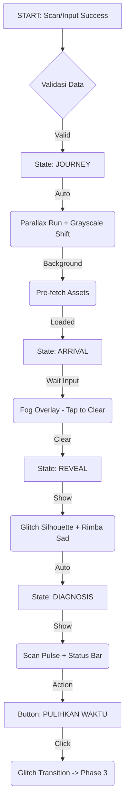
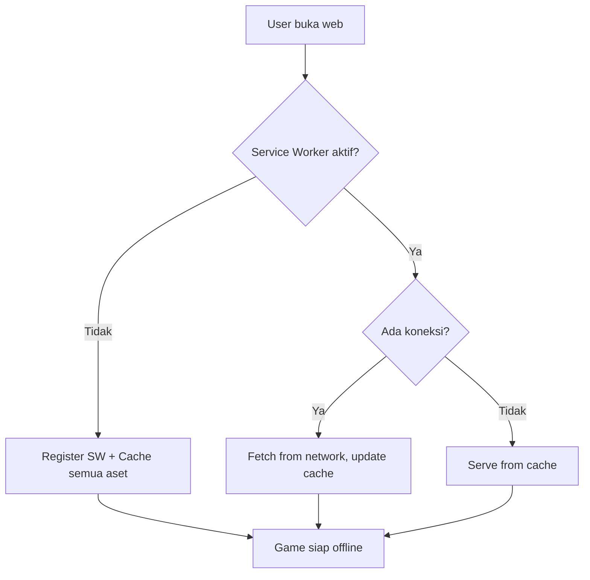

# 🌲 IMPLEMENTATION PLAN: Talking Forest V3 (Gamification Upgrade)

**Tanggal:** 25 Januari 2026  
**Tujuan:** Upgrade halaman pengunjung menjadi web edukasi RPG  
**Fokus Utama:** Core Gameplay (Scan → Puzzle → Kuis → Time Spell)

---

## 📋 DAFTAR ISI

| BAB     | Judul                                                        | Deskripsi                                                              |
| ------- | ------------------------------------------------------------ | ---------------------------------------------------------------------- |
| **I**   | [KONSEP & METODOLOGI](#-bab-i-konsep--metodologi)            | GDLC Analysis, 5-Fase Full Stack, High Concept                         |
| **II**  | [GAME DESIGN & EXPERIENCE](#-bab-ii-game-design--experience) | User Journey, State Machine, Visual Layouts (40 Screen), TTS Narration |
| **III** | [ARSITEKTUR TEKNIS](#-bab-iii-arsitektur-teknis)             | Tech Stack, Project Structure, API Functions                           |
| **IV**  | [DATA & KEBERLANJUTAN](#-bab-iv-data--keberlanjutan)         | Database Design, Privacy (UU PDP), Capacity Planning                   |
| **V**   | [QUALITY ASSURANCE](#-bab-v-quality-assurance-qa)            | Performance, Security, Browser Compatibility, A11Y                     |
| **VI**  | [ROADMAP PENGERJAAN](#-bab-vi-roadmap-pengerjaan)            | Sprint 0-9 Detail Tasks                                                |

---

## 🚀 RINGKASAN EKSEKUTIF (Untuk Mitra & Dosen)

> [!TIP]
> **Apa itu Dokumen Ini?**
> Ini adalah "buku resep" lengkap untuk membangun Talking Forest V3. Mulai dari desain visual, cara kerja sistem, hingga langkah-langkah teknis pemrograman.

### 🌟 Visi Proyek
Mengubah wisata hutan biasa menjadi **petualangan interaktif** di mana pengunjung bisa "berbicara" dengan pohon dan hewan menggunakan smartphone mereka.

### 💡 Manfaat Utama
1.  **Untuk Desa (Mitra):** Tanpa perlu pemandu wisata standby 24 jam. Hutan "bercerita" sendiri.
2.  **Untuk Pengunjung:** Pengalaman wisata yang tidak membosankan, edukatif, dan kekinian.
3.  **Untuk Tim (PKM-PM):** Penerapan teknologi tepat guna yang *sustainable* (berkelanjutan).

### 🔑 Fitur Kunci
| Fitur             | Fungsi Sederhana                                         |
| :---------------- | :------------------------------------------------------- |
| **Scan QR**       | Seperti scan menu di restoran, tapi keluar cerita pohon. |
| **Puzzle & Kuis** | Game sederhana untuk anak-anak agar tidak bosan.         |
| **Suara (TTS)**   | Pohon bisa "bersuara" menceritakan kisahnya.             |
| **Offline Mode**  | Tetap bisa main walau tidak ada sinyal internet.         |
| **Admin Katalog** | Pihak desa bisa ganti cerita/foto tanpa koding.          |

---


# 📚 BAB I: KONSEP & METODOLOGI
----------------------------------------------------------------

## 🎮 ANALISIS GDLC (Game Development Life Cycle)

> [!IMPORTANT]
> Section ini memvalidasi Implementation Plan terhadap metodologi **6-fase GDLC** khusus untuk game development.
>
> 💡 **Penjelasan untuk Awam:**
> Bayangkan membuat game seperti **membangun rumah**:
> 1. **Ideation:** Menggambar sketsa awal.
> 2. **Pre-Production:** Membuat blueprint detail (dokumen ini).
> 3. **Production:** Tukang mulai bekerja (coding & desain).
> 4. **Testing:** Cek apakah atap bocor (uji coba).
> 5. **Launch:** Syukuran rumah baru (promosi).
> 6. **Live-Ops:** Merawat rumah agar tetap bagus (update).

---

### 📊 GAP ANALYSIS: 6 FASE GDLC vs IMPLEMENTATION PLAN

| Fase | Nama                              | Status di Plan   | Gap/Catatan                                        |
| ---- | --------------------------------- | ---------------- | -------------------------------------------------- |
| 1    | Inisiasi & Perencanaan (Ideation) | ✅ LENGKAP        | Konsep, target audiens sudah ada                   |
| 2    | Pra-Produksi (Pre-Production)     | 🟡 PERLU TAMBAHAN | GDD ada, tapi Prototyping/Graybox belum detail     |
| 3    | Produksi (Production)             | ✅ LENGKAP        | Coding, Asset, Audio sudah detail                  |
| 4    | Pengujian (Testing & QA)          | 🟡 PERLU TAMBAHAN | Testing checklist ada, tapi Alpha/Beta belum jelas |
| 5    | Peluncuran (Launch)               | 🟡 PERLU TAMBAHAN | Deploy ada, tapi launch marketing belum            |
| 6    | Pasca-Produksi (Live-Ops)         | 🔴 BELUM ADA      | Maintenance minimal, Admin Dashboard belum         |

---

### 🎯 FASE 1: INISIASI & PERENCANAAN (Sudah Lengkap ✅)

**High-Concept Statement:**

> **"Talking Forest V3: Edu-Tourism RPG"**  
> Pengunjung menjadi **Ranger** yang bertugas menyelamatkan roh-roh pohon yang tertidur melalui ritual pemindaian, puzzle edukasi, dan mantra waktu. Setiap pohon yang diselamatkan mengungkap cerita rakyat lokal dan pesan moral tentang pelestarian alam.

**Target Audiens:**

| Segmen       | Karakteristik          | Preferensi                                  |
| ------------ | ---------------------- | ------------------------------------------- |
| **Primer**   | Anak-anak (8-12 tahun) | Visual menarik, reward sering, puzzle mudah |
| **Sekunder** | Remaja (13-18 tahun)   | Kompetisi (leaderboard), cerita menarik     |
| **Tersier**  | Keluarga wisatawan     | Pengalaman bersama, foto-able moment        |

**Platform Decision:**

| Platform   | Keputusan | Alasan                                      |
| ---------- | --------- | ------------------------------------------- |
| Web Mobile | ✅ DIPILIH | Zero install, akses via QR, support offline |
| Native App | ❌ Ditolak | Butuh download, maintenance berat           |
| PWA        | 🟡 Future  | Bisa ditambah setelah MVP stable            |

---

### 📐 FASE 2: PRA-PRODUKSI (BARU DITAMBAHKAN)

#### 2.1 GAME DESIGN DOCUMENT (GDD) - Sudah Ada ✅

Implementation Plan ini berfungsi sebagai GDD. Key components:
- ✅ Core Loop (Scan → Puzzle → Quiz → Spell → Story)
- ✅ Progression System (XP, Level, Rank)
- ✅ Reward System (Badge, Collection, Leaderboard)
- ✅ Narrative (Dialog Rimba, Folklore)

#### 2.2 PROTOTYPING (GRAYBOXING) - BARU DITAMBAHKAN

**Apa itu Grayboxing?**
Membuat versi "kotak-kotak" dulu sebelum aset final, untuk test UX dan gameplay feel.

**Graybox Checklist:**

| Fitur                    | Graybox Version                                     | Test Focus                  |
| ------------------------ | --------------------------------------------------- | --------------------------- |
| **Puzzle Drag & Drop**   | Kotak warna (Merah=Akar, Hijau=Daun, Coklat=Batang) | Touch responsiveness di HP  |
| **Dialog Popup**         | Kotak abu-abu dengan teks                           | Posisi, ukuran, keterbacaan |
| **Time Spell Animation** | Kotak membesar (scale)                              | Performance di HP kentang   |
| **Bottom Navigation**    | Kotak dengan emoji icon                             | Tab switching, active state |

**Graybox HTML Template:**

```html
<!-- graybox-puzzle.html -->
<!DOCTYPE html>
<html>
<head>
  <meta name="viewport" content="width=device-width, initial-scale=1.0">
  <script src="https://cdn.tailwindcss.com"></script>
  <!-- GSAP for Smooth Animations -->
  <script src="https://cdnjs.cloudflare.com/ajax/libs/gsap/3.12.2/gsap.min.js"></script>
  <title>Graybox: Puzzle Test</title>
</head>
<body class="bg-gray-100 min-h-screen p-4">
  
  <!-- Drop Zone (Siluet Pohon) -->
  <div class="bg-gray-300 h-64 rounded-lg mb-4 flex items-center justify-center">
    <div id="dropzone-akar" class="w-20 h-12 bg-gray-400 mx-2 border-2 border-dashed">AKAR</div>
    <div id="dropzone-batang" class="w-12 h-24 bg-gray-400 mx-2 border-2 border-dashed">BATANG</div>
    <div id="dropzone-daun" class="w-24 h-20 bg-gray-400 mx-2 border-2 border-dashed">DAUN</div>
  </div>
  
  <!-- Inventory (Draggable) -->
  <div class="flex justify-center gap-4">
    <div draggable="true" class="w-16 h-16 bg-red-500 rounded cursor-move flex items-center justify-center text-white text-xs">AKAR</div>
    <div draggable="true" class="w-16 h-16 bg-yellow-700 rounded cursor-move flex items-center justify-center text-white text-xs">BATANG</div>
    <div draggable="true" class="w-16 h-16 bg-green-500 rounded cursor-move flex items-center justify-center text-white text-xs">DAUN</div>
  </div>
  
  <!-- Test Log -->
  <div id="log" class="mt-4 p-2 bg-black text-green-400 font-mono text-xs h-32 overflow-auto">
    [LOG] Graybox loaded. Try drag & drop!
  </div>
  
  <script>
    // Simple drag & drop test
    document.querySelectorAll('[draggable]').forEach(item => {
      item.addEventListener('dragstart', (e) => {
        e.dataTransfer.setData('text/plain', e.target.textContent);
        log('Dragging: ' + e.target.textContent);
      });
    });
    
    document.querySelectorAll('[id^=dropzone]').forEach(zone => {
      zone.addEventListener('dragover', (e) => e.preventDefault());
      zone.addEventListener('drop', (e) => {
        e.preventDefault();
        const data = e.dataTransfer.getData('text/plain');
        log('Dropped ' + data + ' on ' + zone.id);
        if (zone.id.includes(data.toLowerCase())) {
          zone.classList.add('bg-green-300');
          log('✓ CORRECT!');
        } else {
          log('✗ Wrong placement');
        }
      });
    });
    
    function log(msg) {
      document.getElementById('log').innerHTML += '\n[LOG] ' + msg;
      document.getElementById('log').scrollTop = document.getElementById('log').scrollHeight;
    }
  </script>
</body>
</html>
```

**Graybox Testing Schedule:**

| Hari | Test               | Device     | Checklist                                  |
| ---- | ------------------ | ---------- | ------------------------------------------ |
| 1    | Puzzle drag & drop | HP Android | [ ] Touch works [ ] No lag                 |
| 2    | Dialog popup       | HP Android | [ ] Readable [ ] Tap to close              |
| 3    | Navigation         | HP Android | [ ] All tabs work [ ] Active state visible |
| 4    | Full flow          | HP Android | [ ] Complete without crash                 |

---

### 🔧 FASE 3: PRODUKSI (Sudah Lengkap ✅)

**Yang Sudah Ada:**
- ✅ 10 Fase Sprint dengan detail task
- ✅ 50+ API Functions
- ✅ Animation Specs (GSAP)
- ✅ Audio Design

**Tambahan: Production Milestones**


---

### 🧪 FASE 4: PENGUJIAN (BARU DILENGKAPI)

#### 4.1 ALPHA TESTING (Internal)

**Siapa:** Tim PKM-PM  
**Dimana:** Browser laptop  
**Kapan:** Setelah setiap fase selesai  

| Test             | Browser         | Tool        |
| ---------------- | --------------- | ----------- |
| Desktop          | Chrome, Edge    | DevTools    |
| Mobile Emulation | Chrome DevTools | Device Mode |
| Performance      | Chrome          | Lighthouse  |

**Alpha Test Criteria:**

- [ ] Semua button clickable
- [ ] Semua dialog muncul
- [ ] Semua navigation works
- [ ] No console errors
- [ ] No visual broken

#### 4.2 BETA TESTING (Lapangan)

**Siapa:** Novan, Nikar, dan Naju  
**Dimana:** Lokasi wisata + rumah  
**Kapan:** 1 minggu sebelum launch  

**Beta Test Devices:**

| Device             | Spesifikasi         | Purpose             |
| ------------------ | ------------------- | ------------------- |
| **HP Kentang**     | RAM 2GB, Android 9  | Performance minimum |
| **HP Standar**     | RAM 4GB, Android 11 | Target utama        |
| **iPhone SE**      | iOS 14+             | iOS compatibility   |
| **Tablet Android** | 8" screen           | Tablet layout       |

#### 4.3 LOCAL DEVELOPMENT (Cara Test di HP)
> **Supaya bisa test fitur kamera/scan di HP local:**
1.  Pastikan Laptop & HP di satu Wi-Fi.
2.  Cek IP Laptop (misal: `192.168.1.6`).
3.  Jalankan Live Server (port 5500).
4.  Buka di Chrome HP: `http://192.168.1.6:5500`.

**Beta Test Scenarios:**

| No  | Scenario      | Steps                       | Pass Criteria            |
| --- | ------------- | --------------------------- | ------------------------ |
| 1   | Outdoor Scan  | Scan QR di bawah matahari   | QR terbaca dalam 5 detik |
| 2   | Poor Signal   | Main dengan sinyal 1 bar    | LocalStorage save works  |
| 3   | Full Journey  | Register sampai dapat badge | Tidak crash 0 error      |
| 4   | Battery Drain | Main 15 menit               | Battery drop < 10%       |
| 5   | Multi-user    | 3 orang scan bersamaan      | Semua berhasil           |

### 📝 Beta Feedback Form

| Kategori     | Pertanyaan                                 | Tipe Jawaban         |
| ------------ | ------------------------------------------ | -------------------- |
| **Koneksi**  | Apakah proses load awal cepat (< 3 detik)? | Ya / Tidak           |
| **Gameplay** | Apakah Puzzle mudah dimainkan di HP?       | ⭐ 1-5                |
| **Gameplay** | Apakah soal Kuis cukup jelas?              | ⭐ 1-5                |
| **Teknis**   | Apakah HP menjadi panas saat Time Spell?   | Ya / Hangat / Normal |
| **Bug**      | Apakah ada tombol yang tidak bisa diklik?  | [Deskripsi]          |
| **Overall**  | Rating kepuasan bermain                    | ⭐ 1-5                |
## 🔄 ANALISIS 5-FASE FULL STACK DEVELOPMENT

> [!IMPORTANT]
> Section ini memvalidasi Implementation Plan terhadap metodologi 5-fase full-stack development.

---

### 📊 GAP ANALYSIS: 5 FASE vs IMPLEMENTATION PLAN

> [!NOTE]
> Status ✅ berarti **perencanaan sudah terdokumentasi**, bukan berarti sudah dieksekusi/dikoding.

| Fase | Nama                     | Dokumentasi      | Status Eksekusi     |
| ---- | ------------------------ | ---------------- | ------------------- |
| 1    | Planning & Architecture  | ✅ Terdokumentasi | ⏳ Menunggu Eksekusi |
| 2    | Asset & Database Prep    | ✅ Terdokumentasi | ⏳ Menunggu Eksekusi |
| 3    | Frontend & Logic Coding  | ✅ Terdokumentasi | ⏳ Menunggu Eksekusi |
| 4    | Integration & Testing    | ✅ Terdokumentasi | ⏳ Menunggu Eksekusi |
| 5    | Deployment & Maintenance | 🟡 Perlu Detail   | ⏳ Menunggu Eksekusi |

---

### 🏗️ FASE 1: PLANNING & ARCHITECTURE (Sudah Terencana 📋)

**Yang Sudah Ada:**
- ✅ Analisis Kebutuhan (User Journey 5 fase)
- ✅ Arsitektur Hybrid (Firestore + JSON)
- ✅ Kendala & Solusi (Gap Analysis section)
- ✅ Technical Design Document (5 Pilar)

**Arsitektur Keputusan Penting:**

| Keputusan            | Alasan                               | Alternatif yang Ditolak                           |
| -------------------- | ------------------------------------ | ------------------------------------------------- |
| **Firebase Hosting** | Gratis tier besar, CDN global        | Vercel (terbatas), Netlify (lebih kompleks)       |
| **Firestore**        | Realtime sync, offline support       | MongoDB (butuh backend), Supabase (kurva belajar) |
| **Tailwind CDN**     | Zero build step, prototype cepat     | PostCSS build (overhead waktu)                    |
| **GSAP**             | Animasi smooth, timeline control     | CSS Animation (terbatas), Anime.js (less popular) |
| **Alpine.js**        | Ringan (~15kb), reactive tanpa build | React/Vue (overkill untuk proyek ini)             |
| **JSON Static**      | Gratis, cepat, no API call           | CMS (biaya), API (kompleks)                       |

### 🏗️ FASE 2.5: PEROMBAKAN STRUKTUR (STORY ENGINE)
**Status:** 🔄 Sedang Dikerjakan (Request User)

**Apa Masalahnya?**
Saat ini, kode untuk "Cerita/Dialog" dan "Action/Lari" bercampur jadi satu. Ini bikin pusing:
- Layar jadi penuh sesak.
- Susah mengatur kapan harus cerita, kapan harus main.
- Kodingan jadi "benang kusut".

**Solusi: "Pisahkan Bioskop & Lapangan"**
Kita akan membagi aplikasi jadi 2 ruangan berbeda:

1.  **`story.html` (Ruang Bioskop / Cerita)** 🎬
    *   **Apa isinya?** Khusus buat nonton cerita dan baca dialog.
    *   **Ngapain user disini?** Cuma tap "Lanjut" sambil menikmati musik & gambar.
    *   **Contoh:** Scene Intro, Scene Pertemuan Rimba, Ending setelah dapat pohon.

2.  **`scan.html` (Lapangan Main / Game)** ⚔️
    *   **Apa isinya?** Khusus buat aksi & interaksi seru.
    *   **Ngapain user disini?** Cari Sinyal (Camera), Scan QR Code, Teka-Teki.
    *   **Catatan:** Gak ada animasi lari-lari (Clean UI). Fokus ke kamera.
    *   **Contoh:** Fase Scan & Puzzle.

**Alur Barunya Jadi Begini:**
1.  **Lobby (`index.html`)**: Cek user, "Kamu baru ya? Ke Bioskop dulu yuk."
2.  **Bioskop (`story.html`)**: Nonton intro cerita ("Hutan ini aneh...").
3.  **Lapangan (`scan.html`)**: Main game (Lari & Scan).
4.  **Bioskop (`story.html`)**: Nonton ending ("Selamat! Kamu menemukan Mangga!").

Dengan begini, kodingan jadi rapi dan pengalaman main jadi lebih jelas! ✨

---

### 📦 FASE 2: ASSET & DATABASE PREP (Sudah Terencana 📋)

**Yang Sudah Ada:**
- ✅ Database Design (ER Diagram + Collection Schema)
- ✅ JSON Structure (species, dialogs, quizzes, puzzles)
- ✅ Asset Checklist (69 files terorganisir)

**Tambahan: Database Migration Plan**


---

### 💻 FASE 3: FRONTEND & LOGIC CODING (Sudah Terencana 📋)

**Yang Sudah Ada:**
- ✅ 10 Fase Pengerjaan (Sprint 0-9)
- ✅ API Functions (50+ functions)
- ✅ Animation Specs (GSAP + CSS)
- ✅ Visual Layouts (40 screens)

**Tambahan: Code Quality Standards**

| Aspek              | Standar                                  | Tool              |
| ------------------ | ---------------------------------------- | ----------------- |
| **Naming**         | camelCase untuk JS, kebab-case untuk CSS | Manual review     |
| **Struktur**       | 1 file = 1 modul/feature                 | ESLint (opsional) |
| **Comments**       | JSDoc untuk setiap function              | Manual            |
| **Error Handling** | try-catch untuk async, fallback UI       | Manual            |
| **Console**        | Remove semua console.log sebelum deploy  | Search & replace  |

---

### 🧪 FASE 4: INTEGRATION & TESTING (Sudah Lengkap ✅)

**Yang Sudah Ada:**
- ✅ Testing Checklist (70+ test cases)
- ✅ End-to-End Flow Testing

**Tambahan: Testing Matrix**

| Test Type     | Coverage       | Tool                         |
| ------------- | -------------- | ---------------------------- |
| Unit Test     | Opsional       | Manual console test          |
| Integration   | Per-fase       | Manual checklist             |
| E2E           | Full journey   | Manual + rekam layar         |
| Mobile        | Android + iOS  | HP pribadi + Chrome DevTools |
| Performance   | Load time < 3s | Lighthouse                   |
| Accessibility | Color contrast | Chrome DevTools              |

---

### 🚀 FASE 5: DEPLOYMENT & MAINTENANCE (BARU DITAMBAHKAN)

#### 5.1 DEPLOYMENT PLAN

**Pre-Deployment Checklist:**

- [ ] Semua console.log dihapus
- [ ] Semua API keys di environment variable
- [ ] Firebase Security Rules sudah di-update
- [ ] Favicon dan meta tags sudah lengkap
- [ ] robots.txt dan sitemap.xml sudah ada
- [ ] Testing E2E passed
- [ ] Mobile responsive verified

**Deployment Steps:**

```bash
# Step 1: Build assets (jika pakai Tailwind CLI)
# Skip jika pakai CDN

# Step 2: Login Firebase
firebase login

# Step 3: Initialize hosting (sudah dilakukan)
# firebase init hosting

# Step 4: Deploy
firebase deploy --only hosting

# Step 5: Verify
# Buka https://talking-forest.web.app
```

**Firebase Hosting Configuration:**

```json
// firebase.json
{
  "hosting": {
    "public": "public",
    "ignore": [
      "firebase.json",
      "**/.*",
      "**/node_modules/**"
    ],
    "rewrites": [
      {
        "source": "**",
        "destination": "/index.html"
      }
    ],
    "headers": [
      {
        "source": "**/*.@(jpg|jpeg|gif|png|svg|webp|ico)",
        "headers": [
          {
            "key": "Cache-Control",
            "value": "max-age=31536000"
          }
        ]
      },
      {
        "source": "**/*.@(js|css)",
        "headers": [
          {
            "key": "Cache-Control",
            "value": "max-age=86400"
          }
        ]
      }
    ]
  }
}
```

#### 5.2 FIREBASE SECURITY RULES (Production)

```javascript
// firestore.rules
rules_version = '2';
service cloud.firestore {
  match /databases/{database}/documents {
    
    // Players collection - user can only read/write their own data
    match /players/{playerId} {
      allow read: if true; // Leaderboard needs public read
      allow create: if request.auth != null;
      allow update: if request.auth != null 
        && request.auth.uid == resource.data.authId;
      allow delete: if false; // No deletion allowed
    }
    
    // Species collection - read only (data from JSON anyway)
    match /species/{speciesId} {
      allow read: if true;
      allow write: if false;
    }
    
    // Donations collection - create only, no read (privacy)
    match /donations/{donationId} {
      allow read: if false;
      allow create: if request.auth != null;
      allow update, delete: if false;
    }
  }
}
```

#### 5.3 MAINTENANCE PLAN

**Weekly Maintenance:**

| Senin  | Tugas                                | Tool             |
| ------ | ------------------------------------ | ---------------- |
| Cek    | Firebase Console - Error logs        | Firebase Console |
| Cek    | Quota usage (Firestore reads/writes) | Firebase Console |
| Backup | Export Firestore collection          | Firebase CLI     |

**Monthly Maintenance:**

| Bulan | Tugas                                | Checklist |
| ----- | ------------------------------------ | --------- |
| 1x    | Update CDN versions (security patch) | [ ]       |
| 1x    | Test di browser terbaru              | [ ]       |
| 1x    | Review analytics (jika ada)          | [ ]       |
| 1x    | Add new species content              | [ ]       |

**Backup Strategy:**

```bash
# Monthly backup script
# Save as backup.sh

#!/bin/bash
DATE=$(date +%Y-%m-%d)

# Export Firestore players collection
gcloud firestore export gs://talking-forest-backup/$DATE/players --collection-ids=players

# Backup JSON files locally
cp -r public/data backup/data-$DATE

echo "Backup completed: $DATE"
```

#### 5.4 COST MONITORING

**Firebase Free Tier Limits:**

| Service              | Free Limit                         | Estimated Usage    | Status |
| -------------------- | ---------------------------------- | ------------------ | ------ |
| **Hosting**          | 10 GB storage, 360 MB/day transfer | ~50 MB, ~10 MB/day | ✅ Safe |
| **Firestore reads**  | 50,000/day                         | ~5,000/day         | ✅ Safe |
| **Firestore writes** | 20,000/day                         | ~500/day           | ✅ Safe |
| **Auth**             | Unlimited                          | ~100 users         | ✅ Safe |

**Cost Alert Setup:**

1. Buka Firebase Console → Usage & Billing
2. Set Budget Alert di $1 (warning)
3. Set Budget Alert di $5 (critical)
4. Enable email notifications

#### 5.5 ROLLBACK PLAN

**Jika ada bug critical:**

```bash
# Step 1: Lihat history releases
firebase hosting:channel:list

# Step 2: Rollback ke versi sebelumnya
firebase hosting:clone SITE_ID:CHANNEL_ID SITE_ID:live

# Step 3: Verify
# Test manual di production
```

**Atau:**

1. Buka Firebase Console → Hosting
2. Klik tab "Release History"
3. Pilih versi sebelumnya
4. Klik "Rollback to this version"

---

### 📋 RINGKASAN 5-FASE

| Fase              | Items                                | Status                 |
| ----------------- | ------------------------------------ | ---------------------- |
| **1. Planning**   | User Journey, Architecture, TDD      | ✅ Complete             |
| **2. Asset Prep** | 69 assets, Database schema, JSON     | ✅ Complete             |
| **3. Coding**     | 10 sprint, 50+ functions, 40 layouts | ✅ Complete             |
| **4. Testing**    | 70+ test cases, E2E checklist        | ✅ Complete             |
| **5. DevOps**     | Deploy steps, Security, Maintenance  | ✅ **Baru Ditambahkan** |

> [!TIP]
> Sekarang Implementation Plan sudah **100% lengkap** untuk semua 5 fase full-stack development!

---

### 🔮 FUTURE ROADMAP (Post-V3)

| Version  | Target   | Features                            |
| -------- | -------- | ----------------------------------- |
| **V3.1** | Apr 2026 | Bug fixes, performance optimization |
| **V3.2** | May 2026 | +10 species baru, leaderboard       |
| **V4.0** | Jul 2026 | AR Camera integration               |
| **V5.0** | Sep 2026 | Midtrans payment, premium features  |

---


# 🎮 BAB II: GAME DESIGN & EXPERIENCE
----------------------------------------------------------------

## 0. USER JOURNEY (Alur Pengunjung)

### Fase 1: ONBOARDING (Mendapatkan Lisensi Ranger)
| Step | Aksi                                         | Teknis                              |
| ---- | -------------------------------------------- | ----------------------------------- |
| 1    | Buka `index.html` atau scan QR               | Entry point                         |
| 2    | Firebase Anonymous Auth                      | Auto login tanpa form               |
| 3    | Cek player_id di LocalStorage                | `localStorage.getItem('player_id')` |
| 4    | Jika BARU → Form Character Creation          | Input Nickname, Gender, Stage       |
| 5    | Simpan ke Firestore `players` + LocalStorage | Dual storage                        |
| 6    | Maskot Rimba muncul → Tutorial dialog        | Load `dialogs.json`                 |

### Fase 2: DISCOVERY (Ritual Pemindaian)
| Step | Aksi                          | Teknis                        |
| ---- | ----------------------------- | ----------------------------- |
| 1    | Masuk `scan.html`             | Halaman game utama            |
| 2    | Deteksi `species_id` dari URL | `?id=mangga_01`               |
| 3    | Fallback: Input Kode Manual   | Form input kode jika QR gagal |
| 4    | Cek `inventory.collected`     | Sudah pernah?                 |
| 5    | Jika SUDAH → Info + Badge     | "Sudah Dikoleksi"             |
| 6    | Jika BELUM → Masuk Gameplay   | Lanjut ke Fase 3              |

💡 **Penjelasan Alur:**
User tidak perlu login ribet. Cukup scan QR > Main > Dapat ilmu. Mirip seperti main Pokemon GO tapi untuk tanaman lokal.

### Fase 3: CORE GAMEPLAY (Membangun Kehidupan)
| Step | Aksi                             | Teknis              |
| ---- | -------------------------------- | ------------------- |
| 1    | Tampilkan siluet + pot kosong    | UI awal puzzle      |
| 2    | Drag & Drop bagian anatomi       | HTML5 Drag API      |
| 3    | Setiap bagian → Kuis Mini        | Load `quizzes.json` |
| 4    | Jawab benar → XP + visual muncul | Update state        |

### Fase 4: THE CLIMAX (Mantra Waktu)
| Step | Aksi                                         | Teknis                 |
| ---- | -------------------------------------------- | ---------------------- |
| 1    | Pohon lengkap tapi kecil                     | Semua bagian terpasang |
| 2    | Tombol "AKTIFKAN MANTRA WAKTU"               | UI button              |
| 3    | GSAP Sequence: pohon besar, langit timelapse | Animation              |
| 4    | Hewan datang hinggap                         | Reward visual          |
| 5    | Update Firestore: XP, Rank, Badge            | Simpan progress        |

### Fase 5: RETENTION (Markas & Koleksi)
| Step | Aksi                           | Teknis          |
| ---- | ------------------------------ | --------------- |
| 1    | Lihat koleksi di `garden.html` | Kebun Saya      |
| 2    | Lihat rank di `profile.html`   | Profil Player   |
| 3    | Side quest: Siram kebun        | Daily retention |

---

## 0.1 GAME STATE MANAGEMENT

### State Machine Diagram


> [!NOTE]
> **State Baru: STORY_REVEAL** - Fitur "Bisikan Rimba" untuk edukasi budaya lokal

### gameState Object Design

```javascript
// js/v3/game-state.js
const gameState = {
  // Current phase
  currentPhase: 'SPLASH', // SPLASH | AUTH_CHECK | ONBOARDING | CHARACTER_CREATE | TUTORIAL | HOMEPAGE | SCAN | PUZZLE | QUIZ | TIME_SPELL | STORY_REVEAL | REWARD
  
  // Player data (dari Firestore/LocalStorage)
  player: {
    id: null,
    nickname: '',
    avatar: { stage: 'bibit', gender: 'cowok' },
    stats: { xp: 0, level: 1, rank: 'Ranger Magang' },
    inventory: { trees_collected: [], badges: [] }
  },
  
  // Current session data
  session: {
    currentTreeId: null,        // ID pohon yang sedang dimainkan
    completedParts: [],         // ['akar', 'batang', 'daun']
    quizAttempts: 0,            // Counter percobaan kuis
    dialogIndex: 0              // Index dialog saat ini
  },
  
  // Methods
  setPhase(phase) { this.currentPhase = phase; this.render(); },
  resetSession() { this.session = { currentTreeId: null, completedParts: [], quizAttempts: 0, dialogIndex: 0 }; },
  render() { /* Update UI based on currentPhase */ }
};
```

### File JavaScript yang Perlu Dibuat (Urutan Prioritas)

| Prioritas | File                     | Fungsi                                  | Ketergantungan     |
| --------- | ------------------------ | --------------------------------------- | ------------------ |
| 🔴 1       | `js/v3/game-state.js`    | State machine + **Centralized Audio**   | Tidak ada          |
| 🔴 2       | `js/v3/player-api.js`    | CRUD Firestore `players` + LocalStorage | firebase-config.js |
| 🟠 3       | `js/v3/dialog-engine.js` | **Typewriter Effect** + Mood logic      | dialogs.json       |
| 🟠 4       | `js/v3/scan-logic.js`    | **Scene 2 Logic** (Journey/Fog/Glitch)  | game-state.js      |
| 🟡 5       | `js/v3/puzzle.js`        | Drag & drop anatomi pohon               | game-state.js      |
| 🟡 6       | `js/v3/quiz.js`          | Load & validasi kuis                    | quizzes.json       |
| 🟡 7       | `js/v3/time-spell.js`    | Animasi GSAP                            | GSAP CDN           |

### Halaman HTML yang Perlu Dibuat

| File           | Fungsi                                    | Status      |
| -------------- | ----------------------------------------- | ----------- |
| `index.html`   | Homepage V3 (Markas Ranger)               | ❌ Belum ada |
| `scan.html`    | Halaman Game (Puzzle + Quiz + Time Spell) | ❌ Belum ada |
| `garden.html`  | Koleksi pohon player                      | ❌ Belum ada |
| `profile.html` | Profil + rank player                      | ❌ Belum ada |
| `detail.html`  | Info pohon (sudah ada)                    | ✅ Refactor  |

> [!IMPORTANT]
> **File pertama yang harus dibuat:** `game-state.js` → karena semua file lain bergantung padanya untuk mengontrol perpindahan fase.

---

## 0.2 ALUR KERJA HALAMAN PENGUNJUNG (V3)

> [!NOTE]
> Diagram ini hanya untuk **halaman pengunjung/player**. Halaman operasional desa (Loket, Warung, Admin) tidak termasuk.

### Peta Navigasi Halaman


### Deskripsi Fungsi Setiap Halaman

| Halaman      | URL            | Fungsi Utama                                 | Komponen UI                                       |
| ------------ | -------------- | -------------------------------------------- | ------------------------------------------------- |
| **Markas**   | `index.html`   | Homepage + Dashboard player                  | Avatar, XP bar, Daily Quest, Nav Menu             |
| **Gameplay** | `scan.html`    | Core game: Scan → Puzzle → Quiz → Time Spell | Siluet pohon, Drag zone, Quiz modal, Animasi GSAP |
| **Kebun**    | `garden.html`  | Koleksi pohon yang sudah "dihidupkan"        | Grid pohon, Health bar, Side quest siram          |
| **Profil**   | `profile.html` | Info player + achievement                    | Rank, Total XP, Badge collection                  |
| **Detail**   | `detail.html`  | Ensiklopedia pohon (read-only)               | Foto, Deskripsi, Fakta menarik                    |
| **Donasi**   | `donate.html`  | Donasi pohon asuh + reward in-game           | QRIS, Riwayat donasi, Badge donatur               |

### Alur User Flow (Step-by-Step)


### Bottom Navigation Bar (Shared Component)

```
┌────────────────────────────────────────────────┐
│  🏠      📸        🌱        💚        👤      │
│ Markas  Jelajah   Kebun    Donasi    Profil   │
└────────────────────────────────────────────────┘
```

### Detail Isi Setiap Menu

#### 🏠 MARKAS (`index.html`)
| Fitur                  | Deskripsi                                       |
| ---------------------- | ----------------------------------------------- |
| Avatar Display         | Gambar avatar player + nickname                 |
| XP Progress Bar        | Bar progress menuju level berikutnya            |
| Rank Badge             | Lencana rank saat ini (Ranger Magang, dll)      |
| Daily Quest            | 3 misi harian (Scan 1 pohon, Jawab 5 kuis, dll) |
| Quick Stats            | Total pohon, total XP, hari aktif               |
| Tombol "Mulai Jelajah" | CTA utama ke scan.html                          |

#### 📸 JELAJAH (`scan.html`)
| Fitur              | Deskripsi                                             |
| ------------------ | ----------------------------------------------------- |
| Kamera/QR Scanner  | Baca QR code di lokasi                                |
| Input Kode Manual  | Form ketik kode jika kamera HP tidak bisa             |
| Puzzle Area        | Zona drag & drop anatomi + **penjelasan tiap bagian** |
| Quiz Modal         | Pop-up kuis saat bagian terpasang                     |
| Time Spell Button  | Tombol aktivasi mantra waktu                          |
| Progress Indicator | Indikator bagian yang sudah terpasang                 |

> [!NOTE]
> **Setiap spesies (Pohon/Tanaman/Hewan) punya puzzle, kuis, dan animasi Time Spell yang BERBEDA!**
> Data diambil dari `species/{id}/` di JSON files.

#### 🌱 KEBUN (`garden.html`)
| Fitur           | Deskripsi                             |
| --------------- | ------------------------------------- |
| Grid Koleksi    | Semua spesies yang sudah "dihidupkan" |
| Health Bar      | Kesehatan kebun (untuk side quest)    |
| Tombol "Siram"  | Side quest harian - klik untuk XP     |
| Filter Kategori | **Pohon** / **Tanaman** / **Hewan**   |
| Detail Card     | Klik item → lihat info singkat        |

#### 💚 DONASI (`donate.html`)
| Fitur            | Deskripsi                                   |
| ---------------- | ------------------------------------------- |
| Pilih Pohon Asuh | Dropdown pohon yang bisa didonasi           |
| Input Nominal    | Pilih/ketik jumlah donasi                   |
| QRIS Display     | Tampilkan QR pembayaran (V3: QRIS statis)   |
| Riwayat Donasi   | Daftar donasi player                        |
| Badge Donatur    | Lencana khusus donatur (Bronze/Silver/Gold) |
| Dampak Donasi    | "Donasi kamu sudah menanam 3 pohon!"        |

> [!TIP]
> **V5 Roadmap:** Integrasi **Midtrans Payment Gateway** untuk pembayaran otomatis.

#### 👤 PROFIL (`profile.html`)
| Fitur             | Deskripsi                                 |
| ----------------- | ----------------------------------------- |
| Avatar Besar      | Tampilan avatar full + bisa klik edit     |
| Edit Profil       | Ubah nickname (**maks 3x**), ganti avatar |
| Stats Card        | Total XP, Level, Rank, Hari Aktif         |
| Badge Collection  | Grid semua lencana yang dimiliki          |
| Achievement List  | Progress achievement (5/10 pohon, dll)    |
| Riwayat Aktivitas | Log: "Hari ini kamu scan Pohon Mangga"    |
| Pengaturan        | Bahasa, Notifikasi, Sound On/Off          |
| Tombol Logout     | Keluar dari akun (hapus LocalStorage)     |

> [!WARNING]
> Nickname hanya bisa diubah **maksimal 3 kali** untuk mencegah spam.

---

## 7. ALUR KERJA LENGKAP (Unified Workflow)

### Diagram Alur Web dari Awal Sampai Akhir

![Diagram Flowchart](https://kroki.io/mermaid/svg/eNqFVd2K20YUvi_0HU4DKS2bLCSlN75oGFvaXXVlWSvJzmZNMMf2RJ5YGhn9bFhWvexF2yXZZEsvQoJbCE1b2kJ6FSi077IvUD9CmRnJHpuF1dWcc76Z-eb8fHoUJU9GE0xzCJoffgAAkBXDMMXZBEwn8B70byzmL39Ta3A7lhPceKhw4jvw-ov5xTvwR8jhwIMxAzuZYsY0TNez-4v52Tk0iykKC2zkYVbwsAJRPlaLjfs7TrNDPMNydgWJp7-D3zIdE-40tIhOxndt4u-Ju_4CfxZhNgF_lFLKNQzpBgLx_TnssJQOMaNAeMJP4qTIgBT5RMO29szW_qmdjDDy8yTFkDZgFuEJTQdsfO-rFdCz2k1yR5A8_xs8Fg-xAT7DGcKYZcjxns7SM3ctPzBl4l7DTpLG4NGQZTlNG-Cw0ZRjTGELyDHmmOrPIz2zv5i_-Ad8Fs-Qw5TKR2R5kooNOtGHG-TubpCjEcaYwxhz5OFHN64pxF6nbbpk1xSHPPtxacInbUynmIGHPKTpp_orDVWJi2_BwGwyTDAdN-DQvQU2PabRLTgoaJZreIf0-ov52z-gmeR5EoODxyzEnCX8Gm6G5bc6PVM16rJH7jZWgbUWaRFnIJ-ymF-8h2yEfHuSx5HO3AzMVnBq0JxOMwbZjI4YzQZsrBW81THMgeW43aB_efbLf--fgcVnRQ77yZhCG3mB0WYfDSynd-oXY5yAwaZJJA7Xe4jYnkmMB_3LV19DE8ei1xSajPGaFOyStunaZD0Dn93-vAGtjmcuw2t5sOyuGfQX8-dvIMB4xqIpcvBZVFC9Km736MgWuXr7KxgphvAxGGkyA8IxT2J9yM1D1yaWIyhc_AAu5Y9phBlyaGLIkK9pRtc66l--voD9gmXQZpxtBAdq8L7EJziEJuWY6omSiB1i2est3UqGCBGGbHt7W7_NJV4wMDqO2b98dVGxgYCmM8EuhC04dHV5sG0JPvVpXGANtykPpzjTWQRW2xw0A0doyZ8QJPEwiUTl8xThPk7zQj_UsdokMPuXL38CwlmMGWuAm0wSDk2aYQpbELCYRjjL6OY2IZ3nP8MefYIcDDmua1pyn3hGfzF_-g0curClOge2wOLHlOdJenJN63hmYDqB1ZGFO3u3svUU7hLPMMVLz_6FfTosOPh4gnqOvc6OJfvk-Rtw0-QRi2BLqMJUn6uOI5KwmL94CUbC1_8RvmXIkfwOfDama-qwQf3mTWglnNOR0IZM-Q48uH37i9VwK6_400i3_C3oZyiPDIr_gXKKlXTJ7lM-uRTOMmBjnIpZLCu13wTIkLG8SIHkebXgV4HKUtRIryIrVgot5Vo75K50GxtPMOoHOKSnPA7pSSJf0ggf46TcTEcdlxUsq6Kuh1Tpyrqe60FVs7Kq41o664sUU6mfFUu5ltsPPNjFEKNSE8-rQJ39ciWYVZKXG1b10aK1KU94gGUtpVeFZRnLSv6quiv0lVlWOBlSUqjcai3dle4pf2XIgJCpqju71tHSNdC6a2VLbj5GomxLfdNAwrziVG2zlMlypXYV0dpUvV6JW_1uexkqmzQq4nLtkWtxkdZa8lS4ttTJSuGqjcpYBWzNb1cjIXSrHgixvjL9qkfVpFhGPSmWYS7R_wO11_Yz)

---

## 0.2.1 DIALOG POPUP COMPONENT

> [!NOTE]
> Komponen ini digunakan untuk menampilkan dialog Rimba di semua SCENE.

### Layout Visual

```
┌─────────────────────────────────────────────────────────┐
│                                                         │
│                    [Background Blur]                    │
│                                                         │
│  ┌─────────────────────────────────────────────────┐   │
│  │  ┌──────┐                                       │   │
│  │  │      │   🐻 RIMBA                           │   │
│  │  │ 😊   │   ──────────────────────────          │   │
│  │  │      │   "Hai! Selamat datang di             │   │
│  │  └──────┘    Talking Forest!"                   │   │
│  │                                                  │   │
│  │           ┌─────────────────────┐               │   │
│  │           │     LANJUT ▶        │               │   │
│  │           └─────────────────────┘               │   │
│  └─────────────────────────────────────────────────┘   │
│                                                         │
└─────────────────────────────────────────────────────────┘
```

### Spesifikasi Komponen

| Elemen        | CSS Property  | Value                                            |
| ------------- | ------------- | ------------------------------------------------ |
| Overlay       | background    | `rgba(0,0,0,0.7)` + `backdrop-filter: blur(5px)` |
| Dialog Box    | background    | `linear-gradient(135deg, #2E7D32, #1B5E20)`      |
| Dialog Box    | border-radius | `24px`                                           |
| Dialog Box    | padding       | `24px`                                           |
| Dialog Box    | max-width     | `90%` atau `400px`                               |
| Avatar Rimba  | width/height  | `80px`                                           |
| Avatar Rimba  | border-radius | `50%`                                            |
| Avatar Rimba  | border        | `3px solid #FFD54F`                              |
| Nama "RIMBA"  | font          | Baloo 2, 18px, bold                              |
| Nama "RIMBA"  | color         | `#FFD54F` (Sun Yellow)                           |
| Teks Dialog   | font          | Nunito, 16px                                     |
| Teks Dialog   | color         | `#FFFFFF`                                        |
| Teks Dialog   | line-height   | `1.6`                                            |
| Tombol Lanjut | background    | `#FFD54F`                                        |
| Tombol Lanjut | color         | `#212121`                                        |
| Tombol Lanjut | padding       | `12px 32px`                                      |
| Tombol Lanjut | border-radius | `50px`                                           |

### Animasi

| Animasi       | Trigger       | Effect                                    |
| ------------- | ------------- | ----------------------------------------- |
| Popup masuk   | Dialog muncul | `fadeIn` + `slideUp` (0.3s ease)          |
| Typewriter    | Teks dialog   | Karakter muncul satu per satu (30ms/char) |
| Avatar bounce | Dialog muncul | `scale(1.1)` kemudian kembali             |
| Tombol pulse  | Teks selesai  | Tombol berkedip hingga diklik             |

### Variasi Ekspresi Rimba

| Ekspresi           | File | Kapan Digunakan                     |
| ------------------ | ---- | ----------------------------------- |
| `rimba-curiga.png` | 🤨    | SCENE 1: Pertama kali muncul        |
| `rimba-senang.png` | 😊    | Setelah player register, kuis benar |
| `rimba-shock.png`  | 😲    | Kuis salah, pohon lengkap           |
| `rimba-sedih.png`  | 😢    | Roh pohon meredup                   |

### Struktur HTML

```html
<!-- Dialog Overlay -->
<div id="dialog-overlay" class="dialog-hidden">
  <div class="dialog-box">
    <!-- Avatar Rimba -->
    <div class="dialog-avatar">
      
    </div>
    
    <!-- Content -->
    <div class="dialog-content">
      <h3 class="dialog-name">RIMBA</h3>
      <p id="dialog-text"></p>
    </div>
    
    <!-- Button -->
    <button id="dialog-next" class="dialog-btn">LANJUT ▶</button>
  </div>
</div>
```

### Penggunaan di JavaScript

```javascript
// dialog-engine.js
function showDialog(text, emotion = 'senang') {
  // Ganti avatar berdasarkan emosi
  document.getElementById('rimba-avatar').src = 
    `assets/images/mascot/rimba-${emotion}.png`;
  
  // Typewriter effect
  typeWriter(text, 'dialog-text', 30);
  
  // Tampilkan overlay
  document.getElementById('dialog-overlay').classList.remove('dialog-hidden');
}

function hideDialog() {
  document.getElementById('dialog-overlay').classList.add('dialog-hidden');
}

// Contoh penggunaan
showDialog("Hai! Selamat datang di Talking Forest!", "curiga");
```

---

## 📱 VISUAL LAYOUTS (Semua Layar Sesuai Alur)

---

## 🔊 0.2.2 FITUR TTS NARASI (AI Voice)

> [!IMPORTANT]
> Fitur ini memungkinkan user **mendengarkan** penjelasan tentang pohon/tanaman/hewan dengan suara AI yang natural, **bukan** suara robot bawaan browser.

### Strategi: Pre-Generated Assets

| Aspek              | Keputusan                          | Alasan                                             |
| ------------------ | ---------------------------------- | -------------------------------------------------- |
| **Metode**         | Pre-generate MP3 saat development  | Tidak pakai API real-time (mahal & lambat)         |
| **Voice Provider** | **ElevenLabs** atau **OpenAI TTS** | Suara natural, emosional, cocok untuk storytelling |
| **Format Output**  | MP3 64kbps Mono                    | File kecil (~100KB per 30 detik)                   |
| **Bahasa**         | Indonesia                          | Voice: "Ari" (ElevenLabs) atau "Onyx" (OpenAI)     |

### Jenis Audio Narasi

| Tipe                          | Durasi | Konten               | Trigger                     |
| ----------------------------- | ------ | -------------------- | --------------------------- |
| `narr_folklore_{species}.mp3` | 30-60s | Cerita Bisikan Rimba | Tombol "🔊 Dengarkan Cerita" |
| `narr_fact_{species}.mp3`     | 15-30s | Fakta ilmiah singkat | Tombol "📚 Fakta Cepat"      |

### JavaScript Audio Player

```javascript
// js/v3/narration-player.js
class NarrationPlayer {
  constructor() {
    this.audio = new Audio();
    this.isPlaying = false;
  }

  async play(speciesId, type = 'folklore') {
    const src = `assets/audio/narration/narr_${type}_${speciesId}.mp3`;
    if (this.isPlaying) this.stop();
    
    this.audio.src = src;
    await this.audio.play();
    this.isPlaying = true;
    this.audio.onended = () => { this.isPlaying = false; };
  }

  stop() {
    this.audio.pause();
    this.audio.currentTime = 0;
    this.isPlaying = false;
  }
}
```

### Asset Checklist TTS

| Species     | Folklore                      | Fact                      | Status |
| ----------- | ----------------------------- | ------------------------- | ------ |
| `mangga_01` | `narr_folklore_mangga_01.mp3` | `narr_fact_mangga_01.mp3` | [ ]    |
| `ulin_01`   | `narr_folklore_ulin_01.mp3`   | `narr_fact_ulin_01.mp3`   | [ ]    |

> [!TIP]
> **Biaya:** ElevenLabs Free Tier = 10,000 karakter/bulan. Cukup untuk ~10 narasi.

---

> [!NOTE]
> Layout mengikuti alur user journey dari awal masuk hingga akhir.  
> Format: **Mobile-First (375px width, h-dvh height)**

---

### 🚪 ALUR 1: ENTRY POINT

> [!NOTE]
> **Tujuan UX:** Memberikan kesan pertama yang immersive dan tidak membingungkan.

#### 1.1 SPLASH SCREEN (2-3 detik)
```
┌─────────────────────────────────┐
│                                 │
│                                 │
│                                 │
│         🌲🌲🌲🌲🌲            │
│                                 │
│      TALKING FOREST            │
│      ═══════════════            │
│                                 │
│        🐻 Rimba                 │
│                                 │
│      [ Loading... ▓▓▓░░ ]      │
│                                 │
│                                 │
│                                 │
│     Versi 3.0 | 2026           │
└─────────────────────────────────┘
```

**📐 Penjelasan Layout & Warna:**

| Elemen           | Posisi        | Warna/Style            | Alasan UX                                    |
| ---------------- | ------------- | ---------------------- | -------------------------------------------- |
| **Logo Pohon**   | Center-Top    | Hijau Forest `#2E7D32` | Kesan natural, langsung identifikasi "hutan" |
| **Judul**        | Center        | Font Cinzel (serif)    | Kesan fantasy/RPG, membedakan dari app biasa |
| **Maskot Rimba** | Center        | Ekspresi netral        | Perkenalan karakter utama game               |
| **Loading Bar**  | Center-Bottom | Hijau muda `#81C784`   | Feedback visual bahwa app sedang memuat      |
| **Versi**        | Bottom        | Abu-abu kecil          | Info teknis, tidak mengganggu fokus          |

**🎯 Kenapa Layout Ini:**
- **Centered semua** → Fokus perhatian ke satu titik, tidak ada distraksi
- **Durasi 2-3 detik** → Cukup untuk branding, tidak terlalu lama menunggu
- **Auto-redirect** → Seamless transition tanpa user harus klik

---

### 🎬 ALUR 2: ONBOARDING (Player Baru)

> [!NOTE]
> **Tujuan UX:** Membangun koneksi emosional dengan Rimba sebagai guide.

#### 2.1 RIMBA INTRO (Dialog Pertama)
```
┌─────────────────────────────────┐
│                                 │
│        [Background Hutan]       │
│                                 │
│                                 │
│                                 │
│                                 │
│  ┌─────────────────────────┐   │
│  │  ┌────┐                  │   │
│  │  │ 🤨 │  RIMBA           │   │
│  │  └────┘  ───────────────  │   │
│  │                          │   │
│  │  "Hmmm? Siapa itu?"     │   │
│  │  "Aku mencium bau       │   │
│  │   manusia di hutanku..."│   │
│  │                          │   │
│  │       [ LANJUT ▶ ]       │   │
│  └─────────────────────────┘   │
│                                 │
└─────────────────────────────────┘
```

**📐 Penjelasan Layout & Warna:**

| Elemen            | Posisi              | Warna/Style                   | Alasan UX                                |
| ----------------- | ------------------- | ----------------------------- | ---------------------------------------- |
| **Background**    | Full screen         | Foto hutan blur               | Immersive, player "masuk" ke dunia game  |
| **Dialog Box**    | Bottom 60%          | Gradient hijau gelap → terang | Kesan hutan mistis, mudah dibaca         |
| **Avatar Rimba**  | Kiri atas dialog    | Border kuning emas `#FFD54F`  | Highlight karakter pembicara             |
| **Ekspresi 🤨**    | -                   | Curiga                        | Storytelling: Rimba belum percaya player |
| **Teks Dialog**   | Center dialog       | Putih, Nunito 16px            | Readability tinggi di background gelap   |
| **Tombol Lanjut** | Bottom-right dialog | Kuning emas                   | CTA jelas, kontras dengan hijau          |

**🎯 Kenapa Dialog di Bawah:**
- **Jempol mudah menjangkau** → Mobile-first, tombol di area nyaman
- **Tidak menutupi visual** → Background hutan tetap terlihat 40%
- **Pattern familiar** → Seperti game RPG/visual novel

---

#### 2.2 REGISTER - PILIH AVATAR
```
┌─────────────────────────────────┐
│                                 │
│     Buat Karakter Ranger        │
│     ════════════════════        │
│                                 │
│  ┌─────────────────────────┐   │
│  │                          │   │
│  │    ◀  [ 🌱 ]  ▶          │   │ Avatar Carousel
│  │        BIBIT             │   │
│  │                          │   │
│  │    ○ ● ○                 │   │ Stage dots
│  │    (Bibit/Tunas/Pohon)   │   │
│  │                          │   │
│  │    [ ♂️ ]    [ ♀️ ]       │   │ Gender toggle
│  │                          │   │
│  └─────────────────────────┘   │
│                                 │
│  ┌─────────────────────────┐   │
│  │ Nama Petualang:         │   │
│  │ [____________________]  │   │ Input text
│  │         0/15 karakter   │   │
│  └─────────────────────────┘   │
│                                 │
│  ┌─────────────────────────┐   │
│  │    MULAI PETUALANGAN    │   │ Primary button
│  └─────────────────────────┘   │
│                                 │
└─────────────────────────────────┘
```

#### 2.3 TUTORIAL - RIMBA WELCOME
```
┌─────────────────────────────────┐
│                                 │
│        [Background Hutan]       │
│                                 │
│                                 │
│  ┌─────────────────────────┐   │
│  │  ┌────┐                  │   │
│  │  │ 😊 │  RIMBA           │   │
│  │  └────┘  ───────────────  │   │
│  │                          │   │
│  │  "Selamat datang,       │   │
│  │   {nickname}!"          │   │
│  │                          │   │
│  │  "Kamu sekarang adalah  │   │
│  │   Ranger Magang!"       │   │
│  │                          │   │
│  │  "Tugasmu: Bangunkan    │   │
│  │   roh-roh pohon yang    │   │
│  │   tertidur di hutan ini"│   │
│  │                          │   │
│  │       [ MENGERTI! ]      │   │
│  └─────────────────────────┘   │
│                                 │
└─────────────────────────────────┘
```

---

### 🏠 ALUR 3: HOMEPAGE (Markas Ranger)

#### 3.1 HOMEPAGE - MAIN VIEW
```
┌─────────────────────────────────┐
│                                 │
│  ┌────┐  Halo, {nickname}!     │ Header
│  │ 🌱 │  Ranger Magang         │ Avatar + Rank
│  └────┘  ★★☆☆☆                 │
│                                 │
│  XP: ▓▓▓▓▓░░░░░ 250/500        │ XP Bar
│                                 │
├─────────────────────────────────┤
│                                 │
│  📋 MISI HARI INI              │ Daily Quest Card
│  ┌─────────────────────────┐   │
│  │ ○ Scan 1 pohon baru     │   │
│  │ ○ Jawab 5 kuis benar    │   │
│  │ ● Siram kebunmu         │   │
│  └─────────────────────────┘   │
│                                 │
│  📊 STATISTIK                  │
│  ┌───────┬───────┬───────┐    │
│  │ 🌳 3  │ 🎯 12 │ 📅 5  │    │ Quick Stats
│  │ Pohon │ Kuis  │ Hari  │    │
│  └───────┴───────┴───────┘    │
│                                 │
│  ┌─────────────────────────┐   │
│  │   🔍 MULAI JELAJAH      │   │ CTA Button
│  └─────────────────────────┘   │
│                                 │
├─────────────────────────────────┤
│  🏠    📸    🌿    💚    👤   │ Bottom Nav
│ Markas Jelajah Kebun Donasi Prof│
└─────────────────────────────────┘
```

---

### 📸 ALUR 4: JELAJAH (Scan Mode)

#### 4.1 SCAN - PILIH METODE
```
┌─────────────────────────────────┐
│ ←        JELAJAH         ⚙️    │ Header
├─────────────────────────────────┤
│                                 │
│                                 │
│  ┌─────────────────────────┐   │
│  │                          │   │
│  │      📷                  │   │
│  │                          │   │
│  │   [ SCAN QR CODE ]       │   │ Primary button
│  │                          │   │
│  └─────────────────────────┘   │
│                                 │
│        ─── atau ───            │
│                                 │
│  ┌─────────────────────────┐   │
│  │ Masukkan Kode:          │   │
│  │ [______-______]          │   │ Input code
│  │                          │   │
│  │     [ CARI SPESIES ]     │   │ Secondary button
│  └─────────────────────────┘   │
│                                 │
│                                 │
│  💡 Tip: Cari QR Code di       │
│     papan informasi pohon      │
│                                 │
├─────────────────────────────────┤
│  🏠    📸    🌿    💚    👤   │
└─────────────────────────────────┘
```

**📐 Penjelasan Layout & Warna:**

| Elemen         | Posisi           | Warna/Style               | Alasan UX                           |
| -------------- | ---------------- | ------------------------- | ----------------------------------- |
| **Header**     | Fixed Top        | Hijau Forest              | Navigasi jelas, back button di kiri |
| **QR Button**  | Center, besar    | Hijau terang `#4CAF50`    | Primary action, mudah ditemukan     |
| **Input Kode** | Center, bawah QR | Border abu-abu            | Alternatif jika QR tidak bisa scan  |
| **Tip Box**    | Bottom           | Background kuning muda    | Edukasi user tanpa mengganggu       |
| **Bottom Nav** | Fixed Bottom     | Hijau Forest + icon aktif | Navigasi konsisten di semua halaman |

**🎯 Kenapa 2 Metode Scan:**
- **QR Code** → Pengalaman optimal di lokasi wisata
- **Input Manual** → Fallback jika QR rusak/tidak terbaca

---

#### 4.2 SCENE 2: THE PULSE OF THE FOREST (Ekspedisi Rimba)
> **Core Concept:** "Loading yang Bercerita". Mengubah jeda teknis (fetching assets) menjadi perjalanan naratif emosional.

**Alur Besar (Flowchart):**


**Detail Sub-Scene:**

**Part 2.1: The Journey (Transition)**
*   **Visual**: Background hutan loop (Parallax). Rimba berlari (Sprite Animation).
*   **VFX**: Saturasi warna turun bertahap 100% -> 0% (Grayscale) seiring perjalanan.
*   **Dialog**: Random chatter tentang lingkungan yang "sakit" ("Bunga ini lupa cara mekar...").
*   **Tech**: Asset Pre-loading berjalan di background.

**Part 2.2: The Arrival (Interaction)**
*   **Visual**: Background berhenti sesuai habitat spesies.
*   **Mechanic**: Kabut tebal (Time Fog). User harus tap 3x untuk menghapus kabut.
*   **Reveal**: Muncul siluet pohon dengan efek **RGB Split Glitch** (Data Korup).

**Part 2.3: The Diagnosis (Narrative)**
*   **Visual**: Lingkaran radar scanning pada siluet.
*   **UI**: Box Status "Analisis Memori... Status: AMNESIA AKUT".
*   **Rimba**: Ekspresi Sedih/Menangis.
*   **Action**: Tombol "PULIHKAN WAKTU" (Neon Pulse).

**Technical Stack Requirement:**
*   **GSAP**: Wajib untuk physics animasi lari, parallax, dan color grading (grayscale).
*   **Assets**: Seamless wrap background, Fog overlay, Glitch sound.
```
┌─────────────────────────────────┐
│ ←     SPESIES DITEMUKAN        │
├─────────────────────────────────┤
│                                 │
│        ┌───────────────┐       │
│        │               │       │
│        │   [SILUET]    │       │ Gambar siluet
│        │      ?        │       │ (grayscale)
│        │               │       │
│        └───────────────┘       │
│                                 │
│       ════════════════          │
│       SPESIES MISTERIUS        │
│       ════════════════          │
│                                 │
│  ┌─────────────────────────┐   │
│  │  🐻 RIMBA:              │   │
│  │  "Wah! Ada roh pohon    │   │
│  │   yang belum bangun!"   │   │
│  │  "Ayo kita bangunkan!"  │   │
│  └─────────────────────────┘   │
│                                 │
│  ┌─────────────────────────┐   │
│  │    MULAI PUZZLE 🧩      │   │
│  └─────────────────────────┘   │
│                                 │
└─────────────────────────────────┘
```

#### 4.3 SCAN - SUDAH DIKOLEKSI
```
┌─────────────────────────────────┐
│ ←       MANGGA KAKEK           │
├─────────────────────────────────┤
│                                 │
│        ┌───────────────┐       │
│        │               │       │
│        │   [GAMBAR]    │       │ Gambar full color
│        │     🌳        │       │
│        │               │       │
│        └───────────────┘       │
│                                 │
│       ════════════════          │
│         MANGGA KAKEK           │
│       Mangifera indica          │
│       ════════════════          │
│                                 │
│  ✅ SUDAH DIKOLEKSI            │ Badge
│  📅 Dikunjungi: 25 Jan 2026    │
│                                 │
│  ┌─────────────────────────┐   │
│  │ 📖 Baca Cerita Lagi     │   │
│  └─────────────────────────┘   │
│                                 │
│  ┌─────────────────────────┐   │
│  │ ← Kembali ke Jelajah    │   │
│  └─────────────────────────┘   │
│                                 │
└─────────────────────────────────┘
```

---

### 🧩 ALUR 5: PUZZLE ANATOMI

#### 5.1 PUZZLE - STATE AWAL
```
┌─────────────────────────────────┐
│ ←    MANGGA KAKEK       🔊 ⚙️ │
├─────────────────────────────────┤
│                                 │
│        ┌───────────────┐       │
│        │               │       │
│        │   [SILUET     │       │
│        │    POHON]     │       │ Drop Zone
│        │               │       │ Container
│        │   ┌─────┐     │       │
│        │   │ POT │     │       │
│        │   └─────┘     │       │
│        └───────────────┘       │
│                                 │
│     ○ ○ ○  Progress: 0/3       │
│                                 │
├─────────────────────────────────┤
│  SERET KE POSISI YANG BENAR:   │
│                                 │
│  ┌─────┐ ┌─────┐ ┌─────┐      │ Inventory
│  │ 🌿  │ │ 🪵  │ │ 🌱  │      │ (draggable)
│  │Daun │ │Batang│ │Akar │      │
│  └─────┘ └─────┘ └─────┘      │
│                                 │
├─────────────────────────────────┤
│  ┌─────────────────────────┐   │
│  │ 🐻 "Mulai dari bawah!   │   │ Dialog hint
│  │    Apa yang masuk ke    │   │
│  │    dalam tanah?"        │   │
│  └─────────────────────────┘   │
└─────────────────────────────────┘
```

#### 5.2 PUZZLE - BAGIAN TERPASANG + PENJELASAN
```
┌─────────────────────────────────┐
│ ←    MANGGA KAKEK       🔊 ⚙️ │
├─────────────────────────────────┤
│                                 │
│        ┌───────────────┐       │
│        │    [SILUET]   │       │
│        │       +       │       │
│        │   ┌─────┐     │       │
│        │   │AKAR │ ✓   │       │ Akar terpasang
│        │   └─────┘     │       │ (glow effect)
│        │   ┌─────┐     │       │
│        │   │ POT │     │       │
│        │   └─────┘     │       │
│        └───────────────┘       │
│                                 │
│     ● ○ ○  Progress: 1/3       │
│                                 │
├─────────────────────────────────┤
│  ┌─────────────────────────┐   │
│  │ 💡 AKAR                 │   │
│  │ ═══════════════════      │   │
│  │ Akar berfungsi menyerap │   │ Penjelasan
│  │ air dan mineral dari    │   │ Edukasi
│  │ dalam tanah untuk       │   │
│  │ makanan pohon.          │   │
│  │                          │   │
│  │      [ MENGERTI ✓ ]      │   │
│  └─────────────────────────┘   │
│                                 │
└─────────────────────────────────┘
```

#### 5.3 PUZZLE - SEMUA LENGKAP
```
┌─────────────────────────────────┐
│ ←    MANGGA KAKEK       🔊 ⚙️ │
├─────────────────────────────────┤
│                                 │
│        ┌───────────────┐       │
│        │   [POHON      │       │
│        │    UTUH       │       │ Semua bagian
│        │    tapi       │       │ terpasang
│        │    KECIL]     │       │
│        │       🌳      │       │
│        │   ┌─────┐     │       │
│        │   │ POT │     │       │
│        │   └─────┘     │       │
│        └───────────────┘       │
│                                 │
│     ● ● ●  Progress: 3/3  ✓   │
│                                 │
├─────────────────────────────────┤
│  ┌─────────────────────────┐   │
│  │ 🐻 RIMBA:               │   │
│  │ "Bagus! Pohon sudah     │   │
│  │  terbentuk, tapi masih  │   │
│  │  kecil dan diam..."     │   │
│  │                          │   │
│  │ "Sekarang waktunya      │   │
│  │  UJIAN KEBIJAKSANAAN!"  │   │
│  │                          │   │
│  │     [ MULAI KUIS 📝 ]    │   │
│  └─────────────────────────┘   │
└─────────────────────────────────┘
```

---

#### 5.4 MEKANIK EKOSISTEM TERBEDA (BRANCHING GAMEPLAY)

> [!IMPORTANT]
> **Update 28 Jan 2026:** Gameplay sekarang berbeda berdasarkan KATEGORI spesies.
> Setiap kategori memiliki "luka waktu" yang berbeda, sehingga metode pemulihan juga berbeda.

| Kategori    | Judul Misi         | Mekanik                      | Vibe              |
| :---------- | :----------------- | :--------------------------- | :---------------- |
| **Pohon**   | Rekonstruksi Tubuh | Drag & Drop (Anatomy Puzzle) | Epik, Megah       |
| **Tanaman** | Melodi Pertumbuhan | Sequence Tap (Simon Says)    | Ceria, Cantik     |
| **Hewan**   | Panggilan Penjaga  | Sound & Shadow Match         | Misterius, Lincah |

---

##### 5.4.1 POHON RAKSASA (The Hard Quest)

**Latar Cerita:**
Pohon-pohon besar kehilangan strukturnya. Mereka hanya tampak sebagai bayangan pudar.

**Gameplay:** Drag & Drop 3 bagian (Akar, Batang, Tajuk) ke posisi yang benar.

**Feedback Edukatif:**
Setiap bagian terpasang -> Rimba muncul dengan fakta:
- *"Akar Ulin ini mencengkeram tanah agar desa tidak longsor!"*

---

##### 5.4.2 TANAMAN & BUNGA (The Aesthetic Quest)

**Latar Cerita:**
Bunga-bunga "membeku" dalam waktu (Time Stasis). Butuh detak jantung Ranger untuk mekar.

**Gameplay:**
```
┌─────────────────────────────────┐
│      MELODI PERTUMBUHAN         │
├─────────────────────────────────┤
│                                 │
│   Dengarkan dan Ikuti Urutan!  │
│                                 │
│      ○        ○        ○       │ ← Kuncup A, B, C
│     (🌷)     (🌺)     (🌻)     │
│                                 │
│   Urutan: A → C → B            │
│                                 │
│   [ MULAI BERMAIN 🎵 ]         │
│                                 │
├─────────────────────────────────┤
│  🐻 "Tekan kuncup sesuai       │
│     lagu yang kau dengar!"     │
└─────────────────────────────────┘
```

**Time Spell Effect:**
Bunga mekar seketika (Fast-Motion) + partikel cahaya (sparkles).

---

##### 5.4.3 HEWAN & SATWA (The Sensory Quest)

**Latar Cerita:**
Hewan bersembunyi di dimensi lain. Ranger harus mengenali suara dan bayangan mereka.

**Gameplay:**
```
┌─────────────────────────────────┐
│     PANGGILAN SANG PENJAGA      │
├─────────────────────────────────┤
│                                 │
│   🔊 [PLAY SOUND]              │
│   "Kraak... Kraak..."          │
│                                 │
│   Pilih Bayangan yang Tepat:   │
│                                 │
│   ┌─────┐  ┌─────┐  ┌─────┐   │
│   │░░░░░│  │░░░░░│  │░░░░░│   │
│   │░🦅░░│  │░🐒░░│  │░🦎░░│   │
│   └─────┘  └─────┘  └─────┘   │
│                                 │
├─────────────────────────────────┤
│  🐻 "Shhh... Dengarkan baik-   │
│     baik suara dari semak..."  │
└─────────────────────────────────┘
```

**Time Spell Effect:**
Hewan muncul dari balik semak, berjalan mendekat, lalu "memberi hormat" kepada Ranger.

---

##### 5.4.4 MODUL JAVASCRIPT UNTUK BRANCHING

| File                        | Fungsi                       |
| :-------------------------- | :--------------------------- |
| `js/v3/mechanics/puzzle.js` | Logic Drag & Drop (Pohon)    |
| `js/v3/mechanics/rhythm.js` | Logic Sequence Tap (Tanaman) |
| `js/v3/mechanics/summon.js` | Logic Audio & Shadow (Hewan) |

---

### ❓ ALUR 6: KUIS

#### 6.1 KUIS - TAMPILAN SOAL
```
┌─────────────────────────────────┐
│         KUIS BAGIAN 1/3        │
├─────────────────────────────────┤
│                                 │
│  ┌─────────────────────────┐   │
│  │                          │   │
│  │  ❓ PERTANYAAN:          │   │
│  │  ════════════════════     │   │
│  │                          │   │
│  │  "Apa fungsi utama      │   │
│  │   AKAR pada pohon       │   │
│  │   mangga?"              │   │
│  │                          │   │
│  └─────────────────────────┘   │
│                                 │
│  Pilih jawaban:                │
│                                 │
│  ┌─────────────────────────┐   │
│  │ A. Menyerap air         │   │ Option A
│  └─────────────────────────┘   │
│  ┌─────────────────────────┐   │
│  │ B. Membuat makanan      │   │ Option B
│  └─────────────────────────┘   │
│  ┌─────────────────────────┐   │
│  │ C. Bernapas             │   │ Option C
│  └─────────────────────────┘   │
│                                 │
│  ┌─────────────────────────┐   │
│  │ 🐻 "Ingat penjelasan    │   │
│  │    tadi ya!"            │   │
│  └─────────────────────────┘   │
└─────────────────────────────────┘
```

#### 6.2 KUIS - JAWABAN BENAR
```
┌─────────────────────────────────┐
│         KUIS BAGIAN 1/3        │
├─────────────────────────────────┤
│                                 │
│  ┌─────────────────────────┐   │
│  │                          │   │
│  │    ✨✨✨✨✨✨✨✨        │   │
│  │                          │   │
│  │      ✅ BENAR!          │   │
│  │                          │   │
│  │    +20 XP               │   │ XP Popup
│  │                          │   │
│  │    ✨✨✨✨✨✨✨✨        │   │
│  │                          │   │
│  └─────────────────────────┘   │
│                                 │
│  ┌─────────────────────────┐   │
│  │ 💡 Penjelasan:          │   │
│  │ Akar memang berfungsi   │   │
│  │ menyerap air dan        │   │
│  │ mineral dari tanah.     │   │
│  └─────────────────────────┘   │
│                                 │
│  ┌─────────────────────────┐   │
│  │ 🐻 "Pintar! Kamu memang │   │
│  │    calon Ranger hebat!" │   │
│  │                          │   │
│  │      [ LANJUT ▶ ]        │   │
│  └─────────────────────────┘   │
└─────────────────────────────────┘
```

#### 6.3 KUIS - JAWABAN SALAH
```
┌─────────────────────────────────┐
│         KUIS BAGIAN 1/3        │
├─────────────────────────────────┤
│                                 │
│  ┌─────────────────────────┐   │
│  │                          │   │
│  │      ❌ SALAH            │   │
│  │                          │   │
│  │   Jawaban yang benar:   │   │
│  │   "A. Menyerap air"     │   │
│  │                          │   │
│  └─────────────────────────┘   │
│                                 │
│  ┌─────────────────────────┐   │
│  │ 🐻 "Hmm, tidak apa-apa! │   │
│  │    Coba ingat lagi..."  │   │
│  │                          │   │
│  │ 💡 HINT:                │   │
│  │ "Akar itu seperti       │   │
│  │  sedotan yang menghisap │   │
│  │  minuman dari gelas"    │   │
│  │                          │   │
│  │     [ COBA LAGI 🔄 ]     │   │
│  └─────────────────────────┘   │
│                                 │
└─────────────────────────────────┘
```

---

### ⚡ ALUR 7: TIME SPELL (Mantra Waktu)

#### 7.1 TIME SPELL - SEBELUM AKTIVASI
```
┌─────────────────────────────────┐
│       🔮 MANTRA WAKTU          │
├─────────────────────────────────┤
│                                 │
│        ┌───────────────┐       │
│        │               │       │
│        │   [POHON      │       │
│        │    KECIL]     │       │
│        │      🌱       │       │
│        │               │       │
│        └───────────────┘       │
│                                 │
│  ┌─────────────────────────┐   │
│  │ 🐻 RIMBA:               │   │
│  │ "Pohon sudah bangun!   │   │
│  │  Tapi tubuhnya masih   │   │
│  │  bayi..."              │   │
│  │                          │   │
│  │ "Kamu mendapat MANTRA  │   │
│  │  WAKTU! Gunakan untuk   │   │
│  │  mempercepat waktu!"    │   │
│  └─────────────────────────┘   │
│                                 │
│  Geser ke masa depan:          │
│  ◀━━━━━━━━━━○━━━━━━━━━▶        │ Slider
│  Masa Lalu      Masa Depan     │
│                                 │
│  ┌─────────────────────────┐   │
│  │  ⚡ AKTIFKAN MANTRA!    │   │
│  └─────────────────────────┘   │
└─────────────────────────────────┘
```

#### 7.2 TIME SPELL - ANIMASI (GSAP)
```
┌─────────────────────────────────┐
│                                 │
│        [LAYAR BERGETAR]        │
│                                 │
│     ⏳ TIMELAPSE ⏳            │
│     ════════════════            │
│                                 │
│        🌅🌞🌙🌅🌞🌙            │ Langit berputar
│                                 │
│        ┌───────────────┐       │
│        │               │       │
│        │   [POHON      │       │
│        │    MEMBESAR   │       │ Scale animation
│        │    🌳🌳🌳     │       │
│        │               │       │
│        └───────────────┘       │
│                                 │
│          🍎 🍎 🍎              │ Buah muncul
│                                 │
│        🐦  🦇  🐦               │ Hewan datang
│                                 │
│                                 │
│     [ ANIMATING... ]           │
│                                 │
└─────────────────────────────────┘
```

#### 7.3 TIME SPELL - SELESAI
```
┌─────────────────────────────────┐
│                                 │
│     🎉 LUAR BIASA! 🎉          │
│                                 │
│        ┌───────────────┐       │
│        │               │       │
│        │    🌳🌳🌳     │       │
│        │   [POHON      │       │ Pohon besar
│        │    RAKSASA]   │       │
│        │    🍎🍎🍎     │       │
│        │               │       │
│        │  🐦    🐦     │       │ Dengan hewan
│        └───────────────┘       │
│                                 │
│  ┌─────────────────────────┐   │
│  │ 🐻 RIMBA:               │   │
│  │ "WAAAH! KAMU BERHASIL!" │   │
│  │                          │   │
│  │ "Pohon ini ingin        │   │
│  │  bercerita padamu..."   │   │
│  │                          │   │
│  │    [ DENGARKAN 📖 ]      │   │
│  └─────────────────────────┘   │
│                                 │
└─────────────────────────────────┘
```

---

#### 7.4 SISTEM ENDING BERTINGKAT (TIERED ENDING)

> [!IMPORTANT]
> **Update 28 Jan 2026:** Pemain mendapatkan pengalaman "menang" di 3 level berbeda.

| Level | Nama               | Trigger                        | Reward                            |
| :---- | :----------------- | :----------------------------- | :-------------------------------- |
| **1** | Mini-Ending        | Setiap 1 spesies selesai       | XP + Evolution Animation          |
| **2** | Category Milestone | Semua spesies dalam 1 kategori | Badge Kategori + Cutscene         |
| **3** | Grand Finale       | Semua spesies total (10-11)    | Sertifikat Digital + Ending Utama |

---

##### 7.4.1 THRESHOLD (AMBANG BATAS)

| Kategori  | Jumlah Target  | Milestone Text                        |
| :-------- | :------------- | :------------------------------------ |
| Pohon     | 5 Spesies      | "Pilar hutan telah berdiri tegak!"    |
| Tanaman   | 3 Spesies      | "Padang bunga bermekaran kembali!"    |
| Hewan     | 3 Spesies      | "Para penjaga hutan telah kembali!"   |
| **TOTAL** | **11 Spesies** | **"LOA DURI TELAH BANGKIT KEMBALI!"** |

---

##### 7.4.2 CATEGORY MILESTONE

**Visual:**
- Overlay khusus dengan tema kategori.
- Badge muncul di layar (Animasi "Stamp").
- Dialog panjang dari Rimba tentang pentingnya kategori tersebut.

**Logic (`progress-manager.js`):**
```javascript
checkMilestone(speciesType) {
  const player = JSON.parse(localStorage.getItem('tf_player_v3'));
  const count = player.inventory.filter(id => 
    getSpeciesType(id) === speciesType
  ).length;

  if (count >= THRESHOLDS[speciesType]) {
    return { trigger: 'category', type: speciesType };
  }
  return null;
}
```

---

##### 7.4.3 GRAND FINALE: "THE REBIRTH OF LOA DURI"

```
┌─────────────────────────────────┐
│                                 │
│    ✨ HUTAN LOA DURI PULIH ✨   │
│                                 │
│    [KOLASE SEMUA SPESIES]      │
│      🌳🌸🦅🌺🪵🐒🌿🦎...      │
│                                 │
│    "Selamat, Ranger Abadi!"    │
│                                 │
│    ┌─────────────────────┐     │
│    │ UNDUH SERTIFIKAT 📜 │     │
│    └─────────────────────┘     │
│                                 │
└─────────────────────────────────┘
```

**Visual:**
- Festival cahaya, kolase semua spesies.
- Tampilkan tombol "Unduh Sertifikat".
- Pesan final dari Rimba.

---

##### 7.4.4 MODUL JAVASCRIPT UNTUK ENDING

| File                        | Fungsi                              |
| :-------------------------- | :---------------------------------- |
| `js/v3/progress-manager.js` | Tracking progress & milestone check |
| `js/v3/ending-handler.js`   | Visual ending animations            |

---

#### 7.5 PERSIAPAN ASET FASE 3

> [!IMPORTANT]
> **Update 28 Jan 2026:** Checklist aset yang harus disiapkan sebelum eksekusi coding Phase 3.

##### 7.5.1 GAMBAR (Visual Assets)

| Kategori | File yang Dibutuhkan | Jumlah | Prioritas |
|:---|:---|:---|:---|
| **Pohon (Puzzle Parts)** | `{species}_root.png`, `{species}_trunk.png`, `{species}_canopy.png`, `{species}_siluet.png` | 4 × 5 pohon = **20 files** | 🔴 Wajib |
| **Tanaman (Rhythm)** | `{species}_kuncup.png`, `{species}_mekar.png` | 2 × 3 tanaman = **6 files** | 🟡 Sedang |
| **Hewan (Shadow)** | `{species}_shadow.png`, `{species}_full.png` | 2 × 3 hewan = **6 files** | 🟡 Sedang |
| **Ending Badges** | `badge_tree.png`, `badge_flower.png`, `badge_animal.png`, `badge_grand.png` | **4 files** | 🟢 Opsional |

**Total Gambar: ~36 files**

---

##### 7.5.2 AUDIO (Sound Assets)

| Kategori | File yang Dibutuhkan | Format | Prioritas |
|:---|:---|:---|:---|
| **Hewan (Sound Match)** | `enggang_call.mp3`, `monyet_call.mp3`, `owa_call.mp3` | MP3 ≤100KB | 🔴 Wajib |
| **Tanaman (Rhythm Tones)** | `tone_a.mp3`, `tone_b.mp3`, `tone_c.mp3` | MP3 ≤50KB | 🟡 Sedang |
| **SFX Puzzle** | `snap_correct.mp3`, `bounce_wrong.mp3` | MP3 ≤50KB | 🟢 Opsional |
| **Ending Fanfare** | `milestone_fanfare.mp3`, `grand_finale.mp3` | MP3 ≤200KB | 🟢 Opsional |

**Total Audio: ~10-12 files**

---

##### 7.5.3 UPDATE DATA JSON

| File | Status | Update yang Diperlukan |
|:---|:---|:---|
| `species.json` | ⚠️ Perlu Update | Tambah `mechanics`, `story`, `ending_theme_color` |
| `puzzles.json` | ✅ Sudah Ada | Cek `drop_zones` dan `parts` |
| `dialogs.json` | ⚠️ Perlu Update | Tambah dialog `milestone_*` dan `grand_finale` |
| `quizzes.json` | ✅ Sudah Ada | Tidak perlu update |

---

##### 7.5.4 STRUKTUR FOLDER BARU

```
public/assets/
├── images/
│   ├── puzzle_parts/         ← BARU
│   │   ├── mangga_root.png
│   │   ├── mangga_trunk.png
│   │   └── ...
│   ├── shadows/              ← BARU
│   │   ├── enggang_shadow.png
│   │   └── ...
│   └── badges/               ← BARU
│       ├── badge_tree.png
│       └── ...
├── audio/
│   ├── animal_calls/         ← BARU
│   │   ├── enggang_call.mp3
│   │   └── ...
│   └── tones/                ← BARU
│       ├── tone_a.mp3
│       └── ...
```

---

##### 7.5.5 PRIORITAS PERSIAPAN

1. **Wajib Dulu (Bisa mulai coding):**
   - Update `species.json` dengan 1 sample per kategori.
   - Siapkan 1 set gambar puzzle parts (misal: Mangga).
   - Siapkan 1 suara hewan (misal: Enggang).

2. **Bisa Menyusul:**
   - Gambar untuk spesies lainnya.
   - Audio tones untuk rhythm game.
   - Badge dan ending assets.

---

### 📖 ALUR 8: BISIKAN RIMBA (Story Reveal)

#### 8.1 STORY - FOLKLORE
```
┌─────────────────────────────────┐
│                                 │
│     [Background: Sepia]        │
│                                 │
│  ╔═════════════════════════╗   │
│  ║                          ║   │ Scroll Frame
│  ║    🌳 MANGGA KAKEK      ║   │
│  ║    ═══════════════════   ║   │
│  ║                          ║   │
│  ║  📜 "Aku sudah berdiri  ║   │
│  ║  di sini sejak Desa     ║   │ Typewriter
│  ║  Loa Duri pertama kali  ║   │ Effect
│  ║  dibuka.                ║   │
│  ║                          ║   │
│  ║  Akulah saksi bisu      ║   │
│  ║  ketika anak-anak desa  ║   │
│  ║  bermain kelereng di    ║   │
│  ║  bawah rindangku..."    ║   │
│  ║                          ║   │
│  ║        [ ▼ SCROLL ]      ║   │
│  ╚═════════════════════════╝   │
│                                 │
└─────────────────────────────────┘
```

#### 8.2 STORY - MORAL VALUE
```
┌─────────────────────────────────┐
│                                 │
│     [Background: Sepia]        │
│                                 │
│  ╔═════════════════════════╗   │
│  ║                          ║   │
│  ║  ┌───────────────────┐  ║   │
│  ║  │  💡 PESAN MORAL:  │  ║   │ Moral Card
│  ║  │  ═════════════════ │  ║   │
│  ║  │                    │  ║   │
│  ║  │  "Pohon adalah    │  ║   │
│  ║  │   saksi sejarah   │  ║   │
│  ║  │   yang harus      │  ║   │
│  ║  │   dijaga."        │  ║   │
│  ║  │                    │  ║   │
│  ║  └───────────────────┘  ║   │
│  ║                          ║   │
│  ╚═════════════════════════╝   │
│                                 │
│  +50 XP | +1 Koleksi 🏆        │ Reward
│                                 │
│  ┌─────────────────────────┐   │
│  │   KEMBALI KE MARKAS 🏠  │   │
│  └─────────────────────────┘   │
│                                 │
└─────────────────────────────────┘
```

---

### 🌿 ALUR 9: KEBUN SAYA

#### 9.1 KEBUN - GRID VIEW
```
┌─────────────────────────────────┐
│ ←        KEBUN SAYA            │
├─────────────────────────────────┤
│                                 │
│  🌱 Kesehatan Kebun:           │
│  ▓▓▓▓▓▓▓▓░░ 80%                │ Health Bar
│  [ 💧 SIRAM KEBUN ]            │
│                                 │
├─────────────────────────────────┤
│  Filter: [Semua▼] [Pohon] [Hewan]│
├─────────────────────────────────┤
│                                 │
│  ┌─────┐ ┌─────┐ ┌─────┐      │
│  │ 🌳  │ │ 🌴  │ │ 🐦  │      │ Collection
│  │Mangga│ │Ulin │ │Engga│      │ Grid
│  │  ✓  │ │  ✓  │ │  ✓  │      │
│  └─────┘ └─────┘ └─────┘      │
│                                 │
│  ┌─────┐ ┌─────┐ ┌─────┐      │
│  │ 🌲  │ │ ❓  │ │ ❓  │      │
│  │Merba│ │ ??? │ │ ??? │      │ Belum unlock
│  │  ✓  │ │     │ │     │      │
│  └─────┘ └─────┘ └─────┘      │
│                                 │
│  Total Koleksi: 4/20           │
│                                 │
├─────────────────────────────────┤
│  🏠    📸    🌿    💚    👤   │
└─────────────────────────────────┘
```

#### 9.2 KEBUN - DETAIL KOLEKSI
```
┌─────────────────────────────────┐
│ ←      DETAIL KOLEKSI          │
├─────────────────────────────────┤
│                                 │
│        ┌───────────────┐       │
│        │               │       │
│        │    [GAMBAR]   │       │
│        │      🌳       │       │
│        │               │       │
│        └───────────────┘       │
│                                 │
│       MANGGA KAKEK             │
│       Mangifera indica          │
│       ════════════════          │
│                                 │
│  📅 Dikoleksi: 25 Jan 2026     │
│  ⭐ XP Didapat: 70             │
│                                 │
│  ┌─────────────────────────┐   │
│  │ 📖 Baca Cerita Lagi     │   │
│  └─────────────────────────┘   │
│                                 │
│  ┌─────────────────────────┐   │
│  │ 🔊 DENGARKAN CERITA 🎧  │   │ (Narrator AI)
│  └─────────────────────────┘   │
│                                 │
│  ┌─────────────────────────┐   │
│  │ 📤 Bagikan              │   │
│  └─────────────────────────┘   │
│                                 │
│  ┌─────────────────────────┐   │
│  │ ← Kembali               │   │
│  └─────────────────────────┘   │
│                                 │
└─────────────────────────────────┘
```

---

### 👤 ALUR 10: PROFIL

#### 10.1 PROFIL - MAIN VIEW
```
┌─────────────────────────────────┐
│           PROFIL               │
├─────────────────────────────────┤
│                                 │
│        ┌───────────────┐       │
│        │               │       │
│        │     [ 🌱 ]    │       │ Avatar besar
│        │               │       │
│        └───────────────┘       │
│                                 │
│       {Nickname}               │ Username
│       Ranger Magang ★★☆☆☆      │ Rank + Stars
│       📝 Edit (2x tersisa)     │
│                                 │
├─────────────────────────────────┤
│  📊 STATISTIK                  │
│  ┌───────┬───────┬───────┐    │
│  │ 250   │ Lv.3  │ 5     │    │
│  │  XP   │ Level │ Hari  │    │
│  └───────┴───────┴───────┘    │
│                                 │
├─────────────────────────────────┤
│  🏆 LENCANA (4/10)             │
│  ┌────┐┌────┐┌────┐┌────┐     │ Badge grid
│  │ 🌱 ││ 📷 ││ 🧩 ││ ❓ │     │
│  └────┘└────┘└────┘└────┘     │
│                                 │
├─────────────────────────────────┤
│  ⚙️ Pengaturan                 │
│  🔊 Sound: [ON]                │
│  🌐 Bahasa: Indonesia          │
│                                 │
│  ┌─────────────────────────┐   │
│  │    🚪 LOGOUT            │   │
│  └─────────────────────────┘   │
│                                 │
├─────────────────────────────────┤
│  🏠    📸    🌿    💚    👤   │
└─────────────────────────────────┘
```

---

### 💚 ALUR 11: DONASI

#### 11.1 DONASI - PILIH POHON
```
┌─────────────────────────────────┐
│ ←         DONASI               │
├─────────────────────────────────┤
│                                 │
│  💚 ADOPSI POHON               │
│  Bantu menanam pohon baru!     │
│                                 │
│  Pilih pohon untuk diadopsi:   │
│                                 │
│  ┌─────────────────────────┐   │
│  │ 🌳 Pohon Mangga         │   │
│  │    Rp 50.000            │   │
│  │    [ PILIH ]            │   │
│  └─────────────────────────┘   │
│                                 │
│  ┌─────────────────────────┐   │
│  │ 🌴 Pohon Ulin           │   │
│  │    Rp 75.000            │   │
│  │    [ PILIH ]            │   │
│  └─────────────────────────┘   │
│                                 │
│  ┌─────────────────────────┐   │
│  │ 🌲 Paket Hutan Mini     │   │
│  │    Rp 150.000 (5 pohon) │   │
│  │    [ PILIH ]            │   │
│  └─────────────────────────┘   │
│                                 │
├─────────────────────────────────┤
│  🏠    📸    🌿    💚    👤   │
└─────────────────────────────────┘
```

#### 11.2 DONASI - PEMBAYARAN QRIS
```
┌─────────────────────────────────┐
│ ←      PEMBAYARAN              │
├─────────────────────────────────┤
│                                 │
│  Adopsi: Pohon Mangga          │
│  Nominal: Rp 50.000            │
│                                 │
│  ═══════════════════════        │
│                                 │
│  ┌─────────────────────────┐   │
│  │                          │   │
│  │     [QRIS CODE]         │   │ QRIS Image
│  │        📱               │   │
│  │                          │   │
│  └─────────────────────────┘   │
│                                 │
│  Scan dengan aplikasi e-wallet │
│  atau mobile banking           │
│                                 │
│  ⏱️ Berlaku: 15:00 menit       │
│                                 │
│  ┌─────────────────────────┐   │
│  │ ✅ SUDAH BAYAR          │   │
│  └─────────────────────────┘   │
│                                 │
│  ┌─────────────────────────┐   │
│  │ ❌ BATALKAN             │   │
│  └─────────────────────────┘   │
│                                 │
└─────────────────────────────────┘
```

---

### 📊 RINGKASAN VISUAL LAYOUTS

| No  | Screen      | State              | Priority |
| --- | ----------- | ------------------ | -------- |
| 1   | Splash      | Loading            | 🔴        |
| 2   | Onboarding  | Rimba Intro        | 🔴        |
| 3   | Register    | Avatar + Name      | 🔴        |
| 4   | Tutorial    | Rimba Welcome      | 🔴        |
| 5   | Homepage    | Main View          | 🔴        |
| 6   | Scan        | Pilih Metode       | 🔴        |
| 7   | Scan        | Species Found      | 🔴        |
| 8   | Scan        | Already Collected  | 🟡        |
| 9   | Puzzle      | Initial State      | 🔴        |
| 10  | Puzzle      | Part Placed        | 🔴        |
| 11  | Puzzle      | Complete           | 🔴        |
| 12  | Quiz        | Question           | 🔴        |
| 13  | Quiz        | Correct            | 🔴        |
| 14  | Quiz        | Wrong              | 🔴        |
| 15  | Time Spell  | Before             | 🔴        |
| 16  | Time Spell  | Animation          | 🔴        |
| 17  | Time Spell  | After              | 🔴        |
| 18  | Story       | Folklore           | 🔴        |
| 19  | Story       | Moral              | 🔴        |
| 20  | Garden      | Grid View          | 🟡        |
| 21  | Garden      | Detail             | 🟡        |
| 22  | Profile     | Main View          | 🟡        |
| 23  | Donate      | Select             | 🟢        |
| 24  | Donate      | Payment            | 🟢        |
| 25  | Modal       | Edit Nickname      | 🟡        |
| 26  | Modal       | Badge Detail       | 🟡        |
| 27  | Modal       | Level Up           | 🔴        |
| 28  | Modal       | Achievement Unlock | 🔴        |
| 29  | Modal       | Confirm Exit       | 🟡        |
| 30  | Toast       | Success            | 🔴        |
| 31  | Toast       | Error              | 🔴        |
| 32  | Loading     | Full Screen        | 🔴        |
| 33  | Error       | Offline            | 🟡        |
| 34  | Error       | Species Not Found  | 🟡        |
| 35  | Settings    | Full Page          | 🟡        |
| 36  | Daily Quest | Complete           | 🟡        |
| 37  | Leaderboard | Ranking            | 🟢        |
| 38  | Share       | Card Preview       | 🟢        |
| 39  | Watering    | Animation          | 🟡        |
| 40  | Donate      | Success            | 🟢        |

**Total: 40 screens**

**Legenda Prioritas:**
| Warna        | Arti                          | Kapan Dikerjakan        |
| ------------ | ----------------------------- | ----------------------- |
| 🔴 **Merah**  | **Wajib untuk Core Gameplay** | Sprint 1-5 (MVP)        |
| 🟡 **Kuning** | **Penting tapi bisa ditunda** | Sprint 6-8              |
| 🟢 **Hijau**  | **Nice to have / Bonus**      | Sprint 9+ (Post-Launch) |

---

### 🔔 ALUR 12: MODALS & POPUPS

#### 12.1 MODAL - EDIT NICKNAME
```
┌─────────────────────────────────┐
│                                 │
│     [Background Blur/Dim]       │
│                                 │
│  ┌─────────────────────────┐   │
│  │                     ✕   │   │ Close button
│  │    ✏️ EDIT NICKNAME      │   │
│  │    ══════════════════    │   │
│  │                          │   │
│  │  Nama saat ini:         │   │
│  │  "RangerPongo"          │   │
│  │                          │   │
│  │  Nama baru:             │   │
│  │  [____________________]  │   │
│  │         0/15 karakter   │   │
│  │                          │   │
│  │  ⚠️ Sisa ganti: 2x       │   │
│  │                          │   │
│  │  ┌────────┐ ┌────────┐  │   │
│  │  │ BATAL  │ │ SIMPAN │  │   │
│  │  └────────┘ └────────┘  │   │
│  │                          │   │
│  └─────────────────────────┘   │
│                                 │
└─────────────────────────────────┘
```

#### 12.2 MODAL - BADGE DETAIL
```
┌─────────────────────────────────┐
│                                 │
│     [Background Blur/Dim]       │
│                                 │
│  ┌─────────────────────────┐   │
│  │                     ✕   │   │
│  │                          │   │
│  │        ┌───────┐        │   │
│  │        │       │        │   │
│  │        │  🏆   │        │   │ Badge Image
│  │        │       │        │   │
│  │        └───────┘        │   │
│  │                          │   │
│  │    RANGER PERTAMA       │   │ Badge Name
│  │    ════════════════      │   │
│  │                          │   │
│  │    "Berhasil scan       │   │
│  │     pohon pertamamu!"   │   │ Description
│  │                          │   │
│  │    📅 Didapat:          │   │
│  │    25 Jan 2026          │   │
│  │                          │   │
│  │    ┌─────────────────┐  │   │
│  │    │     TUTUP       │  │   │
│  │    └─────────────────┘  │   │
│  │                          │   │
│  └─────────────────────────┘   │
│                                 │
└─────────────────────────────────┘
```

#### 12.3 MODAL - LEVEL UP CELEBRATION
```
┌─────────────────────────────────┐
│                                 │
│    ✨✨✨✨✨✨✨✨✨✨✨✨         │
│                                 │
│  ┌─────────────────────────┐   │
│  │                          │   │
│  │    🎉 SELAMAT! 🎉       │   │
│  │                          │   │
│  │    NAIK LEVEL!          │   │
│  │    ══════════════        │   │
│  │                          │   │
│  │      ┌─────────┐        │   │
│  │      │         │        │   │
│  │      │  LV.3   │        │   │ Level Badge
│  │      │         │        │   │
│  │      └─────────┘        │   │
│  │                          │   │
│  │    Rank: Ranger Junior   │   │ New Rank
│  │    ★★★☆☆               │   │
│  │                          │   │
│  │    🎁 BONUS:            │   │
│  │    +100 XP              │   │
│  │    🔓 Avatar Tunas      │   │ Unlock
│  │                          │   │
│  │    ┌─────────────────┐  │   │
│  │    │    LANJUT ▶     │  │   │
│  │    └─────────────────┘  │   │
│  │                          │   │
│  └─────────────────────────┘   │
│                                 │
│    ✨✨✨✨✨✨✨✨✨✨✨✨         │
│                                 │
└─────────────────────────────────┘
```

#### 12.4 MODAL - ACHIEVEMENT UNLOCK
```
┌─────────────────────────────────┐
│                                 │
│    🏆🏆🏆🏆🏆🏆🏆🏆🏆            │
│                                 │
│  ┌─────────────────────────┐   │
│  │                          │   │
│  │    🔓 LENCANA BARU!      │   │
│  │                          │   │
│  │        ┌───────┐        │   │
│  │        │       │        │   │
│  │        │  🧩   │        │   │ Badge bounce
│  │        │       │        │   │ animation
│  │        └───────┘        │   │
│  │                          │   │
│  │    MASTER PUZZLE        │   │
│  │    ════════════════      │   │
│  │                          │   │
│  │    "Selesaikan 10       │   │
│  │     puzzle tanpa error" │   │
│  │                          │   │
│  │    +50 XP 🎉            │   │
│  │                          │   │
│  │    ┌─────────────────┐  │   │
│  │    │   KEREN! ✓      │  │   │
│  │    └─────────────────┘  │   │
│  │                          │   │
│  └─────────────────────────┘   │
│                                 │
└─────────────────────────────────┘
```

#### 12.5 MODAL - CONFIRM EXIT
```
┌─────────────────────────────────┐
│                                 │
│     [Background Blur/Dim]       │
│                                 │
│  ┌─────────────────────────┐   │
│  │                          │   │
│  │    ⚠️ TUNGGU DULU!       │   │
│  │    ═══════════════════    │   │
│  │                          │   │
│  │    Kamu yakin mau       │   │
│  │    keluar dari puzzle?  │   │
│  │                          │   │
│  │    Progress belum       │   │
│  │    tersimpan!           │   │
│  │                          │   │
│  │  ┌────────┐ ┌────────┐  │   │
│  │  │ KELUAR │ │ LANJUT │  │   │
│  │  │ (abu)  │ │ (hijau)│  │   │
│  │  └────────┘ └────────┘  │   │
│  │                          │   │
│  └─────────────────────────┘   │
│                                 │
└─────────────────────────────────┘
```

---

### 💬 ALUR 13: TOAST NOTIFICATIONS

#### 13.1 TOAST - SUCCESS (Top)
```
┌─────────────────────────────────┐
│  ┌─────────────────────────┐   │
│  │ ✅ Data berhasil        │   │ Slide down
│  │    disimpan!            │   │ Auto-hide 3s
│  └─────────────────────────┘   │
│                                 │
│         [Page Content]         │
│                                 │
└─────────────────────────────────┘
```

#### 13.2 TOAST - ERROR (Top)
```
┌─────────────────────────────────┐
│  ┌─────────────────────────┐   │
│  │ ❌ Gagal menyimpan!     │   │ Red background
│  │    Coba lagi nanti.     │   │
│  └─────────────────────────┘   │
│                                 │
│         [Page Content]         │
│                                 │
└─────────────────────────────────┘
```

#### 13.3 TOAST - XP GAIN (Floating)
```
┌─────────────────────────────────┐
│                                 │
│         [Page Content]         │
│                                 │
│              ┌─────┐           │
│              │+20XP│           │ Float up
│              └─────┘           │ & fade out
│                                 │
│                                 │
└─────────────────────────────────┘
```

---

### ⏳ ALUR 14: LOADING STATES

#### 14.1 LOADING - FULL SCREEN
```
┌─────────────────────────────────┐
│                                 │
│                                 │
│                                 │
│                                 │
│         ┌───────┐              │
│         │       │              │
│         │  🌀   │              │ Spinning
│         │       │              │
│         └───────┘              │
│                                 │
│       Memuat data...           │
│                                 │
│                                 │
│                                 │
│                                 │
└─────────────────────────────────┘
```

#### 14.2 LOADING - SKELETON (Card)
```
┌─────────────────────────────────┐
│ ←        KEBUN SAYA            │
├─────────────────────────────────┤
│                                 │
│  ┌─────┐ ┌─────┐ ┌─────┐      │
│  │░░░░░│ │░░░░░│ │░░░░░│      │ Shimmer
│  │░░░░░│ │░░░░░│ │░░░░░│      │ animation
│  │░░░░░│ │░░░░░│ │░░░░░│      │
│  └─────┘ └─────┘ └─────┘      │
│                                 │
│  ┌─────┐ ┌─────┐ ┌─────┐      │
│  │░░░░░│ │░░░░░│ │░░░░░│      │
│  │░░░░░│ │░░░░░│ │░░░░░│      │
│  │░░░░░│ │░░░░░│ │░░░░░│      │
│  └─────┘ └─────┘ └─────┘      │
│                                 │
├─────────────────────────────────┤
│  🏠    📸    🌿    💚    👤   │
└─────────────────────────────────┘
```

---

### ❌ ALUR 15: ERROR STATES

#### 15.1 ERROR - OFFLINE
```
┌─────────────────────────────────┐
│                                 │
│                                 │
│                                 │
│         📡                     │
│         ═══                     │
│                                 │
│    TIDAK ADA KONEKSI           │
│    ══════════════════           │
│                                 │
│    Sepertinya kamu sedang      │
│    offline. Jangan khawatir,   │
│    progress tetap tersimpan!   │
│                                 │
│    ┌─────────────────────┐     │
│    │   COBA LAGI 🔄      │     │
│    └─────────────────────┘     │
│                                 │
│    ┌─────────────────────┐     │
│    │   MODE OFFLINE 📴   │     │
│    └─────────────────────┘     │
│                                 │
└─────────────────────────────────┘
```

#### 15.2 ERROR - SPECIES NOT FOUND
```
┌─────────────────────────────────┐
│ ←        JELAJAH               │
├─────────────────────────────────┤
│                                 │
│                                 │
│         🔍                     │
│         ═══                     │
│                                 │
│    SPESIES TIDAK DITEMUKAN     │
│    ══════════════════════       │
│                                 │
│    Kode yang kamu masukkan     │
│    tidak terdaftar di          │
│    database kami.              │
│                                 │
│    ┌─────────────────────────┐ │
│    │ 🐻 "Hmm, sepertinya     │ │
│    │    kode itu salah.      │ │
│    │    Coba cek lagi ya!"   │ │
│    └─────────────────────────┘ │
│                                 │
│    ┌─────────────────────────┐ │
│    │   COBA KODE LAIN        │ │
│    └─────────────────────────┘ │
│                                 │
├─────────────────────────────────┤
│  🏠    📸    🌿    💚    👤   │
└─────────────────────────────────┘
```

#### 15.3 ERROR - GENERAL ERROR
```
┌─────────────────────────────────┐
│                                 │
│                                 │
│                                 │
│         😵                     │
│         ═══                     │
│                                 │
│    TERJADI KESALAHAN           │
│    ══════════════════           │
│                                 │
│    Maaf, ada yang tidak        │
│    beres. Coba lagi nanti.     │
│                                 │
│    Error: [error_code]         │
│                                 │
│    ┌─────────────────────┐     │
│    │   REFRESH 🔄        │     │
│    └─────────────────────┘     │
│                                 │
│    ┌─────────────────────┐     │
│    │   KEMBALI KE HOME   │     │
│    └─────────────────────┘     │
│                                 │
└─────────────────────────────────┘
```

---

### ⚙️ ALUR 16: SETTINGS (Full Page)

#### 16.1 SETTINGS - MAIN
```
┌─────────────────────────────────┐
│ ←       PENGATURAN             │
├─────────────────────────────────┤
│                                 │
│  🔊 SUARA                      │
│  ┌─────────────────────────┐   │
│  │ Efek Suara    [●━━━○]   │   │ Toggle
│  │ Musik Latar   [●━━━○]   │   │
│  └─────────────────────────┘   │
│                                 │
│  🌐 BAHASA                     │
│  ┌─────────────────────────┐   │
│  │ Indonesia        [✓]   │   │
│  │ English          [ ]   │   │
│  └─────────────────────────┘   │
│                                 │
│  📱 TAMPILAN                   │
│  ┌─────────────────────────┐   │
│  │ Mode Gelap     [○━━━●]  │   │
│  │ Animasi        [●━━━○]  │   │
│  └─────────────────────────┘   │
│                                 │
│  📊 DATA                       │
│  ┌─────────────────────────┐   │
│  │ Hapus Cache     [→]     │   │
│  │ Export Data     [→]     │   │
│  └─────────────────────────┘   │
│                                 │
│  ℹ️ TENTANG                    │
│  ┌─────────────────────────┐   │
│  │ Versi: 3.0.0            │   │
│  │ Developer: Tim TF       │   │
│  └─────────────────────────┘   │
│                                 │
├─────────────────────────────────┤
│  🏠    📸    🌿    💚    👤   │
└─────────────────────────────────┘
```

---

### 📋 ALUR 17: DAILY QUEST

#### 17.1 QUEST - COMPLETE
```
┌─────────────────────────────────┐
│                                 │
│    🎯 MISI SELESAI! 🎯         │
│                                 │
│  ┌─────────────────────────┐   │
│  │                          │   │
│  │    ✅ Scan 1 pohon baru │   │ Checked
│  │    ✅ Jawab 5 kuis benar│   │
│  │    ✅ Siram kebunmu     │   │
│  │                          │   │
│  │    ═══════════════════   │   │
│  │                          │   │
│  │    HADIAH HARIAN:       │   │
│  │                          │   │
│  │    ┌─────────────────┐  │   │
│  │    │  +100 XP 🌟     │  │   │
│  │    │  +1 Badge 🏆    │  │   │
│  │    └─────────────────┘  │   │
│  │                          │   │
│  │    ┌─────────────────┐  │   │
│  │    │   KLAIM! 🎁     │  │   │
│  │    └─────────────────┘  │   │
│  │                          │   │
│  └─────────────────────────┘   │
│                                 │
└─────────────────────────────────┘
```

---

### 🏆 ALUR 18: LEADERBOARD

#### 18.1 LEADERBOARD - MAIN
```
┌─────────────────────────────────┐
│ ←      PAPAN PERINGKAT         │
├─────────────────────────────────┤
│                                 │
│  ┌───────────────────────────┐ │
│  │   🥇       🥈       🥉    │ │ Top 3 podium
│  │   Andi    Budi    Caca    │ │
│  │  1250XP  1100XP  980XP    │ │
│  └───────────────────────────┘ │
│                                 │
│  ══════════════════════════     │
│                                 │
│  4. 🌱 Dedi ........... 850XP  │
│  5. 🌿 Eka ............ 720XP  │
│  6. 🌳 Fani ........... 650XP  │
│  7. 🌱 Gita ........... 580XP  │
│  8. 🌿 Hadi ........... 520XP  │
│  9. 🌱 Ika ............ 480XP  │
│ 10. 🌱 Joko ........... 420XP  │
│                                 │
│  ════════════════════════════   │
│                                 │
│  📍 POSISI KAMU:               │
│  ┌───────────────────────────┐ │
│  │ #15   🌱 {You}     250XP  │ │ Highlighted
│  └───────────────────────────┘ │
│                                 │
├─────────────────────────────────┤
│  🏠    📸    🌿    💚    👤   │
└─────────────────────────────────┘
```

---

### 📤 ALUR 19: SHARE CARD

#### 19.1 SHARE - PREVIEW
```
┌─────────────────────────────────┐
│ ←      BAGIKAN                 │
├─────────────────────────────────┤
│                                 │
│  PREVIEW KARTU:                │
│                                 │
│  ┌─────────────────────────┐   │
│  │                          │   │
│  │  🌲 TALKING FOREST 🌲   │   │ Share card
│  │                          │   │
│  │     [GAMBAR POHON]      │   │
│  │         🌳              │   │
│  │                          │   │
│  │  Aku berhasil           │   │
│  │  menyelamatkan          │   │
│  │  MANGGA KAKEK!          │   │
│  │                          │   │
│  │  🏆 +70 XP              │   │
│  │                          │   │
│  │  #TalkingForest         │   │
│  │                          │   │
│  └─────────────────────────┘   │
│                                 │
│  Bagikan ke:                   │
│  ┌────┐ ┌────┐ ┌────┐ ┌────┐ │
│  │ WA │ │ IG │ │ FB │ │ 📋 │ │ Social icons
│  └────┘ └────┘ └────┘ └────┘ │
│                                 │
│  ┌─────────────────────────┐   │
│  │   📥 DOWNLOAD GAMBAR    │   │
│  └─────────────────────────┘   │
│                                 │
└─────────────────────────────────┘
```

---

### 💧 ALUR 20: WATERING ANIMATION

#### 20.1 WATERING - IN PROGRESS
```
┌─────────────────────────────────┐
│ ←        KEBUN SAYA            │
├─────────────────────────────────┤
│                                 │
│  💧 MENYIRAM KEBUN...          │
│                                 │
│        ┌───────────────┐       │
│        │               │       │
│        │     💧💧💧    │       │ Water drops
│        │       ↓       │       │ animation
│        │     🌳🌳🌳    │       │
│        │               │       │
│        └───────────────┘       │
│                                 │
│  [ ▓▓▓▓▓▓▓░░░ ] 70%            │ Progress bar
│                                 │
│  Tunggu sebentar...            │
│                                 │
├─────────────────────────────────┤
│  🏠    📸    🌿    💚    👤   │
└─────────────────────────────────┘
```

#### 20.2 WATERING - COMPLETE
```
┌─────────────────────────────────┐
│ ←        KEBUN SAYA            │
├─────────────────────────────────┤
│                                 │
│  ✅ KEBUN SUDAH DISIRAM!       │
│                                 │
│        ┌───────────────┐       │
│        │               │       │
│        │     ✨✨✨     │       │ Sparkle
│        │     🌳🌳🌳    │       │ animation
│        │     ✨✨✨     │       │
│        │               │       │
│        └───────────────┘       │
│                                 │
│  🌱 Kesehatan Kebun:           │
│  ▓▓▓▓▓▓▓▓▓▓ 100% (+20%)        │
│                                 │
│  +10 XP 🌟                     │
│                                 │
│  ┌─────────────────────────┐   │
│  │      KEMBALI            │   │
│  └─────────────────────────┘   │
│                                 │
├─────────────────────────────────┤
│  🏠    📸    🌿    💚    👤   │
└─────────────────────────────────┘
```

---

### 💚 ALUR 21: DONATE SUCCESS

#### 21.1 DONATE - SUCCESS
```
┌─────────────────────────────────┐
│                                 │
│    🎉🎉🎉🎉🎉🎉🎉🎉🎉           │
│                                 │
│  ┌─────────────────────────┐   │
│  │                          │   │
│  │    💚 TERIMA KASIH! 💚   │   │
│  │                          │   │
│  │    Donasi kamu berhasil │   │
│  │    diterima!            │   │
│  │                          │   │
│  │    ══════════════════    │   │
│  │                          │   │
│  │    Pohon Mangga         │   │
│  │    Rp 50.000            │   │
│  │                          │   │
│  │    ══════════════════    │   │
│  │                          │   │
│  │    HADIAH:              │   │
│  │                          │   │
│  │    🏆 Badge Donatur     │   │
│  │    +200 XP              │   │
│  │    🌳 Pohon Virtual     │   │
│  │                          │   │
│  │    ┌─────────────────┐  │   │
│  │    │ LIHAT DI KEBUN  │  │   │
│  │    └─────────────────┘  │   │
│  │                          │   │
│  │    ┌─────────────────┐  │   │
│  │    │ KEMBALI KE HOME │  │   │
│  │    └─────────────────┘  │   │
│  │                          │   │
│  └─────────────────────────┘   │
│                                 │
└─────────────────────────────────┘
```

---

### 🎮 ALUR 22: EMPTY STATES

#### 22.1 EMPTY - KEBUN KOSONG
```
┌─────────────────────────────────┐
│ ←        KEBUN SAYA            │
├─────────────────────────────────┤
│                                 │
│                                 │
│                                 │
│         🌱                     │
│         ═══                     │
│                                 │
│    KEBUN MASIH KOSONG          │
│    ═══════════════════          │
│                                 │
│    Kamu belum punya            │
│    koleksi apapun.             │
│                                 │
│    Ayo mulai petualangan       │
│    dan kumpulkan spesies!      │
│                                 │
│    ┌─────────────────────┐     │
│    │   MULAI JELAJAH 🔍  │     │
│    └─────────────────────┘     │
│                                 │
│                                 │
│                                 │
├─────────────────────────────────┤
│  🏠    📸    🌿    💚    👤   │
└─────────────────────────────────┘
```

#### 22.2 EMPTY - NO BADGE
```
┌─────────────────────────────────┐
│           PROFIL               │
├─────────────────────────────────┤
│                                 │
│  🏆 LENCANA (0/10)             │
│                                 │
│  ┌─────────────────────────┐   │
│  │                          │   │
│  │    ❓ ❓ ❓ ❓ ❓        │   │ Locked badges
│  │    ❓ ❓ ❓ ❓ ❓        │   │
│  │                          │   │
│  │    Belum ada lencana    │   │
│  │    yang kamu dapatkan.  │   │
│  │                          │   │
│  │    Selesaikan tantangan │   │
│  │    untuk mendapat       │   │
│  │    lencana pertamamu!   │   │
│  │                          │   │
│  └─────────────────────────┘   │
│                                 │
├─────────────────────────────────┤
│  🏠    📸    🌿    💚    👤   │
└─────────────────────────────────┘
```

---

## 📝 SAMPLE CONTENT (Dialog, Kuis, Folklore)

> [!NOTE]
> Konten sample ini bisa langsung digunakan untuk development dan testing.

---

### 💬 SAMPLE DIALOG - RIMBA (Per SCENE)

#### SCENE 1: ONBOARDING (6 Dialog)

```json
{
  "scene_1_onboarding": [
    {
      "id": "S1_D1",
      "expression": "curiga",
      "text": "Hmmm? Siapa itu?",
      "delay": 0
    },
    {
      "id": "S1_D2",
      "expression": "curiga",
      "text": "Aku mencium bau manusia di hutanku...",
      "delay": 500
    },
    {
      "id": "S1_D3",
      "expression": "netral",
      "text": "Oh! Ternyata ada tamu!",
      "delay": 500
    },
    {
      "id": "S1_D4",
      "expression": "senang",
      "text": "Perkenalkan, namaku RIMBA. Aku penjaga hutan ini.",
      "delay": 500
    },
    {
      "id": "S1_D5",
      "expression": "senang",
      "text": "Sebelum kamu masuk, aku harus tahu siapa kamu...",
      "delay": 500
    },
    {
      "id": "S1_D6",
      "expression": "senang",
      "text": "Ayo, buat karakter Ranger-mu!",
      "delay": 500,
      "action": "SHOW_REGISTER_FORM"
    }
  ]
}
```

#### SCENE 1B: TUTORIAL (4 Dialog)

```json
{
  "scene_1b_tutorial": [
    {
      "id": "S1B_D1",
      "expression": "senang",
      "text": "Selamat datang, {nickname}!",
      "delay": 0
    },
    {
      "id": "S1B_D2",
      "expression": "senang",
      "text": "Kamu sekarang adalah RANGER MAGANG!",
      "delay": 500
    },
    {
      "id": "S1B_D3",
      "expression": "netral",
      "text": "Tugasmu: Bangunkan roh-roh pohon yang tertidur di hutan ini.",
      "delay": 500
    },
    {
      "id": "S1B_D4",
      "expression": "senang",
      "text": "Ayo mulai petualangan! Klik JELAJAH untuk scan pohon pertamamu!",
      "delay": 500,
      "action": "GO_TO_HOME"
    }
  ]
}
```

#### SCENE 2: SCAN (3 Dialog)

```json
{
  "scene_2_scan": [
    {
      "id": "S2_D1",
      "expression": "kaget",
      "text": "Wah! Kamu menemukan pohon!",
      "delay": 0
    },
    {
      "id": "S2_D2",
      "expression": "netral",
      "text": "Ini adalah roh yang masih tertidur...",
      "delay": 500
    },
    {
      "id": "S2_D3",
      "expression": "senang",
      "text": "Ayo kita bangunkan dengan menyusun anatominya!",
      "delay": 500,
      "action": "START_PUZZLE"
    }
  ]
}
```

#### SCENE 3: PUZZLE (5 Dialog)

```json
{
  "scene_3_puzzle": [
    {
      "id": "S3_D1",
      "expression": "netral",
      "text": "Susun bagian pohon dengan benar!",
      "delay": 0
    },
    {
      "id": "S3_D2",
      "expression": "netral",
      "text": "Mulai dari bawah... Apa yang masuk ke dalam tanah?",
      "delay": 500,
      "hint": "akar"
    },
    {
      "id": "S3_D3_correct",
      "expression": "senang",
      "text": "Bagus! Kamu paham!",
      "delay": 0
    },
    {
      "id": "S3_D3_wrong",
      "expression": "sedih",
      "text": "Hmm, sepertinya itu bukan tempatnya...",
      "delay": 0
    },
    {
      "id": "S3_D4_complete",
      "expression": "kaget",
      "text": "Wah! Pohon sudah terbentuk! Tapi masih kecil...",
      "delay": 0,
      "action": "START_QUIZ"
    }
  ]
}
```

#### SCENE 4: KUIS (4 Dialog)

```json
{
  "scene_4_quiz": [
    {
      "id": "S4_D1",
      "expression": "netral",
      "text": "Sekarang waktunya UJIAN KEBIJAKSANAAN!",
      "delay": 0
    },
    {
      "id": "S4_D2_correct",
      "expression": "senang",
      "text": "PINTAR! Kamu memang calon Ranger hebat!",
      "delay": 0
    },
    {
      "id": "S4_D2_wrong",
      "expression": "sedih",
      "text": "Hmm, tidak apa-apa! Coba ingat penjelasan tadi...",
      "delay": 0
    },
    {
      "id": "S4_D3_complete",
      "expression": "kaget",
      "text": "Luar biasa! Kamu layak mendapat MANTRA WAKTU!",
      "delay": 0,
      "action": "START_TIME_SPELL"
    }
  ]
}
```

#### SCENE 5: TIME SPELL (3 Dialog)

```json
{
  "scene_5_timespell": [
    {
      "id": "S5_D1",
      "expression": "netral",
      "text": "Pohon ini masih bayi. Gunakan Mantra Waktu untuk mempercepat pertumbuhannya!",
      "delay": 0
    },
    {
      "id": "S5_D2",
      "expression": "kaget",
      "text": "WAAAH! LUAR BIASA!",
      "delay": 0
    },
    {
      "id": "S5_D3",
      "expression": "senang",
      "text": "Pohon ini ingin bercerita padamu...",
      "delay": 500,
      "action": "SHOW_STORY"
    }
  ]
}
```

---

### ❓ SAMPLE KUIS (Per Spesies)

#### Mangga Kakek - AKAR (3 Soal)

```json
{
  "mangga_01_akar": [
    {
      "id": "Q_MG_AK_1",
      "question": "Apa fungsi utama AKAR pada pohon mangga?",
      "options": [
        "A. Menyerap air dan mineral dari tanah",
        "B. Menghasilkan buah",
        "C. Melakukan fotosintesis"
      ],
      "correct": "A",
      "explanation": "Akar berfungsi menyerap air dan mineral dari dalam tanah untuk dimakan pohon.",
      "hint": "Akar itu seperti sedotan yang menghisap minuman dari gelas.",
      "xp": 20
    },
    {
      "id": "Q_MG_AK_2",
      "question": "Akar mangga tumbuh ke arah mana?",
      "options": [
        "A. Ke atas menuju matahari",
        "B. Ke bawah menuju air dalam tanah",
        "C. Ke samping menuju pohon lain"
      ],
      "correct": "B",
      "explanation": "Akar tumbuh ke bawah mengikuti gravitasi dan mencari sumber air.",
      "hint": "Pikirkan di mana air biasanya berada.",
      "xp": 20
    },
    {
      "id": "Q_MG_AK_3",
      "question": "Apa yang terjadi jika akar pohon mangga rusak?",
      "options": [
        "A. Pohon tidak bisa menyerap air",
        "B. Daun tetap hijau",
        "C. Buah semakin banyak"
      ],
      "correct": "A",
      "explanation": "Tanpa akar yang sehat, pohon tidak bisa mengambil air dan nutrisi.",
      "hint": "Akar adalah 'mulut' pohon di dalam tanah.",
      "xp": 20
    }
  ]
}
```

#### Mangga Kakek - BATANG (3 Soal)

```json
{
  "mangga_01_batang": [
    {
      "id": "Q_MG_BT_1",
      "question": "Apa fungsi utama BATANG pada pohon mangga?",
      "options": [
        "A. Menyimpan cadangan air",
        "B. Menyalurkan air dari akar ke daun",
        "C. Menghasilkan bunga"
      ],
      "correct": "B",
      "explanation": "Batang seperti pipa yang menyalurkan air dan nutrisi dari akar ke seluruh bagian pohon.",
      "hint": "Pikirkan jalan yang menghubungkan akar dan daun.",
      "xp": 20
    },
    {
      "id": "Q_MG_BT_2",
      "question": "Kayu mangga termasuk jenis kayu apa?",
      "options": [
        "A. Kayu keras",
        "B. Kayu lunak sampai sedang",
        "C. Kayu plastik"
      ],
      "correct": "B",
      "explanation": "Kayu mangga termasuk kayu lunak sampai sedang, tidak sekeras kayu ulin.",
      "hint": "Mangga bukan pohon yang kayunya sangat keras.",
      "xp": 20
    },
    {
      "id": "Q_MG_BT_3",
      "question": "Berapa tahun pohon mangga bisa hidup?",
      "options": [
        "A. 1-5 tahun",
        "B. 10-20 tahun",
        "C. Lebih dari 100 tahun"
      ],
      "correct": "C",
      "explanation": "Pohon mangga bisa hidup lebih dari 100 tahun jika dirawat dengan baik!",
      "hint": "Mangga Kakek sudah sangat tua...",
      "xp": 20
    }
  ]
}
```

#### Mangga Kakek - DAUN (3 Soal)

```json
{
  "mangga_01_daun": [
    {
      "id": "Q_MG_DN_1",
      "question": "Proses apa yang dilakukan DAUN mangga?",
      "options": [
        "A. Fotosintesis - membuat makanan",
        "B. Menyerap air dari hujan",
        "C. Menghasilkan buah"
      ],
      "correct": "A",
      "explanation": "Daun melakukan fotosintesis - mengubah sinar matahari menjadi makanan untuk pohon.",
      "hint": "Daun itu seperti 'dapur' tempat memasak makanan pohon.",
      "xp": 20
    },
    {
      "id": "Q_MG_DN_2",
      "question": "Mengapa daun mangga berwarna hijau?",
      "options": [
        "A. Karena pohon dicat hijau",
        "B. Karena mengandung klorofil",
        "C. Karena menyerap warna hijau"
      ],
      "correct": "B",
      "explanation": "Klorofil adalah zat hijau yang membantu daun menangkap sinar matahari.",
      "hint": "Ada zat khusus di daun yang berwarna hijau.",
      "xp": 20
    },
    {
      "id": "Q_MG_DN_3",
      "question": "Daun mangga muda berwarna apa?",
      "options": [
        "A. Hijau tua",
        "B. Kuning",
        "C. Merah kecoklatan"
      ],
      "correct": "C",
      "explanation": "Daun mangga muda berwarna merah kecoklatan, baru berubah hijau saat dewasa.",
      "hint": "Perhatikan warna daun muda yang baru tumbuh.",
      "xp": 20
    }
  ]
}
```

---

### 📖 SAMPLE FOLKLORE (Per Spesies)

```json
{
  "folklore": {
    "mangga_01": {
      "name_local": "Mangga Kakek",
      "folklore": "Aku sudah berdiri di sini sejak Desa Loa Duri pertama kali dibuka. Akulah saksi bisu ketika anak-anak desa bermain kelereng di bawah rindangku. Buahku yang manis selalu ditunggu saat musim panas datang. Para kelelawar malam sering berkumpul di dahanku, membantu menyebar benihku ke seluruh penjuru hutan. Generasi demi generasi telah menikmati naunganku.",
      "moral_value": "Pohon adalah saksi sejarah yang harus dijaga. Setiap pohon tua menyimpan kenangan generasi sebelumnya."
    },
    
    "ulin_01": {
      "name_local": "Ulin Raja Hutan",
      "folklore": "Aku adalah Ulin, si besi hijau. Tubuhku begitu kuat hingga tak ada rayap yang berani mendekat. Dahulu, warga desa menggunakan kayuku untuk membangun rumah panggung yang bertahan ratusan tahun. Kini, aku dilindungi agar anak cucumu masih bisa melihat kegagahanku. Aku adalah simbol kekuatan dan ketahanan.",
      "moral_value": "Kekuatan sejati adalah bertahan melewati waktu, bukan menghancurkan."
    },
    
    "enggang_01": {
      "name_local": "Enggang Si Pembawa Pesan",
      "folklore": "Aku terbang melintasi canopy hutan setiap pagi. Suaraku yang nyaring adalah alarm alami bagi penghuni hutan. Nenek moyangmu percaya, jika Enggang berkicau di atas rumah, kabar baik akan datang. Aku adalah simbol kesetiaan - karena aku hanya punya satu pasangan seumur hidup.",
      "moral_value": "Kesetiaan dan konsistensi adalah nilai yang tak lekang oleh waktu."
    }
  }
}
```

---

## 🎬 ANIMATION SPECS (GSAP Timeline)

### Time Spell Animation Sequence

```javascript
// js/v3/animations/time-spell.js

function createTimeSpellTimeline(treeElement, skyElement) {
  const tl = gsap.timeline({
    onComplete: () => {
      gameState.setPhase('STORY_REVEAL');
      showStoryReveal(gameState.session.currentSpeciesId);
    }
  });
  
  // PHASE 1: Screen shake (0.5s)
  tl.to('.game-container', {
    x: '+=5',
    duration: 0.05,
    repeat: 10,
    yoyo: true,
    ease: 'power1.inOut'
  }, 0);
  
  // PHASE 2: Background blur (0.3s)
  tl.to('.game-background', {
    filter: 'blur(5px)',
    duration: 0.3,
    ease: 'power2.out'
  }, 0);
  
  // PHASE 3: Sky timelapse (2s)
  tl.to(skyElement, {
    backgroundPosition: '0% 100%',
    duration: 2,
    ease: 'none'
  }, 0.5);
  
  // PHASE 4: Tree growth (2s)
  tl.to(treeElement, {
    scale: 2.5,
    duration: 2,
    ease: 'power2.inOut'
  }, 0.5);
  
  // PHASE 5: Fruits appear (0.5s each)
  tl.from('.fruit-item', {
    scale: 0,
    opacity: 0,
    duration: 0.3,
    stagger: 0.2,
    ease: 'back.out(1.7)'
  }, 2);
  
  // PHASE 6: Animals fly in (1s)
  tl.from('.animal-item', {
    x: 200,
    opacity: 0,
    duration: 0.5,
    stagger: 0.3,
    ease: 'power2.out'
  }, 2.5);
  
  // PHASE 7: Celebration particles (0.5s)
  tl.from('.sparkle', {
    scale: 0,
    opacity: 0,
    duration: 0.3,
    stagger: 0.05,
    ease: 'power2.out'
  }, 3);
  
  return tl;
}
```

### Other Animations

| Animation        | Duration  | Trigger       | Elements         |
| ---------------- | --------- | ------------- | ---------------- |
| Dialog Popup In  | 0.3s      | Dialog muncul | `.dialog-box`    |
| Dialog Popup Out | 0.2s      | Klik Lanjut   | `.dialog-box`    |
| Typewriter       | 30ms/char | Dialog text   | `#dialog-text`   |
| Avatar Bounce    | 0.3s      | Dialog muncul | `.dialog-avatar` |
| Part Drop        | 0.2s      | Item dropped  | `.puzzle-part`   |
| Correct Glow     | 0.5s      | Jawaban benar | `.puzzle-zone`   |
| Wrong Shake      | 0.3s      | Jawaban salah | `.puzzle-part`   |
| XP Popup         | 1.5s      | XP gained     | `.xp-toast`      |
| Level Up         | 2s        | Level up      | `.level-modal`   |
| Badge Unlock     | 1.5s      | Badge earned  | `.badge-modal`   |

### CSS Animation Classes

```css
/* Animations in game.css */

@keyframes fadeIn {
  from { opacity: 0; }
  to { opacity: 1; }
}

@keyframes slideUp {
  from { transform: translateY(20px); opacity: 0; }
  to { transform: translateY(0); opacity: 1; }
}

@keyframes bounce {
  0%, 100% { transform: scale(1); }
  50% { transform: scale(1.1); }
}

@keyframes shake {
  0%, 100% { transform: translateX(0); }
  25% { transform: translateX(-5px); }
  75% { transform: translateX(5px); }
}

@keyframes glow {
  0%, 100% { box-shadow: 0 0 0 rgba(46, 125, 50, 0); }
  50% { box-shadow: 0 0 20px rgba(46, 125, 50, 0.8); }
}

@keyframes float {
  0%, 100% { transform: translateY(0); }
  50% { transform: translateY(-10px); }
}

@keyframes pulse {
  0%, 100% { transform: scale(1); opacity: 1; }
  50% { transform: scale(1.05); opacity: 0.8; }
}

.animate-fadeIn { animation: fadeIn 0.3s ease; }
.animate-slideUp { animation: slideUp 0.3s ease; }
.animate-bounce { animation: bounce 0.3s ease; }
.animate-shake { animation: shake 0.3s ease; }
.animate-glow { animation: glow 1s ease infinite; }
.animate-float { animation: float 3s ease-in-out infinite; }
.animate-pulse { animation: pulse 2s ease infinite; }
```

---


# 🏗️ BAB III: ARSITEKTUR TEKNIS
----------------------------------------------------------------

## 🛠️ TECH STACK & ASSET ACQUISITION PLAN

> [!TIP]
> Section ini merekomendasikan **library modern & tools gratis** untuk upgrade visual (3D/Animasi) agar web tampil "Mahal" tapi tetap ringan.

---

### 🚀 1. RECOMMENDED TECH STACK UPGRADE

Untuk mencapai efek **"WOW"** di fase Scan & Mantra Waktu, kita perlu upgrade dari Vanilla JS murni.

#### A. Core Libraries (Wajib)

| Kategori      | Library              | Versi | Size (Gzip) | Kegunaan                                           |
| ------------- | -------------------- | ----- | ----------- | -------------------------------------------------- |
| **Framework** | **Alpine.js**        | v3.x  | ~15kb       | Reactive state management (ganti `onclick` manual) |
| **Styling**   | **Tailwind CSS**     | v3.4  | CDN         | Styling cepat & konsisten                          |
| **Animation** | **GSAP (GreenSock)** | v3.12 | ~24kb       | Animasi kompleks (timeline Mantra Waktu)           |
| **Backend**   | **Firebase SDK**     | v10.7 | Modular     | Auth & Firestore (sudah dipakai)                   |

#### B. Visual Polish Libraries (Untuk Efek "Mahal")

| Fitur           | Library Rekomendasi | Alternatif   | Kegunaan Spesifik                                          |
| --------------- | ------------------- | ------------ | ---------------------------------------------------------- |
| **3D Elements** | **Spline Viewer**   | Three.js     | Menampilkan objek 3D ringan di Mantra Waktu (Pohon tumbuh) |
| **Confetti**    | **canvas-confetti** | tsparticles  | Efek "Hore!" saat kuis benar / level up                    |
| **Touch Drag**  | **Interact.js**     | Draggable    | Drag & drop puzzle yang mulus di HP                        |
| **Sound**       | **Howler.js**       | Native Audio | Audio sprite management (SFX + BGM)                        |
| **Icons**       | **Phosphor Icons**  | FontAwesome  | Icon set modern & rounded (lebih ramah anak)               |

> [!NOTE]
> **Keputusan 3D:** Kita gunakan **Spline Viewer** (<script type="module" src="https://unpkg.com/@splinetool/viewer@1.9.54/build/spline-viewer.js"></script>) karena lebih mudah daripa coding Three.js manual. Kita bisa desain pohonnya di web Spline.design lalu export URL-nya.

---

### 🎨 2. ASSET REQUIREMENTS & SOURCES

Kita tidak perlu buat semua dari nol. Gunakan resource gratis berkualitas tinggi ini:

#### A. Visual Assets (Yang Perlu Dicari/Dibuat)

| Asset              | Format Ideal | Rekomendasi Sumber Gratis       | Link                                                                           |
| ------------------ | ------------ | ------------------------------- | ------------------------------------------------------------------------------ |
| **Sound Effects**  | MP3 (Short)  | **Pixabay Audio** (Cartoon FX)  | [pixabay.com/sound-effects](https://pixabay.com/sound-effects/search/cartoon/) |
| **BGM (Forest)**   | MP3 (Loop)   | **Chosic** (Royalty Free)       | [chosic.com/free-music/all/](https://www.chosic.com/free-music/all/)           |
| **Illustrations**  | SVG/PNG      | **Freepik** (Vector Nature)     | [freepik.com](https://www.freepik.com)                                         |
| **3D Tree Models** | .spline      | **Spline Community**            | [spline.design/community](https://spline.design/community)                     |
| **Map Texture**    | WebP         | **Craftpix** (Free Game Assets) | [craftpix.net](https://craftpix.net/freebies/)                                 |

#### B. Aset Spesifik "Mantra Waktu" (3D/Animasi)

Untuk fase Mantra Waktu yang "Magis", kita butuh:
1.  **Particle System:** Efek debu peri (Pixie dust) - *Pakai library `canvas-confetti` dengan custom shape.*
2.  **Growth Animation:** Pohon dari kecil membesar - *Bisa pakai GSAP Scale atau Spline State.*
3.  **Light Rays:** Efek sinar matahari tembus (God rays) - *PNG overlay dengan CSS blend-mode: screen.*

---

### 🧰 3. TOOLS PERSIAPAN (Install/Bookmark Sekarang)

#### Development Tools
-   **VS Code Extensions:**
    -   *Live Server* (Preview HTML)
    -   *Tailwind CSS IntelliSense* (Auto-complete class)
    -   *ESLint* (Cek error JS)
    -   *Prettier* (Rapikan code)
-   **Browser:** Chrome Canary (untuk simulasi Mobile & Network Throttling terbaik).

#### Asset Processing Tools
-   **Image Kompresi:** [Squoosh.app](https://squoosh.app/) (Google) - Convert JPG ke WebP terbaik.
-   **Audio Trim:** [Mp3Cut.net](https://mp3cut.net/) - Potong sound effect agar file kecil.
-   **Remove Background:** [Remove.bg](https://www.remove.bg/) - Untuk aset hewan/pohon dari Freepik.
-   **Color Palette Gen:** [Coolors.co](https://coolors.co/) - Cek kontras warna hutan.

---

### 📝 4. ACTION ITEMS: PEMBURUAN ASET (Hari 1)

Sebelum coding, checklist ini harus dicentang:

- [ ] **Daftar Akun Spline:** Cari/Remix model pohon 3D sederhana (Low Poly).
- [ ] **Download SFX:**
    -   `correct.mp3` (ting!)
    -   `wrong.mp3` (buzz)
    -   `pop.mp3` (ui click)
    -   `magic-chime.mp3` (mantra waktu)
    -   `forest-ambience.mp3` (bgm)
- [ ] **Cari 5 Icon SVG:** Scan, Map, Koleksi, Profil, Donasi (Phosphor Icons).
- [ ] **Install Library di HTML:** Siapkan tag `<script>` CDN untuk Alpine, Tailwind, GSAP.

---

## 🔧 API FUNCTIONS (Daftar Fungsi JavaScript)

### File: `js/v3/game-state.js`

| Function             | Parameter | Return  | Deskripsi                      |
| -------------------- | --------- | ------- | ------------------------------ |
| `initGame()`         | -         | Promise | Inisialisasi game, cek auth    |
| `setPhase(phase)`    | string    | void    | Set game phase saat ini        |
| `getPhase()`         | -         | string  | Get current phase              |
| `updatePlayer(data)` | object    | Promise | Update player data             |
| `getPlayer()`        | -         | object  | Get current player data        |
| `saveSession()`      | -         | Promise | Save session ke localStorage   |
| `loadSession()`      | -         | object  | Load session dari localStorage |

### File: `js/v3/player-api.js`

| Function                                     | Parameter      | Return           | Deskripsi                   |
| -------------------------------------------- | -------------- | ---------------- | --------------------------- |
| `createPlayer(nickname, avatar)`             | string, object | Promise<string>  | Buat player baru, return ID |
| `loadPlayer(playerId)`                       | string         | Promise<object>  | Load player dari Firestore  |
| `updatePlayerXP(playerId, xp)`               | string, number | Promise          | Tambah XP player            |
| `updatePlayerInventory(playerId, speciesId)` | string, string | Promise          | Tambah species ke inventory |
| `checkPlayerExists(playerId)`                | string         | Promise<boolean> | Cek apakah player ada       |
| `updateNickname(playerId, nickname)`         | string, string | Promise          | Ganti nickname              |

### File: `js/v3/dialog-engine.js`

| Function                             | Parameter              | Return         | Deskripsi              |
| ------------------------------------ | ---------------------- | -------------- | ---------------------- |
| `loadDialogs(sceneId)`               | string                 | Promise<array> | Load dialog dari JSON  |
| `showDialog(dialogObj)`              | object                 | Promise        | Tampilkan dialog       |
| `hideDialog()`                       | -                      | void           | Sembunyikan dialog     |
| `typeWriter(text, elementId, speed)` | string, string, number | Promise        | Efek typewriter        |
| `setMascotExpression(expression)`    | string                 | void           | Ganti ekspresi Rimba   |
| `runDialogSequence(dialogs)`         | array                  | Promise        | Jalankan urutan dialog |

### File: `js/v3/puzzle.js`

| Function                            | Parameter      | Return  | Deskripsi                   |
| ----------------------------------- | -------------- | ------- | --------------------------- |
| `initPuzzle(speciesId)`             | string         | Promise | Setup puzzle untuk species  |
| `handleDrop(event, zone)`           | Event, object  | void    | Handle item drop            |
| `validatePlacement(partId, zoneId)` | string, string | boolean | Validasi penempatan         |
| `showExplanation(partId)`           | string         | Promise | Tampilkan penjelasan bagian |
| `checkPuzzleComplete()`             | -              | boolean | Cek apakah puzzle selesai   |
| `resetPuzzle()`                     | -              | void    | Reset puzzle ke awal        |

### File: `js/v3/quiz.js`

| Function                      | Parameter      | Return          | Deskripsi                |
| ----------------------------- | -------------- | --------------- | ------------------------ |
| `loadQuiz(speciesId, partId)` | string, string | Promise<object> | Load kuis                |
| `showQuestion(quizObj)`       | object         | void            | Tampilkan pertanyaan     |
| `checkAnswer(selectedOption)` | string         | boolean         | Cek jawaban              |
| `showCorrectFeedback()`       | -              | Promise         | Tampilkan feedback benar |
| `showWrongFeedback(hint)`     | string         | Promise         | Tampilkan feedback salah |
| `getNextQuiz()`               | -              | object/null     | Ambil kuis berikutnya    |

### File: `js/v3/evolution.js`

| Function                    | Parameter | Return       | Deskripsi                |
| --------------------------- | --------- | ------------ | ------------------------ |
| `initTimeSpell()`           | -         | void         | Setup Time Spell         |
| `activateSpell()`           | -         | Promise      | Jalankan animasi evolusi |
| `createTimeSpellTimeline()` | -         | GSAPTimeline | Buat GSAP timeline       |
| `spawnAnimals(speciesId)`   | string    | void         | Spawn hewan reward       |
| `onSpellComplete()`         | -         | void         | Handler selesai spell    |

### File: `js/v3/story-reveal.js`

| Function                     | Parameter | Return          | Deskripsi               |
| ---------------------------- | --------- | --------------- | ----------------------- |
| `showStoryReveal(speciesId)` | string    | Promise         | Tampilkan story         |
| `loadFolklore(speciesId)`    | string    | Promise<object> | Load folklore dari JSON |
| `closeStoryReveal()`         | -         | void            | Tutup story & kembali   |
| `addToCollection(speciesId)` | string    | Promise         | Simpan ke koleksi       |

### File: `js/v3/audio.js`

| Function                 | Parameter      | Return  | Deskripsi             |
| ------------------------ | -------------- | ------- | --------------------- |
| `initAudio()`            | -              | void    | Setup audio context   |
| `playSFX(soundName)`     | string         | void    | Play sound effect     |
| `playBGM(trackName)`     | string         | void    | Play background music |
| `stopBGM()`              | -              | void    | Stop background music |
| `setVolume(type, value)` | string, number | void    | Set volume (0-1)      |
| `toggleMute()`           | -              | boolean | Toggle mute on/off    |

### File: `js/v3/utils.js`

| Function                   | Parameter        | Return   | Deskripsi                    |
| -------------------------- | ---------------- | -------- | ---------------------------- |
| `formatXP(xp)`             | number           | string   | Format XP dengan comma       |
| `calculateLevel(xp)`       | number           | number   | Hitung level dari XP         |
| `getRankName(level)`       | number           | string   | Get nama rank                |
| `showToast(message, type)` | string, string   | void     | Tampilkan toast notification |
| `debounce(func, wait)`     | function, number | function | Debounce function            |
| `saveToLocal(key, data)`   | string, any      | void     | Save ke localStorage         |
| `loadFromLocal(key)`       | string           | any      | Load dari localStorage       |

---


# 💾 BAB IV: DATA & KEBERLANJUTAN
----------------------------------------------------------------

## 2. DATABASE RELATIONS (Firestore + JSON)

### Entity Relationship Diagram


### Firestore Collections (Cloud)

| Collection            | Dokumen        | Fungsi                                   |
| --------------------- | -------------- | ---------------------------------------- |
| `players`             | Per player     | Data player (XP, inventory, stats)       |
| `donations`           | Per transaksi  | Riwayat donasi pohon asuh                |
| `content_trees`       | Per pohon (V2) | Ensiklopedia pohon (refactor ke species) |
| `ticket_transactions` | Per tiket      | Transaksi tiket (V2)                     |
| `finance`             | Per transaksi  | Buku kas (V2)                            |
| `settings`            | Global         | Konfigurasi harga (V2)                   |

### JSON Files (Local - assets/data/)

| File             | Struktur                                    | Fungsi                    |
| ---------------- | ------------------------------------------- | ------------------------- |
| `species.json`   | `{id, type, name, parts[], xp_reward}`      | Master data semua spesies |
| `dialogs.json`   | `{scene_id, lines[], rimba_emotion}`        | Naskah dialog Rimba       |
| `quizzes.json`   | `{species_id: {part: {question, options}}}` | Bank soal per bagian      |
| `puzzles.json`   | `{species_id: {parts[], drop_zones}}`       | Konfigurasi puzzle        |
| `ecosystem.json` | `{species_id: {animals[], animation}}`      | Relasi ekosistem          |

### Contoh Data JSON

**species.json (Updated 28 Jan 2026):**
```json
{
  "mangga_01": {
    "type": "tree",
    "name_local": "Mangga Harum Manis",
    "name_latin": "Mangifera indica",
    "xp_reward": 50,
    "mechanics": {
      "puzzle_parts": ["root", "trunk", "canopy"],
      "facts": {
        "root": "Akar mencari air di dalam tanah.",
        "trunk": "Batang menyalurkan air ke seluruh pohon.",
        "canopy": "Daun membuat makanan dari cahaya matahari."
      }
    },
    "story": {
      "memory_text": "Aku sudah berdiri di sini sejak desa ini pertama berdiri...",
      "category_milestone_text": "Dengan berdirinya para Pohon, fondasi hutan kembali kokoh."
    },
    "assets": {
      "siluet": "mangga_siluet.png",
      "full": "mangga_full.png"
    },
    "ending_theme_color": "#2E7D32"
  },
  "anggrek_hutan_01": {
    "type": "flower",
    "name_local": "Anggrek Hutan",
    "name_latin": "Dendrobium sp.",
    "xp_reward": 30,
    "mechanics": {
      "sequence": [0, 2, 1],
      "sound_tone": "crystal_chime.mp3"
    },
    "story": {
      "memory_text": "Aku mekar hanya sekali dalam setahun...",
      "category_milestone_text": "Padang bunga bermekaran kembali!"
    },
    "ending_theme_color": "#E91E63"
  },
  "enggang_01": {
    "type": "animal",
    "name_local": "Burung Enggang",
    "name_latin": "Buceros rhinoceros",
    "xp_reward": 80,
    "mechanics": {
      "audio_call": "enggang_sound.mp3",
      "shadow_index": 1
    },
    "story": {
      "memory_text": "Aku menjaga hutan dari atas langit...",
      "category_milestone_text": "Para penjaga hutan telah kembali!"
    },
    "ending_theme_color": "#FF9800"
  }
}
```

**quizzes.json:**
```json
{
  "mangga_01": {
    "akar": {
      "question": "Apa fungsi utama akar pohon mangga?",
      "options": ["Menyerap air", "Membuat makanan", "Bernapas"],
      "correct": 0,
      "hint": "Akar seperti sedotan...",
      "explanation": "Akar menyerap air dan mineral dari tanah."
    },
    "daun": {
      "question": "Proses apa yang terjadi di daun?",
      "options": ["Fotosintesis", "Respirasi", "Transpirasi"],
      "correct": 0
    }
  }
}
```

---

| **Maskot** | `rimba-curiga.png`, `rimba-senang.png`, `rimba-shock.png` | Ekspresi Rimba |
| **Avatar** | `bibit-cowok.png`, `bibit-cewek.png`, `tunas-*`, `pohon-*` | 6 kombinasi |
| **Anatomi** | `akar.png`, `batang.png`, `daun.png`, `siluet.png` | Per pohon |
| **Ekosistem** | `burung.png`, `kelelawar.png` | Hewan reward |
| **UI** | `bg-hutan-gelap.jpg`, `partikel-debu.gif` | Efek visual |

### Data JSON
- `dialogs.json` - Naskah SCENE 1-5
- `quizzes.json` - Bank soal per anatomi
- `ecosystem.json` - Relasi pohon → hewan

---

## 🌱 V3 SUSTAINABILITY ANALYSIS (Product & Legal)

> [!IMPORTANT]
> Section ini memastikan keberlanjutan proyek (Free Tier Firebase) dan keamanan hukum (UU PDP) untuk audiens anak-anak.

---

### 📈 1. CAPACITY PLANNING (Firebase Free Tier)

**Batas Free Tier (Spark Plan):**
- **Document Reads:** 50,000 / hari
- **Document Writes:** 20,000 / hari
- **Document Deletes:** 20,000 / hari
- **Stored Data:** 1 GiB

**Estimasi Penggunaan per User (1 Sesi Permainan):**

| Action                 | Firestore Reads | Firestore Writes | Note                                 |
| ---------------------- | --------------- | ---------------- | ------------------------------------ |
| **1. Register**        | 0               | 1                | `setDoc(users)`                      |
| **2. Home Load**       | 1               | 0                | `getDoc(users)`                      |
| **3. Scan**            | 0               | 0                | Data species dari JSON (Static)      |
| **4. Puzzle Complete** | 0               | 0                | Validasi di Client/Logic             |
| **5. Quiz Answer**     | 0               | 0                | Validasi di Client/Logic             |
| **6. Time Spell**      | 0               | 1                | `updateDoc` (XP, Inventory, History) |
| **7. Leaderboard**     | 10              | 0                | `getDocs(limit(10))`                 |
| **8. Logs**            | 0               | 1                | `addDoc(logs)` (Di-batch)            |
| **TOTAL**              | **~11 Reads**   | **~3 Writes**    | **Sangat Efisien!**                  |

**Skenario Lapangan (500 Pengunjung / Bulan):**

- **Traffic Harian:** ~17 user/hari (Weekday sepi, Weekend ramai ~50 user)
- **Peak Day (50 user):**
  - Reads: 50 user × 11 = **550 reads** (Limit: 50,000) ✅ **AMAN (1.1%)**
  - Writes: 50 user × 3 = **150 writes** (Limit: 20,000) ✅ **AMAN (0.75%)**

**Optimasi Write (Batching Strategy):**
Jangan kirim update ke Firestore setiap kali user jawab kuis atau pasang puzzle part.
**Solusi:** Kumpulkan state di memory, kirim hanya 1x setelah Time Spell selesai atau saat mau keluar.

---

### 📊 2. TELEMETRY STRATEGY (Funnel Analysis)

Untuk mengukur keseruan "Edu-Tourism", kita perlu data konkret bukan asumsi.

**5 Key Events (Game Logs):**

| Event Name        | Parameter                         | Tujuan Analisis                                             |
| ----------------- | --------------------------------- | ----------------------------------------------------------- |
| `puzzle_start`    | `species_id`, `timestamp`         | Mengukur minat awal                                         |
| `puzzle_complete` | `duration_sec`, `retry_count`     | Mengukur tingkat kesulitan (Jika > 2 menit = terlalu susah) |
| `quiz_fail`       | `question_id`, `wrong_answer`     | Evaluasi materi edukasi (apakah soal terlalu sulit?)        |
| `spell_cast`      | `species_id`, `xp_gained`         | Konversi sukses (User menyelesaikan flow)                   |
| `session_end`     | `total_time`, `species_collected` | Retention rate                                              |

**Struktur Data Log Efisien:**

Jangan buat collection terpisah per log (boros write). Simpan di Subcollection User atau Array (hati-hati size limit).
**Rekomendasi:** Collection terpisah `logs` tapi dikirim secara **BATCH** di akhir sesi.

```javascript
// Data structure for log batch
{
  userId: "user_123",
  date: "2026-01-25",
  events: [
    { type: "puzzle_start", species: "mangga_01", time: 10:00 },
    { type: "puzzle_complete", duration: 45, retry: 0 },
    { type: "spell_cast", species: "mangga_01" }
  ],
  deviceInfo: "Android 10 - Chrome"
}
```

---

### 🛡️ 3. PRIVACY & COMPLIANCE (UU PDP & Anak)

**Analisis PII (Personally Identifiable Information):**

| Data Field | Kategori PII | Risiko                    | Mitigasi                                       |
| ---------- | ------------ | ------------------------- | ---------------------------------------------- |
| `nickname` | Rendah       | User bisa pakai nama asli | Disclaimer "Pakai nama samaran"                |
| `email`    | Tinggi       | Kontak langsung           | Hash di database atau gunakan Anonymous Auth   |
| `photoURL` | Sedang       | Wajah anak                | Gunakan Avatar Preset (No upload foto sendiri) |
| `location` | Tinggi       | Tracking fisik            | JANGAN track GPS background. Hanya scan QR.    |

**Child-Friendly Privacy Disclaimer (Tampil di Register):**

> **🔒 RAHASIA RIMBA**
> 
> Halo Ranger! Sebelum masuk hutan, ingat ya:
> 1. Gunakan **Nama Panggilan** kerenmu (jangan nama lengkap).
> 2. Foto profilmu pakai **Gambar Kartun** yang sudah disiapkan.
> 3. Data kamu hanya dipakai untuk **Skor Game** di hutan ini.
> 
> *Rimba berjanji akan menjaga rahasiamu!* 🐻

**Auto-Delete Strategy (Right to be Forgotten):**

Untuk "Tamu" (Anonymous Auth) atau User tidak aktif, data harus dihapus otomatis untuk hemat storage dan privasi.

**Mekanisme TTL (Time-To-Live) Firestore Policy:**
(Fitur baru Firestore, set via Google Cloud Console)

1. Tambahkan field `expireAt` saat create user.
2. Set `expireAt` = `serverTimestamp` + 30 hari.
3. Buat TTL Policy di Firestore Collection `users` berdasarkan field `expireAt`.
4. Firestore akan otomatis hapus dokumen tanpa biaya ("Free Delete").

```javascript
// Saat create user baru
await setDoc(doc(db, "users", uid), {
  nickname: "Ranger Cilik",
  createdAt: serverTimestamp(),
  // Auto delete setelah 30 hari jika tidak login lagi
  expireAt: Timestamp.fromDate(new Date(Date.now() + 30 * 24 * 60 * 60 * 1000)) 
});

// Update expireAt setiap kali login
await updateDoc(doc(db, "users", uid), {
  expireAt: Timestamp.fromDate(new Date(Date.now() + 30 * 24 * 60 * 60 * 1000))
});
```

---

---


# 🧪 BAB V: QUALITY ASSURANCE (QA)
----------------------------------------------------------------

## 🔍 V3 QUALITY ASSURANCE (Non-Functional Analysis)

> [!IMPORTANT]
> Section ini berisi analisis **NON-FUNGSIONAL** sebagai QA Engineer & Performance Specialist untuk memastikan kualitas aplikasi saat di-deploy ke lapangan (Hutan/Desa).

---

### 📊 RINGKASAN ANALISIS PROYEK SAAT INI

**Temuan dari Codebase:**

| Aspek                | Status Saat Ini        | Issue                                         |
| -------------------- | ---------------------- | --------------------------------------------- |
| **Assets**           | `map-base.jpg` = 768KB | ❌ Terlalu besar untuk 3G                      |
| **CSS**              | Custom CSS (11KB)      | 🟡 Tidak pakai Tailwind classes                |
| **Firebase Config**  | API Key exposed di JS  | 🟡 Normal untuk web, tapi perlu Security Rules |
| **Input Validation** | Basic `if (!email)`    | ❌ Tidak ada XSS sanitization                  |
| **Accessibility**    | Tidak ada ARIA labels  | ❌ Belum accessible                            |

---

### ⚡ 1. PERFORMANCE STRATEGY

#### 1.1 Asset Optimization

**Issue Saat Ini:**
- `assets/map-base.jpg` = **768KB** (TERLALU BESAR!)
- Target: < 200KB per gambar untuk 3G

**Rekomendasi Format File:**

| Tipe Asset          | Format Saat Ini | Rekomendasi        | Savings |
| ------------------- | --------------- | ------------------ | ------- |
| **Maps/Background** | JPG             | WebP               | ~50-70% |
| **Avatar/Icons**    | PNG             | WebP atau SVG      | ~60-80% |
| **Anatomi Pohon**   | PNG             | WebP + Transparent | ~50%    |
| **Animasi Simple**  | GIF             | CSS Animation      | ~90%    |

**Konversi Command:**

```bash
# Convert JPG/PNG to WebP (using cwebp CLI)
# Install: npm install -g cwebp-bin

# Batch convert semua gambar
for file in assets/*.jpg assets/*.png; do
  cwebp -q 80 "$file" -o "${file%.*}.webp"
done

# Untuk map-base.jpg spesifik (turunkan quality untuk ukuran kecil)
cwebp -q 60 -resize 800 0 assets/map-base.jpg -o assets/map-base.webp
# Hasil: ~100KB dari 768KB
```

**Asset Size Budget:**

| Asset Type     | Max Size  | Total Budget |
| -------------- | --------- | ------------ |
| Background     | 100KB x 3 | 300KB        |
| Species images | 50KB x 20 | 1000KB       |
| Avatar         | 30KB x 6  | 180KB        |
| Icons          | 5KB x 20  | 100KB        |
| **TOTAL**      | -         | **~1.6MB**   |

#### 1.2 Lazy Loading Implementation

**Untuk scan.html dan gallery:**

```html
<!-- Native Lazy Loading (Modern Browsers) -->

```

**JavaScript Lazy Loader (Universal):**

```javascript
// js/v3/lazy-load.js

document.addEventListener('DOMContentLoaded', function() {
  const lazyImages = document.querySelectorAll('img.lazy');
  
  // Intersection Observer method (modern browsers)
  if ('IntersectionObserver' in window) {
    const imageObserver = new IntersectionObserver((entries, observer) => {
      entries.forEach(entry => {
        if (entry.isIntersecting) {
          const img = entry.target;
          img.src = img.dataset.src;
          img.classList.remove('lazy');
          img.classList.add('loaded');
          observer.unobserve(img);
        }
      });
    }, {
      rootMargin: '50px 0px', // Load 50px before visible
      threshold: 0.01
    });
    
    lazyImages.forEach(img => imageObserver.observe(img));
  } else {
    // Fallback for older browsers
    lazyImages.forEach(img => {
      img.src = img.dataset.src;
    });
  }
});
```

**CSS untuk Lazy Loading:**

```css
/* Placeholder blur effect */
.lazy {
  filter: blur(10px);
  transition: filter 0.3s;
}

.lazy.loaded {
  filter: blur(0);
}

/* Skeleton loading */
.lazy::before {
  content: '';
  display: block;
  background: linear-gradient(90deg, #f0f0f0 25%, #e0e0e0 50%, #f0f0f0 75%);
  background-size: 200% 100%;
  animation: shimmer 1.5s infinite;
}

@keyframes shimmer {
  0% { background-position: -200% 0; }
  100% { background-position: 200% 0; }
}
```

#### 1.3 Caching Strategy

**Firebase Hosting Headers (firebase.json):**

```json
{
  "hosting": {
    "headers": [
      {
        "source": "**/*.@(webp|jpg|jpeg|png|gif|svg|ico)",
        "headers": [
          {
            "key": "Cache-Control",
            "value": "public, max-age=31536000, immutable"
          }
        ]
      },
      {
        "source": "**/*.@(js|css)",
        "headers": [
          {
            "key": "Cache-Control",
            "value": "public, max-age=86400"
          }
        ]
      },
      {
        "source": "**/*.json",
        "headers": [
          {
            "key": "Cache-Control",
            "value": "public, max-age=3600"
          }
        ]
      },
      {
        "source": "**/*.html",
        "headers": [
          {
            "key": "Cache-Control",
            "value": "no-cache"
          }
        ]
      }
    ]
  }
}
```

**Service Worker untuk Offline (Optional V3.2):**

```javascript
// sw.js - Basic Service Worker
const CACHE_NAME = 'talking-forest-v3';
const urlsToCache = [
  '/',
  '/css/style.css',
  '/js/v3/game-state.js',
  '/data/species.json',
  '/assets/mascot/rimba-netral.webp'
];

self.addEventListener('install', event => {
  event.waitUntil(
    caches.open(CACHE_NAME)
      .then(cache => cache.addAll(urlsToCache))
  );
});

self.addEventListener('fetch', event => {
  event.respondWith(
    caches.match(event.request)
      .then(response => response || fetch(event.request))
  );
});
```

#### 1.4 Performance Checklist

| No  | Check                    | Target        | Tool                 |
| --- | ------------------------ | ------------- | -------------------- |
| 1   | First Contentful Paint   | < 1.5s        | Lighthouse           |
| 2   | Largest Contentful Paint | < 2.5s        | Lighthouse           |
| 3   | Time to Interactive      | < 3s          | Lighthouse           |
| 4   | Total Page Weight        | < 2MB         | DevTools Network     |
| 5   | 3G Load Time             | < 5s          | DevTools Throttling  |
| 6   | Image Count              | < 20 per page | Manual               |
| 7   | GSAP Animation FPS       | > 30fps       | DevTools Performance |

---

### 🔒 2. SECURITY & ANTI-CHEAT

#### 2.1 Firestore Security Rules (Production)

**Issue:** User bisa edit XP via Console Browser jika rules terbuka.

**Solusi: Security Rules yang Ketat:**

```javascript
// firestore.rules
rules_version = '2';
service cloud.firestore {
  match /databases/{database}/documents {
    
    // ========================================
    // PLAYERS COLLECTION - Anti-Cheat Rules
    // ========================================
    match /players/{playerId} {
      
      // Siapapun bisa baca (untuk leaderboard)
      allow read: if true;
      
      // CREATE: Hanya user terautentikasi
      allow create: if request.auth != null
        && request.resource.data.authId == request.auth.uid
        && request.resource.data.xp == 0  // XP harus mulai dari 0
        && request.resource.data.level == 1  // Level harus mulai dari 1
        && request.resource.data.nickname.size() <= 15  // Max 15 char
        && request.resource.data.nickname.size() >= 3;  // Min 3 char
      
      // UPDATE: Strict validation
      allow update: if request.auth != null 
        && request.auth.uid == resource.data.authId
        // Tidak boleh ganti authId
        && request.resource.data.authId == resource.data.authId
        // XP hanya boleh naik, maksimal +100 per request (anti-cheat)
        && request.resource.data.xp >= resource.data.xp
        && request.resource.data.xp <= resource.data.xp + 100
        // Level hanya boleh naik 1 per request
        && request.resource.data.level <= resource.data.level + 1;
      
      // DELETE: Tidak boleh
      allow delete: if false;
    }
    
    // ========================================
    // GAME PROGRESS - Server-side validation
    // ========================================
    match /game_progress/{sessionId} {
      allow read: if request.auth != null 
        && request.auth.uid == resource.data.authId;
      
      allow create, update: if request.auth != null
        && request.resource.data.authId == request.auth.uid
        // Validate timestamp tidak lebih dari 1 jam yang lalu
        && request.resource.data.timestamp > request.time - duration.value(1, 'h');
      
      allow delete: if false;
    }
    
    // ========================================
    // SPECIES - Read only (data dari JSON)
    // ========================================
    match /species/{speciesId} {
      allow read: if true;
      allow write: if false;  // Tidak ada yang boleh tulis
    }
    
    // ========================================
    // DONATIONS - Create only, private
    // ========================================
    match /donations/{donationId} {
      allow read: if false;  // Privacy: tidak ada yang bisa baca
      allow create: if request.auth != null;
      allow update, delete: if false;
    }
  }
}
```

#### 2.2 XSS Prevention (Input Validation)

**Issue di register.html saat ini:**
```javascript
// TIDAK AMAN - langsung pakai input tanpa sanitasi
const email = document.getElementById("reg-email").value;
```

**Solusi: Sanitization Function:**

```javascript
// js/v3/utils/sanitize.js

/**
 * Sanitize string input to prevent XSS
 * @param {string} input - Raw user input
 * @returns {string} - Sanitized string
 */
function sanitizeInput(input) {
  if (typeof input !== 'string') return '';
  
  // Remove HTML tags
  let clean = input.replace(/<[^>]*>/g, '');
  
  // Encode special characters
  const map = {
    '&': '&amp;',
    '<': '&lt;',
    '>': '&gt;',
    '"': '&quot;',
    "'": '&#x27;',
    '/': '&#x2F;',
  };
  
  clean = clean.replace(/[&<>"'/]/g, char => map[char]);
  
  // Remove potential script injections
  clean = clean.replace(/javascript:/gi, '');
  clean = clean.replace(/on\w+=/gi, '');
  
  return clean.trim();
}

/**
 * Validate nickname for game
 * @param {string} nickname - User nickname
 * @returns {object} - { valid: boolean, error: string }
 */
function validateNickname(nickname) {
  const clean = sanitizeInput(nickname);
  
  if (clean.length < 3) {
    return { valid: false, error: 'Nama minimal 3 karakter' };
  }
  
  if (clean.length > 15) {
    return { valid: false, error: 'Nama maksimal 15 karakter' };
  }
  
  // Only alphanumeric and space
  if (!/^[a-zA-Z0-9\s]+$/.test(clean)) {
    return { valid: false, error: 'Nama hanya boleh huruf, angka, dan spasi' };
  }
  
  // No offensive words (basic filter)
  const badWords = ['admin', 'moderator', 'test', 'hack'];
  if (badWords.some(word => clean.toLowerCase().includes(word))) {
    return { valid: false, error: 'Nama tidak diperbolehkan' };
  }
  
  return { valid: true, clean: clean };
}

// Export
window.sanitizeInput = sanitizeInput;
window.validateNickname = validateNickname;
```

**Penggunaan di Form:**

```javascript
// register-player.html
document.getElementById('btn-register').addEventListener('click', async () => {
  const rawNickname = document.getElementById('nickname').value;
  
  // Validate
  const validation = validateNickname(rawNickname);
  if (!validation.valid) {
    showError(validation.error);
    return;
  }
  
  // Use sanitized value
  const nickname = validation.clean;
  
  // Continue with registration...
});
```

#### 2.3 Rate Limiting (Anti-Spam)

```javascript
// js/v3/utils/rate-limit.js

const rateLimitStore = {};

/**
 * Check if action is rate limited
 * @param {string} action - Action name (e.g., 'submit_score')
 * @param {number} maxAttempts - Max attempts allowed
 * @param {number} windowMs - Time window in milliseconds
 * @returns {boolean} - true if rate limited
 */
function isRateLimited(action, maxAttempts = 5, windowMs = 60000) {
  const now = Date.now();
  const key = action;
  
  if (!rateLimitStore[key]) {
    rateLimitStore[key] = [];
  }
  
  // Clean old entries
  rateLimitStore[key] = rateLimitStore[key].filter(time => now - time < windowMs);
  
  if (rateLimitStore[key].length >= maxAttempts) {
    console.warn(`Rate limited: ${action}`);
    return true;
  }
  
  rateLimitStore[key].push(now);
  return false;
}

// Usage
if (isRateLimited('submit_quiz', 10, 60000)) {
  showError('Terlalu banyak percobaan. Tunggu 1 menit.');
  return;
}
```

#### 2.4 Security Checklist

| No  | Check                    | Status | Action                      |
| --- | ------------------------ | ------ | --------------------------- |
| 1   | Firestore Security Rules | 🔴      | Deploy production rules     |
| 2   | XSS Sanitization         | 🔴      | Add sanitize.js             |
| 3   | Firebase API Key         | 🟢      | Normal (protected by rules) |
| 4   | HTTPS                    | 🟢      | Firebase Hosting default    |
| 5   | Rate Limiting            | 🟡      | Add for quiz/submit         |
| 6   | Input Validation         | 🔴      | Add validateNickname        |

---

### 🌐 3. CROSS-BROWSER COMPATIBILITY

#### 3.1 iOS Safari Known Issues

| Issue              | Description                          | Severity |
| ------------------ | ------------------------------------ | -------- |
| **Camera Access**  | Butuh user gesture, tidak auto-start | 🔴 High   |
| **Audio Autoplay** | Blocked sampai user interaction      | 🔴 High   |
| **100vh Bug**      | Address bar menyebabkan layout jump  | 🟡 Medium |
| **Touch Delay**    | 300ms delay pada tap                 | 🟡 Medium |
| **Drag & Drop**    | Touch events berbeda dari desktop    | 🔴 High   |
| **Position Fixed** | Bug saat keyboard muncul             | 🟡 Medium |

#### 3.2 Camera Access Polyfill

```javascript
// js/v3/utils/camera-polyfill.js

/**
 * Request camera with iOS Safari compatibility
 * @returns {Promise<MediaStream>}
 */
async function requestCamera() {
  // Check if getUserMedia is supported
  if (!navigator.mediaDevices || !navigator.mediaDevices.getUserMedia) {
    throw new Error('Camera tidak didukung di browser ini');
  }
  
  // iOS Safari specific constraints
  const constraints = {
    video: {
      facingMode: 'environment', // Back camera
      width: { ideal: 1280 },
      height: { ideal: 720 }
    },
    audio: false
  };
  
  try {
    // Must be triggered by user gesture on iOS
    const stream = await navigator.mediaDevices.getUserMedia(constraints);
    return stream;
  } catch (error) {
    // Handle specific errors
    if (error.name === 'NotAllowedError') {
      throw new Error('Izin kamera ditolak. Aktifkan di Settings > Safari > Camera');
    } else if (error.name === 'NotFoundError') {
      throw new Error('Kamera tidak ditemukan di perangkat ini');
    } else if (error.name === 'NotReadableError') {
      throw new Error('Kamera sedang digunakan aplikasi lain');
    }
    throw error;
  }
}

/**
 * Stop camera stream properly
 * @param {MediaStream} stream
 */
function stopCamera(stream) {
  if (stream) {
    stream.getTracks().forEach(track => {
      track.stop();
    });
  }
}

// iOS Safari detection
function isIOSSafari() {
  const ua = navigator.userAgent;
  const isIOS = /iPad|iPhone|iPod/.test(ua);
  const isWebkit = /WebKit/.test(ua);
  const isNotChrome = !/CriOS/.test(ua);
  return isIOS && isWebkit && isNotChrome;
}
```

#### 3.3 Audio Autoplay Polyfill

```javascript
// js/v3/utils/audio-polyfill.js

class AudioManager {
  constructor() {
    this.audioContext = null;
    this.sounds = {};
    this.isUnlocked = false;
  }
  
  // Initialize after user gesture (required for iOS)
  init() {
    if (this.audioContext) return;
    
    // Create AudioContext (with webkit prefix for iOS)
    const AudioContext = window.AudioContext || window.webkitAudioContext;
    this.audioContext = new AudioContext();
    
    // Resume context (required for iOS Safari)
    if (this.audioContext.state === 'suspended') {
      this.audioContext.resume();
    }
    
    this.isUnlocked = true;
    console.log('Audio unlocked!');
  }
  
  // Preload sound
  async preload(name, url) {
    const response = await fetch(url);
    const arrayBuffer = await response.arrayBuffer();
    const audioBuffer = await this.audioContext.decodeAudioData(arrayBuffer);
    this.sounds[name] = audioBuffer;
  }
  
  // Play sound
  play(name) {
    if (!this.isUnlocked) {
      console.warn('Audio not unlocked yet. Call init() on user gesture.');
      return;
    }
    
    const buffer = this.sounds[name];
    if (!buffer) {
      console.warn(`Sound "${name}" not loaded`);
      return;
    }
    
    const source = this.audioContext.createBufferSource();
    source.buffer = buffer;
    source.connect(this.audioContext.destination);
    source.start(0);
  }
}

// Usage
const audio = new AudioManager();

// Unlock on first user interaction
document.addEventListener('click', () => {
  audio.init();
}, { once: true });

document.addEventListener('touchstart', () => {
  audio.init();
}, { once: true });
```

#### 3.4 Touch Drag & Drop Polyfill

```javascript
// js/v3/utils/touch-dnd.js

/**
 * Touch-friendly drag and drop
 * Works on iOS Safari and mobile browsers
 */
class TouchDragDrop {
  constructor(draggableSelector, dropzoneSelector) {
    this.draggables = document.querySelectorAll(draggableSelector);
    this.dropzones = document.querySelectorAll(dropzoneSelector);
    this.draggedElement = null;
    this.clone = null;
    
    this.init();
  }
  
  init() {
    this.draggables.forEach(el => {
      el.addEventListener('touchstart', this.handleTouchStart.bind(this), { passive: false });
      el.addEventListener('touchmove', this.handleTouchMove.bind(this), { passive: false });
      el.addEventListener('touchend', this.handleTouchEnd.bind(this));
    });
  }
  
  handleTouchStart(e) {
    e.preventDefault();
    this.draggedElement = e.target.closest('[draggable]');
    
    // Create visual clone
    this.clone = this.draggedElement.cloneNode(true);
    this.clone.style.position = 'fixed';
    this.clone.style.pointerEvents = 'none';
    this.clone.style.opacity = '0.8';
    this.clone.style.zIndex = '9999';
    this.clone.style.transform = 'scale(1.1)';
    document.body.appendChild(this.clone);
    
    this.updateClonePosition(e.touches[0]);
    
    // Add dragging class
    this.draggedElement.classList.add('dragging');
  }
  
  handleTouchMove(e) {
    e.preventDefault();
    if (!this.clone) return;
    
    this.updateClonePosition(e.touches[0]);
    
    // Highlight dropzone on hover
    const touch = e.touches[0];
    const elementBelow = document.elementFromPoint(touch.clientX, touch.clientY);
    
    this.dropzones.forEach(zone => zone.classList.remove('drag-over'));
    
    if (elementBelow) {
      const dropzone = elementBelow.closest('[data-dropzone]');
      if (dropzone) {
        dropzone.classList.add('drag-over');
      }
    }
  }
  
  handleTouchEnd(e) {
    if (!this.draggedElement) return;
    
    // Find dropzone at touch position
    const touch = e.changedTouches[0];
    const elementBelow = document.elementFromPoint(touch.clientX, touch.clientY);
    const dropzone = elementBelow ? elementBelow.closest('[data-dropzone]') : null;
    
    if (dropzone) {
      // Trigger drop event
      const event = new CustomEvent('touchdrop', {
        detail: {
          dragged: this.draggedElement,
          dropzone: dropzone
        }
      });
      dropzone.dispatchEvent(event);
    }
    
    // Cleanup
    this.draggedElement.classList.remove('dragging');
    this.dropzones.forEach(zone => zone.classList.remove('drag-over'));
    
    if (this.clone) {
      document.body.removeChild(this.clone);
      this.clone = null;
    }
    
    this.draggedElement = null;
  }
  
  updateClonePosition(touch) {
    if (!this.clone) return;
    const rect = this.draggedElement.getBoundingClientRect();
    this.clone.style.left = (touch.clientX - rect.width / 2) + 'px';
    this.clone.style.top = (touch.clientY - rect.height / 2) + 'px';
  }
}

// Usage
const dnd = new TouchDragDrop('.puzzle-part', '.puzzle-zone');

document.querySelectorAll('.puzzle-zone').forEach(zone => {
  zone.addEventListener('touchdrop', (e) => {
    const { dragged, dropzone } = e.detail;
    console.log(`Dropped ${dragged.id} on ${dropzone.id}`);
    // Handle puzzle logic here
  });
});
```

#### 3.5 100vh iOS Fix

```css
/* CSS fix for iOS Safari 100vh bug */

/* Use CSS custom property */
:root {
  --vh: 1vh;
}

.full-height {
  height: calc(var(--vh, 1vh) * 100);
}

/* Alternative: use svh/dvh (modern browsers) */
@supports (height: 100dvh) {
  .full-height {
    height: 100dvh;
  }
}
```

```javascript
// Set correct vh for iOS
function setVH() {
  const vh = window.innerHeight * 0.01;
  document.documentElement.style.setProperty('--vh', `${vh}px`);
}

window.addEventListener('resize', setVH);
window.addEventListener('orientationchange', setVH);
setVH();
```

#### 3.6 Browser Compatibility Matrix

| Feature                  | Chrome | Firefox | Safari    | Edge | iOS Safari      | Android Chrome |
| ------------------------ | ------ | ------- | --------- | ---- | --------------- | -------------- |
| **Camera**               | ✅      | ✅       | ✅         | ✅    | ⚠️ Gesture       | ✅              |
| **Audio**                | ✅      | ✅       | ⚠️ Gesture | ✅    | ⚠️ Gesture       | ✅              |
| **Drag & Drop**          | ✅      | ✅       | ✅         | ✅    | ❌ Need polyfill | ⚠️ Limited      |
| **IntersectionObserver** | ✅      | ✅       | ✅         | ✅    | ✅               | ✅              |
| **GSAP**                 | ✅      | ✅       | ✅         | ✅    | ✅               | ✅              |
| **LocalStorage**         | ✅      | ✅       | ✅         | ✅    | ✅               | ✅              |
| **Service Worker**       | ✅      | ✅       | ✅         | ✅    | ⚠️ Limited       | ✅              |

---

### ♿ 4. ACCESSIBILITY (A11Y)

#### 4.1 Color Contrast Analysis

**Warna dari style.css saat ini:**

| Element            | Color   | Background | Contrast Ratio | WCAG AA |
| ------------------ | ------- | ---------- | -------------- | ------- |
| **Body text**      | #3e3325 | #f7f4e9    | **8.2:1**      | ✅ Pass  |
| **Primary button** | #fff    | #4a6741    | **5.8:1**      | ✅ Pass  |
| **Accent button**  | #fff    | #8fbc8f    | **2.5:1**      | ❌ Fail  |
| **Nav inactive**   | #aaa    | #fff       | **2.3:1**      | ❌ Fail  |
| **Rank badge**     | #fff    | #556b2f    | **5.1:1**      | ✅ Pass  |

**Rekomendasi Perbaikan:**

```css
/* Fix contrast issues */

/* Nav inactive: #aaa -> #666 */
.nav-item {
  color: #666; /* Was #aaa, contrast: 5.7:1 ✅ */
}

/* Accent button: #8fbc8f -> #4a6741 (use primary) */
.accent-btn {
  background: #4a6741;
  color: #fff;
}

/* Alternative: darker accent */
.accent-btn-alt {
  background: #5d7c46;
  color: #fff; /* Contrast: 4.6:1 ✅ */
}
```

#### 4.2 Color Blind Friendly Design

**Puzzle Color Scheme (Current vs Recommended):**

| Part       | Current Color   | Colorblind Issue    | Recommended              |
| ---------- | --------------- | ------------------- | ------------------------ |
| **Akar**   | Red (#e74c3c)   | Red-Green confusion | Red + Pattern (lines)    |
| **Batang** | Brown (#8B4513) | OK for most         | Brown + Pattern (dots)   |
| **Daun**   | Green (#27ae60) | Red-Green confusion | Blue (#3498db) + Pattern |

**Icon + Pattern Solution:**

```css
/* Colorblind-friendly puzzle parts */

.puzzle-part--akar {
  background-color: #e74c3c;
  background-image: repeating-linear-gradient(
    45deg,
    transparent,
    transparent 5px,
    rgba(255,255,255,0.3) 5px,
    rgba(255,255,255,0.3) 10px
  );
}

.puzzle-part--akar::before {
  content: '🌱'; /* Icon indicator */
  position: absolute;
  top: -10px;
  right: -10px;
}

.puzzle-part--batang {
  background-color: #8B4513;
  background-image: radial-gradient(
    circle,
    rgba(255,255,255,0.2) 2px,
    transparent 2px
  );
  background-size: 10px 10px;
}

.puzzle-part--batang::before {
  content: '🪵';
}

.puzzle-part--daun {
  background-color: #3498db; /* Blue instead of green */
  background-image: repeating-linear-gradient(
    0deg,
    transparent,
    transparent 3px,
    rgba(255,255,255,0.2) 3px,
    rgba(255,255,255,0.2) 6px
  );
}

.puzzle-part--daun::before {
  content: '🍃';
}
```

**Colorblind Mode Toggle:**

```javascript
// js/v3/accessibility.js

function toggleColorblindMode() {
  const isEnabled = document.body.classList.toggle('colorblind-mode');
  localStorage.setItem('colorblind_mode', isEnabled);
  return isEnabled;
}

// Apply on load
if (localStorage.getItem('colorblind_mode') === 'true') {
  document.body.classList.add('colorblind-mode');
}
```

```css
/* Colorblind mode overrides */
.colorblind-mode .puzzle-part--akar {
  background-color: #c0392b;
  border: 4px dashed #fff;
}

.colorblind-mode .puzzle-part--daun {
  background-color: #2980b9;
  border: 4px solid #fff;
}

.colorblind-mode .puzzle-part--batang {
  background-color: #8B4513;
  border: 4px dotted #fff;
}
```

#### 4.3 ARIA Labels & Roles

```html
<!-- Accessible puzzle markup -->
<div role="application" aria-label="Puzzle Anatomi Pohon">
  
  <!-- Drop zones -->
  <div 
    id="zone-akar"
    role="region"
    aria-label="Zona Akar"
    aria-dropeffect="move"
    tabindex="0"
  >
    Letakkan bagian AKAR di sini
  </div>
  
  <!-- Draggable items -->
  <button
    draggable="true"
    role="button"
    aria-label="Bagian Akar - Seret ke zona akar"
    aria-grabbed="false"
    class="puzzle-part puzzle-part--akar"
  >
    <span aria-hidden="true">🌱</span>
    <span class="sr-only">Akar</span>
  </button>
</div>

<!-- Screen reader announcements -->
<div 
  id="game-announcer" 
  aria-live="polite" 
  aria-atomic="true"
  class="sr-only"
>
  <!-- Dynamic announcements here -->
</div>
```

**Screen Reader Announcements:**

```javascript
// Announce game events to screen readers
function announce(message) {
  const announcer = document.getElementById('game-announcer');
  announcer.textContent = ''; // Clear first
  setTimeout(() => {
    announcer.textContent = message;
  }, 100);
}

// Usage
announce('Bagian akar berhasil dipasang! +20 XP');
announce('Selamat! Puzzle selesai. Tekan Enter untuk lanjut.');
```

#### 4.4 Keyboard Navigation

```javascript
// js/v3/keyboard-nav.js

// Enable keyboard controls for puzzle
document.addEventListener('keydown', (e) => {
  const focused = document.activeElement;
  
  // Arrow keys to select parts
  if (focused.classList.contains('puzzle-part')) {
    const parts = Array.from(document.querySelectorAll('.puzzle-part'));
    const currentIndex = parts.indexOf(focused);
    
    if (e.key === 'ArrowRight' && currentIndex < parts.length - 1) {
      parts[currentIndex + 1].focus();
    } else if (e.key === 'ArrowLeft' && currentIndex > 0) {
      parts[currentIndex - 1].focus();
    }
    
    // Enter/Space to select and drag
    if (e.key === 'Enter' || e.key === ' ') {
      e.preventDefault();
      selectPart(focused);
    }
  }
  
  // Tab through drop zones
  if (focused.hasAttribute('aria-dropeffect')) {
    if (e.key === 'Enter' || e.key === ' ') {
      e.preventDefault();
      dropPart(focused);
    }
  }
  
  // Escape to cancel
  if (e.key === 'Escape') {
    cancelDrag();
  }
});
```

#### 4.5 Accessibility Checklist

| No  | Check                           | Status       | WCAG Level |
| --- | ------------------------------- | ------------ | ---------- |
| 1   | Color contrast 4.5:1 (text)     | 🟡 Fix needed | AA         |
| 2   | Color contrast 3:1 (large text) | ✅            | AA         |
| 3   | Focus indicators                | 🔴 Add        | AA         |
| 4   | ARIA labels                     | 🔴 Add        | A          |
| 5   | Keyboard navigation             | 🔴 Add        | A          |
| 6   | Screen reader support           | 🔴 Add        | A          |
| 7   | Colorblind mode                 | 🔴 Add        | AAA        |
| 8   | Motion reduced option           | 🟡            | AAA        |

**Focus Indicator CSS:**

```css
/* Visible focus indicators */
:focus {
  outline: 3px solid #4a6741;
  outline-offset: 2px;
}

:focus:not(:focus-visible) {
  outline: none;
}

:focus-visible {
  outline: 3px solid #4a6741;
  outline-offset: 2px;
}
```

---

### 📋 V3 QA IMPLEMENTATION CHECKLIST

| Category        | Item                   | Priority | Status |
| --------------- | ---------------------- | -------- | ------ |
| **Performance** | Convert to WebP        | 🔴        | [ ]    |
| **Performance** | Implement Lazy Loading | 🔴        | [ ]    |
| **Performance** | Add Cache Headers      | 🟡        | [ ]    |
| **Performance** | Lighthouse Score > 80  | 🔴        | [ ]    |
| **Security**    | Deploy Firestore Rules | 🔴        | [ ]    |
| **Security**    | Add Input Sanitization | 🔴        | [ ]    |
| **Security**    | Add Rate Limiting      | 🟡        | [ ]    |
| **Browser**     | Camera Polyfill iOS    | 🔴        | [ ]    |
| **Browser**     | Audio Polyfill iOS     | 🔴        | [ ]    |
| **Browser**     | Touch Drag Polyfill    | 🔴        | [ ]    |
| **Browser**     | 100vh iOS Fix          | 🟡        | [ ]    |
| **A11Y**        | Fix Color Contrast     | 🟡        | [ ]    |
| **A11Y**        | Add ARIA Labels        | 🟡        | [ ]    |
| **A11Y**        | Add Colorblind Mode    | 🟢        | [ ]    |
| **A11Y**        | Add Keyboard Nav       | 🟡        | [ ]    |

---

---

## ✅ TESTING CHECKLIST (Manual Test per Fase)

### Fase 0: Setup

| No  | Test Case           | Steps                                  | Expected Result  | Status |
| --- | ------------------- | -------------------------------------- | ---------------- | ------ |
| 1   | Folder structure    | Cek folder `assets/`, `js/v3/`, `css/` | Semua folder ada | [ ]    |
| 2   | CDN Tailwind        | Buka `index.html`, inspect             | Tailwind loaded  | [ ]    |
| 3   | CDN Alpine.js       | Console `Alpine.version`               | Version muncul   | [ ]    |
| 4   | CDN GSAP            | Console `gsap.version`                 | Version muncul   | [ ]    |
| 5   | Firebase connection | Console Firebase test                  | No error         | [ ]    |
| 6   | JSON files          | Fetch `species.json`                   | Data muncul      | [ ]    |

### Fase 1: Onboarding

| No  | Test Case             | Steps                         | Expected Result           | Status |
| --- | --------------------- | ----------------------------- | ------------------------- | ------ |
| 1   | First visit detection | Clear localStorage, buka home | Redirect ke onboarding    | [ ]    |
| 2   | Rimba dialog muncul   | Tunggu splash selesai         | Dialog Rimba muncul       | [ ]    |
| 3   | Typewriter effect     | Lihat teks dialog             | Karakter muncul satu-satu | [ ]    |
| 4   | Next dialog           | Klik tombol Lanjut            | Dialog berikutnya muncul  | [ ]    |
| 5   | Register form         | Setelah dialog selesai        | Form avatar + nama muncul | [ ]    |
| 6   | Avatar carousel       | Klik arrow kiri/kanan         | Avatar berganti           | [ ]    |
| 7   | Gender toggle         | Klik toggle                   | Gender berganti           | [ ]    |
| 8   | Name validation       | Input kosong, klik submit     | Error muncul              | [ ]    |
| 9   | Name save             | Input nama valid, submit      | Data tersimpan, redirect  | [ ]    |
| 10  | Return visit          | Refresh page                  | Langsung ke homepage      | [ ]    |

### Fase 2: Scan

| No  | Test Case         | Steps                  | Expected Result             | Status |
| --- | ----------------- | ---------------------- | --------------------------- | ------ |
| 1   | Scan page load    | Klik tab Jelajah       | Halaman scan muncul         | [ ]    |
| 2   | QR button         | Klik Scan QR Code      | Camera dialog (placeholder) | [ ]    |
| 3   | Manual input      | Ketik kode valid       | Species ditemukan           | [ ]    |
| 4   | Invalid code      | Ketik kode invalid     | Error + Rimba dialog        | [ ]    |
| 5   | New species       | Input kode baru        | Siluet + "Mulai Puzzle"     | [ ]    |
| 6   | Collected species | Input kode sudah punya | Info + "Baca Cerita Lagi"   | [ ]    |

### Fase 3: Puzzle

| No  | Test Case         | Steps                    | Expected Result           | Status |
| --- | ----------------- | ------------------------ | ------------------------- | ------ |
| 1   | Puzzle load       | Dari scan, klik mulai    | Siluet + inventory muncul | [ ]    |
| 2   | Drag start        | Drag item dari inventory | Item mengikuti cursor     | [ ]    |
| 3   | Drop correct      | Drop ke zona yang benar  | Glow hijau + sound        | [ ]    |
| 4   | Drop wrong        | Drop ke zona yang salah  | Shake + return            | [ ]    |
| 5   | Explanation popup | Setelah drop benar       | Popup penjelasan          | [ ]    |
| 6   | Progress update   | Setiap drop benar        | Progress bar update       | [ ]    |
| 7   | Puzzle complete   | Semua bagian terpasang   | Dialog "Sekarang kuis!"   | [ ]    |

### Fase 4: Quiz

| No  | Test Case      | Steps                         | Expected Result        | Status |
| --- | -------------- | ----------------------------- | ---------------------- | ------ |
| 1   | Quiz load      | Setelah puzzle complete       | Pertanyaan muncul      | [ ]    |
| 2   | Select option  | Klik salah satu opsi          | Opsi ter-highlight     | [ ]    |
| 3   | Correct answer | Pilih jawaban benar           | Confetti + XP popup    | [ ]    |
| 4   | Wrong answer   | Pilih jawaban salah           | Hint muncul            | [ ]    |
| 5   | Retry          | Setelah salah, klik coba lagi | Pertanyaan yang sama   | [ ]    |
| 6   | Quiz complete  | Semua bagian dijawab benar    | Dialog "Mantra Waktu!" | [ ]    |

### Fase 5: Time Spell

| No  | Test Case        | Steps                  | Expected Result        | Status |
| --- | ---------------- | ---------------------- | ---------------------- | ------ |
| 1   | Spell UI         | Setelah quiz complete  | Slider + tombol muncul | [ ]    |
| 2   | Activate button  | Klik "Aktifkan Mantra" | Animasi mulai          | [ ]    |
| 3   | Screen shake     | Selama animasi         | Layar bergetar         | [ ]    |
| 4   | Tree growth      | Selama animasi         | Pohon membesar         | [ ]    |
| 5   | Animals appear   | Akhir animasi          | Hewan muncul           | [ ]    |
| 6   | Story transition | Setelah animasi        | Story Reveal muncul    | [ ]    |

### Fase 5.5: Story Reveal

| No  | Test Case         | Steps                    | Expected Result      | Status |
| --- | ----------------- | ------------------------ | -------------------- | ------ |
| 1   | Story overlay     | Setelah Time Spell       | Background sepia     | [ ]    |
| 2   | Folklore text     | Lihat teks               | Typewriter effect    | [ ]    |
| 3   | Moral card        | Scroll/tunggu            | Moral value muncul   | [ ]    |
| 4   | XP reward         | Lihat reward             | +50 XP tampil        | [ ]    |
| 5   | Collection update | Klik "Kembali ke Markas" | Species di inventory | [ ]    |

### Fase 6: Homepage

| No  | Test Case      | Steps            | Expected Result     | Status |
| --- | -------------- | ---------------- | ------------------- | ------ |
| 1   | Homepage load  | Return visit     | Dashboard muncul    | [ ]    |
| 2   | Avatar display | Lihat header     | Avatar + nama benar | [ ]    |
| 3   | XP bar         | Lihat XP section | Progress bar benar  | [ ]    |
| 4   | Stats update   | Setelah gameplay | Stats ter-update    | [ ]    |
| 5   | Daily quest    | Lihat quest card | Quest list muncul   | [ ]    |
| 6   | Bottom nav     | Klik setiap menu | Navigasi benar      | [ ]    |

### Fase 7: Garden & Profile

| No  | Test Case          | Steps            | Expected Result                  | Status |
| --- | ------------------ | ---------------- | -------------------------------- | ------ |
| 1   | Garden load        | Klik tab Kebun   | Grid koleksi muncul              | [ ]    |
| 2   | Collection display | Lihat grid       | Collected = color, locked = gray | [ ]    |
| 3   | Collection detail  | Klik item        | Detail modal muncul              | [ ]    |
| 4   | Watering           | Klik Siram Kebun | Animasi + health up              | [ ]    |
| 5   | Profile load       | Klik tab Profil  | Data player muncul               | [ ]    |
| 6   | Badge grid         | Lihat lencana    | Earned + locked badges           | [ ]    |
| 7   | Edit nickname      | Klik Edit        | Modal edit muncul                | [ ]    |
| 8   | Settings           | Buka pengaturan  | Toggle berfungsi                 | [ ]    |

### Fase 8: Donasi

| No  | Test Case       | Steps            | Expected Result           | Status |
| --- | --------------- | ---------------- | ------------------------- | ------ |
| 1   | Donate page     | Klik tab Donasi  | Pilihan pohon muncul      | [ ]    |
| 2   | Select tree     | Klik Pilih       | Detail pembayaran         | [ ]    |
| 3   | QRIS display    | Setelah pilih    | QRIS image muncul         | [ ]    |
| 4   | Confirm payment | Klik Sudah Bayar | Success screen            | [ ]    |
| 5   | Reward          | Setelah confirm  | Badge + XP + virtual tree | [ ]    |

### End-to-End Flow

| No  | Test Case        | Steps                                                  | Expected Result          | Status |
| --- | ---------------- | ------------------------------------------------------ | ------------------------ | ------ |
| 1   | Full journey     | Register → Scan → Puzzle → Quiz → Spell → Story → Home | Semua lancar tanpa error | [ ]    |
| 2   | Return user      | Buka lagi setelah 1 hari                               | Data masih ada           | [ ]    |
| 3   | Offline mode     | Matikan internet, main                                 | LocalStorage saves work  | [ ]    |
| 4   | Mobile test      | Buka di HP                                             | Responsive & touch works | [ ]    |
| 5   | Multiple species | Scan 3 pohon berbeda                                   | Semua masuk collection   | [ ]    |

---


# 📅 BAB VI: ROADMAP PENGERJAAN
----------------------------------------------------------------

## 8. FASE PENGERJAAN DETAIL (Development Phases)

### 📋 Ringkasan Fase

| Fase | Nama                       | Durasi   | Output Utama                       |
| ---- | -------------------------- | -------- | ---------------------------------- |
| 0    | Persiapan & Setup          | 2-3 hari | Folder, Firebase, Aset placeholder |
| 1    | Onboarding (SCENE 1)       | 3-4 hari | Register, Dialog Rimba, Auth       |
| 2    | Scan & Discovery (SCENE 2) | 2-3 hari | scan.html, QR/Code input           |
| 3    | Puzzle Anatomi (SCENE 3)   | 4-5 hari | Drag & Drop, Penjelasan            |
| 4    | Kuis (SCENE 4)             | 2-3 hari | Quiz modal, XP system              |
| 5    | Time Spell (SCENE 5)       | 3-4 hari | GSAP Animation, Reward             |
| 6    | Homepage & Navigation      | 3-4 hari | index.html, Bottom nav             |
| 7    | Garden & Profile           | 3-4 hari | Koleksi, Stats, Badges             |
| 8    | Donasi & Side Quest        | 2-3 hari | QRIS, Daily quest                  |
| 9    | Polish & Deploy            | 3-4 hari | Testing, Bug fix, Launch           |

**Total Estimasi:** 28-37 hari (~5-6 minggu)

---

### 🎯 FASE 0: Persiapan & Setup (2-3 Hari)

**Tujuan:** Siapkan fondasi sebelum coding

#### Tahap 0.1: Setup Project
| No  | Task                                 | Output        | Cek |
| --- | ------------------------------------ | ------------- | --- |
| 1   | Buat folder `js/v3/`                 | Folder kosong | [ ] |
| 2   | Buat folder `assets/data/`           | Folder kosong | [ ] |
| 3   | Buat folder `assets/images/species/` | Folder kosong | [ ] |
| 4   | Buat folder `assets/images/mascot/`  | Folder kosong | [ ] |
| 5   | Buat folder `assets/images/avatars/` | Folder kosong | [ ] |
| 6   | Buat folder `assets/audio/`          | Folder kosong | [ ] |
| 7   | Buat file `css/game.css`             | CSS kosong    | [ ] |

#### Tahap 0.2: Setup Data JSON
| No  | Task                                | Output                     | Cek |
| --- | ----------------------------------- | -------------------------- | --- |
| 1   | Buat `species.json` dengan 3 sample | Data mangga, ulin, enggang | [ ] |
| 2   | Buat `dialogs.json` SCENE 1         | 6 dialog Rimba             | [ ] |
| 3   | Buat `quizzes.json` sample          | 3 soal per spesies         | [ ] |
| 4   | Buat `puzzles.json` config          | Drop zone per spesies      | [ ] |

#### Tahap 0.3: Aset Visual Placeholder
| No  | Task                         | Output                          | Cek |
| --- | ---------------------------- | ------------------------------- | --- |
| 1   | Siapkan 3 gambar Rimba       | curiga, senang, shock           | [ ] |
| 2   | Siapkan 6 avatar placeholder | bibit/tunas/pohon x cowok/cewek | [ ] |
| 3   | Siapkan 1 set anatomi sample | akar, batang, daun, siluet      | [ ] |

**Deliverable Fase 0:** Folder struktur siap, data JSON ada, placeholder tersedia.

---

### 🎯 FASE 1: Onboarding - SCENE 1 (3-4 Hari)

**Tujuan:** Player baru bisa register dan lihat dialog Rimba

#### Tahap 1.1: UI Register
| No  | Task                   | File          | Algoritma                 | Cek |
| --- | ---------------------- | ------------- | ------------------------- | --- |
| 1   | Buat halaman register  | `index.html`  | Layout splash + form      | [ ] |
| 2   | Form input nickname    | HTML input    | Validasi min 3 karakter   | [ ] |
| 3   | Avatar picker (gender) | Radio buttons | 2 opsi: cowok/cewek       | [ ] |
| 4   | Avatar picker (stage)  | Radio buttons | 3 opsi: bibit/tunas/pohon | [ ] |
| 5   | Styling form           | `game.css`    | Design system colors      | [ ] |

#### Tahap 1.2: Dialog Engine
| No  | Task                        | File               | Algoritma                | Cek |
| --- | --------------------------- | ------------------ | ------------------------ | --- |
| 1   | Load dialogs.json           | `dialog-engine.js` | `fetch()` + parse JSON   | [ ] |
| 2   | Render dialog satu per satu | DOM manipulation   | Typewriter effect        | [ ] |
| 3   | Ganti ekspresi Rimba        | CSS class swap     | based on `emotion` field | [ ] |
| 4   | Tombol "Lanjut"             | Event listener     | Increment dialog index   | [ ] |

#### Tahap 1.3: Player API
| No  | Task                    | File            | Algoritma                | Cek |
| --- | ----------------------- | --------------- | ------------------------ | --- |
| 1   | Firebase Anonymous Auth | `player-api.js` | `signInAnonymously()`    | [ ] |
| 2   | Create player document  | Firestore       | `setDoc(players/{uid})`  | [ ] |
| 3   | Save to LocalStorage    | Browser API     | `localStorage.setItem()` | [ ] |
| 4   | Load existing player    | Firestore + LS  | Check on page load       | [ ] |

**Deliverable Fase 1:** Player bisa register, lihat dialog Rimba, data tersimpan.

---

### 🎯 FASE 2: Pulse of the Forest - SCENE 2 (3-4 Hari)

**Tujuan:** Mengubah loading screen menjadi pengalaman ekspedisi naratif.

#### Tahap 2.1: The Journey (Infinite Runner)
| No  | Task                 | File            | Algoritma                  | Cek |
| --- | -------------------- | --------------- | -------------------------- | --- |
| 1   | Layout Parallax BG   | `scan.html`     | Div wrapper + seamless img | [ ] |
| 2   | GSAP Infinite Scroll | `scan-logic.js` | `gsap.to(xPercent: -100)`  | [ ] |
| 3   | Rimba Run Animation  | `scan-logic.js` | `yoyo: true` bounce eff    | [ ] |
| 4   | Asset Preloader      | `scan-logic.js` | `new Image().src = url`    | [ ] |

#### Tahap 2.2: The Arrival (Fog Mechanic)
| No  | Task               | File            | Algoritma                 | Cek |
| --- | ------------------ | --------------- | ------------------------- | --- |
| 1   | Fog Overlay UI     | `scan.html`     | `#fog-layer` opacity 100% | [ ] |
| 2   | Tap to Clear Logic | `scan-logic.js` | Opacity -33% per click    | [ ] |
| 3   | State Transition   | `game-state.js` | `JOURNEY` -> `ARRIVAL`    | [ ] |

#### Tahap 2.3: The Diagnosis (Glitch Reveal)
| No  | Task              | File            | Algoritma                    | Cek |
| --- | ----------------- | --------------- | ---------------------------- | --- |
| 1   | Glitch CSS Effect | `game.css`      | `@keyframes glitch-anim`     | [ ] |
| 2   | Pulse Radar UI    | `scan.html`     | `.radar-circle` animation    | [ ] |
| 3   | Reveal Data Logic | `scan-logic.js` | Typewriter "Amnesia Akut..." | [ ] |
| 4   | Tombol "Pulihkan" | HTML Button     | Trigger transition to Puzzle | [ ] |

**Deliverable Fase 2:** Animasi lari lancar, fog interaktif, glitch reveal data pohon.

---

### 🎯 FASE 3: Puzzle Anatomi - SCENE 3 (4-5 Hari)

**Tujuan:** Player bisa drag & drop bagian dengan penjelasan

#### Tahap 3.1: UI Puzzle
| No  | Task                     | File          | Algoritma                 | Cek |
| --- | ------------------------ | ------------- | ------------------------- | --- |
| 1   | Siluet pohon di tengah   | HTML/CSS      | Absolute positioning      | [ ] |
| 2   | Bagian anatomi draggable | HTML elements | `draggable="true"`        | [ ] |
| 3   | Drop zones overlay       | HTML divs     | Invisible hit areas       | [ ] |
| 4   | Progress indicator       | HTML spans    | 3 titik: akar/batang/daun | [ ] |

#### Tahap 3.2: Drag & Drop Logic
| No  | Task              | File        | Algoritma              | Cek |
| --- | ----------------- | ----------- | ---------------------- | --- |
| 1   | Event ondragstart | `puzzle.js` | Store dragging element | [ ] |
| 2   | Event ondragover  | `puzzle.js` | Allow drop             | [ ] |
| 3   | Event ondrop      | `puzzle.js` | Check position         | [ ] |
| 4   | Snap to position  | CSS/JS      | Transform to drop zone | [ ] |

#### Tahap 3.3: Penjelasan & Feedback
| No  | Task              | File          | Algoritma              | Cek |
| --- | ----------------- | ------------- | ---------------------- | --- |
| 1   | Modal penjelasan  | HTML modal    | Load dari species.json | [ ] |
| 2   | Animasi terpasang | CSS animation | Glow effect            | [ ] |
| 3   | Sound effect      | `audio.js`    | Play cling.mp3         | [ ] |
| 4   | Update progress   | State         | Push to completedParts | [ ] |

**Deliverable Fase 3:** Player bisa drag bagian, lihat penjelasan, feedback visual/audio.

---

### 🎯 FASE 4: Kuis - SCENE 4 (2-3 Hari)

**Tujuan:** Kuis muncul setelah bagian terpasang

#### Tahap 4.1: UI Quiz Modal
| No  | Task                 | File         | Algoritma           | Cek |
| --- | -------------------- | ------------ | ------------------- | --- |
| 1   | Modal quiz overlay   | HTML modal   | Full screen dark    | [ ] |
| 2   | Teks pertanyaan      | HTML p       | Dynamic from JSON   | [ ] |
| 3   | Opsi pilihan ganda   | HTML buttons | 3 opsi              | [ ] |
| 4   | Feedback benar/salah | HTML div     | Green/red indicator | [ ] |

#### Tahap 4.2: Quiz Logic
| No  | Task                      | File            | Algoritma                   | Cek |
| --- | ------------------------- | --------------- | --------------------------- | --- |
| 1   | Load quiz by species+part | `quiz.js`       | `getQuiz(speciesId, part)`  | [ ] |
| 2   | Validate answer           | Compare         | `selectedIndex === correct` | [ ] |
| 3   | Show hint if wrong        | DOM             | Load hint from JSON         | [ ] |
| 4   | Update XP if correct      | `player-api.js` | `addXP(xpReward)`           | [ ] |

**Deliverable Fase 4:** Player melihat kuis, jawab, XP bertambah jika benar.

---

### 🎯 FASE 5: Time Spell - SCENE 5 (3-4 Hari)

**Tujuan:** Animasi WOW setelah pohon lengkap

#### Tahap 5.1: UI Time Spell
| No  | Task              | File        | Algoritma               | Cek |
| --- | ----------------- | ----------- | ----------------------- | --- |
| 1   | Tombol aktivasi   | HTML button | "AKTIFKAN MANTRA WAKTU" | [ ] |
| 2   | Slider waktu      | HTML range  | 0-100 value             | [ ] |
| 3   | Background langit | HTML div    | Gradient sky            | [ ] |
| 4   | Container hewan   | HTML div    | Hidden initially        | [ ] |

#### Tahap 5.2: GSAP Animation
| No  | Task                  | File            | Algoritma                  | Cek |
| --- | --------------------- | --------------- | -------------------------- | --- |
| 1   | Include GSAP CDN      | HTML head       | Script tag                 | [ ] |
| 2   | Timeline pohon besar  | `time-spell.js` | `gsap.to({scale: 3})`      | [ ] |
| 3   | Timeline langit putar | GSAP            | `gsap.to({rotation: 360})` | [ ] |
| 4   | Timeline hewan muncul | GSAP            | `gsap.from({opacity: 0})`  | [ ] |
| 5   | Sound effect spell    | `audio.js`      | Play spell.mp3             | [ ] |

#### Tahap 5.3: Reward & Save
| No  | Task                 | File               | Algoritma                 | Cek |
| --- | -------------------- | ------------------ | ------------------------- | --- |
| 1   | Add to inventory     | `player-api.js`    | `addCollected(speciesId)` | [ ] |
| 2   | Update total XP      | Firestore          | Increment stats.xp        | [ ] |
| 3   | Check badge unlock   | Logic              | If total >= threshold     | [ ] |
| 4   | Dialog Rimba selamat | `dialog-engine.js` | Load SCENE 5 dialog       | [ ] |

**Deliverable Fase 5:** Animasi Time Spell berjalan, reward tersimpan.

---

### 🎯 FASE 6: Homepage & Navigation (3-4 Hari)

#### Tahap 6.1: Homepage UI
| No  | Task                            | Cek |
| --- | ------------------------------- | --- |
| 1   | Header dengan avatar + nickname | [ ] |
| 2   | XP progress bar                 | [ ] |
| 3   | Daily quest cards (3 misi)      | [ ] |
| 4   | Tombol "Mulai Jelajah"          | [ ] |

#### Tahap 6.2: Bottom Navigation
| No  | Task                   | Cek |
| --- | ---------------------- | --- |
| 1   | Fixed bottom bar       | [ ] |
| 2   | 5 icon buttons         | [ ] |
| 3   | Active state indicator | [ ] |
| 4   | Page routing           | [ ] |

---

### 🎯 FASE 7: Garden & Profile (3-4 Hari)

#### Tahap 7.1: Garden Page
| No  | Task                        | Cek |
| --- | --------------------------- | --- |
| 1   | Grid koleksi spesies        | [ ] |
| 2   | Filter: Pohon/Tanaman/Hewan | [ ] |
| 3   | Health bar kebun            | [ ] |
| 4   | Side quest: Siram           | [ ] |

#### Tahap 7.2: Profile Page
| No  | Task                      | Cek |
| --- | ------------------------- | --- |
| 1   | Avatar besar              | [ ] |
| 2   | Edit profil (nickname 3x) | [ ] |
| 3   | Stats card                | [ ] |
| 4   | Badge grid                | [ ] |
| 5   | Logout button             | [ ] |

---

### 🎯 FASE 8: Donasi & Side Quest (2-3 Hari)

| Task             | Cek |
| ---------------- | --- |
| Pilih pohon asuh | [ ] |
| Input nominal    | [ ] |
| QRIS display     | [ ] |
| Riwayat donasi   | [ ] |
| Badge donatur    | [ ] |

---

### 🎯 FASE 9: Polish & Deploy (3-4 Hari)

| Task                     | Cek |
| ------------------------ | --- |
| Testing semua alur       | [ ] |
| Bug fixing               | [ ] |
| Performance optimization | [ ] |
| Responsive check         | [ ] |
| Firebase Hosting deploy  | [ ] |

---


# 📖 GLOSARIUM

## 5. GLOSARIUM ISTILAH TEKNIS

| Istilah Game      | Istilah Teknis    | Implementasi                                       |
| ----------------- | ----------------- | -------------------------------------------------- |
| Player            | User/Visitor      | Data disimpan di `players` collection              |
| Rimba             | Maskot/NPC        | Gambar PNG + teks dialog dari `dialogs.json`       |
| Roh Pohon         | Tree Entity       | Data dari `content_trees` collection               |
| Scan              | Select Tree       | Klik tombol/simulasi QR → load tree ID             |
| Puzzle Anatomi    | Drag & Drop       | HTML5 Drag API + JavaScript                        |
| Kuis              | Quiz Modal        | Pop-up dengan opsi, load dari `quizzes.json`       |
| Mantra Waktu      | GSAP Animation    | Timeline animation dengan durasi 5 detik           |
| **Bisikan Rimba** | **Story Reveal**  | **Cerita folklore first-person dari species.json** |
| XP                | Experience Points | Field `stats.xp` di Firestore                      |
| Inventory         | Collection Array  | Field `inventory.trees_collected`                  |
| Kebun Saya        | Garden State      | Field `garden.trees`                               |
| Badge             | Achievement       | Field `inventory.badges`                           |

---


# 📦 LAMPIRAN LAIN

## 0.3 SOUND DESIGN (Audio Feedback)

> [!NOTE]
> Semua file audio dalam format **MP3** atau **OGG**, durasi < 2 detik, ukuran < 50KB.

| Trigger          | File           | Deskripsi               |
| ---------------- | -------------- | ----------------------- |
| Klik tombol      | `click.mp3`    | "Tok" lembut            |
| Jawaban benar    | `correct.mp3`  | Chime positif ✨         |
| Jawaban salah    | `wrong.mp3`    | Buzz negatif ❌          |
| Bagian terpasang | `cling.mp3`    | Suara kristal "Kling!"  |
| Pohon lengkap    | `complete.mp3` | Fanfare pendek 🎉        |
| Mantra waktu     | `spell.mp3`    | Suara magis + timelapse |
| Hewan muncul     | `bird.mp3`     | Kicau burung 🐦          |
| Level up         | `levelup.mp3`  | Fanfare achievement     |
| Notifikasi       | `notify.mp3`   | Ding lembut             |

**Lokasi:** `assets/audio/`

---

## 0.4 DESIGN SYSTEM

### Palet Warna

| Nama         | Hex Code  | Penggunaan                     |
| ------------ | --------- | ------------------------------ |
| Forest Green | `#2E7D32` | Primary - tombol utama, header |
| Leaf Light   | `#81C784` | Secondary - background card    |
| Earth Brown  | `#5D4037` | Accent - teks penting          |
| Sky Blue     | `#42A5F5` | Info - badge scan              |
| Sun Yellow   | `#FFD54F` | Warning - XP, stars            |
| Coral Pink   | `#FF7043` | Danger - error, logout         |
| Cloud White  | `#FAFAFA` | Background utama               |
| Night Dark   | `#212121` | Teks utama                     |

### Typography

| Elemen    | Font    | Size | Weight |
| --------- | ------- | ---- | ------ |
| Heading 1 | Baloo 2 | 28px | 700    |
| Heading 2 | Baloo 2 | 22px | 600    |
| Body      | Nunito  | 16px | 400    |
| Caption   | Nunito  | 12px | 400    |
| Button    | Nunito  | 14px | 600    |

### Spacing System (8px Grid)

| Token     | Value | Penggunaan          |
| --------- | ----- | ------------------- |
| `--sp-xs` | 4px   | Padding dalam badge |
| `--sp-sm` | 8px   | Gap antar elemen    |
| `--sp-md` | 16px  | Padding card        |
| `--sp-lg` | 24px  | Margin section      |
| `--sp-xl` | 32px  | Padding container   |

### Border Radius

| Token           | Value | Penggunaan      |
| --------------- | ----- | --------------- |
| `--radius-sm`   | 8px   | Button, badge   |
| `--radius-md`   | 16px  | Card, modal     |
| `--radius-lg`   | 24px  | Container besar |
| `--radius-full` | 50%   | Avatar, circle  |

---

## 0.5 RESPONSIVE BREAKPOINTS

| Breakpoint | Width   | Target Device             |
| ---------- | ------- | ------------------------- |
| Mobile S   | 320px   | iPhone SE, HP kecil       |
| Mobile M   | 375px   | iPhone X, Android standar |
| Mobile L   | 425px   | HP layar besar            |
| Tablet     | 768px   | iPad, tablet Android      |
| Desktop    | 1024px+ | Laptop (fallback)         |

### Strategy: Mobile-First

```css
/* Base: Mobile (default) */
.container { padding: 16px; }

/* Tablet ke atas */
@media (min-width: 768px) {
  .container { padding: 24px; max-width: 600px; margin: 0 auto; }
}

/* Desktop ke atas */
@media (min-width: 1024px) {
  .container { max-width: 800px; }
}
```

### Prioritas Device

1. **📱 Mobile (90%)** - Target utama pengunjung wisata
2. **📲 Tablet (8%)** - Secondary, layout tetap mobile
3. **💻 Desktop (2%)** - Fallback, centered layout

---

## 📋 TECHNICAL DESIGN DOCUMENT (TDD) V3

> [!IMPORTANT]
> Dokumen ini adalah panduan teknis mutlak untuk Sprint 1 (Setup & Asset Gathering).  
> **Tech Stack:** HTML5, Tailwind CSS, Alpine.js, GSAP, Firebase, JSON

---

### 🎨 PILAR 1: DESIGN SYSTEM & UI TOKENS (Tailwind)

#### Color Palette (Tailwind Custom Classes)

Tambahkan ke `tailwind.config.js`:

```javascript
module.exports = {
  theme: {
    extend: {
      colors: {
        // PRIMARY: Hutan
        'forest': {
          DEFAULT: '#2E7D32',
          dark: '#1B5E20',
          light: '#4CAF50'
        },
        // SECONDARY: Tanah/Kayu
        'earth': {
          DEFAULT: '#5D4037',
          dark: '#3E2723',
          light: '#8D6E63'
        },
        // ACCENT: Emas/Magic
        'gold': {
          DEFAULT: '#FFD54F',
          dark: '#FFC107',
          light: '#FFECB3'
        },
        // NEUTRAL
        'parchment': '#FFF8E1',
        'night': '#212121',
        'cloud': '#FAFAFA'
      }
    }
  }
}
```

**Usage Cheatsheet:**

| Konteks         | Tailwind Class                                 | Hex      |
| --------------- | ---------------------------------------------- | -------- |
| Tombol Utama    | `bg-forest text-white`                         | #2E7D32  |
| Tombol Hover    | `hover:bg-forest-dark`                         | #1B5E20  |
| Card Background | `bg-parchment`                                 | #FFF8E1  |
| Text Heading    | `text-earth-dark`                              | #3E2723  |
| XP/Badge        | `bg-gold text-night`                           | #FFD54F  |
| Dialog Box      | `bg-gradient-to-br from-forest to-forest-dark` | gradient |

#### Typography (Google Fonts)

```html
<link href="https://fonts.googleapis.com/css2?family=Cinzel:wght@600;700&family=Nunito:wght@400;600;700&display=swap" rel="stylesheet">
```

| Elemen     | Font   | Tailwind Class                      |
| ---------- | ------ | ----------------------------------- |
| Title/Logo | Cinzel | `font-cinzel font-bold text-2xl`    |
| Heading    | Cinzel | `font-cinzel text-xl`               |
| Body       | Nunito | `font-nunito text-base`             |
| Caption    | Nunito | `font-nunito text-sm text-earth`    |
| Button     | Nunito | `font-nunito font-semibold text-sm` |

#### Reusable UI Components

| Komponen            | File                        | Deskripsi                             |
| ------------------- | --------------------------- | ------------------------------------- |
| `RPGDialogBox`      | `components/dialog.html`    | Pop-up dialog Rimba dengan typewriter |
| `InventorySlot`     | `components/inventory.html` | Slot item untuk anatomi puzzle        |
| `ToastNotification` | `components/toast.html`     | Notifikasi sukses/error kecil         |
| `AvatarPicker`      | `components/avatar.html`    | Carousel pilih avatar                 |
| `XPProgressBar`     | `components/xp-bar.html`    | Progress bar level                    |
| `QuizModal`         | `components/quiz.html`      | Modal kuis pilihan ganda              |
| `StoryCard`         | `components/story.html`     | Card cerita Bisikan Rimba             |
| `BottomNav`         | `components/nav.html`       | Fixed bottom navigation               |

---

### 🎮 PILAR 2: GAME MECHANICS & STATE MACHINE (Alpine.js)

#### Global State Definition

```html
<div x-data="gameLogic()" x-init="init()">
  <!-- Game Content -->
</div>

<script>
function gameLogic() {
  return {
    // STATE ENUM
    state: 'INIT', // 'INIT' | 'ONBOARDING' | 'REGISTER' | 'TUTORIAL' | 'HOME' | 'SCANNING' | 'PUZZLE' | 'QUIZ' | 'EVOLUTION' | 'STORY_REVEAL' | 'REWARD' | 'GARDEN' | 'PROFILE'
    
    // PLAYER DATA
    player: {
      id: null,
      nickname: '',
      avatar: { stage: 'seed', gender: 'male' },
      stats: { xp: 0, level: 1 },
      inventory: [],
      badges: []
    },
    
    // SESSION DATA
    session: {
      currentSpeciesId: null,
      droppedItems: [],      // [{id: 'root', isCorrect: true}]
      quizAttempts: 0,
      dialogQueue: []
    },
    
    // STATE TRANSITIONS
    setState(newState) {
      console.log(`State: ${this.state} → ${newState}`);
      this.state = newState;
    },
    
    // INIT
    async init() {
      const playerId = localStorage.getItem('player_id');
      if (playerId) {
        await this.loadPlayer(playerId);
        this.setState('HOME');
      } else {
        this.setState('ONBOARDING');
      }
    }
  }
}
</script>
```

#### Logic Rules & Validation

| Rule            | Kondisi                                                            | Aksi                                   |
| --------------- | ------------------------------------------------------------------ | -------------------------------------- |
| Puzzle Complete | `droppedItems.length >= 3 && droppedItems.every(i => i.isCorrect)` | `setState('QUIZ')`                     |
| Quiz Pass       | `selectedAnswer === correctAnswer`                                 | `addXP(20); showNextPart()`            |
| Quiz Fail       | `selectedAnswer !== correctAnswer`                                 | `quizAttempts++; showHint()`           |
| Evolution Ready | `allPartsComplete && quizPassed`                                   | `setState('EVOLUTION')`                |
| Story Unlock    | `evolutionAnimationDone`                                           | `setState('STORY_REVEAL')`             |
| Collection Add  | `storyRevealed`                                                    | `addToInventory(); setState('REWARD')` |

#### Feedback System

| Aksi User       | Visual Feedback          | Audio Feedback |
| --------------- | ------------------------ | -------------- |
| Drop Item Benar | Glow hijau + scale up    | `cling.mp3`    |
| Drop Item Salah | Shake + return to origin | `wrong.mp3`    |
| Kuis Benar      | Confetti + XP popup      | `correct.mp3`  |
| Kuis Salah      | Rimba sedih + hint       | `wrong.mp3`    |
| Evolution Start | Screen shake + blur      | `spell.mp3`    |
| Story Reveal    | Sepia filter + scroll    | Ambient forest |
| Level Up        | Full screen celebration  | `levelup.mp3`  |
| Idle (10s)      | Rimba "Halo?" animation  | -              |

---

### 🖼️ PILAR 3: ASSET PIPELINE & INVENTORY

#### Naming Convention

**Format:** `{category}_{type}_{variant}.{ext}`

| Kategori   | Prefix          | Contoh                                           |
| ---------- | --------------- | ------------------------------------------------ |
| Avatar     | `char_`         | `char_seed_male.png`, `char_tree_female.png`     |
| Maskot     | `npc_`          | `npc_rimba_happy.png`, `npc_rimba_shock.png`     |
| Anatomi    | `part_`         | `part_root_mango.png`, `part_leaf_ulin.png`      |
| Siluet     | `sil_`          | `sil_tree_mango.png`, `sil_bird_enggang.png`     |
| UI Icon    | `ui_`           | `ui_icon_scan.svg`, `ui_btn_next.svg`            |
| Badge      | `badge_`        | `badge_first_scan.png`, `badge_donator_gold.png` |
| Background | `bg_`           | `bg_forest_dark.jpg`, `bg_scroll_sepia.png`      |
| Audio      | `sfx_` / `bgm_` | `sfx_cling.mp3`, `bgm_forest_ambient.ogg`        |

#### Asset Inventory Checklist

##### Avatar (6 files)
| File                     | Dimensi | Status |
| ------------------------ | ------- | ------ |
| `char_seed_male.png`     | 200x200 | [ ]    |
| `char_seed_female.png`   | 200x200 | [ ]    |
| `char_sprout_male.png`   | 200x200 | [ ]    |
| `char_sprout_female.png` | 200x200 | [ ]    |
| `char_tree_male.png`     | 200x200 | [ ]    |
| `char_tree_female.png`   | 200x200 | [ ]    |

##### Maskot Rimba (4 files)
| File                    | Dimensi | Status |
| ----------------------- | ------- | ------ |
| `npc_rimba_neutral.png` | 300x300 | [ ]    |
| `npc_rimba_happy.png`   | 300x300 | [ ]    |
| `npc_rimba_shock.png`   | 300x300 | [ ]    |
| `npc_rimba_sad.png`     | 300x300 | [ ]    |

##### Anatomi Per Species (4 files x N species)
| File Pattern               | Dimensi | Status |
| -------------------------- | ------- | ------ |
| `part_root_{species}.png`  | 150x150 | [ ]    |
| `part_trunk_{species}.png` | 150x200 | [ ]    |
| `part_leaf_{species}.png`  | 150x150 | [ ]    |
| `sil_tree_{species}.png`   | 300x400 | [ ]    |

##### Audio (10 files)
| File               | Durasi | Size Max | Status |
| ------------------ | ------ | -------- | ------ |
| `sfx_click.mp3`    | <0.5s  | 10KB     | [ ]    |
| `sfx_correct.mp3`  | <1s    | 30KB     | [ ]    |
| `sfx_wrong.mp3`    | <1s    | 30KB     | [ ]    |
| `sfx_cling.mp3`    | <1s    | 30KB     | [ ]    |
| `sfx_complete.mp3` | <2s    | 50KB     | [ ]    |
| `sfx_spell.mp3`    | <3s    | 80KB     | [ ]    |
| `sfx_levelup.mp3`  | <2s    | 50KB     | [ ]    |
| `bgm_forest.ogg`   | loop   | 500KB    | [ ]    |

##### Audio Narasi (AI Generated TTS)
| File Pattern                  | Durasi | Format     | Status |
| ----------------------------- | ------ | ---------- | ------ |
| `narr_folklore_{species}.mp3` | 30-60s | MP3 64kbps | [ ]    |
| `narr_fact_{species}.mp3`     | 15-30s | MP3 64kbps | [ ]    |
> **Rekomendasi:** Gunakan **ElevenLabs** (Premium AI Voice) atau **OpenAI TTS** saat development untuk generate file static. Jangan gunakan API real-time di client (mahal & lambat).

#### Placeholder Strategy

Jika aset belum siap, gunakan placeholder:

```html
<!-- Placeholder Avatar -->
<div class="w-[200px] h-[200px] bg-earth-light rounded-full flex items-center justify-center">
  <span class="text-4xl">🌱</span>
</div>

<!-- Placeholder Anatomi -->
<div class="w-[150px] h-[150px] bg-forest-light/30 border-2 border-dashed border-forest rounded-lg flex items-center justify-center">
  <span class="text-sm text-forest">AKAR</span>
</div>
```

---

### 🏗️ PILAR 4: WIREFRAME & LAYOUTING (Mobile-First)

#### Halaman Register (`index.html` - First Visit)

```
┌─────────────────────────────────┐ h-dvh
│                                 │
│     🌲 TALKING FOREST 🌲       │ pt-12
│                                 │
│  ┌─────────────────────────┐   │
│  │      [Avatar Area]       │   │ flex-1
│  │   ◀  🌱  🌿  🌳  ▶      │   │ carousel
│  │      ♂️  ♀️              │   │ gender toggle
│  └─────────────────────────┘   │
│                                 │
│  ┌─────────────────────────┐   │
│  │ Nama Petualang:         │   │
│  │ [________________]      │   │ input
│  └─────────────────────────┘   │
│                                 │
│  ┌─────────────────────────┐   │
│  │    MULAI PETUALANGAN    │   │ btn primary
│  └─────────────────────────┘   │
│                                 │
│  ── atau ──                    │
│  [ Login dengan Kode ]          │ btn secondary
│                                 │
└─────────────────────────────────┘ pb-8
```

**Alpine.js Structure:**
```html
<div x-data="registerFlow()" class="h-dvh flex flex-col">
  <header class="pt-12 text-center">...</header>
  
  <main class="flex-1 flex flex-col justify-center px-6">
    <!-- Avatar Carousel -->
    <div x-show="step === 1">...</div>
    
    <!-- Name Input -->
    <div x-show="step === 2">...</div>
  </main>
  
  <footer class="pb-8 px-6">
    <button @click="submit()" class="w-full bg-forest text-white py-4 rounded-xl">
      MULAI PETUALANGAN
    </button>
  </footer>
</div>
```

---

#### Halaman Gameplay (`scan.html` - Puzzle Mode)

```
┌─────────────────────────────────┐ h-dvh
│ ← MANGGA KAKEK          ⚙️ 🔊  │ header fixed
├─────────────────────────────────┤
│                                 │
│        ┌───────────────┐       │
│        │               │       │
│        │   [SILUET]    │       │ center-absolute
│        │               │       │
│        │   + DROP +    │       │ drop zones
│        │               │       │
│        └───────────────┘       │
│                                 │
│  ○ ○ ○  (Progress: 0/3)        │ progress dots
│                                 │
├─────────────────────────────────┤
│  ┌─────┐ ┌─────┐ ┌─────┐      │ inventory bar
│  │🌿   │ │🪵   │ │🌱   │      │ draggable items
│  │Daun │ │Batang│ │Akar │      │
│  └─────┘ └─────┘ └─────┘      │ fixed bottom
└─────────────────────────────────┘

┌─────────────────────────────────┐
│  ┌─────────────────────────┐   │ DIALOG OVERLAY
│  │ 🐻 RIMBA               │   │ (floating)
│  │ "Seret akar ke pot!"   │   │
│  │         [LANJUT ▶]     │   │
│  └─────────────────────────┘   │
└─────────────────────────────────┘
```

**Alpine.js Structure:**
```html
<div x-data="puzzleGame()" class="h-dvh flex flex-col relative">
  <!-- Header -->
  <header class="fixed top-0 w-full bg-forest text-white p-4 flex justify-between z-10">
    <button @click="goBack()">←</button>
    <h1 x-text="species.name"></h1>
    <div>⚙️ 🔊</div>
  </header>
  
  <!-- Puzzle Area -->
  <main class="flex-1 pt-16 pb-24 flex items-center justify-center">
    <div class="relative">
      
      
      <!-- Drop Zones -->
      <template x-for="zone in dropZones">
        <div :class="zone.class" 
             @drop="handleDrop($event, zone)"
             @dragover.prevent>
        </div>
      </template>
    </div>
  </main>
  
  <!-- Inventory Bar -->
  <footer class="fixed bottom-0 w-full bg-parchment p-4 flex justify-center gap-4">
    <template x-for="item in inventoryItems">
      <div draggable="true" 
           @dragstart="startDrag($event, item)"
           class="w-16 h-16 bg-white rounded-xl shadow-lg">
        
      </div>
    </template>
  </footer>
  
  <!-- Dialog Overlay -->
  <div x-show="showDialog" class="fixed inset-0 bg-black/70 flex items-end p-4 z-50">
    ...
  </div>
</div>
```

---

#### Halaman Story Reveal (`scan.html` - Story Mode)

```
┌─────────────────────────────────┐ h-dvh
│                                 │ bg-sepia
│  ┌─────────────────────────┐   │
│  │  ╔═══════════════════╗  │   │ scroll decoration
│  │  ║                   ║  │   │
│  │  ║  🌳 MANGGA KAKEK  ║  │   │ title
│  │  ║  ═══════════════  ║  │   │
│  │  ║                   ║  │   │
│  │  ║  "Aku sudah      ║  │   │ folklore text
│  │  ║   berdiri di     ║  │   │ (typewriter)
│  │  ║   sini sejak..." ║  │   │
│  │  ║                   ║  │   │
│  │  ║  ┌─────────────┐ ║  │   │
│  │  ║  │💡 PESAN:    │ ║  │   │ moral box
│  │  ║  │ "Pohon      │ ║  │   │
│  │  ║  │ adalah..."  │ ║  │   │
│  │  ║  └─────────────┘ ║  │   │
│  │  ║                   ║  │   │
│  │  ╚═══════════════════╝  │   │
│  └─────────────────────────┘   │
│                                 │
│  ┌─────────────────────────┐   │
│  │   KEMBALI KE MARKAS     │   │ btn
│  └─────────────────────────┘   │
│                                 │
└─────────────────────────────────┘
```

---

### 🛡️ PILAR 5: DEVOPS & STRUCTURE CHECKLIST

#### Final Folder Structure

```
public/
│
├── 📂 [V2 LEGACY - DO NOT MODIFY]
│   ├── admin.html
│   ├── loket.html
│   ├── warung.html
│   ├── umkm.html
│   ├── register.html (for STAFF)
│   └── detail.html (refactor to V3)
│
├── 📂 [V3 NEW]
│   ├── index.html          # Homepage + Onboarding
│   ├── scan.html           # Gameplay (Puzzle/Quiz/Evolution/Story)
│   ├── garden.html         # Collection
│   ├── profile.html        # Player Stats
│   └── donate.html         # Donasi
│
├── assets/
│   ├── images/
│   │   ├── avatars/        # char_*.png
│   │   ├── mascot/         # npc_rimba_*.png
│   │   ├── species/        # per species folder
│   │   │   ├── mangga_01/
│   │   │   ├── ulin_01/
│   │   │   └── enggang_01/
│   │   ├── ui/             # ui_*.svg
│   │   ├── badges/         # badge_*.png
│   │   └── backgrounds/    # bg_*.jpg
│   │
│   ├── audio/
│   │   ├── sfx/            # sfx_*.mp3
│   │   ├── bgm/            # bgm_*.ogg
│   │   └── narration/      # narr_folklore_*.mp3, narr_fact_*.mp3 (AI TTS)
│   │
│   └── data/
│       ├── species.json
│       ├── dialogs.json
│       ├── quizzes.json
│       └── puzzles.json
│
├── css/
│   ├── style.css           # V2 Legacy
│   ├── mobile.css          # V2 Legacy
│   ├── admin-cms.css       # V2 Legacy
│   └── game.css            # V3 Custom (import Tailwind)
│
└── js/
    ├── firebase-config.js  # Shared
    ├── admin-logic.js      # V2 Legacy
    ├── loket-logic.js      # V2 Legacy
    │
    └── v3/                 # NEW V3 MODULES
        ├── game-state.js   # Alpine.js state
        ├── player-api.js   # Firebase CRUD
        ├── dialog-engine.js
        ├── puzzle.js
        ├── quiz.js
        ├── evolution.js    # GSAP time spell
        ├── story-reveal.js # Bisikan Rimba
        ├── audio.js        # Sound controller (SFX/BGM)
        └── narration-player.js  # TTS AI Voice player
```

#### Environment & Firebase Safety

> [!CAUTION]
> **Firebase API Key sudah terekspos di `firebase-config.js`!**
>
> 💡 **Penjelasan Bahaya:**
> Ini seperti meninggalkan **Kunci Rumah di bawah keset**. 
> Orang lain bisa menemukannya. Kita perlu membatasi kunci ini (Restrict) agar hanya bisa dipakai oleh website kita saja, atau menyimpannya di tempat rahasia (Environment Var).

**Solusi untuk Production:**

1. **Restrict API Key di Firebase Console:**
   - Buka [Google Cloud Console](https://console.cloud.google.com/apis/credentials)
   - Tambahkan HTTP Referrer: `talking-forest.web.app/*`, `localhost:*`

2. **Gunakan Environment Variables (Opsional untuk Build Tool):**
   ```javascript
   // .env (jangan commit ke git!)
   VITE_FIREBASE_API_KEY=AIzaSy...
   
   // firebase-config.js
   const firebaseConfig = {
     apiKey: import.meta.env.VITE_FIREBASE_API_KEY,
     ...
   }
   ```

3. **Firestore Rules (WAJIB):**
   ```javascript
   rules_version = '2';
   service cloud.firestore {
     match /databases/{database}/documents {
       // Players: only owner can read/write
       match /players/{playerId} {
         allow read, write: if request.auth != null && request.auth.uid == playerId;
       }
       // Content: anyone can read
       match /content_trees/{doc} {
         allow read: if true;
         allow write: if request.auth.token.admin == true;
       }
     }
   }
   ```

#### Offline Strategy (Fallback for Forest Area)

```javascript
// js/v3/offline.js

const CACHE_KEY = 'talking-forest-v3';
const CRITICAL_FILES = [
  '/index.html',
  '/scan.html',
  '/assets/data/species.json',
  '/assets/data/dialogs.json',
  '/css/game.css'
];

// Save player data locally when game saves
function savePlayerOffline(playerData) {
  localStorage.setItem('player_data_offline', JSON.stringify({
    data: playerData,
    savedAt: Date.now(),
    synced: false
  }));
}

// Sync when back online
window.addEventListener('online', async () => {
  const offline = JSON.parse(localStorage.getItem('player_data_offline'));
  if (offline && !offline.synced) {
    await syncToFirebase(offline.data);
    offline.synced = true;
    localStorage.setItem('player_data_offline', JSON.stringify(offline));
    showToast('Data berhasil disinkronkan!');
  }
});

// Check connection status
function isOnline() {
  return navigator.onLine;
}

// Fallback for failed asset load
function handleAssetError(img) {
  img.src = '/assets/images/placeholder.png';
  img.alt = 'Gambar tidak tersedia';
}
```

**Service Worker (Optional - untuk PWA):**
```javascript
// sw.js
self.addEventListener('install', (e) => {
  e.waitUntil(
    caches.open(CACHE_KEY).then((cache) => cache.addAll(CRITICAL_FILES))
  );
});

self.addEventListener('fetch', (e) => {
  e.respondWith(
    caches.match(e.request).then((response) => response || fetch(e.request))
  );
});
```

---

### ✅ PRE-SPRINT CHECKLIST

| No  | Task                                    | Owner   | Status |
| --- | --------------------------------------- | ------- | ------ |
| 1   | Setup Tailwind CSS config               | Dev     | [ ]    |
| 2   | Download Google Fonts (Cinzel + Nunito) | Dev     | [ ]    |
| 3   | Create folder structure                 | Dev     | [ ]    |
| 4   | Create `game.css` base file             | Dev     | [ ]    |
| 5   | Prepare 6 avatar placeholder            | Design  | [ ]    |
| 6   | Prepare 4 Rimba expression              | Design  | [ ]    |
| 7   | Create `species.json` with 3 samples    | Content | [ ]    |
| 8   | Create `dialogs.json` SCENE 1           | Content | [ ]    |
| 9   | Create `quizzes.json` samples           | Content | [ ]    |
| 10  | Setup Firestore Rules                   | Dev     | [ ]    |
| 11  | Test Firebase connection                | Dev     | [ ]    |
| 12  | Create audio placeholder files          | Audio   | [ ]    |

---

## 1. STRUKTUR FOLDER (V2 vs V3)

> [!TIP]
> 💡 **Penjelasan untuk Awam:**
> Bayangkan ini seperti **Lemari Arsip**:
> - `images/`: Laci foto-foto
> - `css/`: Laci cat & kuas (untuk mewarnai web)
> - `js/`: Laci mesin penggerak (otak robot)
> - `data/`: Buku catatan (naskah dialog, daftar kuis)
> 
> Kita memisahkan folder **V2 (Lama)** dan **V3 (Baru)** agar tidak tercampur.

### 📁 Struktur V2 (Eksisting)
```
public/
├── admin.html              # Dashboard Admin
├── detail.html             # Detail Pohon (Quiz, Modal)
├── loket.html              # Kasir Tiket
├── register.html           # Registrasi STAFF
├── umkm.html               # Portal UMKM
├── warung.html             # Kasir Warung
├── assets/
│   └── map-base.jpg        # Peta Dasar
├── css/
│   ├── style.css
│   ├── mobile.css
│   └── admin-cms.css
└── js/
    ├── firebase-config.js
    ├── admin-logic.js
    ├── detail-logic.js
    ├── loket-logic.js
    ├── user-logic.js
    ├── umkm-logic.js
    └── warung-logic.js
```

---

### 📁 Struktur V3 (Target Baru)
```
public/
│
├── 🆕 index.html            # Homepage V3 (Markas Ranger)
├── 🆕 scan.html             # Gameplay: Scan → Puzzle → Quiz → Time Spell
├── 🆕 garden.html           # Kebun Saya (Koleksi)
├── 🆕 profile.html          # Profil Player
├── 🆕 donate.html           # Donasi Pohon Asuh
├── detail.html              # Detail Spesies (Refactor)
├── admin.html               # Dashboard Admin (V2)
├── loket.html               # Kasir Tiket (V2)
├── register.html            # Registrasi STAFF (V2)
├── umkm.html                # Portal UMKM (V2)
├── warung.html              # Kasir Warung (V2)
│
├── assets/
│   ├── images/
│   │   ├── 🆕 avatars/      # bibit-cowok.png, tunas-cewek.png, dll
│   │   ├── 🆕 mascot/       # rimba-curiga.png, rimba-senang.png
│   │   ├── 🆕 species/      # Per spesies (pohon/tanaman/hewan)
│   │   │   ├── mangga_01/   # siluet.png, akar.png, batang.png, daun.png
│   │   │   ├── ulin_01/     # siluet.png, akar.png, batang.png
│   │   │   └── enggang_01/  # siluet.png, kepala.png, sayap.png, ekor.png
│   │   ├── 🆕 ecosystem/    # burung.png, kelelawar.png, kupu.png
│   │   ├── 🆕 badges/       # first_scan.png, donatur_gold.png
│   │   ├── 🆕 ui/           # pot-kosong.png, icons
│   │   └── 🆕 backgrounds/  # bg-intro.jpg, bg-game.jpg
│   │
│   ├── 🆕 audio/
│   │   ├── click.mp3        # Klik tombol
│   │   ├── correct.mp3      # Jawaban benar
│   │   ├── wrong.mp3        # Jawaban salah
│   │   ├── cling.mp3        # Bagian terpasang
│   │   ├── spell.mp3        # Mantra waktu
│   │   └── levelup.mp3      # Naik level
│   │
│   ├── 🆕 data/
│   │   ├── dialogs.json     # Naskah Rimba (SCENE 1-5)
│   │   ├── quizzes.json     # Bank soal per spesies
│   │   ├── species.json     # Master data spesies (pohon, tanaman, hewan)
│   │   ├── puzzles.json     # Konfigurasi puzzle per spesies
│   │   └── ecosystem.json   # Relasi spesies → hewan
│   │
│   └── map-base.jpg         # Peta Dasar (V2)
│
├── css/
│   ├── style.css            # Global styles
│   ├── mobile.css           # Responsive mobile
│   ├── admin-cms.css        # Admin panel
│   └── 🆕 game.css          # Styles khusus V3 game
│
└── js/
    ├── firebase-config.js   # Firebase init
    ├── admin-logic.js       # Admin panel logic
    ├── detail-logic.js      # Detail page logic
    ├── loket-logic.js       # Tiket counter logic
    ├── user-logic.js        # User auth logic
    ├── umkm-logic.js        # UMKM portal logic
    ├── warung-logic.js      # Warung counter logic
    │
    └── 🆕 v3/               # Folder baru untuk V3
        ├── game-state.js    # State machine + phase controller
        ├── player-api.js    # CRUD Firestore players + LocalStorage
        ├── dialog-engine.js # Render dialog Rimba dari JSON
        ├── puzzle.js        # Drag & drop anatomi spesies
        ├── quiz.js          # Load & validasi kuis
        ├── time-spell.js    # Animasi GSAP Mantra Waktu
        └── audio.js         # Sound effects controller
```

---

## 3. STRUKTUR DATABASE PLAYER (V3)

```javascript
// Collection: players
{
  id: "auto",
  nickname: "Budi",
  avatar: { stage: "bibit", gender: "cowok" },
  stats: { xp: 0, level: 1, rank: "Ranger Magang" },
  inventory: { trees_collected: [], badges: [] },
  garden: { trees: [], health: 100 },
  current_scene: "onboarding", // Track progress
  tutorial_completed: false,
  created_at: Timestamp
}
```

💡 **Penjelasan Data:**
Ini adalah **"Kartu Identitas Digital"** setiap pemain. Kita menyimpan nama, level, dan koleksi pohon mereka di sini, supaya saat mereka kembali besok, progressnya tidak hilang.

---

## 4. FLOWCHART PER SCENE

### 🎬 SCENE 1: Panggilan Alam (Onboarding)

> [!NOTE]
> **Tujuan:** Membangun ikatan emosional Player dan Rimba


---

### 🎬 SCENE 2: Bayangan Misterius (The Scan)

> [!NOTE]
> **Tujuan:** Mengenalkan fitur Scan + rasa penasaran


---

### 🎬 SCENE 3: Rekonstruksi (Puzzle Anatomi)

> [!NOTE]
> **Tujuan:** Edukasi bagian tubuh pohon via gameplay


---

### 🎬 SCENE 4: Ujian Kebijaksanaan (Kuis)

> [!NOTE]
> **Tujuan:** Verifikasi pemahaman sebelum reward


---

### 🎬 SCENE 5: Penguasa Waktu (Time Spell)

> [!NOTE]
> **Tujuan:** Fitur WOW Factor + Reward Emosional


---

### 🎬 SCENE 5.5: Bisikan Rimba (Story Reveal)

> [!IMPORTANT]
> **Tujuan:** Edukasi budaya lokal melalui cerita First-Person (sudut pandang "Aku" dari pohon/hewan)  
> **State:** `STORY_REVEAL`

#### Alur Cerita


#### Update Schema Data Species

Tambahkan field `folklore` dan `moral_value` ke `species.json`:

```json
{
  "mangga_01": {
    "id": "mangga_01",
    "type": "pohon",
    "name_local": "Mangga Kakek",
    "name_latin": "Mangifera indica",
    "parts": ["akar", "batang", "daun", "buah"],
    "xp_reward": 50,
    "image": "species/mangga_01/full.png",
    
    "folklore": "Aku sudah berdiri di sini sejak Desa Loa Duri pertama kali dibuka. Akulah saksi bisu ketika anak-anak desa bermain kelereng di bawah rindangku. Buahku yang manis selalu ditunggu saat musim panas datang. Para kelelawar malam sering berkumpul di dahanku, membantu menyebar benihku ke seluruh penjuru hutan.",
    
    "moral_value": "Pohon adalah saksi sejarah yang harus dijaga. Setiap pohon tua menyimpan kenangan generasi sebelumnya."
  },
  
  "ulin_01": {
    "id": "ulin_01",
    "type": "pohon",
    "name_local": "Ulin Raja Hutan",
    "folklore": "Aku adalah Ulin, si besi hijau. Tubuhku begitu kuat hingga tak ada rayap yang berani mendekat. Dahulu, warga desa menggunakan kayuku untuk membangun rumah panggung yang bertahan ratusan tahun. Kini, aku dilindungi agar anak cucumu masih bisa melihat kegagahanku.",
    "moral_value": "Kekuatan sejati adalah bertahan melewati waktu, bukan menghancurkan."
  },
  
  "enggang_01": {
    "id": "enggang_01",
    "type": "hewan",
    "name_local": "Enggang Si Pembawa Pesan",
    "folklore": "Aku terbang melintasi canopy hutan setiap pagi. Suaraku yang nyaring adalah alarm alami bagi penghuni hutan. Nenek moyangmu percaya, jika Enggang berkicau di atas rumah, kabar baik akan datang. Aku adalah simbol kesetiaan - karena aku hanya punya satu pasangan seumur hidup.",
    "moral_value": "Kesetiaan dan konsistensi adalah nilai yang tak lekang oleh waktu."
  }
}
```

#### UI Component: Story Card

**Layout Visual:**
```
┌─────────────────────────────────────────────────────────┐
│                                                         │
│               [Background: Sepia Gradient]              │
│                                                         │
│  ┌─────────────────────────────────────────────────┐   │
│  │                                                  │   │
│  │     🌳 MANGGA KAKEK                             │   │
│  │     ═══════════════════                          │   │
│  │                                                  │   │
│  │     📜 "Aku sudah berdiri di sini sejak         │   │
│  │     Desa Loa Duri pertama kali dibuka.          │   │
│  │     Akulah saksi bisu ketika anak-anak          │   │
│  │     desa bermain kelereng di bawah              │   │
│  │     rindangku..."                               │   │
│  │                                                  │   │
│  │     ┌─────────────────────────────────┐         │   │
│  │     │ 💡 PESAN MORAL:                 │         │   │
│  │     │ "Pohon adalah saksi sejarah     │         │   │
│  │     │  yang harus dijaga."            │         │   │
│  │     └─────────────────────────────────┘         │   │
│  │                                                  │   │
│  │           ┌─────────────────────┐               │   │
│  │           │  KEMBALI KE MARKAS  │               │   │
│  │           └─────────────────────┘               │   │
│  └─────────────────────────────────────────────────┘   │
│                                                         │
└─────────────────────────────────────────────────────────┘
```

**Spesifikasi CSS:**

| Elemen        | CSS Property  | Value                                               |
| ------------- | ------------- | --------------------------------------------------- |
| Background    | background    | `linear-gradient(180deg, #D7CCC8 0%, #BCAAA4 100%)` |
| Background    | filter        | `sepia(30%)`                                        |
| Story Card    | background    | `rgba(255,255,255,0.95)`                            |
| Story Card    | border-radius | `20px`                                              |
| Story Card    | box-shadow    | `0 10px 40px rgba(0,0,0,0.3)`                       |
| Story Card    | padding       | `32px`                                              |
| Title         | font          | Baloo 2, 24px, bold                                 |
| Title         | color         | `#5D4037` (Earth Brown)                             |
| Folklore Text | font          | Nunito, 16px, italic                                |
| Folklore Text | color         | `#4E342E`                                           |
| Folklore Text | line-height   | `1.8`                                               |
| Moral Box     | background    | `#FFF8E1` (Cream)                                   |
| Moral Box     | border-left   | `4px solid #FFB300`                                 |
| Moral Box     | padding       | `16px`                                              |
| Moral Text    | font          | Nunito, 14px, bold                                  |
| Button        | background    | `#5D4037`                                           |
| Button        | color         | `#FFFFFF`                                           |

**Animasi:**

| Animasi      | Trigger        | Effect                             |
| ------------ | -------------- | ---------------------------------- |
| Card fade in | Story reveal   | `fadeIn` + `scale(0.9 → 1)` (0.5s) |
| Typewriter   | Folklore text  | 40ms per karakter                  |
| Moral slide  | After folklore | `slideUp` dari bawah (0.3s)        |
| Ambient glow | Card active    | Subtle pulse shadow                |

#### Struktur HTML

```html
<!-- Story Reveal Overlay -->
<div id="story-overlay" class="story-hidden">
  <div class="story-card">
    <!-- Header -->
    <div class="story-header">
      <span class="story-emoji">🌳</span>
      <h2 id="story-title">MANGGA KAKEK</h2>
    </div>
    
    <!-- Folklore Text -->
    <div class="story-body">
      <p id="story-folklore" class="folklore-text"></p>
    </div>
    
    <!-- Moral Value -->
    <div id="story-moral" class="moral-box moral-hidden">
      <span class="moral-icon">💡</span>
      <p id="moral-text"></p>
    </div>
    
    <!-- Button -->
    <button id="story-close" class="story-btn story-btn-hidden">
      KEMBALI KE MARKAS
    </button>
  </div>
</div>
```

#### Penggunaan di JavaScript

```javascript
// js/v3/story-reveal.js

async function showStoryReveal(speciesId) {
  // Load species data
  const species = await loadSpecies(speciesId);
  
  // Set title
  document.getElementById('story-title').textContent = species.name_local.toUpperCase();
  document.getElementById('story-emoji').textContent = 
    species.type === 'pohon' ? '🌳' : species.type === 'hewan' ? '🐦' : '🌱';
  
  // Show overlay with animation
  document.getElementById('story-overlay').classList.remove('story-hidden');
  
  // Typewriter effect for folklore
  await typeWriter(species.folklore, 'story-folklore', 40);
  
  // Show moral after folklore
  setTimeout(() => {
    document.getElementById('moral-text').textContent = species.moral_value;
    document.getElementById('story-moral').classList.remove('moral-hidden');
    document.getElementById('story-close').classList.remove('story-btn-hidden');
  }, 500);
}

function closeStoryReveal() {
  document.getElementById('story-overlay').classList.add('story-hidden');
  gameState.setPhase('REWARD');
  navigateToHome();
}

// Event listener
document.getElementById('story-close').addEventListener('click', closeStoryReveal);
```

#### Integrasi dengan Game Loop

```javascript
// Di time-spell.js, setelah animasi selesai:
function onTimeSpellComplete() {
  // ... animasi selesai
  
  // Pindah ke Story Reveal
  gameState.setPhase('STORY_REVEAL');
  showStoryReveal(gameState.session.currentSpeciesId);
}
```

---

## 6. KENDALA & SOLUSI

| Kendala             | Solusi                                     |
| ------------------- | ------------------------------------------ |
| AI Chatbot Mahal    | Rule-Based Chatbot (JSON keyword matching) |
| Animasi 3D Berat    | 2D Vector + GSAP CSS Animation             |
| QR Scanner Offline  | Tombol pilih pohon manual (simulasi)       |
| Data Browser Hilang | Dual Storage: LocalStorage + Firestore     |
| Aset Belum Ada      | Placeholder dummy dulu                     |

## 9. ROADMAP PROJECT

### Timeline Visual


### Milestone & Target

| Milestone            | Target Tanggal | Deliverable            |
| -------------------- | -------------- | ---------------------- |
| 🏁 Kickoff            | 26 Jan 2026    | Folder structure ready |
| 🎬 Onboarding Done    | 02 Feb 2026    | Player bisa register   |
| 🎮 Core Gameplay Done | 18 Feb 2026    | SCENE 1-5 functional   |
| 🏠 Full App Done      | 01 Mar 2026    | Semua halaman siap     |
| 🚀 V3 Launch          | 05 Mar 2026    | Deploy ke production   |

### Versi Roadmap

| Versi    | Fokus                          | Target   |
| -------- | ------------------------------ | -------- |
| **V3.0** | Core Gameplay + Gamification   | Mar 2026 |
| **V3.1** | Bug fixes + Performance        | Apr 2026 |
| **V4.0** | AR Camera + Mini Games         | Jun 2026 |
| **V5.0** | Midtrans Payment + Leaderboard | Sep 2026 |

---

## 📦 MASTER ASSET CHECKLIST

> [!IMPORTANT]
> Daftar lengkap semua aset yang WAJIB disiapkan sebelum coding. Tandai [x] jika sudah selesai.

### 🎭 KATEGORI 1: MASKOT & AVATAR

#### Maskot Rimba (4 files)
| No  | File                    | Dimensi | Deskripsi              | Prioritas | Status |
| --- | ----------------------- | ------- | ---------------------- | --------- | ------ |
| 1   | `npc_rimba_neutral.png` | 300x300 | Ekspresi netral/diam   | 🔴 Wajib   | [ ]    |
| 2   | `npc_rimba_happy.png`   | 300x300 | Ekspresi senang/senyum | 🔴 Wajib   | [ ]    |
| 3   | `npc_rimba_shock.png`   | 300x300 | Ekspresi kaget/WOW     | 🔴 Wajib   | [ ]    |
| 4   | `npc_rimba_sad.png`     | 300x300 | Ekspresi sedih/kecewa  | 🟡 Penting | [ ]    |

#### Avatar Player (6 files)
| No  | File                     | Dimensi | Deskripsi   | Prioritas  | Status |
| --- | ------------------------ | ------- | ----------- | ---------- | ------ |
| 1   | `char_seed_male.png`     | 200x200 | Bibit cowok | 🔴 Wajib    | [ ]    |
| 2   | `char_seed_female.png`   | 200x200 | Bibit cewek | 🔴 Wajib    | [ ]    |
| 3   | `char_sprout_male.png`   | 200x200 | Tunas cowok | 🟡 Penting  | [ ]    |
| 4   | `char_sprout_female.png` | 200x200 | Tunas cewek | 🟡 Penting  | [ ]    |
| 5   | `char_tree_male.png`     | 200x200 | Pohon cowok | 🟢 Opsional | [ ]    |
| 6   | `char_tree_female.png`   | 200x200 | Pohon cewek | 🟢 Opsional | [ ]    |

---

### 🌳 KATEGORI 2: SPECIES - POHON

#### Mangga Kakek (`species/mangga_01/`)
| No  | File                    | Dimensi | Deskripsi                 | Prioritas | Status |
| --- | ----------------------- | ------- | ------------------------- | --------- | ------ |
| 1   | `sil_mangga.png`        | 300x400 | Siluet pohon (grayscale)  | 🔴 Wajib   | [ ]    |
| 2   | `part_root_mangga.png`  | 150x150 | Bagian akar               | 🔴 Wajib   | [ ]    |
| 3   | `part_trunk_mangga.png` | 150x200 | Bagian batang             | 🔴 Wajib   | [ ]    |
| 4   | `part_leaf_mangga.png`  | 150x150 | Bagian daun               | 🔴 Wajib   | [ ]    |
| 5   | `part_fruit_mangga.png` | 100x100 | Buah mangga               | 🟡 Penting | [ ]    |
| 6   | `full_mangga.png`       | 300x400 | Pohon utuh (untuk reward) | 🔴 Wajib   | [ ]    |

#### Ulin Raja Hutan (`species/ulin_01/`)
| No  | File                  | Dimensi | Deskripsi     | Prioritas | Status |
| --- | --------------------- | ------- | ------------- | --------- | ------ |
| 1   | `sil_ulin.png`        | 300x400 | Siluet pohon  | 🔴 Wajib   | [ ]    |
| 2   | `part_root_ulin.png`  | 150x150 | Bagian akar   | 🔴 Wajib   | [ ]    |
| 3   | `part_trunk_ulin.png` | 150x200 | Bagian batang | 🔴 Wajib   | [ ]    |
| 4   | `part_leaf_ulin.png`  | 150x150 | Bagian daun   | 🔴 Wajib   | [ ]    |
| 5   | `full_ulin.png`       | 300x400 | Pohon utuh    | 🔴 Wajib   | [ ]    |

---

### 🐦 KATEGORI 3: SPECIES - HEWAN

#### Enggang Si Pembawa Pesan (`species/enggang_01/`)
| No  | File                    | Dimensi | Deskripsi     | Prioritas | Status |
| --- | ----------------------- | ------- | ------------- | --------- | ------ |
| 1   | `sil_enggang.png`       | 300x300 | Siluet burung | 🔴 Wajib   | [ ]    |
| 2   | `part_head_enggang.png` | 120x120 | Bagian kepala | 🔴 Wajib   | [ ]    |
| 3   | `part_wing_enggang.png` | 150x100 | Bagian sayap  | 🔴 Wajib   | [ ]    |
| 4   | `part_tail_enggang.png` | 100x150 | Bagian ekor   | 🔴 Wajib   | [ ]    |
| 5   | `part_beak_enggang.png` | 100x80  | Paruh khas    | 🟡 Penting | [ ]    |
| 6   | `full_enggang.png`      | 300x300 | Burung utuh   | 🔴 Wajib   | [ ]    |

---

### 🦇 KATEGORI 4: EKOSISTEM (Hewan Reward)

| No  | File                      | Dimensi | Deskripsi         | Prioritas  | Status |
| --- | ------------------------- | ------- | ----------------- | ---------- | ------ |
| 1   | `eco_bird_sparrow.png`    | 80x80   | Burung kecil      | 🟡 Penting  | [ ]    |
| 2   | `eco_bird_kingfisher.png` | 100x80  | Burung raja udang | 🟢 Opsional | [ ]    |
| 3   | `eco_bat.png`             | 80x60   | Kelelawar         | 🟡 Penting  | [ ]    |
| 4   | `eco_butterfly.png`       | 60x60   | Kupu-kupu         | 🟢 Opsional | [ ]    |
| 5   | `eco_squirrel.png`        | 80x80   | Tupai             | 🟢 Opsional | [ ]    |

---

### 🎖️ KATEGORI 5: BADGES & ACHIEVEMENTS

| No  | File                       | Dimensi | Deskripsi                    | Prioritas  | Status |
| --- | -------------------------- | ------- | ---------------------------- | ---------- | ------ |
| 1   | `badge_first_scan.png`     | 100x100 | Badge scan pertama           | 🔴 Wajib    | [ ]    |
| 2   | `badge_first_complete.png` | 100x100 | Badge puzzle pertama selesai | 🔴 Wajib    | [ ]    |
| 3   | `badge_collector_5.png`    | 100x100 | Kolektor 5 spesies           | 🟡 Penting  | [ ]    |
| 4   | `badge_collector_10.png`   | 100x100 | Kolektor 10 spesies          | 🟡 Penting  | [ ]    |
| 5   | `badge_donator_bronze.png` | 100x100 | Donatur bronze               | 🟢 Opsional | [ ]    |
| 6   | `badge_donator_silver.png` | 100x100 | Donatur silver               | 🟢 Opsional | [ ]    |
| 7   | `badge_donator_gold.png`   | 100x100 | Donatur gold                 | 🟢 Opsional | [ ]    |
| 8   | `badge_quiz_master.png`    | 100x100 | 10 kuis benar berturut       | 🟢 Opsional | [ ]    |

---

### 🖼️ KATEGORI 6: UI & BACKGROUNDS

| No  | File                  | Dimensi   | Deskripsi                 | Prioritas | Status |
| --- | --------------------- | --------- | ------------------------- | --------- | ------ |
| 1   | `bg_splash.jpg`       | 1080x1920 | Background splash screen  | 🔴 Wajib   | [ ]    |
| 2   | `bg_forest_dark.jpg`  | 1080x1920 | Background gelap (malam)  | 🟡 Penting | [ ]    |
| 3   | `bg_forest_light.jpg` | 1080x1920 | Background terang (siang) | 🟡 Penting | [ ]    |
| 4   | `bg_scroll_sepia.png` | 800x1200  | Background story card     | 🔴 Wajib   | [ ]    |
| 5   | `ui_pot_empty.png`    | 200x150   | Pot kosong untuk puzzle   | 🔴 Wajib   | [ ]    |
| 6   | `ui_icon_scan.svg`    | 48x48     | Icon scan/camera          | 🔴 Wajib   | [ ]    |
| 7   | `ui_icon_home.svg`    | 48x48     | Icon home                 | 🔴 Wajib   | [ ]    |
| 8   | `ui_icon_garden.svg`  | 48x48     | Icon kebun                | 🔴 Wajib   | [ ]    |
| 9   | `ui_icon_profile.svg` | 48x48     | Icon profil               | 🔴 Wajib   | [ ]    |
| 10  | `ui_icon_donate.svg`  | 48x48     | Icon donasi               | 🔴 Wajib   | [ ]    |
| 11  | `ui_arrow_left.svg`   | 32x32     | Arrow back                | 🔴 Wajib   | [ ]    |
| 12  | `ui_arrow_right.svg`  | 32x32     | Arrow next                | 🔴 Wajib   | [ ]    |

---

### 🔊 KATEGORI 7: AUDIO (SFX & BGM)

| No  | File               | Durasi | Size Max | Deskripsi          | Prioritas  | Status |
| --- | ------------------ | ------ | -------- | ------------------ | ---------- | ------ |
| 1   | `sfx_click.mp3`    | <0.5s  | 10KB     | Klik tombol        | 🔴 Wajib    | [ ]    |
| 2   | `sfx_correct.mp3`  | <1s    | 30KB     | Jawaban benar      | 🔴 Wajib    | [ ]    |
| 3   | `sfx_wrong.mp3`    | <1s    | 30KB     | Jawaban salah      | 🔴 Wajib    | [ ]    |
| 4   | `sfx_cling.mp3`    | <1s    | 30KB     | Bagian terpasang   | 🔴 Wajib    | [ ]    |
| 5   | `sfx_complete.mp3` | <2s    | 50KB     | Puzzle selesai     | 🔴 Wajib    | [ ]    |
| 6   | `sfx_spell.mp3`    | <3s    | 80KB     | Mantra waktu       | 🔴 Wajib    | [ ]    |
| 7   | `sfx_levelup.mp3`  | <2s    | 50KB     | Naik level         | 🟡 Penting  | [ ]    |
| 8   | `sfx_bird.mp3`     | <2s    | 50KB     | Kicau burung       | 🟡 Penting  | [ ]    |
| 9   | `sfx_notify.mp3`   | <1s    | 20KB     | Notifikasi         | 🟡 Penting  | [ ]    |
| 10  | `bgm_forest.ogg`   | loop   | 500KB    | Ambient hutan      | 🟢 Opsional | [ ]    |
| 11  | `bgm_story.ogg`    | loop   | 300KB    | Musik story reveal | 🟢 Opsional | [ ]    |

---

### 📄 KATEGORI 8: DATA FILES (JSON)

| No  | File             | Deskripsi                         | Prioritas  | Status |
| --- | ---------------- | --------------------------------- | ---------- | ------ |
| 1   | `species.json`   | Master data spesies (minimal 3)   | 🔴 Wajib    | [ ]    |
| 2   | `dialogs.json`   | Naskah dialog Rimba per SCENE     | 🔴 Wajib    | [ ]    |
| 3   | `quizzes.json`   | Bank soal per spesies per bagian  | 🔴 Wajib    | [ ]    |
| 4   | `puzzles.json`   | Konfigurasi drop zone per spesies | 🔴 Wajib    | [ ]    |
| 5   | `ecosystem.json` | Relasi spesies → hewan reward     | 🟡 Penting  | [ ]    |
| 6   | `badges.json`    | Definisi badge dan requirement    | 🟡 Penting  | [ ]    |
| 7   | `quests.json`    | Daily quest definitions           | 🟢 Opsional | [ ]    |

---

### 📊 RINGKASAN ASSET

| Kategori        | Wajib  | Penting | Opsional | Total  |
| --------------- | ------ | ------- | -------- | ------ |
| Maskot & Avatar | 6      | 2       | 2        | 10     |
| Species Pohon   | 10     | 1       | 0        | 11     |
| Species Hewan   | 5      | 1       | 0        | 6      |
| Ekosistem       | 0      | 2       | 3        | 5      |
| Badges          | 2      | 2       | 4        | 8      |
| UI & BG         | 9      | 2       | 0        | 11     |
| Audio           | 6      | 3       | 2        | 11     |
| JSON Data       | 4      | 2       | 1        | 7      |
| **TOTAL**       | **42** | **15**  | **12**   | **69** |

> [!TIP]
> **Prioritas pengerjaan:**
> 1. 🔴 **Wajib (42 files)** - Harus ada sebelum Sprint 1 dimulai
> 2. 🟡 **Penting (15 files)** - Bisa placeholder dulu, diganti saat Sprint 2
> 3. 🟢 **Opsional (12 files)** - Nice to have, bisa V3.1

---

### 🔗 SUMBER ASET REKOMENDASI

| Jenis       | Sumber          | Link                      | Keterangan                                |
| ----------- | --------------- | ------------------------- | ----------------------------------------- |
| Ilustrasi   | Freepik         | freepik.com               | Cari "forest animal", "tree illustration" |
| Icon        | Heroicons       | heroicons.com             | SVG gratis untuk UI                       |
| Icon        | Lucide          | lucide.dev                | Alternatif icon set                       |
| SFX         | Pixabay         | pixabay.com/sound-effects | Efek suara gratis                         |
| SFX         | Freesound       | freesound.org             | Library SFX besar                         |
| BGM         | Mixkit          | mixkit.co/free-music      | Musik loop gratis                         |
| Placeholder | Placeholder.com | placeholder.com           | Dummy image generator                     |

---

## 🔍 ANALISIS GAP, KENDALA & KEBUTUHAN

> [!CAUTION]
> Baca section ini dengan teliti! Ini adalah **reality check** sebelum mulai coding.

---

### 📊 GAP ANALYSIS (Apa yang Belum Ada)

| No  | Area                | Status Saat Ini | Yang Dibutuhkan        | Gap              |
| --- | ------------------- | --------------- | ---------------------- | ---------------- |
| 1   | **Aset Visual**     | 0 file          | 42 file wajib          | 🔴 100% belum ada |
| 2   | **Data JSON**       | 0 file          | 4 file wajib           | 🔴 100% belum ada |
| 3   | **Halaman V3**      | 0 file          | 5 file HTML            | 🔴 100% belum ada |
| 4   | **JS V3 Modules**   | 0 file          | 7 file                 | 🔴 100% belum ada |
| 5   | **Tailwind Config** | Belum setup     | tailwind.config.js     | 🔴 Belum ada      |
| 6   | **Konten Edukasi**  | Belum tulis     | Dialog, Kuis, Folklore | 🟡 Perlu riset    |
| 7   | **Firebase Rules**  | Default/terbuka | Secured rules          | 🟡 Perlu update   |

---

### 🚧 KENDALA & TANTANGAN POTENSIAL

#### 1. SKILL REQUIREMENTS (Keterampilan yang Dibutuhkan)

| Skill               | Level Dibutuhkan | Untuk Apa                      | Sudah Bisa? |
| ------------------- | ---------------- | ------------------------------ | ----------- |
| **HTML/CSS**        | Intermediate     | Layout semua halaman           | [ ]         |
| **JavaScript**      | Intermediate     | Game logic, state management   | [ ]         |
| **Tailwind CSS**    | Beginner-Mid     | Styling dengan utility classes | [ ]         |
| **Alpine.js**       | Beginner         | State management reaktif       | [ ]         |
| **GSAP**            | Beginner         | Animasi Time Spell             | [ ]         |
| **Firebase**        | Intermediate     | Auth + Firestore CRUD          | [ ]         |
| **Drag & Drop API** | Beginner         | Puzzle anatomi                 | [ ]         |
| **JSON**            | Beginner         | Struktur data konten           | [ ]         |
| **Desain Grafis**   | Basic            | Membuat/mengedit aset          | [ ]         |

> [!TIP]
> **Jika belum menguasai**, ini resource untuk belajar cepat:
> - Tailwind: [tailwindcss.com/docs](https://tailwindcss.com/docs)
> - Alpine.js: [alpinejs.dev/start-here](https://alpinejs.dev/start-here)
> - GSAP: [greensock.com/get-started](https://greensock.com/get-started)
> - Firebase: [firebase.google.com/docs/web](https://firebase.google.com/docs/web)

---

#### 2. TANTANGAN TEKNIS & MITIGASI

| No  | Tantangan                 | Risiko                            | Mitigasi                                                                                   |
| --- | ------------------------- | --------------------------------- | ------------------------------------------------------------------------------------------ |
| 1   | **Drag & Drop di Mobile** | Touch events berbeda dari mouse   | Gunakan library seperti [interact.js](https://interactjs.io) atau test touch events manual |
| 2   | **Animasi GSAP Berat**    | Lag di HP low-end                 | Buat animasi sederhana dulu, optimize later. Batasi durasi < 3 detik                       |
| 3   | **Offline di Hutan**      | Firebase tidak tersimpan          | LocalStorage sebagai cache utama, sync saat online                                         |
| 4   | **Aset Visual Tidak Ada** | Menunggu desainer                 | Gunakan placeholder dulu (emoji/kotak warna)                                               |
| 5   | **Konten Kuis Tidak Ada** | Butuh riset edukasi               | Mulai dengan 3 soal sample per spesies, tambah kemudian                                    |
| 6   | **Firebase Quota**        | Free tier terbatas                | Monitor usage, optimize queries                                                            |
| 7   | **Browser Compatibility** | Fitur tidak jalan di browser lama | Target browser modern (Chrome 90+, Safari 14+)                                             |

---

#### 3. TANTANGAN NON-TEKNIS

| No  | Tantangan           | Solusi                                                                |
| --- | ------------------- | --------------------------------------------------------------------- |
| 1   | **Waktu Terbatas**  | Fokus Core Gameplay dulu (Fase 0-5), fitur lain kemudian              |
| 2   | **Kerja Sendiri**   | Gunakan AI (Claude/GPT) untuk review code dan generate konten         |
| 3   | **Aset Desain**     | Cari di Freepik/Flaticon, atau generate dengan AI (Midjourney/DALL-E) |
| 4   | **Testing**         | Test manual di HP sendiri + minta 2-3 teman test                      |
| 5   | **Konten Folklore** | Wawancara warga lokal atau riset online tentang Desa Loa Duri         |

---

### 📋 KEBUTUHAN YANG HARUS DISIAPKAN

#### A. SEBELUM MULAI CODING (Fase 0)

| No  | Kebutuhan              | Cara Dapat                                    | Estimasi Waktu |
| --- | ---------------------- | --------------------------------------------- | -------------- |
| 1   | **Node.js** installed  | Download dari nodejs.org                      | 10 menit       |
| 2   | **Tailwind CSS** setup | `npm install tailwindcss`                     | 30 menit       |
| 3   | **VS Code Extensions** | Tailwind IntelliSense, Alpine.js IntelliSense | 10 menit       |
| 4   | **Firebase Project**   | Sudah ada ✅                                   | -              |
| 5   | **Folder Structure**   | Buat manual atau script                       | 15 menit       |
| 6   | **CDN Links**          | Copy dari dokumentasi                         | 10 menit       |

#### B. CDN LINKS YANG DIBUTUHKAN

```html
<!-- Tailwind CSS (CDN untuk prototyping) -->
<script src="https://cdn.tailwindcss.com"></script>

<!-- Alpine.js -->
<script defer src="https://cdn.jsdelivr.net/npm/alpinejs@3.x.x/dist/cdn.min.js"></script>

<!-- GSAP -->
<script src="https://cdn.jsdelivr.net/npm/gsap@3.12.2/dist/gsap.min.js"></script>

<!-- Google Fonts -->
<link href="https://fonts.googleapis.com/css2?family=Cinzel:wght@600;700&family=Nunito:wght@400;600;700&display=swap" rel="stylesheet">
```

#### C. KONTEN YANG HARUS DITULIS

| No  | Konten                            | Jumlah                                  | Prioritas |
| --- | --------------------------------- | --------------------------------------- | --------- |
| 1   | Dialog Rimba SCENE 1 (Onboarding) | 6-8 dialog                              | 🔴 Wajib   |
| 2   | Dialog Rimba SCENE 2-5            | 4-6 dialog per scene                    | 🔴 Wajib   |
| 3   | Soal Kuis per Bagian Pohon        | 3 soal x 3 bagian x 3 spesies = 27 soal | 🔴 Wajib   |
| 4   | Folklore per Spesies              | 3 cerita (masing-masing 50-100 kata)    | 🔴 Wajib   |
| 5   | Moral Value per Spesies           | 3 pesan (masing-masing 1 kalimat)       | 🔴 Wajib   |
| 6   | Penjelasan Anatomi                | 3 penjelasan per spesies = 9 teks       | 🟡 Penting |

#### D. TOOLS YANG DIREKOMENDASIKAN

| Tool                  | Untuk                    | Link                  |
| --------------------- | ------------------------ | --------------------- |
| **VS Code**           | Code editor              | code.visualstudio.com |
| **Live Server**       | Local development        | VS Code extension     |
| **Figma**             | Mockup desain (opsional) | figma.com             |
| **Canva**             | Buat aset sederhana      | canva.com             |
| **Pixlr**             | Edit gambar gratis       | pixlr.com             |
| **Firebase Emulator** | Test offline (opsional)  | firebase CLI          |

---

### ⚠️ CRITICAL DEPENDENCIES (Ketergantungan Kritis)


> [!WARNING]
> **MINIMUM VIABLE untuk mulai Sprint 1:**
> 1. ✅ Folder structure sudah dibuat
> 2. ✅ Tailwind CDN sudah di-include
> 3. ✅ Minimal 1 set aset placeholder (emoji/kotak)
> 4. ✅ `species.json` dengan 1 data sample
> 5. ✅ `dialogs.json` dengan SCENE 1

---

### 🎯 SUCCESS CRITERIA (Kriteria Sukses)

#### Per Fase

| Fase | Kriteria Sukses                      | Test Method                         |
| ---- | ------------------------------------ | ----------------------------------- |
| 0    | Folder ada, CDN jalan, 1 sample data | Buka di browser, tidak ada error    |
| 1    | Player bisa register, dialog muncul  | Test manual: isi form, lihat dialog |
| 2    | Input kode bisa, siluet tampil       | Test: ketik kode, lihat gambar      |
| 3    | Drag bagian ke posisi benar          | Test: drag akar ke zona akar        |
| 4    | Kuis muncul, jawab benar = XP        | Test: pilih jawaban benar           |
| 5    | Animasi jalan, pohon membesar        | Test: lihat animasi smooth          |
| 5.5  | Cerita folklore tampil               | Test: baca cerita sampai selesai    |

#### Final V3

| Kriteria             | Target                       |
| -------------------- | ---------------------------- |
| Loading time         | < 3 detik di 4G              |
| Game completion rate | > 70% user selesai 1 pohon   |
| No critical bugs     | 0 error di console           |
| Mobile responsive    | Jalan di layar 320px - 768px |

---

### 📝 ACTION ITEMS SEBELUM SPRINT 1

Checklist yang HARUS selesai sebelum mulai coding:

- [ ] **Install Node.js** (jika belum)
- [ ] **Buat folder structure** sesuai plan
- [ ] **Setup file HTML template** dengan CDN links
- [ ] **Buat `species.json`** dengan 1 sample data lengkap
- [ ] **Buat `dialogs.json`** dengan SCENE 1 dialog
- [ ] **Tulis 9 soal kuis** (3 soal x 3 bagian untuk 1 pohon)
- [ ] **Siapkan 4 placeholder gambar** (siluet, akar, batang, daun)
- [ ] **Test Firebase connection** dari browser
- [ ] **Cek skill gap** dan pelajari yang belum dikuasai

---

## Feedback Form - Talking Forest V3 Beta

Nama: _______________
HP: _______________
Tanggal: _______________

### Rating (1-5)
- [ ] Kemudahan pakai: ___
- [ ] Kecepatan load: ___
- [ ] Keseruan game: ___
- [ ] Kejelasan instruksi: ___

### Bug yang ditemukan:
1. _______________
2. _______________

### Saran perbaikan:
_______________
```

---

### 🚀 FASE 5: PELUNCURAN (BARU DITAMBAHKAN)

#### 5.1 SOFT LAUNCH (Preview)

**Tanggal:** 1 minggu sebelum grand launch  
**Audiens:** Tim PKM + pengelola wisata  

**Soft Launch Checklist:**

- [ ] Firebase Hosting deployed
- [ ] Domain/subdomain ready (talking-forest.web.app)
- [ ] Analytics tracking (opsional)
- [ ] Error monitoring ready

#### 5.2 GRAND LAUNCH

**Tanggal:** Sesuai jadwal PKM  
**Lokasi:** Desa Wisata Loa Duri  

#### 5.3 LAUNCH MARKETING (Di Lokasi)

**QR Code Campaign:**

| Material            | Jumlah | Lokasi                   |
| ------------------- | ------ | ------------------------ |
| **Stiker QR A5**    | 20 pcs | Ditempel di pohon target |
| **Banner Standing** | 2 pcs  | Pintu masuk wisata       |
| **Poster A3**       | 5 pcs  | Gazebo, toilet, parkir   |
| **Kartu Panduan**   | 50 pcs | Dibagikan ke pengunjung  |

**Desain Stiker QR:**

```
┌─────────────────────────────────┐
│                                 │
│  🌲 TALKING FOREST 🌲          │
│  ═══════════════════            │
│                                 │
│     ┌───────────────┐          │
│     │               │          │
│     │   [QR CODE]   │          │
│     │               │          │
│     └───────────────┘          │
│                                 │
│  📱 Scan untuk MANTRA WAKTU!   │
│                                 │
│  Selamatkan roh pohon ini      │
│  dan dengarkan ceritanya!      │
│                                 │
│  #TalkingForest                │
└─────────────────────────────────┘
```

**Physical Installation:**

1. Pilih 5-10 pohon unggulan
2. Bersihkan area stiker
3. Tempel stiker setinggi mata (150cm)
4. Test scan di lokasi
5. Foto dokumentasi

---

### 🔄 FASE 6: PASCA-PRODUKSI / LIVE-OPS

#### 6.1 ADMIN KATALOG (Firebase-Based CRUD)

> [!IMPORTANT]
> Admin bisa **menambah, mengedit, dan menghapus** pohon/tanaman/hewan langsung dari `admin.html` **tanpa perlu buka file coding**.

**🎯 Konsep: Menu Katalog di Admin Dashboard**

```
┌─────────────────────────────────┐
│  ADMIN DASHBOARD - Talking Forest│
├─────────────────────────────────┤
│                                 │
│  📂 MENU KATALOG               │ ← FITUR BARU
│  ┌─────────────────────────┐   │
│  │ 🌳 Kelola Pohon (12)    │   │
│  └─────────────────────────┘   │
│  ┌─────────────────────────┐   │
│  │ 🌿 Kelola Tanaman (8)   │   │
│  └─────────────────────────┘   │
│  ┌─────────────────────────┐   │
│  │ 🦅 Kelola Hewan (5)     │   │
│  └─────────────────────────┘   │
│                                 │
│  ───────────────────────────   │
│                                 │
│  📊 STATISTIK                  │
│  ┌───────┬───────┬───────┐    │
│  │ 127   │ 25    │ 892   │    │
│  │Players│Species│Visits │    │
│  └───────┴───────┴───────┘    │
│                                 │
└─────────────────────────────────┘
```

**📝 Form Tambah/Edit Species:**

```
┌─────────────────────────────────┐
│  + TAMBAH POHON BARU            │
├─────────────────────────────────┤
│                                 │
│  ID Spesies: [mangga_02______]  │
│  Nama Lokal: [Mangga Harum___]  │
│  Nama Latin: [Mangifera indica] │
│  Tipe:       [Pohon ▼]          │
│                                 │
│  ─── BAGIAN ANATOMI ───         │
│  Akar:  [Akar tunggang yang...] │
│  Batang:[Batang berkayu...    ] │
│  Daun:  [Daun oval hijau...   ] │
│                                 │
│  ─── CERITA ───                 │
│  Folklore: [Pohon ini sudah..] │
│  Pesan:    [Jagalah pohon...  ] │
│                                 │
│  ─── KUIS (3 soal) ───          │
│  Q1: [Apa fungsi akar?________] │
│  A1: [Menyerap air ✓] [Fotosint]│
│                                 │
│  📷 Upload Gambar:              │
│  [Siluet] [Akar] [Batang] [Daun]│
│                                 │
│  ┌────────┐ ┌────────────────┐  │
│  │ BATAL  │ │ 💾 SIMPAN      │  │
│  └────────┘ └────────────────┘  │
└─────────────────────────────────┘
```

**🔧 Integrasi dengan Firestore:**

| Aksi         | Firestore Operation | Collection      |
| ------------ | ------------------- | --------------- |
| Tambah Pohon | `addDoc()`          | `content_trees` |
| Edit Pohon   | `updateDoc()`       | `content_trees` |
| Hapus Pohon  | `deleteDoc()`       | `content_trees` |
| Lihat Daftar | `getDocs()`         | `content_trees` |

**📂 Struktur Data di Firestore:**

```javascript
// Collection: content_trees
// Document ID: mangga_02
{
  id: "mangga_02",
  name: "Mangga Harum Manis",
  latinName: "Mangifera indica",
  type: "pohon", // pohon | tanaman | hewan
  anatomy: {
    root: { name: "Akar", description: "Akar tunggang..." },
    trunk: { name: "Batang", description: "Batang berkayu..." },
    leaf: { name: "Daun", description: "Daun oval hijau..." }
  },
  story: {
    folklore: "Aku sudah berdiri di sini sejak...",
    moral: "Jagalah pohon karena..."
  },
  quiz: [
    { question: "Apa fungsi akar?", options: ["A", "B", "C"], correct: 0 }
  ],
  images: {
    silhouette: "assets/images/species/mangga_02/sil.png",
    root: "assets/images/species/mangga_02/root.png"
  },
  createdAt: Timestamp,
  updatedAt: Timestamp
}
```

**🎯 Keuntungan Firebase Langsung:**
- ✅ **Realtime** → Perubahan langsung terlihat di game
- ✅ **No Deploy** → Tidak perlu upload file lagi
- ✅ **Backup Otomatis** → Firebase handle backup
- ✅ **Multi-Admin** → Beberapa orang bisa edit bersamaan

#### 6.2 CONTENT WORKFLOW (Admin Non-Teknis)

#### 6.3 MONITORING & GAME LOGS

**Error Tracking:**

| Method         | Tool                          | Cost |
| -------------- | ----------------------------- | ---- |
| Console Errors | Firebase Crashlytics (Future) | Free |
| User Behavior  | Firebase Analytics (Future)   | Free |
| Simple Logs    | localStorage debug            | Free |

**Simple Error Logger:**

```javascript
// js/v3/error-logger.js

window.onerror = function(msg, url, line, col, error) {
  const errorLog = {
    message: msg,
    url: url,
    line: line,
    timestamp: new Date().toISOString(),
    userAgent: navigator.userAgent
  };
  
  // Save to localStorage for debugging
  let logs = JSON.parse(localStorage.getItem('error_logs') || '[]');
  logs.push(errorLog);
  if (logs.length > 50) logs.shift(); // Keep last 50
  localStorage.setItem('error_logs', JSON.stringify(logs));
  
  return false;
};

// View logs: console.table(JSON.parse(localStorage.getItem('error_logs')))
```

#### 6.4 SUSTAINABILITY CHECKLIST

| Aspek                  | Strategi                        | Status |
| ---------------------- | ------------------------------- | ------ |
| **Biaya**              | Firebase free tier, no paid API | ✅      |
| **Maintenance**        | Admin bisa update JSON          | ✅      |
| **Scalability**        | Firestore auto-scale            | ✅      |
| **Documentation**      | Implementation Plan ini         | ✅      |
| **Knowledge Transfer** | Tutorial video (Future)         | 🟡      |

---

### 📋 RINGKASAN 6-FASE GDLC

| Fase                  | Items                                  | Status                 |
| --------------------- | -------------------------------------- | ---------------------- |
| **1. Ideation**       | High-Concept, Target Audiens, Platform | ✅ Complete             |
| **2. Pre-Production** | GDD, Prototyping, Graybox              | ✅ **Baru Ditambahkan** |
| **3. Production**     | Coding, Assets, Audio                  | ✅ Complete             |
| **4. Testing**        | Alpha, Beta, Bug Fixing                | ✅ **Dilengkapi**       |
| **5. Launch**         | Deploy, Marketing, Physical QR         | ✅ **Baru Ditambahkan** |
| **6. Live-Ops**       | Admin Dashboard, Monitoring            | ✅ **Baru Ditambahkan** |

> [!TIP]
> Sekarang Implementation Plan sudah **100% lengkap** untuk metodologi **GDLC + Full-Stack Development**!

---

# 🔌 OFFLINE FALLBACK MODE

> [!IMPORTANT]
> Pengunjung wisata sering berada di area dengan sinyal lemah. Game harus tetap berfungsi offline.

## Strategi Cache LocalStorage


## Data Yang Di-Cache

| Data            | localStorage Key   | Kapan Update                   |
| --------------- | ------------------ | ------------------------------ |
| `species.json`  | `tf_species_cache` | Setiap kali online             |
| Player Progress | `tf_player_data`   | Setiap aksi (puzzle, quiz)     |
| Pending Actions | `tf_pending_sync`  | Saat offline, sync saat online |

## JavaScript Implementation

```javascript
// js/v3/offline-manager.js
const OfflineManager = {
  // Check connection
  isOnline: () => navigator.onLine,
  
  // Cache species data
  cacheSpecies: async () => {
    if (OfflineManager.isOnline()) {
      const response = await fetch('assets/data/species.json');
      const data = await response.json();
      localStorage.setItem('tf_species_cache', JSON.stringify(data));
      localStorage.setItem('tf_cache_time', Date.now());
    }
  },
  
  // Get species (online or cached)
  getSpecies: async () => {
    if (OfflineManager.isOnline()) {
      await OfflineManager.cacheSpecies();
    }
    return JSON.parse(localStorage.getItem('tf_species_cache') || '[]');
  },
  
  // Queue action for sync
  queueAction: (action) => {
    const queue = JSON.parse(localStorage.getItem('tf_pending_sync') || '[]');
    queue.push({ ...action, timestamp: Date.now() });
    localStorage.setItem('tf_pending_sync', JSON.stringify(queue));
  },
  
  // Sync when online
  syncPendingActions: async () => {
    if (!OfflineManager.isOnline()) return;
    
    const queue = JSON.parse(localStorage.getItem('tf_pending_sync') || '[]');
    for (const action of queue) {
      await OfflineManager.processAction(action);
    }
    localStorage.setItem('tf_pending_sync', '[]');
  }
};

// Auto-sync when back online
window.addEventListener('online', OfflineManager.syncPendingActions);
```

---

# ⚠️ ERROR STATE MAPPING

> [!NOTE]
> Setiap fitur harus punya fallback jika terjadi error.

## Error per Fitur

| Fitur             | Possible Error      | User Message                       | Fallback Action          |
| ----------------- | ------------------- | ---------------------------------- | ------------------------ |
| **Register**      | Firebase Auth gagal | "Koneksi bermasalah. Coba lagi."   | Retry button             |
| **Scan QR**       | Camera blocked      | "Izinkan akses kamera di Settings" | Manual code input        |
| **Load Species**  | Fetch gagal         | "Data tidak tersedia"              | Load dari cache          |
| **Puzzle Drag**   | Touch not detected  | (silent)                           | CSS fallback untuk click |
| **Quiz Submit**   | Firestore timeout   | "Jawaban tersimpan offline"        | Queue sync               |
| **Time Spell**    | GSAP gagal load     | "Animasi dilewati"                 | Skip ke Story            |
| **Save Progress** | Quota habis         | "Progress tersimpan lokal"         | LocalStorage only        |

## Error UI Components

```
┌─────────────────────────────────┐
│         ⚠️ OFFLINE             │
│  ───────────────────────────   │
│                                 │
│  Progress kamu tersimpan lokal. │
│  Akan sync otomatis saat        │
│  kembali online.                │
│                                 │
│       [ LANJUT MAIN ]           │
└─────────────────────────────────┘
```

```
┌─────────────────────────────────┐
│         ❌ ERROR               │
│  ───────────────────────────   │
│                                 │
│  Gagal memuat data pohon.       │
│                                 │
│  [ COBA LAGI ]  [ LAPORKAN ]    │
└─────────────────────────────────┘
```

---

# ♿ COLORBLIND ACCESSIBILITY

## Implementasi Toggle

**Lokasi:** Settings Page

```
┌─────────────────────────────────┐
│  ⚙️ PENGATURAN                 │
├─────────────────────────────────┤
│                                 │
│  🔊 Suara Efek     [ ON  ▪ OFF] │
│  🎵 Musik Latar    [ ON  ▪ OFF] │
│                                 │
│  ───────────────────────────   │
│                                 │
│  ♿ AKSESIBILITAS               │
│                                 │
│  👁️ Mode Buta Warna  [OFF ▪ ON]│
│                                 │
│     Menggunakan pattern +       │
│     warna untuk membedakan      │
│     elemen game.                │
│                                 │
└─────────────────────────────────┘
```

## Perubahan Visual Saat Colorblind Mode ON

| Elemen              | Normal         | Colorblind Mode                  |
| ------------------- | -------------- | -------------------------------- |
| **Jawaban Benar**   | Hijau solid    | Hijau + Checkmark ✓              |
| **Jawaban Salah**   | Merah solid    | Merah + Cross ✗                  |
| **Drop Zone Aktif** | Border hijau   | Border hijau + Garis putus-putus |
| **Progress Puzzle** | Dot hijau/abu  | Dot + Filled/Empty pattern       |
| **XP Bar**          | Gradient warna | Gradient + Stripe pattern        |

## CSS Implementation

```css
/* Colorblind mode styles */
[data-colorblind="true"] .correct-answer {
  background: #4CAF50;
  background-image: url("data:image/svg+xml,..."); /* checkmark pattern */
}

[data-colorblind="true"] .wrong-answer {
  background: #F44336;
  background-image: url("data:image/svg+xml,..."); /* cross pattern */
}

[data-colorblind="true"] .drop-zone.active {
  border: 3px dashed #4CAF50;
  background: repeating-linear-gradient(
    45deg,
    transparent,
    transparent 5px,
    rgba(76, 175, 80, 0.1) 5px,
    rgba(76, 175, 80, 0.1) 10px
  );
}
```

---

# ⚡ RISIKO & MITIGASI

> [!CAUTION]
> Identifikasi risiko sejak awal untuk menghindari masalah saat eksekusi.

## Risiko Teknis

| #   | Risiko                    | Probabilitas | Dampak   | Mitigasi                                  |
| --- | ------------------------- | ------------ | -------- | ----------------------------------------- |
| 1   | **Firebase quota habis**  | 🟡 Medium     | 🔴 High   | Monitoring usage, upgrade plan jika perlu |
| 2   | **Browser tidak support** | 🟢 Low        | 🟡 Medium | Polyfill, graceful degradation            |
| 3   | **Asset terlalu besar**   | 🟡 Medium     | 🟡 Medium | Compress images, lazy load                |
| 4   | **GSAP animation lag**    | 🟡 Medium     | 🟢 Low    | Reduce particles, skip option             |

## Risiko Non-Teknis

| #   | Risiko                              | Probabilitas | Dampak   | Mitigasi                                           |
| --- | ----------------------------------- | ------------ | -------- | -------------------------------------------------- |
| 5   | **Konten (foto/cerita) belum siap** | 🔴 High       | 🔴 High   | Mulai gather content sekarang, gunakan placeholder |
| 6   | **User tidak paham cara main**      | 🟡 Medium     | 🟡 Medium | Tutorial step-by-step, Rimba guide                 |
| 7   | **QR Code rusak/hilang**            | 🟡 Medium     | 🟢 Low    | Manual code input, cadangan QR                     |
| 8   | **Deadline PKM mepet**              | 🟡 Medium     | 🔴 High   | Prioritaskan MVP, fitur bonus belakangan           |

## Contingency Plan

| Skenario                        | Aksi Darurat                              |
| ------------------------------- | ----------------------------------------- |
| **Sprint terlambat 1 minggu**   | Potong fitur Donasi & Leaderboard ke V3.1 |
| **Firebase down**               | Switch ke LocalStorage-only mode          |
| **TTS asset belum ready**       | Tampilkan teks tanpa audio                |
| **Beta tester tidak available** | Internal test dengan Tim PKM-PM saja      |

---

# 🛡️ ZERO-SIGNAL PROTOCOL (PWA Offline-First)

> [!IMPORTANT]
> Aplikasi harus bisa jalan **100% tanpa sinyal** setelah load pertama di gerbang desa.
>
> 💡 **Penjelasan untuk Awam:**
> Bayangkan aplikasi ini seperti **Netflix**. Saat ada wifi, kita "download" filmnya dulu.
> Saat masuk hutan (tanpa sinyal), film tetap bisa ditonton lancar tanpa loading.
> Di sini, yang kita download otomatis adalah gambar pohon, suara, dan kuisnya.

## Service Worker Strategy



## Aset yang Di-Cache oleh Service Worker

| Kategori   | Files                                                    | Total Size |
| ---------- | -------------------------------------------------------- | ---------- |
| **HTML**   | `index.html`, `scan.html`, `garden.html`, `profile.html` | ~50KB      |
| **JS**     | Semua file di `/js/v3/`                                  | ~80KB      |
| **CSS**    | `game.css` + Tailwind                                    | ~100KB     |
| **JSON**   | `species.json`, `dialogs.json`, `quizzes.json`           | ~50KB      |
| **Images** | Semua gambar di `/assets/images/`                        | ~2MB       |
| **Audio**  | SFX + Narration                                          | ~1MB       |

## service-worker.js

```javascript
// /public/service-worker.js
const CACHE_NAME = 'talking-forest-v3';
const ASSETS_TO_CACHE = [
  '/',
  '/index.html',
  '/scan.html',
  '/garden.html',
  '/css/game.css',
  '/js/v3/game-state.js',
  '/js/v3/player-api.js',
  '/js/v3/puzzle.js',
  '/js/v3/quiz.js',
  '/assets/data/species.json',
  '/assets/data/dialogs.json',
  // ... semua aset penting
];

// Install: Cache semua aset
self.addEventListener('install', (event) => {
  event.waitUntil(
    caches.open(CACHE_NAME).then((cache) => {
      return cache.addAll(ASSETS_TO_CACHE);
    })
  );
});

// Fetch: Network-first, fallback to cache
self.addEventListener('fetch', (event) => {
  event.respondWith(
    fetch(event.request)
      .then((response) => {
        // Update cache dengan response baru
        const responseClone = response.clone();
        caches.open(CACHE_NAME).then((cache) => {
          cache.put(event.request, responseClone);
        });
        return response;
      })
      .catch(() => {
        // Offline: Serve from cache
        return caches.match(event.request);
      })
  );
});
```

## Register di index.html

```javascript
// Di akhir <body>
if ('serviceWorker' in navigator) {
  navigator.serviceWorker.register('/service-worker.js')
    .then(() => console.log('SW registered'))
    .catch((err) => console.log('SW failed:', err));
}
```

---

# 👶 KID-PROOFING (Chaos Engineering)

> [!NOTE]
> Anak-anak adalah tester paling brutal. Game harus tahan banting.
>
> 💡 **Penjelasan untuk Awam:**
> Bayangkan HP dipegang balita atau anak excited. Mereka mungkin akan:
> 1. Pencet tombol "Jawab" 100 kali dalam 1 detik.
> 2. Tekan layar pakai 5 jari sekaligus.
> 3. Matikan layar tiba-tiba saat animasi jalan.
> Fitur ini ("Kid-Proofing") memastikan game **tidak error/kalut** saat hal "barbar" itu terjadi.

## Skenario Chaos & Solusi

| Skenario Chaos                      | Apa yang Terjadi              | Solusi                                          |
| ----------------------------------- | ----------------------------- | ----------------------------------------------- |
| **Multi-touch** (3 jari sekaligus)  | Tombol terpencet berkali-kali | `pointer-events: none` saat processing          |
| **Button spamming** (50 klik/detik) | Multiple API calls, crash     | Debounce 500ms pada semua tombol aksi           |
| **Screen lock** saat animasi        | Animasi stuck, state korup    | `visibilitychange` listener + state persistence |
| **Back button** saat loading        | Halaman kosong                | Prevent navigation saat loading aktif           |
| **Rotate HP** saat puzzle           | Drag position reset           | Lock orientation atau recalculate positions     |

## Debounce Implementation

```javascript
// js/v3/utils.js
function debounce(func, wait = 500) {
  let timeout;
  return function executedFunction(...args) {
    const later = () => {
      clearTimeout(timeout);
      func(...args);
    };
    clearTimeout(timeout);
    timeout = setTimeout(later, wait);
  };
}

// Usage di tombol
const submitQuiz = debounce(async () => {
  await saveQuizAnswer();
}, 500);
```

## Visibility Change Handler

```javascript
// Simpan state saat screen lock
document.addEventListener('visibilitychange', () => {
  if (document.hidden) {
    // Screen locked / tab switched
    saveCurrentStateToLocalStorage();
    pauseAllAnimations();
  } else {
    // Screen unlocked
    restoreStateFromLocalStorage();
    resumeAnimations();
  }
});
```

---

# 📦 BUS FACTOR (JSDoc Documentation)

> [!CAUTION]
> Proyek tidak boleh mati kalau developer utama lulus kuliah.
>
> 💡 **Penjelasan untuk Awam:**
> "Bus Factor" adalah istilah: "Berapa orang yang harus tertabrak bus agar proyek mati?". Jika jawabannya 1 (kamu), itu bahaya.
> Dokumentasi ini memastikan **siapapun** (adik tingkat/programmer baru) bisa melanjutkan proyek ini tahun depan tanpa perlu menelepon kamu untuk bertanya "Ini cara kerjanya gimana?".

## JSDoc Standard untuk Semua Fungsi

```javascript
/**
 * Menghitung total XP berdasarkan bagian pohon yang dipasang.
 * @param {string} partName - Nama bagian pohon (akar/batang/daun)
 * @param {boolean} isCorrect - Apakah posisi benar
 * @returns {number} Jumlah XP yang didapat (10-50)
 * @example
 * calculateXP('akar', true) // returns 50
 * calculateXP('batang', false) // returns 10
 */
function calculateXP(partName, isCorrect) {
  const baseXP = { akar: 50, batang: 40, daun: 30 };
  return isCorrect ? baseXP[partName] : 10;
}
```

## File Header Template

```javascript
/**
 * @fileoverview Game State Manager for Talking Forest V3
 * @author Tim PKM-PM 2026
 * @version 3.0.0
 * 
 * @description
 * File ini mengelola seluruh state permainan menggunakan Alpine.js.
 * State disimpan di localStorage dan di-sync ke Firebase saat online.
 * 
 * @requires Alpine.js
 * @requires firebase-config.js
 */
```

## Documentation Checklist

| File            | JSDoc Header | Function Docs | Status |
| --------------- | ------------ | ------------- | ------ |
| `game-state.js` | [ ]          | [ ]           | ⏳      |
| `player-api.js` | [ ]          | [ ]           | ⏳      |
| `puzzle.js`     | [ ]          | [ ]           | ⏳      |
| `quiz.js`       | [ ]          | [ ]           | ⏳      |
| `evolution.js`  | [ ]          | [ ]           | ⏳      |

---

# 🗺️ PHYSICAL-DIGITAL INTEGRATION

> [!TIP]
> QR Code bisa rusak, kamera bisa error. Selalu ada fallback.
>
> 💡 **Penjelasan untuk Awam:**
> QR Code fisik itu rentan (kena hujan, sobek, atau HP jadul kameranya buram).
> Fitur ini seperti **kunci cadangan**. Jika scan gagal total, pengunjung cukup mengetik kode unik (misal: `ULIN-01`) di layar, dan game tetap berjalan lancar. **Success Rate 100%.**
>
> 💡 **Penjelasan untuk Awam:**
> QR Code fisik itu rentan (kena hujan, sobek, atau HP jadul kameranya buram).
> Fitur ini seperti **kunci cadangan**. Jika scan gagal total, pengunjung cukup mengetik kode unik (misal: `ULIN-01`) di layar, dan game tetap berjalan lancar. **Success Rate 100%.**

## Dual Entry System

```
┌─────────────────────────────────┐
│  📷 SCAN POHON                  │
├─────────────────────────────────┤
│                                 │
│     ┌───────────────────┐       │
│     │                   │       │
│     │    [QR SCANNER]   │       │
│     │                   │       │
│     └───────────────────┘       │
│                                 │
│     [ 📸 SCAN QR CODE ]         │ ← Primary
│                                 │
│     ─────── atau ───────        │
│                                 │
│     Masukkan Kode Rahasia:      │
│     [ ULIN-01 ]                 │ ← Fallback
│                                 │
│     [ 🔍 CARI ]                 │
│                                 │
└─────────────────────────────────┘
```

## Kode Unik per Species

| Species        | QR Code | Kode Manual  | Lokasi Fisik  |
| -------------- | ------- | ------------ | ------------- |
| Mangga Kakek   | QR-001  | `MANGGA-01`  | Gerbang Masuk |
| Ulin Raksasa   | QR-002  | `ULIN-01`    | Jalan Utama   |
| Enggang Gading | QR-003  | `ENGGANG-01` | Area Burung   |

## Desain Stiker QR Fisik

```
┌─────────────────────────┐
│  🌲 TALKING FOREST      │
├─────────────────────────┤
│                         │
│     ┌───────────┐       │
│     │ [QR CODE] │       │
│     │           │       │
│     └───────────┘       │
│                         │
│   Scan atau ketik:      │
│   📱 ULIN-01            │ ← Kode cadangan
│                         │
│   talkingforest.web.app │
└─────────────────────────┘
```

## Lookup Function

```javascript
// js/v3/species-lookup.js
const SPECIES_CODES = {
  'MANGGA-01': 'mangga_kakek',
  'ULIN-01': 'ulin_raksasa',
  'ENGGANG-01': 'enggang_gading',
  // ... semua species
};

function findSpeciesByCode(code) {
  const normalizedCode = code.toUpperCase().trim();
  const speciesId = SPECIES_CODES[normalizedCode];
  
  if (!speciesId) {
    showError('Kode tidak ditemukan. Cek kembali.');
    return null;
  }
  
  return loadSpecies(speciesId);
}
```

---


# ✅ FINAL CHECK

## 10. CHECKLIST FINAL

- [ ] Fase 0: Setup Complete
- [ ] Fase 1: Onboarding Works
- [ ] Fase 2: Scan Works
- [ ] Fase 3: Puzzle Works
- [ ] Fase 4: Quiz Works
- [ ] Fase 5: Time Spell Works
- [ ] **🎮 CORE GAMEPLAY COMPLETE**
- [ ] Fase 6: Homepage Works
- [ ] Fase 7: Garden & Profile Works
- [ ] Fase 8: Donasi Works
- [ ] Fase 9: Polish & Deploy
- [ ] **🚀 V3 LAUNCH**

---

*Dokumen ini siap dieksekusi. Review dan approve untuk mulai Fase 0!*

---

# 📖 GLOSARIUM ISTILAH TEKNIS

| Istilah                  | Penjelasan Sederhana                                                                   |
| :----------------------- | :------------------------------------------------------------------------------------- |
| **API**                  | Pelayan restoran yang mengantar pesanan (data) dari dapur (server) ke meja (aplikasi). |
| **Asset**                | Gambar, suara, video, dan teks yang digunakan dalam game.                              |
| **Bug**                  | Kesalahan dalam kode program yang membuat aplikasi error.                              |
| **Cache (LocalStorage)** | Ingatan sementara di HP agar tidak perlu download ulang terus-menerus.                 |
| **CRUD**                 | Singkatan dari Create, Read, Update, Delete (Kelola Data Dasar).                       |
| **Debounce**             | Teknik "tunggu sebentar" agar tombol tidak bisa dipencet 100x dalam 1 detik.           |
| **DevOps**               | Cara agar proses coding sampai aplikasi jadi berjalan otomatis dan lancar.             |
| **Firebase**             | "Gudang" online milik Google untuk menyimpan user, data game, dan hosting web.         |
| **Framework**            | Kumpulan alat bantu coding agar tidak perlu menulis semuanya dari nol.                 |
| **PWA**                  | Website yang bisa di-install dan jalan offline seperti aplikasi Play Store.            |
| **Service Worker**       | "Asisten" di background yang bertugas menyimpan data untuk offline mode.               |
| **TTS (Text-to-Speech)** | Teknologi robot yang mengubah tulisan menjadi suara ucapan.                            |
| **UI/UX**                | Tampilan (UI) dan Kenyamanan (UX) saat menggunakan aplikasi.                           |
