# 🎮 Gameplay Integration — Full-Stack Plan

Setelah System UI selesai, sekarang fokusnya: **memastikan semua mini-game (puzzle, rhythm, summon, quiz) benar-benar "nyambung" ke sistem XP, Level, Badge, dan Ending.**

## 🔍 Hasil Audit (7 Masalah Ditemukan)

| #   | Masalah                                                                                     | Severity   | File                                                                                                                                                          |
| --- | ------------------------------------------------------------------------------------------- | ---------- | ------------------------------------------------------------------------------------------------------------------------------------------------------------- |
| 1   | `progress-manager.js` hardcode 3 species, padahal `species.json` punya 6                    | 🔴 Critical | [progress-manager.js](file:///c:/Users/Pongo/OneDrive%20-%20umkt.ac.id/Dokumen/Project/talking-forest-v2%20-%20Uji%20Coba/public/js/v3/progress-manager.js)   |
| 2   | `alert()` dipakai di mana-mana, bukan System UI (toast/modal)                               | 🟡 Medium   | progress-manager, rhythm, summon, game-state                                                                                                                  |
| 3   | `scan-logic.js` save inventory langsung ke localStorage, bypass ProgressManager (XP hilang) | 🔴 Critical | [scan-logic.js](file:///c:/Users/Pongo/OneDrive%20-%20umkt.ac.id/Dokumen/Project/talking-forest-v2%20-%20Uji%20Coba/public/js/v3/scan-logic.js)               |
| 4   | `story-engine.js` selalu redirect ke `puzzle.html`, tidak cek mechanic type (rhythm/summon) | 🔴 Critical | [story-engine.js](file:///c:/Users/Pongo/OneDrive%20-%20umkt.ac.id/Dokumen/Project/talking-forest-v2%20-%20Uji%20Coba/public/js/v3/story-engine.js#L231-L238) |
| 5   | Puzzle/Rhythm/Summon buat ProgressManager sendiri-sendiri (isolated), tidak sinkron         | 🟡 Medium   | puzzle.html, rhythm.js, summon.js                                                                                                                             |
| 6   | `quiz.html` **tidak punya** logic save XP/progress sama sekali                              | 🔴 Critical | [quiz.js](file:///c:/Users/Pongo/OneDrive%20-%20umkt.ac.id/Dokumen/Project/talking-forest-v2%20-%20Uji%20Coba/public/js/v3/mechanics/quiz.js)                 |
| 7   | `cutscene.html` masih placeholder (Grand Finale belum ada)                                  | 🟡 Deferred | cutscene.html                                                                                                                                                 |

## User Review Required

> [!IMPORTANT]
> **Species List**: Saat ini ada 6 species di `species.json`. Masalah #1 menghardcode hanya 3 sebagai syarat "tamat". Apakah kita mau pakai **semua 6** atau tetap 3 saja dulu untuk testing?

> [!WARNING]
> **Masalah #7 (Cutscene)** sengaja di-defer ke fase terpisah. Plan ini fokus agar flow game bisa berjalan end-to-end tanpa error, bukan membuat ending animation.

---

## Proposed Changes

### Phase A: Perbaiki "Otak" Sentral

#### [MODIFY] [progress-manager.js](file:///c:/Users/Pongo/OneDrive%20-%20umkt.ac.id/Dokumen/Project/talking-forest-v2%20-%20Uji%20Coba/public/js/v3/progress-manager.js)

**Fix #1 — Dinamis species list:**
```diff
- this.totalSpecies = [
-     'mangga_kakek',
-     'paku_sarang',
-     'bekantan'
- ];
+ // Akan di-load dari species.json secara dinamis
+ this.totalSpecies = [];
+ this.loadTotalSpecies();
```
Tambah method `async loadTotalSpecies()` yang fetch dari `species.json`.

**Fix #2 — Ganti alert() → System UI:**
```diff
- alert(`🎉 HEBAT! Kamu naik ke Level ${this.state.player.level}!`);
+ if (window.Alpine?.store('systemUI')) {
+     Alpine.store('systemUI').showModal('LEVEL_UP', {
+         level: this.state.player.level,
+         rank: this.getLevelRank(),
+         stars: Math.min(this.state.player.level, 5)
+     });
+ }
```

```diff
- alert("🏅 BADGE BARU: Penjelajah Pemula!");
+ if (window.Alpine?.store('systemUI')) {
+     Alpine.store('systemUI').showModal('ACHIEVEMENT_UNLOCK', {
+         badge: { icon: '🌱', name: 'Penjelajah Pemula', description: '...' },
+         xp: 0
+     });
+ }
```

---

### Phase B: Perbaiki Routing Mechanic

#### [MODIFY] [story-engine.js](file:///c:/Users/Pongo/OneDrive%20-%20umkt.ac.id/Dokumen/Project/talking-forest-v2%20-%20Uji%20Coba/public/js/v3/story-engine.js)

**Fix #4 — Routing berdasarkan mechanic type:**
```diff
  case 'reveal':
-     if (this.speciesData) {
-         window.location.href = 'puzzle.html?id=' + this.speciesData.id;
+     if (this.speciesData) {
+         const mechanic = this.speciesData.mechanic || 'drag_drop';
+         const routeMap = {
+             'drag_drop': 'puzzle.html',
+             'rhythm': 'rhythm.html',
+             'summon': 'summon.html'
+         };
+         const page = routeMap[mechanic] || 'puzzle.html';
+         window.location.href = page + '?id=' + this.speciesData.id;
```

---

### Phase C: Perbaiki Save Logic di Scan

#### [MODIFY] [scan-logic.js](file:///c:/Users/Pongo/OneDrive%20-%20umkt.ac.id/Dokumen/Project/talking-forest-v2%20-%20Uji%20Coba/public/js/v3/scan-logic.js)

**Fix #3 — Gunakan ProgressManager untuk save, jangan manual:**
```diff
  saveToInventory() {
      if (!this.speciesData) return;
      try {
-         const saved = localStorage.getItem('tf_player_v3');
-         if (saved) {
-             const p = JSON.parse(saved);
-             if (!p.inventory) p.inventory = [];
-             if (!p.inventory.includes(this.speciesData.id)) {
-                 p.inventory.push(this.speciesData.id);
-                 localStorage.setItem('tf_player_v3', JSON.stringify(p));
-             }
-         }
+         let playerData = JSON.parse(localStorage.getItem('tf_player_v3')) || {
+             inventory: [], xp: 0, badges: [], level: 1
+         };
+         const pm = new ProgressManager({ player: playerData });
+         pm.saveProgress(this.speciesData.id, 50); // Scan reward: +50 XP
      } catch (e) { console.error("Auto-save failed", e); }
  }
```

---

### Phase D: Ganti alert() di Mini-Games

#### [MODIFY] [rhythm.js](file:///c:/Users/Pongo/OneDrive%20-%20umkt.ac.id/Dokumen/Project/talking-forest-v2%20-%20Uji%20Coba/public/js/v3/mechanics/rhythm.js) — `finishGame()`
- Ganti `alert()` menang/kalah → System UI toast/modal
- Perlu import System UI CSS + JS di `rhythm.html`

#### [MODIFY] [summon.js](file:///c:/Users/Pongo/OneDrive%20-%20umkt.ac.id/Dokumen/Project/talking-forest-v2%20-%20Uji%20Coba/public/js/v3/mechanics/summon.js) — `finishAndSave()`
- Sama: ganti `alert()` → System UI
- Perlu import System UI di `summon.html`

#### [MODIFY] [game-state.js](file:///c:/Users/Pongo/OneDrive%20-%20umkt.ac.id/Dokumen/Project/talking-forest-v2%20-%20Uji%20Coba/public/js/v3/game-state.js) — `startGame()`
```diff
- alert(validation.msg);
+ Alpine.store('systemUI').showToast(validation.msg, 'error');
```

---

### Phase E: Tambah Save Logic ke Quiz

#### [MODIFY] [quiz.js](file:///c:/Users/Pongo/OneDrive%20-%20umkt.ac.id/Dokumen/Project/talking-forest-v2%20-%20Uji%20Coba/public/js/v3/mechanics/quiz.js)
**Fix #6 — Tambah XP reward setelah quiz selesai:**
- Setelah skor dihitung, panggil ProgressManager untuk tambah XP
- XP berdasarkan skor (misal: skor 100 = +200 XP, skor 50 = +100 XP)
- Perlu cek apakah `quiz.html` sudah import `progress-manager.js`

#### [MODIFY] [quiz.html](file:///c:/Users/Pongo/OneDrive%20-%20umkt.ac.id/Dokumen/Project/talking-forest-v2%20-%20Uji%20Coba/public/quiz.html)
- Tambah `<script src="js/v3/progress-manager.js">` dan `ending-handler.js`
- Tambah System UI imports (CSS + JS + Alpine)

---

### Phase F: Tambah System UI ke Halaman Game

Halaman berikut **belum punya** System UI imports (toast-container, modal HTML, CSS):

| Halaman       | Alpine | System UI CSS | system-ui.js | Toast Container |
| ------------- | ------ | ------------- | ------------ | --------------- |
| `puzzle.html` | ❌      | ❌             | ❌            | ❌               |
| `rhythm.html` | ❌      | ❌             | ❌            | ❌               |
| `summon.html` | ❌      | ❌             | ❌            | ❌               |
| `quiz.html`   | ❌      | ❌             | ❌            | ❌               |
| `story.html`  | ✅      | ❌             | ❌            | ❌               |
| `scan.html`   | ✅      | ❌             | ❌            | ❌               |

Semua halaman game perlu import:
1. Alpine.js + `system-ui.js`  
2. `system-ui.css`
3. HTML template untuk toast-container + modal

---

## Verification Plan

### Automated Tests (Browser Console)

Setiap halaman akan ditest secara manual via browser:

1. **Index → Story → Scan → Puzzle → Index**: Flow utama drag_drop
2. **Scan rhythm species → Rhythm Game → Score 500+ → XP saved**: Flow rhythm  
3. **Scan summon species → Summon Game → Correct → XP saved**: Flow summon
4. **Quiz complete → XP added → Level check**: Quiz integration
5. **Semua species collected → Ending triggered**: Grand Finale trigger  
6. **Level up → Modal muncul (bukan alert)**: System UI integration

### Manual Verification
- Periksa localStorage `tf_player_v3` setelah setiap game selesai  
- Pastikan XP, level, inventory, badges terupdate  
- Cek bahwa toast/modal System UI muncul (bukan `alert()`)

---

## Urutan Eksekusi

```mermaid
graph TD
    A[Phase A: Fix progress-manager.js] --> B[Phase B: Fix story-engine.js routing]
    B --> C[Phase C: Fix scan-logic.js save]
    C --> D[Phase D: Fix alert→SystemUI di games]
    D --> E[Phase E: Add quiz save logic]
    E --> F[Phase F: Add SystemUI imports to all game pages]
    F --> G[🧪 Verification]
```



> Estimasi: ~6 file diubah, ~2 jam kerja. Tidak ada file baru dibuat.
